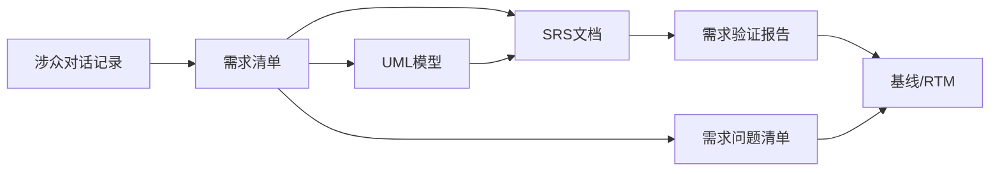

# 医疗器械租赁管理系统 — 知识库

> 本目录是 Obsidian Vault，用 Obsidian 打开 `.claude/knowledge-base/` 即可浏览。

## 目录结构

```
knowledge-base/
├── raw/notes/         ← 原始涉众对话（按时间戳命名）
├── wiki/summaries/    ← 结构化产出版本号命名）
├── wiki/baselines/    ← 基线冻结（每个基线一个子目录）
├── archive/           ← 归档
├── compile.js         ← 四维度验证脚本
└── .obsidian/         ← Obsidian 配置
```

## 阶段产出

| 阶段 | 产出 | 知识库路径 |
|------|------|-----------|
| A1 对话 | 4 份涉众对话记录 | `raw/notes/` |
| A1 汇总 | 需求清单 | `wiki/summaries/` |
| A2 分析 | 需求问题清单 | `wiki/summaries/` |
| A3 建模 | UML 用例图 + 活动图 + 说明 | `wiki/summaries/` |
| A4 文档 | SRS 需求规格说明书 | `wiki/summaries/` |
| A5 验证 | 需求验证报告 | `wiki/summaries/` |
| A6 基线 | SRS 正式版 + RTM + 基线报告 | `wiki/baselines/` |

## 如何运行

```bash
# 1. 运行工作流
python .claude/workflows/requirement_workflow.py

# 2. 验证知识库（在 knowledge-base 目录下）
cd .claude/knowledge-base
node compile.js
```

## 双向链接关系



## [[SRS-正式版]]

> 由 `requirement_workflow.py` 的 `call_llm()` 自动生成
