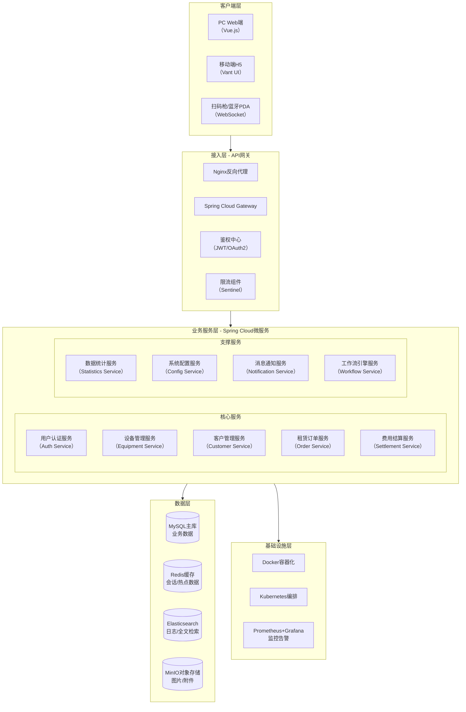
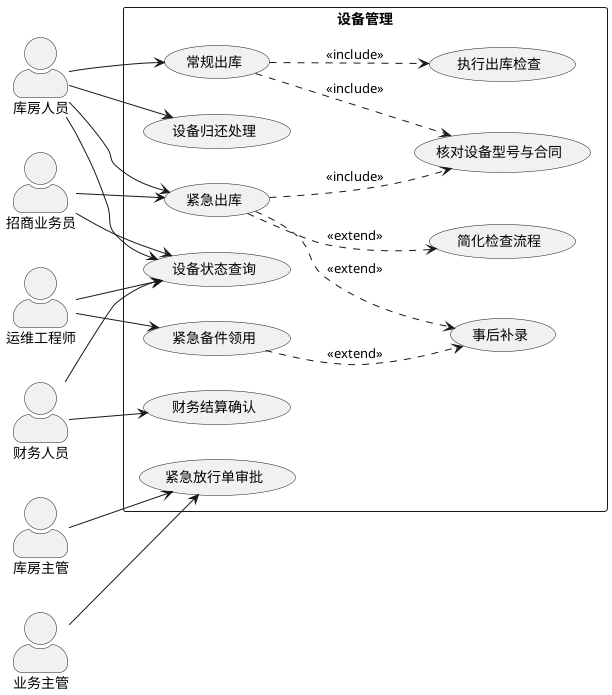
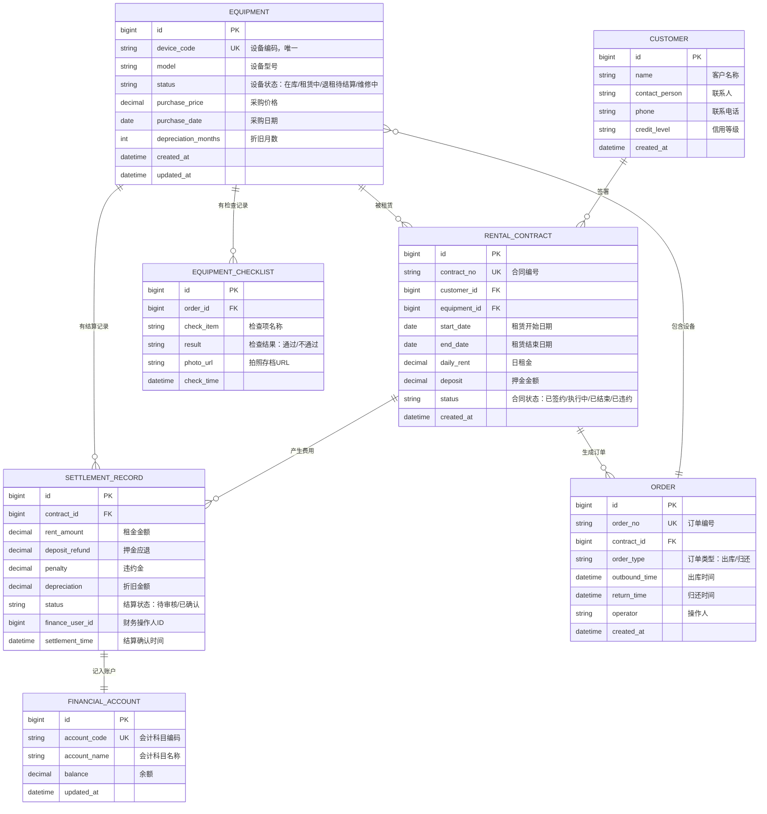
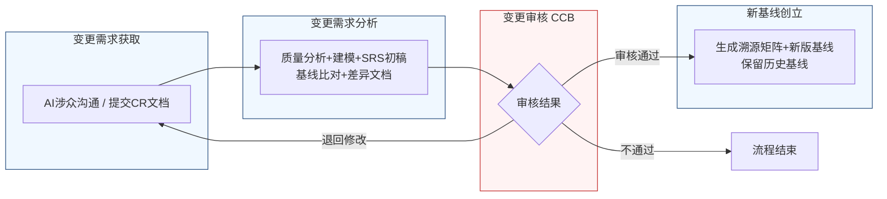

好的，作为一名资深需求分析工程师，我将严格遵循IEEE 830标准和GB/T 9385规范，采用两阶段法为您生成这份完整的软件需求规格说明书（SRS）。我将恪守“精确优先于流畅”的铁律，保留需求清单中的每一个数字、边界条件和约束参数。

---
# 文档头部信息
| 项目项 | 内容 |
| ---- | ---- |
| 文档名称 | 软件需求规格说明书（SRS）|
| 项目名称 | 医疗器械租赁管理系统 |
| 项目编号 | MED-RENTAL-2026 |
| 文档版本 | V1.0.0 |
| 基线版本 | BL-20260626-01 |
| 编制人 | 俞儿游 |
| 编制日期 | 2026-06-26 |
| 审核人 | 俞儿游 |
| 批准人 | 俞儿游 |
| 密级 | 内部 |

## 修订历史记录
| 版本号 | 修订日期 | 修订人 | 修订类型 | 修订内容简述 | 审批人 |
| ---- | ---- | ---- | ---- | ---- | ---- |
| V1.0.0 | 2026-06-26 | 俞儿游 | 新建 | 文档初稿，确立初始需求基线 | 俞儿游 |

# 1 引言
## 1.1 编制目的
本软件需求规格说明书（SRS）旨在为“医疗器械租赁管理系统”项目提供一份完整、一致、无歧义且可验证的需求定义。本文档的编制目的如下：
1.  **建立共识**：在客户、用户、项目管理者、开发团队和测试团队之间，就系统的功能、性能、外部接口和行为特性建立明确且一致的共识。
2.  **指导设计与开发**：为后续的系统设计、编码实现和单元测试提供精确的、可追溯的需求基线。
3.  **支撑测试与验收**：为系统测试、用户验收测试（UAT）提供可量化的验收标准和测试用例依据。
4.  **管理变更**：作为需求基线管理的核心文档，为后续的需求变更评估、影响分析和版本控制提供基础。

## 1.2 文档范围（包含/排除）
### 包含
本文档覆盖“医疗器械租赁管理系统”V1.0.0版本的全部需求，具体包括：
- **功能需求**：涵盖用户认证、设备管理、客户管理、租赁订单、费用结算、数据统计、系统配置等7大核心模块。
- **外部接口需求**：定义系统与外部系统（如ERP、财务系统、短信网关）及用户界面的交互方式。
- **非功能需求**：包括性能、可靠性、安全性、可维护性、可扩展性和易用性等方面的具体要求。
- **数据需求**：定义核心数据实体、数据字典及数据管理策略。

### 排除
本文档不包含以下内容：
- **项目计划**：如详细的开发时间表、资源分配和风险管理计划。
- **系统设计**：如软件架构设计、数据库物理设计、算法实现细节和用户界面（UI）的像素级设计稿。
- **测试计划**：如具体的测试用例、测试脚本和测试环境配置。
- **用户手册**：最终用户的操作指南和培训材料。
- **商业可行性分析**：如市场分析、投资回报率（ROI）计算。

## 1.3 引用文件
1.  GB/T 9385-2008《计算机软件需求规格说明规范》
2.  IEEE Std 830-1998《IEEE Recommended Practice for Software Requirements Specifications》
3.  《高级软件设计实践》教材书稿
4.  医疗器械租赁管理系统涉众需求调研记录（raw/notes/）
5.  医疗器械租赁管理系统UML建模产物
6.  医疗器械租赁管理系统结构化需求清单

## 1.4 术语与缩略语
| 术语/缩略语 | 定义 |
| ---- | ---- |
| SRS | 软件需求规格说明书 |
| CCB | 变更控制委员会，负责审批需求变更的权威组织 |
| CR | 变更需求，指对已基线化需求的修改请求 |
| FR | 功能需求，描述系统应执行的具体功能或服务 |
| NFR | 非功能需求，描述系统在功能之外应具备的属性，如性能、安全性 |
| IFR | 外部接口需求，描述系统与外部实体交互的约束 |
| BR | 业务需求，从业务角度出发的高层次目标 |
| UR | 用户需求，从用户角度出发的具体任务或目标 |
| P0 | 最高优先级需求，必须实现，否则系统无法上线或核心业务无法运转 |
| P1 | 重要优先级需求，必须实现，否则系统功能不完整或用户体验严重受损 |
| P2 | 次要优先级需求，在资源允许的情况下实现，用于提升用户体验或系统易用性 |
| EQP | 设备管理模块的缩写 |
| FIN | 费用结算模块的缩写 |
| SOP | 标准操作流程 |
| RTM | 需求追溯矩阵 |

## 1.5 业务背景概述
### 现状痛点
当前医疗器械租赁业务主要依赖线下手工操作和分散的电子表格进行管理，存在以下核心痛点：
1.  **设备出库风险高**：紧急出库流程缺乏标准化管控，设备型号与合同核对环节易被跳过，导致错发、客户纠纷及财务核算错误。
2.  **设备归还流程断裂**：设备归还后，库房与财务流程脱节。库房无法在验收完成后自动触发设备状态变更，财务无法在设备归还后同步启动违约金和折旧核算，导致设备周转效率低、账实不符。
3.  **紧急流程缺乏风控**：紧急出库和备件领用流程缺乏严格的审批和事后补录机制，存在资产流失和流程合规风险。
4.  **信息孤岛**：库房、财务、运维、业务等部门数据不共享，导致信息传递滞后，决策效率低下。

### 建设目标
建设一套统一的医疗器械租赁管理系统，实现以下量化业务目标：
1.  **设备出库准确率**：将因型号错发导致的客户纠纷率降低至0.1%以下（当前基线为1.5%）。
2.  **设备周转效率**：将设备归还后进入“在库”可分配状态的平均时间从当前的72小时缩短至24小时以内。
3.  **紧急流程合规率**：确保100%的紧急出库和备件领用流程都经过审批并完成事后补录。
4.  **财务核算准确性**：实现设备租赁相关费用（租金、押金、违约金、折旧）的自动核算，将人工核算错误率降低至0.01%以下。

# 2 总体描述
## 2.1 产品概述（系统定位、核心价值）
**系统定位**：本系统是一套面向医疗器械租赁公司的企业级业务管理平台，旨在通过信息化手段，实现设备从入库、租赁、出库、归还到结算的全生命周期闭环管理。

**核心价值**：
1.  **流程标准化**：固化常规和紧急出库、设备归还等核心业务流程，确保操作合规、风险可控。
2.  **业财一体化**：打通库房操作与财务核算环节，实现设备状态与财务数据的实时同步，消除信息孤岛。
3.  **风险管控精细化**：通过审批流、事后补录、责任追溯等机制，实现对紧急业务场景的精细化风险管控。
4.  **运营效率最大化**：通过自动化核算、状态自动流转等功能，缩短业务处理周期，提升设备周转率和人员工作效率。

### 系统架构图（Mermaid代码）

## 2.2 运行环境要求
### 硬件环境
| 组件 | 最低配置 | 推荐配置 |
| ---- | ---- | ---- |
| 应用服务器 | 4核CPU，16GB RAM，100GB SSD | 8核CPU，32GB RAM，200GB SSD |
| 数据库服务器 | 8核CPU，32GB RAM，500GB SSD | 16核CPU，64GB RAM，1TB NVMe SSD |
| 缓存服务器 | 2核CPU，8GB RAM，50GB SSD | 4核CPU，16GB RAM，100GB SSD |

### 软件环境
| 组件 | 技术选型 | 版本要求 |
| ---- | ---- | ---- |
| 操作系统 | CentOS / Ubuntu | CentOS 7.9+ / Ubuntu 20.04+ |
| 数据库 | MySQL | 8.0.28+ |
| 缓存 | Redis | 6.2.6+ |
| 应用服务器 | JDK | OpenJDK 11+ |
| 反向代理 | Nginx | 1.20.1+ |
| 容器化 | Docker | 20.10.12+ |
| 容器编排 | Kubernetes | 1.23.0+ |

### 浏览器兼容性
| 浏览器 | 最低版本 | 备注 |
| ---- | ---- | ---- |
| Google Chrome | 90+ | 主要支持目标 |
| Mozilla Firefox | 88+ | 次要支持目标 |
| Microsoft Edge | 90+ | 基于Chromium内核 |
| Safari | 14+ | 仅支持移动端H5页面 |

## 2.3 用户角色与特征
| 角色 | 职责描述 | 核心权限 | 使用频次 | 技能特征 |
| ---- | ---- | ---- | ---- | ---- |
| 库房人员 | 负责设备入库、出库、归还、盘点等日常操作 | 设备出入库操作、设备状态查询、紧急放行单执行 | 每日多次 | 熟悉库房SOP，能操作扫码设备 |
| 财务人员 | 负责租金、押金、违约金等费用的核算与结算 | 费用结算确认、预结算单审核、财务数据查询 | 每日多次 | 熟悉财务核算规则，具备财务知识 |
| 运维工程师 | 负责设备维修、保养、紧急备件领用 | 紧急备件领用、设备维修记录、设备状态查询 | 每日多次 | 具备医疗器械维修技能，熟悉设备型号 |
| 招商业务员 | 负责客户开发、合同签订、紧急出库申请 | 发起紧急出库申请、客户信息查询、合同查看 | 每日多次 | 熟悉业务谈判流程，了解租赁合同条款 |
| 库房主管 | 负责库房日常管理，审批紧急放行单 | 紧急放行单审批、库房人员管理、设备状态查询 | 每日数次 | 具备库房管理经验，熟悉风险控制流程 |
| 业务主管 | 负责业务团队管理，审批紧急放行单 | 紧急放行单审批、业务员管理、客户信息查看 | 每日数次 | 具备业务管理经验，熟悉合同风险 |
| 系统管理员 | 负责系统配置、用户权限管理、数据维护 | 用户管理、角色权限配置、系统参数设置、日志查看 | 每周数次 | 具备IT系统管理经验，熟悉系统架构 |

## 2.4 系统运行模式
### 正常模式
系统在正常工作时间内，所有功能模块均可正常访问和使用。用户通过身份认证后，根据其角色权限执行相应操作。系统响应时间、并发处理能力等性能指标应满足非功能需求中的规定。

### 异常模式
当系统出现部分模块故障或性能下降时，系统应进入异常模式。
1.  **降级运行**：核心业务模块（如设备出库、归还）应保持可用，非核心模块（如数据统计）可暂时降级或不可用。
2.  **熔断保护**：当某个微服务响应时间超过阈值（如5秒）或错误率达到阈值（如50%），网关应在500ms内触发熔断并返回失败响应，防止雪崩效应。
3.  **限流**：当系统整体请求量超过预设阈值（如1000 TPS），网关应启动限流策略，对超出部分的请求返回“服务繁忙”提示。

### 维护模式
当系统需要进行计划内停机维护或紧急漏洞修复时，系统应进入维护模式。
1.  **维护通知**：系统应在维护开始前至少30分钟，通过系统公告或短信通知所有在线用户。
2.  **服务暂停**：维护期间，所有用户请求将被重定向到一个静态的“系统维护中”页面。
3.  **数据备份**：在进入维护模式前，系统应自动触发一次全量数据备份。
4.  **恢复上线**：维护完成后，系统应在30分钟内恢复全部服务，并自动执行数据完整性校验。

## 2.5 设计与实现约束
### 技术约束
1.  **微服务架构**：系统必须采用Spring Cloud微服务架构进行开发，以实现模块解耦、独立部署和弹性伸缩。
2.  **前后端分离**：前端必须采用Vue.js框架，后端提供RESTful API接口，通过JSON格式进行数据交互。
3.  **数据库选型**：业务数据必须使用MySQL关系型数据库，缓存数据必须使用Redis。
4.  **容器化部署**：所有微服务必须支持Docker容器化，并能部署在Kubernetes集群上。

### 合规约束
1.  **数据安全**：系统必须符合《中华人民共和国网络安全法》和《个人信息保护法》的相关规定，对用户敏感信息（如手机号、身份证号）进行加密存储和脱敏展示。
2.  **医疗器械监管**：系统对设备的管理必须满足医疗器械经营质量管理规范（GSP）的相关要求，如设备唯一标识（UDI）管理、效期预警等。

### 接口约束
1.  **API设计规范**：所有对外API必须遵循RESTful设计风格，使用统一的返回格式（`{code, message, data}`）。
2.  **接口版本管理**：API接口必须进行版本管理（如 `/api/v1/equipment`），以支持向后兼容。

### 工期约束
1.  **里程碑节点**：系统V1.0.0版本必须在2026-06-26前完成开发、测试并具备上线条件。

## 2.6 假设与依赖
### 假设
1.  **用户培训**：假设所有最终用户（库房人员、财务人员等）在系统上线前均已完成必要的操作培训。
2.  **网络环境**：假设用户工作场所的网络环境稳定，能够支持系统正常运行。
3.  **硬件到位**：假设项目所需的服务器、扫码枪等硬件设备在系统开发完成前已采购并部署到位。

### 依赖
1.  **外部系统接口**：本系统的费用结算模块依赖于外部ERP系统的客户信用额度查询接口和财务系统的总账接口。这些接口的可用性和稳定性是本系统正常运行的前提。
2.  **短信网关服务**：本系统的消息通知服务依赖于外部短信网关服务提供商的API。短信发送的时效性（单条短信端到端送达时间不超过30秒）和到达率依赖于该服务商的服务质量。

# 3 具体需求
## 3.1 功能需求（FR）
### 3.1.1 用户认证模块
**FR-AUTH-001**：用户登录
- **优先级**：P0
- **参与角色**：所有用户
- **前置条件**：用户已拥有系统账号，且账号状态为“启用”。
- **触发方式**：用户在登录页面输入用户名和密码，点击“登录”按钮。
- **业务流程**：
    1.  系统接收用户输入的用户名和密码。
    2.  系统对密码进行加密（BCrypt算法）后，与数据库中存储的密文进行比对。
    3.  若比对成功，系统生成一个有效期为30分钟的JWT Token。
    4.  系统将Token返回给前端，前端将其存储在localStorage中。
    5.  系统根据用户角色加载对应的功能菜单和权限。
- **业务规则**：
    1.  密码输入错误次数在5分钟内累计达到5次，该账号将被锁定15分钟。
    2.  JWT Token在签发后30分钟内有效，超过30分钟需重新登录。
    3.  用户连续7天未登录，系统将发送提醒邮件。
- **后置状态**：用户成功登录系统，进入首页。
- **验收标准**：
    1.  输入正确的用户名和密码，能在2秒内成功登录并跳转至首页。
    2.  输入错误的密码，系统应在1秒内提示“用户名或密码错误”。
    3.  连续5次输入错误密码，账号被锁定，并提示“账号已被锁定，请15分钟后重试”。
    4.  使用过期的Token访问任何API，系统应返回401状态码。
- **关联需求条目**：无

### 3.1.2 设备管理模块
**FR-EQP-001**：常规出库
- **优先级**：P0
- **参与角色**：库房人员
- **前置条件**：存在一个状态为“在库”的设备，且存在一个关联该设备的、状态为“已签约”的租赁合同。
- **触发方式**：库房人员在设备管理界面，选择一个“在库”设备，点击“出库”按钮。
- **业务流程**：
    1.  系统加载出库页面，显示待出库设备信息和关联合同信息。
    2.  **步骤1：核对设备型号与合同一致**。系统强制要求库房人员扫描设备上的条码或手动输入设备编号，系统自动与合同中的设备型号进行比对。
        - 若型号一致，进入下一步。
        - 若型号不一致，系统弹出警告“设备型号与合同不符，禁止出库！”，并终止流程。
    3.  **步骤2：执行出库检查**。系统展示标准检查清单，库房人员需逐项勾选并拍照存档。检查项包括但不限于：
        - 外观检查（无破损、划痕）
        - 核心附件检查（电源线、探头、电池等）
        - 通电自检（设备正常开机、无故障代码）
        - 校准证书有效期检查
    4.  所有检查项完成后，库房人员点击“确认出库”。
    5.  系统更新设备状态为“租赁中”，并记录出库时间、操作人、检查清单及照片。
    6.  系统生成出库单，并触发消息通知业务员。
- **业务规则**：
    1.  检查清单中的每一项都必须勾选（通过/不通过）并拍照，不允许跳过。
    2.  若任何一项检查结果为“不通过”，系统禁止出库，并提示库房人员联系运维工程师处理。
    3.  出库单号生成规则：`CK-YYYYMMDD-NNNN`（YYYYMMDD=日期，NNNN=当日流水号，从0001开始）。
- **后置状态**：设备状态从“在库”变为“租赁中”。
- **验收标准**：
    1.  扫描一个与合同型号不符的设备，系统应弹出警告并终止出库流程。
    2.  检查清单中任何一项未勾选或未拍照，系统应提示“请完成所有检查项”并禁止提交。
    3.  完成所有步骤后，设备状态应在1秒内更新为“租赁中”。
    4.  生成的出库单号应符合规则 `CK-YYYYMMDD-NNNN`。
- **关联需求条目**：BR-EQP-001, UR-EQP-001, BR-EQP-007, UR-EQP-007, BR-EQP-011, UR-EQP-011

**FR-EQP-002**：紧急出库
- **优先级**：P0
- **参与角色**：招商业务员、库房主管、业务主管、库房人员
- **前置条件**：存在一个状态为“在库”的设备。客户要求设备在2小时内送达。
- **触发方式**：招商业务员在系统内发起“紧急出库申请”。
- **业务流程**：
    1.  **业务员发起申请**：业务员选择设备，填写《紧急放行单》，注明客户紧急需求、简化检查原因，并书面承诺“因未检查项导致的后续成本由本人协调客户承担或使用项目备用金”。
    2.  **库房主管审批**：系统将申请推送至库房主管。库房主管审核申请内容，若同意则签署确认；若不同意则驳回，流程终止。
    3.  **业务主管审批**：库房主管审批通过后，系统将申请推送至业务主管。业务主管审核申请内容，若同意则签署确认；若不同意则驳回，流程终止。
    4.  **库房人员执行简化检查**：两级审批通过后，系统通知库房人员。库房人员执行简化检查清单（仅包含：外观检查、核心附件检查、通电自检）。
    5.  **设备出库**：简化检查通过后，库房人员执行设备出库操作。业务员在工单上签字确认。
    6.  **事后补录**：系统记录紧急出库日志，并触发事后补录提醒。库房人员需在出库后24小时内，完成标准检查清单中遗漏项的补录和拍照存档。
- **业务规则**：
    1.  紧急出库流程必须遵循“先审批、后出库”的原则，不可颠倒。
    2.  紧急放行单必须包含业务员的书面承诺条款。
    3.  简化检查清单为固定三项：外观、核心附件、通电自检。
    4.  事后补录时限为出库后24小时。超过24小时未补录，系统将向库房主管和业务主管发送告警。
    5.  紧急出库的设备，其状态在补录完成前标记为“紧急出库-待补录”。
- **后置状态**：设备状态变为“租赁中”。若24小时内未完成补录，系统持续告警。
- **验收标准**：
    1.  业务员发起的紧急出库申请，必须经过库房主管和业务主管两级审批后才能进入执行环节。
    2.  库房人员看到的检查清单仅为3项，而非标准清单。
    3.  出库后，设备状态显示为“紧急出库-待补录”。
    4.  出库后超过24小时未补录，系统应自动向主管发送告警通知。
- **关联需求条目**：BR-EQP-003, UR-EQP-003, BR-EQP-009, UR-EQP-009, BR-EQP-010, UR-EQP-010

**FR-EQP-003**：设备归还处理
- **优先级**：P0
- **参与角色**：库房人员、财务人员
- **前置条件**：设备状态为“租赁中”。
- **触发方式**：库房人员接收到客户退回的设备，在系统中点击“设备归还”。
- **业务流程**：
    1.  **库房人员操作**：库房人员扫描设备条码，系统显示设备信息和关联合同。库房人员执行设备检查，记录设备状态（正常/损坏/缺失附件）。
        - 若设备状态正常，库房人员点击“确认归还”。
        - 若设备状态异常（损坏、缺失），库房人员需记录损坏/缺失详情，并启动索赔流程。
    2.  **系统自动处理**：库房人员确认归还后，系统自动执行以下操作：
        - 更新设备状态为“退租待结算”。
        - 触发财务核算任务。
    3.  **财务核算**：系统自动预计算以下数据：
        - 租金应收（根据合同租赁周期和日租金计算）。
        - 押金应退差额（押金总额 - 应扣款项）。
        - 违约金（根据合同条款，如提前退租或超期归还）。
        - 剩余折旧核对（设备原值 - 已计提折旧）。
    4.  **财务人员审核**：财务人员查看预结算单，核对数据。
        - 若数据无误，财务人员手动点击“确认结算”按钮。
        - 若数据有误，财务人员可修改数据，系统自动重新核算，然后财务人员点击“确认结算”。
    5.  **状态变更**：财务人员点击“确认结算”后，系统更新设备状态为“在库”，并更新财务账目。
- **业务规则**：
    1.  设备归还后，状态必须首先变为“退租待结算”，不能直接变为“在库”。
    2.  从“退租待结算”变为“在库”的唯一触发条件是财务人员手动点击“确认结算”。
    3.  财务人员应在设备进入“退租待结算”状态后的24小时内完成审核确认。
    4.  若设备状态异常，索赔流程未完成前，设备状态不能变为“在库”。
- **后置状态**：设备状态从“租赁中” -> “退租待结算” -> “在库”（财务确认后）。
- **验收标准**：
    1.  库房人员确认归还后，设备状态应立即变为“退租待结算”。
    2.  在“退租待结算”状态下，财务人员可以看到系统预计算的租金、押金、违约金、折旧数据。
    3.  只有财务人员点击“确认结算”按钮后，设备状态才会变为“在库”。
    4.  财务人员修改预结算单数据后，系统应自动重新计算所有关联数据。
- **关联需求条目**：BR-EQP-002, UR-EQP-002, BR-EQP-004, UR-EQP-004, BR-EQP-005, UR-EQP-005, BR-EQP-006, UR-EQP-006, BR-EQP-008, UR-EQP-008

**FR-EQP-004**：紧急备件领用
- **优先级**：P1
- **参与角色**：运维工程师
- **前置条件**：运维工程师在现场识别到设备紧急故障，且故障等级满足“紧急”条件（根据预设的“设备类型-故障代码-严重等级”映射表）。
- **触发方式**：运维工程师在移动端H5页面发起“紧急备件领用”申请。
- **业务流程**：
    1.  **临时台账登记**：运维工程师手动登记临时台账，记录工号、设备编号、预估价值。
    2.  **备件领用**：系统记录临时台账，并启动2小时补录计时。运维工程师领用备件，执行现场维修。
    3.  **事后补录**：维修完成后，运维工程师需在2小时内，通过扫描设备条码，完成正式出库记录。
        - 若在2小时内完成补录，系统关闭临时台账，更新库存数据。
        - 若超过2小时未完成补录，系统触发超时警告。
            - 若该运维工程师超时次数累计达到1次，系统冻结其领用权限，并通知主管。
            - 若超时次数未达到1次，系统记录违规一次，强制要求补录。
- **业务规则**：
    1.  紧急备件领用必须基于“现场运维工程师初步判定 + 值班经理事后确认”的双轨机制。
    2.  事后补录的时限为2小时，精确到秒。
    3.  超时次数累计达到1次，领用权限被冻结，需主管手动解冻。
- **后置状态**：备件库存减少，临时台账关闭。
- **验收标准**：
    1.  运维工程师登记临时台账后，系统应开始2小时倒计时。
    2.  在2小时内完成补录，系统应正常更新库存。
    3.  超过2小时未补录，系统应发出警告。
    4.  超时次数达到1次，系统应自动冻结该运维工程师的领用权限。
- **关联需求条目**：BR-EQP-012, UR-EQP-012, BR-EQP-013, UR-EQP-013, BR-EQP-014, UR-EQP-014

### 3.1.3 系统用例图（PlantUML代码）

## 3.2 外部接口需求（IFR）

### 3.2.1 内部接口（模块间调用）
系统内部各微服务模块之间通过RESTful API进行同步通信，通过消息队列进行异步通信。

| 接口编号 | 接口名称 | 提供方 | 消费方 | 协议 |
| ---- | ---- | ---- | ---- | ---- |
| IFR-INT-001 | 用户认证Token校验 | 用户认证服务 | 全部业务服务 | HTTPS/REST |
| IFR-INT-002 | 设备状态查询 | 设备管理服务 | 租赁订单服务 | HTTPS/REST |
| IFR-INT-003 | 设备出库触发费用核算 | 租赁订单服务 | 费用结算服务 | 消息队列 |

### 3.2.2 外部系统接口

**IFR-API-001：短信通知接口**
- **接口描述**：系统通过调用第三方短信网关API，向用户发送审批待办、状态变更等通知。
- **输入**：手机号码、短信内容（不超过70个汉字）。
- **输出**：发送成功/失败状态。
- **协议**：HTTPS，JSON格式。
- **性能要求**：单次请求响应时间不超过2秒。
- **安全策略**：接口签名验证 + 数据传输加密。

**IFR-SMTP-001：邮件通知接口**
- **接口描述**：系统通过SMTP协议连接邮件服务器，向用户发送详细的通知邮件。
- **输入**：收件人邮箱地址、邮件主题、邮件正文（支持HTML格式）。
- **输出**：发送成功/失败状态。
- **协议**：SMTP。
- **性能要求**：单次请求响应时间不超过5秒。

**IFR-FILE-001：费用数据导出接口**
- **接口描述**：系统提供标准接口，支持将费用结算数据导出为Excel (.xlsx) 格式文件。
- **输入**：报表查询参数（如时间范围、合同编号等）。
- **输出**：一个可下载的`.xlsx`文件。
- **协议**：HTTPS，文件流下载。
- **性能要求**：对于不超过10万条数据的报表，生成时间不超过30秒。

### E-R图（Mermaid erDiagram）

### 数据字典（核心表）
| 表名 | 字段名 | 数据类型 | 主键 | 外键 | 默认值 | 说明 |
| ---- | ---- | ---- | ---- | ---- | ---- | ---- |
| EQUIPMENT | id | BIGINT | Y | N | AUTO_INCREMENT | 设备唯一标识 |
| EQUIPMENT | device_code | VARCHAR(64) | N | N | N/A | 设备编码，唯一索引 |
| EQUIPMENT | model | VARCHAR(128) | N | N | N/A | 设备型号 |
| EQUIPMENT | status | VARCHAR(32) | N | N | '在库' | 设备状态 |
| EQUIPMENT | purchase_price | DECIMAL(10,2) | N | N | 0.00 | 采购价格 |
| EQUIPMENT | purchase_date | DATE | N | N | N/A | 采购日期 |
| EQUIPMENT | depreciation_months | INT | N | N | 60 | 折旧月数，默认60个月 |
| CUSTOMER | id | BIGINT | Y | N | AUTO_INCREMENT | 客户唯一标识 |
| CUSTOMER | name | VARCHAR(128) | N | N | N/A | 客户名称 |
| CUSTOMER | phone | VARCHAR(20) | N | N | N/A | 联系电话 |
| RENTAL_CONTRACT | id | BIGINT | Y | N | AUTO_INCREMENT | 合同唯一标识 |
| RENTAL_CONTRACT | contract_no | VARCHAR(64) | N | N | N/A | 合同编号，唯一索引 |
| RENTAL_CONTRACT | customer_id | BIGINT | N | Y (CUSTOMER.id) | N/A | 客户ID |
| RENTAL_CONTRACT | equipment_id | BIGINT | N | Y (EQUIPMENT.id) | N/A | 设备ID |
| RENTAL_CONTRACT | daily_rent | DECIMAL(10,2) | N | N | 0.00 | 日租金 |
| RENTAL_CONTRACT | deposit | DECIMAL(10,2) | N | N | 0.00 | 押金金额 |
| ORDER | id | BIGINT | Y | N | AUTO_INCREMENT | 订单唯一标识 |
| ORDER | order_no | VARCHAR(64) | N | N | N/A | 订单编号，唯一索引 |
| ORDER | contract_id | BIGINT | N | Y (RENTAL_CONTRACT.id) | N/A | 合同ID |
| SETTLEMENT_RECORD | id | BIGINT | Y | N | AUTO_INCREMENT | 结算记录唯一标识 |
| SETTLEMENT_RECORD | contract_id | BIGINT | N | Y (RENTAL_CONTRACT.id) | N/A | 合同ID |
| SETTLEMENT_RECORD | status | VARCHAR(32) | N | N | '待审核' | 结算状态 |

## 3.3 非功能需求（NFR）
### 3.3.1 性能需求
1.  **页面加载时间**：在标准网络环境下（带宽10Mbps），所有核心业务页面（如设备列表、出库页面）的首次加载时间不得超过2秒。
2.  **接口响应时间**：
    - 95%的简单查询接口（如根据ID查询设备）的响应时间不得超过200毫秒。
    - 95%的复杂业务接口（如提交出库单）的响应时间不得超过1秒。
    - 100%的接口响应时间不得超过5秒。
3.  **并发用户数**：系统应支持至少200名用户同时在线操作。
4.  **吞吐量**：系统核心交易接口（如出库、归还）应支持至少50 TPS（每秒事务数）的峰值处理能力。
5.  **扫码响应**：系统在接收到扫码枪输入后，应在500毫秒内完成设备信息查询并返回结果。

### 3.3.2 可靠性需求
1.  **系统可用率**：系统在7x24小时运行周期内，可用率不得低于99.9%（即年度计划外停机时间不超过8.76小时）。
2.  **连续运行**：系统应支持7x24小时不间断运行，无需定期重启。
3.  **故障恢复**：
    - 当单个微服务实例发生故障时，系统应在30秒内自动切换至其他健康实例，业务不中断。
    - 当数据库主库发生故障时，系统应在60秒内完成主从切换，数据丢失量不得超过1分钟。
4.  **数据备份**：系统应每天凌晨2:00自动执行一次全量数据备份，备份数据保留周期为30天。

### 3.3.3 安全性需求
1.  **用户认证**：所有用户必须通过用户名+密码的方式进行身份认证。密码必须满足复杂度要求（至少8位，包含大写字母、小写字母、数字和特殊字符中的至少3种）。
2.  **权限控制**：系统必须实现基于角色的访问控制（RBAC），确保用户只能访问其角色授权的功能和数据。
3.  **数据加密**：
    - 用户密码在数据库中的存储必须使用BCrypt算法进行哈希加密。
    - 用户手机号、身份证号等敏感信息在数据库中必须使用AES-256算法进行加密存储。
    - 前端与后端之间的所有数据传输必须使用HTTPS协议进行加密。
4.  **攻击防护**：系统应具备基本的Web应用防火墙（WAF）能力，能够防御SQL注入、跨站脚本攻击（XSS）、跨站请求伪造（CSRF）等常见网络攻击。
5.  **审计日志**：系统必须记录所有用户的关键操作日志（如登录、出库、归还、结算确认），日志内容包括操作人、操作时间、IP地址、操作内容、操作结果。日志保留周期不得少于180天。

### 3.3.4 可维护性需求
1.  **日志记录**：系统所有微服务必须采用统一的日志框架（如Logback），日志格式必须包含时间戳、服务名、线程名、日志级别、类名、行号、消息内容。
2.  **配置管理**：所有与环境相关的配置（如数据库连接、Redis地址）必须外部化，通过配置中心（如Nacos）进行统一管理，支持运行时动态刷新。
3.  **监控告警**：系统必须集成Prometheus和Grafana，对CPU、内存、磁盘、网络、JVM、接口QPS、接口响应时间等关键指标进行监控，并在指标超过阈值时触发告警。

### 3.3.5 可扩展性需求
1.  **水平扩展**：所有无状态微服务（如设备管理服务、订单服务）必须支持通过增加实例数量来实现水平扩展，以应对业务增长带来的负载压力。
2.  **模块化**：系统采用微服务架构，新增业务功能应以独立微服务的方式接入，对现有服务的影响应最小化。

### 3.3.6 易用性需求
1.  **操作一致性**：系统中所有列表页的操作按钮（如“新增”、“编辑”、“删除”）应位于相同位置，且功能一致。
2.  **错误提示**：当用户操作失败时，系统应提供明确、友好的错误提示信息，说明失败原因和解决建议。禁止显示技术栈相关的错误信息（如“NullPointerException”）。
3.  **扫码支持**：所有需要输入设备编号的页面，必须支持扫码枪输入，并自动触发查询或提交操作。

## 3.4 数据需求
### 数据字典
（已在3.2节中提供核心表的数据字典，此处补充完整数据管理策略）

### 数据管理策略
1.  **备份策略**：
    - **全量备份**：每天凌晨2:00执行一次MySQL全量备份，使用`mysqldump`工具，备份文件压缩后存储至MinIO对象存储。
    - **增量备份**：每1小时对MySQL的binlog进行一次增量备份，用于实现时间点恢复（PITR）。
    - **备份保留**：全量备份文件保留30天，增量备份文件保留7天。
2.  **归档策略**：
    - 对于超过3年的历史订单和结算记录，系统应支持将其从主业务库归档至历史库，以提升主库的查询性能。
    - 归档操作由系统管理员手动触发，或通过定时任务每月执行一次。
3.  **数据留存**：
    - 用户账号数据：在用户注销账号后，系统将保留其数据至少180天，以备法律审计之需。180天后，系统将匿名化处理所有个人身份信息。
    - 操作日志数据：保留周期为180天，超过180天的日志将被自动清理。

# 4 需求基线与变更管理
## 4.1 需求基线定义
1.  **基线版本格式**：`BL-YYYYMMDD-NN`（YYYYMMDD=日期，NN=当日流水号，从01开始）。例如，初始基线为 `BL-20260626-01`。
2.  **初始基线**：经CCB变更控制委员会审批通过、正式发布的第一版SRS（即本文档V1.0.0）所定义的需求集合。
3.  **基线冻结**：基线发布后，所有需求条目进入冻结状态。任何对基线需求的修改（包括新增、修改、删除），都必须遵循本章节定义的变更流程，禁止任何形式的私自修改。

## 4.2 需求变更整体流程

## 4.3 变更详细流程（四阶段）
### 4.3.1 阶段一：变更需求获取
变更需求可通过以下两种途径获取：
1.  **AI涉众沟通**：AI基线智能体（A6）主动与涉众（库房人员、财务人员等）进行沟通，识别新的或变更的需求。
2.  **正式CR文档**：需求提出方（如业务部门）填写正式的《变更需求（CR）文档》，提交至CCB。

### 4.3.2 阶段二：变更需求分析（4个子阶段）
1.  **需求质量分析**：对获取的变更需求进行校验，确保其合理性、完整性、无歧义性、可测试性。
2.  **项目建模**：根据变更需求，更新相关的UML用例图、活动图、E-R图等模型。
3.  **SRS初稿生成**：基于分析结果，整合输出包含变更内容的SRS初稿。
4.  **基线比对**：读取当前生效的历史基线，生成《需求差异文档》，清晰展示变更前后条目的增、删、改情况。

### 4.3.3 阶段三：变更审核（CCB评审）
CCB变更控制委员会对变更需求及分析产物进行评审。
1.  **审核不通过**：流程终止，变更需求被拒绝。
2.  **审核退回修改**：CCB提出修改意见，返回至“变更需求获取”阶段，由需求提出方修改后重新提交。
3.  **审核通过**：CCB批准变更，进入新基线创立环节。

### 4.3.4 阶段四：新基线创立
1.  **生成需求溯源矩阵（RTM）**：建立变更前后需求条目的映射关系，确保所有需求均可追溯。
2.  **发布新版基线**：将CCB审核通过的SRS定为新的正式基线，并沿用版本规则生成新基线编号（如 `BL-20260701-01`）。
3.  **历史基线归档**：历史基线文档完整归档，不覆盖、不删除，以备后续查阅。

## 4.4 变更记录台账
| 变更编号 | 变更日期 | 申请人 | 变更来源(AI/CR) | 变更简述 | 影响模块 | CCB结论 | 新版基线号 |
| ---- | ---- | ---- | ---- | ---- | ---- | ---- | ---- |
| — | 2026-06-26 | — | 初始基线 | 初始基线，无历史变更 | — | 通过 | BL-20260626-01 |

# 5 附录
## 附录A 全量图表汇总
- **系统架构图**：见 §2.1
- **系统用例图**：见 §3.1.3
- **E-R图**：见 §3.2
- **变更流程图**：见 §4.2

## 附录B 验收标准总表
| 需求编号 | 需求名称 | 验收标准 | 优先级 |
| ---- | ---- | ---- | ---- |
| FR-EQP-001 | 常规出库 | 1. 扫描型号不符的设备，系统警告并终止流程。2. 检查清单未完成，系统禁止提交。3. 完成后设备状态1秒内变为“租赁中”。4. 出库单号符合 `CK-YYYYMMDD-NNNN` 规则。 | P0 |
| FR-EQP-002 | 紧急出库 | 1. 申请必须经库房主管和业务主管两级审批。2. 检查清单仅为3项。3. 出库后状态为“紧急出库-待补录”。4. 超24小时未补录，系统向主管告警。 | P0 |
| FR-EQP-003 | 设备归还处理 | 1. 归还后状态变为“退租待结算”。2. 财务可看到预计算数据。3. 仅财务“确认结算”后状态变为“在库”。4. 财务修改数据后系统自动重算。 | P0 |
| FR-EQP-004 | 紧急备件领用 | 1. 登记后开始2小时倒计时。2. 2小时内补录，库存正常更新。3. 超2小时未补录，系统警告。4. 超时1次后，领用权限被冻结。 | P1 |

## 附录C 参考资料与外部文档链接
1.  GB/T 9385-2008 计算机软件需求规格说明规范
2.  IEEE 830 软件需求规格说明书标准
3.  《高级软件设计实践》教材书稿
4.  医疗器械租赁管理系统涉众需求调研记录（raw/notes/）
5.  医疗器械租赁管理系统UML建模产物
6.  医疗器械租赁管理系统结构化需求清单