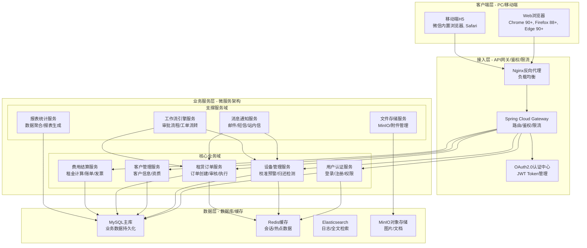
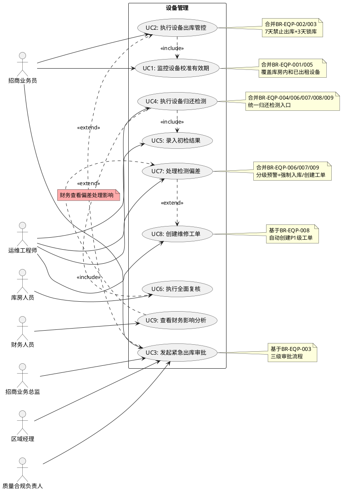
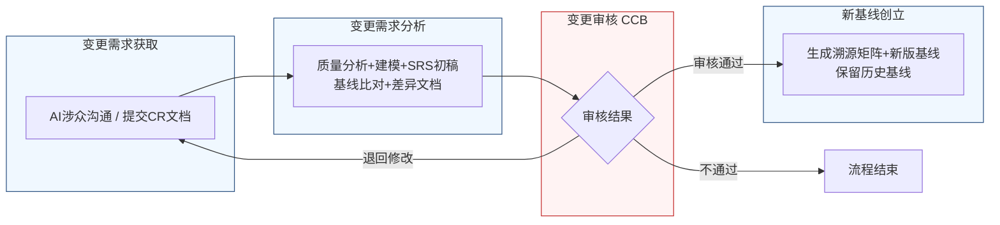

好的，作为一名资深需求分析工程师，我将严格遵循您的指示，采用两阶段法，并恪守“精确优先于流畅”的铁律，为您生成这份完整的软件需求规格说明书（SRS）。

---

# 文档头部信息

| 项目项 | 内容 |
| ---- | ---- |
| 文档名称 | 软件需求规格说明书（SRS）|
| 项目名称 | 医疗器械租赁管理系统 |
| 项目编号 | MED-RENTAL-2026 |
| 文档版本 | V1.0.0 |
| 基线版本 | BL-20260626-01 |
| 编制人 | AI基线智能体（A6） |
| 编制日期 | 2026-06-26 |
| 审核人 | CCB变更控制委员会 |
| 批准人 | CCB变更控制委员会 |
| 密级 | 内部 |

## 修订历史记录
| 版本号 | 修订日期 | 修订类型 | 修订内容简述 |
| ---- | ---- | ---- | ---- |
| V1.0.0 | 2026-06-26 | 新建 | 文档初稿，确立初始需求基线 |

# 1 引言

## 1.1 编制目的
本软件需求规格说明书（SRS）旨在为“医疗器械租赁管理系统”项目（项目编号：MED-RENTAL-2026）的后续设计、开发、测试、验收及交付提供一份精确、完整、无歧义的需求基线。本文档严格遵循IEEE 830-1998标准及GB/T 9385-2008规范，确保所有功能需求、非功能需求、外部接口及数据需求均具备可验证性、可追溯性及一致性。本文档是项目团队（包括产品经理、架构师、开发工程师、测试工程师、运维人员）及所有相关涉众（包括招商业务员、运维工程师、库房人员、财务人员、管理层）之间达成共识的权威依据。

## 1.2 文档范围（包含/排除）

### 包含范围
本SRS覆盖“医疗器械租赁管理系统”的以下核心业务领域：
1.  **设备全生命周期管理**：涵盖设备从入库、出库、租赁、归还检测、维修到报废的全过程，重点关注校准有效期预警、归还检测偏差处理等关键环节。
2.  **客户与合同管理**：管理客户信息、资质、合同签订、合同执行状态。
3.  **租赁订单管理**：处理租赁订单的创建、审核、执行、变更及完结。
4.  **费用结算管理**：处理租金计算、押金管理、费用催缴、发票开具及财务对账。
5.  **用户认证与权限管理**：实现基于角色的访问控制，确保系统安全。
6.  **数据统计与分析**：提供设备状态、租赁业务、财务状况等多维度报表。

### 排除范围
本SRS不包含以下内容：
1.  **硬件设备选型与采购**：不涉及具体的服务器、网络设备等硬件型号选择。
2.  **第三方硬件接口**：不涉及与特定医疗设备（如呼吸机、监护仪）的直接数据采集接口。系统通过人工录入或文件导入方式获取设备检测数据。
3.  **移动端APP原生开发**：本系统初期仅支持PC端Web浏览器访问，不包含iOS/Android原生APP的开发需求。
4.  **财务总账系统对接**：不包含与外部财务软件（如金蝶、用友）的深度集成，仅提供标准格式的费用数据导出功能。
5.  **电子签章与CA认证**：不包含与第三方电子签章平台的集成，合同签署采用线下纸质或PDF扫描件上传方式。

## 1.3 引用文件
1.  **GB/T 9385-2008**：计算机软件需求规格说明规范。
2.  **IEEE Std 830-1998**：IEEE Recommended Practice for Software Requirements Specifications。
3.  **《高级软件设计实践》**：教材书稿，作为需求分析与建模的参考方法论。
4.  **raw/notes/招商业务员-20260626-1635-需求记录.md**：招商业务员需求访谈记录。
5.  **raw/notes/运维工程师-20260626-1635-需求记录.md**：运维工程师需求访谈记录。
6.  **raw/notes/库房人员-20260626-1635-需求记录.md**：库房人员需求访谈记录。
7.  **医疗器械租赁管理系统结构化需求清单**：由涉众对话记录提炼的结构化需求条目。

## 1.4 术语与缩略语

| 术语/缩略语 | 定义 |
| ---- | ---- |
| **SRS** | 软件需求规格说明书（Software Requirements Specification） |
| **CCB** | 变更控制委员会（Change Control Board） |
| **CR** | 变更请求（Change Request） |
| **FR** | 功能需求（Functional Requirement） |
| **NFR** | 非功能需求（Non-Functional Requirement） |
| **IFR** | 外部接口需求（Interface Requirement） |
| **BR** | 业务需求（Business Requirement），源自涉众访谈 |
| **UR** | 用户需求（User Requirement），源自涉众访谈 |
| **P0/P1/P2** | 优先级：P0（必须实现）、P1（重要）、P2（次要） |
| **校准有效期** | 医疗设备必须定期进行计量校准，以确保其测量或治疗参数的准确性。该有效期为设备下次必须校准的截止日期。 |
| **锁库** | 系统强制阻止设备进行任何出库操作的状态。 |
| **干预阈值** | 设备归还检测时，若某项参数偏差超过此值，系统判定为严重故障，必须终止检测并创建维修工单。 |
| **预警阈值** | 设备归还检测时，若某项参数偏差超过此值但未达到干预阈值，系统判定为潜在风险，允许入库但需生成观察记录。 |
| **P1级工单** | 高优先级维修工单，需在2小时内响应，24小时内完成维修或制定解决方案。 |
| **RTM** | 需求追溯矩阵（Requirements Traceability Matrix） |

## 1.5 业务背景概述

### 现状痛点
当前医疗器械租赁业务中，设备管理主要依赖线下表格和人工经验，存在以下核心痛点：
1.  **校准过期风险高**：无法实时监控所有设备（包括库房内和已出租设备）的校准有效期，存在因校准过期导致设备违规使用、引发医疗事故和合规风险的可能。
2.  **归还检测不规范**：设备归还时的检测流程不统一，依赖个人经验，缺乏与出厂基准数据的自动比对，导致设备潜在故障无法被及时发现，影响后续租赁质量。
3.  **流程管控僵化**：对于校准过期或检测异常的设备，缺乏分级、灵活的管控机制。要么管控过严，影响业务周转效率；要么管控过松，导致风险失控。
4.  **责任归属不清**：设备在运输途中、待验收、已验收等不同状态下的责任归属不明确，尤其在设备校准过期问题上，容易引发内部推诿。

### 建设目标
本项目旨在建设一套统一的医疗器械租赁管理系统，实现以下量化业务目标：
1.  **校准预警覆盖率**：系统上线后3个月内，实现对100%在库及已出租设备的校准有效期监控。
2.  **校准过期设备出库拦截率**：系统上线后，实现100%拦截校准过期或即将过期（7天内）设备的常规出库操作。
3.  **归还检测标准化率**：系统上线后，所有设备归还检测必须使用标准化模板，实现100%与出厂基准数据自动比对。
4.  **检测异常处理闭环率**：系统上线后，所有检测异常（超过预警阈值）的设备，其处理流程（强制入库、创建工单、观察记录）的闭环率达到100%。
5.  **紧急审批流程耗时**：紧急出库审批流程从发起至完成（三级审批）的平均耗时不超过30分钟。

# 2 总体描述

## 2.1 产品概述（系统定位、核心价值）

**系统定位**：本系统是一套面向医疗器械租赁公司的业务运营管理平台，旨在通过数字化手段，实现设备全生命周期的精细化、合规化、高效化管理。

**核心价值**：
1.  **合规保障**：通过强制的校准预警、锁库和标准化检测流程，确保所有租赁设备始终处于合规状态，降低运营风险。
2.  **效率提升**：通过自动化的数据比对、流程触发和预警通知，减少人工干预和重复劳动，提升设备周转效率和业务处理速度。
3.  **风险可控**：通过分级管控和紧急审批机制，在保障合规的前提下，为业务提供必要的灵活性，实现风险与效率的平衡。
4.  **决策支持**：通过多维度的数据统计和分析，为管理层提供准确的业务洞察，支持精细化运营决策。

### 系统架构图（Mermaid代码）


## 2.2 运行环境要求

| 环境类别 | 具体要求 |
| ---- | ---- |
| **硬件环境（服务器）** | CPU：8核及以上；内存：32GB及以上；硬盘：SSD 500GB及以上；网络：千兆以太网。 |
| **软件环境（服务器）** | 操作系统：CentOS 7.9+ 或 Ubuntu 20.04+；应用服务器：JDK 11+，Tomcat 9+；数据库：MySQL 8.0+；缓存：Redis 6.x；搜索引擎：Elasticsearch 7.x。 |
| **客户端（PC）** | 操作系统：Windows 10/11，macOS 12+；浏览器：Google Chrome 90+，Mozilla Firefox 88+，Microsoft Edge 90+。 |
| **客户端（移动端H5）** | 操作系统：iOS 14+，Android 10+；浏览器：微信内置浏览器，Safari。 |
| **分辨率** | 推荐最低分辨率：1920x1080（PC端）；支持响应式布局，适配主流移动设备屏幕。 |

## 2.3 用户角色与特征

| 角色 | 职责 | 核心权限 | 使用频次 | 技能要求 |
| ---- | ---- | ---- | ---- | ---- |
| **招商业务员** | 负责客户开发、合同签订、设备租赁订单执行、设备归还初检。 | 查看设备信息、发起租赁订单、执行设备初检、发起紧急出库审批。 | 每日多次 | 熟悉租赁业务流程，具备基础计算机操作能力。 |
| **运维工程师** | 负责设备维保、校准管理、归还检测、维修工单处理。 | 管理设备档案、执行设备检测、创建/处理维修工单、管理校准计划。 | 每日多次 | 熟悉医疗设备技术参数，具备设备检测与维修技能。 |
| **库房人员** | 负责设备出入库操作、设备盘点、设备状态复核。 | 执行设备出库/入库操作、对归还设备进行全面复核、管理库房库存。 | 每日多次 | 熟悉库房管理流程，具备基础计算机操作能力。 |
| **财务人员** | 负责费用核算、账单生成、发票管理、收款核销。 | 查看/生成费用账单、管理发票、执行收款核销、查看财务报表。 | 每日数次 | 熟悉财务流程，具备财务软件操作经验。 |
| **区域经理** | 负责区域内业务审批、团队管理。 | 审批紧急出库申请、查看区域业务报表。 | 每日数次 | 具备管理经验，熟悉业务流程。 |
| **质量合规负责人** | 负责公司质量体系与合规性监督。 | 审批紧急出库申请、查看设备合规性报告。 | 每周数次 | 熟悉医疗器械质量管理体系（如ISO 13485）。 |
| **招商业务总监** | 负责公司整体招商业务决策。 | 审批紧急出库申请、查看公司级业务报表。 | 每日数次 | 具备高级管理经验，熟悉公司战略。 |
| **系统管理员** | 负责系统配置、用户管理、权限分配、日志审计。 | 管理所有系统配置、用户角色、权限模板、查看审计日志。 | 每周数次 | 具备系统管理经验，熟悉RBAC模型。 |

## 2.4 系统运行模式

| 运行模式 | 描述 | 触发条件 | 关键行为 |
| ---- | ---- | ---- | ---- |
| **正常模式** | 系统所有功能正常运行，满足所有功能与非功能需求。 | 系统启动后，无任何异常或维护操作。 | 所有业务操作正常执行，性能指标满足要求。 |
| **异常模式** | 系统部分功能降级或不可用，但核心业务（如设备出库、归还）仍可有限度运行。 | 数据库连接失败、核心服务宕机、网络分区。 | 1. 启用缓存数据，提供只读服务。2. 核心操作（如出库）转为异步队列处理，待系统恢复后执行。3. 向管理员发送告警通知。 |
| **维护模式** | 系统暂停对外服务，进行计划内的升级、维护或数据迁移。 | 系统管理员手动开启。 | 1. 所有用户请求被重定向至“系统维护中”页面。2. 后台任务（如定时预警、报表生成）暂停执行。3. 维护完成后，系统自动恢复至正常模式。 |

## 2.5 设计与实现约束

| 约束类型 | 具体约束 |
| ---- | ---- |
| **技术约束** | 1. 后端必须采用Java语言及Spring Cloud微服务架构。2. 前端必须采用Vue.js或React框架。3. 数据库必须采用MySQL 8.0。4. 所有服务间通信必须采用RESTful API或gRPC。 |
| **合规约束** | 1. 系统必须满足《医疗器械监督管理条例》及《医疗器械使用质量监督管理办法》中对设备校准、检测、追溯的相关要求。2. 用户密码必须采用加盐哈希存储（如bcrypt）。3. 所有操作日志必须保留至少180天。 |
| **接口约束** | 1. 所有对外API必须通过API网关，并携带有效的JWT Token进行鉴权。2. 与外部系统（如短信网关、邮件服务器）的接口必须支持重试和幂等性。 |
| **工期约束** | 1. 核心功能（设备管理、租赁订单、费用结算）必须在项目启动后6个月内完成开发并上线试运行。2. 全部功能必须在项目启动后9个月内完成验收。 |

## 2.6 假设与依赖

| 编号 | 假设/依赖 | 说明 |
| ---- | ---- | ---- |
| **ASM-01** | 用户具备基础计算机操作能力。 | 系统不提供针对计算机基础操作的培训功能。 |
| **ASM-02** | 网络环境稳定可靠。 | 系统正常运行依赖于客户端与服务器之间的稳定网络连接。 |
| **DEP-01** | 设备出厂基准数据已录入系统。 | 设备管理模块的正常运行依赖于预先录入的、准确的设备出厂测试基准数据。 |
| **DEP-02** | 第三方短信/邮件服务可用。 | 消息通知服务的正常运行依赖于第三方短信网关和邮件服务器的稳定服务。 |
| **DEP-03** | 客户信息由业务员手动录入或通过标准模板导入。 | 系统不提供与外部CRM系统的自动同步功能。 |

# 3 具体需求

## 3.1 功能需求（FR）

### 3.1.1 用户认证模块 (AUTH)

**FR-AUTH-001：用户登录**
- **优先级**：P0
- **参与角色**：所有用户
- **前置条件**：用户账号已在系统中创建并激活。
- **触发方式**：用户在登录页面输入用户名和密码，点击“登录”按钮。
- **业务流程**：
    1.  系统接收用户输入的用户名和密码。
    2.  系统对密码进行加盐哈希运算。
    3.  系统查询数据库，比对用户名和哈希后的密码。
    4.  若匹配，系统生成一个有效期为30分钟的JWT Token。
    5.  系统将Token返回给客户端，并重定向至系统首页。
    6.  若不匹配，系统返回“用户名或密码错误”提示。
- **业务规则**：
    1.  连续5次登录失败，该账号将被锁定15分钟。
    2.  JWT Token过期后，用户需重新登录。
- **后置状态**：用户成功登录系统，获得对应角色的操作权限。
- **验收标准**：
    1.  使用正确的用户名和密码登录，能在2秒内成功跳转至首页。
    2.  使用错误的密码登录，页面在1秒内显示“用户名或密码错误”提示。
    3.  连续输入5次错误密码后，第6次输入正确密码也无法登录，并提示“账号已被锁定，请15分钟后再试”。
    4.  15分钟后，使用正确密码可成功登录。
- **关联需求条目**：无。

**FR-AUTH-002：用户登出**
- **优先级**：P0
- **参与角色**：所有已登录用户
- **前置条件**：用户已成功登录系统。
- **触发方式**：用户点击系统界面右上角的“退出”按钮。
- **业务流程**：
    1.  系统清除服务器端的用户会话信息。
    2.  客户端清除本地存储的JWT Token。
    3.  系统重定向至登录页面。
- **业务规则**：无。
- **后置状态**：用户退出系统，无法访问任何需要认证的资源。
- **验收标准**：点击“退出”按钮后，页面在1秒内跳转至登录页面，且无法通过浏览器回退功能访问之前页面。
- **关联需求条目**：无。

### 3.1.2 设备管理模块 (EQP)

**FR-EQP-001：监控设备校准有效期**
- **优先级**：P0
- **参与角色**：招商业务员、运维工程师、库房人员
- **前置条件**：设备信息已录入系统，并包含“校准有效期”字段。
- **触发方式**：系统每日凌晨02:00自动执行一次全量扫描。
- **业务流程**：
    1.  系统扫描所有状态为“库房待租”、“出库在途”、“待验收”、“已出租”的设备。
    2.  对于每台设备，计算其“校准有效期”与当前日期的差值（单位：天）。
    3.  根据差值，执行不同的预警和管控逻辑。
- **业务规则**：
    1.  **覆盖范围**：必须覆盖所有状态为“库房待租”、“出库在途”、“待验收”、“已出租”的设备。
    2.  **状态定义**：“已出租”状态定义为“设备已送达客户现场、并经客户签字验收后”。在“出库在途”或“待验收”状态下，校准预警责任归属仍在我方。
    3.  **预警规则**：
        - 差值 > 30天：无操作。
        - 7天 < 差值 <= 30天：系统向设备管理员和招商业务员发送“常规提醒”通知。
        - 3天 < 差值 <= 7天：系统向设备管理员、招商业务员及其上级发送“预警通知”，并**禁止该设备进行任何常规出库操作**。
        - 差值 <= 3天：系统向设备管理员、招商业务员及其上级、质量合规负责人发送“紧急预警通知”，并**强制锁库**，禁止任何常规出库操作。
- **后置状态**：系统根据规则更新设备状态（如标记为“预警中”、“锁库中”），并生成相应的预警记录。
- **验收标准**：
    1.  创建一个校准有效期为7天后的设备，状态为“库房待租”。系统在次日凌晨扫描后，该设备应被标记为“预警中”，且任何用户尝试出库该设备时，系统应提示“设备校准即将过期，禁止出库”。
    2.  创建一个校准有效期为2天后的设备，状态为“已出租”（已验收）。系统在次日凌晨扫描后，该设备应被标记为“锁库中”，且任何用户尝试出库该设备时，系统应提示“设备校准已过期或即将过期，已强制锁库”。
    3.  创建一个校准有效期为60天后的设备，状态为“出库在途”。系统扫描后，不应有任何预警或管控操作。
- **关联需求条目**：BR-EQP-001, BR-EQP-005, UR-EQP-001, UR-EQP-005

**FR-EQP-002：执行设备出库管控**
- **优先级**：P0
- **参与角色**：招商业务员、库房人员
- **前置条件**：设备状态为“库房待租”，且未触发锁库。
- **触发方式**：用户在出库界面选择设备并发起出库操作。
- **业务流程**：
    1.  用户选择待出库设备，发起出库申请。
    2.  系统校验该设备的校准有效期。
    3.  若设备校准有效期剩余天数 > 7天，允许出库。
    4.  若设备校准有效期剩余天数 <= 7天 且 > 3天，系统拒绝出库，并提示“设备校准即将过期（剩余X天），禁止出库。请协调客户更换设备或安排校准。”
    5.  若设备校准有效期剩余天数 <= 3天，系统拒绝出库，并提示“设备校准已过期或即将过期（剩余X天），已强制锁库。如需紧急出库，请发起紧急审批流程。”
- **业务规则**：
    1.  出库管控逻辑与FR-EQP-001中的预警规则严格一致。
    2.  禁止出库的提示信息必须包含具体的剩余天数。
- **后置状态**：出库成功或出库被拒绝。
- **验收标准**：
    1.  对校准有效期剩余8天的设备发起出库，操作成功。
    2.  对校准有效期剩余5天的设备发起出库，操作被拒绝，并显示“设备校准即将过期（剩余5天），禁止出库。”。
    3.  对校准有效期剩余2天的设备发起出库，操作被拒绝，并显示“设备校准已过期或即将过期（剩余2天），已强制锁库。如需紧急出库，请发起紧急审批流程。”。
- **关联需求条目**：BR-EQP-002, UR-EQP-002

**FR-EQP-003：发起紧急出库审批**
- **优先级**：P1
- **参与角色**：招商业务员、区域经理、质量合规负责人、招商业务总监
- **前置条件**：设备已被锁库（校准有效期剩余 <= 3天）。
- **触发方式**：用户在设备详情页或出库失败提示页，点击“发起紧急审批”按钮。
- **业务流程**：
    1.  用户填写紧急出库申请单，内容包括：设备编号、客户名称、合同编号（需合同中明确标注“允许紧急出库”）、紧急原因（如“客户临床抢救急需”）、预计归还/校准日期（必须在7天内）。
    2.  系统校验该客户/合同是否具备“允许紧急出库”的资质。若不满足，系统拒绝发起申请。
    3.  系统向区域经理发送审批待办通知。
    4.  区域经理审批。若不通过，流程终止。
    5.  若通过，系统向质量合规负责人发送审批待办通知。
    6.  质量合规负责人审批。若不通过，流程终止。
    7.  若通过，系统向招商业务总监发送审批待办通知。
    8.  招商业务总监审批。若不通过，流程终止。
    9.  若三级审批全部通过，系统解锁该设备，允许出库。
- **业务规则**：
    1.  **适用场景**：仅限于已签订租赁合同且合同中明确标注“允许紧急出库”的客户或项目。
    2.  **审批链**：必须由区域经理 -> 质量合规负责人 -> 招商业务总监三级审批，顺序不可颠倒，不可跳过。
    3.  **出库后要求**：设备出库时，系统自动生成“紧急临期”标签并关联至该设备。系统承诺在7天内完成校准或更换，并生成一个7天后的待办任务给运维工程师。
    4.  **全程留痕**：整个审批流程的所有操作（发起、审批意见、时间戳）必须记录在案，并纳入设备维保台账。
- **后置状态**：设备状态从“锁库中”变为“紧急出库中”，并带有“紧急临期”标签。
- **验收标准**：
    1.  对一个不具备“允许紧急出库”资质的合同下的锁库设备发起审批，系统拒绝，并提示“该合同不具备紧急出库资质”。
    2.  对一个具备资质的锁库设备发起审批，填写完整信息后，系统依次向区域经理、质量合规负责人、招商业务总监发送待办。
    3.  三级审批全部通过后，该设备可被正常出库，且设备详情页显示“紧急临期”标签。
    4.  任何一级审批拒绝，流程终止，设备保持锁库状态。
    5.  审批记录可在设备维保台账中查询。
- **关联需求条目**：BR-EQP-003, UR-EQP-003

**FR-EQP-004：执行设备归还检测**
- **优先级**：P0
- **参与角色**：招商业务员、运维工程师、库房人员
- **前置条件**：设备租赁合同结束，设备已退回至库房。
- **触发方式**：招商业务员在系统中选择“设备归还”功能，扫描或输入设备编号。
- **业务流程**：
    1.  **初检（招商业务员）**：
        a. 系统加载该设备的出库检测清单作为标准模板。
        b. 业务员根据模板逐项检查设备外观、功能、附件完整性，并录入检测结果。
        c. 系统强制要求所有必填项录入完成后，才能提交初检结果。
    2.  **系统自动比对**：
        a. 系统读取该设备的出厂测试基准数据。
        b. 系统将业务员录入的实际检测数值与基准值进行偏差计算。
    3.  **偏差处理**：
        a. 若无偏差或偏差在预警阈值内，设备状态标记为“正常”。
        b. 若偏差超过预警阈值但未超过干预阈值，系统弹出强警告弹窗，提供两个选项：
            - **强制入库**：用户必须填写异常原因，系统将设备状态标记为“观察中”，并强制生成观察记录（包含偏差描述、预计观察周期、责任工程师）。
            - **创建维修工单**：系统自动创建一个P1级维修工单，设备状态标记为“待维修”。
        c. 若偏差超过干预阈值，系统自动执行以下动作链：
            - 锁定设备，状态变为“待维修-锁定”。
            - 终结当前检测流程，检测记录标记为“检测不通过-已终结”。
            - 自动创建一个P1级维修工单。
    4.  **全面复核（库房人员）**：
        a. 系统强制要求业务员完成初检并提交后，库房人员才能看到并操作复核界面。
        b. 库房人员必须对所有检测项（而非仅系统标记的可疑项）进行逐项复核。
        c. 若复核结果与初检结果一致，完成入库流程。
        d. 若复核结果不一致，系统标记为“复核异常”，触发人工处理流程。
- **业务规则**：
    1.  **检测模板**：归还检测清单必须与出库检测清单使用同一标准模板，确保数据可比性。
    2.  **初检强制**：业务员必须完成所有必填项的录入，否则无法提交。
    3.  **复核强制**：库房人员必须对所有检测项进行全面复核，不能跳过或仅复核可疑项。
    4.  **阈值定义**：
        - 预警阈值：例如，传感器灵敏度偏差 ±5%，电池容量衰减 20%。
        - 干预阈值：例如，传感器灵敏度偏差 ±10%，电池容量衰减 30%。
        - 具体阈值数值由运维工程师在系统配置中设定。
- **后置状态**：设备完成入库或进入维修/观察流程。
- **验收标准**：
    1.  业务员对一台设备进行初检，所有项正常，系统自动比对后无偏差，设备状态变为“正常”，库房人员可进行复核。
    2.  业务员对一台设备进行初检，某项偏差为6%（预警阈值5%，干预阈值10%），系统弹出弹窗，提供“强制入库”和“创建维修工单”选项。选择“强制入库”后，设备状态变为“观察中”，并生成观察记录。
    3.  业务员对一台设备进行初检，某项偏差为12%（超过干预阈值10%），系统自动锁定设备，终结检测流程，并创建P1级维修工单。
    4.  库房人员在业务员未提交初检结果前，无法看到该设备的复核界面。
    5.  库房人员复核时，必须逐项点击确认，无法跳过。
- **关联需求条目**：BR-EQP-004, BR-EQP-006, BR-EQP-007, BR-EQP-008, BR-EQP-009, BR-EQP-010, BR-EQP-011, BR-EQP-012, UR-EQP-004, UR-EQP-006, UR-EQP-007, UR-EQP-008, UR-EQP-009, UR-EQP-010, UR-EQP-011, UR-EQP-012

### 系统用例图（plantUML代码）


### 3.1.3 客户管理模块 (CUS)

**FR-CUS-001：创建客户档案**
- **优先级**：P0
- **参与角色**：招商业务员
- **前置条件**：客户信息完整，且未在系统中存在。
- **触发方式**：用户在客户管理页面点击“新增客户”按钮。
- **业务流程**：
    1.  用户填写客户基本信息（名称、统一社会信用代码、法人代表、联系人、联系方式、地址等）。
    2.  用户上传客户资质文件（营业执照、医疗器械经营许可证等）。
    3.  系统校验统一社会信用代码的唯一性。
    4.  系统保存客户信息，状态为“待审核”。
    5.  系统向管理员发送审核待办通知。
- **业务规则**：
    1.  统一社会信用代码必须为18位数字或字母组合。
    2.  上传的资质文件格式必须为PDF或JPG，单个文件大小不超过10MB。
- **后置状态**：客户档案创建成功，状态为“待审核”。
- **验收标准**：
    1.  填写完整信息并上传资质文件后，点击保存，系统提示“客户创建成功，等待审核”。
    2.  输入一个已存在的统一社会信用代码，系统提示“该客户已存在”。
    3.  不上传资质文件，点击保存，系统提示“请上传资质文件”。
- **关联需求条目**：无。

### 3.1.4 租赁订单模块 (ORD)

**FR-ORD-001：创建租赁订单**
- **优先级**：P0
- **参与角色**：招商业务员
- **前置条件**：客户档案已创建并通过审核。
- **触发方式**：用户在客户详情页或订单管理页点击“新建租赁订单”按钮。
- **业务流程**：
    1.  用户选择客户。
    2.  用户选择租赁设备（可从设备列表中选择，系统自动过滤掉已锁库或状态异常的设备）。
    3.  用户填写租赁信息（租赁开始日期、租赁结束日期、租赁数量、租金单价、押金金额等）。
    4.  用户上传租赁合同扫描件。
    5.  系统自动计算总租金和押金。
    6.  用户提交订单，状态为“待审核”。
- **业务规则**：
    1.  租赁开始日期不能早于当前日期。
    2.  租赁结束日期必须晚于租赁开始日期。
    3.  选择的设备数量不能超过可用库存。
- **后置状态**：租赁订单创建成功，状态为“待审核”。
- **验收标准**：
    1.  选择客户和可用设备，填写完整信息后提交，订单创建成功。
    2.  尝试选择一个已锁库的设备，系统提示“该设备不可用”。
    3.  租赁结束日期早于开始日期，系统提示“结束日期必须晚于开始日期”。
- **关联需求条目**：无。

### 3.1.5 费用结算模块 (FIN)

**FR-FIN-001：生成租金账单**
- **优先级**：P0
- **参与角色**：财务人员
- **前置条件**：租赁订单已执行（设备已出库）。
- **触发方式**：系统每月1日凌晨02:00自动执行。
- **业务流程**：
    1.  系统扫描所有处于执行中的租赁订单。
    2.  对于每个订单，根据租赁开始日期和计费周期，计算当月应计租金。
    3.  系统生成租金账单，状态为“待确认”。
    4.  系统向财务人员发送通知。
- **业务规则**：
    1.  计费周期为自然月。不足一个月的，按实际天数计算（日租金 = 月租金 / 当月天数）。
    2.  账单金额精确到分（小数点后两位）。
- **后置状态**：租金账单生成成功，状态为“待确认”。
- **验收标准**：
    1.  一个从6月15日开始执行的订单，月租金为3000元。7月1日系统生成的账单金额应为 3000 / 30 * 16 = 1600.00元。
- **关联需求条目**：无。

### 3.1.6 数据统计模块 (STA)

**FR-STA-001：查看设备状态报表**
- **优先级**：P1
- **参与角色**：招商业务员、运维工程师、管理层
- **前置条件**：用户已登录。
- **触发方式**：用户点击“统计报表”菜单下的“设备状态报表”。
- **业务流程**：
    1.  系统展示设备状态的汇总数据，包括：总设备数、库房待租数、已出租数、维修中数、观察中数、锁库中数。
    2.  用户可按设备类型、品牌、库房等维度进行筛选。
    3.  报表支持导出为Excel格式。
- **业务规则**：无。
- **后置状态**：无。
- **验收标准**：
    1.  页面加载后，能在3秒内正确显示各状态设备的数量。
    2.  选择“设备类型”为“呼吸机”，报表数据更新为仅显示呼吸机的状态分布。
    3.  点击“导出”按钮，能成功下载一个包含当前报表数据的Excel文件。
- **关联需求条目**：无。

### 3.1.7 系统配置模块 (CFG)

**FR-CFG-001：配置校准预警阈值**
- **优先级**：P1
- **参与角色**：系统管理员
- **前置条件**：用户已登录且为系统管理员角色。
- **触发方式**：用户点击“系统配置”菜单下的“预警配置”。
- **业务流程**：
    1.  系统展示当前的预警配置项：禁止出库天数（默认7天）、锁库天数（默认3天）。
    2.  用户可修改这些数值。
    3.  用户点击“保存”，系统校验新数值（禁止出库天数必须大于锁库天数）。
    4.  保存成功后，预警规则立即生效。
- **业务规则**：
    1.  禁止出库天数必须为1到30之间的整数。
    2.  锁库天数必须为1到30之间的整数。
    3.  禁止出库天数必须大于锁库天数。
- **后置状态**：预警配置更新成功。
- **验收标准**：
    1.  将禁止出库天数改为5，锁库天数改为2，保存成功。
    2.  将禁止出库天数改为2，锁库天数改为5，保存失败，提示“禁止出库天数必须大于锁库天数”。
- **关联需求条目**：BR-EQP-002, UR-EQP-002

## 3.2 外部接口需求（IFR）

**IFR-001：短信通知接口**
- **接口描述**：系统通过调用第三方短信网关API，向用户发送预警、审批待办等通知。
- **输入**：手机号码、短信内容（不超过70个汉字）。
- **输出**：发送成功/失败状态。
- **协议**：HTTPS，JSON格式。
- **性能要求**：单次请求响应时间不超过2秒。

**IFR-002：邮件通知接口**
- **接口描述**：系统通过SMTP协议连接邮件服务器，向用户发送详细的通知邮件。
- **输入**：收件人邮箱地址、邮件主题、邮件正文（支持HTML格式）。
- **输出**：发送成功/失败状态。
- **协议**：SMTP。
- **性能要求**：单次请求响应时间不超过5秒。

**IFR-003：文件导出接口**
- **接口描述**：系统提供标准接口，支持将报表数据导出为Excel (.xlsx) 格式文件。
- **输入**：报表查询参数（如时间范围、设备类型等）。
- **输出**：一个可下载的`.xlsx`文件。
- **协议**：HTTPS，文件流下载。
- **性能要求**：对于不超过10万条数据的报表，生成时间不超过30秒。

## 3.3 非功能需求（NFR）

### 3.3.1 性能需求

| 需求编号 | 需求描述 | 指标 |
| ---- | ---- | ---- |
| **NFR-NFR-PERF-001** | 页面加载时间 | 90%的页面加载时间不超过3秒。 |
| **NFR-NFR-PERF-002** | 接口响应时间 | 90%的API接口响应时间不超过500毫秒。 |
| **NFR-NFR-PERF-003** | 并发用户数 | 系统应支持至少200个用户同时在线操作。 |
| **NFR-NFR-PERF-004** | 吞吐量 | 系统应支持至少1000 TPS（事务/秒）的核心业务处理能力。 |
| **NFR-NFR-PERF-005** | 定时任务执行时间 | 每日凌晨的校准预警扫描任务，必须在30分钟内完成对所有设备的扫描。 |

### 3.3.2 可靠性需求

| 需求编号 | 需求描述 | 指标 |
| ---- | ---- | ---- |
| **NFR-NFR-REL-001** | 系统可用率 | 系统在7x24小时运行模式下，年度可用率不低于99.9%（即年度计划外停机时间不超过8.76小时）。 |
| **NFR-NFR-REL-002** | 连续运行能力 | 系统应能连续运行7天而无需重启，期间无内存泄漏或性能明显下降。 |
| **NFR-NFR-REL-003** | 故障恢复时间 | 发生非硬件故障时，系统应在30分钟内恢复服务。 |

### 3.3.3 安全性需求

| 需求编号 | 需求描述 | 指标 |
| ---- | ---- | ---- |
| **NFR-NFR-SEC-001** | 用户认证 | 所有用户必须通过用户名+密码+验证码的方式进行身份认证。 |
| **NFR-NFR-SEC-002** | 权限控制 | 系统必须实现基于角色的访问控制（RBAC），确保用户只能访问其权限范围内的功能和数据。 |
| **NFR-NFR-SEC-003** | 数据加密 | 用户密码必须使用bcrypt算法加盐哈希存储。所有敏感数据（如客户联系方式、合同金额）在传输过程中必须使用HTTPS加密。 |
| **NFR-NFR-SEC-004** | 攻击防护 | 系统必须能防御常见的Web攻击，如SQL注入、XSS跨站脚本攻击、CSRF跨站请求伪造。 |
| **NFR-NFR-SEC-005** | 操作审计 | 所有用户的关键操作（如登录、创建订单、修改设备状态、审批）必须记录审计日志，日志保留至少180天。 |

### 3.3.4 可维护性需求

| 需求编号 | 需求描述 | 指标 |
| ---- | ---- | ---- |
| **NFR-MNT-001** | 日志记录 | 系统必须记录详细的运行日志，包括错误日志、警告日志、信息日志，便于问题排查。 |
| **NFR-MNT-002** | 模块化设计 | 系统应采用微服务架构，各服务模块应独立部署、独立升级，互不影响。 |
| **NFR-MNT-003** | 配置管理 | 系统关键参数（如预警阈值、审批链）应支持通过管理界面进行动态配置，无需修改代码。 |

### 3.3.5 可扩展性需求

| 需求编号 | 需求描述 | 指标 |
| ---- | ---- | ---- |
| **NFR-EXT-001** | 水平扩展 | 系统核心服务（如设备管理、订单服务）应支持通过增加实例数量实现水平扩展，以应对未来业务增长。 |
| **NFR-EXT-002** | 功能扩展 | 系统架构应支持未来新增业务模块（如供应商管理、配件管理）的快速集成。 |

### 3.3.6 易用性需求

| 需求编号 | 需求描述 | 指标 |
| ---- | ---- | ---- |
| **NFR-USAB-001** | 操作一致性 | 系统内所有列表页、表单页、详情页的交互风格和布局应保持一致。 |
| **NFR-USAB-002** | 错误提示 | 所有用户操作失败时，系统必须提供清晰、具体的错误提示信息，指导用户如何修正。 |
| **NFR-USAB-003** | 帮助文档 | 系统应提供在线帮助文档，覆盖所有核心功能的操作说明。 |

## 3.4 数据需求

### E-R图（Mermaid erDiagram）
```mermaid
erDiagram
    DEVICE ||--o{ RENTAL_ORDER_ITEM : contains
    DEVICE ||--o{ MAINTENANCE_ORDER : triggers
    DEVICE ||--o{ INSPECTION_RECORD : has
    DEVICE {
        string device_id PK
        string device_name
        string device_type
        string serial_number
        string status "库房待租/已出租/维修中/观察中/锁库中"
        date calibration_expiry_date
        string factory_baseline_data JSON
    }
    CUSTOMER ||--o{ RENTAL_CONTRACT : signs
    CUSTOMER {
        string customer_id PK
        string customer_name
        string unified_social_credit_code
        string contact_person
        string contact_phone
    }
    RENTAL_CONTRACT ||--o{ RENTAL_ORDER : has
    RENTAL_CONTRACT {
        string contract_id PK
        string customer_id FK
        date start_date
        date end_date
        string allow_emergency_outbound "是/否"
        string contract_file_url
    }
    RENTAL_ORDER ||--o{ RENTAL_ORDER_ITEM : consists_of
    RENTAL_ORDER {
        string order_id PK
        string contract_id FK
        string status "待审核/执行中/已完成/已取消"
        date rental_start_date
        date rental_end_date
        decimal total_rental_fee
        decimal deposit_amount
    }
    RENTAL_ORDER_ITEM {
        string item_id PK
        string order_id FK
        string device_id FK
        decimal unit_price
        int quantity
    }
    MAINTENANCE_ORDER {
        string maintenance_id PK
        string device_id FK
        string priority "P1/P2/P3"
        string status "待处理/处理中/已完成"
        date created_date
        string description
    }
    INSPECTION_RECORD {
        string record_id PK
        string device_id FK
        string inspector_role "业务员/库房人员"
        string inspection_type "初检/复核"
        date inspection_date
        string result "正常/异常/观察中"
        string deviation_data JSON
    }
    FINANCIAL_BILL {
        string bill_id PK
        string order_id FK
        string bill_type "租金/押金/维修费"
        decimal amount
        string status "待确认/已确认/已支付/逾期"
        date due_date
    }
```

### 数据字典（核心表）

| 表名 | 字段名 | 类型 | 主键 | 外键 | 默认值 | 说明 |
| ---- | ---- | ---- | ---- | ---- | ---- | ---- |
| **device** | device_id | VARCHAR(32) | Y | N | | 设备唯一标识 |
| **device** | device_name | VARCHAR(100) | N | N | | 设备名称 |
| **device** | status | VARCHAR(20) | N | N | '库房待租' | 设备状态，枚举值 |
| **device** | calibration_expiry_date | DATE | N | N | | 校准有效期 |
| **customer** | customer_id | VARCHAR(32) | Y | N | | 客户唯一标识 |
| **customer** | unified_social_credit_code | VARCHAR(18) | N | N | | 统一社会信用代码，唯一约束 |
| **rental_contract** | contract_id | VARCHAR(32) | Y | N | | 合同唯一标识 |
| **rental_contract** | customer_id | VARCHAR(32) | N | Y | | 外键，关联customer表 |
| **rental_contract** | allow_emergency_outbound | CHAR(1) | N | N | '否' | 是否允许紧急出库，枚举值 |
| **rental_order** | order_id | VARCHAR(32) | Y | N | | 订单唯一标识 |
| **rental_order** | contract_id | VARCHAR(32) | N | Y | | 外键，关联rental_contract表 |
| **rental_order** | status | VARCHAR(20) | N | N | '待审核' | 订单状态，枚举值 |
| **rental_order_item** | item_id | VARCHAR(32) | Y | N | | 订单项唯一标识 |
| **rental_order_item** | order_id | VARCHAR(32) | N | Y | | 外键，关联rental_order表 |
| **rental_order_item** | device_id | VARCHAR(32) | N | Y | | 外键，关联device表 |
| **maintenance_order** | maintenance_id | VARCHAR(32) | Y | N | | 维修工单唯一标识 |
| **maintenance_order** | device_id | VARCHAR(32) | N | Y | | 外键，关联device表 |
| **maintenance_order** | priority | VARCHAR(5) | N | N | 'P3' | 优先级，枚举值 |
| **inspection_record** | record_id | VARCHAR(32) | Y | N | | 检测记录唯一标识 |
| **inspection_record** | device_id | VARCHAR(32) | N | Y | | 外键，关联device表 |
| **inspection_record** | inspector_role | VARCHAR(20) | N | N | | 检测人角色，枚举值 |
| **financial_bill** | bill_id | VARCHAR(32) | Y | N | | 账单唯一标识 |
| **financial_bill** | order_id | VARCHAR(32) | N | Y | | 外键，关联rental_order表 |
| **financial_bill** | amount | DECIMAL(10,2) | N | N | 0.00 | 账单金额 |
| **financial_bill** | status | VARCHAR(20) | N | N | '待确认' | 账单状态，枚举值 |

### 数据管理策略

| 策略项 | 具体内容 |
| ---- | ---- |
| **备份策略** | 1. 每日凌晨03:00对MySQL数据库进行全量备份。2. 每4小时进行一次增量备份。3. 备份文件保留30天。 |
| **归档策略** | 1. 对于状态为“已完成”且超过1年的租赁订单，其相关数据（订单、账单、检测记录）将自动归档至历史数据库。2. 归档操作每月执行一次。 |
| **数据留存** | 1. 用户操作审计日志保留180天。2. 归档的历史数据保留至少5年。 |

# 4 需求基线与变更管理

## 4.1 需求基线定义
1.  **基线版本格式**：`BL-YYYYMMDD-NN`（YYYYMMDD=日期，NN=当日流水号）。
2.  **初始基线**：本SRS文档（V1.0.0）经CCB审批通过后，即成为项目的初始需求基线，基线编号为 `BL-20260626-01`。
3.  **基线冻结**：基线发布后，禁止任何个人或团队无流程私自修改需求。所有对基线需求的变更，必须遵循本章节定义的变更管理流程。

## 4.2 需求变更整体流程


## 4.3 变更详细流程（四阶段）

### 4.3.1 阶段一：变更需求获取
**途径**：
1.  **AI涉众沟通**：通过AI智能体与涉众进行结构化访谈，获取新的或变更的需求。
2.  **正式CR文档**：需求提出方（如业务部门）填写并提交正式的《变更需求（CR）文档》，文档需包含变更原因、变更内容、预期影响等。

### 4.3.2 阶段二：变更需求分析（4个子阶段）
1.  **需求质量分析**：由需求分析师对变更需求进行校验，确保其合理性、完整性、无歧义、可验证。
2.  **项目建模**：根据变更需求，更新相关的UML用例图、活动图、E-R图等模型。
3.  **SRS初稿生成**：基于更新后的模型，整合输出变更后的SRS初稿。
4.  **基线比对**：将SRS初稿与当前生效的需求基线进行比对，生成《需求差异文档》，清晰标注新增、修改、删除的需求条目。

### 4.3.3 阶段三：变更审核（CCB评审）
CCB（变更控制委员会）对《变更需求分析报告》和《需求差异文档》进行评审。
1.  **审核不通过**：流程终止，变更请求被拒绝。
2.  **审核退回修改**：CCB提出修改意见，流程返回至“变更需求分析”阶段。
3.  **审核通过**：CCB批准变更，流程进入“新基线创立”阶段。

### 4.3.4 阶段四：新基线创立
1.  **生成需求追溯矩阵（RTM）**：建立变更前后需求条目的映射关系，确保所有变更可追溯。
2.  **发布新版基线**：将审核通过的SRS定为新的正式基线，并沿用版本规则生成新基线编号（如 `BL-20260701-01`）。
3.  **历史基线归档**：历史基线文档（如 `BL-20260626-01`）完整归档，不覆盖、不删除，以备后续查阅。

## 4.4 变更记录台账
| 变更编号 | 变更日期 | 申请人 | 变更来源(AI/CR) | 变更简述 | 影响模块 | CCB结论 | 新版基线号 |
| ---- | ---- | ---- | ---- | ---- | ---- | ---- | ---- |
| — | — | — | 初始基线 | 初始基线，无历史变更 | — | 通过 | BL-20260626-01 |

# 5 附录

## 附录A 全量图表汇总
- **系统架构图**：见 §2.1
- **系统用例图**：见 §3.1
- **E-R图**：见 §3.4
- **变更流程图**：见 §4.2

## 附录B 验收标准总表
| 需求编号 | 需求名称 | 验收标准 | 优先级 |
| ---- | ---- | ---- | ---- |
| FR-EQP-001 | 监控设备校准有效期 | 1. 校准有效期剩余5天的设备，状态变为“预警中”，禁止出库。2. 校准有效期剩余2天的设备，状态变为“锁库中”，禁止出库。 | P0 |
| FR-EQP-004 | 执行设备归还检测 | 1. 偏差超过干预阈值时，自动终结检测并创建P1级工单。2. 偏差在预警与干预阈值之间时，提供“强制入库”和“创建工单”选项。 | P0 |
| FR-EQP-003 | 发起紧急出库审批 | 1. 三级审批全部通过后，锁库设备可出库。2. 任何一级审批拒绝，流程终止。 | P1 |

## 附录C 参考资料与外部文档链接
1.  GB/T 9385-2008 计算机软件需求规格说明规范
2.  IEEE 830 软件需求规格说明书标准
3.  《高级软件设计实践》教材书稿
4.  医疗器械租赁管理系统涉众需求调研记录（raw/notes/）
5.  医疗器械租赁管理系统UML建模产物
6.  医疗器械租赁管理系统结构化需求清单