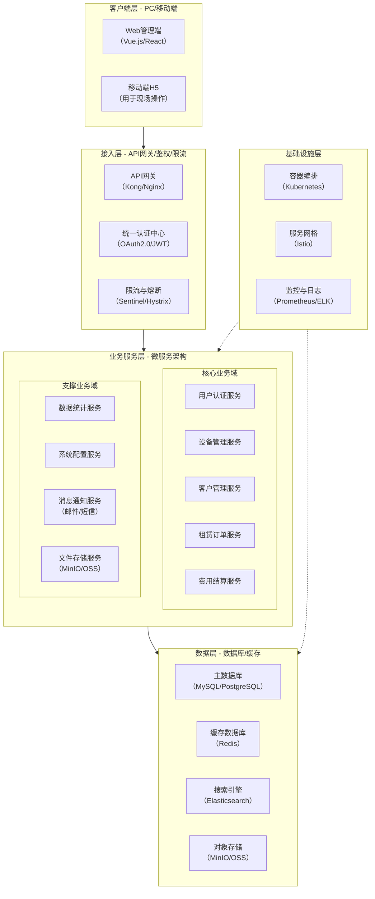
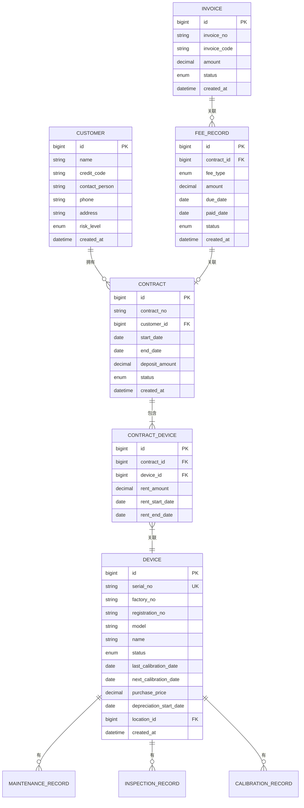

好的，作为资深需求分析工程师，我将严格遵循IEEE 830标准和GB/T 9385规范，根据您提供的结构化需求清单、涉众需求记录及UML模型，为您生成一份完整、精确、可验证的软件需求规格说明书（SRS）。

---
# 文档头部信息
| 项目项 | 内容 |
| :--- | :--- |
| 文档名称 | 软件需求规格说明书（SRS） |
| 项目名称 | 医疗器械租赁管理系统 |
| 文档版本 | V1.0.0 |
| 基线版本 | 【占位，由A6分配】 |
| 编制日期 | 2026-06-26 |

## 修订历史记录
| 版本号 | 修订日期 | 修订类型 | 修订内容简述 |
| :--- | :--- | :--- | :--- |
| V1.0.0 | 2026-06-26 | 新建 | 文档初稿，确立初始需求基线 |

# 1 引言
## 1.1 编制目的
本文档旨在明确界定“医疗器械租赁管理系统”（以下简称“本系统”）的软件需求。其核心目的是为项目团队（包括需求分析人员、系统设计师、开发工程师、测试工程师及项目管理人员）提供一个统一的、无歧义的、可验证的需求基线。本文档将作为后续系统设计、编码实现、功能测试、用户验收及项目交付的根本依据。所有需求均遵循IEEE 830标准及GB/T 9385规范进行编写，确保其完整性、一致性和可追溯性。

## 1.2 文档范围（包含/排除）
**包含范围：**
本文档详细描述了“医疗器械租赁管理系统”的全部功能需求、非功能需求、外部接口需求及数据需求。具体涵盖以下七个核心业务模块：
1.  **用户认证与权限管理**：用户注册、登录、角色分配、权限控制及操作审计。
2.  **设备管理**：设备全生命周期管理，包括入库验收、档案创建、状态变更、校准管理、巡检管理、维修管理、报废管理及附件管理。
3.  **客户管理**：客户全生命周期档案建立、风险等级管理。
4.  **租赁订单管理**：从需求对接、合同签署、出库指令、设备归还到续租/退租的全流程管理。
5.  **费用结算**：押金、租金、折旧、利润核算、发票管理、对账及催收流程。
6.  **数据统计**：提供设备、财务、运维等多维度报表。
7.  **系统配置**：支持业务规则、参数模板、催收规则等灵活配置。

**排除范围：**
本文档不包含以下内容：
1.  系统的硬件选型、网络拓扑设计及具体的部署方案。
2.  系统的UI/UX（用户界面/用户体验）详细设计，如页面布局、色彩、交互动效等。
3.  与第三方系统（如ERP、CRM、财务软件）的具体接口协议细节（将在接口规格说明书中定义）。
4.  项目的测试计划、测试用例及实施计划。
5.  系统的源代码实现细节及算法优化方案。

## 1.3 引用文件
1.  GB/T 9385-2008《计算机软件需求规格说明规范》
2.  IEEE Std 830-1998《IEEE Recommended Practice for Software Requirements Specifications》
3.  《高级软件设计实践》教材书稿
4.  医疗器械租赁管理系统涉众需求调研记录
5.  医疗器械租赁管理系统UML建模产物（用例图、活动图、时序图、E-R图）
6.  医疗器械租赁管理系统结构化需求清单

## 1.4 术语与缩略语
| 术语/缩略语 | 定义 |
| :--- | :--- |
| SRS | Software Requirements Specification，软件需求规格说明书。 |
| CCB | Change Control Board，变更控制委员会，负责审批需求变更。 |
| CR | Change Request，变更请求，用于正式提出需求变更。 |
| FR | Functional Requirement，功能需求，描述系统应具备的功能。 |
| NFR | Non-Functional Requirement，非功能需求，描述系统的质量属性。 |
| P0 | 优先级0，必须实现的需求，是系统上线的基础。 |
| P1 | 优先级1，重要需求，对业务有显著价值，建议在核心版本中实现。 |
| P2 | 优先级2，次要需求，可在后续迭代中实现。 |
| 设备档案 | 记录设备唯一身份、技术参数、生命周期状态等信息的电子记录。 |
| 库位 | 仓库中用于存放设备的物理位置，具有唯一编码。 |
| 校准过期 | 设备超过规定的校准有效期，状态被系统自动标记，禁止用于租赁。 |
| 技术复核 | 设备出库前，由运维工程师执行的一系列检查，确保设备状态良好。 |
| 全功能检测 | 设备归还后，对其所有功能进行全面测试，并与出库记录对比。 |
| 融资成本分摊 | 将公司为购买设备而发生的融资费用，按一定规则分摊到每台设备上。 |
| 最小权限原则 | 用户仅被授予完成其职责所必需的最小权限集。 |

## 1.5 业务背景概述
**现状痛点：**
当前，医疗器械租赁业务管理主要依赖Excel表格、纸质单据及线下沟通，导致以下问题：
1.  **信息孤岛**：设备、客户、合同、财务数据分散，无法实时共享，导致业务决策滞后。
2.  **流程低效**：设备出入库、校准提醒、租金催收等流程依赖人工操作，易出错、效率低。
3.  **风险失控**：设备校准过期、租金逾期、客户风险无法被系统自动预警，造成资产损失和经营风险。
4.  **核算困难**：单台设备的利润核算、折旧计算、成本归集依赖人工，耗时且不准确。
5.  **审计追溯难**：所有操作缺乏系统记录，一旦出现问题，难以追溯责任。

**建设目标：**
建设一套集设备管理、租赁订单、费用结算、客户管理于一体的医疗器械租赁管理系统，实现业务流程线上化、数据管理集中化、风险控制自动化。

**量化业务目标：**
1.  **效率提升**：设备出入库操作时间缩短50%（从平均30分钟/单降至15分钟/单）。
2.  **风险降低**：校准过期导致的设备停用事件减少90%（通过系统自动预警和状态锁定）。
3.  **财务准确**：单台设备利润核算时间缩短80%（从人工核算2小时降至系统自动生成10分钟）。
4.  **客户满意度**：租金催收流程自动化，逾期率降低20%。
5.  **数据一致性**：核心业务数据（设备状态、合同信息、财务数据）实现100%系统内一致，消除人工台账差异。

# 2 总体描述
## 2.1 产品概述（系统定位、核心价值）
**系统定位：**
本系统是一套面向医疗器械租赁企业的、覆盖设备全生命周期和租赁业务全流程的、专业化的业务管理信息系统。它旨在替代传统的人工管理模式，成为企业运营管理的核心数字化平台。

**核心价值：**
1.  **资产全生命周期管理**：从设备入库、使用、维护到报废，实现全程数字化追踪与管理。
2.  **业务流程自动化**：自动化处理校准提醒、租金催收、折旧计算等重复性工作，释放人力。
3.  **风险实时预警**：通过状态锁定、到期提醒、逾期催收等功能，主动防范经营风险。
4.  **数据驱动决策**：提供多维度、可视化的数据报表，为业务优化和战略决策提供数据支持。
5.  **权限与审计安全**：基于角色的细粒度权限控制，结合完整的操作日志，确保系统安全与合规。

### 系统架构图（Mermaid代码）

## 2.2 运行环境要求（硬件/软件/浏览器兼容表）
| 环境类别 | 具体要求 |
| :--- | :--- |
| **服务器硬件（最低配置）** | CPU：8核 2.0GHz；内存：32GB；硬盘：500GB SSD；网络：千兆网卡 |
| **服务器硬件（推荐配置）** | CPU：16核 2.5GHz；内存：64GB；硬盘：1TB SSD；网络：千兆网卡 |
| **服务器软件** | 操作系统：CentOS 7.x 或 Ubuntu 20.04 LTS；应用服务器：JDK 11+；Web服务器：Nginx 1.20+ |
| **数据库** | MySQL 8.0+ 或 PostgreSQL 13+；Redis 6.x+ |
| **客户端浏览器（兼容列表）** | Google Chrome 90+；Mozilla Firefox 90+；Microsoft Edge 90+；Apple Safari 14+ |
| **移动端** | 支持iOS 13+ 及 Android 10+ 的微信内置浏览器或系统浏览器 |

## 2.3 用户角色与特征（角色/职责/权限/频次/技能 矩阵表）
| 角色 | 职责 | 核心权限 | 使用频次 | 技能要求 |
| :--- | :--- | :--- | :--- | :--- |
| **招商业务员** | 客户开发、合同签署、回访管理、发起出库/收回指令 | 创建/编辑客户、合同、订单；发起出库/收回指令；执行回访；查看相关报表 | 每日 | 熟悉租赁业务流程，具备基础计算机操作能力 |
| **招商业务主管** | 审核合同、审批备选方案、管理团队 | 审核合同、审批备选方案；查看团队业绩报表；管理下属账号 | 每日 | 熟悉租赁业务及管理流程，具备数据分析能力 |
| **库房人员** | 设备入库/出库、库位管理、盘点、附件管理 | 执行入库/出库操作；管理库位；管理附件；查看库存报表 | 每日 | 熟悉仓库管理流程，具备基础计算机操作能力 |
| **运维工程师** | 设备技术验收、技术复核、安装调试、巡检、维修、校准管理 | 创建设备档案；执行技术复核/检测；管理巡检/维修/校准计划；查看运维报表 | 每日 | 具备医疗器械技术知识，熟悉运维流程 |
| **运维主管** | 审核报废、配置检测模板、管理运维团队 | 审批报废；配置检测模板；管理运维计划；查看运维统计报表 | 每周 | 具备医疗器械技术知识及团队管理经验 |
| **财务** | 费用结算、发票管理、对账、利润核算、折旧计算 | 管理押金/租金/发票；执行对账；配置折旧/融资规则；查看财务报表 | 每日 | 熟悉财务流程，具备基础计算机操作能力 |
| **系统管理员** | 系统配置、用户管理、权限分配、日志审计 | 管理所有用户、角色、权限；配置系统参数；查看所有操作日志 | 按需 | 具备系统管理及安全知识 |

## 2.4 系统运行模式（正常/异常/维护三种模式）
1.  **正常模式**：系统所有功能模块正常运行，所有用户可按照其角色权限访问系统，执行日常业务操作。系统响应时间、并发处理能力等性能指标满足非功能需求。
2.  **异常模式**：
    *   **降级模式**：当核心服务（如费用结算、数据统计）出现故障时，系统自动降级，保证设备管理、租赁订单等核心业务流程的可用性。非核心功能（如报表导出、历史数据查询）暂时不可用。
    *   **熔断模式**：当某个外部接口（如短信网关）持续超时或失败时，系统自动熔断对该接口的调用，避免级联故障，并记录错误日志。
3.  **维护模式**：系统管理员通过后台设置，将系统切换为维护模式。此时，所有用户界面将显示“系统正在维护，请稍后访问”的提示，禁止新用户登录。已登录用户将被强制登出。此模式用于系统升级、数据库迁移等计划性维护操作。

## 2.5 设计与实现约束
1.  **技术约束**：
    *   系统必须采用B/S（Browser/Server）架构。
    *   后端服务必须采用微服务架构，服务间通过RESTful API或gRPC通信。
    *   前端必须采用现代JavaScript框架（如Vue.js或React）。
    *   数据库必须采用关系型数据库（MySQL或PostgreSQL）。
2.  **合规约束**：
    *   系统必须满足《医疗器械监督管理条例》等相关法规对设备追溯、校准管理的要求。
    *   系统必须符合《个人信息保护法》和《数据安全法》对用户数据和业务数据的安全要求。
3.  **接口约束**：
    *   所有对外接口必须提供标准RESTful API，并使用JSON作为数据交换格式。
    *   接口设计必须遵循幂等性原则，确保重复调用不会产生副作用。
4.  **工期约束**：
    *   核心功能（设备管理、租赁订单、费用结算）必须在项目启动后6个月内完成开发并上线试运行。

## 2.6 假设与依赖
1.  **假设**：
    *   用户具备基本的计算机操作能力，能够熟练使用浏览器。
    *   公司内部网络环境稳定，能够支持系统的正常访问。
    *   所有业务数据（如设备序列号、客户信息、合同条款）在录入系统前是准确、完整的。
2.  **依赖**：
    *   本系统的正常运行依赖于公司IT基础设施（服务器、网络、数据库）的稳定运行。
    *   短信、邮件等通知服务的可用性依赖于第三方服务提供商。
    *   系统上线前，需要完成对相关业务人员的系统操作培训。

# 3 具体需求
## 3.1 功能需求（FR）
### 3.1.1 用户认证与权限管理模块
**FR-AUTH-001：用户登录与身份认证**
- **优先级**：P0
- **参与角色**：所有系统用户
- **前置条件**：用户账号已在系统中创建并激活。
- **触发方式**：用户在登录页面输入用户名和密码，点击“登录”按钮。
- **业务流程**：
    1.  系统接收用户输入的用户名和密码。
    2.  系统对密码进行加密处理（如BCrypt）。
    3.  系统将加密后的密码与数据库中存储的密码进行比对。
    4.  若比对成功，系统生成一个JWT（JSON Web Token）令牌，并返回给客户端。
    5.  客户端将JWT令牌存储在本地（如localStorage或cookie）。
    6.  若比对失败，系统返回错误提示信息（“用户名或密码错误”）。
- **业务规则**：
    1.  密码长度必须为8-20个字符，且必须包含大写字母、小写字母、数字和特殊字符中的至少三种。
    2.  连续5次登录失败，该账号将被锁定30分钟。
    3.  JWT令牌的有效期为8小时，过期后用户需重新登录。
- **后置状态**：用户成功登录系统，获得与其角色匹配的权限。
- **验收标准**：
    1.  使用正确的用户名和密码登录，系统应在2秒内返回成功响应并跳转至首页。
    2.  使用错误的密码登录，系统应在1秒内返回“用户名或密码错误”提示。
    3.  连续输入5次错误密码，账号被锁定，并提示“账号已被锁定，请30分钟后重试”。

**FR-AUTH-002：基于角色的权限控制**
- **优先级**：P0
- **参与角色**：系统管理员
- **前置条件**：用户角色已定义，权限资源已注册。
- **触发方式**：系统管理员在用户管理界面为特定用户分配角色。
- **业务流程**：
    1.  系统管理员进入用户管理界面，选择目标用户。
    2.  系统管理员点击“分配角色”按钮，弹出角色选择窗口。
    3.  系统管理员选择一个或多个角色，并提交。
    4.  系统校验角色是否存在，并更新用户-角色关联表。
    5.  系统记录此次操作到审计日志。
- **业务规则**：
    1.  一个用户可以绑定多个角色，但每个角色的权限需独立配置。
    2.  用户最终权限为所有角色权限的并集，但遵循“最小权限原则”，即敏感操作（如报废审批、费用调整）需二次授权。
    3.  角色权限的修改不会影响已登录用户的当前会话，需重新登录后生效。
- **后置状态**：用户权限被更新。
- **验收标准**：
    1.  为“库房人员”角色分配“设备出库”权限后，该角色的用户登录后，菜单中应出现“设备出库”功能入口。
    2.  未分配“设备报废审批”权限的用户，在设备详情页不应看到“申请报废”按钮。
    3.  所有角色分配操作均可在审计日志中查询到。

**FR-AUTH-003：操作日志审计**
- **优先级**：P0
- **参与角色**：所有系统用户
- **前置条件**：用户已登录系统。
- **触发方式**：用户执行任何数据创建、修改、删除操作，或进行角色/权限变更。
- **业务流程**：
    1.  系统拦截用户的操作请求。
    2.  系统记录操作人、操作时间、操作IP地址、操作内容（包括操作前后的数据快照）、操作结果（成功/失败）等信息。
    3.  系统将日志信息异步写入日志数据库。
- **业务规则**：
    1.  日志记录不可被任何用户（包括系统管理员）修改或删除。
    2.  日志数据至少保留3年。
    3.  系统管理员可通过日志管理界面，按操作人、时间范围、操作类型等条件查询日志。
- **后置状态**：操作日志被成功记录。
- **验收标准**：
    1.  用户修改设备状态后，在日志管理界面按该用户查询，应能查到对应的操作记录。
    2.  日志记录应包含操作前后的设备状态值。
    3.  尝试直接修改数据库中的日志表，应被数据库权限拒绝。

### 3.1.2 设备管理模块
**FR-EQP-001：设备入库验收**
- **优先级**：P0
- **参与角色**：库房人员、运维工程师
- **前置条件**：新设备到货。
- **触发方式**：库房人员在系统中发起“设备入库验收”流程。
- **业务流程**：
    1.  库房人员填写设备基本信息（如设备名称、型号、生产厂家、序列号、出厂编号、注册证号）。
    2.  库房人员进行初步验收（外观、数量、配件），并记录验收结果。
    3.  系统将设备状态设置为“待验收”。
    4.  运维工程师收到通知后，进行技术验收（安装调试、功能测试）。
    5.  运维工程师填写安装调试记录，包括初始状态、功能测试结果、客户现场环境信息（如适用）。
    6.  运维工程师确认技术验收通过。
    7.  系统将设备状态自动变更为“在库”。
- **业务规则**：
    1.  每台设备必须拥有唯一的序列号，系统不允许重复的序列号入库。
    2.  初步验收或技术验收不通过时，系统需记录异常原因，并生成异常报告，设备状态保持“待验收”。
    3.  技术验收环节需关联设备档案和后续的租赁合同（如适用）。
- **后置状态**：设备状态为“在库”，设备档案创建完成，安装调试记录归档。
- **验收标准**：
    1.  输入重复的序列号，系统应提示“序列号已存在，请检查”。
    2.  完成技术验收后，设备状态应在1分钟内自动变为“在库”。
    3.  验收不通过时，系统应生成包含异常原因的异常报告，并可导出为PDF。

**FR-EQP-002：设备状态管理**
- **优先级**：P0
- **参与角色**：库房人员、运维工程师
- **前置条件**：设备档案已创建。
- **触发方式**：用户通过设备详情页或批量操作界面，手动或系统自动触发状态变更。
- **业务流程**：
    1.  系统定义设备状态集：在库、出租、维修、校准、报废、待验收、校准过期。
    2.  用户根据业务操作（如出库、报修、校准）选择目标状态。
    3.  系统校验状态变更的合法性（如“在库”的设备才能变更为“出租”）。
    4.  系统记录状态变更操作人、时间及关联单据（如出库单、维修工单）。
    5.  系统更新设备状态。
- **业务规则**：
    1.  状态变更必须遵循状态机规则，不允许非法跳转。例如，设备不能从“在库”直接变为“报废”，必须先经过“维修”或“校准过期”等状态。
    2.  设备状态为“校准过期”时，系统禁止其用于任何租赁出库操作。
    3.  设备状态为“报废”后，不可再变更为其他任何状态。
- **后置状态**：设备状态更新，相关操作记录被保存。
- **验收标准**：
    1.  在库设备出库后，状态自动变为“出租”。
    2.  尝试将“出租”状态的设备直接变更为“报废”，系统应提示“非法状态变更”。
    3.  校准过期设备在出库选择列表中不可见。

**FR-EQP-003：设备校准到期处理**
- **优先级**：P0
- **参与角色**：运维工程师、运维主管
- **前置条件**：设备档案中已设置校准周期。
- **触发方式**：系统定时任务每日扫描设备校准日期。
- **业务流程**：
    1.  系统每日检查所有设备的下次校准日期。
    2.  对于距离校准日期小于等于30天的设备，系统自动向运维工程师发送提醒通知。
    3.  对于校准日期已过的设备，系统自动将其状态标记为“校准过期”。
    4.  运维工程师对“校准过期”设备进行处理：安排现场校准或回库校准。
    5.  若设备正在出租中，运维工程师可发起“校准暂缓”审批流程。
    6.  运维主管审批“校准暂缓”请求，设定最长宽限期（不超过7天）。
    7.  审批通过后，设备状态在宽限期内暂时恢复正常。
- **业务规则**：
    1.  提醒时间可配置，默认提前30天。
    2.  “校准过期”状态需在设备列表和设备详情页以红色醒目显示。
    3.  校准暂缓需部门负责人审批，且每个设备每年最多申请2次暂缓。
- **后置状态**：设备状态更新为“校准过期”或“在库”（校准后），相关审批记录归档。
- **验收标准**：
    1.  设置设备校准日期为30天后，系统应在次日向运维工程师发送提醒通知。
    2.  校准日期过期的设备，状态自动变为“校准过期”，并在列表中红色高亮。
    3.  发起“校准暂缓”审批，主管审批通过后，设备状态恢复正常，并在设备档案中记录宽限期。

**FR-EQP-004：设备出库技术复核**
- **优先级**：P0
- **参与角色**：运维工程师
- **前置条件**：招商业务员已发起出库指令，设备状态为“在库”。
- **触发方式**：运维工程师在系统中接收到出库复核任务。
- **业务流程**：
    1.  运维工程师根据出库指令，找到对应设备。
    2.  运维工程师执行技术复核，包括：核对设备文档（注册证、合格证）、确认设备功能正常、对设备外观进行拍照。
    3.  运维工程师在系统中填写复核结果，并上传照片。
    4.  系统生成不可篡改的电子复核报告。
    5.  若复核通过，系统允许设备出库。
    6.  若复核不通过，系统生成异常工单，并锁定设备，禁止出库。
- **业务规则**：
    1.  复核报告必须包含复核人、复核时间、复核项目、结果及照片，并加盖电子时间戳。
    2.  复核报告一旦生成，任何人不可修改。
    3.  复核不通过时，异常工单需自动通知运维主管和库房人员。
- **后置状态**：设备状态变为“待出库”（复核通过）或“锁定”（复核不通过），复核报告归档。
- **验收标准**：
    1.  完成复核并上传照片后，系统应在5秒内生成包含时间戳的PDF复核报告。
    2.  尝试修改已生成的复核报告，系统应提示“报告已锁定，无法修改”。
    3.  复核不通过后，该设备在出库选择列表中应变为灰色不可选状态。

**FR-EQP-005：设备归还全功能检测**
- **优先级**：P0
- **参与角色**：运维工程师
- **前置条件**：设备已从客户处收回。
- **触发方式**：运维工程师在系统中发起“归还检测”流程。
- **业务流程**：
    1.  运维工程师选择归还的设备，系统自动调取出库时的安装调试记录。
    2.  运维工程师按照检测模板对设备进行全功能检测。
    3.  系统将检测结果与出库记录进行逐项对比。
    4.  系统自动生成检测报告，包含对比结果和异常说明。
    5.  若检测通过，设备可入库，状态变为“在库”。
    6.  若检测发现异常，系统生成定损报告，作为责任界定和赔偿的依据。
- **业务规则**：
    1.  检测模板可由运维主管在系统配置中预先定义。
    2.  检测报告必须包含对比结果，对不一致项进行高亮标注。
    3.  定损报告需关联设备档案和租赁合同。
- **后置状态**：设备状态更新，检测报告/定损报告归档。
- **验收标准**：
    1.  选择设备后，系统应在3秒内加载出库时的安装调试记录。
    2.  检测结果与出库记录不一致时，系统应在报告中高亮显示不一致项。
    3.  检测异常时，系统应自动生成定损报告，并提示运维工程师填写异常说明。

**FR-EQP-006：设备巡检管理**
- **优先级**：P0
- **参与角色**：运维工程师、运维主管
- **前置条件**：设备状态为“出租”或“在库”。
- **触发方式**：系统根据巡检计划自动生成巡检任务，或运维主管手动创建巡检任务。
- **业务流程**：
    1.  运维主管配置巡检计划，包括计划名称、适用设备类型、巡检周期（固定或动态）、检查项模板。
    2.  系统根据计划自动生成巡检任务，并分配给指定的运维工程师。
    3.  运维工程师收到任务后，按计划执行巡检，并填写巡检结果。
    4.  巡检结果需记录并归档。
- **业务规则**：
    1.  巡检计划可基于设备类型、使用频率、历史故障率等参数动态调整。例如，故障率高于5%的设备，巡检频率自动从每月一次提升至每两周一次。
    2.  巡检结果需包含文字描述和现场照片。
    3.  巡检中发现的问题，可一键生成维修工单。
- **后置状态**：巡检任务完成，巡检记录归档。
- **验收标准**：
    1.  创建一个每月1号执行的巡检计划，系统应在每月1号自动生成巡检任务并分配给指定工程师。
    2.  将某设备的历史故障率设置为10%，系统应自动将其巡检周期从30天调整为15天。
    3.  在巡检结果中勾选“发现异常”，系统应提供“生成维修工单”的按钮。

**FR-EQP-007：附件管理**
- **优先级**：P1
- **参与角色**：库房人员
- **前置条件**：主设备档案已创建。
- **触发方式**：库房人员在设备入库或日常管理中，对附件进行操作。
- **业务流程**：
    1.  库房人员可创建附件档案，记录附件名称、型号、序列号（如有）、所属主设备等信息。
    2.  附件可独立于主设备进行入库、绑定、状态变更（如维修、报废）等操作。
    3.  设备出库时，系统要求库房人员对附件进行状态记录（如拍照、勾选状态）。
    4.  设备归还时，系统根据出库时的附件状态快照进行核对。
- **业务规则**：
    1.  附件拥有独立生命周期，但必须与一个主设备关联。
    2.  出库记录需包含附件状态快照，并支持领用人电子签名确认。
    3.  附件状态变更需记录操作人、时间及关联单据。
- **后置状态**：附件状态更新，相关记录归档。
- **验收标准**：
    1.  为主设备添加一个附件后，在附件管理列表中应能查询到该附件，并显示其所属主设备。
    2.  设备出库时，系统强制要求对附件进行状态记录，否则无法完成出库。
    3.  出库记录中应包含附件的状态快照和领用人电子签名。

**FR-EQP-008：设备报废审批**
- **优先级**：P1
- **参与角色**：运维工程师、运维主管
- **前置条件**：设备状态为“维修”或“校准过期”，且无法修复或无修复价值。
- **触发方式**：运维工程师在设备详情页点击“申请报废”。
- **业务流程**：
    1.  运维工程师填写报废申请，包括报废原因、设备当前状况、关联的异常记录等。
    2.  系统将申请提交给运维主管审批。
    3.  运维主管审核申请，可选择“批准”或“驳回”。
    4.  若批准，设备状态变更为“报废”。
    5.  若驳回，设备状态恢复为申请前的状态。
- **业务规则**：
    1.  报废审批需关联设备档案和异常记录。
    2.  设备状态为“报废”后，不可再用于任何业务操作。
- **后置状态**：设备状态为“报废”或恢复原状态，审批记录归档。
- **验收标准**：
    1.  运维工程师提交报废申请后，运维主管应在待办事项中收到通知。
    2.  主管批准后，设备状态立即变为“报废”。
    3.  报废的设备在所有业务操作列表中不可见。

### 3.1.3 客户管理模块
**FR-CRM-001：客户全生命周期档案**
- **优先级**：P0
- **参与角色**：招商业务员
- **前置条件**：无。
- **触发方式**：招商业务员在系统中点击“新建客户”。
- **业务流程**：
    1.  招商业务员填写客户基本信息，包括客户名称、统一社会信用代码、联系人、联系方式、地址等。
    2.  系统创建客户档案。
    3.  后续所有与该客户相关的合同、订单、回访、费用记录均自动关联到该档案。
- **业务规则**：
    1.  客户名称和统一社会信用代码必须唯一。
    2.  客户档案需与租赁合同、费用结算等模块关联，形成360度视图。
- **后置状态**：客户档案创建成功。
- **验收标准**：
    1.  输入重复的客户名称，系统应提示“客户名称已存在”。
    2.  创建客户后，在客户详情页应能看到其关联的所有合同和回访记录。

**FR-CRM-002：客户风险等级管理**
- **优先级**：P1
- **参与角色**：招商业务员、招商业务主管
- **前置条件**：客户档案已创建。
- **触发方式**：系统根据规则自动调整，或招商业务员手动发起调整。
- **业务流程**：
    1.  系统定义客户风险等级：低风险、中风险、高风险。
    2.  系统根据预设规则自动调整风险等级。例如：租金逾期超过15天，风险等级自动提升为“中风险”；逾期超过30天，提升为“高风险”。
    3.  招商业务员也可根据回访记录，手动发起风险等级调整申请。
    4.  风险等级调整需经招商业务主管审批。
- **业务规则**：
    1.  风险等级调整的触发条件和审批流程需在系统配置中定义。
    2.  高风险客户在发起新合同时，系统需向招商业务主管发出预警。
- **后置状态**：客户风险等级更新。
- **验收标准**：
    1.  客户租金逾期16天，其风险等级自动变为“中风险”。
    2.  招商业务员手动申请将客户风险等级调整为“高风险”，主管审批通过后，等级更新。
    3.  为高风险客户创建新合同时，系统弹出预警提示。

### 3.1.4 租赁订单模块
**FR-ORD-001：租赁合同全流程管理**
- **优先级**：P0
- **参与角色**：招商业务员、招商业务主管
- **前置条件**：客户需求已确认，可行性评估通过。
- **触发方式**：招商业务员在系统中发起“创建租赁合同”。
- **业务流程**：
    1.  招商业务员选择客户，填写合同基本信息，包括租赁设备清单、租金方案、租期、维保责任、押金等。
    2.  系统生成合同草案。
    3.  招商业务员提交合同给招商业务主管审核。
    4.  招商业务主管审核合同，可选择“通过”或“驳回”。
    5.  审核通过后，合同进入用印流程（线下或电子签章）。
    6.  用印完成后，招商业务员确认合同生效。
    7.  合同生效是后续出库、计费的前提。
- **业务规则**：
    1.  合同审核权限归属于招商业务主管。
    2.  合同生效后，任何修改需走合同变更流程。
- **后置状态**：合同状态为“生效”，关联的设备可进行出库操作。
- **验收标准**：
    1.  招商业务员提交合同后，主管的待办事项中应出现该合同审核任务。
    2.  主管驳回合同，招商业务员应能收到驳回原因并修改。
    3.  合同生效后，关联设备的“出库”按钮变为可用。

**FR-ORD-002：出库指令发起与执行**
- **优先级**：P0
- **参与角色**：招商业务员、库房人员
- **前置条件**：租赁合同已生效。
- **触发方式**：招商业务员在合同详情页点击“发起出库指令”。
- **业务流程**：
    1.  招商业务员选择合同下需要出库的设备，发起出库指令。
    2.  系统通知库房人员有新的出库任务。
    3.  库房人员收到通知后，执行出库操作（包括技术复核、附件记录等）。
    4.  出库完成后，设备状态变更为“出租”。
- **业务规则**：
    1.  出库指令必须关联生效的合同和设备清单。
    2.  库房人员只能在收到合同生效通知后，才能执行出库。
- **后置状态**：设备状态为“出租”，出库记录归档。
- **验收标准**：
    1.  合同生效后，招商业务员才能看到“发起出库指令”按钮。
    2.  库房人员发起出库操作时，系统应校验合同是否已生效。
    3.  出库完成后，设备状态在1分钟内变为“出租”。

**FR-ORD-003：设备归还与收回管理**
- **优先级**：P0
- **参与角色**：招商业务员、库房人员、运维工程师
- **前置条件**：租赁合同到期或提前退租。
- **触发方式**：招商业务员发起“设备收回”流程。
- **业务流程**：
    1.  招商业务员在合同到期前30天，系统自动提醒业务员准备收回。
    2.  招商业务员发起收回指令，系统通知客户并协调物流。
    3.  设备归还后，库房人员进行初步验收。
    4.  运维工程师进行全功能检测。
    5.  检测通过后，设备入库，状态变更为“在库”。
    6.  系统通知财务进行最终费用结算。
- **业务规则**：
    1.  收回流程需与费用结算模块联动，确保所有费用结清后才能完成入库。
    2.  提前退租需签署补充协议。
- **后置状态**：设备状态为“在库”，合同状态为“已结束”，费用结算完成。
- **验收标准**：
    1.  合同到期前30天，系统自动向招商业务员发送提醒。
    2.  设备归还检测通过后，系统自动触发费用结算流程。
    3.  费用未结清时，设备无法完成入库操作。

**FR-ORD-004：续租与退租管理**
- **优先级**：P0
- **参与角色**：招商业务员、招商业务主管
- **前置条件**：租赁合同即将到期或客户提出提前退租。
- **触发方式**：招商业务员在合同详情页点击“续租”或“提前退租”。
- **业务流程**：
    1.  **续租**：招商业务员发起续租申请，系统根据原合同生成新的租金方案和租期。双方签署续租补充协议后，合同有效期延长。
    2.  **提前退租**：招商业务员发起提前退租申请，系统根据合同条款计算违约金或调整租金。双方签署提前退租补充协议后，启动设备收回流程。
- **业务规则**：
    1.  续租和提前退租均需生成新的合同或补充协议，并经过审核流程。
    2.  提前退租的违约金计算规则需在合同模板中定义。
- **后置状态**：合同信息更新，新的补充协议生效。
- **验收标准**：
    1.  发起续租后，系统应自动生成包含新租期和租金的补充协议草案。
    2.  发起提前退租后，系统应自动计算违约金并显示在补充协议中。
    3.  补充协议审核通过后，原合同的有效期和金额自动更新。

**FR-ORD-005：故障责任界定**
- **优先级**：P0
- **参与角色**：招商业务员、运维工程师
- **前置条件**：出租中的设备发生故障。
- **触发方式**：客户报修后，运维工程师初步判断为非正常使用导致的故障。
- **业务流程**：
    1.  招商业务员发起“故障责任界定”流程。
    2.  运维工程师进行现场勘查，调取出库时的技术复核记录和安装调试记录。
    3.  必要时，引入第三方检测机构进行检测。
    4.  系统根据合同条款和勘查/检测结果，生成责任界定报告。
    5.  责任界定结果关联维修工单或赔偿流程。
- **业务规则**：
    1.  责任界定结果需关联维修工单或赔偿流程。
    2.  所有勘查记录、检测报告需作为附件归档。
- **后置状态**：责任界定报告归档，触发后续的维修或赔偿流程。
- **验收标准**：
    1.  发起责任界定流程后，系统应自动关联该设备的出库复核报告和安装调试记录。
    2.  填写责任界定结果后，系统应提供“生成维修工单”或“发起赔偿流程”的选项。

### 3.1.5 费用结算模块
**FR-FIN-001：押金收支管理**
- **优先级**：P0
- **参与角色**：财务
- **前置条件**：租赁合同已生效。
- **触发方式**：财务收到客户押金款项。
- **业务流程**：
    1.  财务在系统中选择对应合同，录入押金收款信息（金额、收款日期、收款方式）。
    2.  系统将押金登记为往来款项，不直接计入收入。
    3.  合同结束时，财务根据合同条款处理押金退还或抵扣。
- **业务规则**：
    1.  押金收支必须与合同关联。
    2.  押金退还时，需经过招商业务员确认。
- **后置状态**：押金记录更新，与合同关联。
- **验收标准**：
    1.  录入押金收款后，在合同详情页的“押金”字段应显示已收金额。
    2.  押金收款记录不应出现在损益表中。

**FR-FIN-002：租金应收与核销管理**
- **优先级**：P0
- **参与角色**：财务
- **前置条件**：租赁合同已生效。
- **触发方式**：系统根据合同分期方案自动生成。
- **业务流程**：
    1.  合同生效后，系统根据合同约定的租金分期方案（如按月、按季），自动生成租金应收计划。
    2.  财务收到客户付款后，在系统中进行核销操作。
    3.  系统支持分次核销和余额挂账。
- **业务规则**：
    1.  应收计划按月生成，每月1号生成当月的应收记录。
    2.  支持部分付款核销，未核销部分自动挂账。
- **后置状态**：租金应收计划生成，核销记录更新。
- **验收标准**：
    1.  合同生效后，系统应在次月1号自动生成第一笔租金应收记录。
    2.  客户支付5000元，但当月租金为10000元，财务核销5000元后，系统应显示“未核销金额：5000元”。

**FR-FIN-003：设备折旧计算**
- **优先级**：P0
- **参与角色**：财务
- **前置条件**：设备状态为“在库”或“出租”，且已超过折旧起始日期。
- **触发方式**：系统定时任务每月执行。
- **业务流程**：
    1.  系统根据设备类别和配置的折旧年限（如5-8年），自动计算每台设备的月折旧额。
    2.  折旧从设备“达到预定可使用状态”次月起计提。
    3.  系统每月生成折旧记录，并计入设备成本。
- **业务规则**：
    1.  折旧年限可在系统配置中按设备类别设置。
    2.  设备报废后，停止计提折旧。
- **后置状态**：折旧记录生成，设备成本更新。
- **验收标准**：
    1.  设置某设备折旧年限为5年，原值12万，系统应在次月自动生成月折旧额2000元的记录。
    2.  设备报废后，系统不再生成新的折旧记录。

**FR-FIN-004：单台设备利润核算**
- **优先级**：P0
- **参与角色**：财务
- **前置条件**：设备有租金收入、折旧成本、维修成本等数据。
- **触发方式**：财务在报表界面点击“生成利润核算”。
- **业务流程**：
    1.  系统自动汇总选定时间段内，单台设备的租金收入、折旧成本、融资成本分摊及维修成本。
    2.  系统自动计算单台设备的利润（收入 - 成本）。
    3.  系统生成单台设备利润核算报表。
- **业务规则**：
    1.  融资成本分摊基于设备原值加权计算。
    2.  维修成本从维修工单自动归集到该设备。
- **后置状态**：利润核算报表生成。
- **验收标准**：
    1.  选择一台设备，系统应在10秒内生成包含其所有收入和成本的利润报表。
    2.  报表中的利润数据应与各模块汇总数据一致。

**FR-FIN-005：医院对账功能**
- **优先级**：P0
- **参与角色**：财务
- **前置条件**：有已生成的租金应收记录。
- **触发方式**：财务在系统中发起“对账”。
- **业务流程**：
    1.  财务选择需要与医院对账的合同或时间段。
    2.  系统生成应收账款明细，支持按发票号或租金期次两种视图。
    3.  财务与医院财务进行核对。
    4.  核对无误后，财务确认对账完成。
- **业务规则**：
    1.  对账视图需支持按发票号和租金期次切换。
- **后置状态**：对账记录更新。
- **验收标准**：
    1.  选择按发票号视图，系统应列出所有已开票的租金记录。
    2.  选择按租金期次视图，系统应列出所有应收租金的期次。

**FR-FIN-006：发票全生命周期管理**
- **优先级**：P0
- **参与角色**：财务
- **前置条件**：有未开票的租金应收计划。
- **触发方式**：财务在系统中发起“开票申请”。
- **业务流程**：
    1.  财务选择未开票的租金计划，发起开票申请。
    2.  系统自动匹配未开票租金计划，生成开票数据。
    3.  财务进行开票操作（线下或对接税控系统）。
    4.  开票成功后，系统将发票信息与租金计划关联。
    5.  若发生开票错误，财务可发起作废或红冲流程，系统自动解除与租金计划的关联。
- **业务规则**：
    1.  开票时自动匹配未开票租金计划，不允许重复开票。
    2.  发票作废后，对应的租金计划恢复为“未开票”状态。
- **后置状态**：发票状态更新，与租金计划关联。
- **验收标准**：
    1.  选择一笔未开票租金计划，开票成功后，该计划状态变为“已开票”。
    2.  作废一张发票后，对应的租金计划状态恢复为“未开票”。

**FR-FIN-007：租金逾期催收流程**
- **优先级**：P0
- **参与角色**：财务、招商业务员
- **前置条件**：租金应收计划已生成且逾期。
- **触发方式**：系统定时任务每日扫描逾期租金。
- **业务流程**：
    1.  系统每日检查所有租金应收计划的到期日。
    2.  到期前3天，系统自动向客户发送提醒通知。
    3.  逾期1-3天，系统自动向招商业务员发送催收提醒。
    4.  逾期4-7天，系统自动向客户发送催收函，并计算滞纳金。
    5.  逾期超过7天，系统通知财务和招商业务主管，启动押金抵扣或法律程序。
- **业务规则**：
    1.  催收流程的时间节点和措施可在系统配置中自定义。
    2.  滞纳金按合同约定计算，如每日万分之五。
- **后置状态**：催收记录生成，客户风险等级可能被调整。
- **验收标准**：
    1.  租金到期前3天，系统自动向客户发送提醒短信。
    2.  租金逾期5天，系统自动向客户发送催收函，并计算滞纳金。
    3.  租金逾期8天，系统通知财务和主管。

### 3.1.6 数据统计模块
**FR-STA-001：单台设备全生命周期利润总表**
- **优先级**：P0
- **参与角色**：财务
- **前置条件**：设备有完整的收入、成本数据。
- **触发方式**：财务在报表界面选择查询条件。
- **业务流程**：
    1.  财务选择查询维度（按设备、合同、客户）。
    2.  系统根据选择，汇总选定范围内所有设备的租金收入、折旧成本、融资成本、维修成本及利润。
    3.  系统生成报表，支持导出为Excel或PDF。
- **业务规则**：
    1.  报表需支持按设备、合同、客户维度下钻查询。
- **后置状态**：报表生成。
- **验收标准**：
    1.  选择按设备维度查询，报表应列出每台设备的收入、成本、利润。
    2.  点击某台设备，应能下钻查看其关联的合同和费用明细。

**FR-STA-002：设备库存报表**
- **优先级**：P1
- **参与角色**：库房人员
- **前置条件**：设备数据已录入。
- **触发方式**：库房人员在报表界面选择查询条件。
- **业务流程**：
    1.  库房人员选择筛选条件（如库位、设备类型、状态）。
    2.  系统生成设备库存报表，包括在库、出租、维修等状态的设备数量及明细。
- **业务规则**：
    1.  报表数据需实时更新。
- **后置状态**：报表生成。
- **验收标准**：
    1.  选择“在库”状态，报表应列出所有在库设备及其库位。
    2.  报表中的设备数量应与设备管理模块中的状态统计一致。

**FR-STA-003：设备故障率统计报表**
- **优先级**：P1
- **参与角色**：运维工程师
- **前置条件**：有维修记录和巡检记录。
- **触发方式**：运维工程师在报表界面选择查询条件。
- **业务流程**：
    1.  运维工程师选择设备类型和时间范围。
    2.  系统统计选定范围内，不同设备类型的故障次数、维修频率、平均修复时间等。
    3.  系统生成故障率统计报表。
- **业务规则**：
    1.  报表数据来源于维修记录和巡检记录。
- **后置状态**：报表生成。
- **验收标准**：
    1.  选择某设备类型，报表应显示其故障次数和平均修复时间。
    2.  报表数据应与维修工单记录一致。

### 3.1.7 系统配置模块
**FR-CFG-001：设备检测模板配置**
- **优先级**：P1
- **参与角色**：运维主管
- **前置条件**：无。
- **触发方式**：运维主管在系统配置界面操作。
- **业务流程**：
    1.  运维主管进入“检测模板配置”界面。
    2.  运维主管可以创建、编辑、删除检测模板。
    3.  每个模板包含多个检查项，每个检查项可设置为“必检”或“可选”。
    4.  模板创建后，可在设备验收、技术复核、归还检测等流程中被引用。
- **业务规则**：
    1.  模板可包含必检项和可选扩展项。
- **后置状态**：检测模板更新。
- **验收标准**：
    1.  创建一个包含“外观检查”、“功能测试”两个必检项的模板。
    2.  在设备验收流程中，应能选择并使用该模板。

**FR-CFG-002：催收规则配置**
- **优先级**：P1
- **参与角色**：财务
- **前置条件**：无。
- **触发方式**：财务在系统配置界面操作。
- **业务流程**：
    1.  财务进入“催收规则配置”界面。
    2.  财务可以配置不同逾期天数对应的催收动作、责任人及通知方式。
    3.  配置保存后，催收流程将按新规则执行。
- **业务规则**：
    1.  配置项需包含时间、动作、责任人。
- **后置状态**：催收规则更新。
- **验收标准**：
    1.  配置逾期1天，动作“发送提醒”，责任人“招商业务员”。
    2.  租金逾期1天后，系统自动向招商业务员发送提醒。

**FR-CFG-003：折旧年限配置**
- **优先级**：P0
- **参与角色**：财务
- **前置条件**：无。
- **触发方式**：财务在系统配置界面操作。
- **业务流程**：
    1.  财务进入“折旧年限配置”界面。
    2.  财务可以为不同设备类别设置不同的折旧年限（如5-8年）。
    3.  配置保存后，系统将按新年限计算折旧。
- **业务规则**：
    1.  配置变更需记录审计日志。
- **后置状态**：折旧年限配置更新。
- **验收标准**：
    1.  将“CT设备”的折旧年限从5年改为8年。
    2.  次月折旧计算时，CT设备的折旧额应基于8年年限计算。

### 系统用例图（PlantUML代码）

```plantuml
@startuml
left to right direction
skinparam packageStyle rectangle
skinparam actorStyle awesome

actor "招商业务员" as Sales
actor "库房人员" as Warehouse
actor "运维工程师" as Ops
actor "财务" as Finance
actor "系统管理员" as Admin

rectangle "用户认证" {
  usecase "用户登录" as UC_LOGIN
  usecase "用户登出" as UC_LOGOUT
  usecase "修改密码" as UC_CHG_PWD
}

rectangle "设备管理" {
  usecase "设备入库验收" as UC_EQP_IN
  usecase "设备出库复核" as UC_EQP_OUT_CHECK
  usecase "设备归还检测" as UC_EQP_RETURN_CHECK
  usecase "设备巡检管理" as UC_EQP_INSPECT
  usecase "设备校准管理" as UC_EQP_CALIBRATE
  usecase "设备维修管理" as UC_EQP_REPAIR
  usecase "设备报废审批" as UC_EQP_SCRAP
  usecase "附件管理" as UC_EQP_ACCESSORY
  usecase "设备台账管理" as UC_EQP_LEDGER
  usecase "库位管理" as UC_EQP_LOCATION
}

rectangle "客户管理" {
  usecase "创建客户档案" as UC_CRM_CREATE
  usecase "编辑客户信息" as UC_CRM_EDIT
  usecase "管理客户风险等级" as UC_CRM_RISK
}

rectangle "租赁订单" {
  usecase "创建租赁合同" as UC_ORD_CONTRACT
  usecase "审核合同" as UC_ORD_AUDIT
  usecase "发起出库指令" as UC_ORD_OUT
  usecase "设备收回管理" as UC_ORD_RETURN
  usecase "续租/退租管理" as UC_ORD_RENEW
  usecase "回访管理" as UC_ORD_VISIT
  usecase "故障责任界定" as UC_ORD_FAULT
}

rectangle "费用结算" {
  usecase "押金管理" as UC_FIN_DEPOSIT
  usecase "租金核销" as UC_FIN_RENT
  usecase "发票管理" as UC_FIN_INVOICE
  usecase "医院对账" as UC_FIN_RECON
  usecase "设备折旧计算" as UC_FIN_DEPRE
  usecase "单台利润核算" as UC_FIN_PROFIT
  usecase "租金催收" as UC_FIN_COLLECT
}

rectangle "系统配置" {
  usecase "用户与角色管理" as UC_CFG_USER
  usecase "权限配置" as UC_CFG_PERM
  usecase "检测模板配置" as UC_CFG_TEMPLATE
  usecase "催收规则配置" as UC_CFG_COLLECT
  usecase "折旧年限配置" as UC_CFG_DEPRE
  usecase "日志审计" as UC_CFG_LOG
}

Sales --> UC_LOGIN
Sales --> UC_CRM_CREATE
Sales --> UC_CRM_EDIT
Sales --> UC_CRM_RISK
Sales --> UC_ORD_CONTRACT
Sales --> UC_ORD_OUT
Sales --> UC_ORD_RETURN
Sales --> UC_ORD_RENEW
Sales --> UC_ORD_VISIT
Sales --> UC_ORD_FAULT

Warehouse --> UC_LOGIN
Warehouse --> UC_EQP_IN
Warehouse --> UC_EQP_ACCESSORY
Warehouse --> UC_EQP_LOCATION
Warehouse --> UC_EQP_LEDGER

Ops --> UC_LOGIN
Ops --> UC_EQP_OUT_CHECK
Ops --> UC_EQP_RETURN_CHECK
Ops --> UC_EQP_INSPECT
Ops --> UC_EQP_CALIBRATE
Ops --> UC_EQP_REPAIR
Ops --> UC_EQP_SCRAP

Finance --> UC_LOGIN
Finance --> UC_FIN_DEPOSIT
Finance --> UC_FIN_RENT
Finance --> UC_FIN_INVOICE
Finance --> UC_FIN_RECON
Finance --> UC_FIN_DEPRE
Finance --> UC_FIN_PROFIT
Finance --> UC_FIN_COLLECT

Admin --> UC_LOGIN
Admin --> UC_CFG_USER
Admin --> UC_CFG_PERM
Admin --> UC_CFG_TEMPLATE
Admin --> UC_CFG_COLLECT
Admin --> UC_CFG_DEPRE
Admin --> UC_CFG_LOG

@enduml
```

## 3.2 外部接口需求（IFR）
**IFR-001：短信/邮件通知接口**
- **接口描述**：系统需调用第三方短信网关和邮件服务器，向用户和客户发送通知（如校准提醒、催收通知）。
- **输入**：接收方手机号/邮箱、消息内容。
- **输出**：发送成功/失败状态。
- **协议**：HTTP/HTTPS，RESTful API。
- **数据格式**：JSON。

**IFR-002：电子签章接口**
- **接口描述**：系统需对接第三方电子签章平台，实现在线合同签署。
- **输入**：合同文件（PDF）、签署方信息。
- **输出**：签署后的合同文件（PDF）、签署状态。
- **协议**：HTTP/HTTPS，RESTful API。
- **数据格式**：JSON。

**IFR-003：税控系统接口**
- **接口描述**：系统需对接国家税控系统或第三方开票平台，实现发票的自动开具和作废。
- **输入**：开票申请数据（金额、购买方信息）。
- **输出**：发票号码、发票代码、开票状态。
- **协议**：HTTP/HTTPS，RESTful API。
- **数据格式**：JSON。

### E-R图（Mermaid erDiagram）

### 数据字典（表格）
| 表名 | 字段名 | 类型 | 主键 | 外键 | 默认值 | 说明 |
| :--- | :--- | :--- | :--- | :--- | :--- | :--- |
| **DEVICE** | id | BIGINT | Y | | | 设备唯一标识 |
| | serial_no | VARCHAR(100) | | | | 设备序列号，唯一约束 |
| | factory_no | VARCHAR(100) | | | | 出厂编号 |
| | registration_no | VARCHAR(100) | | | | 注册证号 |
| | name | VARCHAR(200) | | | | 设备名称 |
| | model | VARCHAR(100) | | | | 设备型号 |
| | status | ENUM | | | '待验收' | 设备状态 |
| | purchase_price | DECIMAL(10,2) | | | 0.00 | 采购价格 |
| | location_id | BIGINT | | Y | | 库位ID |
| | created_at | DATETIME | | | CURRENT_TIMESTAMP | 创建时间 |
| **CUSTOMER** | id | BIGINT | Y | | | 客户唯一标识 |
| | name | VARCHAR(200) | | | | 客户名称 |
| | credit_code | VARCHAR(50) | | | | 统一社会信用代码 |
| | risk_level | ENUM | | | '低风险' | 风险等级 |
| **CONTRACT** | id | BIGINT | Y | | | 合同唯一标识 |
| | contract_no | VARCHAR(50) | | | | 合同编号 |
| | customer_id | BIGINT | | Y | | 客户ID |
| | status | ENUM | | | '草稿' | 合同状态 |
| **FEE_RECORD** | id | BIGINT | Y | | | 费用记录唯一标识 |
| | contract_id | BIGINT | | Y | | 合同ID |
| | fee_type | ENUM | | | | 费用类型（押金/租金） |
| | amount | DECIMAL(10,2) | | | 0.00 | 金额 |
| | due_date | DATE | | | | 到期日 |
| | status | ENUM | | | '未支付' | 支付状态 |
| **INVOICE** | id | BIGINT | Y | | | 发票唯一标识 |
| | invoice_no | VARCHAR(50) | | | | 发票号码 |
| | amount | DECIMAL(10,2) | | | 0.00 | 发票金额 |
| | status | ENUM | | | '已开具' | 发票状态 |

## 3.3 非功能需求（NFR）
### 3.3.1 性能需求
1.  **页面加载性能**：在标准网络环境下（带宽10Mbps），所有功能页面的首次加载时间不得超过3秒，非首次加载时间不得超过1.5秒。
2.  **接口响应性能**：90%的API接口响应时间不得超过500毫秒，99%的接口响应时间不得超过2秒。
3.  **并发能力**：系统需支持至少200个用户同时在线操作，核心业务接口（如设备出库、租金核销）需支持至少50的TPS（每秒事务数）。
4.  **吞吐量**：系统需支持每日处理至少10,000笔业务交易（包括设备出入库、合同创建、费用核销等）。

### 3.3.2 可靠性需求
1.  **系统可用率**：系统在7x24小时运行模式下，年度可用率不低于99.9%（即年度计划外停机时间不超过8.76小时）。
2.  **连续运行**：系统需支持连续运行7天无需重启。
3.  **故障恢复**：当系统发生故障时，核心业务服务（设备管理、租赁订单）的恢复时间不得超过30分钟；非核心服务（数据统计）的恢复时间不得超过2小时。

### 3.3.3 安全性需求
1.  **用户认证**：必须采用安全的身份认证机制（如JWT），密码必须加密存储（如BCrypt）。
2.  **权限控制**：必须实现基于角色的细粒度权限控制，确保用户只能访问其被授权的功能和数据。
3.  **数据加密**：所有用户敏感数据（如密码、手机号）在传输和存储时必须加密。
4.  **攻击防护**：系统必须能抵御常见的Web攻击，如SQL注入、XSS（跨站脚本攻击）、CSRF（跨站请求伪造）。
5.  **审计日志**：所有关键操作（数据创建、修改、删除、权限变更）必须记录完整的审计日志，日志不可篡改。

### 3.3.4 可维护性需求
1.  **日志记录**：系统必须提供统一的日志记录框架，记录所有错误、警告和信息日志，便于问题排查。
2.  **模块化设计**：系统必须采用模块化或微服务架构，各模块/服务之间低耦合，便于独立开发、测试和部署。
3.  **配置管理**：所有与环境相关的配置（如数据库连接、第三方接口地址）必须外部化，支持通过配置文件或配置中心进行管理。

### 3.3.5 可扩展性需求
1.  **水平扩展**：系统架构必须支持水平扩展，当业务量增长时，可通过增加服务器节点来提升系统处理能力。
2.  **功能扩展**：系统设计需预留扩展点，支持未来新增业务模块（如供应链管理、融资租赁）的快速集成。

### 3.3.6 易用性需求
1.  **界面一致性**：系统所有页面的布局、控件风格、交互方式必须保持一致。
2.  **操作反馈**：用户执行任何操作后，系统必须在2秒内给出明确的成功或失败反馈。
3.  **错误提示**：系统报错时，必须提供清晰、友好的错误提示信息，帮助用户理解问题所在。
4.  **帮助文档**：系统需提供在线帮助文档，解释核心功能的操作步骤。

## 3.4 数据需求
### 数据字典（完整表格）
（此处仅列出核心实体表，完整数据字典需在详细设计阶段补充所有字段）
| 表名 | 字段名 | 类型 | 主键 | 外键 | 默认值 | 说明 |
| :--- | :--- | :--- | :--- | :--- | :--- | :--- |
| **USER** | id | BIGINT | Y | | | 用户ID |
| | username | VARCHAR(50) | | | | 用户名，唯一 |
| | password_hash | VARCHAR(255) | | | | 加密后的密码 |
| | real_name | VARCHAR(50) | | | | 真实姓名 |
| | phone | VARCHAR(20) | | | | 手机号 |
| | email | VARCHAR(100) | | | | 邮箱 |
| | status | TINYINT | | | 1 | 状态：1-启用，0-禁用 |
| | created_at | DATETIME | | | CURRENT_TIMESTAMP | 创建时间 |
| **ROLE** | id | BIGINT | Y | | | 角色ID |
| | name | VARCHAR(50) | | | | 角色名称，唯一 |
| | description | VARCHAR(255) | | | | 角色描述 |
| **USER_ROLE** | id | BIGINT | Y | | | 关联ID |
| | user_id | BIGINT | | Y | | 用户ID |
| | role_id | BIGINT | | Y | | 角色ID |
| **PERMISSION** | id | BIGINT | Y | | | 权限ID |
| | name | VARCHAR(100) | | | | 权限名称 |
| | code | VARCHAR(100) | | | | 权限编码，唯一 |
| **ROLE_PERMISSION** | id | BIGINT | Y | | | 关联ID |
| | role_id | BIGINT | | Y | | 角色ID |
| | permission_id | BIGINT | | Y | | 权限ID |
| **AUDIT_LOG** | id | BIGINT | Y | | | 日志ID |
| | user_id | BIGINT | | | | 操作人ID |
| | username | VARCHAR(50) | | | | 操作人用户名 |
| | ip_address | VARCHAR(50) | | | | 操作IP |
| | operation_type | VARCHAR(50) | | | | 操作类型 |
| | operation_content | TEXT | | | | 操作内容（含快照） |
| | result | TINYINT | | | | 结果：1-成功，0-失败 |
| | created_at | DATETIME | | | CURRENT_TIMESTAMP | 操作时间 |
| **LOCATION** | id | BIGINT | Y | | | 库位ID |
| | code | VARCHAR(50) | | | | 库位编码，唯一 |
| | description | VARCHAR(255) | | | | 库位描述 |
| **MAINTENANCE_RECORD** | id | BIGINT | Y | | | 维修记录ID |
| | device_id | BIGINT | | Y | | 设备ID |
| | fault_description | TEXT | | | | 故障描述 |
| | repair_result | TEXT | | | | 维修结果 |
| | cost | DECIMAL(10,2) | | | 0.00 | 维修成本 |
| | engineer_id | BIGINT | | Y | | 维修工程师ID |
| | created_at | DATETIME | | | CURRENT_TIMESTAMP | 创建时间 |
| **INSPECTION_RECORD** | id | BIGINT | Y | | | 巡检记录ID |
| | device_id | BIGINT | | Y | | 设备ID |
| | plan_id | BIGINT | | Y | | 巡检计划ID |
| | result | TEXT | | | | 巡检结果 |
| | inspector_id | BIGINT | | Y | | 巡检人ID |
| | created_at | DATETIME | | | CURRENT_TIMESTAMP | 创建时间 |
| **CALIBRATION_RECORD** | id | BIGINT | Y | | | 校准记录ID |
| | device_id | BIGINT | | Y | | 设备ID |
| | calibration_date | DATE | | | | 校准日期 |
| | next_calibration_date | DATE | | | | 下次校准日期 |
| | operator_id | BIGINT | | Y | | 操作人ID |
| | created_at | DATETIME | | | CURRENT_TIMESTAMP | 创建时间 |

### 数据管理策略
1.  **备份策略**：
    *   **全量备份**：每周日凌晨2:00执行一次全量数据库备份。
    *   **增量备份**：每日凌晨2:00执行一次增量备份。
    *   **备份保留**：全量备份保留3个月，增量备份保留1个月。
2.  **归档策略**：
    *   对于超过3年的历史合同、已结束的租赁订单、已关闭的维修工单等数据，系统支持手动或自动归档到历史数据库或冷存储中。
    *   归档后的数据在业务操作界面不可见，但可通过专门的“历史数据查询”功能进行查询。
3.  **数据留存**：
    *   审计日志数据至少保留3年。
    *   核心业务数据（设备、客户、合同）永久保留。

# 4 需求基线与变更管理
## 4.1 基线定义
1.  **版本规则**：文档版本号遵循 `V主版本号.次版本号.修订号` 规则。主版本号在重大需求变更时递增，次版本号在需求增删时递增，修订号在文档勘误时递增。
2.  **冻结规则**：在项目各里程碑节点（如需求评审通过、设计评审通过）后，当前版本的需求文档将被冻结，形成基线。基线的任何变更必须通过正式的变更控制流程。

## 4.2 变更流程概述
1.  **CR（变更请求）**：任何干系人提出需求变更，需填写《需求变更请求单》，提交给项目经理。
2.  **CIA（变更影响分析）**：项目经理组织项目团队对变更请求进行影响分析，评估其对成本、进度、质量、技术的影响。
3.  **约束更新**：变更控制委员会（CCB）审批变更请求。若批准，则更新相关约束（如项目计划、预算）。
4.  **代码变更**：开发团队根据批准的变更请求进行代码实现。
5.  **CRR（变更评审与发布）**：测试团队对变更进行验证，确认无误后，发布新版本，并更新SRS文档，形成新的基线。

# 5 附录
## 附录A 验收标准总表（编号->名称->标准->优先级）
| 需求编号 | 需求名称 | 验收标准 | 优先级 |
| :--- | :--- | :--- | :--- |
| FR-AUTH-001 | 用户登录与身份认证 | 使用正确凭证登录，系统在2秒内返回成功响应；使用错误密码登录，系统在1秒内返回错误提示；连续5次登录失败，账号锁定30分钟。 | P0 |
| FR-EQP-001 | 设备入库验收 | 输入重复序列号，系统提示“已存在”；技术验收通过后，设备状态1分钟内变为“在库”；验收不通过，生成异常报告。 | P0 |
| FR-FIN-002 | 租金应收与核销管理 | 合同生效后，次月1号自动生成应收记录；支持分次核销，未核销部分自动挂账。 | P0 |
| FR-ORD-001 | 租赁合同全流程管理 | 提交合同后，主管收到审核任务；主管驳回，业务员收到原因；合同生效后，出库按钮可用。 | P0 |
| FR-STA-001 | 单台设备全生命周期利润总表 | 选择设备，10秒内生成包含所有收入和成本的利润报表；报表数据与各模块汇总数据一致。 | P0 |
| FR-CFG-003 | 折旧年限配置 | 修改设备类别折旧年限后，次月折旧计算基于新年限。 | P0 |

## 附录B 参考资料
1.  GB/T 9385-2008《计算机软件需求规格说明规范》
2.  IEEE Std 830-1998《IEEE Recommended Practice for Software Requirements Specifications》
3.  《高级软件设计实践》教材书稿
4.  医疗器械租赁管理系统涉众需求调研记录
5.  医疗器械租赁管理系统UML建模产物（用例图、活动图、时序图、E-R图）
6.  医疗器械租赁管理系统结构化需求清单