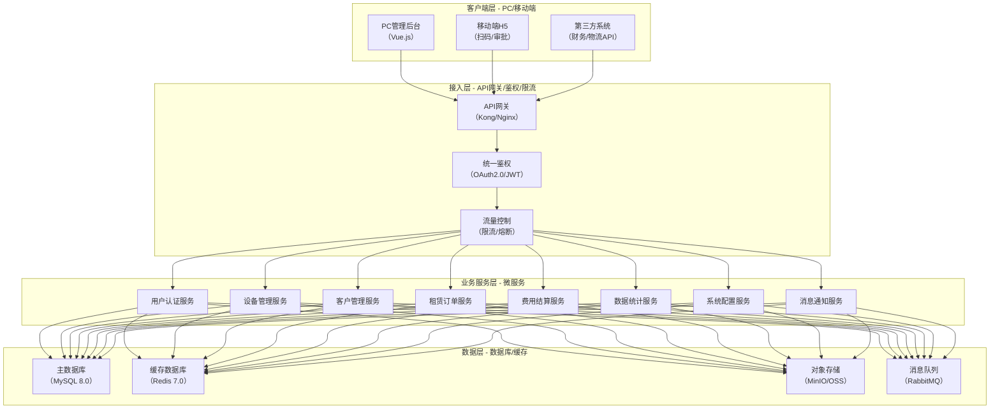
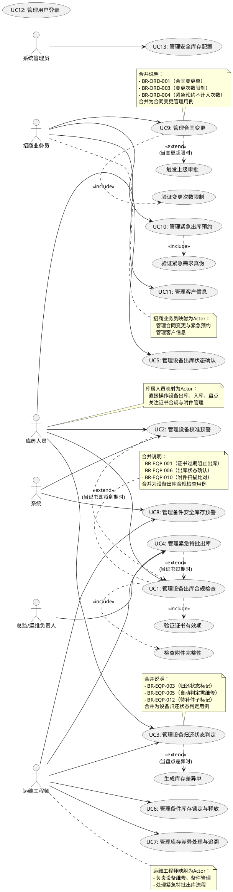
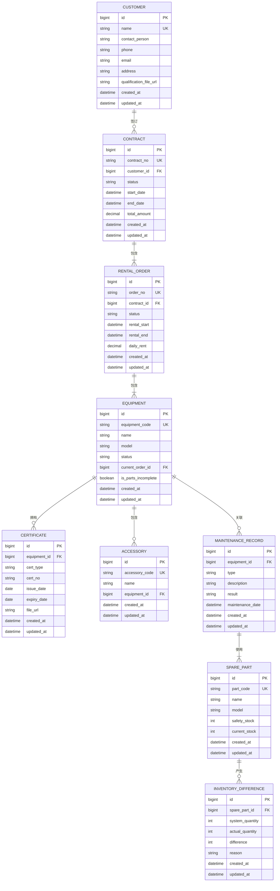
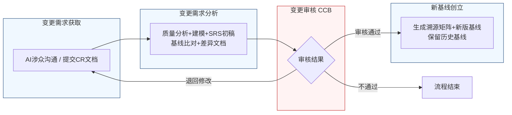

好的，作为资深需求分析工程师，我将严格遵循IEEE 830标准和GB/T 9385规范，并采用“精确优先于流畅”的原则，为您生成这份完整的软件需求规格说明书（SRS）。

---
# 文档头部信息
| 项目项 | 内容 |
| ---- | ---- |
| 文档名称 | 软件需求规格说明书（SRS）|
| 项目名称 | 医疗器械租赁管理系统 |
| 项目编号 | MED-RENTAL-2026 |
| 文档版本 | V1.0.0 |
| 基线版本 | 【占位，由A6分配】|
| 编制人 | AI基线智能体（A6） |
| 编制日期 | 【当前日期】|
| 审核人 | CCB变更控制委员会 |
| 批准人 | CCB变更控制委员会 |
| 密级 | 内部 |

## 修订历史记录
| 版本号 | 修订日期 | 修订类型 | 修订内容简述 |
| V1.0.0 | 【当前日期】 | 新建 | 文档初稿，确立初始需求基线 |

# 1 引言
## 1.1 编制目的
本软件需求规格说明书（SRS）的编制目的是为“医疗器械租赁管理系统”项目（项目编号：MED-RENTAL-2026）的开发、测试、验收及后续维护提供一份完整、精确、无歧义的需求基线。本文档旨在：
1.  在项目干系人（包括客户、业务人员、开发团队、测试团队、运维团队）之间建立对系统功能的共同理解。
2.  作为开发团队进行系统设计、编码和单元测试的依据。
3.  作为测试团队设计测试用例、执行系统测试和验收测试的依据。
4.  作为项目管理和变更控制的基础文档，确保所有变更可追溯、可控制。

## 1.2 文档范围（包含/排除）
**包含范围：**
本文档覆盖“医疗器械租赁管理系统”V1.0.0版本的全部需求，具体包括：
1.  **功能需求：** 涵盖用户认证、设备管理、客户管理、租赁订单、费用结算、数据统计、系统配置七个核心模块。
2.  **外部接口需求：** 系统与外部系统（如财务系统、短信/邮件网关、第三方物流平台）的接口定义。
3.  **非功能需求：** 包括性能、可靠性、安全性、可维护性、可扩展性、易用性等方面的要求。
4.  **数据需求：** 核心数据实体的定义、数据字典及数据管理策略。

**排除范围：**
本文档不包含以下内容：
1.  **项目计划：** 如甘特图、资源分配、成本估算等项目管理信息。
2.  **系统设计：** 如软件架构的详细设计、数据库物理设计、用户界面（UI）的详细设计稿等。这些内容将在《系统设计说明书》中定义。
3.  **测试计划与用例：** 详细的测试策略、测试用例和测试脚本。这些内容将在《测试计划》和《测试用例》中定义。
4.  **用户手册：** 最终用户的操作指南。这些内容将在《用户手册》中定义。
5.  **硬件采购清单：** 具体的服务器、网络设备型号和数量。

## 1.3 引用文件
1.  GB/T 9385-2008《计算机软件需求规格说明规范》
2.  IEEE Std 830-1998《IEEE Recommended Practice for Software Requirements Specifications》
3.  《高级软件设计实践》教材书稿
4.  医疗器械租赁管理系统涉众需求调研记录（raw/notes/）
5.  医疗器械租赁管理系统UML建模产物
6.  医疗器械租赁管理系统结构化需求清单

## 1.4 术语与缩略语
| 术语/缩略语 | 定义 |
| :--- | :--- |
| SRS | 软件需求规格说明书（Software Requirements Specification） |
| CCB | 变更控制委员会（Change Control Board） |
| CR | 变更需求（Change Request） |
| FR | 功能需求（Functional Requirement） |
| NFR | 非功能需求（Non-Functional Requirement） |
| IF | 接口需求（Interface Requirement） |
| RTM | 需求追溯矩阵（Requirements Traceability Matrix） |
| EQP | 设备管理模块（Equipment Management Module） |
| ORD | 租赁订单模块（Rental Order Module） |
| P0 | 优先级0，必须实现，系统上线的基础功能 |
| P1 | 优先级1，重要功能，影响核心业务流程效率 |
| P2 | 优先级2，次要功能，增强用户体验或辅助管理 |
| 证书 | 指设备校准证书、注册证等合规性文件 |
| 附件 | 指与设备主体配套使用的非核心部件，如电源线、探头、导联线等 |
| 备件 | 指用于维修更换的零部件，如保险丝、密封圈、传感器等 |

## 1.5 业务背景概述
**现状痛点：**
当前医疗器械租赁业务管理主要依赖线下表格和人工沟通，存在以下核心痛点：
1.  **合规风险高：** 设备证书管理依赖人工记忆，常出现证书过期设备被出库的情况，存在法律与安全风险。
2.  **流程效率低：** 设备出库、归还、维修、盘点等环节依赖纸质单据和线下沟通，信息不透明，流程追溯困难。
3.  **库存管理混乱：** 备件库存账实不符，缺乏预警机制，导致维修超时；设备状态定义模糊，影响后续处理流程。
4.  **合同管理不规范：** 合同变更缺乏标准化流程，易导致数据冲突和商务纠纷。

**建设目标：**
建设一套统一的医疗器械租赁管理系统，实现以下量化业务目标：
1.  **BR-EQP-001：** 将因证书过期导致的违规出库事件数量降低至0。
2.  **BR-EQP-002：** 将设备因证书到期而导致的可用性中断时间降低90%。
3.  **BR-EQP-003/005：** 将设备归还后的状态判定时间从平均2小时缩短至5分钟内。
4.  **BR-ORD-001：** 将合同变更的处理周期从平均2天缩短至1小时内。

# 2 总体描述
## 2.1 产品概述（系统定位、核心价值）
**系统定位：** 本系统是一套面向医疗器械租赁企业的业务管理平台，旨在通过信息化手段，实现设备全生命周期管理、租赁业务流程自动化和数据驱动的决策支持。

**核心价值：**
1.  **合规保障：** 通过强制性的证书校验和预警机制，确保所有出库设备100%合规。
2.  **流程提效：** 自动化设备状态判定、库存预警、合同变更联动等流程，大幅提升运营效率。
3.  **风险可控：** 建立紧急特批、附件缺失追溯、库存差异处理等机制，使业务风险全程可控。
4.  **数据驱动：** 提供多维度的数据统计与分析，为业务决策提供依据。

### 系统架构图（Mermaid代码）

## 2.2 运行环境要求（硬件/软件/浏览器兼容表）
| 环境类型 | 组件 | 最低配置 | 推荐配置 |
| :--- | :--- | :--- | :--- |
| **服务器端** | 应用服务器 | CPU: 4核, 内存: 16GB, 磁盘: 100GB SSD | CPU: 8核, 内存: 32GB, 磁盘: 500GB SSD |
| | 数据库服务器 | CPU: 4核, 内存: 16GB, 磁盘: 200GB SSD | CPU: 8核, 内存: 32GB, 磁盘: 1TB SSD |
| **客户端** | 操作系统 | Windows 10 / macOS 12 / iOS 14 / Android 10 | Windows 11 / macOS 14 / iOS 17 / Android 14 |
| | 浏览器 | Chrome 100+ / Firefox 100+ / Safari 15+ / Edge 100+ | Chrome 最新版 |
| **软件环境** | 操作系统 | CentOS 7.9+ / Ubuntu 20.04+ | CentOS 8.0+ / Ubuntu 22.04+ |
| | 数据库 | MySQL 8.0+ | MySQL 8.0+ |
| | 缓存 | Redis 7.0+ | Redis 7.0+ |
| | 消息队列 | RabbitMQ 3.9+ | RabbitMQ 3.12+ |
| | 运行时 | JDK 17+ / Node.js 18+ | JDK 21+ / Node.js 20+ |

## 2.3 用户角色与特征（角色/职责/权限/频次/技能 矩阵表）
| 角色 | 职责 | 核心权限 | 使用频次 | 技能要求 |
| :--- | :--- | :--- | :--- | :--- |
| **库房人员** | 设备入库、出库、盘点、附件管理 | 设备查询、出库操作（受规则限制）、入库操作、盘点操作、附件扫描 | 每日多次 | 熟悉库房操作流程，能使用扫码设备 |
| **运维工程师** | 设备维修、备件管理、紧急特批发起 | 设备维修记录、备件领用/归还、发起紧急出库特批、库存差异处理 | 每日多次 | 熟悉设备维修技术，了解备件管理 |
| **招商业务员** | 客户开发、合同签订、合同变更、紧急预约 | 客户信息管理、合同创建/变更、发起紧急出库预约 | 每日多次 | 熟悉商务流程，具备合同管理知识 |
| **总监/运维负责人** | 紧急特批审批、重大变更审批 | 审批紧急出库特批、审批超限合同变更 | 偶尔 | 具备业务决策权，了解风险控制 |
| **系统管理员** | 系统配置、用户管理、权限分配 | 所有系统配置、用户增删改查、角色权限分配 | 每周 | 熟悉系统运维，具备IT管理知识 |

## 2.4 系统运行模式（正常/异常/维护三种模式）
1.  **正常模式：** 系统所有功能正常运行，用户可执行所有授权的业务操作。系统响应时间在NFR定义的范围内。
2.  **异常模式：** 当系统检测到关键服务（如数据库、核心业务服务）不可用时，自动进入降级模式。在此模式下，非核心功能（如数据统计、系统配置）将被禁用，核心业务功能（如设备出库、归还）将提供有限服务（如仅支持扫码，不支持复杂查询），并提示用户系统异常。
3.  **维护模式：** 系统管理员通过后台设置，将系统切换至维护模式。在此模式下，所有用户将被强制登出，并看到统一的维护公告页面。系统将停止接受新的业务请求，直至管理员关闭维护模式。

## 2.5 设计与实现约束
1.  **技术约束：**
    *   后端服务必须采用微服务架构，使用Java (JDK 17+) 或 Go语言开发。
    *   前端必须采用前后端分离架构，使用Vue.js或React框架。
    *   所有API接口必须遵循RESTful设计规范。
    *   数据库必须使用MySQL 8.0及以上版本。
2.  **合规约束：**
    *   系统必须符合《医疗器械监督管理条例》等相关法规要求。
    *   所有操作日志必须保留不少于180天，以备审计。
    *   用户敏感信息（如手机号、身份证号）在数据库中必须加密存储。
3.  **接口约束：**
    *   与外部系统（如财务系统）的接口必须通过API网关进行，并采用HTTPS协议。
    *   所有接口调用必须进行身份验证和权限校验。
4.  **工期约束：**
    *   系统V1.0.0版本必须在【占位，由PM填写】日期前完成开发并上线。

## 2.6 假设与依赖
1.  **假设：**
    *   所有用户均具备基本的计算机操作能力。
    *   库房和运维现场具备稳定的网络环境，支持扫码设备实时通信。
    *   客户方愿意配合在《设备出库状态确认单》上进行电子签名。
2.  **依赖：**
    *   本系统的开发依赖于《高级软件设计实践》教材中提供的技术框架和设计模式。
    *   本系统的上线依赖于第三方短信/邮件网关服务的稳定运行。
    *   本系统的部分功能（如紧急出库预约）依赖于物流团队的线下配合。

# 3 具体需求
## 3.1 功能需求（FR）
### 3.1.1 用户认证模块
**FR-AUTH-001：用户登录**
- **优先级：** P0
- **参与角色：** 所有用户
- **前置条件：** 用户账号已在系统中创建并激活。
- **触发方式：** 用户在登录页面输入账号和密码，点击“登录”按钮。
- **业务流程：**
    1.  系统接收用户输入的账号和密码。
    2.  系统对密码进行加密处理（如BCrypt）。
    3.  系统查询数据库，校验账号是否存在、密码是否正确、账号是否被锁定。
    4.  校验通过后，系统生成一个JWT Token，并返回给客户端。
    5.  客户端将Token存储在本地（如localStorage），并在后续请求中携带。
- **业务规则：**
    -   密码输入错误连续5次，账号将被锁定30分钟。
    -   Token有效期为8小时，过期后需重新登录。
- **后置状态：** 用户成功登录系统，进入主界面。
- **验收标准：**
    1.  使用正确的账号密码登录，系统应在2秒内返回成功响应并跳转至主界面。
    2.  使用错误的密码登录，系统应在1秒内提示“账号或密码错误”。
    3.  连续输入5次错误密码后，系统应提示“账号已被锁定，请30分钟后再试”。
    4.  Token过期后，系统应自动跳转至登录页面。
- **关联需求条目：** 无

### 3.1.2 设备管理模块
**FR-EQP-001：设备出库合规检查**
- **优先级：** P0
- **参与角色：** 库房人员
- **前置条件：** 设备状态为“在库”，且已绑定有效的租赁单。
- **触发方式：** 库房人员扫描设备条码，发起出库操作。
- **业务流程：**
    1.  系统接收设备条码，查询设备信息及其关联的证书信息。
    2.  系统判断证书有效期状态。
    3.  若证书已过期，系统阻止出库，并提示“证书过期，出库被阻止”。
    4.  若证书有效期小于7天（含7天），系统弹出红色预警弹窗，提示“证书剩余不足7天，出库后需书面承诺使用部门在有效期内用完或提前归还”，并要求库房人员进行二次确认。
    5.  若证书有效期小于30天（含30天）且大于7天，系统弹出黄色预警弹窗，提示“设备校准/注册证即将到期，请安排检测/续证”，并标记设备为“预到期”状态，允许正常出库。
    6.  若证书有效期大于30天，系统允许正常出库。
    7.  出库时，系统强制要求扫描并记录每个附件的唯一编码。
    8.  系统生成《设备出库状态确认单》，要求上传设备关键部位的高清照片或视频。
    9.  系统要求客户方在确认单上进行电子签名。
    10. 系统生成有效的租赁单，并更新设备状态为“已出库”。
- **业务规则：**
    -   证书有效期判断规则：以证书上的“有效期至”字段的日期为准。若“有效期至”等于当前日期，视为已过期。
    -   附件编码必须唯一，且与设备关联。
    -   《设备出库状态确认单》必须包含影像资料和客户签名，否则系统不生成租赁单。
- **后置状态：** 设备状态更新为“已出库”，生成有效的租赁单和《设备出库状态确认单》。
- **验收标准：**
    1.  扫描证书已过期的设备，系统应弹出“证书过期，出库被阻止”的提示，且出库流程终止。
    2.  扫描证书有效期小于7天的设备，系统应弹出红色预警弹窗，并要求二次确认。二次确认后，流程继续。
    3.  扫描证书有效期小于30天且大于7天的设备，系统应弹出黄色预警弹窗，设备标记为“预到期”，流程继续。
    4.  扫描证书有效期大于30天的设备，系统应无预警，流程继续。
    5.  出库时，未扫描所有附件编码，系统应阻止流程。
    6.  未上传影像资料或客户未签名，系统应阻止生成租赁单。
- **关联需求条目：** BR-EQP-001, BR-EQP-006, BR-EQP-010

**FR-EQP-002：设备校准预警**
- **优先级：** P1
- **参与角色：** 库房人员, 系统
- **前置条件：** 设备状态为“在库”或“已出库”。
- **触发方式：** 系统定时任务（每日凌晨00:00:00执行）。
- **业务流程：**
    1.  系统扫描所有设备，检查其证书有效期。
    2.  若证书有效期剩余30天，系统自动触发黄色预警：向库房人员发送通知，并在设备详情页标记为“预到期”。
    3.  若证书有效期剩余7天，系统自动触发红色预警：在设备出库界面强制弹窗，并要求库房人员二次确认。
    4.  若设备处于“维修中”状态，预警提醒继续发送，但通知内容需标注“（维修中）”。
    5.  设备维修完成返回库房，状态变更为“在库”后，系统触发一次更新提醒，要求库房人员手动确认或系统自动按“设备入库时间+剩余校准周期”重新生成送检截止日期。
- **业务规则：**
    -   预警仅针对证书有效期大于0天的设备。
    -   黄色预警和红色预警是独立的，不会同时触发。
    -   设备维修期间的预警，不触发二次确认弹窗。
- **后置状态：** 系统生成预警记录，并发送通知。
- **验收标准：**
    1.  证书有效期剩余30天时，系统应在当日凌晨自动生成黄色预警通知。
    2.  证书有效期剩余7天时，系统应在当日凌晨自动生成红色预警通知。
    3.  设备维修期间，预警通知应包含“（维修中）”标注。
    4.  设备维修返回后，系统应触发更新提醒，要求确认送检截止日期。
- **关联需求条目：** BR-EQP-002, BR-EQP-011

**FR-EQP-003：设备归还状态判定**
- **优先级：** P0
- **参与角色：** 库房人员, 运维工程师
- **前置条件：** 设备状态为“已出库”。
- **触发方式：** 库房人员扫描归还设备及附件条码。
- **业务流程：**
    1.  系统接收设备条码，查询出库时的附件清单。
    2.  系统自动比对归还附件与出库附件清单。
    3.  若附件缺失，系统生成“缺失记录”，弹窗警示，要求现场确认。
    4.  运维工程师执行《归还检查维修记录》，记录功能测试、外观检查等结果。
    5.  系统根据检测结果自动判定：
        a.  若设备主体有故障/损坏，系统标记状态为“已归还-需维修”，并附带“附件缺失”标签（若附件缺失），关联维修工单。
        b.  若设备主体硬件完好，系统标记状态为“已归还-待入库”，并附带“附件缺失”标签（若附件缺失），设置“待补件”子标记。
    6.  库房人员执行入库操作，更新设备状态为“在库”。
- **业务规则：**
    -   附件比对规则：必须逐件扫描，系统自动比对编码。
    -   设备状态判定以《归还检查维修记录》的检测结果为准。若检测结果中有“其他异常”或“需人工复核”字段，运维工程师可手动选择开启“需维修”标记。
    -   “待补件”是“在库”状态下的一个布尔字段 `is_parts_incomplete`，用于快速筛选。
- **后置状态：** 设备状态更新为“已归还-需维修”或“已归还-待入库”，生成缺失记录（如有）。
- **验收标准：**
    1.  归还时附件完整，系统应无提示，流程继续。
    2.  归还时附件缺失，系统应弹窗警示，并生成“缺失记录”。
    3.  设备主体有故障，系统应自动标记为“已归还-需维修”。
    4.  设备主体完好但附件缺失，系统应标记为“已归还-待入库”，并附带“附件缺失”标签。
    5.  在库房列表视图中，应能通过“待补件”标记快速筛选出附件不完整的设备。
- **关联需求条目：** BR-EQP-003, BR-EQP-005, BR-EQP-010, BR-EQP-012

**FR-EQP-004：紧急特批出库**
- **优先级：** P1
- **参与角色：** 库房人员, 运维工程师, 总监/运维负责人
- **前置条件：** 设备因证书过期等原因被系统阻止出库。
- **触发方式：** 库房人员在出库被阻止的界面上，点击“发起特批申请”按钮。
- **业务流程：**
    1.  库房人员填写《设备状态异常出库声明》，说明紧急原因和风险控制措施。
    2.  系统将特批申请发送至总监及以上级别（或运维负责人 + 业务负责人双签）的待办列表。
    3.  审批人在系统中查看申请详情，进行电子签署。
    4.  若审批通过，系统允许设备出库，并在设备档案和租赁单上标记“特批出库”。
    5.  若审批驳回，系统通知库房人员，出库流程终止。
- **业务规则：**
    -   特批申请必须由总监及以上级别（或双签）审批。
    -   特批出库的设备，其租赁单上必须附带《设备状态异常出库声明》。
- **后置状态：** 设备出库成功，并标记为“特批出库”。
- **验收标准：**
    1.  证书过期设备被阻止出库时，应显示“发起特批申请”按钮。
    2.  点击“发起特批申请”后，应弹出《设备状态异常出库声明》填写界面。
    3.  提交申请后，总监账号应收到待审批任务。
    4.  审批通过后，设备应能正常出库，并带有“特批出库”标记。
    5.  审批驳回后，出库流程应终止，并通知库房人员。
- **关联需求条目：** BR-EQP-004

**FR-EQP-005：备件库存锁定与释放**
- **优先级：** P1
- **参与角色：** 运维工程师, 系统
- **前置条件：** 运维工程师创建维修工单，并申请领取备件。
- **触发方式：** 运维工程师在维修工单中提交备件领用申请。
- **业务流程：**
    1.  运维工程师在维修工单中选择需要领取的备件型号和数量。
    2.  系统检查该备件的可用库存是否满足申请数量。
    3.  若满足，系统锁定申请的具体数量和型号的备件，将其从“可用库存”中扣除，放入“已锁定”库存。
    4.  若维修工单被取消（主动取消、故障消失、审批驳回），系统即时自动释放该工单锁定的所有备件，回到“可用库存”。
- **业务规则：**
    -   锁定范围：仅锁定当前维修工单申请的备件，不锁定整个仓库的该种备件。
    -   解锁时机：维修工单被取消时，即时自动释放。
- **后置状态：** 备件库存状态更新，维修工单关联已锁定的备件。
- **验收标准：**
    1.  申请备件时，可用库存充足，系统应成功锁定指定数量。
    2.  申请备件时，可用库存不足，系统应提示“库存不足”。
    3.  维修工单取消后，系统应即时自动释放锁定的备件，可用库存恢复。
- **关联需求条目：** BR-EQP-007

**FR-EQP-006：库存差异处理与追溯**
- **优先级：** P1
- **参与角色：** 运维工程师
- **前置条件：** 进行库存盘点时，系统数量与实物不符。
- **触发方式：** 运维工程师在盘点界面录入差异。
- **业务流程：**
    1.  运维工程师在盘点界面录入系统数量与实物的差异。
    2.  系统自动生成「库存差异单」，并要求注明差异原因（如已出库未核销、入库漏录、临时挪用等）。
    3.  系统通过「维修记录」与「配件更换」模块，回溯最近两周内所有使用该配件的维修工单，排查是否有未及时归还的借用记录。
- **业务规则：**
    -   差异单必须注明原因。
    -   回溯时间范围为最近14天。
- **后置状态：** 生成「库存差异单」，并关联相关维修记录。
- **验收标准：**
    1.  录入差异后，系统应自动生成「库存差异单」。
    2.  差异单应包含差异原因字段。
    3.  系统应能自动检索并展示最近14天内使用该配件的所有维修工单。
- **关联需求条目：** BR-EQP-008

**FR-EQP-007：备件安全库存预警**
- **优先级：** P1
- **参与角色：** 运维工程师, 系统
- **前置条件：** 系统已为备件设定安全库存值。
- **触发方式：** 系统定时任务（每日凌晨00:00:00执行），或备件出库操作后实时检查。
- **业务流程：**
    1.  系统检查所有备件的当前库存数量。
    2.  若某备件的库存数量低于其预设的安全库存值，系统自动向运维工程师和设备科发送预警通知。
- **业务规则：**
    -   安全库存值由系统管理员在系统配置中为每种备件独立设定。
    -   预警通知包含备件名称、当前库存、安全库存值。
- **后置状态：** 系统生成预警记录，并发送通知。
- **验收标准：**
    1.  备件库存低于安全库存值时，系统应在当日凌晨自动生成预警通知。
    2.  备件出库后，若库存低于安全库存值，系统应实时触发预警通知。
- **关联需求条目：** BR-EQP-009

### 3.1.3 客户管理模块
**FR-CUS-001：客户信息管理**
- **优先级：** P0
- **参与角色：** 招商业务员
- **前置条件：** 用户已登录系统。
- **触发方式：** 招商业务员在客户管理模块点击“新增客户”或“编辑客户”。
- **业务流程：**
    1.  招商业务员填写客户基本信息（名称、联系人、联系方式、地址、资质文件等）。
    2.  系统校验必填项是否完整。
    3.  校验通过后，系统保存客户信息。
- **业务规则：**
    -   客户名称必须唯一。
    -   客户资质文件（如营业执照）必须上传。
- **后置状态：** 客户信息被成功创建或更新。
- **验收标准：**
    1.  新增客户时，必填项未填，系统应提示“请填写必填项”。
    2.  客户名称重复时，系统应提示“客户名称已存在”。
    3.  成功创建客户后，客户列表应显示新客户信息。
- **关联需求条目：** 无

### 3.1.4 租赁订单模块
**FR-ORD-001：合同变更管理**
- **优先级：** P0
- **参与角色：** 招商业务员
- **前置条件：** 存在一份已签订的租赁合同。
- **触发方式：** 招商业务员在合同详情页点击“发起变更单”。
- **业务流程：**
    1.  招商业务员在现有租赁合同中发起“变更单”。
    2.  系统自动检查该合同在24小时内的变更次数。
    3.  若变更次数小于3次，系统允许直接发起变更单。
    4.  若变更次数大于等于3次，系统强制要求填写变更原因，并发起上级审批流程。
    5.  招商业务员在变更单中修改相关字段（如设备型号、数量、租期等）。
    6.  系统联动更新租金方案、维保责任等关联字段。
    7.  系统记录变更日志，包括变更人、变更时间、变更内容。
- **业务规则：**
    -   24小时内变更次数限制为3次。
    -   变更次数超限后，必须由上级审批。
    -   变更单必须关联原合同。
- **后置状态：** 合同信息被更新，生成变更记录。
- **验收标准：**
    1.  24小时内变更次数小于3次，系统应允许直接发起变更单。
    2.  24小时内变更次数大于等于3次，系统应强制要求填写变更原因，并触发审批流程。
    3.  变更设备型号后，系统应自动更新租金方案。
    4.  每次变更后，系统应生成一条变更日志。
- **关联需求条目：** BR-ORD-001

**FR-ORD-002：紧急出库预约**
- **优先级：** P1
- **参与角色：** 招商业务员
- **前置条件：** 存在一份已签订的租赁合同。
- **触发方式：** 招商业务员在合同详情页点击“发起紧急出库预约”。
- **业务流程：**
    1.  招商业务员手动发起“紧急出库预约”。
    2.  系统判断紧急需求真伪：
        a.  若请求时间敏感（如要求当天发货）且客户历史行为正常（无频繁取消、无违约记录），系统标记为“真实紧急”。
        b.  否则，系统标记为“疑似非紧急”，触发人工审核。
    3.  系统在租赁合同页面上标记“客户需求调整中”。
    4.  系统通知物流团队。
    5.  系统保留变更记录。
- **业务规则：**
    -   紧急出库预约不计入合同变更次数限制。
    -   人工审核由招商业务员的上级进行。
- **后置状态：** 合同被标记为“客户需求调整中”，物流团队收到通知。
- **验收标准：**
    1.  发起紧急出库预约后，合同页面应显示“客户需求调整中”标记。
    2.  物流团队账号应收到相关通知。
    3.  系统应生成一条紧急出库预约记录。
- **关联需求条目：** BR-ORD-002

### 3.1.5 费用结算模块
**FR-BIL-001：租金计算**
- **优先级：** P0
- **参与角色：** 系统
- **前置条件：** 租赁单已生成。
- **触发方式：** 系统定时任务（每日凌晨00:00:00执行）。
- **业务流程：**
    1.  系统根据租赁单中的设备型号、数量、租期、租金方案，自动计算每日租金。
    2.  系统生成租金明细记录。
- **业务规则：**
    -   租金计算规则以合同中的租金方案为准。
- **后置状态：** 生成租金明细记录。
- **验收标准：**
    1.  系统应能根据合同方案自动计算每日租金。
    2.  租金计算结果应与合同方案一致。
- **关联需求条目：** 无

### 3.1.6 数据统计模块
**FR-STA-001：设备利用率统计**
- **优先级：** P2
- **参与角色：** 所有用户
- **前置条件：** 系统中有设备出库和归还记录。
- **触发方式：** 用户在数据统计模块选择“设备利用率”报表。
- **业务流程：**
    1.  用户选择统计时间范围。
    2.  系统根据设备出库和归还记录，计算设备在统计周期内的利用率。
    3.  系统以图表形式展示统计结果。
- **业务规则：**
    -   设备利用率 = (设备出库总天数 / 统计周期总天数) * 100%。
- **后置状态：** 展示统计图表。
- **验收标准：**
    1.  选择时间范围后，系统应能正确计算并展示设备利用率。
    2.  统计结果应与手工计算一致。
- **关联需求条目：** 无

### 3.1.7 系统配置模块
**FR-CFG-001：安全库存值配置**
- **优先级：** P1
- **参与角色：** 系统管理员
- **前置条件：** 用户已登录系统。
- **触发方式：** 系统管理员在系统配置模块选择“备件管理”->“安全库存配置”。
- **业务流程：**
    1.  系统管理员选择一种备件。
    2.  系统管理员输入该备件的安全库存值。
    3.  系统保存配置。
- **业务规则：**
    -   安全库存值必须为大于等于0的整数。
- **后置状态：** 备件的安全库存值被更新。
- **验收标准：**
    1.  输入安全库存值后，系统应成功保存。
    2.  保存后，备件列表应显示新的安全库存值。
- **关联需求条目：** BR-EQP-009

### 系统用例图（plantUML代码）

## 3.2 外部接口需求（IFR）
**IFR-EXT-001：短信/邮件通知接口**
- **接口描述：** 系统通过调用第三方短信/邮件网关服务，向用户发送预警、审批等通知。
- **输入：** 接收方地址（手机号/邮箱）、通知内容（模板化）、发送类型（短信/邮件）。
- **输出：** 发送成功/失败状态。
- **协议：** HTTP/HTTPS，RESTful API。
- **数据格式：** JSON。

**IFR-EXT-002：财务系统接口**
- **接口描述：** 系统将生成的租金、费用等数据同步至外部财务系统。
- **输入：** 费用明细数据（JSON格式）。
- **输出：** 同步成功/失败状态。
- **协议：** HTTP/HTTPS，RESTful API。
- **数据格式：** JSON。

**IFR-EXT-003：物流平台接口**
- **接口描述：** 系统将紧急出库预约信息推送至第三方物流平台。
- **输入：** 预约信息（设备信息、地址、时间等）。
- **输出：** 预约成功/失败状态。
- **协议：** HTTP/HTTPS，RESTful API。
- **数据格式：** JSON。

### E-R图（Mermaid erDiagram）

### 数据字典（表格：表名/字段名/类型/主键/外键/默认值/说明）
| 表名 | 字段名 | 类型 | 主键 | 外键 | 默认值 | 说明 |
| :--- | :--- | :--- | :--- | :--- | :--- | :--- |
| `customer` | `id` | BIGINT | YES | NO | AUTO_INCREMENT | 客户ID |
| `customer` | `name` | VARCHAR(255) | NO | NO | | 客户名称，唯一 |
| `customer` | `contact_person` | VARCHAR(100) | NO | NO | | 联系人 |
| `customer` | `phone` | VARCHAR(20) | NO | NO | | 联系电话 |
| `customer` | `email` | VARCHAR(100) | NO | NO | | 邮箱 |
| `customer` | `address` | VARCHAR(500) | NO | NO | | 地址 |
| `customer` | `qualification_file_url` | VARCHAR(500) | NO | NO | | 资质文件URL |
| `customer` | `created_at` | DATETIME | NO | NO | CURRENT_TIMESTAMP | 创建时间 |
| `customer` | `updated_at` | DATETIME | NO | NO | CURRENT_TIMESTAMP ON UPDATE | 更新时间 |
| `contract` | `id` | BIGINT | YES | NO | AUTO_INCREMENT | 合同ID |
| `contract` | `contract_no` | VARCHAR(50) | NO | NO | | 合同编号，唯一 |
| `contract` | `customer_id` | BIGINT | NO | YES (customer.id) | | 客户ID |
| `contract` | `status` | VARCHAR(20) | NO | NO | 'draft' | 合同状态 |
| `contract` | `start_date` | DATE | NO | NO | | 合同开始日期 |
| `contract` | `end_date` | DATE | NO | NO | | 合同结束日期 |
| `contract` | `total_amount` | DECIMAL(10,2) | NO | NO | 0.00 | 合同总金额 |
| `contract` | `created_at` | DATETIME | NO | NO | CURRENT_TIMESTAMP | 创建时间 |
| `contract` | `updated_at` | DATETIME | NO | NO | CURRENT_TIMESTAMP ON UPDATE | 更新时间 |
| `equipment` | `id` | BIGINT | YES | NO | AUTO_INCREMENT | 设备ID |
| `equipment` | `equipment_code` | VARCHAR(50) | NO | NO | | 设备编码，唯一 |
| `equipment` | `name` | VARCHAR(255) | NO | NO | | 设备名称 |
| `equipment` | `model` | VARCHAR(100) | NO | NO | | 设备型号 |
| `equipment` | `status` | VARCHAR(20) | NO | NO | 'in_stock' | 设备状态 |
| `equipment` | `current_order_id` | BIGINT | NO | YES (rental_order.id) | NULL | 当前租赁单ID |
| `equipment` | `is_parts_incomplete` | TINYINT(1) | NO | NO | 0 | 附件是否不完整 |
| `equipment` | `created_at` | DATETIME | NO | NO | CURRENT_TIMESTAMP | 创建时间 |
| `equipment` | `updated_at` | DATETIME | NO | NO | CURRENT_TIMESTAMP ON UPDATE | 更新时间 |
| `certificate` | `id` | BIGINT | YES | NO | AUTO_INCREMENT | 证书ID |
| `certificate` | `equipment_id` | BIGINT | NO | YES (equipment.id) | | 设备ID |
| `certificate` | `cert_type` | VARCHAR(50) | NO | NO | | 证书类型 |
| `certificate` | `cert_no` | VARCHAR(50) | NO | NO | | 证书编号 |
| `certificate` | `issue_date` | DATE | NO | NO | | 签发日期 |
| `certificate` | `expiry_date` | DATE | NO | NO | | 有效期至 |
| `certificate` | `file_url` | VARCHAR(500) | NO | NO | | 证书文件URL |
| `certificate` | `created_at` | DATETIME | NO | NO | CURRENT_TIMESTAMP | 创建时间 |
| `certificate` | `updated_at` | DATETIME | NO | NO | CURRENT_TIMESTAMP ON UPDATE | 更新时间 |

## 3.3 非功能需求（NFR）
### 3.3.1 性能需求
1.  **页面加载性能：** 90%的页面加载时间应在2秒内完成。
2.  **接口响应性能：** 90%的API接口响应时间应在500毫秒内完成。
3.  **并发性能：** 系统应支持至少100个并发用户同时在线操作。
4.  **吞吐量：** 系统应支持至少每秒处理100个业务请求。

### 3.3.2 可靠性需求
1.  **可用率：** 系统在正常工作时间（7x24小时）内的可用率应不低于99.9%。
2.  **连续运行：** 系统应能连续运行7x24小时，无需重启。
3.  **故障恢复：** 系统发生故障后，应在30分钟内恢复服务。

### 3.3.3 安全性需求
1.  **认证：** 所有用户必须通过账号密码或OAuth2.0方式进行身份认证。
2.  **权限：** 系统必须实现基于角色的访问控制（RBAC），确保用户只能访问其授权范围内的功能和数据。
3.  **数据加密：** 用户敏感信息（如密码、手机号）在数据库中必须加密存储。所有网络通信必须使用HTTPS协议。
4.  **攻击防护：** 系统应具备基本的防SQL注入、防XSS攻击、防CSRF攻击能力。
5.  **审计：** 所有关键操作（如登录、出库、入库、合同变更、审批）必须记录操作日志，日志保留不少于180天。

### 3.3.4 可维护性需求
1.  **日志记录：** 系统应提供统一的日志记录框架，支持按级别（DEBUG, INFO, WARN, ERROR）和模块进行日志查询。
2.  **监控告警：** 系统应提供健康检查接口，并支持与第三方监控平台（如Prometheus, Grafana）集成。
3.  **配置管理：** 系统配置应支持热更新，无需重启服务。

### 3.3.5 可扩展性需求
1.  **水平扩展：** 业务服务层应支持水平扩展，通过增加服务实例来提升系统处理能力。
2.  **模块化：** 系统应采用微服务架构，各服务之间低耦合，便于新增或修改功能模块。

### 3.3.6 易用性需求
1.  **界面一致性：** 系统所有页面的布局、颜色、字体、操作方式应保持一致。
2.  **操作反馈：** 用户进行任何操作后，系统应在1秒内给出明确的成功或失败反馈。
3.  **错误提示：** 系统错误提示应清晰、具体，并给出解决建议，避免使用“系统错误”等模糊提示。

## 3.4 数据需求
### 数据字典（完整表格）
（已在§3.2中提供核心实体的数据字典示例，完整数据字典将在《系统设计说明书》中提供。）

### 数据管理策略（备份/归档/留存）
1.  **备份策略：**
    *   每日凌晨进行全量数据库备份。
    *   每4小时进行一次增量备份。
    *   备份文件保留30天。
2.  **归档策略：**
    *   超过180天的操作日志，自动归档至冷存储。
    *   超过3年的历史合同和租赁单，自动归档至冷存储。
3.  **留存策略：**
    *   操作日志：保留不少于180天。
    *   合同/租赁单：保留不少于10年（根据法规要求）。
    *   客户信息：保留至客户关系终止后5年。

# 4 需求基线与变更管理
## 4.1 需求基线定义
1.  基线版本格式：`BL-YYYYMMDD-NN`（YYYYMMDD=日期，NN=当日流水号）；
2.  初始基线：经CCB审批通过、正式发布的第一版SRS；
3.  基线冻结：基线发布后，禁止无流程私自修改需求。

## 4.2 需求变更整体流程

## 4.3 变更详细流程（四阶段）
### 4.3.1 阶段一：变更需求获取
两种途径：涉众AI智能体沟通 / 需求提出方提交正式CR变更需求文档

### 4.3.2 阶段二：变更需求分析（4个子阶段）
1.  需求质量分析：校验变更需求合理性、完整性、无歧义
2.  项目建模：更新UML用例图、活动图
3.  SRS初稿生成：整合输出变更版SRS初稿
4.  基线比对：读取历史基线，生成需求差异文档

### 4.3.3 阶段三：变更审核（CCB评审）
1.  审核不通过 → 流程终止
2.  审核退回修改 → 返回变更需求获取阶段
3.  审核通过 → 进入新基线创立环节

### 4.3.4 阶段四：新基线创立
1.  生成需求溯源矩阵（RTM），建立变更前后条目映射
2.  将审核通过的SRS定为新版正式基线
3.  沿用版本规则生成新基线编号
4.  历史基线文档完整归档、不覆盖、不删除

## 4.4 变更记录台账
| 变更编号 | 变更日期 | 申请人 | 变更来源(AI/CR) | 变更简述 | 影响模块 | CCB结论 | 新版基线号 |
| ---- | ---- | ---- | ---- | ---- | ---- | ---- | ---- |
| — | — | — | 初始基线 | 初始基线，无历史变更 | — | 通过 | 【占位】 |

# 5 附录
## 附录A 全量图表汇总
集中存放本SRS中的架构图、用例图、E-R图、流程图（Mermaid代码）：
- 系统架构图：见 §2.1
- 系统用例图：见 §3.1
- E-R图：见 §3.4
- 变更流程图：见 §4.2

## 附录B 验收标准总表
| 需求编号 | 需求名称 | 验收标准 | 优先级 |
| :--- | :--- | :--- | :--- |
| FR-EQP-001 | 设备出库合规检查 | 1. 扫描证书已过期的设备，系统应弹出“证书过期，出库被阻止”的提示，且出库流程终止。 2. 扫描证书有效期小于7天的设备，系统应弹出红色预警弹窗，并要求二次确认。二次确认后，流程继续。 3. 出库时，未扫描所有附件编码，系统应阻止流程。 4. 未上传影像资料或客户未签名，系统应阻止生成租赁单。 | P0 |
| FR-EQP-003 | 设备归还状态判定 | 1. 归还时附件完整，系统应无提示，流程继续。 2. 归还时附件缺失，系统应弹窗警示，并生成“缺失记录”。 3. 设备主体有故障，系统应自动标记为“已归还-需维修”。 4. 设备主体完好但附件缺失，系统应标记为“已归还-待入库”，并附带“附件缺失”标签。 | P0 |
| FR-ORD-001 | 合同变更管理 | 1. 24小时内变更次数小于3次，系统应允许直接发起变更单。 2. 24小时内变更次数大于等于3次，系统应强制要求填写变更原因，并触发审批流程。 3. 变更设备型号后，系统应自动更新租金方案。 4. 每次变更后，系统应生成一条变更日志。 | P0 |

## 附录C 参考资料与外部文档链接
1.  GB/T 9385-2008 计算机软件需求规格说明规范
2.  IEEE 830 软件需求规格说明书标准
3.  《高级软件设计实践》教材书稿
4.  医疗器械租赁管理系统涉众需求调研记录（raw/notes/）
5.  医疗器械租赁管理系统UML建模产物
6.  医疗器械租赁管理系统结构化需求清单