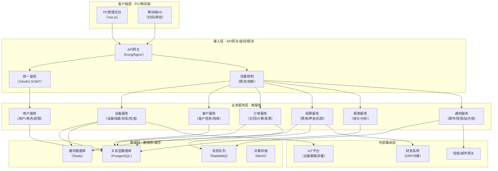
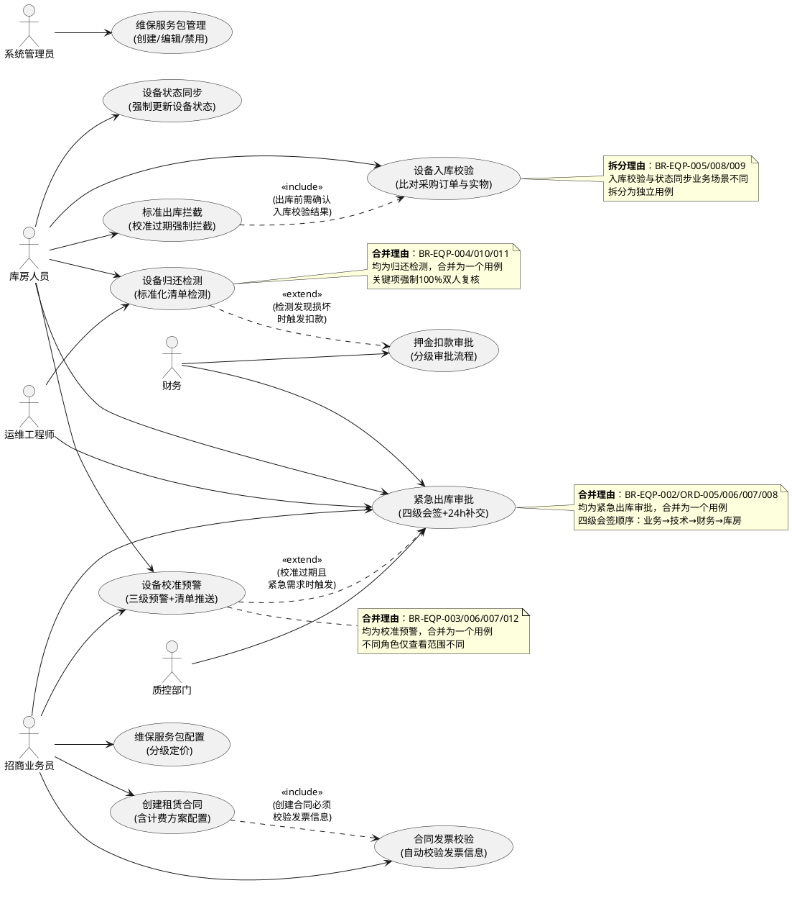
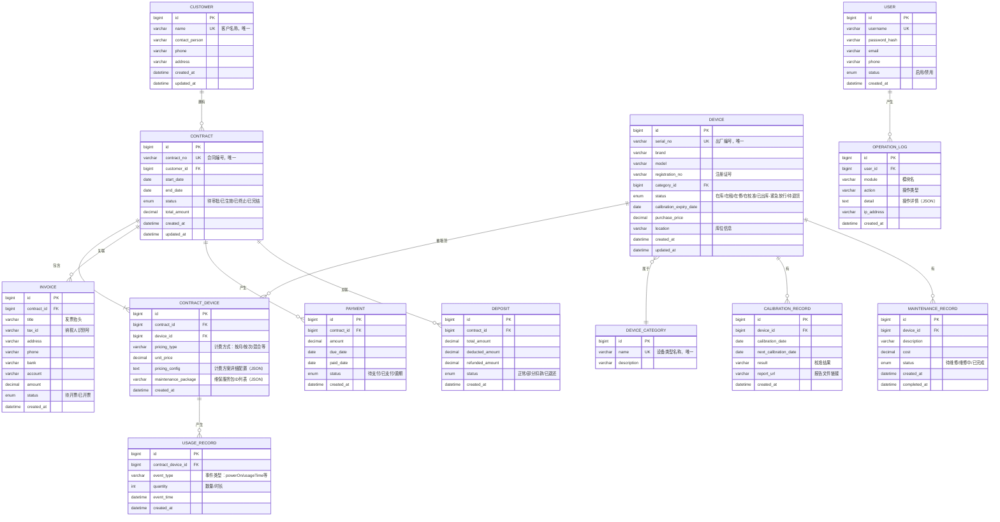
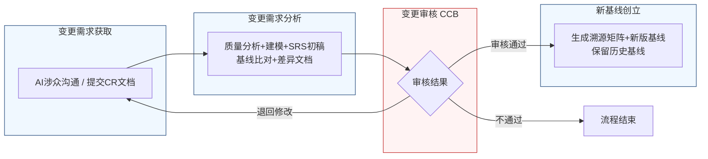

好的，作为一名资深需求分析工程师，我将严格遵循您的要求，采用两阶段法，并恪守“精确优先于流畅”的铁律，为您生成这份完整的软件需求规格说明书（SRS）。

---

# 文档头部信息

| 项目项 | 内容 |
| ---- | ---- |
| 文档名称 | 软件需求规格说明书（SRS） |
| 项目名称 | 医疗器械租赁管理系统 |
| 项目编号 | MED-RENTAL-2026 |
| 文档版本 | V1.0.0 |
| 基线版本 | 【占位，由A6分配】 |
| 编制人 | AI基线智能体（A6） |
| 编制日期 | 2026-06-26 |
| 审核人 | CCB变更控制委员会 |
| 批准人 | CCB变更控制委员会 |
| 密级 | 内部 |

## 修订历史记录

| 版本号 | 修订日期 | 修订类型 | 修订内容简述 |
| :--- | :--- | :--- | :--- |
| V1.0.0 | 2026-06-26 | 新建 | 文档初稿，确立初始需求基线 |

# 1 引言

## 1.1 编制目的

本软件需求规格说明书（SRS）旨在为“医疗器械租赁管理系统”（项目编号：MED-RENTAL-2026）的开发、测试、部署及验收提供一份完整、精确、无歧义的需求基线。本文档的编制目的是：

1.  **建立共识**：在项目干系人（包括但不限于库房人员、招商业务员、运维工程师、财务人员、质控部门及开发团队）之间，就系统“应该做什么”和“不应该做什么”建立明确、一致的共识。
2.  **指导设计**：为后续的概要设计、详细设计、数据库设计及用户界面设计提供精确的输入和约束。
3.  **提供验证依据**：为系统测试、用户验收测试（UAT）提供可量化、可追溯的验收标准，确保交付的系统满足既定需求。
4.  **管理变更**：作为需求基线管理的核心文档，为后续的需求变更提供基准和追溯依据。

## 1.2 文档范围（包含/排除）

**包含范围**：
本文档详细描述了“医疗器械租赁管理系统”V1.0.0版本的功能需求、非功能需求、外部接口需求及数据需求。具体涵盖以下7个核心业务模块：
1.  用户认证与权限管理
2.  设备管理（含入库、出库、归还、校准预警、状态同步）
3.  客户管理
4.  租赁订单管理（含合同创建、计费方案、发票校验、维保服务）
5.  费用结算管理（含押金、租金、扣款审批）
6.  数据统计与报表
7.  系统配置

**排除范围**：
本文档不包含以下内容：
1.  **项目计划**：如详细的开发时间表、资源分配、风险管理计划等。
2.  **系统设计**：如具体的软件架构选型、数据库物理设计、用户界面原型、API接口详细定义等。
3.  **测试用例**：具体的测试步骤、测试数据和预期结果。
4.  **用户手册**：最终用户的操作指南和培训材料。
5.  **硬件采购清单**：服务器、网络设备等硬件设施的采购与部署方案。
6.  **与第三方物联网（IoT）平台的详细集成方案**：仅定义接口需求，不涉及平台内部实现。

## 1.3 引用文件

以下文件中的条款通过本文件的引用而成为本文件的条款。凡是注日期的引用文件，其随后所有的修改单（不包括勘误的内容）或修订版均不适用于本文件。凡是不注日期的引用文件，其最新版本适用于本文件。

1.  **GB/T 9385-2008** 计算机软件需求规格说明规范
2.  **IEEE Std 830-1998** IEEE Recommended Practice for Software Requirements Specifications
3.  **《高级软件设计实践》** 教材书稿
4.  **医疗器械租赁管理系统涉众需求调研记录**（路径：`raw/notes/`）
    -   `raw/notes/库房人员-20260626-1434-需求记录.md`
    -   `raw/notes/运维工程师-20260626-1434-需求记录.md`
    -   `raw/notes/招商业务员-20260626-1434-需求记录.md`
5.  **医疗器械租赁管理系统UML建模产物**
6.  **医疗器械租赁管理系统结构化需求清单**

## 1.4 术语与缩略语

| 术语/缩略语 | 定义 |
| :--- | :--- |
| **SRS** | 软件需求规格说明书（Software Requirements Specification） |
| **CCB** | 变更控制委员会（Change Control Board） |
| **CR** | 变更请求（Change Request） |
| **FR** | 功能需求（Functional Requirement） |
| **NFR** | 非功能需求（Non-Functional Requirement） |
| **BR** | 业务需求（Business Requirement） |
| **UR** | 用户需求（User Requirement） |
| **UAT** | 用户验收测试（User Acceptance Testing） |
| **RTM** | 需求追溯矩阵（Requirements Traceability Matrix） |
| **IoT** | 物联网（Internet of Things） |
| **API** | 应用程序编程接口（Application Programming Interface） |
| **P0** | 优先级0，必须实现，否则系统无法上线或核心业务无法运转。 |
| **P1** | 优先级1，重要需求，对业务有显著价值，建议在核心版本中实现。 |
| **P2** | 优先级2，次要需求，可在后续迭代中实现。 |
| **紧急放行** | 指设备校准过期，但因临床紧急救治等特殊场景，经特殊审批流程后允许出库的特殊状态。 |
| **关键项** | 指在设备检测流程中，涉及人身安全或核心功能的检测项目，如电气安全、压力容器安全等。 |

## 1.5 业务背景概述

**现状痛点**：
当前医疗器械租赁业务管理主要依赖线下表格和人工经验，存在以下核心痛点：
1.  **合规风险高**：设备校准过期后仍可能被出库，存在严重的安全隐患和法规合规风险（如违反《医疗器械使用质量监督管理办法》）。
2.  **流程僵化**：缺乏灵活的应急出库通道，在临床紧急救治等特殊场景下，业务可能因流程卡顿而中断。
3.  **信息孤岛**：设备状态（在库、在租、在修、在校准）更新不及时，导致“系统有货，实物找不到”的库存差异，影响业务决策。
4.  **效率低下**：合同录入、发票校验、费用结算等环节依赖人工核对，错误率高，审批周期长，返工频繁。
5.  **数据不透明**：设备全生命周期状态（特别是校准有效期）缺乏系统化预警机制，无法提前安排校准，影响设备可用性和客户满意度。

**建设目标**：
建设一套集设备管理、租赁订单管理、费用结算于一体的医疗器械租赁管理系统，实现以下量化业务目标：
1.  **合规出库率100%**：杜绝校准过期设备未经特殊审批而出库的情况。
2.  **库存准确率≥99.5%**：通过强制状态同步机制，确保系统库存与实物库存高度一致。
3.  **合同审批周期缩短50%**：通过自动校验和流程优化，将平均合同审批周期从当前水平降低50%。
4.  **校准预警覆盖率100%**：对所有在库、在租、在修设备实现校准有效期预警，确保无遗漏。
5.  **紧急出库响应时间≤30分钟**：从发起紧急出库申请到审批完成，全流程耗时不超过30分钟。

# 2 总体描述

## 2.1 产品概述（系统定位、核心价值）

**系统定位**：
“医疗器械租赁管理系统”是一套面向医疗器械租赁企业的业务管理平台，旨在通过数字化手段，对设备从入库、出库、租赁、归还到报废的全生命周期进行精细化、合规化管理。

**核心价值**：
1.  **安全合规**：通过强制拦截和特殊审批流程，确保设备使用安全，满足法规合规要求。
2.  **高效运营**：通过自动化校验、标准化流程和实时预警，提升业务流转效率，降低运营成本。
3.  **数据驱动**：通过全链路数据采集和分析，为库存管理、设备维保、业务决策提供数据支持。

### 系统架构图（Mermaid代码）

## 2.2 运行环境要求

| 类别 | 项目 | 最低配置 | 推荐配置 |
| :--- | :--- | :--- | :--- |
| **服务器** | CPU | 8核，2.0GHz | 16核，2.5GHz |
| | 内存 | 32GB | 64GB |
| | 硬盘 | 500GB SSD | 1TB NVMe SSD |
| | 操作系统 | CentOS 7.9 / Ubuntu 20.04 | CentOS 7.9 / Ubuntu 22.04 |
| **客户端** | 操作系统 | Windows 10 / macOS 12 / iOS 14 / Android 10 | Windows 11 / macOS 14 / iOS 17 / Android 14 |
| | 浏览器 | Chrome 90+ / Firefox 90+ / Safari 14+ | Chrome 最新版 |
| | 分辨率 | 1280x720 | 1920x1080 |
| **网络** | 带宽 | 10Mbps | 50Mbps |
| **软件依赖** | 数据库 | PostgreSQL 14 | PostgreSQL 15 |
| | 缓存 | Redis 6 | Redis 7 |
| | 消息队列 | RabbitMQ 3.9 | RabbitMQ 3.12 |
| | 对象存储 | MinIO | MinIO |

## 2.3 用户角色与特征

| 角色 | 职责 | 核心权限 | 使用频次 | 技能要求 |
| :--- | :--- | :--- | :--- | :--- |
| **库房人员** | 设备入库、出库、归还、盘点、状态更新 | 设备管理、出库申请、归还检测、库存查询 | 每日多次 | 熟悉设备操作流程，具备基础计算机操作能力 |
| **招商业务员** | 客户开发、合同签订、租赁方案制定 | 客户管理、合同创建与编辑、计费方案配置、维保服务配置 | 每日多次 | 熟悉租赁业务，具备商务谈判能力，熟练使用系统 |
| **运维工程师** | 设备维修、保养、校准、技术评估 | 设备维修工单、校准管理、技术风险评估、归还检测复核 | 每周数次 | 具备医疗器械维修专业知识，熟悉设备技术参数 |
| **财务人员** | 费用核算、发票管理、押金管理、收款 | 费用结算、发票校验、押金扣款审批、财务报表查看 | 每日数次 | 熟悉财务流程，具备会计基础知识 |
| **质控部门** | 质量监督、合规审查、异常处理 | 设备入库异常审核、紧急出库审批、质量报告查看 | 每周数次 | 熟悉医疗器械质量管理体系，具备合规审查能力 |
| **系统管理员** | 系统配置、用户管理、权限分配、日志审计 | 所有系统配置、用户管理、角色管理、日志查看 | 按需 | 具备系统管理经验，熟悉权限模型 |

## 2.4 系统运行模式

1.  **正常模式**：
    -   系统所有功能模块正常运行，用户可执行所有授权范围内的操作。
    -   所有业务流程（如设备入库、出库、合同创建、费用结算）按标准流程执行。
    -   系统响应时间满足非功能需求中的性能指标。

2.  **异常模式**：
    -   **部分服务不可用**：当某个微服务（如通知服务）发生故障时，不影响其他核心业务（如设备出库、合同创建）的正常运行。系统应降级运行，并记录错误日志。
    -   **数据库主从切换**：当主数据库发生故障时，系统应自动切换到从数据库，并在60秒内恢复服务。切换期间，部分写操作可能短暂不可用。
    -   **网络中断**：当客户端网络中断时，应给出明确提示，并保存用户当前操作状态（如草稿），待网络恢复后允许继续提交。

3.  **维护模式**：
    -   系统管理员可手动将系统切换至维护模式。
    -   在维护模式下，所有非管理员用户将被强制登出，并看到系统维护提示页面。
    -   系统管理员可进行数据库备份、版本升级、配置修改等操作。
    -   维护完成后，系统管理员手动切换回正常模式。

## 2.5 设计与实现约束

1.  **技术约束**：
    -   后端必须采用微服务架构，服务间通过RESTful API或消息队列通信。
    -   前端必须采用前后端分离的单页应用（SPA）架构。
    -   所有API接口必须遵循RESTful设计规范。
    -   数据库必须使用PostgreSQL，缓存必须使用Redis。

2.  **合规约束**：
    -   系统必须满足《医疗器械使用质量监督管理办法》等相关法规对设备校准、使用记录的要求。
    -   所有操作日志必须完整记录，保留时间不少于3年，以备审计。
    -   用户密码必须加密存储，不得明文保存。

3.  **接口约束**：
    -   与IoT平台的接口必须支持MQTT协议，用于接收设备开机次数、使用时长等数据。
    -   与财务系统（ERP）的接口必须支持SFTP文件交换或标准API对接。

4.  **工期约束**：
    -   核心功能（设备管理、租赁订单、费用结算）必须在项目启动后6个月内完成开发并上线试运行。

## 2.6 假设与依赖

1.  **假设**：
    -   假设所有用户都已通过公司内部网络或VPN接入系统，网络环境稳定。
    -   假设第三方IoT平台能够稳定、准确地提供设备使用数据。
    -   假设财务系统（ERP）能够提供标准化的接口用于数据交换。

2.  **依赖**：
    -   本系统的开发依赖于《高级软件设计实践》教材中提供的设计原则和最佳实践。
    -   本系统的部署依赖于公司IT基础设施部门提供满足运行环境要求的服务器和网络资源。
    -   本系统的成功上线依赖于所有涉众（特别是库房人员、招商业务员）的积极参与和配合。

# 3 具体需求

## 3.1 功能需求（FR）

### 3.1.1 用户认证与权限管理

**FR-AUTH-001：用户登录与登出**
-   **优先级**：P0
-   **参与角色**：所有用户
-   **前置条件**：用户已通过管理员创建账号。
-   **触发方式**：用户在登录页面输入用户名和密码，点击“登录”按钮。
-   **业务流程**：
    1.  系统接收用户输入的用户名和密码。
    2.  系统对密码进行加密处理。
    3.  系统将加密后的凭证与数据库中存储的用户信息进行比对。
    4.  若比对成功，系统生成一个有效期为480分钟（8小时）的JWT Token，并返回给客户端。
    5.  客户端将Token存储在本地（如localStorage），并在后续所有API请求的Header中携带该Token。
    6.  若比对失败（用户名不存在或密码错误），系统返回“用户名或密码错误”的提示信息。
    7.  用户点击“登出”按钮，客户端清除本地存储的Token，并跳转至登录页面。
-   **业务规则**：
    1.  密码输入错误连续5次，该账号将被锁定30分钟。
    2.  Token过期后，用户需重新登录。
-   **后置状态**：用户成功登录，系统跳转至首页。用户成功登出，系统跳转至登录页。
-   **验收标准**：
    1.  使用正确的用户名和密码，能在3秒内成功登录系统。
    2.  使用错误的密码连续输入5次，账号被锁定，30分钟内无法登录。
    3.  登录成功后，在无操作480分钟后，再次发起API请求，系统返回401状态码。
-   **关联需求条目**：无

**FR-AUTH-002：角色与权限管理**
-   **优先级**：P1
-   **参与角色**：系统管理员
-   **前置条件**：系统管理员已登录。
-   **触发方式**：系统管理员进入“系统配置 > 角色管理”或“用户管理”页面。
-   **业务流程**：
    1.  **角色管理**：管理员可创建、编辑、删除角色。每个角色可被赋予一组权限（如“设备管理-查看”、“设备管理-编辑”、“合同创建”等）。
    2.  **用户管理**：管理员可创建、编辑、禁用/启用用户。创建或编辑用户时，必须为用户分配一个或多个角色。
    3.  用户权限由其拥有的所有角色的权限集合取并集决定。
-   **业务规则**：
    1.  系统预置“系统管理员”、“库房人员”、“招商业务员”、“运维工程师”、“财务人员”、“质控部门”等角色，并赋予默认权限。
    2.  删除角色前，系统需检查是否有用户正在使用该角色。若有，则禁止删除。
    3.  禁用用户后，该用户的所有活跃Token立即失效。
-   **后置状态**：角色或用户信息更新成功，系统记录操作日志。
-   **验收标准**：
    1.  管理员可以成功创建一个新角色，并为其分配“设备管理-查看”权限。
    2.  将一个用户从“库房人员”角色改为“招商业务员”角色后，该用户登录后只能看到招商业务员相关的菜单和功能。
    3.  禁用一个用户后，该用户立即无法登录系统。
-   **关联需求条目**：无

### 3.1.2 设备管理

**FR-EQP-001：设备入库校验**
-   **优先级**：P1
-   **参与角色**：库房人员，采购部门，质检部门
-   **前置条件**：设备已到货，库房人员持有采购订单信息。
-   **触发方式**：库房人员在系统中选择“设备入库”功能，扫描设备标签或手动输入设备信息。
-   **业务流程**：
    1.  库房人员扫描设备上的条码/二维码，或手动输入品牌型号、出厂编号、注册证号。
    2.  系统自动调取对应的采购订单信息。
    3.  系统自动比对实物信息与采购订单信息中的品牌型号、出厂编号、注册证号。
    4.  **比对一致**：系统允许继续执行入库检测流程。
    5.  **比对不一致**：系统自动生成“信息异常”标记，暂停入库操作。同时，系统自动向采购部门和质检部门发送通知。
    6.  采购部门核实信息后，可在系统中更新采购订单信息或发起退货流程。
    7.  质检部门对设备进行实物复核，并在系统中出具复核报告。
    8.  采购和质检处理完成后，系统汇总处理结果。若问题已解决，库房人员可继续执行入库流程；否则，设备退回供应商。
-   **业务规则**：
    1.  比对字段包括：品牌型号、出厂编号、注册证号。三个字段必须完全一致。
    2.  异常通知必须在异常发生后5分钟内通过站内信和邮件发送给采购和质检部门负责人。
    3.  入库操作被暂停后，最长可暂停72小时。超过72小时未处理，系统自动将该设备标记为“待退货”。
-   **后置状态**：设备入库成功，状态更新为“在库”，并分配库位。或设备因信息异常被标记为“待退货”。
-   **验收标准**：
    1.  扫描一个与采购订单信息完全一致的设备，系统允许继续入库。
    2.  扫描一个出厂编号与采购订单不符的设备，系统弹出“信息异常”提示，并暂停入库。
    3.  采购和质检部门在5分钟内收到异常通知。
    4.  一个被暂停入库的设备，在72小时内未处理，状态自动变为“待退货”。
-   **关联需求条目**：BR-EQP-005 / UR-EQP-005

**FR-EQP-002：设备校准预警**
-   **优先级**：P0
-   **参与角色**：库房人员，招商业务员，运维工程师
-   **前置条件**：系统中存在设备，且设备已设置校准有效期。
-   **触发方式**：系统定时任务每日凌晨02:00执行。
-   **业务流程**：
    1.  系统每日扫描所有状态为“在库”、“在租”、“在修”的设备。
    2.  对于每台设备，系统计算其校准到期日与当前日期的差值。
    3.  根据差值，系统触发不同级别的预警：
        -   **一级预警（红色）**：差值 ≤ 7天。
        -   **二级预警（橙色）**：7天 < 差值 ≤ 15天。
        -   **三级预警（黄色）**：15天 < 差值 ≤ 30天。
    4.  系统自动生成“临期设备清单”，包含设备编号、名称、型号、当前状态、校准到期日、预警级别等信息。
    5.  每周一上午09:00，系统将“临期设备清单”以邮件形式推送给库房人员、校准组和业务部门负责人。
    6.  在设备校准到期前30天、15天、7天，系统分别向设备当前责任人（如库房人员、招商业务员）发送一次专项提醒（站内信+邮件）。
-   **业务规则**：
    1.  预警范围必须覆盖所有状态（在库、在租、在修）的设备。
    2.  专项提醒在到期前30天、15天、7天各发送一次，不可重复发送。
    3.  每周推送的“临期设备清单”包含所有预警级别的设备。
-   **后置状态**：系统生成预警记录，并成功发送通知。
-   **验收标准**：
    1.  将一台在库设备的校准有效期设置为7天后，第二天该设备出现在一级预警清单中。
    2.  将一台在租设备的校准有效期设置为16天后，第二天该设备出现在二级预警清单中。
    3.  在设备校准到期前30天、15天、7天，责任人分别收到3次不同的提醒通知。
    4.  每周一上午09:00，相关角色收到包含所有预警设备的邮件清单。
-   **关联需求条目**：BR-EQP-003 / UR-EQP-003, BR-EQP-006 / UR-EQP-006, BR-EQP-007 / UR-EQP-007, BR-EQP-012 / UR-EQP-012

**FR-EQP-003：标准出库拦截**
-   **优先级**：P0
-   **参与角色**：库房人员
-   **前置条件**：库房人员发起出库申请，选择待出库设备。
-   **触发方式**：库房人员在出库单中提交待出库设备列表。
-   **业务流程**：
    1.  库房人员在系统中创建出库单，并扫描或选择待出库设备。
    2.  系统对每一台待出库设备进行校验：
        -   校验设备状态是否为“在库”。
        -   校验设备校准有效期是否大于当前日期。
    3.  **所有校验通过**：系统允许继续执行出库流程。
    4.  **任一校验不通过**（如设备状态非“在库”或校准已过期）：系统弹出拦截提示，明确告知被拦截的设备编号、名称及拦截原因（“设备状态异常”或“校准已过期”）。出库流程终止。
-   **业务规则**：
    1.  拦截是强制性的，不可被用户绕过。
    2.  被拦截的设备无法被选中用于本次出库。
-   **后置状态**：出库流程被终止，或允许继续执行。
-   **验收标准**：
    1.  选择一台校准已过期的设备发起出库，系统弹出拦截提示，出库流程终止。
    2.  选择一台状态为“在修”的设备发起出库，系统弹出拦截提示，出库流程终止。
    3.  选择一台状态为“在库”且校准未过期的设备发起出库，系统允许继续。
-   **关联需求条目**：BR-EQP-001 / UR-EQP-001

**FR-EQP-004：紧急出库审批**
-   **优先级**：P0
-   **参与角色**：库房人员，招商业务员，运维工程师，财务人员，质控部门，库房主管
-   **前置条件**：设备因校准过期被标准出库流程拦截，且确认为临床紧急需求。
-   **触发方式**：库房人员在拦截提示页面点击“发起紧急出库审批”按钮。
-   **业务流程**：
    1.  库房人员填写紧急出库申请单，内容包括：设备信息、紧急原因描述、承诺补交校准报告的时间（不得超过24小时）。
    2.  系统根据设备价值自动确定审批层级：
        -   **设备价值 ≤ 100,000元**：触发三级审批流程（业务对接人 → 技术/维修负责人 → 库房主管）。
        -   **设备价值 > 100,000元**：触发四级审批流程（业务对接人 → 技术/维修负责人 → 财务负责人 → 库房主管）。
    3.  **第一签（业务对接人）**：审核业务必要性。若通过，流转至下一签；否则，流程驳回。
    4.  **第二签（技术/维修负责人）**：评估技术风险。若通过，流转至下一签；否则，流程驳回。
    5.  **第三签（财务负责人）**：审核财务影响与押金（仅四级审批）。若通过，流转至下一签；否则，流程驳回。
    6.  **第四签（库房主管）**：确认最终放行。若通过，流程结束；否则，流程驳回。
    7.  审批通过后，系统自动执行以下操作：
        -   生成“紧急放行”标识，并记录在设备档案中。
        -   记录完整的审批日志。
        -   更新设备状态为“已出库-紧急放行”。
        -   启动24小时补交报告倒计时。
-   **业务规则**：
    1.  审批流程为串行会签，任一环节驳回，整个流程终止。
    2.  每个审批环节的超时时间为2小时。超时未处理，系统自动发送催办通知。
    3.  24小时内未补交校准报告，系统自动向库房主管和质控部门发送告警通知。
-   **后置状态**：设备状态更新为“已出库-紧急放行”，或审批流程被驳回。
-   **验收标准**：
    1.  为一台价值50,000元的过期设备发起紧急出库，审批流程为三级（业务→技术→库房主管）。
    2.  为一台价值200,000元的过期设备发起紧急出库，审批流程为四级（业务→技术→财务→库房主管）。
    3.  任一审批人点击“驳回”，流程终止，设备状态不变。
    4.  所有审批人点击“通过”后，设备状态变为“已出库-紧急放行”，并开始24小时倒计时。
    5.  24小时后未补交报告，库房主管和质控部门收到告警。
-   **关联需求条目**：BR-EQP-002 / UR-EQP-002

**FR-EQP-005：设备归还检测**
-   **优先级**：P1
-   **参与角色**：库房人员，运维工程师
-   **前置条件**：设备已从客户处归还。
-   **触发方式**：库房人员在系统中选择“设备归还”功能，扫描设备条码。
-   **业务流程**：
    1.  库房人员扫描归还设备条码。
    2.  系统自动调取该设备出库前的检测记录，并加载标准化的归还检测清单。
    3.  库房人员按照清单逐项执行常规项检测，并在系统中记录检测结果（通过/不通过/不适用）。
    4.  系统自动识别检测项中的“关键项”（如电气安全）。
    5.  **存在关键项**：库房人员发起关键项双人复核请求。
    6.  **运维工程师**：使用自己的账号登录系统，对关键项进行复核，并记录复核结果。
    7.  系统汇总所有检测结果：
        -   **所有项通过**：设备状态更新为“在库-待校准/待入库”。
        -   **存在不通过项**：设备状态更新为“待维修”，系统自动创建维修工单。
-   **业务规则**：
    1.  归还检测清单必须与入库检测清单保持一致。
    2.  关键项必须由运维工程师进行100%双人复核，库房人员不能自行确认。
    3.  关键项复核未通过，设备直接进入“待维修”状态。
-   **后置状态**：设备状态更新为“在库-待校准/待入库”或“待维修”。
-   **验收标准**：
    1.  扫描一台归还设备，系统加载的检测清单与出库前一致。
    2.  完成所有常规项检测后，系统提示需要运维工程师对“电气安全”关键项进行复核。
    3.  运维工程师复核“电气安全”不通过，设备状态自动变为“待维修”，并生成维修工单。
    4.  所有检测项通过后，设备状态变为“在库-待校准/待入库”。
-   **关联需求条目**：BR-EQP-004 / UR-EQP-004, BR-EQP-010 / UR-EQP-010, BR-EQP-011 / UR-EQP-011

**FR-EQP-006：设备状态同步**
-   **优先级**：P1
-   **参与角色**：库房人员，运维工程师
-   **前置条件**：设备需要变更状态（如送修、送校准）。
-   **触发方式**：库房人员或运维工程师在系统中操作设备状态变更。
-   **业务流程**：
    1.  用户选择需要变更状态的设备。
    2.  用户选择目标状态（如“在修”、“在校准”）。
    3.  系统强制要求用户填写状态变更原因及预计完成时间。
    4.  用户提交后，系统立即更新设备状态，并记录操作日志。
    5.  当设备维修或校准完成并归还时，用户需再次操作，将状态更新回“在库”。
-   **业务规则**：
    1.  设备状态变更操作是强制性的。在设备出库（送修/送校准）前，必须先在系统中完成状态变更，否则无法进行后续操作。
    2.  系统应提供“状态变更记录”查询功能，可追溯设备所有历史状态变更。
-   **后置状态**：设备状态更新，操作日志记录。
-   **验收标准**：
    1.  尝试将一台“在库”设备直接送修，但未在系统中变更状态，系统提示必须先变更状态。
    2.  在系统中将设备状态从“在库”变更为“在修”，并填写原因和预计完成时间，设备状态立即更新。
    3.  查询该设备的历史状态变更记录，可以看到刚才的操作。
-   **关联需求条目**：BR-EQP-009 / UR-EQP-009

### 3.1.3 客户管理

**FR-CUST-001：客户信息管理**
-   **优先级**：P1
-   **参与角色**：招商业务员
-   **前置条件**：招商业务员已登录。
-   **触发方式**：招商业务员进入“客户管理”页面。
-   **业务流程**：
    1.  招商业务员可以创建、编辑、查询、查看客户详情。
    2.  创建客户时，必须填写客户名称、联系人、联系电话、地址等基本信息。
    3.  客户详情页包含基本信息、合同历史、租赁设备历史、费用结算记录等。
-   **业务规则**：
    1.  客户名称在系统中必须唯一。
    2.  客户信息编辑后，系统记录修改日志。
-   **后置状态**：客户信息创建或更新成功。
-   **验收标准**：
    1.  创建一个新客户，填写所有必填项，客户创建成功。
    2.  尝试创建一个已存在的客户名称，系统提示“客户名称已存在”。
-   **关联需求条目**：无

### 3.1.4 租赁订单

**FR-ORD-001：创建租赁合同**
-   **优先级**：P0
-   **参与角色**：招商业务员
-   **前置条件**：客户信息已存在，设备信息已存在。
-   **触发方式**：招商业务员进入“合同管理”页面，点击“新建合同”。
-   **业务流程**：
    1.  招商业务员选择客户。
    2.  招商业务员选择租赁设备，并配置计费方案（见FR-ORD-002）。
    3.  招商业务员配置维保服务包（见FR-ORD-004）。
    4.  系统自动校验发票信息（见FR-ORD-003）。
    5.  招商业务员填写合同起止日期、付款方式等其他信息。
    6.  招商业务员提交合同，进入审批流程。
-   **业务规则**：
    1.  合同必须关联一个已存在的客户。
    2.  合同必须至少包含一台设备。
    3.  合同提交前，发票信息校验必须通过。
-   **后置状态**：合同创建成功，状态为“待审批”。
-   **验收标准**：
    1.  选择一个客户和一台设备，配置好计费方案，填写完整信息后提交，合同创建成功，状态为“待审批”。
    2.  尝试提交一个未选择设备的合同，系统提示“请至少选择一台设备”。
-   **关联需求条目**：BR-ORD-001 / UR-ORD-001

**FR-ORD-002：灵活计费方案配置**
-   **优先级**：P0
-   **参与角色**：招商业务员
-   **前置条件**：在创建或编辑合同时。
-   **触发方式**：在合同编辑页面，为某台设备配置“租金方案”。
-   **业务流程**：
    1.  招商业务员选择计费方式：
        -   **固定周期计费**：按月、按季度、按年。需输入单价。
        -   **按使用时长计费**：按小时、按天、按周。需输入单价。
        -   **按使用量计费**：按开机次数、按里程、按疗程。需输入单价，并关联数据采集接口（如IoT模块）。
        -   **混合计费**：固定周期费 + 按使用量费。需分别配置。
        -   **收入分成**：按客户收入的一定比例计费。需输入分成比例。
        -   **固定周期 + 浮动阶梯**：基础固定费用 + 超出部分按阶梯计费。需配置阶梯阈值和单价。
    2.  系统根据配置自动计算租金预览。
-   **业务规则**：
    1.  对于“按使用量计费”，系统必须能够从IoT平台或手动录入获取使用量数据。
    2.  计费方案配置完成后，在合同有效期内不可修改，除非发起合同变更流程。
-   **后置状态**：计费方案配置成功，租金预览更新。
-   **验收标准**：
    1.  为设备配置“按月计费，单价1000元”，系统预览月租金为1000元。
    2.  为设备配置“按开机次数计费，单价50元”，系统预览租金为0，并提示“需根据实际开机次数结算”。
    3.  为设备配置“混合计费：月租500元 + 开机次数*10元”，系统预览月租金为500元+开机次数*10元。
-   **关联需求条目**：BR-ORD-001 / UR-ORD-001, BR-ORD-003 / UR-ORD-003

**FR-ORD-003：合同发票信息自动校验**
-   **优先级**：P0
-   **参与角色**：招商业务员
-   **前置条件**：在创建或编辑合同时，填写了发票信息。
-   **触发方式**：招商业务员填写完发票信息后，系统自动触发校验。
-   **业务流程**：
    1.  招商业务员在合同页面填写发票信息，包括：发票抬头、纳税人识别号、地址、电话、开户行及账号。
    2.  系统实时校验：
        -   **完整性校验**：所有必填字段是否已填写。
        -   **格式校验**：纳税人识别号是否为15位或18位数字或字母；电话是否为11位手机号或区号+号码格式；账号是否为纯数字等。
    3.  校验通过：字段旁显示绿色对勾。
    4.  校验不通过：字段旁显示红色错误提示，并明确告知错误原因。
    5.  发票信息校验未通过前，合同无法提交。
-   **业务规则**：
    1.  校验规则需可配置，以适应不同地区的发票格式要求。
-   **后置状态**：发票信息校验通过或显示错误提示。
-   **验收标准**：
    1.  填写一个格式正确的纳税人识别号，字段旁显示绿色对勾。
    2.  填写一个格式错误的纳税人识别号（如17位数字），字段旁显示红色错误提示“纳税人识别号格式错误”。
    3.  发票信息校验未通过时，合同提交按钮置灰不可用。
-   **关联需求条目**：BR-ORD-002 / UR-ORD-002

**FR-ORD-004：维保服务包配置**
-   **优先级**：P1
-   **参与角色**：招商业务员
-   **前置条件**：在创建或编辑合同时。
-   **触发方式**：在合同编辑页面，为某台设备配置“维保服务”。
-   **业务流程**：
    1.  招商业务员从预定义的维保服务包列表中选择一个或多个服务包。
    2.  服务包示例：
        -   **基础维保**：包含定期巡检、远程技术支持。
        -   **高级维保**：包含基础维保所有内容 + 现场维修、备件更换。
        -   **全保**：包含所有维保服务。
    3.  每个服务包有独立的定价。
    4.  选择服务包后，系统自动计算维保费用，并累加到总租金中。
-   **业务规则**：
    1.  维保服务包由系统管理员在“系统配置”中预定义。
    2.  一个设备可以同时选择多个维保服务包。
-   **后置状态**：维保服务配置成功，总费用更新。
-   **验收标准**：
    1.  为设备选择“基础维保”服务包，系统自动增加相应费用。
    2.  为设备同时选择“基础维保”和“高级维保”，系统累加两项费用。
-   **关联需求条目**：BR-ORD-004 / UR-ORD-004

### 3.1.5 费用结算

**FR-SETT-001：押金扣款审批**
-   **优先级**：P1
-   **参与角色**：财务人员，库房主管
-   **前置条件**：设备归还检测时发现损坏，需要从押金中扣款。
-   **触发方式**：归还检测流程中，检测到设备损坏，系统自动触发扣款流程。
-   **业务流程**：
    1.  归还检测发现设备损坏，系统自动创建扣款申请单，包含设备信息、损坏描述、预估维修费用。
    2.  扣款申请单进入审批流程：
        -   **第一签（财务人员）**：审核扣款金额是否合理，是否符合合同条款。
        -   **第二签（库房主管）**：确认扣款事实，最终批准。
    3.  审批通过后，系统自动从客户押金中扣除相应金额，并生成扣款记录。
    4.  审批驳回，扣款流程终止。
-   **业务规则**：
    1.  扣款金额不得超过合同约定的押金总额。
    2.  扣款审批流程为串行会签。
-   **后置状态**：押金被扣除，或扣款流程被驳回。
-   **验收标准**：
    1.  归还检测发现损坏，系统自动生成扣款申请单。
    2.  财务人员和库房主管都审批通过后，客户押金减少相应金额。
    3.  任一审批人驳回，押金不变。
-   **关联需求条目**：BR-ORD-005 / UR-ORD-005, BR-ORD-006 / UR-ORD-006, BR-ORD-007 / UR-ORD-007, BR-ORD-008 / UR-ORD-008

### 3.1.6 数据统计

**FR-STAT-001：临期设备清单报表**
-   **优先级**：P1
-   **参与角色**：库房人员，招商业务员，运维工程师
-   **前置条件**：用户已登录。
-   **触发方式**：用户进入“报表中心”页面，选择“临期设备清单”。
-   **业务流程**：
    1.  用户选择查询条件（如预警级别、设备状态、设备类型等）。
    2.  系统根据条件，从数据库中查询并生成报表。
    3.  报表以表格形式展示，支持导出为Excel文件。
    4.  报表内容与FR-EQP-002中每周推送的清单一致。
-   **业务规则**：
    1.  报表数据为实时查询，非缓存数据。
-   **后置状态**：报表生成并展示。
-   **验收标准**：
    1.  选择“一级预警”作为查询条件，报表只显示校准到期前7天内的设备。
    2.  点击“导出”按钮，成功下载一个包含报表数据的Excel文件。
-   **关联需求条目**：BR-EQP-003 / UR-EQP-003

### 3.1.7 系统配置

**FR-CONF-001：维保服务包管理**
-   **优先级**：P2
-   **参与角色**：系统管理员
-   **前置条件**：系统管理员已登录。
-   **触发方式**：系统管理员进入“系统配置 > 维保服务包管理”。
-   **业务流程**：
    1.  管理员可以创建、编辑、启用/禁用维保服务包。
    2.  创建服务包时，需填写名称、描述、定价、包含的服务内容列表。
-   **业务规则**：
    1.  被禁用的服务包，在创建新合同时不可见，但不影响已有合同。
-   **后置状态**：维保服务包配置更新。
-   **验收标准**：
    1.  创建一个名为“高级维保”的服务包，定价为500元/月。
    2.  禁用“基础维保”服务包后，创建新合同时无法选择该服务包。
-   **关联需求条目**：BR-ORD-004 / UR-ORD-004

### 系统用例图（PlantUML代码）

## 3.2 外部接口需求（IFR）

**IFR-001：与IoT平台接口**
-   **接口描述**：用于接收设备的使用数据，如开机次数、使用时长、运行状态等。
-   **通信协议**：MQTT
-   **数据格式**：JSON
-   **数据内容**：`{“deviceId”: “SN123456”, “eventType”: “powerOn”, “timestamp”: 1687766400000}`
-   **触发方式**：设备上报数据时，IoT平台主动推送。
-   **可靠性要求**：消息队列应保证消息不丢失，至少一次投递。

**IFR-002：与财务系统（ERP）接口**
-   **接口描述**：用于同步应收、实收、发票等财务数据。
-   **通信协议**：HTTPS / RESTful API 或 SFTP文件交换
-   **数据格式**：JSON 或 CSV
-   **数据内容**：`{“contractId”: “CT20260601”, “amount”: 10000.00, “dueDate”: “2026-06-26”}`
-   **触发方式**：定时任务（如每日凌晨）或事件驱动（如收款确认后）。
-   **安全性要求**：接口调用需使用API密钥进行身份验证，数据传输需使用HTTPS加密。

**IFR-003：与短信/邮件网关接口**
-   **接口描述**：用于发送通知、提醒、告警等信息。
-   **通信协议**：SMTP（邮件）/ HTTP（短信网关API）
-   **数据格式**：标准邮件格式 / JSON
-   **触发方式**：系统内部事件驱动（如审批流转、预警触发）。
-   **可靠性要求**：发送失败后，系统应进行重试（最多3次），并记录失败日志。

## 3.3 非功能需求（NFR）

### 3.3.1 性能需求

| 需求编号 | 需求描述 | 指标 |
| :--- | :--- | :--- |
| NFR-NFR-PERF-001 | 页面加载时间 | 90%的页面加载时间不超过3秒，首页加载时间不超过5秒。 |
| NFR-NFR-PERF-002 | 接口响应时间 | 90%的API接口响应时间不超过500毫秒，复杂报表查询接口不超过5秒。 |
| NFR-NFR-PERF-003 | 并发用户数 | 系统应支持至少200个并发用户同时在线操作。 |
| NFR-NFR-PERF-004 | 吞吐量 | 系统应支持至少每秒处理100个核心业务请求（如出库、合同创建）。 |
| NFR-NFR-PERF-005 | 扫码响应时间 | 扫描设备条码后，系统应在1秒内返回设备信息。 |

### 3.3.2 可靠性需求

| 需求编号 | 需求描述 | 指标 |
| :--- | :--- | :--- |
| NFR-NFR-REL-001 | 系统可用率 | 系统全年可用率不低于99.9%（即全年停机时间不超过8.76小时）。 |
| NFR-NFR-REL-002 | 连续运行时间 | 系统应能7x24小时连续运行，无需计划内重启。 |
| NFR-NFR-REL-003 | 故障恢复时间 | 发生非灾难性故障（如服务进程崩溃）后，系统应在5分钟内自动恢复。 |
| NFR-NFR-REL-004 | 数据备份 | 数据库应每日进行全量备份，每4小时进行增量备份。 |

### 3.3.3 安全性需求

| 需求编号 | 需求描述 | 指标 |
| :--- | :--- | :--- |
| NFR-NFR-SEC-001 | 用户认证 | 必须使用用户名+密码+验证码的方式进行登录认证。 |
| NFR-NFR-SEC-002 | 权限控制 | 所有功能操作必须基于角色的访问控制（RBAC）模型，禁止越权操作。 |
| NFR-NFR-SEC-003 | 数据加密 | 用户密码必须使用bcrypt或类似算法加密存储。所有敏感数据传输必须使用HTTPS加密。 |
| NFR-NFR-SEC-004 | 攻击防护 | 系统应具备防SQL注入、防XSS攻击、防CSRF攻击的能力。 |
| NFR-NFR-SEC-005 | 操作审计 | 所有关键业务操作（如设备出库、合同审批、费用修改）必须记录完整的操作日志，包括操作人、操作时间、操作内容、IP地址等。日志保留时间不少于3年。 |

### 3.3.4 可维护性需求

| 需求编号 | 需求描述 | 指标 |
| :--- | :--- | :--- |
| NFR-NFR-MAINT-001 | 日志系统 | 系统应提供统一的日志记录接口，支持按级别、模块、时间等维度查询日志。 |
| NFR-NFR-MAINT-002 | 配置管理 | 系统关键配置（如数据库连接、缓存配置、预警阈值）应支持外部化配置，修改后无需重启服务即可生效。 |
| NFR-NFR-MAINT-003 | 模块化 | 系统应采用微服务架构，各服务应独立部署、独立升级，一个服务的变更不应影响其他服务。 |

### 3.3.5 可扩展性需求

| 需求编号 | 需求描述 | 指标 |
| :--- | :--- | :--- |
| NFR-SCAL-001 | 水平扩展 | 业务服务层应支持水平扩展，通过增加服务实例来应对用户量和业务量的增长。 |
| NFR-SCAL-002 | 功能扩展 | 系统应预留插件或扩展点，以便未来可以方便地增加新的计费方式、新的维保服务包或对接新的第三方系统。 |

### 3.3.6 易用性需求

| 需求编号 | 需求描述 | 指标 |
| :--- | :--- | :--- |
| NFR-UX-001 | 操作一致性 | 系统中相同类型的操作（如“保存”、“取消”、“删除”）在界面上的位置和交互方式应保持一致。 |
| NFR-UX-002 | 错误提示 | 用户操作失败时，系统应给出明确、友好的错误提示，并指导用户如何修正。 |
| NFR-UX-003 | 帮助系统 | 系统应提供在线帮助文档，关键操作页面应有操作指引。 |
| NFR-UX-004 | 响应式布局 | 系统应支持在PC和移动端（H5）上正常使用，界面布局能自适应屏幕大小。 |

## 3.4 数据需求

### E-R图（Mermaid erDiagram）

### 数据字典（核心表）

| 表名 | 字段名 | 类型 | 主键 | 外键 | 默认值 | 说明 |
| :--- | :--- | :--- | :--- | :--- | :--- | :--- |
| **DEVICE** | id | BIGINT | Y | N | AUTO_INCREMENT | 设备唯一标识 |
| | serial_no | VARCHAR(100) | N | N | N/A | 出厂编号，唯一索引 |
| | brand | VARCHAR(100) | N | N | N/A | 品牌 |
| | model | VARCHAR(100) | N | N | N/A | 型号 |
| | registration_no | VARCHAR(100) | N | N | N/A | 注册证号 |
| | category_id | BIGINT | N | Y (DEVICE_CATEGORY.id) | N/A | 设备类型ID |
| | status | VARCHAR(20) | N | N | ‘在库’ | 设备状态 |
| | calibration_expiry_date | DATE | N | N | N/A | 校准有效期 |
| | purchase_price | DECIMAL(10,2) | N | N | 0.00 | 采购价格 |
| | location | VARCHAR(255) | N | N | N/A | 库位信息 |
| **CONTRACT** | id | BIGINT | Y | N | AUTO_INCREMENT | 合同唯一标识 |
| | contract_no | VARCHAR(50) | N | N | N/A | 合同编号，唯一索引 |
| | customer_id | BIGINT | N | Y (CUSTOMER.id) | N/A | 客户ID |
| | start_date | DATE | N | N | N/A | 合同开始日期 |
| | end_date | DATE | N | N | N/A | 合同结束日期 |
| | status | VARCHAR(20) | N | N | ‘待审批’ | 合同状态 |
| | total_amount | DECIMAL(12,2) | N | N | 0.00 | 合同总金额 |
| **CONTRACT_DEVICE** | id | BIGINT | Y | N | AUTO_INCREMENT | 合同设备关联唯一标识 |
| | contract_id | BIGINT | N | Y (CONTRACT.id) | N/A | 合同ID |
| | device_id | BIGINT | N | Y (DEVICE.id) | N/A | 设备ID |
| | pricing_type | VARCHAR(50) | N | N | N/A | 计费方式 |
| | unit_price | DECIMAL(10,2) | N | N | 0.00 | 单价 |
| | pricing_config | TEXT | N | N | N/A | 计费方案详细配置（JSON） |
| **PAYMENT** | id | BIGINT | Y | N | AUTO_INCREMENT | 付款记录唯一标识 |
| | contract_id | BIGINT | N | Y (CONTRACT.id) | N/A | 合同ID |
| | amount | DECIMAL(12,2) | N | N | 0.00 | 付款金额 |
| | due_date | DATE | N | N | N/A | 应付款日期 |
| | paid_date | DATE | N | N | N/A | 实付款日期 |
| | status | VARCHAR(20) | N | N | ‘待支付’ | 付款状态 |

### 数据管理策略

1.  **备份策略**：
    -   **全量备份**：每日凌晨02:00进行数据库全量备份，保留最近30天的备份文件。
    -   **增量备份**：每4小时进行一次增量备份，保留最近7天的备份文件。
    -   **异地备份**：每周将全量备份文件同步至异地灾备服务器。

2.  **归档策略**：
    -   对于已完结超过3年的合同及其关联数据（如付款记录、使用记录），系统自动将其从主数据库迁移至归档数据库。
    -   归档数据仅支持只读查询，不可修改。

3.  **数据留存**：
    -   所有业务数据（如合同、设备档案）永久保存。
    -   操作日志保留时间不少于3年。
    -   系统运行日志保留时间不少于6个月。

# 4 需求基线与变更管理

## 4.1 需求基线定义

1.  **基线版本格式**：`BL-YYYYMMDD-NN`（YYYYMMDD=日期，NN=当日流水号）。
2.  **初始基线**：经CCB审批通过、正式发布的第一版SRS。
3.  **基线冻结**：基线发布后，禁止无流程私自修改需求。

## 4.2 需求变更整体流程

## 4.3 变更详细流程（四阶段）

### 4.3.1 阶段一：变更需求获取

两种途径：
1.  **AI涉众沟通**：通过AI智能体与涉众进行结构化沟通，自动识别并生成变更需求。
2.  **提交CR文档**：需求提出方（如业务部门）填写正式的《变更需求文档》（CR），提交至CCB。

### 4.3.2 阶段二：变更需求分析（4个子阶段）

1.  **需求质量分析**：由需求分析工程师对变更需求进行校验，确保其合理性、完整性、无歧义性。
2.  **项目建模**：根据变更需求，更新UML用例图、活动图等建模产物。
3.  **SRS初稿生成**：整合变更内容，生成变更后的SRS初稿。
4.  **基线比对**：读取当前生效的历史基线，生成《需求差异文档》，清晰标注新增、修改、删除的需求条目。

### 4.3.3 阶段三：变更审核（CCB评审）

CCB对变更需求、分析结果、差异文档进行评审，做出以下三种结论之一：
1.  **审核不通过**：流程终止，变更需求被拒绝。
2.  **审核退回修改**：返回“阶段一：变更需求获取”，要求需求提出方根据评审意见进行修改。
3.  **审核通过**：进入“阶段四：新基线创立”。

### 4.3.4 阶段四：新基线创立

1.  **生成需求追溯矩阵（RTM）**：建立变更前后需求条目的映射关系，确保所有需求可追溯。
2.  **发布新基线**：将审核通过的SRS定为新版正式基线。
3.  **版本管理**：沿用版本规则生成新基线编号（如`BL-20260701-01`）。
4.  **历史归档**：历史基线文档完整归档，不覆盖、不删除，以备后续查阅。

## 4.4 变更记录台账

| 变更编号 | 变更日期 | 申请人 | 变更来源(AI/CR) | 变更简述 | 影响模块 | CCB结论 | 新版基线号 |
| :--- | :--- | :--- | :--- | :--- | :--- | :--- | :--- |
| — | — | — | 初始基线 | 初始基线，无历史变更 | — | 通过 | 【占位】 |

# 5 附录

## 附录A 全量图表汇总

-   **系统架构图**：见 §2.1
-   **系统用例图**：见 §3.1
-   **E-R图**：见 §3.4
-   **变更流程图**：见 §4.2

## 附录B 验收标准总表

| 需求编号 | 需求名称 | 验收标准 | 优先级 |
| :--- | :--- | :--- | :--- |
| FR-EQP-002 | 设备校准预警 | 1. 将一台在库设备的校准有效期设置为7天后，第二天该设备出现在一级预警清单中。 2. 在设备校准到期前30天、15天、7天，责任人分别收到3次不同的提醒通知。 | P0 |
| FR-EQP-003 | 标准出库拦截 | 1. 选择一台校准已过期的设备发起出库，系统弹出拦截提示，出库流程终止。 2. 选择一台状态为“在库”且校准未过期的设备发起出库，系统允许继续。 | P0 |
| FR-EQP-004 | 紧急出库审批 | 1. 为一台价值50,000元的过期设备发起紧急出库，审批流程为三级（业务→技术→库房主管）。 2. 所有审批人点击“通过”后，设备状态变为“已出库-紧急放行”，并开始24小时倒计时。 | P0 |
| FR-ORD-001 | 创建租赁合同 | 1. 选择一个客户和一台设备，配置好计费方案，填写完整信息后提交，合同创建成功，状态为“待审批”。 2. 尝试提交一个未选择设备的合同，系统提示“请至少选择一台设备”。 | P0 |
| FR-ORD-003 | 合同发票信息自动校验 | 1. 填写一个格式正确的纳税人识别号，字段旁显示绿色对勾。 2. 发票信息校验未通过时，合同提交按钮置灰不可用。 | P0 |

## 附录C 参考资料与外部文档链接

1.  GB/T 9385-2008 计算机软件需求规格说明规范
2.  IEEE 830 软件需求规格说明书标准
3.  《高级软件设计实践》教材书稿
4.  医疗器械租赁管理系统涉众需求调研记录（raw/notes/）
5.  医疗器械租赁管理系统UML建模产物
6.  医疗器械租赁管理系统结构化需求清单