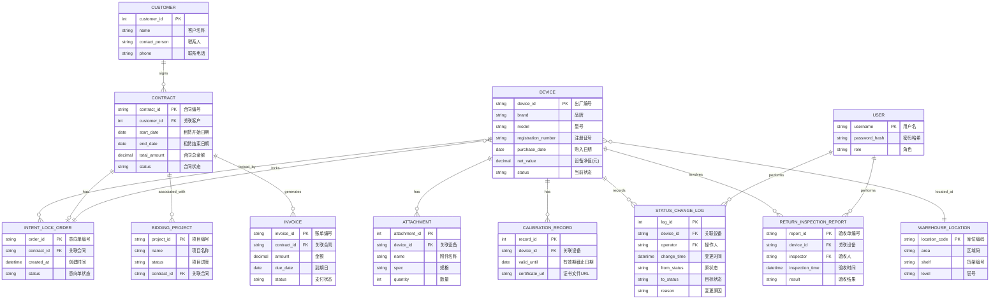
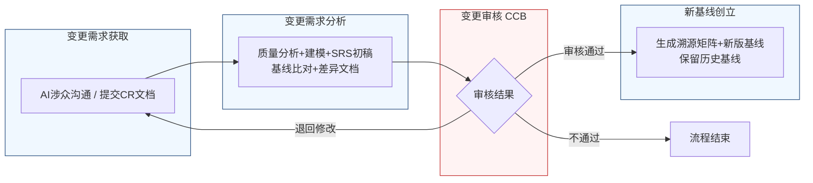

好的，作为一名资深需求分析工程师，我将严格遵循IEEE 830标准和GB/T 9385规范，并采用“两阶段法”为您生成这份完整的软件需求规格说明书（SRS）。我将恪守“精确优先于流畅”的铁律，保留所有数字、边界条件和约束参数。

---
# 文档头部信息
| 项目项 | 内容 |
| ---- | ---- |
| 文档名称 | 软件需求规格说明书（SRS）|
| 项目名称 | 医疗器械租赁管理系统 |
| 项目编号 | MED-RENTAL-2026 |
| 文档版本 | V1.0.0 |
| 基线版本 | BL-20260626-001 |
| 编制人 | AI基线智能体（A6） |
| 编制日期 | 2026-06-26 |
| 审核人 | CCB变更控制委员会 |
| 批准人 | CCB变更控制委员会 |
| 密级 | 内部 |

## 修订历史记录
| 版本号 | 修订日期 | 修订类型 | 修订内容简述 |
| V1.0.0 | 2026-06-26 | 新建 | 文档初稿，确立初始需求基线 |

# 1 引言
## 1.1 编制目的
本文档旨在明确界定“医疗器械租赁管理系统”（以下简称“系统”）的功能需求、非功能需求、外部接口需求及数据需求。本文档的编制目的是：
1.  **建立共识**：在项目干系人（包括库房人员、招商业务员、运维工程师、质量工程师、销售/客服团队、管理层及开发团队）之间建立对系统功能和行为的一致理解。
2.  **指导设计**：为后续的系统设计、架构设计、数据库设计提供精确、无歧义的需求输入。
3.  **作为验收依据**：为系统开发完成后的功能验收、性能测试和用户验收测试提供可量化的、可追溯的验收标准。
4.  **管理变更**：作为需求基线管理的核心文档，为后续的需求变更提供基准和追溯依据。

## 1.2 文档范围（包含/排除）
**包含范围**：
本文档覆盖“医疗器械租赁管理系统”的以下核心业务模块：
1.  用户认证与权限管理
2.  设备管理（含设备档案、库位管理、状态管理、校准预警、附件管理、归还验收、损坏处理）
3.  客户管理（含客户信息、联系人、合同历史）
4.  租赁订单管理（含招投标关联、意向锁定、合同管理、审批流程）
5.  费用结算管理（含租金计算、押金管理、赔偿费用、账单生成）
6.  数据统计与报表
7.  系统配置

**排除范围**：
本文档不包含以下内容：
1.  硬件设备的选型、采购、部署和维护方案。
2.  具体的用户界面（UI）设计稿和交互（UX）原型。
3.  系统的源代码实现细节、算法设计。
4.  第三方支付网关、短信/邮件服务提供商的内部实现。
5.  与医院HIS（医院信息系统）或ERP（企业资源计划）系统的深度集成方案（仅定义接口需求）。
6.  项目开发计划、测试计划、培训计划等项目管理文档。

## 1.3 引用文件
1.  GB/T 9385-2008《计算机软件需求规格说明规范》
2.  IEEE Std 830-1998《IEEE Recommended Practice for Software Requirements Specifications》
3.  《高级软件设计实践》教材书稿
4.  医疗器械租赁管理系统涉众需求调研记录（raw/notes/库房人员-20260626-1144-需求记录.md）
5.  医疗器械租赁管理系统涉众需求调研记录（raw/notes/招商业务员-20260626-1145-需求记录.md）
6.  医疗器械租赁管理系统涉众需求调研记录（raw/notes/运维工程师-20260626-1145-需求记录.md）
7.  医疗器械租赁管理系统结构化需求清单（V1.0）
8.  医疗器械租赁管理系统UML建模产物（用例图、活动图）

## 1.4 术语与缩略语
| 术语/缩略语 | 定义 |
| ---- | ---- |
| SRS | 软件需求规格说明书 |
| CCB | 变更控制委员会，负责评审和批准需求变更 |
| CR | 变更请求，用于正式提出需求变更的文档 |
| FR | 功能需求，描述系统应具备的功能 |
| NFR | 非功能需求，描述系统的质量属性 |
| IFR | 外部接口需求，描述系统与外部系统的交互 |
| BR | 业务需求，从业务目标出发定义的高层次需求 |
| UR | 用户需求，从用户视角出发定义的具体需求 |
| P0 | 最高优先级，系统必须实现的功能，否则项目无法上线 |
| P1 | 重要优先级，系统应实现的功能，对业务有重大影响 |
| P2 | 次要优先级，系统可以实现的功能，用于提升用户体验或效率 |
| RTM | 需求追溯矩阵，用于建立需求条目之间的关联关系 |
| EQP | 设备管理模块的缩写 |
| ORD | 租赁订单管理模块的缩写 |
| FEE | 费用结算模块的缩写 |
| USR | 用户认证模块的缩写 |
| CUS | 客户管理模块的缩写 |
| STA | 数据统计模块的缩写 |
| CFG | 系统配置模块的缩写 |

## 1.5 业务背景概述
**现状痛点**：
当前公司医疗器械租赁业务主要依赖线下表格和纸质单据管理，存在以下痛点：
1.  **设备状态不透明**：设备在库、出租、维修、校准等状态无法实时、准确掌握，导致交付延误或资产损失。
2.  **校准管理被动**：设备校准过期无法自动预警，常出现因校准证书过期导致设备无法出库的合规风险。
3.  **归还验收纠纷多**：附件缺失、设备损坏的责任认定缺乏完整证据链，导致客户纠纷和资产损失。
4.  **招投标响应慢**：从获取招标信息到形成租赁方案、完成审批的流程冗长，响应速度慢，影响中标率。
5.  **信息孤岛**：设备信息、客户信息、合同信息、费用信息分散管理，无法形成有效关联，数据追溯困难。

**建设目标**：
建设一套覆盖设备全生命周期（入库、出库、归还、维修、报废）和租赁业务全流程（线索、合同、订单、结算）的一体化管理系统。

**量化业务目标**：
1.  **设备状态准确率**：系统上线后6个月内，设备实时状态（在库/出租/维修等）与实物状态的一致率达到99.5%以上。
2.  **校准预警覆盖率**：系统上线后，所有设备校准有效期预警通知的发送覆盖率达到100%。
3.  **归还验收效率**：单次设备归还验收的平均操作时间（从开始验收到生成验收单）缩短至15分钟以内。
4.  **招投标响应周期**：从获取招标公告到提交租赁方案的平均周期缩短至48小时以内。
5.  **客户纠纷率**：因附件缺失或损坏导致的客户纠纷数量同比下降50%。

# 2 总体描述
## 2.1 产品概述（系统定位、核心价值）
**系统定位**：本系统是一套面向医疗器械租赁公司的企业级业务管理平台，旨在通过信息化手段，实现设备资产的全生命周期管理和租赁业务的全流程数字化闭环。

**核心价值**：
1.  **资产可视化**：实时、准确地掌握每一台设备的物理位置、技术状态（校准、维修）和业务状态（在库、出租）。
2.  **流程自动化**：自动触发校准预警、损坏判定、通知发送等流程，减少人工干预，提升效率。
3.  **证据链完整化**：通过带水印照片、电子签字、统一验收单等方式，构建从出库到归还的完整证据链，降低业务风险。
4.  **决策数据化**：通过招投标关联、合同管理、数据统计等功能，为业务决策提供数据支持。

### 系统架构图（Mermaid代码）
```mermaid
flowchart TD
    subgraph 客户端层[客户端层 - PC/移动端]
        A1[PC Web管理端<br/>(React/Ant Design Pro)]
        A2[移动端H5<br/>(用于库房扫码验收)]
    end

    subgraph 接入层[接入层 - API网关/鉴权/限流]
        B1[API网关<br/>(Kong/Spring Cloud Gateway)]
        B2[统一认证中心<br/>(OAuth2.0/JWT)]
        B3[限流与熔断<br/>(Sentinel/Hystrix)]
    end

    subgraph 业务服务层[业务服务层 - 微服务]
        C1[用户服务<br/>(用户/角色/权限)]
        C2[设备服务<br/>(档案/状态/校准/附件)]
        C3[客户服务<br/>(客户/联系人)]
        C4[订单服务<br/>(招投标/合同/意向单)]
        C5[结算服务<br/>(费用计算/账单)]
        C6[通知服务<br/>(邮件/短信/站内信)]
        C7[报表服务<br/>(数据统计/导出)]
        C8[文件服务<br/>(图片/文档上传/水印)]
    end

    subgraph 数据层[数据层 - 数据库/缓存]
        D1[关系型数据库<br/>(MySQL/PostgreSQL)]
        D2[缓存数据库<br/>(Redis)]
        D3[对象存储<br/>(MinIO/AWS S3)]
        D4[消息队列<br/>(RabbitMQ/Kafka)]
    end

    A1 --> B1
    A2 --> B1
    B1 --> B2
    B1 --> B3
    B3 --> C1
    B3 --> C2
    B3 --> C3
    B3 --> C4
    B3 --> C5
    B3 --> C6
    B3 --> C7
    B3 --> C8
    C1 --> D1
    C1 --> D2
    C2 --> D1
    C2 --> D2
    C2 --> D3
    C3 --> D1
    C4 --> D1
    C4 --> D2
    C5 --> D1
    C6 --> D4
    C7 --> D1
    C8 --> D3
```

## 2.2 运行环境要求
| 环境类别 | 具体要求 |
| ---- | ---- |
| **服务器硬件** | CPU: 8核及以上，内存: 32GB及以上，磁盘: 500GB SSD及以上（建议云服务器弹性伸缩） |
| **服务器软件** | 操作系统: CentOS 7.x / Ubuntu 20.04 LTS 及以上，Web服务器: Nginx 1.20+，应用服务器: JDK 11+ / Node.js 16+ |
| **数据库** | MySQL 8.0+ 或 PostgreSQL 13+，Redis 6.x+ |
| **客户端浏览器** | Google Chrome 90+，Mozilla Firefox 90+，Microsoft Edge 90+，Safari 14+ |
| **移动端** | 支持iOS 13+ 和 Android 10+ 的微信内置浏览器或系统浏览器 |

## 2.3 用户角色与特征
| 角色 | 职责 | 核心权限 | 使用频次 | 技能要求 |
| ---- | ---- | ---- | ---- | ---- |
| **库房人员** | 设备入库、出库、归还验收、库位管理、附件核对 | 设备档案CRUD、状态变更、验收操作、附件管理 | 每日多次 | 熟悉设备型号、附件清单，具备基本计算机操作能力 |
| **招商业务员** | 招投标信息获取、租赁方案制定、合同发起、意向单提交 | 招投标关联、合同起草、意向单提交、客户信息查看 | 每日多次 | 熟悉招投标流程、合同条款，具备商务谈判能力 |
| **运维工程师** | 设备维修、报废判定、状态标记（不可用/待维修） | 设备状态标记、维修工单处理、报废流程发起 | 每周数次 | 具备医疗器械维修技能，熟悉设备技术状态判定标准 |
| **质量工程师** | 校准有效期管理、接收预警通知 | 校准证书管理、预警通知接收 | 每周数次 | 熟悉医疗器械校准规范，具备质量管理知识 |
| **销售/客服** | 处理附件异常通知、客户沟通、责任认定 | 接收异常通知、查看验收记录、与客户沟通 | 每日数次 | 具备客户服务技巧，熟悉纠纷处理流程 |
| **系统管理员** | 系统配置、用户管理、权限分配、数据维护 | 所有系统配置权限、用户CRUD、角色管理 | 每周一次 | 具备系统运维和数据库管理知识 |
| **管理层** | 查看数据报表、审批关键流程（如报废） | 报表查看、关键流程审批 | 每周数次 | 具备数据分析能力，熟悉公司运营指标 |

## 2.4 系统运行模式
1.  **正常模式**：系统所有功能模块正常运行，用户可执行所有授权的业务操作。系统响应时间满足性能需求。
2.  **异常模式**：当系统检测到关键服务（如数据库、核心业务服务）故障或性能严重下降时，系统应：
    -   自动向系统管理员发送告警通知。
    -   对非核心功能（如数据统计报表）进行降级处理，优先保障核心业务（如设备出库、归还验收）的可用性。
    -   在用户界面显示友好的错误提示，并引导用户稍后重试。
3.  **维护模式**：在计划内系统升级或维护期间，系统管理员可手动将系统切换至维护模式。在此模式下：
    -   所有用户将被强制登出，并重定向到维护公告页面。
    -   系统停止接受新的业务请求。
    -   正在进行的核心业务操作（如正在生成的验收单）应被优雅终止或等待完成后进入维护。

## 2.5 设计与实现约束
1.  **技术约束**：
    -   系统必须采用微服务架构，以便于独立部署、扩展和维护。
    -   前后端必须分离，前端使用现代JavaScript框架（如React或Vue），后端使用Java（Spring Boot）或Go语言。
    -   所有API接口必须遵循RESTful设计规范。
2.  **合规约束**：
    -   系统必须符合《医疗器械监督管理条例》等相关法规对设备追溯、校准管理的要求。
    -   用户数据和业务数据必须加密存储，传输过程必须使用HTTPS协议。
    -   系统必须提供完整的操作日志，满足审计追踪要求。
3.  **接口约束**：
    -   与外部系统（如短信网关、邮件服务）的集成必须通过标准API，并具备重试和熔断机制。
4.  **工期约束**：
    -   核心功能（设备管理、租赁订单管理）必须在项目启动后4个月内完成开发并上线试运行。

## 2.6 假设与依赖
1.  **假设**：
    -   用户具备基本的计算机操作和浏览器使用能力。
    -   公司内部网络环境稳定，能够支持系统的正常访问。
    -   所有设备在入库时都具备唯一的出厂编号，并作为设备档案的唯一标识。
2.  **依赖**：
    -   系统的正常运行依赖于公司IT基础设施（服务器、网络、数据库）的稳定运行。
    -   短信和邮件通知功能的实现依赖于第三方服务提供商的API可用性。
    -   系统与外部系统（如招投标平台）的数据交换依赖于对方提供标准化的数据接口。

# 3 具体需求
## 3.1 功能需求（FR）
### 3.1.1 用户认证模块（USR）
**FR-USR-001：用户登录与登出**
-   **优先级**：P0
-   **参与角色**：所有用户
-   **前置条件**：用户账号已在系统中创建并激活。
-   **触发方式**：用户在登录页面输入用户名和密码，点击“登录”按钮。
-   **业务流程**：
    1.  系统接收用户输入的用户名和密码。
    2.  系统对密码进行加密处理（如BCrypt）。
    3.  系统将加密后的凭证与数据库中存储的用户信息进行比对。
    4.  若比对成功，系统生成一个JWT（JSON Web Token），并设置其有效期为8小时。
    5.  系统将JWT返回给客户端，客户端将其存储在本地（如localStorage）。
    6.  用户点击“登出”按钮，系统清除客户端的JWT，并跳转至登录页面。
-   **业务规则**：
    -   密码输入错误连续5次，该账号将被锁定30分钟。
    -   JWT过期后，用户需重新登录。
-   **后置状态**：用户成功登录系统，进入主界面。或登录失败，显示错误提示信息。
-   **验收标准**：
    1.  使用正确的用户名和密码，能在3秒内成功登录系统。
    2.  使用错误的密码，系统提示“用户名或密码错误”。
    3.  连续输入5次错误密码，账号被锁定，并提示“账号已被锁定，请30分钟后重试”。
    4.  点击“登出”按钮，成功退出系统，并跳转至登录页面。
-   **关联需求条目**：无

**FR-USR-002：角色权限控制**
-   **优先级**：P0
-   **参与角色**：系统管理员
-   **前置条件**：用户已登录，且具有系统管理员角色。
-   **触发方式**：系统管理员进入“用户管理”或“角色管理”页面。
-   **业务流程**：
    1.  系统管理员可以创建、修改、删除角色。
    2.  每个角色可以关联一组权限，权限颗粒度到页面和按钮级别（如“设备管理-查看”、“设备管理-编辑”、“订单管理-审批”）。
    3.  系统管理员可以为每个用户分配一个或多个角色。
    4.  用户登录后，系统根据其拥有的角色，动态加载其有权访问的菜单和功能按钮。
-   **业务规则**：
    -   一个用户可以拥有多个角色，其权限为所有角色权限的并集。
    -   删除角色前，系统必须检查是否有用户关联了该角色，若有，则禁止删除。
-   **后置状态**：用户权限配置生效，用户下次登录或刷新页面后，其界面和功能访问权限得到更新。
-   **验收标准**：
    1.  系统管理员可以成功创建一个名为“库房主管”的角色，并为其分配“设备管理-查看”、“设备管理-编辑”、“验收单-查看”权限。
    2.  将一个用户分配到“库房主管”角色后，该用户登录系统，只能看到设备管理和验收单相关菜单，且无法看到“订单管理”菜单。
    3.  尝试删除一个已被用户关联的角色，系统提示“该角色已被用户关联，无法删除”。
-   **关联需求条目**：无

### 3.1.2 设备管理模块（EQP）
**FR-EQP-001：设备档案建立与库位绑定**
-   **优先级**：P0
-   **参与角色**：库房人员
-   **前置条件**：新设备已到达库房，且实物信息完整。
-   **触发方式**：库房人员在系统中点击“新增设备”按钮。
-   **业务流程**：
    1.  库房人员在表单中输入设备信息，包括但不限于：品牌、型号、出厂编号（唯一）、注册证号、生产日期、购入日期、设备净值（元）。
    2.  系统校验出厂编号的唯一性。若已存在，则提示“出厂编号已存在，请核对”。
    3.  库房人员选择或输入库房库位信息，格式为“区域码-货架编号-层号”（例如：A-01-01）。
    4.  库房人员点击“保存”按钮。
    5.  系统创建设备档案，并记录库位绑定关系。
-   **业务规则**：
    -   出厂编号为必填项，且必须在全系统内唯一。
    -   库位信息为必填项。
    -   设备净值（元）必须大于0。
-   **后置状态**：系统生成一条新的设备档案记录，状态为“未入库”。
-   **验收标准**：
    1.  成功录入一台品牌为“GE”、型号为“Revolution CT”、出厂编号为“CT-2026-001”的设备，并绑定库位“A-01-01”。系统成功创建档案。
    2.  尝试录入一个已存在的出厂编号“CT-2026-001”，系统提示“出厂编号已存在，请核对”，并阻止保存。
    3.  不填写出厂编号或库位信息，点击“保存”，系统提示“必填项不能为空”。
-   **关联需求条目**：BR-EQP-001 / UR-EQP-001

**FR-EQP-002：设备状态管理**
-   **优先级**：P0
-   **参与角色**：库房人员、运维工程师
-   **前置条件**：设备档案已建立。
-   **触发方式**：库房人员在设备档案详情页点击“状态变更”按钮。
-   **业务流程**：
    1.  系统展示当前设备状态及可变更的目标状态列表。
    2.  设备状态包括：“在库”、“出租”、“维修中”、“校准中”、“待报废”、“已报废”、“归还异常”、“不可用”。
    3.  库房人员选择目标状态（如“在库”），并填写变更原因（必填）。
    4.  系统记录状态变更日志，包含变更人、变更时间、原状态、目标状态、变更原因。
    5.  设备状态更新。
-   **业务规则**：
    -   状态转换必须遵循状态机规则。例如，只有“在库”的设备才能变更为“出租”；“归还异常”的设备不能直接变更为“在库”，必须先处理异常。
    -   设备处于“归还异常”状态时，系统应禁止客户意向单锁定该设备。
-   **后置状态**：设备状态更新为所选状态，并记录一条状态变更历史。
-   **验收标准**：
    1.  将一台状态为“在库”的设备变更为“出租”，系统成功更新状态，并记录日志。
    2.  尝试将一台状态为“归还异常”的设备直接变更为“在库”，系统提示“设备处于异常状态，请先处理异常”。
    3.  查看设备状态变更历史，能清晰看到每次变更的详细记录。
-   **关联需求条目**：BR-EQP-002 / UR-EQP-002

**FR-EQP-003：校准有效期管理与预警**
-   **优先级**：P0
-   **参与角色**：库房人员、质量工程师
-   **前置条件**：设备档案已建立。
-   **触发方式**：库房人员在设备档案中上传校准证书/检测报告。
-   **业务流程**：
    1.  库房人员上传校准证书/检测报告的电子文件（支持PDF、JPG、PNG格式，单个文件不超过10MB）。
    2.  库房人员输入校准有效期截止日期（格式：YYYY-MM-DD）。
    3.  系统记录校准有效期。
    4.  系统启动一个定时任务，每天凌晨00:00检查所有设备的校准有效期。
    5.  对于有效期截止日期在30天内的设备，系统向库房人员、质量工程师发送预警通知（站内信+邮件）。
    6.  对于有效期截止日期在15天内的设备，系统再次发送预警通知。
    7.  对于有效期截止日期在7天内的设备，系统发送紧急预警通知。
    8.  对于已过有效期的设备，系统自动将其状态标记为“校准过期”，并禁止其参与任何出库操作。
-   **业务规则**：
    -   校准证书/检测报告为设备档案的必备附件。
    -   预警通知的发送时间点为：到期前30天、15天、7天的上午10:00。
-   **后置状态**：设备关联了校准有效期，系统按计划发送预警通知。过期设备状态自动变为“校准过期”。
-   **验收标准**：
    1.  为一台设备上传校准证书，并设置有效期截止日期为2026-06-26。在2026-06-26上午10:00，相关用户收到预警通知。
    2.  将一台设备的校准有效期设置为2026-06-26（已过期），系统在次日凌晨自动将该设备状态标记为“校准过期”。
    3.  尝试对一台状态为“校准过期”的设备执行出库操作，系统提示“设备校准已过期，无法出库”。
-   **关联需求条目**：BR-EQP-003 / UR-EQP-003

**FR-EQP-004：设备附件管理**
-   **优先级**：P0
-   **参与角色**：库房人员
-   **前置条件**：设备档案已建立。
-   **触发方式**：库房人员在设备档案的“附件管理”标签页点击“新增附件”按钮。
-   **业务流程**：
    1.  库房人员输入附件名称（如“电源线”、“超声探头”、“包装箱”）。
    2.  库房人员输入附件规格（如“3米”、“L12-5”、“标准”）。
    3.  库房人员输入附件数量（整数，必须大于0）。
    4.  系统将该附件清单关联至对应设备档案。
-   **业务规则**：
    -   同一设备下，附件名称和规格的组合必须唯一。
-   **后置状态**：设备档案下新增一条附件记录。
-   **验收标准**：
    1.  为一台设备添加附件“电源线-3米”，数量为1，系统成功保存。
    2.  尝试为同一台设备再次添加“电源线-3米”，系统提示“该附件已存在”。
-   **关联需求条目**：BR-EQP-004 / UR-EQP-004

**FR-EQP-005：设备归还验收**
-   **优先级**：P0
-   **参与角色**：库房人员、销售/客服
-   **前置条件**：设备已从客户处归还至库房。
-   **触发方式**：库房人员在系统中找到对应设备，点击“归还验收”按钮。
-   **业务流程**：
    1.  系统加载该设备的档案信息和出库时的附件清单。
    2.  库房人员核对实物附件与系统清单，并逐项标记“正常”或“异常”。
    3.  若标记为“异常”，库房人员需拍照留存证据（照片自动添加水印，包含设备出厂编号、当前时间戳、库房人员用户名）。
    4.  库房人员检查设备外观和功能，若发现物理损伤或功能异常，拍照并录入“验收异常记录”。
    5.  系统根据预设规则自动判断设备损坏后的处理流程：
        -   规则：若预估维修费用 < 设备当前净值 * 50%，则自动生成“维修工单”，并将设备状态标记为“待维修”。
        -   规则：若预估维修费用 >= 设备当前净值 * 50%，则触发“报废审批流程”，并将设备状态标记为“待报废”。
    6.  系统自动生成统一的“设备归还验收单”，包含验收时间、验收人、附件核对结果、设备状态、异常记录（如有）、处理建议（维修/报废）。
    7.  若验收发现附件异常，系统自动向销售/客服团队发送通知。
-   **业务规则**：
    -   验收单一旦生成，不可修改。如需更正，需走“验收单更正”流程（后续版本实现）。
    -   设备处于“待维修”或“待报废”状态时，系统应禁止客户意向单锁定该设备。
-   **后置状态**：生成一份“设备归还验收单”，设备状态根据验收结果更新（“在库”、“待维修”或“待报废”）。
-   **验收标准**：
    1.  完成一次完整的归还验收流程，所有附件正常，设备无损坏，系统生成一份状态为“正常”的验收单，设备状态变为“在库”。
    2.  验收时发现“电源线”缺失，拍照后标记为“异常”，系统生成验收单，设备状态变为“归还异常”，并自动向销售/客服发送通知。
    3.  验收时发现屏幕碎裂，预估维修费用为设备净值的40%，系统自动生成“维修工单”，设备状态变为“待维修”。
    4.  验收时发现设备严重损坏，预估维修费用为设备净值的60%，系统自动触发“报废审批流程”，设备状态变为“待报废”。
-   **关联需求条目**：BR-EQP-004, BR-EQP-005, BR-EQP-006, BR-EQP-007, BR-EQP-008, BR-EQP-009, BR-EQP-010, BR-EQP-011 / UR-EQP-004, UR-EQP-005, UR-EQP-006, UR-EQP-007, UR-EQP-008, UR-EQP-009, UR-EQP-010, UR-EQP-011

**FR-EQP-006：设备损坏自动判定与流程触发**
-   **优先级**：P1
-   **参与角色**：库房人员、运维工程师
-   **前置条件**：设备归还验收过程中，发现设备损坏。
-   **触发方式**：库房人员在验收界面录入损坏信息并提交。
-   **业务流程**：
    1.  库房人员录入预估维修费用（元）。
    2.  系统读取设备档案中的“设备净值（元）”。
    3.  系统计算 `维修费用占比 = 预估维修费用 / 设备净值`。
    4.  若 `维修费用占比 < 0.5`，系统自动创建一个“维修工单”，并将设备状态设置为“待维修”。维修工单包含设备信息、损坏描述、预估费用、创建人。
    5.  若 `维修费用占比 >= 0.5`，系统自动创建一个“报废审批单”，并将设备状态设置为“待报废”。报废审批单包含设备信息、损坏描述、预估费用、建议。
-   **业务规则**：
    -   预估维修费用必须大于0。
    -   设备净值必须大于0。
-   **后置状态**：系统根据预设规则，自动生成“维修工单”或“报废审批单”，并更新设备状态。
-   **验收标准**：
    1.  设备净值为10000元，录入预估维修费用为4000元（占比40%），系统自动生成“维修工单”，设备状态变为“待维修”。
    2.  设备净值为10000元，录入预估维修费用为6000元（占比60%），系统自动生成“报废审批单”，设备状态变为“待报废”。
-   **关联需求条目**：BR-EQP-008 / UR-EQP-008

**FR-EQP-007：设备档案必备附件（校准证书）管理**
-   **优先级**：P2
-   **参与角色**：库房人员
-   **前置条件**：设备档案已建立。
-   **触发方式**：库房人员在设备档案的“文档”标签页上传文件。
-   **业务流程**：
    1.  系统在设备档案中设置一个专属的“校准证书/检测报告”文档字段。
    2.  库房人员上传校准证书/检测报告。
    3.  系统将该文件作为设备档案的必备附件进行管理，实现“一次上传、全程引用”。
    4.  在设备出库时，系统自动校验该附件是否存在且在校准有效期内。
-   **业务规则**：
    -   设备出库时，若缺少有效的校准证书/检测报告，系统应阻止出库操作。
-   **后置状态**：设备档案关联了校准证书/检测报告。
-   **验收标准**：
    1.  为一台设备上传校准证书，系统成功保存。
    2.  尝试对一台没有上传校准证书的设备执行出库操作，系统提示“设备缺少校准证书，无法出库”。
-   **关联需求条目**：BR-EQP-013 / UR-EQP-013

**FR-EQP-008：附件错混处理**
-   **优先级**：P2
-   **参与角色**：库房人员
-   **前置条件**：设备归还验收时，发现附件错混（如A设备的电源线混入B设备）。
-   **触发方式**：库房人员在验收界面，对错混的附件进行标记。
-   **业务流程**：
    1.  库房人员在附件核对清单中，将错混的附件标记为“待调拨”或“异常”。
    2.  库房人员在设备归还记录中注明问题描述，如“电源线错混，疑似为设备CT-2026-002的附件”。
    3.  系统记录该异常信息。
-   **业务规则**：
    -   标记为“待调拨”的附件，不影响库存盘点，但会生成一个待处理的任务。
-   **后置状态**：附件状态被标记，设备归还记录中增加了问题描述。
-   **验收标准**：
    1.  在验收界面，将一个附件标记为“待调拨”，系统成功更新附件状态。
    2.  查看该设备的归还记录，能看到关于附件错混的问题描述。
-   **关联需求条目**：BR-EQP-012 / UR-EQP-012

### 3.1.3 租赁订单管理模块（ORD）
**FR-ORD-001：招投标关联与匹配**
-   **优先级**：P0
-   **参与角色**：招商业务员
-   **前置条件**：系统已录入或导入招标公告信息。
-   **触发方式**：招商业务员在“招投标管理”模块，点击“新建关联”按钮。
-   **业务流程**：
    1.  招商业务员选择或输入一个招标项目。
    2.  招商业务员根据招标需求，从设备库中搜索并选择可租赁的设备型号。
    3.  系统自动匹配设备库存，并展示符合条件的设备数量、状态、校准有效期等信息。
    4.  招商业务员将选中的设备清单与招标项目进行关联。
-   **业务规则**：
    -   设备匹配规则：设备型号必须与招标需求完全匹配。
-   **后置状态**：招标项目与一组设备清单关联。
-   **验收标准**：
    1.  成功将一个招标项目与3台“GE Revolution CT”设备关联。
    2.  系统展示出这3台设备的实时状态和校准有效期。
-   **关联需求条目**：BR-ORD-001 / UR-ORD-001

**FR-ORD-002：招投标项目进度追踪**
-   **优先级**：P0
-   **参与角色**：招商业务员
-   **前置条件**：招标项目已与设备清单关联。
-   **触发方式**：招商业务员在招标项目详情页更新项目进度。
-   **业务流程**：
    1.  系统提供预定义的进度状态：“投标中”、“已中标”、“已失标”、“合同签订中”、“合同已签订”。
    2.  招商业务员根据实际情况更新项目进度。
    3.  当进度更新为“合同已签订”时，系统允许招商业务员将该招标项目与一个具体的租赁合同进行关联。
-   **业务规则**：
    -   一个招标项目只能关联一个租赁合同。
-   **后置状态**：招标项目的进度状态更新，并可关联至租赁合同。
-   **验收标准**：
    1.  将一个招标项目的进度从“投标中”更新为“已中标”，系统成功保存。
    2.  将一个已“合同已签订”的招标项目与一个租赁合同关联，关联成功。
-   **关联需求条目**：BR-ORD-002 / UR-ORD-002

**FR-ORD-003：招投标需求变更与版本对比**
-   **优先级**：P1
-   **参与角色**：招商业务员
-   **前置条件**：招标项目已与设备清单关联。
-   **触发方式**：客户需求变更，招商业务员修改关联的设备清单。
-   **业务流程**：
    1.  招商业务员修改招标项目关联的设备清单（增删设备或更换型号）。
    2.  系统自动将修改前的设备清单保存为一个历史版本。
    3.  系统提供“版本对比”功能，可以直观地展示两个版本之间的差异（如设备型号、数量的增删改）。
-   **业务规则**：
    -   每次修改都会生成一个新的版本。
-   **后置状态**：招标项目关联了新的设备清单，并保留了历史版本。
-   **验收标准**：
    1.  将一个招标项目的设备清单从“3台CT”修改为“2台CT+1台MRI”，系统自动生成版本V1.0和V2.0。
    2.  使用“版本对比”功能，能清晰看到V1.0和V2.0之间的差异。
-   **关联需求条目**：BR-ORD-003 / UR-ORD-003

**FR-ORD-004：租赁合同管理与限时审批**
-   **优先级**：P0
-   **参与角色**：招商业务员
-   **前置条件**：招商业务员已与客户达成租赁意向。
-   **触发方式**：招商业务员在“合同管理”模块点击“新建合同”按钮。
-   **业务流程**：
    1.  招商业务员选择合同模板（系统预置多种模板，如“标准租赁合同”、“招投标专项合同”）。
    2.  招商业务员填写合同关键信息，包括：客户、租赁设备清单、租赁起止日期、租金、押金、付款方式等。
    3.  若客户有紧急截止日期，招商业务员可为合同打上“限时标识”。
    4.  招商业务员提交合同审批。
    5.  若合同有“限时标识”，系统强制审批人在48小时内完成审批或给出反馈。
    6.  审批通过后，系统生成正式的租赁合同。
-   **业务规则**：
    -   合同模板由系统管理员维护。
    -   限时审批的48小时从提交审批的时刻开始计算。
-   **后置状态**：合同进入审批流程，审批通过后生成正式合同。
-   **验收标准**：
    1.  使用“标准租赁合同”模板成功创建一个合同，并提交审批。
    2.  为一个合同打上“限时标识”并提交审批，审批人收到通知，要求在48小时内处理。
    3.  审批通过后，合同状态变为“已生效”。
-   **关联需求条目**：BR-ORD-004, BR-ORD-005 / UR-ORD-004, UR-ORD-005

**FR-ORD-005：意向锁定单管理**
-   **优先级**：P0
-   **参与角色**：招商业务员
-   **前置条件**：合同审批已发起。
-   **触发方式**：招商业务员在提交合同审批时，同步提交“意向锁定单”。
-   **业务流程**：
    1.  招商业务员选择需要锁定的设备。
    2.  系统检查库存，确认设备状态为“在库”且未被其他意向单锁定。
    3.  若库存充足，系统将这些设备标记为“意向锁定”状态，并关联到当前意向单。
    4.  若库存不足，系统通知招商业务员，并列出可用设备数量。
    5.  若合同允许替代型号，招商业务员可与客户协商后，更新设备清单并重新提交意向锁定。
-   **业务规则**：
    -   设备被“意向锁定”后，其他意向单无法再锁定该设备。
    -   意向锁定单的有效期与合同审批有效期一致。若合同审批被驳回，意向锁定自动解除。
-   **后置状态**：设备状态变为“意向锁定”，关联至意向单。
-   **验收标准**：
    1.  成功提交一个意向锁定单，锁定3台设备，这些设备的状态变为“意向锁定”。
    2.  尝试锁定已被其他意向单锁定的设备，系统提示“库存不足，该设备已被锁定”。
    3.  合同审批被驳回后，被锁定的设备状态自动恢复为“在库”。
-   **关联需求条目**：BR-ORD-006 / UR-ORD-006

### 系统用例图（PlantUML代码）
```plantuml
@startuml
' 医疗器械租赁管理系统 - 用例图

' ===== Actor 定义 =====
actor "库房人员" as Warehouse
actor "招商业务员" as Sales
actor "运维工程师" as Maintenance
actor "质量工程师" as Quality
actor "销售/客服" as Support
actor "系统管理员" as Admin

' ===== 用例定义 =====

' --- 用户认证 ---
usecase (UC-USR-01: 登录与登出) as UC_USR_01
usecase (UC-USR-02: 管理用户与角色) as UC_USR_02

' --- 设备管理 ---
usecase (UC-EQP-01: 管理设备档案\n(含入库、库位绑定)) as UC_EQP_01
usecase (UC-EQP-02: 管理设备状态) as UC_EQP_02
usecase (UC-EQP-03: 管理校准有效期\n与预警) as UC_EQP_03
usecase (UC-EQP-04: 管理设备附件) as UC_EQP_04
usecase (UC-EQP-05: 执行设备归还验收) as UC_EQP_05
usecase (UC-EQP-06: 处理设备损坏\n(含自动判定)) as UC_EQP_06

' --- 租赁订单 ---
usecase (UC-ORD-01: 管理招投标关联) as UC_ORD_01
usecase (UC-ORD-02: 管理租赁合同\n(含限时审批)) as UC_ORD_02
usecase (UC-ORD-03: 管理意向锁定单) as UC_ORD_03

' ===== Actor 与用例关联 =====

' 所有用户
Warehouse --> UC_USR_01
Sales --> UC_USR_01
Maintenance --> UC_USR_01
Quality --> UC_USR_01
Support --> UC_USR_01
Admin --> UC_USR_01

' 系统管理员
Admin --> UC_USR_02

' 库房人员
Warehouse --> UC_EQP_01
Warehouse --> UC_EQP_02
Warehouse --> UC_EQP_03
Warehouse --> UC_EQP_04
Warehouse --> UC_EQP_05
Warehouse --> UC_EQP_06

' 招商业务员
Sales --> UC_ORD_01
Sales --> UC_ORD_02
Sales --> UC_ORD_03

' 运维工程师
Maintenance --> UC_EQP_02 : 标记为不可用/待维修

' 质量工程师
Quality --> UC_EQP_03 : 接收预警通知

' 销售/客服
Support --> UC_EQP_05 : 接收附件异常通知

' ===== 用例关系 =====

' <<include>> 关系
UC_EQP_01 .> UC_EQP_02 : <<include>>\n(设备档案建立后\n必须设置初始状态)
UC_ORD_02 .> UC_ORD_03 : <<include>>\n(合同审批发起时\n自动提交锁定单)

' <<extend>> 关系
UC_EQP_05 ..> UC_EQP_06 : <<extend>>\n(验收发现损坏时\n触发损坏处理)
UC_ORD_02 ..> UC_ORD_01 : <<extend>>\n(招投标项目合同\n可关联招标背景)

@enduml
```

## 3.2 外部接口需求（IFR）
**IFR-001：短信通知接口**
-   **接口描述**：系统通过调用第三方短信网关API，向用户发送预警通知、审批提醒等短信。
-   **输入**：接收方手机号（字符串，11位数字）、短信内容（字符串，不超过500个字符）。
-   **输出**：发送结果（成功/失败）、消息ID（字符串）。
-   **协议**：HTTPS，RESTful API。
-   **触发条件**：系统触发校准预警、限时审批等事件时。

**IFR-002：邮件通知接口**
-   **接口描述**：系统通过SMTP协议或第三方邮件服务API，向用户发送邮件通知。
-   **输入**：接收方邮箱地址（字符串，符合邮箱格式）、邮件主题（字符串）、邮件正文（HTML或纯文本）。
-   **输出**：发送结果（成功/失败）。
-   **协议**：SMTP / HTTPS，RESTful API。
-   **触发条件**：系统触发校准预警、审批通知等事件时。

**IFR-003：文件存储接口**
-   **接口描述**：系统通过调用对象存储服务（如MinIO、AWS S3）的API，实现图片、文档的上传和下载。
-   **输入**：文件二进制流、文件路径。
-   **输出**：文件的访问URL。
-   **协议**：HTTPS，RESTful API。
-   **触发条件**：用户上传校准证书、验收照片等文件时。

## 3.3 非功能需求（NFR）
### 3.3.1 性能需求
1.  **页面加载时间**：在标准网络环境下（带宽10Mbps），90%的页面加载时间应小于2秒。
2.  **接口响应时间**：90%的API接口响应时间应小于500毫秒，95%的接口响应时间应小于1秒。
3.  **并发用户数**：系统应支持至少100个并发用户同时在线操作。
4.  **吞吐量**：系统应能处理至少每秒1000次API请求。

### 3.3.2 可靠性需求
1.  **系统可用率**：系统在7x24小时运行期间，可用率应达到99.9%（即每年计划外停机时间不超过8.76小时）。
2.  **连续运行**：系统应能连续运行7天无需重启。
3.  **故障恢复**：当系统发生故障时，应在30分钟内恢复服务。关键数据（如设备档案、合同）的恢复时间应小于15分钟。

### 3.3.3 安全性需求
1.  **认证**：所有用户必须通过用户名/密码或集成认证方式登录系统。
2.  **权限**：严格实施基于角色的访问控制（RBAC），确保用户只能访问其权限范围内的功能和数据。
3.  **数据加密**：
    -   用户密码必须使用BCrypt等强哈希算法加密存储。
    -   所有敏感业务数据（如合同金额、客户联系方式）在数据库中必须加密存储。
    -   客户端与服务器之间的所有通信必须使用HTTPS协议加密。
4.  **攻击防护**：系统应具备基本的Web应用防火墙（WAF）能力，能防御SQL注入、XSS跨站脚本攻击、CSRF跨站请求伪造等常见攻击。
5.  **审计**：所有关键操作（如登录、设备状态变更、合同审批、数据修改）必须记录完整的操作日志，包括操作人、操作时间、操作IP、操作内容。

### 3.3.4 可维护性需求
1.  **日志记录**：系统应提供统一的日志记录框架，支持不同级别的日志（DEBUG、INFO、WARN、ERROR），并支持日志的集中收集和分析。
2.  **监控告警**：系统应提供对关键服务（如数据库、核心业务服务）的健康检查接口，并支持与Prometheus、Grafana等监控系统集成。
3.  **配置管理**：系统的业务规则（如设备损坏判定比例）、预警时间点等关键参数应支持后台动态配置，无需重启服务。

### 3.3.5 可扩展性需求
1.  **水平扩展**：业务服务层应支持水平扩展，通过增加服务实例来应对增长的并发请求。
2.  **模块化**：系统应采用微服务架构，各业务模块（设备、订单、结算）应独立部署，便于独立开发和扩展。

### 3.3.6 易用性需求
1.  **界面一致性**：系统所有页面的布局、操作风格、术语应保持一致。
2.  **操作反馈**：用户进行任何操作（如保存、提交、删除）后，系统应在2秒内给出明确的成功或失败反馈。
3.  **错误提示**：系统给出的错误提示应清晰、具体，并能指导用户如何修正（例如，“出厂编号已存在，请核对”而非“操作失败”）。
4.  **帮助文档**：系统应提供在线帮助文档，对核心功能的使用进行说明。

## 3.4 数据需求
### E-R图（Mermaid erDiagram）


### 数据字典（核心表）
| 表名 | 字段名 | 类型 | 主键 | 外键 | 默认值 | 说明 |
| ---- | ---- | ---- | ---- | ---- | ---- | ---- |
| **DEVICE** | device_id | VARCHAR(64) | Y | N | N/A | 出厂编号，唯一标识 |
| | brand | VARCHAR(128) | N | N | N/A | 设备品牌 |
| | model | VARCHAR(128) | N | N | N/A | 设备型号 |
| | registration_number | VARCHAR(64) | N | N | N/A | 注册证号 |
| | purchase_date | DATE | N | N | N/A | 购入日期 |
| | net_value | DECIMAL(10,2) | N | N | 0.00 | 设备净值，单位元 |
| | status | VARCHAR(32) | N | N | '未入库' | 当前状态 |
| | location_code | VARCHAR(32) | N | Y (WAREHOUSE_LOCATION) | N/A | 库位编码 |
| **ATTACHMENT** | attachment_id | INT | Y | N | N/A | 自增主键 |
| | device_id | VARCHAR(64) | N | Y (DEVICE) | N/A | 关联设备 |
| | name | VARCHAR(128) | N | N | N/A | 附件名称 |
| | spec | VARCHAR(128) | N | N | N/A | 规格 |
| | quantity | INT | N | N | 1 | 数量 |
| **CALIBRATION_RECORD** | record_id | INT | Y | N | N/A | 自增主键 |
| | device_id | VARCHAR(64) | N | Y (DEVICE) | N/A | 关联设备 |
| | valid_until | DATE | N | N | N/A | 有效期截止日期 |
| | certificate_url | VARCHAR(512) | N | N | N/A | 证书文件URL |
| **CONTRACT** | contract_id | VARCHAR(64) | Y | N | N/A | 合同编号 |
| | customer_id | INT | N | Y (CUSTOMER) | N/A | 关联客户 |
| | start_date | DATE | N | N | N/A | 租赁开始日期 |
| | end_date | DATE | N | N | N/A | 租赁结束日期 |
| | total_amount | DECIMAL(12,2) | N | N | 0.00 | 合同总金额 |
| | status | VARCHAR(32) | N | N | '草稿' | 合同状态 |
| **INTENT_LOCK_ORDER** | order_id | VARCHAR(64) | Y | N | N/A | 意向单编号 |
| | contract_id | VARCHAR(64) | N | Y (CONTRACT) | N/A | 关联合同 |
| | created_at | DATETIME | N | N | CURRENT_TIMESTAMP | 创建时间 |
| | status | VARCHAR(32) | N | N | '待锁定' | 意向单状态 |

### 数据管理策略
1.  **备份策略**：
    -   数据库每日凌晨02:00进行全量备份。
    -   每4小时进行一次增量备份。
    -   备份文件保留30天。
2.  **归档策略**：
    -   对于已结束超过3年的合同及其关联数据，进行归档处理，从主数据库中移出至归档数据库或冷存储。
3.  **数据留存**：
    -   所有业务数据（设备档案、合同、验收单、操作日志）至少保留10年，以满足合规审计要求。

# 4 需求基线与变更管理
## 4.1 需求基线定义
1.  **基线版本格式**：`BL-YYYYMMDD-NN`（YYYYMMDD=日期，NN=当日流水号）。
2.  **初始基线**：本SRS文档（V1.0.0）经CCB审批通过后，即成为初始基线，基线编号为`BL-20260626-001`。
3.  **基线冻结**：基线发布后，禁止无流程私自修改需求。所有对基线中需求的变更，必须遵循本章定义的变更流程。

## 4.2 需求变更整体流程


## 4.3 变更详细流程（四阶段）
### 4.3.1 阶段一：变更需求获取
两种途径：
1.  **AI涉众沟通**：通过AI智能体与涉众进行结构化沟通，自动生成变更需求草稿。
2.  **正式CR文档**：需求提出方（如业务部门）填写并提交正式的《需求变更请求（CR）文档》。

### 4.3.2 阶段二：变更需求分析（4个子阶段）
1.  **需求质量分析**：由需求分析工程师对变更需求进行校验，确保其合理性、完整性、无歧义。
2.  **项目建模**：根据变更需求，更新UML用例图、活动图等模型。
3.  **SRS初稿生成**：整合变更内容，输出变更后的SRS初稿。
4.  **基线比对**：读取历史基线（如`BL-20260626-001`），生成《需求差异文档》，清晰列出新增、修改、删除的需求条目。

### 4.3.3 阶段三：变更审核（CCB评审）
CCB对《需求差异文档》和变更版SRS初稿进行评审，结论分为三种：
1.  **审核不通过**：流程终止，维持当前基线。
2.  **审核退回修改**：将评审意见反馈至阶段一，由需求提出方修改后重新提交。
3.  **审核通过**：进入新基线创立环节。

### 4.3.4 阶段四：新基线创立
1.  **生成RTM**：生成需求追溯矩阵（RTM），建立变更前后需求条目的映射关系。
2.  **发布新基线**：将审核通过的SRS定为新版正式基线，并沿用版本规则生成新基线编号（如`BL-20260701-001`）。
3.  **历史基线归档**：历史基线文档（如`BL-20260626-001`）完整归档，不覆盖、不删除，以备追溯。

## 4.4 变更记录台账
| 变更编号 | 变更日期 | 申请人 | 变更来源(AI/CR) | 变更简述 | 影响模块 | CCB结论 | 新版基线号 |
| ---- | ---- | ---- | ---- | ---- | ---- | ---- | ---- |
| — | — | — | 初始基线 | 初始基线，无历史变更 | — | 通过 | BL-20260626-001 |

# 5 附录
## 附录A 全量图表汇总
集中存放本SRS中的架构图、用例图、E-R图、流程图（Mermaid代码）：
-   **系统架构图**：见 §2.1
-   **系统用例图**：见 §3.1
-   **E-R图**：见 §3.4
-   **变更流程图**：见 §4.2

## 附录B 验收标准总表
| 需求编号 | 需求名称 | 验收标准 | 优先级 |
| ---- | ---- | ---- | ---- |
| FR-EQP-001 | 设备档案建立与库位绑定 | 1. 成功录入新设备并绑定库位。2. 重复的出厂编号被阻止。3. 必填项为空时被阻止。 | P0 |
| FR-EQP-003 | 校准有效期管理与预警 | 1. 到期前30/15/7天发送预警通知。2. 过期设备自动标记为“校准过期”。3. 过期设备无法出库。 | P0 |
| FR-EQP-005 | 设备归还验收 | 1. 正常验收生成“正常”验收单，设备状态变为“在库”。2. 附件异常生成“异常”验收单并通知销售/客服。3. 损坏自动判定维修或报废。 | P0 |
| FR-ORD-002 | 招投标项目进度追踪 | 1. 成功更新项目进度状态。2. 合同签订后，成功关联招标项目与合同。 | P0 |
| FR-ORD-004 | 租赁合同管理与限时审批 | 1. 使用模板成功创建合同并提交审批。2. 限时标识合同强制48小时内审批。 | P0 |
| FR-USR-002 | 角色权限控制 | 1. 成功创建角色并分配权限。2. 用户权限变更后，界面功能正确显示。3. 删除被关联的角色被阻止。 | P0 |

## 附录C 参考资料与外部文档链接
1.  GB/T 9385-2008 计算机软件需求规格说明规范
2.  IEEE 830 软件需求规格说明书标准
3.  《高级软件设计实践》教材书稿
4.  医疗器械租赁管理系统涉众需求调研记录（raw/notes/）
5.  医疗器械租赁管理系统UML建模产物
6.  医疗器械租赁管理系统结构化需求清单