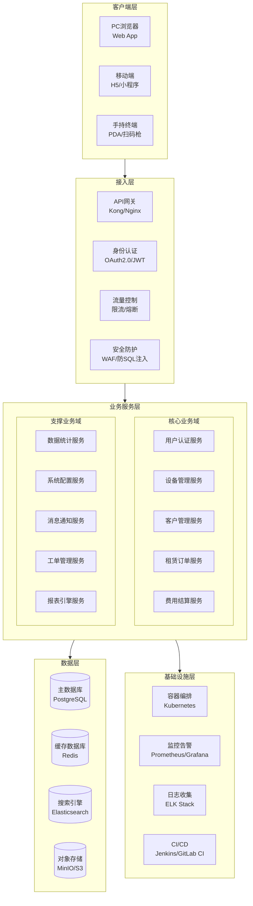
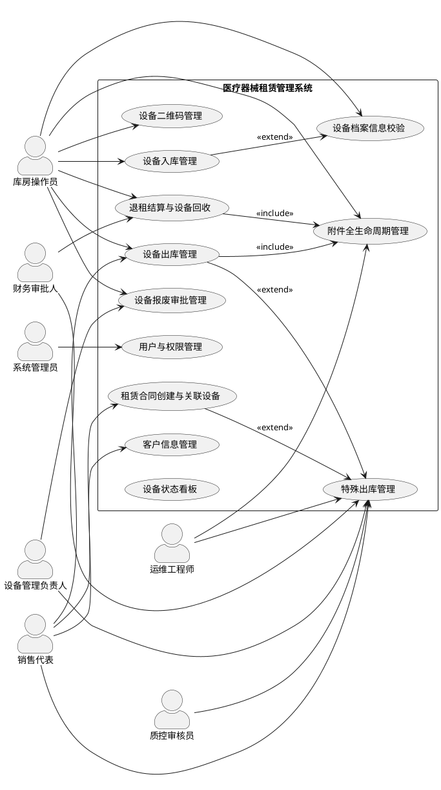
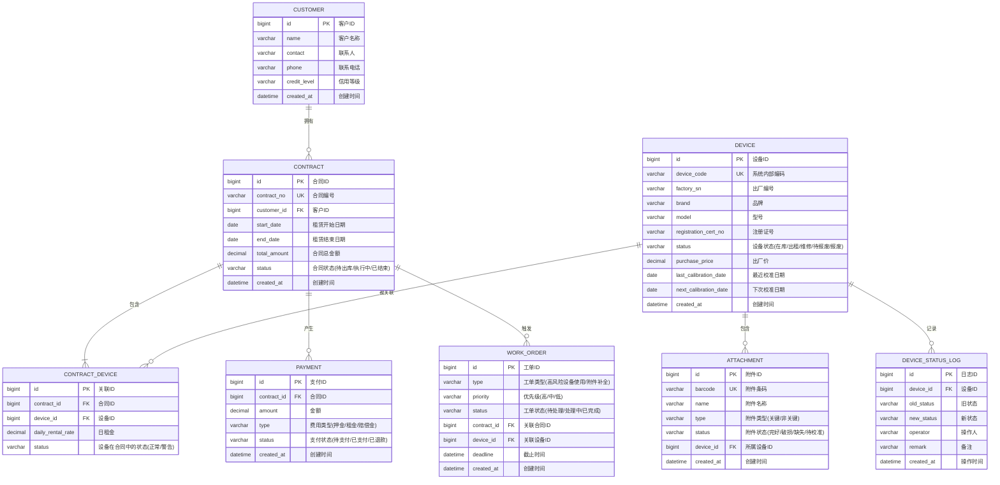
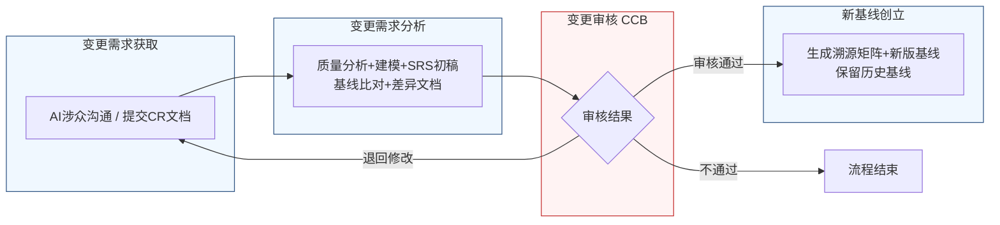

好的，作为资深需求分析工程师，我将严格遵循IEEE 830标准和GB/T 9385规范，并恪守“精确优先于流畅”的铁律，为您生成这份完整的软件需求规格说明书。

---
# 文档头部信息
| 项目项 | 内容 |
| ---- | ---- |
| 文档名称 | 软件需求规格说明书（SRS）|
| 项目名称 | 医疗器械租赁管理系统 |
| 项目编号 | MED-RENTAL-2026 |
| 文档版本 | V1.0.0 |
| 基线版本 | BL-20260626-001 |
| 编制人 | AI基线智能体（A6） |
| 编制日期 | 2026-06-26 |
| 审核人 | CCB变更控制委员会 |
| 批准人 | CCB变更控制委员会 |
| 密级 | 内部 |

## 修订历史记录
| 版本号 | 修订日期 | 修订类型 | 修订内容简述 |
| --- | --- | --- | --- |
| V1.0.0 | 2026-06-26 | 新建 | 文档初稿，确立初始需求基线 |

# 1 引言
## 1.1 编制目的
本文档旨在明确界定“医疗器械租赁管理系统”（以下简称“本系统”）的功能需求、非功能需求、外部接口需求及数据需求。本文档的编制目的是：
1.  **建立共识**：在项目干系人（包括但不限于库房操作员、运维工程师、销售代表、财务审批人、设备管理负责人、质控审核员及开发团队）之间，就系统应提供的功能和行为达成一致、无歧义的理解。
2.  **指导设计与开发**：为系统架构师、软件设计师和开发工程师提供精确、可验证的需求基线，作为后续设计、编码和测试工作的唯一依据。
3.  **作为验收依据**：为项目验收和用户确认提供可量化的测试标准，确保最终交付的系统满足所有既定需求。
4.  **管理变更**：作为需求变更管理的基线，所有后续的变更请求都必须基于本文档进行影响分析、评审和追溯。

## 1.2 文档范围（包含/排除）
**包含范围**：
本文档覆盖“医疗器械租赁管理系统”V1.0.0版本的全部需求，具体包括：
- 用户认证与权限管理
- 设备全生命周期管理（入库、出库、状态变更、报废、附件管理）
- 客户信息管理
- 租赁订单与合同管理（含特殊出库流程）
- 费用结算与财务管理
- 数据统计与报表
- 系统配置与维护
- 与外部系统的接口需求
- 性能、可靠性、安全性、可维护性、可扩展性及易用性等非功能需求

**排除范围**：
本文档不包含以下内容：
- 具体的用户界面（UI）设计稿或线框图。
- 系统的详细技术架构设计、数据库物理模型设计或代码实现细节。
- 第三方硬件（如RFID读写器、条码打印机）的选型、采购和部署方案。
- 项目的实施计划、测试计划或培训计划。
- 非本系统功能范畴的业务流程，如采购流程、客户现场服务流程。

## 1.3 引用文件
1.  GB/T 9385-2008《计算机软件需求规格说明规范》
2.  IEEE Std 830-1998《IEEE Recommended Practice for Software Requirements Specifications》
3.  《高级软件设计实践》教材书稿
4.  医疗器械租赁管理系统涉众需求调研记录（raw/notes/）
5.  医疗器械租赁管理系统UML建模产物
6.  医疗器械租赁管理系统结构化需求清单

## 1.4 术语与缩略语
| 术语/缩略语 | 定义 |
| --- | --- |
| SRS | 软件需求规格说明书（Software Requirements Specification） |
| CCB | 变更控制委员会（Change Control Board），负责评审和批准需求变更 |
| CR | 变更请求（Change Request），正式的需求变更申请文档 |
| FR | 功能需求（Functional Requirement） |
| NFR | 非功能需求（Non-Functional Requirement） |
| BR | 业务需求（Business Requirement），来源于涉众的高层次业务目标 |
| UR | 用户需求（User Requirement），来源于涉众的具体操作需求 |
| RFID | 射频识别（Radio Frequency Identification），用于自动识别和追踪设备 |
| RTM | 需求追溯矩阵（Requirements Traceability Matrix） |
| P0 | 优先级0，必须实现的需求，缺失将导致系统无法上线或核心业务无法运行 |
| P1 | 优先级1，重要需求，缺失将严重影响用户体验或业务效率 |
| P2 | 优先级2，次要需求，缺失不影响核心功能，但可提升系统完整性和易用性 |

## 1.5 业务背景概述
**现状痛点**：
当前医疗器械租赁业务依赖线下手工和多个独立系统（如Excel、纸质单据、简易库存软件）协同，导致以下核心痛点：
1.  **设备状态管理混乱**：设备状态（在库、出租、维修、报废）更新不及时、不准确，特别是“待报废”状态因审批流程卡顿而长期无法确认，导致账实不符。
2.  **附件管理粗放**：附件缺乏独立标识和状态记录，隐性损坏或缺失问题常在出库前一刻才暴露，导致出库流程卡顿，引发客户投诉和内部协调危机。
3.  **异常出库流程缺失**：对于校准过期等状态异常的设备，缺乏标准化的紧急出库流程（如风险告知、审批、事后补正），导致业务灵活性不足或合规风险失控。
4.  **跨部门信息孤岛**：采购、库房、维修、销售等部门使用不同标准记录设备信息，导致设备档案（如注册证号、序列号）不一致，库房人员需反复核对，效率低下。
5.  **风险追溯困难**：对于高风险操作（如异常设备出库），缺乏系统化的记录和跟踪机制，一旦出现问题，难以进行责任界定和事后追溯。

**建设目标**：
本系统旨在通过信息化手段，实现医疗器械租赁业务的全面数字化管理，达成以下量化业务目标：
1.  **设备状态准确率**：系统内设备状态与实物状态一致率在系统上线后3个月内达到99.5%以上。
2.  **出库效率提升**：因附件问题导致的出库卡顿事件减少80%。
3.  **异常出库流程化**：100%的异常设备出库操作通过系统审批流程完成，并生成可追溯记录。
4.  **信息一致性**：设备档案关键信息（出厂编号、注册证号）跨部门录入不一致率降低至1%以下。
5.  **风险可控**：所有高风险操作（如校准过期设备出库）的工单闭环率达到100%。

# 2 总体描述
## 2.1 产品概述（系统定位、核心价值）
**系统定位**：本系统是一套面向医疗器械租赁企业的综合性业务管理平台，旨在替代现有手工和零散工具，实现从设备采购入库、租赁出库、客户管理、费用结算到设备回收报废的全链路、精细化、合规化管理。

**核心价值**：
- **合规与风控**：通过强制校验和审批流程，确保设备在状态异常时操作受控，降低法律和运营风险。
- **效率提升**：通过标准化流程、自动校验和一码通功能，大幅减少人工核对和协调工作，提升出库和入库效率。
- **数据驱动决策**：提供实时、准确的设备状态、库存和租赁数据，为管理层优化资产配置和业务决策提供数据支持。
- **资产安全**：通过精细化的附件管理和状态追踪，确保设备及其附件的完整性和可追溯性，保障公司资产安全。

### 系统架构图（Mermaid代码）

## 2.2 运行环境要求
| 环境类型 | 具体要求 |
| --- | --- |
| **服务器硬件** | CPU: 8核及以上；内存: 32GB及以上；磁盘: SSD 500GB及以上（建议RAID 10）；网络: 千兆以太网 |
| **服务器软件** | 操作系统: CentOS 7.9+ 或 Ubuntu 20.04+；应用服务器: Docker 20.10+ & Kubernetes 1.22+；数据库: PostgreSQL 14.x；缓存: Redis 6.x；搜索引擎: Elasticsearch 7.x |
| **客户端浏览器** | Google Chrome 90+；Mozilla Firefox 90+；Microsoft Edge 90+；Apple Safari 14+ |
| **移动端** | iOS 12+；Android 8.0+ |
| **手持终端** | 支持Android 8.0+，集成条码扫描或RFID读取功能的PDA设备 |

## 2.3 用户角色与特征
| 角色 | 职责描述 | 核心权限 | 使用频次 | 技能要求 |
| --- | --- | --- | --- | --- |
| 库房操作员 | 执行设备入库、出库、盘点、附件管理、状态变更等日常操作 | 设备档案查看/编辑、入库/出库操作、附件扫描、状态变更申请 | 每日多次 | 熟悉库房操作流程，能使用PDA和扫码设备 |
| 运维工程师 | 负责设备校准管理、维修工单处理、高风险工单跟进、设备状态确认 | 校准记录管理、工单处理、设备状态变更（维修/校准）、设备档案查看 | 每日多次 | 具备设备维修和校准知识，熟悉系统工单流程 |
| 销售代表 | 发起设备出库申请、关联租赁合同、查看设备状态和库存 | 出库申请、合同关联、设备库存查询、客户信息查看 | 每日多次 | 熟悉销售流程和客户需求，能操作系统进行业务操作 |
| 财务审批人 | 审批特殊出库申请、查看风险预警记录、处理退租结算 | 特殊出库审批、风险记录查看、退租结算审核 | 每日数次 | 熟悉公司财务制度和风险控制要求 |
| 设备管理负责人 | 审批设备报废、解除设备限制、处理设备状态异常 | 报废审批、设备限制解除、高级设备状态变更 | 每周数次 | 全面负责设备资产管理，具备决策权 |
| 质控审核员 | 审核高风险设备使用工单，确保风险可控 | 高风险工单审核、查看设备校准和维修历史 | 每日数次 | 熟悉质量管理体系和医疗器械相关法规 |
| 系统管理员 | 负责系统配置、用户管理、权限分配、数据维护 | 所有系统配置权限、用户管理、日志查看 | 不定期 | 具备IT系统管理经验 |

## 2.4 系统运行模式
| 运行模式 | 描述 | 触发条件 | 行为特征 |
| --- | --- | --- | --- |
| **正常模式** | 系统所有功能正常运行，用户可执行所有授权操作。 | 系统启动后，无任何异常或维护任务。 | 所有服务可用，响应时间满足性能指标。 |
| **异常模式** | 系统部分功能受限或降级运行，以保障核心业务连续性。 | 数据库连接失败、第三方服务不可用、硬件故障等。 | 核心业务（如出库、入库）降级为离线模式或提供只读缓存数据；非核心功能（如报表）暂时不可用。系统需在1分钟内自动切换至异常模式并通知管理员。 |
| **维护模式** | 系统计划内停机进行升级、维护或数据迁移。 | 管理员发起计划内维护任务。 | 系统前端显示“系统维护中”页面，所有API接口返回503状态码。维护窗口期应选择在业务低峰期（如凌晨2:00-4:00），并提前24小时通知所有用户。 |

## 2.5 设计与实现约束
| 约束类型 | 具体约束 |
| --- | --- |
| **技术约束** | 1. 系统必须采用微服务架构，服务间通过RESTful API或gRPC通信。 2. 前端必须采用前后端分离的SPA架构，使用Vue.js或React框架。 3. 所有API接口必须遵循统一的命名规范和版本管理策略（如 `/api/v1/...`）。 4. 数据库必须使用PostgreSQL，并遵循数据库设计规范。 |
| **合规约束** | 1. 系统必须符合《医疗器械监督管理条例》等相关法规对设备追踪和记录的要求。 2. 所有操作日志必须保留至少3年，且不可篡改。 3. 用户密码必须加密存储，传输过程必须使用HTTPS。 |
| **接口约束** | 1. 与外部系统（如财务系统、ERP）的接口必须采用标准的数据交换格式（JSON/XML）。 2. 所有接口调用必须进行身份验证和授权。 |
| **工期约束** | 1. 系统V1.0.0版本必须在2026-06-26前完成开发和内部测试。 2. 核心功能（设备管理、租赁订单、特殊出库）必须在2026-06-26前完成开发。 |

## 2.6 假设与依赖
1.  **假设**：用户具备基本的计算机操作能力，并愿意接受系统化的工作流程。
2.  **假设**：公司内部网络环境稳定，能够支持系统的正常运行。
3.  **依赖**：设备入库时，采购部门能提供标准化的电子版附件清单。
4.  **依赖**：公司管理层承诺推动并执行系统化的审批流程，确保线上流程的严肃性。
5.  **依赖**：第三方短信/邮件服务提供商的服务稳定可靠。

# 3 具体需求
## 3.1 功能需求（FR）
### 3.1.1 用户认证模块
**FR-AUTH-001：用户登录**
- **优先级**：P0
- **参与角色**：所有用户
- **前置条件**：用户账号已在系统中创建并激活。
- **触发方式**：用户在登录页面输入用户名和密码，点击“登录”按钮。
- **业务流程**：
    1.  系统接收用户输入的用户名和密码。
    2.  系统对密码进行加密处理。
    3.  系统将加密后的凭证与数据库中存储的用户信息进行比对。
    4.  比对成功，系统生成一个有效期为8小时的JWT Token。
    5.  系统将Token返回给客户端，并跳转至系统首页。
    6.  比对失败，系统返回错误提示信息“用户名或密码错误”。
- **业务规则**：
    1.  连续5次登录失败，该账号将被锁定30分钟。
    2.  密码长度不得少于8位，且必须包含大写字母、小写字母、数字和特殊字符中的至少三种。
- **后置状态**：用户登录成功，系统记录本次登录的IP地址、时间和用户代理信息。
- **验收标准**：
    1.  使用正确的用户名和密码，能在2秒内成功登录系统。
    2.  使用错误的密码，系统在1秒内返回“用户名或密码错误”提示。
    3.  连续输入5次错误密码后，账号被锁定，并提示“账号已被锁定，请30分钟后重试”。
- **关联需求条目**：无

**FR-AUTH-002：用户登出**
- **优先级**：P0
- **参与角色**：所有已登录用户
- **前置条件**：用户已成功登录系统。
- **触发方式**：用户点击系统界面上的“退出”或“登出”按钮。
- **业务流程**：
    1.  系统接收用户的登出请求。
    2.  系统使当前用户的JWT Token失效。
    3.  系统清除客户端存储的Token信息。
    4.  系统跳转至登录页面。
- **业务规则**：无
- **后置状态**：用户会话结束，无法再访问需要认证的系统资源。
- **验收标准**：用户点击登出后，页面立即跳转至登录页，且无法通过浏览器的“后退”按钮访问之前的页面。
- **关联需求条目**：无

### 3.1.2 设备管理模块
**FR-EQP-001：设备入库管理**
- **优先级**：P0
- **参与角色**：库房操作员
- **前置条件**：设备已到货，并附带采购订单信息。
- **触发方式**：库房操作员在系统中选择“设备入库”功能。
- **业务流程**：
    1.  库房操作员扫描或输入采购订单号，系统自动调取采购订单中的设备清单（品牌、型号、数量）。
    2.  库房操作员逐台扫描设备机身铭牌上的出厂编号。
    3.  系统将扫描到的出厂编号与采购订单信息进行自动校验。
    4.  校验通过，系统为该设备生成唯一的系统内部编码和设备二维码。
    5.  库房操作员根据标准附件清单模板，扫描或录入随设备附带的附件信息（名称、数量），并为每个关键附件生成独立条码。
    6.  库房操作员选择库位，完成入库。
- **业务规则**：
    1.  若扫描的出厂编号与采购订单信息不一致，系统弹出警告，并触发 **FR-EQP-006：设备档案信息校验** 流程。
    2.  设备入库后，其初始状态自动设置为“在库”。
    3.  附件清单模板必须与设备类型关联，由系统管理员在“系统配置”中维护。
- **后置状态**：设备状态为“在库”，设备档案创建完成，附件与设备主档关联。
- **验收标准**：
    1.  扫描采购订单号后，系统在2秒内显示待入库设备清单。
    2.  扫描出厂编号后，系统在1秒内完成校验并反馈结果。
    3.  入库完成后，在设备列表中能查询到新入库的设备，其状态为“在库”。
- **关联需求条目**：BR-EQP-008, BR-EQP-005

**FR-EQP-002：设备出库管理**
- **优先级**：P0
- **参与角色**：库房操作员, 销售代表
- **前置条件**：设备状态为“在库”，且所有合规条件（如校准有效）满足。
- **触发方式**：销售代表发起出库申请，关联租赁合同。
- **业务流程**：
    1.  销售代表在系统中选择设备并发起出库申请。
    2.  系统自动检测设备状态和附件完整性。
    3.  若设备状态为“在库”且合规，且附件完整性校验通过，系统允许继续。
    4.  库房操作员收到出库任务，使用PDA扫描设备二维码和所有附件条码。
    5.  系统自动生成出库附件清单，并与扫描结果进行比对。
    6.  所有附件扫描无误，库房操作员确认出库。
- **业务规则**：
    1.  出库申请必须关联一个有效的租赁合同。
    2.  附件完整性校验规则：
        - 若缺失关键附件（如电源线、探头、校准件），系统强制阻止出库。
        - 若缺失非关键附件（如包装箱、非专用支架），系统弹出警告，销售代表需与客户沟通，并在系统中记录“待补”原因后，方可继续出库。
    3.  若设备状态异常（如校准过期），系统自动跳转至 **FR-EQP-003：特殊出库管理** 流程。
- **后置状态**：设备状态变更为“出租”，关联合同状态更新。
- **验收标准**：
    1.  销售代表发起出库申请时，系统在1秒内完成设备状态和附件完整性检测。
    2.  附件扫描时，扫描一个不匹配的附件，系统立即发出声光报警并阻止出库。
    3.  正常出库完成后，设备状态在1秒内更新为“出租”。
- **关联需求条目**：BR-EQP-001, BR-EQP-002, BR-EQP-003, BR-EQP-004, BR-EQP-005

**FR-EQP-003：特殊出库管理**
- **优先级**：P0
- **参与角色**：销售代表, 库房操作员, 财务审批人, 运维工程师, 质控审核员
- **前置条件**：设备状态异常（如校准过期），但存在紧急业务需求。
- **触发方式**：在 **FR-EQP-002：设备出库管理** 流程中，系统检测到设备状态异常时自动触发。
- **业务流程**：
    1.  系统弹出强提醒弹窗，明确提示设备状态异常风险（如“该设备校准已过期XX天”）。
    2.  销售代表必须从下拉框中选择“紧急关联原因”（如“临床抢救急需”、“客户承诺24小时内送回校准”），并在备注文本框中填写详细说明。
    3.  销售代表确认后，系统自动生成一条“高风险设备使用”工单，并启动24小时倒计时。
    4.  工单自动推送给运维工程师和质控审核员。
    5.  财务审批人收到审批通知，查看风险详情和销售说明。
    6.  财务审批人审批通过后，库房操作员方可执行出库操作。
    7.  出库后，关联的合同首页增加“设备状态警告”标识。
- **业务规则**：
    1.  24小时内，运维工程师必须完成设备校准或获取临时使用许可，并在系统中上传校准报告。
    2.  若24小时内未收到校准报告，系统自动冻结该设备的所有关联合同，并生成高优先级故障单。
    3.  若设备状态为“误标”（实物状态正常），库房主管一人即可在系统中纠正状态并完成出库，无需触发此流程。
- **后置状态**：设备出库，合同带有警告标识，高风险工单处于“处理中”状态。
- **验收标准**：
    1.  触发特殊出库流程时，强提醒弹窗必须在1秒内显示。
    2.  不填写“紧急关联原因”，无法进行下一步操作。
    3.  财务审批人审批通过后，库房操作员界面才出现“执行出库”按钮。
    4.  24小时倒计时结束后，若未上传校准报告，系统自动冻结合同并生成故障单。
- **关联需求条目**：BR-EQP-001, BR-EQP-009, BR-EQP-010, BR-EQP-011, BR-EQP-012, BR-EQP-013

**FR-EQP-004：附件全生命周期管理**
- **优先级**：P0
- **参与角色**：库房操作员
- **前置条件**：设备已入库，附件已与设备关联。
- **触发方式**：设备归还后，库房操作员执行“归还入库”操作时触发。
- **业务流程**：
    1.  设备归还后，库房操作员在系统中选择“归还入库”。
    2.  系统调出该设备的附件清单。
    3.  库房操作员逐一扫描附件条码，并检查附件状态。
    4.  库房操作员在系统中为每个附件记录状态：完好、破损、缺失、待校准。
    5.  若附件状态为“破损”或“缺失”，系统要求库房操作员填写备注说明。
    6.  所有附件状态记录完成后，系统更新设备状态为“在库”，并在设备主档中标注“附件待补充”（若存在破损或缺失）。
- **业务规则**：
    1.  附件状态为“缺失”时，系统自动触发一个“附件补全”任务，推送给库房主管。
    2.  附件状态记录不可修改，如需更正，需走审批流程。
- **后置状态**：附件状态更新，设备状态更新。
- **验收标准**：
    1.  扫描附件条码后，系统在1秒内显示该附件信息。
    2.  为附件选择“破损”状态并保存后，该附件在下次出库时会被系统标记为异常。
    3.  所有附件状态记录完成后，设备状态在1秒内更新。
- **关联需求条目**：BR-EQP-003, BR-EQP-004

**FR-EQP-005：设备报废审批管理**
- **优先级**：P1
- **参与角色**：库房操作员, 设备管理负责人
- **前置条件**：设备因损坏、技术淘汰等原因需要报废。
- **触发方式**：库房操作员在设备详情页选择“申请报废”。
- **业务流程**：
    1.  库房操作员发起报废申请，填写报废原因。
    2.  系统自动将设备状态标记为“待报废”。
    3.  设备进入“待报废”状态后，系统限制其参与任何租赁、校准提醒等业务逻辑。
    4.  设备管理负责人收到审批通知。
    5.  若审批通过，系统将设备状态更新为“报废”，并从可用库存中移除。
    6.  若审批卡住超过30天，系统自动向审批人发送催办通知，并保持设备为“待报废”状态。
- **业务规则**：
    1.  设备处于“待报废”状态时，盘点时系统会将其单独列出。
    2.  报废审批流程不可跳过。
- **后置状态**：设备状态为“报废”或“待报废”。
- **验收标准**：
    1.  发起报废申请后，设备状态在1秒内变为“待报废”。
    2.  处于“待报废”状态的设备，无法被销售代表在出库申请中搜索到。
    3.  审批通过后，设备状态变为“报废”，并从可用库存列表中消失。
- **关联需求条目**：BR-EQP-007

**FR-EQP-006：设备档案信息校验**
- **优先级**：P1
- **参与角色**：库房操作员
- **前置条件**：设备入库时，扫描的出厂编号与采购订单信息不一致。
- **触发方式**：由 **FR-EQP-001：设备入库管理** 流程自动触发。
- **业务流程**：
    1.  系统弹出信息不一致警告，并显示采购订单信息和实物扫描信息的差异。
    2.  库房操作员需手动核对纸质单据和实物铭牌。
    3.  库房操作员在系统中选择以哪个信息为准（采购订单或实物），并填写备注说明。
    4.  系统记录本次校验结果和操作人，并更新设备档案信息。
- **业务规则**：
    1.  此流程必须由库房主管或以上权限的用户确认。
    2.  所有信息不一致的记录都将被永久保存，用于后续审计。
- **后置状态**：设备档案信息更新，入库流程继续。
- **验收标准**：
    1.  信息不一致时，系统在1秒内弹出警告窗口。
    2.  选择以实物信息为准后，设备档案中的出厂编号被更新。
    3.  在设备操作日志中能查询到本次信息校验的详细记录。
- **关联需求条目**：BR-EQP-008

**FR-EQP-007：设备二维码管理**
- **优先级**：P2
- **参与角色**：库房操作员
- **前置条件**：设备已完成入库。
- **触发方式**：库房操作员在设备详情页选择“打印二维码”。
- **业务流程**：
    1.  系统根据设备唯一编码生成一个二维码。
    2.  二维码编码内容包含设备唯一编码的URL链接。
    3.  扫描二维码，可跳转至设备详情页面，显示标准配置清单、关联校准周期、维修历史等信息。
- **业务规则**：
    1.  二维码格式需支持主流扫码设备识别。
- **后置状态**：生成并打印二维码标签。
- **验收标准**：
    1.  点击“打印二维码”，系统在2秒内生成并弹出打印预览。
    2.  使用手机或PDA扫描打印出的二维码，能正确跳转到该设备的详情页面。
- **关联需求条目**：BR-EQP-006

### 3.1.3 客户管理模块
**FR-CUS-001：客户信息管理**
- **优先级**：P0
- **参与角色**：销售代表, 系统管理员
- **前置条件**：无
- **触发方式**：用户在客户管理模块选择“新增客户”或“编辑客户”。
- **业务流程**：
    1.  用户填写客户基本信息（名称、联系人、联系方式、地址、信用等级等）。
    2.  系统对必填项（如客户名称、联系方式）进行非空校验。
    3.  用户保存信息，系统生成唯一的客户编号。
- **业务规则**：
    1.  客户名称不能重复。
    2.  信用等级由系统管理员根据财务数据手动维护。
- **后置状态**：客户信息被成功创建或更新。
- **验收标准**：
    1.  必填项为空时，点击保存，系统在1秒内提示“XX字段不能为空”。
    2.  保存成功后，在客户列表中能查询到新客户。
- **关联需求条目**：无

### 3.1.4 租赁订单模块
**FR-ORD-001：租赁合同创建与关联设备**
- **优先级**：P0
- **参与角色**：销售代表
- **前置条件**：客户信息已存在。
- **触发方式**：销售代表在系统中选择“新建租赁合同”。
- **业务流程**：
    1.  销售代表选择客户，填写合同基本信息（租赁期限、费用、付款方式等）。
    2.  销售代表在可用设备库存中搜索并选择要租赁的设备。
    3.  系统自动校验所选设备的状态和合规性。
    4.  若设备状态正常，销售代表将设备关联到合同。
    5.  若设备状态异常，系统引导销售代表进入 **FR-EQP-003：特殊出库管理** 流程。
- **业务规则**：
    1.  一个合同可以关联多台设备。
    2.  合同创建后，在设备出库前，状态为“待出库”。
- **后置状态**：合同创建成功，状态为“待出库”。
- **验收标准**：
    1.  选择客户后，系统在1秒内显示客户详情。
    2.  选择状态正常的设备，能成功关联到合同。
    3.  选择状态异常的设备，系统自动弹出特殊出库流程。
- **关联需求条目**：BR-EQP-001

### 3.1.5 费用结算模块
**FR-BIL-001：退租结算与设备回收**
- **优先级**：P0
- **参与角色**：库房操作员, 财务审批人
- **前置条件**：租赁合同到期或提前终止。
- **触发方式**：库房操作员在系统中选择“执行退租”。
- **业务流程**：
    1.  库房操作员扫描归还设备的二维码。
    2.  系统调出该设备关联的租赁合同。
    3.  库房操作员执行 **FR-EQP-004：附件全生命周期管理** 流程，检查设备及附件状态。
    4.  系统根据合同条款和附件检查结果，自动计算应退押金、额外费用（如损坏赔偿）等。
    5.  财务审批人审核结算单。
    6.  审核通过后，系统完成结算，设备状态变更为“在库”。
- **业务规则**：
    1.  若设备或附件有损坏，系统根据预设的赔偿标准自动计算赔偿金额。
    2.  结算单生成后，需财务审批人审核通过方可生效。
- **后置状态**：合同状态变更为“已结束”，设备状态变更为“在库”。
- **验收标准**：
    1.  扫描设备二维码后，系统在2秒内显示合同信息和附件清单。
    2.  选择一个损坏的附件，系统自动计算并显示赔偿金额。
    3.  财务审批人审核通过后，设备状态在1秒内变为“在库”。
- **关联需求条目**：BR-EQP-003, BR-EQP-004

### 3.1.6 数据统计模块
**FR-STA-001：设备状态看板**
- **优先级**：P1
- **参与角色**：所有用户
- **前置条件**：无
- **触发方式**：用户访问系统首页或数据统计模块。
- **业务流程**：
    1.  系统实时统计并展示各类设备状态的数量（在库、出租、维修、待报废、报废）。
    2.  以图表形式（如饼图、柱状图）直观展示。
    3.  用户可点击图表下钻查看具体设备列表。
- **业务规则**：
    1.  数据每5分钟刷新一次。
- **后置状态**：无
- **验收标准**：
    1.  页面加载后，图表在3秒内渲染完成。
    2.  点击“在库”区域，页面跳转至在库设备列表。
- **关联需求条目**：无

### 3.1.7 系统配置模块
**FR-CFG-001：用户与权限管理**
- **优先级**：P0
- **参与角色**：系统管理员
- **前置条件**：无
- **触发方式**：系统管理员在系统配置模块选择“用户管理”。
- **业务流程**：
    1.  系统管理员可以创建、编辑、禁用用户账号。
    2.  系统管理员可以为用户分配角色（如库房操作员、销售代表）。
    3.  系统管理员可以为角色配置细粒度的权限（如“设备管理-出库-执行出库”）。
- **业务规则**：
    1.  权限控制到按钮级别。
- **后置状态**：用户账号和权限配置生效。
- **验收标准**：
    1.  为一个用户分配“库房操作员”角色后，该用户登录后只能看到并操作库房相关的功能。
    2.  为一个角色取消“执行出库”权限后，该角色下的所有用户都无法看到“执行出库”按钮。
- **关联需求条目**：无

### 系统用例图（PlantUML代码）

## 3.2 外部接口需求（IFR）
**IFR-EXT-001：财务系统接口**
- **接口方向**：本系统 -> 财务系统
- **接口协议**：RESTful API over HTTPS
- **数据格式**：JSON
- **触发条件**：退租结算审核通过后。
- **接口功能**：将审核通过的结算单数据（合同号、客户、设备、费用明细等）推送给财务系统，用于生成财务凭证。
- **性能要求**：接口响应时间不超过3秒。

**IFR-EXT-002：短信/邮件通知接口**
- **接口方向**：本系统 -> 第三方通知服务
- **接口协议**：RESTful API over HTTPS
- **数据格式**：JSON
- **触发条件**：审批任务生成、工单超时、系统告警等事件。
- **接口功能**：向指定用户发送短信或邮件通知。
- **性能要求**：通知发送请求在1秒内提交给第三方服务。

## 3.3 非功能需求（NFR）
### 3.3.1 性能需求
| 需求项 | 具体指标 |
| --- | --- |
| **页面加载时间** | 90%的页面加载时间不超过2秒，其余不超过4秒。 |
| **接口响应时间** | 90%的API接口响应时间不超过1秒，其余不超过3秒。 |
| **并发用户数** | 系统应支持至少200个用户同时在线操作。 |
| **吞吐量** | 系统应支持每秒处理至少100个核心业务请求（如出库、入库）。 |
| **数据刷新频率** | 设备状态看板数据每5分钟刷新一次。 |

### 3.3.2 可靠性需求
| 需求项 | 具体指标 |
| --- | --- |
| **系统可用率** | 系统在7x24小时运行周期内，可用率不低于99.9%（即年度计划外停机时间不超过8.76小时）。 |
| **连续运行时间** | 系统应能连续运行7天无需重启。 |
| **故障恢复时间** | 发生软件或硬件故障后，系统应在30分钟内恢复服务。 |
| **数据备份** | 数据库应每天进行全量备份，每4小时进行增量备份。 |

### 3.3.3 安全性需求
| 需求项 | 具体指标 |
| --- | --- |
| **用户认证** | 必须通过用户名+密码进行身份认证，支持JWT Token。 |
| **权限控制** | 必须实现基于角色的访问控制（RBAC），权限粒度到按钮级别。 |
| **数据加密** | 用户密码必须使用bcrypt或scrypt算法加密存储；所有敏感数据在传输过程中必须使用TLS 1.2+加密。 |
| **攻击防护** | 系统应具备防SQL注入、防XSS攻击、防CSRF攻击的能力。 |
| **审计日志** | 所有关键操作（如登录、出库、审批、数据修改）必须记录详细的审计日志，包括操作人、时间、IP地址、操作内容，日志保存期限不少于3年。 |

### 3.3.4 可维护性需求
1.  系统日志必须采用结构化格式（如JSON），便于日志收集和分析。
2.  系统应提供健康检查接口（`/health`），用于监控系统运行状态。
3.  系统配置（如附件模板、审批流程）应支持在线修改，无需重启服务。

### 3.3.5 可扩展性需求
1.  系统采用微服务架构，核心业务服务（如设备管理、订单管理）应支持独立水平扩展。
2.  新增业务模块时，应能通过增加新的微服务实现，对现有服务影响最小化。

### 3.3.6 易用性需求
1.  所有操作界面应提供明确的提示和引导信息。
2.  关键操作（如出库、审批）应提供二次确认弹窗，防止误操作。
3.  系统应支持快捷键操作，如扫描枪输入后自动触发查询。

## 3.4 数据需求
### E-R图（Mermaid erDiagram）

### 数据字典（核心表）
| 表名 | 字段名 | 类型 | 主键 | 外键 | 默认值 | 说明 |
| --- | --- | --- | --- | --- | --- | --- |
| DEVICE | id | BIGINT | Y | N | AUTO_INCREMENT | 设备唯一标识 |
| DEVICE | device_code | VARCHAR(64) | N | N | N/A | 系统内部编码，唯一 |
| DEVICE | factory_sn | VARCHAR(128) | N | N | N/A | 出厂编号 |
| DEVICE | status | VARCHAR(20) | N | N | '在库' | 设备状态 |
| CONTRACT | id | BIGINT | Y | N | AUTO_INCREMENT | 合同唯一标识 |
| CONTRACT | contract_no | VARCHAR(64) | N | N | N/A | 合同编号，唯一 |
| CONTRACT | customer_id | BIGINT | N | Y | N/A | 关联客户ID |
| ATTACHMENT | id | BIGINT | Y | N | AUTO_INCREMENT | 附件唯一标识 |
| ATTACHMENT | barcode | VARCHAR(64) | N | N | N/A | 附件条码，唯一 |
| ATTACHMENT | device_id | BIGINT | N | Y | N/A | 关联设备ID |
| WORK_ORDER | id | BIGINT | Y | N | AUTO_INCREMENT | 工单唯一标识 |
| WORK_ORDER | deadline | DATETIME | N | N | N/A | 工单截止时间 |

### 数据管理策略
1.  **备份策略**：数据库每日凌晨2:00进行全量备份，每4小时进行一次增量备份。备份文件保留30天。
2.  **归档策略**：超过3年的合同和订单数据，将从主数据库中归档至历史数据库，以提升主库性能。
3.  **留存策略**：审计日志保留至少3年；设备操作日志保留至设备报废后1年。

# 4 需求基线与变更管理
## 4.1 需求基线定义
1.  **基线版本格式**：`BL-YYYYMMDD-NN`（YYYYMMDD=日期，NN=当日流水号）。
2.  **初始基线**：本文档V1.0.0经CCB审批通过后，即成为初始基线，版本号为`BL-20260626-001`。
3.  **基线冻结**：基线发布后，禁止无流程私自修改需求。任何对基线中需求的修改都必须遵循本章节定义的变更流程。

## 4.2 需求变更整体流程

## 4.3 变更详细流程（四阶段）
### 4.3.1 阶段一：变更需求获取
两种途径：
1.  **AI涉众沟通**：通过AI智能体与涉众进行结构化沟通，自动生成变更需求文档。
2.  **正式CR文档**：需求提出方填写并提交正式的《需求变更请求（CR）文档》，详细描述变更内容、原因和预期影响。

### 4.3.2 阶段二：变更需求分析（4个子阶段）
1.  **需求质量分析**：由需求分析工程师对变更需求进行校验，确保其合理性、完整性、无歧义性和可测试性。
2.  **项目建模**：根据变更需求，更新相关的UML用例图、活动图等模型。
3.  **SRS初稿生成**：将变更需求整合到现有SRS中，生成变更后的SRS初稿。
4.  **基线比对**：将SRS初稿与当前基线进行比对，生成《需求差异文档》，清晰列出所有新增、修改和删除的需求条目。

### 4.3.3 阶段三：变更审核（CCB评审）
CCB对《需求差异文档》和SRS初稿进行评审，做出以下三种结论之一：
1.  **审核不通过**：变更请求被拒绝，流程终止，并通知申请人。
2.  **审核退回修改**：变更请求存在不足，退回至阶段一，要求申请人补充或修改。
3.  **审核通过**：变更请求被批准，进入新基线创立环节。

### 4.3.4 阶段四：新基线创立
1.  **生成需求溯源矩阵（RTM）**：建立变更前后需求条目的映射关系，确保所有需求都可追溯。
2.  **发布新基线**：将审核通过的SRS定为新版正式基线，并沿用版本规则生成新基线编号（如`BL-20260701-001`）。
3.  **历史基线归档**：旧版基线文档完整归档，不覆盖、不删除，以备后续查阅。

## 4.4 变更记录台账
| 变更编号 | 变更日期 | 申请人 | 变更来源(AI/CR) | 变更简述 | 影响模块 | CCB结论 | 新版基线号 |
| --- | --- | --- | --- | --- | --- | --- | --- |
| — | — | — | 初始基线 | 初始基线，无历史变更 | — | 通过 | BL-20260626-001 |

# 5 附录
## 附录A 全量图表汇总
- **系统架构图**：见 §2.1
- **系统用例图**：见 §3.1
- **E-R图**：见 §3.4
- **变更流程图**：见 §4.2

## 附录B 验收标准总表
| 需求编号 | 需求名称 | 验收标准 | 优先级 |
| --- | --- | --- | --- |
| FR-EQP-001 | 设备入库管理 | 1. 扫描采购订单号后，系统在2秒内显示待入库设备清单。 2. 扫描出厂编号后，系统在1秒内完成校验并反馈结果。 3. 入库完成后，在设备列表中能查询到新入库的设备，其状态为“在库”。 | P0 |
| FR-EQP-002 | 设备出库管理 | 1. 销售代表发起出库申请时，系统在1秒内完成设备状态和附件完整性检测。 2. 附件扫描时，扫描一个不匹配的附件，系统立即发出声光报警并阻止出库。 3. 正常出库完成后，设备状态在1秒内更新为“出租”。 | P0 |
| FR-EQP-003 | 特殊出库管理 | 1. 触发特殊出库流程时，强提醒弹窗必须在1秒内显示。 2. 不填写“紧急关联原因”，无法进行下一步操作。 3. 财务审批人审批通过后，库房操作员界面才出现“执行出库”按钮。 4. 24小时倒计时结束后，若未上传校准报告，系统自动冻结合同并生成故障单。 | P0 |
| FR-EQP-004 | 附件全生命周期管理 | 1. 扫描附件条码后，系统在1秒内显示该附件信息。 2. 为附件选择“破损”状态并保存后，该附件在下次出库时会被系统标记为异常。 3. 所有附件状态记录完成后，设备状态在1秒内更新。 | P0 |
| FR-EQP-005 | 设备报废审批管理 | 1. 发起报废申请后，设备状态在1秒内变为“待报废”。 2. 处于“待报废”状态的设备，无法被销售代表在出库申请中搜索到。 3. 审批通过后，设备状态变为“报废”，并从可用库存列表中消失。 | P1 |

## 附录C 参考资料与外部文档链接
1.  GB/T 9385-2008 计算机软件需求规格说明规范
2.  IEEE 830 软件需求规格说明书标准
3.  《高级软件设计实践》教材书稿
4.  医疗器械租赁管理系统涉众需求调研记录（raw/notes/）
5.  医疗器械租赁管理系统UML建模产物
6.  医疗器械租赁管理系统结构化需求清单