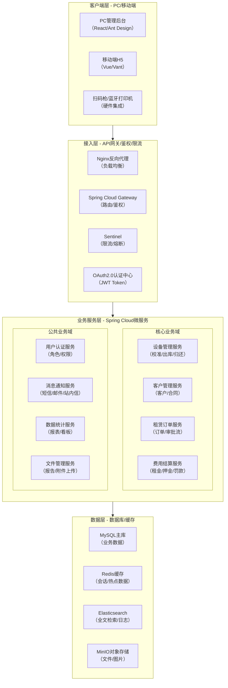
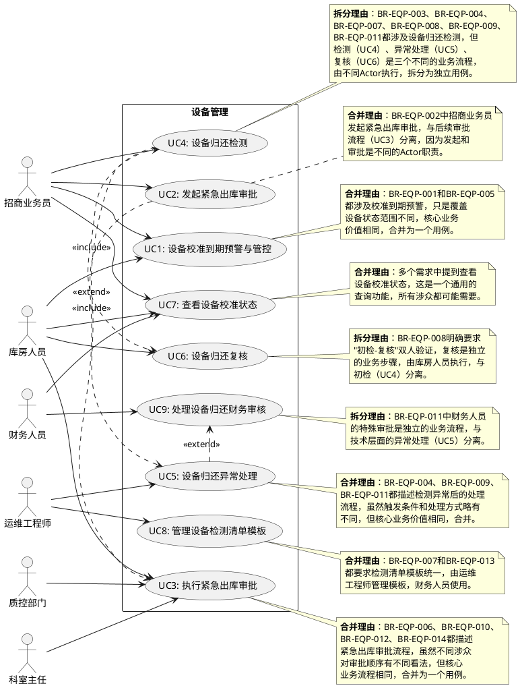
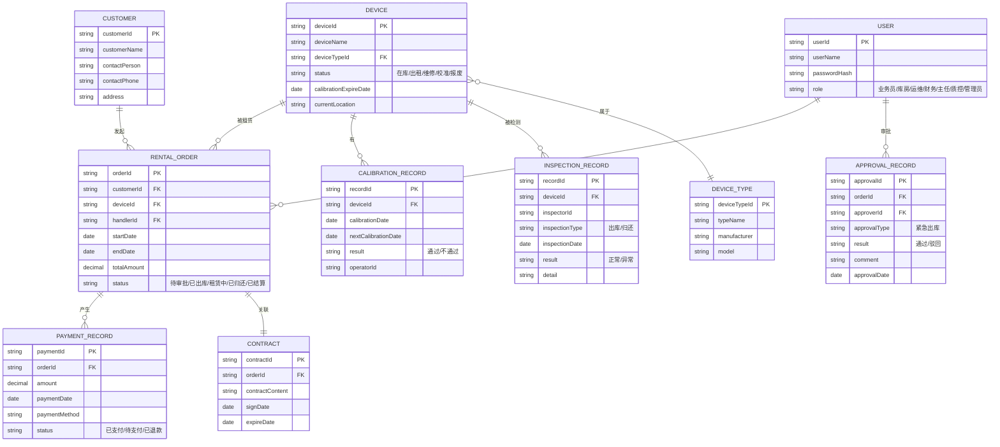
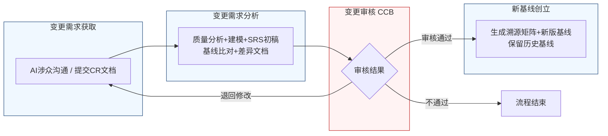

好的，作为一名资深需求分析工程师，我将严格遵循IEEE 830标准和GB/T 9385规范，采用“两阶段法”为您生成这份完整的软件需求规格说明书（SRS）。我将恪守“精确优先于流畅”的铁律，保留需求清单中的每一个数字、边界条件和约束参数。

---
# 文档头部信息
| 项目项 | 内容 |
| ---- | ---- |
| 文档名称 | 软件需求规格说明书（SRS）|
| 项目名称 | 医疗器械租赁管理系统 |
| 项目编号 | MED-RENTAL-2026 |
| 文档版本 | V1.0.0 |
| 基线版本 | 【占位，由A6分配】|
| 编制人 | AI基线智能体（A6） |
| 编制日期 | 【当前日期】|
| 审核人 | CCB变更控制委员会 |
| 批准人 | CCB变更控制委员会 |
| 密级 | 内部 |

## 修订历史记录
| 版本号 | 修订日期 | 修订类型 | 修订内容简述 |
| V1.0.0 | 【当前日期】 | 新建 | 文档初稿，确立初始需求基线 |

# 1 引言
## 1.1 编制目的
本软件需求规格说明书（SRS）旨在为“医疗器械租赁管理系统”项目提供一份完整、精确、无歧义的需求定义。本文档的主要目的包括：
1.  **建立共识**：在项目涉众（包括但不限于招商业务员、库房人员、运维工程师、财务人员、科室主任、质控部门及开发团队）之间，就系统的功能、性能、外部接口和行为约束达成一致的理解。
2.  **指导设计与开发**：为后续的系统设计、编码实现和测试活动提供精确的、可验证的基准。
3.  **需求基线管理**：作为项目需求基线，为后续的需求变更控制提供依据，确保项目范围的可追溯性和可控性。
4.  **验收依据**：作为系统最终验收测试的主要依据，确保交付的系统满足所有已定义的需求。

## 1.2 文档范围（包含/排除）
**包含范围**：
本文档覆盖“医疗器械租赁管理系统”第一版（V1.0.0）的全部需求，具体包括：
- **功能需求**：设备管理（含校准预警、紧急出库、归还检测）、客户管理、租赁订单、费用结算、数据统计、系统配置及用户认证等核心业务模块。
- **外部接口需求**：系统与外部系统（如财务系统、短信/邮件通知服务）的接口定义。
- **非功能需求**：系统的性能、可靠性、安全性、可维护性、可扩展性和易用性要求。
- **数据需求**：核心数据实体的定义、数据字典及数据管理策略。

**排除范围**：
本文档不包含以下内容：
- **项目计划**：如详细的开发时间表、资源分配和风险管理计划。
- **系统设计**：如具体的软件架构、数据库表结构设计、UI界面原型、算法实现细节。
- **测试用例**：具体的测试步骤和测试数据。
- **用户手册**：最终用户的操作指南。
- **硬件采购清单**：具体的服务器、网络设备型号和数量。

## 1.3 引用文件
1.  GB/T 9385-2008《计算机软件需求规格说明规范》
2.  IEEE Std 830-1998《IEEE Recommended Practice for Software Requirements Specifications》
3.  《高级软件设计实践》教材书稿
4.  医疗器械租赁管理系统涉众需求调研记录（raw/notes/）
5.  医疗器械租赁管理系统UML建模产物
6.  医疗器械租赁管理系统结构化需求清单

## 1.4 术语与缩略语
| 术语/缩略语 | 全称 | 定义 |
| :--- | :--- | :--- |
| SRS | Software Requirements Specification | 软件需求规格说明书 |
| CCB | Change Control Board | 变更控制委员会，负责审批需求变更 |
| CR | Change Request | 变更请求，正式的需求变更申请文档 |
| FR | Functional Requirement | 功能需求，描述系统应具备的行为或功能 |
| NFR | Non-Functional Requirement | 非功能需求，描述系统的质量属性或约束 |
| BR | Business Requirement | 业务需求，从业务角度描述的目标或能力 |
| UR | User Requirement | 用户需求，从用户角度描述的任务或目标 |
| EQP | Equipment | 设备管理模块的缩写 |
| RTM | Requirements Traceability Matrix | 需求追溯矩阵，用于建立需求间的映射关系 |
| SLA | Service Level Agreement | 服务等级协议，定义服务提供方与客户之间的服务水平标准 |
| API | Application Programming Interface | 应用程序编程接口 |
| UI | User Interface | 用户界面 |

## 1.5 业务背景概述
**现状痛点**：
当前医疗器械租赁业务在设备管理环节存在以下核心痛点：
1.  **校准管理被动**：设备校准到期依赖人工记忆和纸质台账，缺乏主动预警和强制管控，存在过期设备流入市场的风险。
2.  **紧急出库流程混乱**：面对临床紧急需求，缺乏标准化的快速响应流程，审批环节职责不清，存在“先出货后补手续”的合规风险。
3.  **归还检测不规范**：设备归还时检测标准不一，依赖人工经验判断，缺乏与出厂参数的自动比对，导致设备状态评估主观性强，责任界定困难。
4.  **流程闭环缺失**：设备归还检测发现的异常（如需维修、校准）无法自动触发后续处理流程，导致问题设备可能被重新入库，形成安全隐患。

**建设目标**：
通过建设本系统，实现以下量化业务目标：
1.  **校准合规率提升至100%**：通过分级预警（到期前7天禁止出库，前3天强制锁库）和紧急出库审批流程，确保所有出库设备均在有效校准期内。
2.  **紧急响应时间缩短至2小时内**：标准化四级审批流程（科室主任→库房主管→质控部门→财务），确保紧急出库申请在2小时内完成审批。
3.  **设备归还检测客观化**：通过自动比对出厂参数（阈值：灵敏度偏差±5%，电池容量衰减20%），实现100%的客观检测，杜绝主观判断。
4.  **异常处理闭环率提升至95%**：检测异常自动触发维修/校准工单，确保95%以上的异常设备在24小时内进入处理流程。

# 2 总体描述
## 2.1 产品概述（系统定位、核心价值）
**系统定位**：本系统是一套面向医疗器械租赁企业的全生命周期管理平台，旨在通过数字化、流程化的手段，实现对设备从入库、出库、租赁、归还到报废的全过程精细化管理。

**核心价值**：
1.  **合规保障**：通过强制的校准预警和审批流程，确保设备使用的合规性，降低医疗风险。
2.  **效率提升**：通过标准化的紧急出库和归还检测流程，缩短业务响应时间，提高设备周转效率。
3.  **风险可控**：通过自动化的数据比对和流程触发，实现设备状态的客观评估和异常处理的闭环管理，降低运营风险。
4.  **责任可追溯**：通过完整的操作记录和审批日志，确保每个环节的责任清晰可追溯。

### 系统架构图（Mermaid代码）

## 2.2 运行环境要求（硬件/软件/浏览器兼容表）
| 环境类别 | 组件 | 最低配置 | 推荐配置 |
| :--- | :--- | :--- | :--- |
| **服务器硬件** | CPU | 8核，2.0GHz | 16核，2.5GHz |
| | 内存 | 32GB | 64GB |
| | 硬盘 | 500GB SSD | 1TB NVMe SSD |
| | 网络 | 千兆以太网 | 万兆以太网 |
| **服务器软件** | 操作系统 | CentOS 7.9 / Ubuntu 20.04 | CentOS 7.9 / Ubuntu 20.04 |
| | 应用服务器 | JDK 11, Tomcat 9 | JDK 17, Tomcat 10 |
| | 数据库 | MySQL 8.0.28 | MySQL 8.0.28+ |
| | 缓存 | Redis 6.2 | Redis 7.0 |
| | 消息队列 | RabbitMQ 3.9 | RabbitMQ 3.12 |
| **客户端** | 操作系统 | Windows 10 / macOS 11 | Windows 11 / macOS 13 |
| | 浏览器 | Chrome 90+ / Firefox 90+ | Chrome 110+ / Edge 110+ |
| | 分辨率 | 1920x1080 | 2560x1440 |
| **移动端** | 操作系统 | iOS 13 / Android 8 | iOS 16 / Android 13 |
| | 浏览器 | Safari / Chrome | Safari / Chrome |

## 2.3 用户角色与特征（角色/职责/权限/频次/技能 矩阵表）
| 角色 | 职责 | 核心权限 | 使用频次 | 技能要求 |
| :--- | :--- | :--- | :--- | :--- |
| **招商业务员** | 发起租赁业务、协调客户、处理设备出库/归还 | 查看设备状态、发起出库/归还申请、查看校准预警 | 每日多次 | 熟悉业务流程，基础电脑操作 |
| **库房人员** | 管理设备库存、执行出库/入库/复核操作 | 执行出库/入库操作、复核归还检测、管理库存 | 每日多次 | 熟悉设备管理流程，基础电脑操作 |
| **运维工程师** | 管理设备技术参数、执行维修/校准、管理检测模板 | 管理出厂参数、管理检测模板、处理维修/校准工单 | 每日数次 | 熟悉设备技术参数，具备维修技能 |
| **财务人员** | 审核费用、处理押金/罚款、确认财务审批 | 查看费用明细、执行财务审批、生成财务报表 | 每日数次 | 熟悉财务流程，具备财务知识 |
| **科室主任** | 审批紧急出库申请，确认临床需求必要性 | 审批紧急出库申请 | 按需 | 熟悉科室设备需求，具备管理权限 |
| **质控部门** | 审批紧急出库申请，确认设备安全合规性 | 审批紧急出库申请 | 按需 | 熟悉设备质量标准和合规要求 |
| **系统管理员** | 管理系统配置、用户权限、日志审计 | 所有系统配置权限、用户管理、日志查看 | 按需 | 具备IT系统管理经验 |

## 2.4 系统运行模式（正常/异常/维护三种模式）
1.  **正常模式**：系统所有功能模块正常运行，用户可执行所有授权操作。系统响应时间、并发处理能力等性能指标满足非功能需求。
2.  **异常模式**：当系统检测到关键组件（如数据库、核心微服务）故障或性能严重下降时，系统自动或手动切换至异常模式。在此模式下：
    - 核心业务（如设备出库、归还）降级为半自动或手动模式，关键操作需管理员确认。
    - 非核心业务（如数据统计、报表生成）暂停服务。
    - 系统向管理员发送告警通知。
3.  **维护模式**：系统管理员进行计划内维护（如版本升级、数据库迁移）时，系统切换至维护模式。在此模式下：
    - 所有用户界面显示“系统维护中”提示。
    - 所有API接口返回503状态码。
    - 后台任务（如定时预警、数据同步）暂停执行。
    - 维护完成后，系统恢复正常模式。

## 2.5 设计与实现约束
1.  **技术约束**：
    - 后端必须采用Java语言，基于Spring Cloud微服务架构开发。
    - 前端必须采用React或Vue框架，支持响应式布局。
    - 数据库必须采用MySQL 8.0及以上版本。
    - 所有API接口必须遵循RESTful设计规范。
2.  **合规约束**：
    - 系统必须满足医疗器械相关法规对设备校准、追溯的要求。
    - 系统必须满足《网络安全法》和《数据安全法》对用户数据保护的要求。
    - 所有操作日志必须保留至少180天。
3.  **接口约束**：
    - 与外部财务系统的接口必须通过API网关，并采用HTTPS协议。
    - 短信/邮件通知服务必须通过标准API调用，支持批量发送和失败重试。
4.  **工期约束**：
    - 系统第一版（V1.0.0）必须在【占位，由PM填写】日期前完成开发并上线。

## 2.6 假设与依赖
1.  **假设**：
    - 所有用户均已通过公司内部认证系统获得合法账号。
    - 所有设备在入库时均已录入完整的出厂参数和校准信息。
    - 网络环境稳定，能够支持系统正常运行。
2.  **依赖**：
    - 本系统的正常运行依赖于公司内部网络、服务器和数据库等基础设施的稳定运行。
    - 本系统的短信/邮件通知功能依赖于第三方服务提供商的稳定服务。
    - 本系统的财务数据准确性依赖于与外部财务系统的数据同步。

# 3 具体需求
## 3.1 功能需求（FR）
### 模块一：用户认证
**FR-AUTH-001**（对应BR/UR：无，系统基础功能）
- **优先级**：P0
- **参与角色**：所有用户
- **前置条件**：用户已获得系统账号。
- **触发方式**：用户访问系统登录页面。
- **业务流程**：
    1.  用户输入用户名和密码。
    2.  系统校验用户名和密码是否匹配。
    3.  校验通过后，系统生成JWT Token并返回给客户端。
    4.  客户端将Token存储在本地，并在后续请求中携带。
- **业务规则**：
    - 密码长度必须为8-16位，且包含大写字母、小写字母、数字和特殊字符中的至少三种。
    - 连续5次登录失败，账号将被锁定30分钟。
    - Token有效期为8小时，过期后需重新登录。
- **后置状态**：用户登录成功，进入系统主界面。
- **验收标准**：
    1.  输入正确的用户名和密码，点击登录按钮，系统在2秒内跳转至主界面。
    2.  输入错误的用户名或密码，系统在1秒内提示“用户名或密码错误”。
    3.  连续输入5次错误密码，系统提示“账号已被锁定，请30分钟后重试”。
    4.  Token过期后，用户发起的任何API请求均返回401状态码。
- **关联需求条目**：无

### 模块二：设备管理
**FR-EQP-001**（对应BR-EQP-001, BR-EQP-005）
- **优先级**：P0
- **参与角色**：招商业务员、库房人员
- **前置条件**：设备已入库，且已录入校准有效期。
- **触发方式**：系统每日凌晨00:00自动执行校准到期检查任务。
- **业务流程**：
    1.  系统遍历所有状态（包括：在库、出租、出库在途、待验收、维修、校准）的设备。
    2.  计算每台设备校准到期日与当前日期的差值（单位：天）。
    3.  若差值 <= 3天，系统将该设备状态强制更新为“已锁库”，并生成预警通知。
    4.  若差值 > 3天且 <= 7天，系统将该设备标记为“禁止出库”，并生成预警通知。
    5.  若差值 > 7天，设备状态不变。
- **业务规则**：
    - 预警通知必须通过站内信和短信两种方式发送给设备所属的业务员和库房人员。
    - “已锁库”状态的设备，任何出库操作（包括紧急出库）均被系统拒绝。
    - “禁止出库”状态的设备，常规出库操作被拒绝，但允许发起紧急出库审批流程。
- **后置状态**：设备状态根据校准到期日动态更新。
- **验收标准**：
    1.  对于校准到期日 <= 3天的设备，系统在凌晨00:01将其状态更新为“已锁库”。
    2.  对于校准到期日 > 3天且 <= 7天的设备，系统在凌晨00:01将其状态更新为“禁止出库”。
    3.  对于“已锁库”设备，任何用户尝试发起出库操作，系统均提示“设备已锁库，无法出库”。
    4.  对于“禁止出库”设备，用户尝试发起常规出库操作，系统提示“设备校准即将到期，禁止出库”。
- **关联需求条目**：BR-EQP-001, BR-EQP-005

**FR-EQP-002**（对应BR-EQP-002, BR-EQP-006, BR-EQP-010）
- **优先级**：P0
- **参与角色**：招商业务员、科室主任、库房主管、质控部门、财务人员
- **前置条件**：设备状态为“禁止出库”或“在库”。
- **触发方式**：招商业务员在设备详情页点击“发起紧急出库”按钮。
- **业务流程**：
    1.  招商业务员填写紧急出库申请单，包括：客户信息、设备信息、紧急原因、预计归还日期。
    2.  系统启动四级审批流程，审批顺序固定为：科室主任 → 库房主管 → 质控部门 → 财务人员。
    3.  系统向当前审批人发送待办通知（站内信+短信）。
    4.  当前审批人登录系统，查看申请详情，选择“通过”或“驳回”。
    5.  若“驳回”，流程终止，系统通知发起人。
    6.  若“通过”，流程流转至下一审批人。
    7.  所有四级审批均通过后，系统生成紧急出库单。
    8.  系统自动开启24小时补交校准报告计时，并将该设备标记为“待补校准”。
- **业务规则**：
    - 审批顺序必须严格按“科室主任→库房主管→质控部门→财务人员”执行，系统自动校验上一节点是否完成，否则拒绝提交。
    - 每个审批节点，审批人必须在收到通知后4小时内完成审批，否则系统自动升级督办，通知审批人的上级领导。
    - 紧急出库单生成后，24小时内未上传校准报告，系统自动通知业务员及其部门负责人。
- **后置状态**：生成紧急出库单，设备状态变为“待补校准”。
- **验收标准**：
    1.  业务员发起紧急出库申请后，系统按顺序向科室主任、库房主管、质控部门、财务人员发送待办通知。
    2.  若科室主任未审批，库房主管无法看到该申请。
    3.  所有四级审批通过后，系统在1分钟内生成紧急出库单。
    4.  紧急出库单生成后，系统开始24小时倒计时，并在超时后触发督办通知。
- **关联需求条目**：BR-EQP-002, BR-EQP-006, BR-EQP-010

**FR-EQP-003**（对应BR-EQP-003, BR-EQP-004, BR-EQP-007, BR-EQP-008, BR-EQP-009）
- **优先级**：P0
- **参与角色**：招商业务员、库房人员、运维工程师
- **前置条件**：设备已归还，且处于“待检测”状态。
- **触发方式**：招商业务员在设备归还页面点击“开始初检”。
- **业务流程**：
    1.  **初检（业务员）**：
        a. 系统加载该设备的标准化检测清单（与出库检测清单一致）。
        b. 业务员逐项检查设备外观、配件、功能，并录入初检结果。
        c. 业务员提交初检结果，系统保存记录。
    2.  **复核（库房人员）**：
        a. 系统通知库房人员进行复核。
        b. 库房人员使用同一标准化检测清单进行复核，并录入检测数据。
        c. 系统自动调取该设备的出厂基准参数。
        d. 系统自动比对复核数据与出厂参数。
        e. 若偏差超出预设阈值（灵敏度偏差 > ±5% 或 电池容量衰减 > 20%），系统弹出警告窗口，显示偏差项目和具体数值，并强制阻止“完成收回”操作。
        f. 系统强制将设备状态转为“待维修”或“待校准”（根据偏差类型）。
        g. 系统自动生成维修/校准工单，并通知运维工程师。
    3.  **异常处理（运维工程师）**：
        a. 运维工程师处理维修/校准工单。
        b. 处理完成后，设备状态恢复正常，库房人员可完成收回操作。
- **业务规则**：
    - 初检和复核必须使用同一标准模板，该模板由运维工程师管理（见FR-EQP-004）。
    - 复核界面在业务员提交初检结果后才可开启。
    - 偏差阈值可配置，但默认值为：灵敏度偏差±5%，电池容量衰减20%。
    - 强制阻止“完成收回”后，系统必须记录操作日志，包括阻止时间、偏差数据、操作人。
- **后置状态**：设备状态更新为“在库”（正常）或“待维修”/“待校准”（异常）。
- **验收标准**：
    1.  业务员初检时，系统加载的检测清单与出库时使用的清单完全一致。
    2.  库房人员复核时，若检测数据与出厂参数偏差在阈值内，可正常完成收回。
    3.  库房人员复核时，若检测数据与出厂参数偏差超出阈值（如灵敏度偏差6%），系统弹出警告窗口，并阻止“完成收回”按钮。
    4.  异常发生后，设备状态自动变为“待维修”，并生成一条维修工单。
- **关联需求条目**：BR-EQP-003, BR-EQP-004, BR-EQP-007, BR-EQP-008, BR-EQP-009

**FR-EQP-004**（对应BR-EQP-007）
- **优先级**：P1
- **参与角色**：运维工程师
- **前置条件**：用户拥有“检测模板管理”权限。
- **触发方式**：运维工程师在系统配置页面点击“管理检测清单模板”。
- **业务流程**：
    1.  运维工程师创建或编辑一个检测清单模板。
    2.  模板包含多个检测项，每个检测项包括：项目名称、检测方法、标准值、允许偏差范围。
    3.  运维工程师保存模板。
    4.  系统将该模板设置为所有设备出库和归还检测的默认模板。
- **业务规则**：
    - 同一类型的设备只能关联一个检测清单模板。
    - 模板修改后，已生成的出库/归还检测单不受影响，但新的检测单将使用新模板。
- **后置状态**：检测清单模板更新。
- **验收标准**：
    1.  运维工程师可以创建、编辑、删除检测清单模板。
    2.  设备出库和归还时，系统加载的检测清单与当前关联的模板一致。
- **关联需求条目**：BR-EQP-007

### 系统用例图（plantUML代码）

## 3.2 外部接口需求（IFR）
**IFR-001：财务系统接口**
- **接口方向**：本系统 -> 外部财务系统
- **接口协议**：HTTPS + RESTful JSON
- **接口功能**：同步租赁订单的应收/实收费用信息。
- **触发条件**：租赁订单完成结算或费用发生变更时。
- **数据格式**：`{ "orderId": "ORD20260626001", "totalAmount": 15000.00, "paidAmount": 15000.00, "status": "PAID" }`
- **性能要求**：接口响应时间 < 2秒，失败重试3次，间隔5分钟。

**IFR-002：短信/邮件通知服务接口**
- **接口方向**：本系统 -> 第三方通知服务
- **接口协议**：HTTPS + RESTful JSON
- **接口功能**：发送预警、审批、督办等通知。
- **触发条件**：系统事件（如校准到期、审批流转）触发。
- **数据格式**：`{ "recipients": ["13800138000"], "templateId": "CALIBRATION_WARNING", "params": {"deviceName": "呼吸机", "expireDate": "2026-06-26"} }`
- **性能要求**：单次通知发送延迟 < 5秒，批量发送支持1000条/分钟。

## 3.3 非功能需求（NFR）
### 3.3.1 性能需求
- **页面加载**：90%的页面加载时间不超过2秒，首页加载时间不超过3秒。
- **接口响应**：90%的API接口响应时间不超过500毫秒，复杂查询（如多表关联统计）不超过3秒。
- **并发能力**：系统支持至少200个用户同时在线操作，核心业务接口（如出库、归还）支持至少50 TPS。
- **吞吐量**：系统每日可处理至少10,000笔租赁订单。

### 3.3.2 可靠性需求
- **可用率**：系统全年可用率不低于99.9%（即年停机时间不超过8.76小时）。
- **连续运行**：系统支持7x24小时不间断运行。
- **故障恢复**：单点故障（如一个微服务实例宕机）不影响整体系统可用性，故障恢复时间（RTO）不超过15分钟。
- **数据备份**：数据库每日全量备份，每小时增量备份。数据恢复点目标（RPO）不超过1小时。

### 3.3.3 安全性需求
- **用户认证**：必须采用OAuth2.0 + JWT Token进行用户认证。
- **权限控制**：采用基于角色的访问控制（RBAC），每个用户只能访问其角色授权的功能和数据。
- **数据加密**：用户密码必须使用bcrypt算法加密存储。所有敏感数据（如客户联系方式、财务数据）在传输和存储时必须加密。
- **攻击防护**：系统必须能防御常见的Web攻击，如SQL注入、XSS、CSRF。API接口必须实施限流和防重放攻击机制。
- **审计日志**：所有关键操作（如登录、出库、审批、修改数据）必须记录审计日志，包括操作人、操作时间、操作内容、IP地址。日志保留至少180天。

### 3.3.4 可维护性需求
- **日志系统**：系统必须提供统一的日志收集和分析平台，支持按级别、模块、时间等维度检索日志。
- **监控告警**：系统必须提供对关键组件（CPU、内存、磁盘、数据库连接池）的监控和告警功能。
- **配置管理**：系统配置（如阈值、审批人、通知模板）必须支持在线修改，无需重启服务。

### 3.3.5 可扩展性需求
- **微服务架构**：系统采用微服务架构，每个服务可以独立部署和扩展。
- **水平扩展**：核心业务服务（如设备管理、订单服务）支持水平扩展，通过增加实例数量来提升系统处理能力。

### 3.3.6 易用性需求
- **操作一致性**：系统内所有列表页、表单页、详情页的交互风格保持一致。
- **错误提示**：所有操作失败时，系统必须提供明确、友好的错误提示信息，并指导用户下一步操作。
- **帮助文档**：系统必须提供在线帮助文档，覆盖所有核心功能的操作说明。

## 3.4 数据需求
### E-R图（Mermaid erDiagram）

### 数据字典（核心表）
| 表名 | 字段名 | 类型 | 主键 | 外键 | 默认值 | 说明 |
| :--- | :--- | :--- | :--- | :--- | :--- | :--- |
| **DEVICE** | device_id | VARCHAR(32) | Y | N | N/A | 设备唯一标识 |
| | device_name | VARCHAR(100) | N | N | N/A | 设备名称 |
| | device_type_id | VARCHAR(32) | N | Y (DEVICE_TYPE) | N/A | 设备类型ID |
| | status | VARCHAR(20) | N | N | '在库' | 设备状态 |
| | calibration_expire_date | DATE | N | N | N/A | 校准有效期 |
| | current_location | VARCHAR(200) | N | N | N/A | 当前位置 |
| **RENTAL_ORDER** | order_id | VARCHAR(32) | Y | N | N/A | 订单唯一标识 |
| | customer_id | VARCHAR(32) | N | Y (CUSTOMER) | N/A | 客户ID |
| | device_id | VARCHAR(32) | N | Y (DEVICE) | N/A | 设备ID |
| | handler_id | VARCHAR(32) | N | Y (USER) | N/A | 处理人ID |
| | start_date | DATE | N | N | N/A | 租赁开始日期 |
| | end_date | DATE | N | N | N/A | 租赁结束日期 |
| | total_amount | DECIMAL(10,2) | N | N | 0.00 | 总金额 |
| | status | VARCHAR(20) | N | N | '待审批' | 订单状态 |
| **APPROVAL_RECORD** | approval_id | VARCHAR(32) | Y | N | N/A | 审批记录唯一标识 |
| | order_id | VARCHAR(32) | N | Y (RENTAL_ORDER) | N/A | 关联订单ID |
| | approver_id | VARCHAR(32) | N | Y (USER) | N/A | 审批人ID |
| | approval_type | VARCHAR(20) | N | N | N/A | 审批类型 |
| | result | VARCHAR(10) | N | N | N/A | 审批结果 |
| | comment | TEXT | N | N | N/A | 审批意见 |
| | approval_date | DATETIME | N | N | CURRENT_TIMESTAMP | 审批日期 |

### 数据管理策略（备份/归档/留存）
- **备份策略**：
    - 每日凌晨02:00进行全量数据库备份，保留最近7天的全量备份。
    - 每小时进行增量备份，保留最近24小时的增量备份。
    - 备份文件存储于独立的备份服务器，与生产环境物理隔离。
- **归档策略**：
    - 对于超过1年的历史订单数据，系统自动将其从主库迁移至归档库。
    - 归档操作每月执行一次。
- **留存策略**：
    - 业务数据（订单、合同、设备记录）永久保存。
    - 操作审计日志保留至少180天。
    - 系统运行日志保留至少30天。

# 4 需求基线与变更管理
## 4.1 需求基线定义
1.  **基线版本格式**：`BL-YYYYMMDD-NN`（YYYYMMDD=日期，NN=当日流水号）；
2.  **初始基线**：经CCB审批通过、正式发布的第一版SRS；
3.  **基线冻结**：基线发布后，禁止无流程私自修改需求。

## 4.2 需求变更整体流程

## 4.3 变更详细流程（四阶段）
### 4.3.1 阶段一：变更需求获取
两种途径：涉众AI智能体沟通 / 需求提出方提交正式CR变更需求文档

### 4.3.2 阶段二：变更需求分析（4个子阶段）
1.  **需求质量分析**：校验变更需求合理性、完整性、无歧义
2.  **项目建模**：更新UML用例图、活动图
3.  **SRS初稿生成**：整合输出变更版SRS初稿
4.  **基线比对**：读取历史基线，生成需求差异文档

### 4.3.3 阶段三：变更审核（CCB评审）
1.  审核不通过 → 流程终止
2.  审核退回修改 → 返回变更需求获取阶段
3.  审核通过 → 进入新基线创立环节

### 4.3.4 阶段四：新基线创立
1.  生成需求溯源矩阵（RTM），建立变更前后条目映射
2.  将审核通过的SRS定为新版正式基线
3.  沿用版本规则生成新基线编号
4.  历史基线文档完整归档、不覆盖、不删除

## 4.4 变更记录台账
| 变更编号 | 变更日期 | 申请人 | 变更来源(AI/CR) | 变更简述 | 影响模块 | CCB结论 | 新版基线号 |
| :--- | :--- | :--- | :--- | :--- | :--- | :--- | :--- |
| — | — | — | 初始基线 | 初始基线，无历史变更 | — | 通过 | 【占位】 |

# 5 附录
## 附录A 全量图表汇总
- **系统架构图**：见 §2.1
- **系统用例图**：见 §3.1
- **E-R图**：见 §3.4
- **变更流程图**：见 §4.2

## 附录B 验收标准总表
| 需求编号 | 需求名称 | 验收标准 | 优先级 |
| :--- | :--- | :--- | :--- |
| FR-EQP-001 | 设备校准到期预警与管控 | 1. 对于校准到期日 <= 3天的设备，系统在凌晨00:01将其状态更新为“已锁库”。 2. 对于“已锁库”设备，任何用户尝试发起出库操作，系统均提示“设备已锁库，无法出库”。 | P0 |
| FR-EQP-002 | 紧急出库审批流程 | 1. 业务员发起紧急出库申请后，系统按顺序向科室主任、库房主管、质控部门、财务人员发送待办通知。 2. 所有四级审批通过后，系统在1分钟内生成紧急出库单。 | P0 |
| FR-EQP-003 | 设备归还检测与异常处理 | 1. 库房人员复核时，若检测数据与出厂参数偏差超出阈值（如灵敏度偏差6%），系统弹出警告窗口，并阻止“完成收回”按钮。 2. 异常发生后，设备状态自动变为“待维修”，并生成一条维修工单。 | P0 |

## 附录C 参考资料与外部文档链接
1.  GB/T 9385-2008 计算机软件需求规格说明规范
2.  IEEE 830 软件需求规格说明书标准
3.  《高级软件设计实践》教材书稿
4.  医疗器械租赁管理系统涉众需求调研记录（raw/notes/）
5.  医疗器械租赁管理系统UML建模产物
6.  医疗器械租赁管理系统结构化需求清单