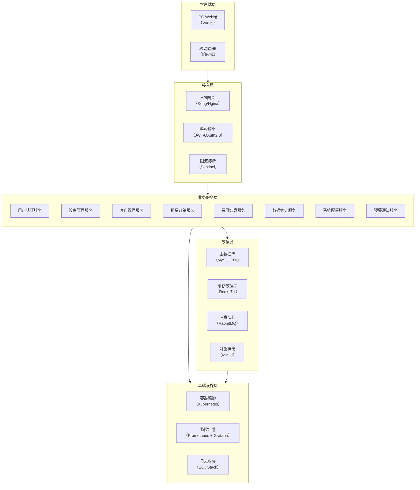
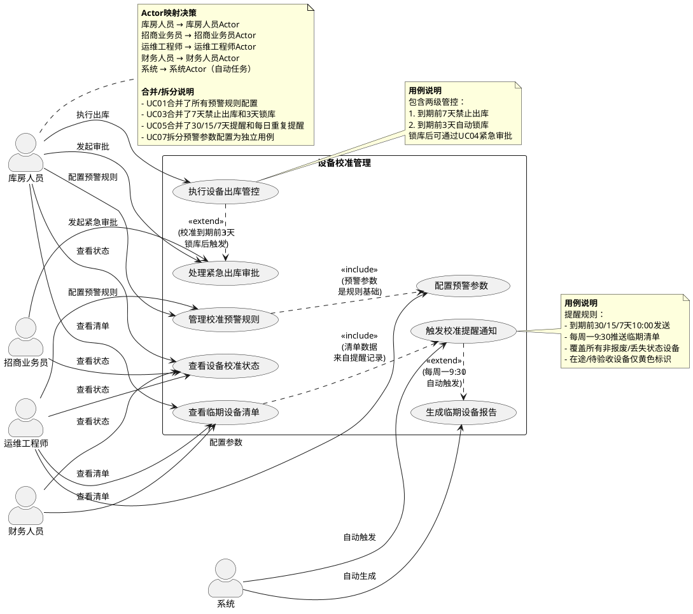
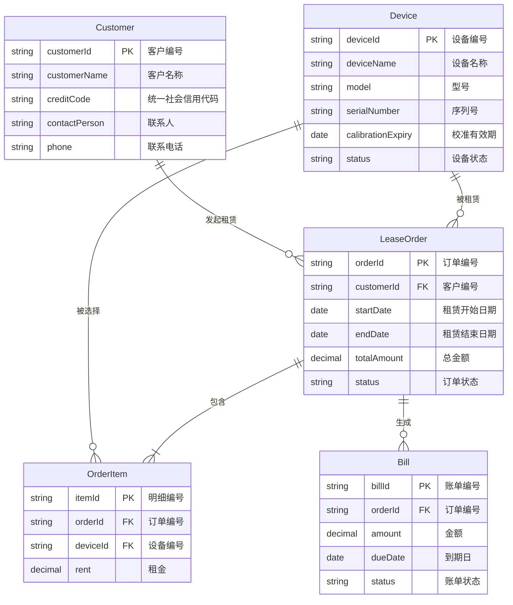
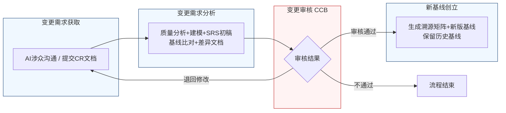

好的，作为一名资深需求分析工程师，我将严格遵循IEEE 830标准和GB/T 9385规范，采用两阶段法，为您生成一份完整的、精确优先的软件需求规格说明书（SRS）。

---

# 文档头部信息

| 项目项 | 内容 |
| :--- | :--- |
| **文档名称** | 软件需求规格说明书（SRS） |
| **项目名称** | 医疗器械租赁管理系统 |
| **项目编号** | MED-RENTAL-2026 |
| **文档版本** | V1.0.0 |
| **基线版本** | BL-20260626-001 |
| **编制人** | AI基线智能体（A6） |
| **编制日期** | 2026-06-26 |
| **审核人** | CCB变更控制委员会 |
| **批准人** | CCB变更控制委员会 |
| **密级** | 内部 |

## 修订历史记录

| 版本号 | 修订日期 | 修订类型 | 修订内容简述 |
| :--- | :--- | :--- | :--- |
| V1.0.0 | 2026-06-26 | 新建 | 文档初稿，确立初始需求基线 |

---

# 1 引言

## 1.1 编制目的

本文档旨在明确界定“医疗器械租赁管理系统”项目的软件需求，为后续的设计、开发、测试、验收及项目管理工作提供精确、无歧义的依据。本文档的编制遵循IEEE 830-1998《软件需求规格说明书推荐实践》及GB/T 9385-2008《计算机软件需求规格说明规范》标准，确保需求的完整性、一致性、可验证性和可追溯性。本文档经CCB（变更控制委员会）审批通过后，将作为项目基线，任何后续变更均需遵循本文档第4章定义的变更管理流程。

## 1.2 文档范围

**包含范围：**
本文档覆盖“医疗器械租赁管理系统”的全部软件需求，具体包括：
1.  **功能需求：** 用户认证、设备管理、客户管理、租赁订单、费用结算、数据统计、系统配置等7大核心功能模块。
2.  **外部接口需求：** 系统与外部系统（如短信网关、邮件服务器、财务系统等）的接口定义。
3.  **非功能需求：** 性能、可靠性、安全性、可维护性、可扩展性、易用性等方面的具体要求。
4.  **数据需求：** 核心数据实体的定义、数据字典及数据管理策略。

**排除范围：**
本文档不包含以下内容：
1.  项目计划、预算、资源分配等项目管理内容。
2.  具体的用户界面（UI）设计稿或原型。
3.  系统部署、运维的详细操作手册。
4.  硬件采购、网络布线等基础设施建设的详细方案。
5.  第三方商业软件（如操作系统、数据库）的许可协议。

## 1.3 引用文件

1.  GB/T 9385-2008 计算机软件需求规格说明规范
2.  IEEE Std 830-1998 IEEE Recommended Practice for Software Requirements Specifications
3.  《高级软件设计实践》教材书稿
4.  医疗器械租赁管理系统涉众需求调研记录（raw/notes/）
5.  医疗器械租赁管理系统UML建模产物
6.  医疗器械租赁管理系统结构化需求清单

## 1.4 术语与缩略语

| 术语/缩略语 | 定义 |
| :--- | :--- |
| **SRS** | 软件需求规格说明书（Software Requirements Specification） |
| **CCB** | 变更控制委员会（Change Control Board） |
| **CR** | 变更请求（Change Request） |
| **FR** | 功能需求（Functional Requirement） |
| **NFR** | 非功能需求（Non-Functional Requirement） |
| **BR** | 业务需求（Business Requirement） |
| **UR** | 用户需求（User Requirement） |
| **RTM** | 需求追溯矩阵（Requirements Traceability Matrix） |
| **P0** | 最高优先级，必须实现的需求。 |
| **P1** | 重要优先级，建议实现的需求。 |
| **P2** | 次要优先级，条件允许时实现的需求。 |
| **API** | 应用程序编程接口（Application Programming Interface） |
| **SLA** | 服务等级协议（Service Level Agreement） |
| **HTTPS** | 超文本传输安全协议（Hypertext Transfer Protocol Secure） |
| **JWT** | JSON Web Token |
| **RBAC** | 基于角色的访问控制（Role-Based Access Control） |

## 1.5 业务背景概述

**现状痛点：**
当前医疗器械租赁业务中，设备校准有效期管理依赖人工台账和线下沟通，存在以下痛点：
1.  **过期风险高：** 缺乏强制管控机制，过期设备可能因疏忽被出库，带来医疗安全和合规风险。
2.  **预警不及时：** 预警方式单一，无法根据设备状态（在库、在途、已出租）进行差异化提醒，导致校准工作安排被动。
3.  **信息不透明：** 库房、业务、运维等部门间信息不对称，无法实时共享设备校准状态，影响协同效率。

**建设目标：**
建设一套集设备全生命周期管理、租赁业务闭环、智能预警与风险管控于一体的医疗器械租赁管理系统。

**量化业务目标：**
1.  **零过期出库事故：** 系统上线后，因校准过期导致的设备出库事故数量降至0。
2.  **校准预警覆盖率100%：** 系统对所有非“报废/丢失”状态的设备实现100%的校准预警覆盖。
3.  **预警响应效率提升50%：** 从预警触发到校准工作安排的平均响应时间缩短50%。

# 2 总体描述

## 2.1 产品概述

**系统定位：**
本系统是一个面向医疗器械租赁企业的业务管理平台，旨在通过信息化手段，实现设备从入库、租赁、出库、在途、验收、出租到回收的全生命周期闭环管理，并建立以设备校准有效期为核心的风险管控体系。

**核心价值：**
1.  **合规风控：** 通过“7天禁止出库、3天锁库”的两级强制管控机制，杜绝过期设备流出，确保法规合规。
2.  **智能预警：** 提供多时间窗口（30/15/7天）、多状态（在库/在途/已出租）的差异化预警，变被动响应为主动管理。
3.  **高效协同：** 打通库房、业务、运维、财务等部门的信息壁垒，实现设备状态实时共享，提升整体运营效率。

### 系统架构图（Mermaid代码）

## 2.2 运行环境要求

| 类别 | 要求项 | 具体规格 |
| :--- | :--- | :--- |
| **硬件** | 应用服务器 | CPU：8核，内存：32GB，磁盘：500GB SSD |
| | 数据库服务器 | CPU：16核，内存：64GB，磁盘：1TB SSD（RAID 10） |
| | 缓存服务器 | CPU：4核，内存：16GB，磁盘：100GB SSD |
| **软件** | 操作系统 | CentOS 7.9 或 Ubuntu 20.04 LTS |
| | 应用服务器 | JDK 17，Tomcat 10 或 Spring Boot 内嵌容器 |
| | 数据库 | MySQL 8.0.28+ |
| | 缓存 | Redis 7.x |
| | 消息队列 | RabbitMQ 3.10+ |
| | 对象存储 | MinIO 2022+ |
| **浏览器** | 兼容性 | 支持最新版本的 Google Chrome、Mozilla Firefox、Microsoft Edge |
| | 分辨率 | 最低支持 1366x768，推荐 1920x1080 |

## 2.3 用户角色与特征

| 角色 | 职责 | 核心权限 | 使用频次 | 技能要求 |
| :--- | :--- | :--- | :--- | :--- |
| **库房人员** | 设备入库、出库、盘点、校准预警处理 | 设备信息管理、出库操作、查看预警清单、发起紧急审批 | 每日多次 | 熟悉设备管理流程，具备基础电脑操作技能 |
| **招商业务员** | 客户开发、租赁合同签订、紧急出库审批发起 | 客户信息管理、合同管理、查看设备状态、发起紧急审批 | 每日多次 | 熟悉租赁业务流程，具备基础电脑操作技能 |
| **运维工程师** | 设备校准、维修、状态更新、预警规则配置 | 设备状态更新、预警参数配置、查看全量设备状态 | 每日一次 | 熟悉设备技术参数，具备系统配置能力 |
| **财务人员** | 费用结算、发票管理、财务报表查看 | 查看费用数据、生成报表、查看设备状态（只读） | 每周数次 | 熟悉财务流程，具备基础电脑操作技能 |
| **系统管理员** | 系统配置、用户管理、权限分配、日志审计 | 所有系统配置权限、用户管理权限、日志查看权限 | 按需 | 具备系统运维和安全管理知识 |

## 2.4 系统运行模式

1.  **正常模式：** 系统所有功能正常运行，所有用户可按照权限进行业务操作。系统每日定时执行校准预警扫描、报告生成等后台任务。
2.  **异常模式：**
    *   **降级运行：** 当核心数据库或缓存服务发生故障时，系统自动降级，仅提供设备信息查询等只读功能，暂停出库、入库等写操作，直至故障恢复。
    *   **超时处理：** 对于外部接口（如短信、邮件）调用，设置超时时间（5秒）。超时后，系统记录失败日志并重试3次，若仍失败，则通过站内信通知管理员。
3.  **维护模式：**
    *   **计划内停机：** 系统管理员可手动将系统切换至维护模式，此时所有用户界面显示“系统正在维护，请稍后...”的提示，所有业务操作暂停。维护完成后，管理员手动恢复系统运行。
    *   **数据备份/恢复：** 在维护模式下，执行数据库全量备份或数据恢复操作。

## 2.5 设计与实现约束

1.  **技术约束：**
    *   后端开发语言必须为Java 17，采用微服务架构（Spring Cloud）。
    *   前端框架必须为Vue.js 3.x。
    *   数据库必须使用MySQL 8.0，缓存必须使用Redis 7.x。
    *   所有API接口必须遵循RESTful设计规范。
2.  **合规约束：**
    *   系统必须符合《医疗器械使用质量监督管理办法》等相关法规要求。
    *   用户密码必须加密存储（BCrypt算法）。
    *   所有操作日志必须完整记录，保留时间不少于180天。
3.  **接口约束：**
    *   与外部系统（如短信网关）的接口协议必须为HTTPS + JSON。
    *   所有对外接口必须进行身份认证和权限校验。
4.  **工期约束：**
    *   核心功能（设备管理、校准预警）必须在项目启动后3个月内完成开发并上线试运行。

## 2.6 假设与依赖

1.  **假设：**
    *   用户具备基本的计算机操作能力。
    *   所有设备在入库时，其校准有效期信息是准确且完整的。
    *   网络环境稳定，能够支持系统的正常运行。
2.  **依赖：**
    *   依赖第三方短信网关和邮件服务器的稳定运行。
    *   依赖项目团队按时提供UI设计稿、测试环境等资源。

# 3 具体需求

## 3.1 功能需求（FR）

### 系统用例图（PlantUML代码）

### 3.1.1 用户认证模块

**FR-AUTH-001：用户登录**
- **优先级：** P0
- **参与角色：** 所有用户
- **前置条件：** 用户账号已由系统管理员创建并激活。
- **触发方式：** 用户在登录页面输入用户名和密码，点击“登录”按钮。
- **业务流程：**
    1.  系统接收用户输入的用户名和密码。
    2.  系统对密码进行BCrypt加密。
    3.  系统将加密后的密码与数据库中存储的密码进行比对。
    4.  若比对成功，系统生成一个JWT Token，并返回给前端。
    5.  前端将Token存储在本地（localStorage或sessionStorage）。
    6.  若比对失败，系统返回“用户名或密码错误”的提示。
- **业务规则：**
    *   密码输入错误连续5次，该账号将被锁定30分钟。
    *   Token有效期为8小时，过期后需重新登录。
    *   同一账号不允许同时在两个不同的浏览器或设备上登录。
- **后置状态：** 用户成功登录系统，进入首页。
- **验收标准：**
    1.  输入正确的用户名和密码，点击登录，1秒内跳转至系统首页。
    2.  输入错误的密码5次，账号被锁定，并提示“账号已被锁定，请30分钟后重试”。
    3.  使用已锁定的账号登录，系统提示“账号已被锁定”。
    4.  Token过期后，访问任何需要认证的接口，返回401状态码。
- **关联需求条目：** 无

**FR-AUTH-002：用户登出**
- **优先级：** P0
- **参与角色：** 所有已登录用户
- **前置条件：** 用户已成功登录系统。
- **触发方式：** 用户点击系统界面上的“退出登录”按钮。
- **业务流程：**
    1.  前端清除本地存储的JWT Token。
    2.  前端跳转至登录页面。
- **业务规则：** 无
- **后置状态：** 用户退出系统，返回登录页面。
- **验收标准：** 点击“退出登录”后，页面立即跳转至登录页，且无法通过浏览器回退功能访问系统内部页面。
- **关联需求条目：** 无

### 3.1.2 设备管理模块

**FR-EQP-001：设备入库**
- **优先级：** P0
- **参与角色：** 库房人员
- **前置条件：** 设备已到货，且附带校准证书。
- **触发方式：** 库房人员在“设备管理”页面点击“新增设备”按钮。
- **业务流程：**
    1.  库房人员填写设备信息，包括但不限于：设备编号（唯一）、设备名称、型号、序列号、生产厂家、校准有效期（日期格式：YYYY-MM-DD）、设备状态（默认为“在库”）。
    2.  库房人员上传校准证书的电子版（PDF或图片格式，单文件不超过10MB）。
    3.  系统校验设备编号是否已存在。
    4.  若校验通过，系统保存设备信息，并更新设备状态为“在库”。
- **业务规则：**
    *   设备编号为必填项，且必须在系统中唯一。
    *   校准有效期必须为当前日期之后的日期。
    *   上传的校准证书文件格式必须为PDF、JPG或PNG。
- **后置状态：** 设备信息成功录入系统，状态为“在库”。
- **验收标准：**
    1.  填写所有必填项，上传合规文件，点击保存，页面提示“设备入库成功”，并在设备列表中显示新设备。
    2.  不填写设备编号，点击保存，页面提示“设备编号不能为空”。
    3.  输入一个已存在的设备编号，点击保存，页面提示“设备编号已存在”。
    4.  上传一个超过10MB的文件，页面提示“文件大小不能超过10MB”。
- **关联需求条目：** BR-EQP-001

**FR-EQP-002：设备出库管控**
- **优先级：** P0
- **参与角色：** 库房人员
- **前置条件：** 设备状态为“在库”，且存在对应的租赁订单。
- **触发方式：** 库房人员在“出库管理”页面，选择设备并点击“确认出库”按钮。
- **业务流程：**
    1.  系统计算当前日期与设备校准有效期之间的天数差（DaysToExpiry）。
    2.  **规则判断：**
        a.  若 `DaysToExpiry <= 0`（已过期），系统拒绝出库，并提示“设备已过期，禁止出库”。
        b.  若 `0 < DaysToExpiry <= 7`，系统拒绝出库，并提示“设备即将到期（剩余X天），禁止出库”。
        c.  若 `DaysToExpiry > 7`，系统允许出库。
    3.  若允许出库，系统更新设备状态为“出库在途”。
- **业务规则：**
    *   `DaysToExpiry` 的计算方式为：`校准有效期 - 当前日期`。
    *   对于“出库在途”状态的设备，系统在设备列表页以黄色标识显示其校准到期信息。
- **后置状态：** 设备状态更新为“出库在途”，或出库操作被拒绝并给出明确提示。
- **验收标准：**
    1.  选择一台校准有效期剩余8天的设备，点击“确认出库”，操作成功，设备状态变为“出库在途”。
    2.  选择一台校准有效期剩余7天的设备，点击“确认出库”，操作失败，提示“设备即将到期（剩余7天），禁止出库”。
    3.  选择一台已过期的设备，点击“确认出库”，操作失败，提示“设备已过期，禁止出库”。
- **关联需求条目：** BR-EQP-001, BR-EQP-002, BR-EQP-003

**FR-EQP-003：设备锁库与紧急审批**
- **优先级：** P0
- **参与角色：** 库房人员、招商业务员
- **前置条件：** 设备状态为“在库”，且 `DaysToExpiry <= 3`。
- **触发方式：** 系统每日定时任务自动触发锁库。
- **业务流程：**
    1.  **系统自动锁库：** 系统每日凌晨2:00执行定时任务，扫描所有“在库”状态的设备。若 `DaysToExpiry <= 3`，系统自动将该设备的库位标记为“锁定”，禁止任何出库操作。
    2.  **发起紧急审批：** 若业务需要紧急出库被锁定的设备，招商业务员可在设备详情页点击“发起紧急出库审批”按钮。
    3.  **审批流程：**
        a.  招商业务员填写紧急出库原因，并提交。
        b.  系统将审批请求发送至库房经理和运维经理。
        c.  两位经理均审批通过后，系统临时解锁该设备30分钟。
        d.  库房人员需在30分钟内完成出库操作。
        e.  若30分钟内未完成出库，设备将自动重新锁定。
- **业务规则：**
    *   锁库操作不可逆，除非通过紧急审批流程。
    *   紧急审批流程必须在30分钟内完成，否则自动作废。
    *   每次紧急审批仅针对单台设备。
- **后置状态：** 设备库位被锁定，或通过审批后临时解锁。
- **验收标准：**
    1.  将系统时间调整至设备校准有效期前3天，等待凌晨2:00，该设备库位状态变为“锁定”。
    2.  尝试出库被锁定的设备，系统提示“设备已被锁定，无法出库”。
    3.  发起紧急审批，两位经理均审批通过后，该设备在30分钟内可正常出库。
    4.  发起紧急审批，30分钟内未完成出库，设备自动重新锁定。
- **关联需求条目：** BR-EQP-002, BR-EQP-003

**FR-EQP-004：校准预警提醒**
- **优先级：** P0
- **参与角色：** 系统（自动触发）
- **前置条件：** 系统中存在非“报废/丢失”状态的设备。
- **触发方式：** 系统定时任务。
- **业务流程：**
    1.  **每日扫描：** 系统每日上午10:00执行定时任务，扫描所有非“报废/丢失”状态的设备。
    2.  **预警触发：**
        a.  若 `DaysToExpiry == 30`，系统向库房人员、运维工程师发送站内信和邮件提醒，内容为“设备[设备编号]将于30天后校准到期”。
        b.  若 `DaysToExpiry == 15`，系统向库房人员、运维工程师发送站内信和邮件提醒。
        c.  若 `DaysToExpiry == 7`，系统向库房人员、运维工程师、招商业务员发送站内信和邮件提醒。
    3.  **每周报告：** 系统每周一上午9:30自动生成“临期设备清单”（包含未来30天内到期的所有设备），并通过站内信推送给库房人员、运维工程师和财务人员。
- **业务规则：**
    *   预警覆盖的设备状态包括：“在库”、“出库在途”、“待验收”、“已出租”、“临时借用”。
    *   对于“出库在途”和“待验收”状态的设备，预警仅以黄色标识在设备列表页显示，不发送站内信或邮件。
    *   预警触发时间严格按“到期日往前倒推”的绝对日期计算。例如，校准有效期为2026-06-26的设备，其“30天预警”将在2026-06-26触发。
- **后置状态：** 相关用户收到预警通知。
- **验收标准：**
    1.  将系统时间调整至设备校准有效期前30天，上午10:00，库房人员和运维工程师收到站内信和邮件。
    2.  将系统时间调整至周一，上午9:30，相关人员收到“临期设备清单”站内信。
    3.  一台“出库在途”的设备，在其校准有效期前7天，设备列表页显示黄色标识，但相关人员未收到站内信或邮件。
- **关联需求条目：** BR-EQP-004, BR-EQP-005, BR-EQP-006, BR-EQP-007, BR-EQP-008, BR-EQP-009, BR-EQP-010, BR-EQP-011, BR-EQP-012, BR-EQP-013, BR-EQP-014, BR-EQP-015, BR-EQP-016

### 3.1.3 客户管理模块

**FR-CUS-001：客户信息管理**
- **优先级：** P0
- **参与角色：** 招商业务员
- **前置条件：** 用户已登录并拥有客户管理权限。
- **触发方式：** 用户在“客户管理”页面点击“新增客户”或选择已有客户进行编辑。
- **业务流程：**
    1.  用户填写或修改客户信息，包括：客户名称（必填）、统一社会信用代码（必填）、联系人、联系电话、地址、邮箱等。
    2.  系统校验客户名称和统一社会信用代码的唯一性。
    3.  若校验通过，系统保存客户信息。
- **业务规则：**
    *   客户名称和统一社会信用代码在系统中必须唯一。
    *   联系电话和邮箱需进行格式校验。
- **后置状态：** 客户信息成功创建或更新。
- **验收标准：**
    1.  新增一个客户，填写所有必填项，保存成功，客户列表显示新客户。
    2.  输入一个已存在的客户名称，保存失败，提示“客户名称已存在”。
    3.  输入格式错误的邮箱，保存失败，提示“邮箱格式不正确”。
- **关联需求条目：** 无

### 3.1.4 租赁订单模块

**FR-ORD-001：创建租赁订单**
- **优先级：** P0
- **参与角色：** 招商业务员
- **前置条件：** 客户信息已存在。
- **触发方式：** 用户在“订单管理”页面点击“新建订单”按钮。
- **业务流程：**
    1.  用户选择客户。
    2.  用户选择要租赁的设备（仅显示“在库”且 `DaysToExpiry > 7` 的设备）。
    3.  用户填写租赁起止日期、租金、押金等信息。
    4.  系统自动计算租赁总金额。
    5.  用户提交订单，订单状态为“待审核”。
- **业务规则：**
    *   租赁结束日期必须晚于开始日期。
    *   选择的设备数量不能超过可用库存。
- **后置状态：** 生成一个状态为“待审核”的租赁订单。
- **验收标准：**
    1.  选择一个客户和一台可用设备，填写租赁日期，提交成功，订单列表显示新订单。
    2.  选择一台 `DaysToExpiry <= 7` 的设备，该设备在可选列表中不可见或置灰。
    3.  租赁结束日期早于开始日期，提交失败，提示“结束日期必须晚于开始日期”。
- **关联需求条目：** 无

### 3.1.5 费用结算模块

**FR-BIL-001：生成费用账单**
- **优先级：** P1
- **参与角色：** 系统（自动触发）
- **前置条件：** 租赁订单状态为“已结束”。
- **触发方式：** 系统每日凌晨3:00执行定时任务。
- **业务流程：**
    1.  系统扫描所有状态为“已结束”且未生成账单的订单。
    2.  根据订单中的租金、押金、实际租赁天数等信息，自动生成费用账单。
    3.  账单状态为“待支付”。
- **业务规则：**
    *   账单金额计算规则：`租金 * 租赁天数`。
    *   若设备有损坏，可根据线下协商结果，在账单中增加“赔偿金”项。
- **后置状态：** 生成一个状态为“待支付”的费用账单。
- **验收标准：** 将一个订单状态更新为“已结束”，次日凌晨3:00后，该订单下生成一个金额正确的“待支付”账单。
- **关联需求条目：** 无

### 3.1.6 数据统计模块

**FR-STA-001：生成设备校准统计报表**
- **优先级：** P1
- **参与角色：** 运维工程师、财务人员
- **前置条件：** 系统中存在设备数据。
- **触发方式：** 用户在“数据统计”页面选择报表类型并点击“生成报表”。
- **业务流程：**
    1.  用户选择报表类型，如“设备校准到期统计”。
    2.  用户选择时间范围。
    3.  系统根据筛选条件，统计并展示数据，如：未来30天内到期的设备数量、已过期设备数量等。
    4.  支持报表导出为Excel格式。
- **业务规则：** 无
- **后置状态：** 生成并展示统计报表。
- **验收标准：** 选择“设备校准到期统计”和时间范围，点击生成，页面正确显示统计图表和数据列表，并可成功导出为Excel文件。
- **关联需求条目：** 无

### 3.1.7 系统配置模块

**FR-CFG-001：预警参数配置**
- **优先级：** P1
- **参与角色：** 运维工程师
- **前置条件：** 用户已登录并拥有系统配置权限。
- **触发方式：** 用户在“系统配置”->“预警参数”页面修改参数并保存。
- **业务流程：**
    1.  用户可配置以下参数：
        a.  禁止出库阈值（默认：7天）。
        b.  锁库阈值（默认：3天）。
        c.  预警时间窗口（默认：30天、15天、7天）。
        d.  每周报告推送时间（默认：周一 09:30）。
    2.  用户修改参数后，点击“保存”。
    3.  系统校验参数合法性（如：锁库阈值必须小于禁止出库阈值）。
    4.  若校验通过，系统保存新参数，并立即生效。
- **业务规则：**
    *   锁库阈值必须小于禁止出库阈值。
    *   预警时间窗口必须为正整数。
- **后置状态：** 预警参数更新。
- **验收标准：**
    1.  将禁止出库阈值修改为5天，保存成功。之后，一台校准有效期剩余6天的设备可出库，剩余5天的设备被禁止出库。
    2.  将锁库阈值修改为2天，保存成功。之后，一台校准有效期剩余3天的设备不会被锁库，剩余2天的设备会被锁库。
    3.  将锁库阈值修改为8天（大于禁止出库阈值7天），保存失败，提示“锁库阈值必须小于禁止出库阈值”。
- **关联需求条目：** BR-EQP-010, BR-EQP-012, BR-EQP-013

## 3.2 外部接口需求（IFR）

**IFR-EXT-001：短信发送接口**
- **接口描述：** 系统通过调用第三方短信网关API，向用户发送预警通知、审批提醒等短信。
- **输入：** `{ "phoneNumbers": ["138xxxxxx"], "templateCode": "SMS_XXXX", "templateParam": {"name":"张三", "deviceId":"EQP-001"} }`
- **输出：** `{ "code": "OK", "message": "发送成功", "bizId": "12345" }`
- **协议：** HTTPS
- **数据格式：** JSON
- **触发条件：** 系统触发校准预警或紧急审批流程时。
- **性能要求：** 接口响应时间小于2秒。

**IFR-EXT-002：邮件发送接口**
- **接口描述：** 系统通过SMTP协议连接公司邮件服务器，向用户发送预警通知、报告等邮件。
- **输入：** `{ "to": ["user@company.com"], "subject": "设备校准预警通知", "content": "..." }`
- **输出：** 发送成功或失败的状态码。
- **协议：** SMTP over SSL/TLS
- **数据格式：** 纯文本或HTML
- **触发条件：** 系统触发校准预警或生成临期设备报告时。
- **性能要求：** 单封邮件发送时间小于5秒。

### E-R图（Mermaid erDiagram）

### 数据字典

| 表名 | 字段名 | 类型 | 主键 | 外键 | 默认值 | 说明 |
| :--- | :--- | :--- | :--- | :--- | :--- | :--- |
| **Device** | deviceId | VARCHAR(50) | Y | N | N/A | 设备编号，唯一标识 |
| | deviceName | VARCHAR(100) | N | N | N/A | 设备名称 |
| | model | VARCHAR(50) | N | N | N/A | 型号 |
| | serialNumber | VARCHAR(100) | N | N | N/A | 序列号 |
| | calibrationExpiry | DATE | N | N | N/A | 校准有效期 |
| | status | VARCHAR(20) | N | N | '在库' | 设备状态 |
| **Customer** | customerId | VARCHAR(50) | Y | N | N/A | 客户编号 |
| | customerName | VARCHAR(100) | N | N | N/A | 客户名称 |
| | creditCode | VARCHAR(18) | N | N | N/A | 统一社会信用代码 |
| | contactPerson | VARCHAR(50) | N | N | N/A | 联系人 |
| | phone | VARCHAR(20) | N | N | N/A | 联系电话 |
| **LeaseOrder** | orderId | VARCHAR(50) | Y | N | N/A | 订单编号 |
| | customerId | VARCHAR(50) | N | Y | N/A | 客户编号，关联Customer表 |
| | startDate | DATE | N | N | N/A | 租赁开始日期 |
| | endDate | DATE | N | N | N/A | 租赁结束日期 |
| | totalAmount | DECIMAL(10,2) | N | N | 0.00 | 总金额 |
| | status | VARCHAR(20) | N | N | '待审核' | 订单状态 |
| **OrderItem** | itemId | VARCHAR(50) | Y | N | N/A | 明细编号 |
| | orderId | VARCHAR(50) | N | Y | N/A | 订单编号，关联LeaseOrder表 |
| | deviceId | VARCHAR(50) | N | Y | N/A | 设备编号，关联Device表 |
| | rent | DECIMAL(10,2) | N | N | 0.00 | 租金 |
| **Bill** | billId | VARCHAR(50) | Y | N | N/A | 账单编号 |
| | orderId | VARCHAR(50) | N | Y | N/A | 订单编号，关联LeaseOrder表 |
| | amount | DECIMAL(10,2) | N | N | 0.00 | 金额 |
| | dueDate | DATE | N | N | N/A | 到期日 |
| | status | VARCHAR(20) | N | N | '待支付' | 账单状态 |

## 3.3 非功能需求（NFR）

### 3.3.1 性能需求

1.  **页面加载时间：** 在标准网络环境下（带宽10Mbps），90%的页面加载时间不超过2秒，其余页面不超过4秒。
2.  **接口响应时间：**
    *   90%的简单查询接口（如根据ID查询单条记录）响应时间不超过200毫秒。
    *   90%的复杂查询接口（如带多条件筛选的列表查询）响应时间不超过1秒。
    *   90%的写入接口（如新增、修改）响应时间不超过500毫秒。
3.  **并发用户数：** 系统应支持至少200个用户同时在线操作。
4.  **吞吐量：** 系统应支持至少每秒处理100个API请求。

### 3.3.2 可靠性需求

1.  **系统可用率：** 系统在正常工作时间（7x24小时）内的可用率不低于99.9%（即每年计划外停机时间不超过8.76小时）。
2.  **连续运行：** 系统应能7x24小时连续运行，无需重启。
3.  **故障恢复：** 当系统发生故障时，应在30分钟内恢复服务。数据丢失量不超过5分钟。

### 3.3.3 安全性需求

1.  **身份认证：** 所有用户必须通过用户名+密码的方式进行身份认证。密码必须满足复杂度要求（至少8位，包含大写字母、小写字母、数字和特殊字符中的至少3种）。
2.  **权限控制：** 系统采用RBAC模型，不同角色拥有不同的功能权限和数据权限。
3.  **数据加密：**
    *   用户密码在数据库中必须使用BCrypt算法加密存储。
    *   所有敏感数据（如客户联系方式）在传输过程中必须使用HTTPS加密。
4.  **攻击防护：** 系统应具备基本的防SQL注入、防XSS攻击、防CSRF攻击的能力。
5.  **审计日志：** 所有用户的关键操作（如登录、新增/修改/删除数据）必须记录详细的审计日志，包括操作人、操作时间、IP地址、操作内容等。日志保留时间不少于180天。

### 3.3.4 可维护性需求

1.  **日志记录：** 系统应提供统一的日志记录框架，支持按级别（DEBUG, INFO, WARN, ERROR）和模块进行日志分类和查询。
2.  **配置管理：** 系统的关键配置项（如数据库连接、预警参数）应支持外部化配置，修改后无需重启服务即可生效。
3.  **模块化设计：** 系统应采用微服务架构，各服务模块之间低耦合、高内聚，便于独立开发、测试、部署和维护。

### 3.3.5 可扩展性需求

1.  **水平扩展：** 业务服务层应支持水平扩展，通过增加服务器实例来提升系统的处理能力。
2.  **插件化设计：** 对于可能变化的业务逻辑（如费用计算规则），应采用插件化设计，便于未来扩展新的计算方式。

### 3.3.6 易用性需求

1.  **界面一致性：** 系统所有页面的布局、操作方式、术语应保持一致。
2.  **操作反馈：** 用户进行任何操作后，系统应在1秒内给出明确的成功或失败反馈。
3.  **错误提示：** 系统给出的错误提示应清晰、具体，能够指导用户进行下一步操作，避免使用“系统错误”等模糊提示。
4.  **帮助文档：** 系统应提供在线帮助文档，方便用户查阅。

## 3.4 数据需求

### 数据字典

（已在上文3.2节中提供，此处不再重复）

### 数据管理策略

1.  **备份策略：**
    *   **全量备份：** 每周日凌晨2:00执行一次数据库全量备份。
    *   **增量备份：** 每日凌晨2:00执行一次数据库增量备份。
    *   **备份保留：** 全量备份保留3个月，增量备份保留1个月。
2.  **归档策略：**
    *   对于超过1年的历史订单和账单数据，系统自动将其从主数据库中归档至历史数据库或冷存储中。
3.  **数据留存：**
    *   用户操作日志保留180天。
    *   核心业务数据（设备、客户、订单）永久保留。

# 4 需求基线与变更管理

## 4.1 需求基线定义

1.  **基线版本格式：** `BL-YYYYMMDD-NN`（YYYYMMDD=日期，NN=当日流水号）。
2.  **初始基线：** 本文档经CCB审批通过后，即成为项目的初始需求基线，版本号为 `BL-20260626-001`。
3.  **基线冻结：** 基线发布后，所有需求条目进入冻结状态。任何对基线中需求的修改、新增或删除，均必须遵循本章定义的变更管理流程，否则视为违规。

## 4.2 需求变更整体流程

## 4.3 变更详细流程（四阶段）

### 4.3.1 阶段一：变更需求获取

变更需求的来源有两种途径：
1.  **AI涉众沟通：** 通过AI智能体与涉众（库房人员、业务员等）进行结构化沟通，自动生成变更需求草案。
2.  **正式CR文档：** 需求提出方（如产品经理、客户）填写并提交正式的《变更需求文档》（CR），说明变更原因、内容、影响范围及预期收益。

### 4.3.2 阶段二：变更需求分析（4个子阶段）

1.  **需求质量分析：** 分析人员对变更需求进行校验，确保其合理性、完整性、无歧义，并与项目目标一致。
2.  **项目建模：** 根据变更需求，更新相关的UML用例图、活动图等模型。
3.  **SRS初稿生成：** 基于更新后的模型，整合生成变更后的SRS初稿。
4.  **基线比对：** 读取当前生效的需求基线，生成《需求差异文档》，清晰列出变更前后条目的增、删、改情况。

### 4.3.3 阶段三：变更审核（CCB评审）

CCB召开评审会议，对变更需求、分析结果、SRS初稿及差异文档进行审核。审核结论分为三种：
1.  **审核不通过：** 变更请求被拒绝，流程终止。
2.  **审核退回修改：** 变更请求存在不足，退回至“变更需求获取”阶段，由提出方修改后重新提交。
3.  **审核通过：** 变更请求被批准，进入“新基线创立”环节。

### 4.3.4 阶段四：新基线创立

1.  **生成需求溯源矩阵（RTM）：** 建立变更前后需求条目的映射关系，确保所有需求都可追溯。
2.  **发布新基线：** 将审核通过的SRS定为新的正式基线，并按照版本规则生成新的基线编号（如 `BL-20260701-001`）。
3.  **历史基线归档：** 旧版本的需求基线文档将被完整归档，不覆盖、不删除，以备后续查阅。

## 4.4 变更记录台账

| 变更编号 | 变更日期 | 申请人 | 变更来源(AI/CR) | 变更简述 | 影响模块 | CCB结论 | 新版基线号 |
| :--- | :--- | :--- | :--- | :--- | :--- | :--- | :--- |
| — | 2026-06-26 | — | 初始基线 | 初始基线，无历史变更 | — | 通过 | BL-20260626-001 |

# 5 附录

## 附录A 全量图表汇总

集中存放本SRS中的架构图、用例图、E-R图、流程图（Mermaid代码）：
- **系统架构图：** 见 §2.1
- **系统用例图：** 见 §3.1
- **E-R图：** 见 §3.2
- **变更流程图：** 见 §4.2

## 附录B 验收标准总表

| 需求编号 | 需求名称 | 验收标准 | 优先级 |
| :--- | :--- | :--- | :--- |
| FR-EQP-002 | 设备出库管控 | 1. 选择一台校准有效期剩余8天的设备，点击“确认出库”，操作成功，设备状态变为“出库在途”。 2. 选择一台校准有效期剩余7天的设备，点击“确认出库”，操作失败，提示“设备即将到期（剩余7天），禁止出库”。 3. 选择一台已过期的设备，点击“确认出库”，操作失败，提示“设备已过期，禁止出库”。 | P0 |
| FR-EQP-003 | 设备锁库与紧急审批 | 1. 将系统时间调整至设备校准有效期前3天，等待凌晨2:00，该设备库位状态变为“锁定”。 2. 尝试出库被锁定的设备，系统提示“设备已被锁定，无法出库”。 3. 发起紧急审批，两位经理均审批通过后，该设备在30分钟内可正常出库。 4. 发起紧急审批，30分钟内未完成出库，设备自动重新锁定。 | P0 |
| FR-EQP-004 | 校准预警提醒 | 1. 将系统时间调整至设备校准有效期前30天，上午10:00，库房人员和运维工程师收到站内信和邮件。 2. 将系统时间调整至周一，上午9:30，相关人员收到“临期设备清单”站内信。 3. 一台“出库在途”的设备，在其校准有效期前7天，设备列表页显示黄色标识，但相关人员未收到站内信或邮件。 | P0 |

## 附录C 参考资料与外部文档链接

1.  GB/T 9385-2008 计算机软件需求规格说明规范
2.  IEEE Std 830-1998 IEEE Recommended Practice for Software Requirements Specifications
3.  《高级软件设计实践》教材书稿
4.  医疗器械租赁管理系统涉众需求调研记录（raw/notes/）
5.  医疗器械租赁管理系统UML建模产物
6.  医疗器械租赁管理系统结构化需求清单