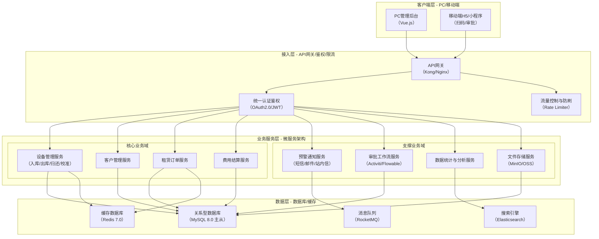
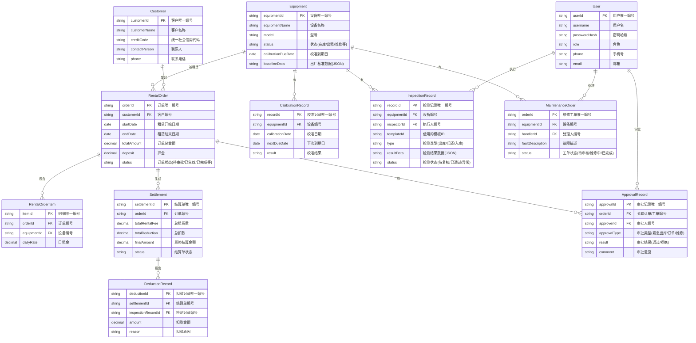
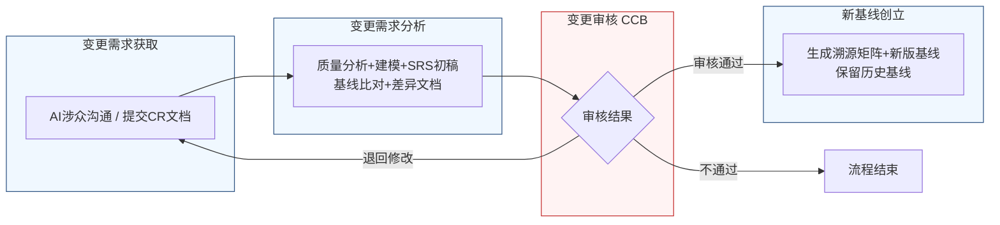

好的，作为一名资深需求分析工程师，我将严格遵循您的要求，采用“两阶段法”生成这份完整的软件需求规格说明书（SRS）。我将恪守“精确优先于流畅”的铁律，保留需求清单中的每一个数字、边界条件和约束参数，确保文档的精确性和可验证性。

---
# 文档头部信息
| 项目项 | 内容 |
| ---- | ---- |
| 文档名称 | 软件需求规格说明书（SRS）|
| 项目名称 | 医疗器械租赁管理系统 |
| 项目编号 | MED-RENTAL-2026 |
| 文档版本 | V1.0.0 |
| 基线版本 | 【占位，由A6分配】|
| 编制人 | AI基线智能体（A6） |
| 编制日期 | 2026-06-26 |
| 审核人 | CCB变更控制委员会 |
| 批准人 | CCB变更控制委员会 |
| 密级 | 内部 |

## 修订历史记录
| 版本号 | 修订日期 | 修订类型 | 修订内容简述 |
| V1.0.0 | 2026-06-26 | 新建 | 文档初稿，确立初始需求基线 |

# 1 引言
## 1.1 编制目的
本软件需求规格说明书（SRS）旨在为“医疗器械租赁管理系统”项目提供一份完整、精确、无歧义的需求定义。本文档是项目开发团队、测试团队、项目管理团队及所有相关涉众之间达成共识的正式依据。其主要目的包括：
1.  **明确需求基线**：精确描述系统的功能需求、非功能需求、外部接口需求及数据需求，作为后续设计、开发、测试和验收工作的唯一基准。
2.  **促进沟通**：为所有项目干系人（包括招商业务员、库房人员、运维工程师、设备科长、质控人员及开发团队）提供一个统一、清晰的需求理解平台，消除歧义。
3.  **指导设计与开发**：为系统架构师、软件设计师和开发工程师提供详细、可操作的需求规格，指导系统架构设计、模块划分和代码实现。
4.  **支撑测试与验收**：提供可量化、可测试的验收标准，确保最终交付的系统完全满足业务需求，并作为项目验收的依据。
5.  **管理需求变更**：作为需求基线管理的核心文档，为后续的需求变更提供追溯和评估的基础。

## 1.2 文档范围（包含/排除）
**包含范围：**
- 系统核心业务功能，包括设备全生命周期管理（入库、出库、归还、校准、预警）、客户管理、租赁订单管理、费用结算、数据统计与报表。
- 系统非功能需求，包括性能、可靠性、安全性、可维护性、可扩展性和易用性。
- 系统外部接口需求，包括与第三方系统（如财务系统、短信/邮件网关）的集成。
- 系统数据需求，包括核心实体的数据字典和数据管理策略。
- 需求基线与变更管理流程。

**排除范围：**
- 具体的用户界面（UI）设计稿或原型。本文档仅定义功能和行为，不规定视觉呈现细节。
- 详细的系统架构设计文档或技术实现方案。本文档定义“做什么”，而非“怎么做”。
- 硬件采购清单或网络拓扑设计。
- 项目计划、预算或资源分配等项目管理内容。
- 第三方系统的内部实现细节。

## 1.3 引用文件
1.  IEEE Std 830-1998, IEEE Recommended Practice for Software Requirements Specifications.
2.  GB/T 9385-2008, 计算机软件需求规格说明规范.
3.  《高级软件设计实践》教材书稿.
4.  医疗器械租赁管理系统涉众需求调研记录（raw/notes/）.
5.  医疗器械租赁管理系统UML建模产物.
6.  医疗器械租赁管理系统结构化需求清单.

## 1.4 术语与缩略语
| 术语/缩略语 | 定义 |
| :--- | :--- |
| **SRS** | 软件需求规格说明书 (Software Requirements Specification) |
| **CCB** | 变更控制委员会 (Change Control Board) |
| **CR** | 变更请求 (Change Request) |
| **FR** | 功能需求 (Functional Requirement) |
| **NFR** | 非功能需求 (Non-Functional Requirement) |
| **IFR** | 外部接口需求 (Interface Requirement) |
| **BR** | 业务目标 (Business Requirement) |
| **UR** | 原始需求 (User Requirement) |
| **EQP** | 设备管理 (Equipment Management) 模块缩写 |
| **CUS** | 客户管理 (Customer Management) 模块缩写 |
| **ORD** | 租赁订单 (Rental Order) 模块缩写 |
| **FIN** | 费用结算 (Financial Settlement) 模块缩写 |
| **STAT** | 数据统计 (Statistics) 模块缩写 |
| **SYS** | 系统配置 (System Configuration) 模块缩写 |
| **AUTH** | 用户认证 (User Authentication) 模块缩写 |
| **RTM** | 需求追溯矩阵 (Requirements Traceability Matrix) |
| **P0** | 优先级0 (Priority 0)，必须实现，否则系统无法上线或核心业务无法运转。 |
| **P1** | 优先级1 (Priority 1)，重要功能，应实现，否则严重影响用户体验或业务流程效率。 |
| **P2** | 优先级2 (Priority 2)，次要功能，在资源允许的情况下实现，用于提升系统易用性或扩展性。 |

## 1.5 业务背景概述
**现状痛点：**
当前医疗器械租赁业务管理主要依赖线下表格和人工经验，存在以下核心痛点：
1.  **设备校准管理失控**：设备校准有效期依赖人工记忆和纸质台账，常出现设备过期未校准仍被出库的情况，存在巨大医疗风险和合规隐患。预警机制缺失或低效，导致紧急协调成本高。
2.  **设备归还检测标准不一**：设备出库和归还时的检测流程、标准、模板不统一，导致设备状态难以追溯，损耗责任界定不清，押金扣款和折旧调整缺乏客观依据，易引发客户纠纷。
3.  **库存状态不透明**：设备在库、在途、出租、维修、校准等状态信息不实时、不准确，影响设备利用率和管理决策。
4.  **业务流程依赖人工**：出库审批、紧急放行、费用计算等环节依赖人工沟通和纸质单据，效率低下，易出错。

**建设目标：**
建设一套统一的医疗器械租赁管理系统，实现以下量化业务目标：
1.  **设备校准合规率提升至100%**：通过系统级强制管控（7天禁止出库、3天强制锁库）和分级预警，杜绝校准过期设备出库。
2.  **设备归还检测标准化率提升至100%**：强制使用统一检测模板，自动比对基准值，实现设备状态精准追溯，将因损耗责任不清导致的纠纷降低80%。
3.  **紧急出库审批效率提升50%**：通过线上化审批流程，将紧急出库申请到审批完成的平均时间从2小时缩短至1小时以内。
4.  **库存信息实时准确率提升至99%**：系统自动同步设备状态，确保库存数据实时、准确，支持高效调度。

# 2 总体描述
## 2.1 产品概述（系统定位、核心价值）
**系统定位**：本系统是一套面向医疗器械租赁企业的综合性业务管理平台，旨在通过信息化、自动化、智能化的手段，实现对设备全生命周期的精细化、合规化管理。

**核心价值**：
1.  **合规保障**：通过强制性的校准管控和标准化的检测流程，确保设备使用始终符合医疗合规要求，降低企业运营风险。
2.  **运营提效**：自动化预警、线上化审批、标准化流程，大幅减少人工操作和沟通成本，提升业务处理效率。
3.  **数据驱动**：基于设备全生命周期的数据采集与分析，为设备折旧、维修策略、采购决策提供客观、精准的数据支持。
4.  **责任清晰**：通过出库/归还检测数据的自动比对，精准界定设备损耗责任，减少客户纠纷，保障企业利益。

### 系统架构图（Mermaid代码）

## 2.2 运行环境要求
| 环境类别 | 具体要求 |
| :--- | :--- |
| **硬件环境（服务器）** | CPU：8核及以上；内存：32GB及以上；硬盘：SSD 500GB及以上；网络：千兆以太网。 |
| **软件环境（服务器）** | 操作系统：CentOS 7.9+ 或 Ubuntu 20.04+；应用服务器：JDK 17+；数据库：MySQL 8.0+；缓存：Redis 7.0+；消息队列：RocketMQ 5.0+。 |
| **客户端（PC）** | 操作系统：Windows 10/11, macOS 12+；浏览器：Chrome 最新版本，Firefox 最新版本，Edge 最新版本。 |
| **客户端（移动端）** | 操作系统：iOS 14+，Android 10+；浏览器：Safari，Chrome。 |
| **网络要求** | 客户端与服务器之间网络延迟 ≤ 200ms，带宽 ≥ 10Mbps。 |

## 2.3 用户角色与特征
| 角色 | 职责 | 核心权限 | 使用频次 | 技能要求 |
| :--- | :--- | :--- | :--- | :--- |
| **招商业务员** | 负责设备租赁业务的洽谈、合同签订、设备出库/归还协调。 | 发起出库/归还申请，查看设备状态，处理校准预警，发起紧急审批。 | 每日多次 | 熟悉租赁业务流程，具备基础电脑操作能力。 |
| **库房人员** | 负责设备的实物入库、出库、盘点、检测、校准送检。 | 执行入库/出库/归还检测，查看库存，接收校准预警，发起紧急审批。 | 每日多次 | 熟悉库房管理流程，具备设备检测技能，熟练使用扫码设备。 |
| **运维工程师** | 负责设备的安装、调试、维修、保养、校准及技术状态评估。 | 查看设备技术档案，执行出库/归还检测，处理校准异常，审批紧急出库。 | 每日多次 | 具备医疗器械专业知识，熟悉设备性能参数和检测标准。 |
| **设备科长** | 负责设备管理部门的整体工作，审批重要流程。 | 审批紧急出库申请，审批设备报废/降级，查看全局设备状态报表。 | 每日数次 | 具备管理经验，熟悉设备管理政策和合规要求。 |
| **质控人员** | 负责监督设备质量与合规性，参与关键审批。 | 审批紧急出库申请，审核校准异常处理方案，查看质量报表。 | 每日数次 | 具备质量管理经验，熟悉医疗器械质量体系。 |
| **系统管理员** | 负责系统配置、用户管理、权限分配、数据维护。 | 所有系统配置权限，用户角色管理，数据字典维护，日志查看。 | 按需 | 具备IT系统管理经验，熟悉系统配置和权限模型。 |

## 2.4 系统运行模式
1.  **正常模式**：系统所有功能正常运行，所有用户可按照权限进行业务操作。系统响应时间、并发处理能力等性能指标满足非功能需求。
2.  **异常模式**：
    *   **降级模式**：当核心数据库或服务出现故障时，系统自动启用缓存数据，保证设备查询、基础信息展示等读操作可用。写操作（如创建订单、执行检测）将被限制或进入队列等待恢复。
    *   **熔断模式**：当某个非核心服务（如短信通知）持续超时或失败时，系统自动熔断对该服务的调用，避免级联故障，并记录日志。
3.  **维护模式**：系统管理员可手动将系统切换至维护模式。在此模式下，所有用户界面将显示“系统正在维护，请稍后...”的提示，并阻止所有新的业务操作。正在进行的操作将被安全终止或等待恢复。

## 2.5 设计与实现约束
1.  **技术约束**：
    *   后端必须采用Java 17+及Spring Boot 3.x微服务架构。
    *   前端必须采用Vue.js 3.x或React 18+框架。
    *   数据库必须采用MySQL 8.0，并支持主从复制。
    *   所有服务间通信必须采用RESTful API或gRPC。
2.  **合规约束**：
    *   系统必须符合《医疗器械监督管理条例》及相关法规对设备追溯、校准管理的合规要求。
    *   系统必须满足《个人信息保护法》对用户数据隐私保护的要求。
3.  **接口约束**：
    *   所有对外提供的API必须遵循RESTful设计规范，并使用JSON格式进行数据交换。
    *   必须提供标准的接口文档（如Swagger/OpenAPI）。
4.  **工期约束**：
    *   核心功能（设备管理、校准预警、出库管控）必须在项目启动后3个月内完成开发并上线试运行。

## 2.6 假设与依赖
1.  **假设**：
    *   所有设备在入库时，其出厂测试基准数据（如传感器灵敏度值、电池容量等）已由供应商提供并录入系统。
    *   用户具备基本的电脑和移动设备操作能力。
    *   网络环境稳定可靠，满足系统运行要求。
2.  **依赖**：
    *   短信/邮件网关服务的可用性，用于发送预警通知。
    *   第三方财务系统的接口可用性，用于费用结算数据同步。
    *   硬件扫码设备的兼容性，需支持标准USB或蓝牙接口。

# 3 具体需求
## 3.1 功能需求（FR）
### 3.1.1 用户认证模块（AUTH）
**FR-AUTH-001：用户登录**
- **优先级**：P0
- **参与角色**：所有用户
- **前置条件**：用户账号已在系统中创建并激活。
- **触发方式**：用户在登录页面输入用户名和密码，点击“登录”按钮。
- **业务流程**：
    1.  系统接收用户输入的用户名和密码。
    2.  系统对密码进行加密（如BCrypt）后，与数据库中存储的加密密码进行比对。
    3.  若比对成功，系统生成一个JWT Token，并返回给客户端。
    4.  客户端将Token存储在本地（如localStorage），并在后续请求中携带该Token。
    5.  若比对失败，系统返回“用户名或密码错误”的提示。
- **业务规则**：
    *   密码长度必须为8-20个字符，且必须包含大写字母、小写字母、数字和特殊符号中的至少三种。
    *   连续5次登录失败，该账号将被锁定30分钟。
    *   Token的有效期为8小时。
- **后置状态**：用户成功登录系统，进入主界面。
- **验收标准**：
    1.  输入正确的用户名和密码，点击登录后，2秒内成功跳转到系统主界面。
    2.  输入错误的用户名或密码，系统在1秒内提示“用户名或密码错误”。
    3.  连续输入5次错误密码，账号被锁定，并提示“账号已被锁定，请30分钟后重试”。
    4.  使用被锁定账号登录，系统提示账号已被锁定。
- **关联需求条目**：无。

**FR-AUTH-002：用户登出**
- **优先级**：P0
- **参与角色**：所有用户
- **前置条件**：用户已成功登录系统。
- **触发方式**：用户点击界面上的“退出”按钮。
- **业务流程**：
    1.  系统清除客户端存储的JWT Token。
    2.  系统将用户重定向至登录页面。
- **业务规则**：无。
- **后置状态**：用户退出系统，返回登录页面。
- **验收标准**：点击“退出”按钮后，1秒内跳转至登录页面，且无法通过浏览器回退功能访问之前的页面。
- **关联需求条目**：无。

### 3.1.2 设备管理模块（EQP）
**FR-EQP-001：设备校准预警**
- **优先级**：P0
- **参与角色**：招商业务员，库房人员，运维工程师
- **前置条件**：设备台账中已录入校准有效期。
- **触发方式**：系统定时任务（每日凌晨00:00:00）自动扫描所有非“报废”/“丢失”状态的设备。
- **业务流程**：
    1.  系统每日凌晨扫描所有状态（在库、在途、已出租、临时借用、待验收、维修中、校准中等）的设备。
    2.  对于每个设备，系统计算其校准到期日与当前日期的差值（天数）。
    3.  系统根据差值触发不同级别的预警和管控：
        *   **到期前30天**：系统在当天上午10:00:00，向相关角色（库房人员、运维工程师）发送“30天预警”通知。
        *   **到期前15天**：系统在当天上午10:00:00，向相关角色发送“15天预警”通知。
        *   **到期前7天**：系统在当天上午10:00:00，向相关角色发送“7天预警”通知，并触发“禁止出库”规则（见FR-EQP-002）。
        *   **到期前3天**：系统在当天上午10:00:00，向相关角色发送“锁库”通知，并自动锁定设备库位（见FR-EQP-002）。
    4.  系统每周一上午09:00:00，向库房人员推送一份“临期设备清单”，包含未来30天内到期的所有设备。
- **业务规则**：
    *   预警范围覆盖所有非“报废”/“丢失”状态的设备，包括“在库”、“在途”、“已出租”、“临时借用”、“待验收”、“维修中”、“校准中”等。
    *   预警通知方式包括系统站内信和短信（可选）。
    *   对于同一设备，同一时间窗口（如30天）的预警只发送一次，避免重复。
- **后置状态**：系统记录预警日志，相关用户收到预警通知。
- **验收标准**：
    1.  创建一个校准有效期为2026-06-26的设备。在2026-06-26 10:00:00，相关用户收到“30天预警”通知。
    2.  在2026-06-26 10:00:00，相关用户收到“15天预警”通知。
    3.  在2026-06-26 10:00:00，相关用户收到“7天预警”通知。
    4.  在2026-06-26 10:00:00，相关用户收到“锁库”通知。
    5.  在2026-06-26 09:00:00（周一），库房人员收到包含该设备的“临期设备清单”。
- **关联需求条目**：BR-EQP-001, BR-EQP-004, BR-EQP-007, BR-EQP-009, BR-EQP-011

**FR-EQP-002：设备出库管控**
- **优先级**：P0
- **参与角色**：招商业务员，库房人员
- **前置条件**：设备处于“在库”状态。
- **触发方式**：用户发起设备出库申请。
- **业务流程**：
    1.  用户（招商业务员）在系统中选择设备并发起出库申请。
    2.  系统检查该设备的校准有效期。
    3.  **规则判断**：
        *   若校准有效期 > 7天，系统允许正常出库。
        *   若校准有效期 ≤ 7天 且 > 3天，系统触发“禁止出库”预警，阻止出库操作，并提示“设备校准即将到期，禁止出库。请协调客户更换设备或安排校准。”
        *   若校准有效期 ≤ 3天，系统自动锁定该设备的库位，阻止所有出库操作（包括租赁、调拨、借出等），并提示“设备校准已过期或即将过期，库位已锁定，禁止任何出库操作。”
- **业务规则**：
    *   “禁止出库”和“锁库”规则对所有出库类型（租赁、调拨、借出）生效。
    *   锁库后，设备状态变更为“锁定-校准到期”。
- **后置状态**：符合规则的设备允许出库；不符合规则的设备被阻止出库，并生成预警/锁定记录。
- **验收标准**：
    1.  对校准有效期 > 7天的设备发起出库，系统允许操作。
    2.  对校准有效期 = 5天的设备发起出库，系统提示“禁止出库”，并阻止操作。
    3.  对校准有效期 = 2天的设备发起出库，系统提示“库位已锁定”，并阻止操作。
- **关联需求条目**：BR-EQP-001

**FR-EQP-003：紧急出库审批**
- **优先级**：P0
- **参与角色**：招商业务员，库房人员，运维工程师，设备科长，质控人员
- **前置条件**：设备因校准到期已被系统锁定（状态为“锁定-校准到期”）。
- **触发方式**：库房人员或运维工程师在设备详情页点击“发起紧急审批”按钮。
- **业务流程**：
    1.  申请人（库房人员/运维工程师）填写紧急出库审批单，必须包含以下信息：
        *   使用科室
        *   预计归还时间（精确到小时）
        *   紧急理由（如抢救、临时替代、不可中断业务等）
        *   校准处理承诺（如“校准已送检”或“替代方案说明”）
    2.  系统生成唯一的追溯编号。
    3.  审批单流转至设备科长和质控人员进行双重签字审批。
    4.  **审批结果**：
        *   **审批通过**：系统临时解锁该设备，允许出库。系统记录审批信息，并向申请人发送通知。
        *   **审批不通过**：系统拒绝出库，保持设备锁定状态。系统记录审批信息，并向申请人发送通知。
    5.  设备出库后，系统强制要求申请人在24小时内完成校准或更换，并上传相关凭证。若超时未完成，系统记录违规，并可能限制该申请人后续的紧急审批权限。
- **业务规则**：
    *   紧急审批流程必须在所有审批人完成签字后生效。
    *   审批人必须在24小时内完成审批，否则系统自动提醒。
    *   同一设备在锁库状态下，只能有一个进行中的紧急审批单。
- **后置状态**：审批通过则设备临时解锁；审批不通过则设备保持锁定。
- **验收标准**：
    1.  对锁定设备发起紧急审批，填写所有必填项后提交，系统生成追溯编号。
    2.  设备科长和质控人员均审批通过后，设备状态变更为“待出库-紧急放行”，可进行出库操作。
    3.  任一审批人拒绝后，设备状态保持不变，仍为“锁定-校准到期”。
    4.  设备出库后24小时内，系统提示申请人上传校准凭证。
- **关联需求条目**：BR-EQP-002, BR-EQP-005

**FR-EQP-004：设备归还检测**
- **优先级**：P0
- **参与角色**：招商业务员，库房人员
- **前置条件**：设备处于“已出租”状态，且已发起归还流程。
- **触发方式**：招商业务员在归还界面选择设备，开始执行检测。
- **业务流程**：
    1.  系统强制加载与出库检测完全一致的统一标准检测模板。
    2.  招商业务员根据模板逐项录入设备的实际检测数值。
    3.  系统自动将录入的检测数值与该设备的出厂基准值进行比对。
    4.  **规则判断**：
        *   若所有检测项偏差均在预设阈值内（例如，传感器灵敏度偏差 ≤ ±5%，电池容量衰减 ≤ 20%），系统判定初检通过，进入复核环节。
        *   若任一检测项偏差超出预设阈值，系统弹出醒目提醒，将该设备标注为“检测异常”，并阻止正常收回流程。招商业务员需选择处理方案（维修、降级、报废），系统根据选择更新设备状态。
    5.  初检通过后，库房人员登录系统，查看待复核列表，对初检结果进行复核。
    6.  复核通过，设备完成归还流程，状态变更为“在库-待入库”。复核不通过，退回初检环节。
- **业务规则**：
    *   出库检测清单与归还检测清单必须为同一标准模板，由系统管理员统一配置。
    *   预设阈值（如灵敏度偏差±5%，电池容量衰减20%）可在系统配置中调整。
    *   初检和复核不能为同一人。
- **后置状态**：检测通过则设备入库；检测异常则进入异常处理流程。
- **验收标准**：
    1.  发起归还检测，系统自动加载与出库时相同的检测模板。
    2.  录入的传感器灵敏度偏差为3%，系统判定通过。
    3.  录入的传感器灵敏度偏差为6%，系统弹出“检测异常”提醒，并阻止流程。
    4.  初检通过后，库房人员可看到待复核列表，并执行复核操作。
- **关联需求条目**：BR-EQP-003, BR-EQP-006, BR-EQP-008, BR-EQP-010

**FR-EQP-005：设备出库检测**
- **优先级**：P1
- **参与角色**：运维工程师
- **前置条件**：设备已通过出库审批，准备实物出库。
- **触发方式**：运维工程师在出库界面选择设备，开始执行检测。
- **业务流程**：
    1.  系统加载统一的设备出库检测模板。
    2.  运维工程师对设备进行检测。
    3.  **抽检规则**：
        *   **关键项**：必须100%检测。
        *   **非关键项**：系统默认按50%的比例随机抽取检测项。该比例可由系统管理员在配置中动态调整（范围30%~80%），并可针对不同设备类型、供应商等级设置不同比例。
    4.  运维工程师录入检测结果。
    5.  所有检测项通过，系统允许设备出库。
- **业务规则**：
    *   抽检比例配置支持按设备类型（高价值/低价值）、供应商历史质量等级、季节维修高峰期等条件进行差异化设置。
- **后置状态**：检测通过，设备出库。
- **验收标准**：
    1.  对一台设备进行出库检测，关键项全部显示，非关键项随机显示50%。
    2.  管理员将非关键项抽检比例修改为80%，再次检测时，非关键项显示80%。
- **关联需求条目**：BR-EQP-006

**FR-EQP-006：设备入库检测**
- **优先级**：P1
- **参与角色**：库房人员
- **前置条件**：设备归还检测已通过复核，或新设备到货。
- **触发方式**：库房人员在入库界面选择设备，开始执行检测。
- **业务流程**：
    1.  系统加载与出库/归还检测完全一致的统一标准检测模板。
    2.  库房人员根据模板逐项检测并录入数据。
    3.  检测通过，设备正式入库，状态变更为“在库”。
- **业务规则**：入库检测模板必须与出库、归还检测模板一致。
- **后置状态**：设备状态变更为“在库”。
- **验收标准**：发起入库检测，系统加载的模板与出库检测模板完全一致。
- **关联需求条目**：BR-EQP-010

**FR-EQP-007：校准异常处理**
- **优先级**：P1
- **参与角色**：运维工程师，设备科长
- **前置条件**：设备在检测或使用过程中发现校准异常。
- **触发方式**：运维工程师在系统中标记设备校准异常。
- **业务流程**：
    1.  运维工程师在设备详情页点击“报告校准异常”。
    2.  系统自动生成一个维修工单，并关联该设备。
    3.  系统根据异常类型，提供备件校验建议。
    4.  工单流转至设备科长进行审核。
    5.  审核通过后，设备状态变更为“维修中”，并安排维修。
- **业务规则**：无。
- **后置状态**：设备状态变更为“维修中”，生成维修工单。
- **验收标准**：标记设备校准异常后，系统自动生成一个状态为“待审核”的维修工单。
- **关联需求条目**：BR-EQP-014 (假设存在)

**FR-EQP-008：设备状态管理**
- **优先级**：P0
- **参与角色**：所有用户
- **前置条件**：无。
- **触发方式**：系统根据业务操作自动变更。
- **业务流程**：
    1.  系统定义并维护一组设备状态，至少包括：在库、在途、已出租、待验收、维修中、校准中、临时借用、锁定-校准到期、报废、丢失。
    2.  每次业务操作（入库、出库、归还、送检、报修等）完成后，系统自动更新设备状态。
    3.  用户可在设备列表或详情页查看设备的实时状态和历史状态变更记录。
- **业务规则**：
    *   状态变更必须基于合法的业务流程，不能手动随意修改。
    *   系统记录每一次状态变更的时间、操作人、操作类型。
- **后置状态**：设备状态更新，并记录状态变更日志。
- **验收标准**：
    1.  设备出库后，状态自动从“在库”变为“已出租”。
    2.  设备归还检测通过后，状态自动从“已出租”变为“在库-待入库”。
    3.  设备被锁库后，状态自动变为“锁定-校准到期”。
- **关联需求条目**：BR-EQP-007, BR-EQP-011, BR-EQP-013

### 系统用例图（PlantUML代码）

```plantuml
@startuml
left to right direction
skinparam packageStyle rectangle
skinparam actorStyle awesome

' ============================================
' 第一步：涉众 → Actor 映射
' ============================================
actor "招商业务员" as Sales
actor "库房人员" as Warehouse
actor "运维工程师" as Ops
actor "设备科长" as Manager
actor "质控人员" as QC
actor "系统管理员" as Admin

' ============================================
' 第二步：从需求中提取用例
' ============================================
rectangle "医疗器械租赁管理系统" {
  ' --- 用户认证 ---
  usecase "用户登录" as UC_AUTH_1
  usecase "用户登出" as UC_AUTH_2

  ' --- 设备管理 ---
  usecase "设备校准预警" as UC_EQP_1
  usecase "设备出库管控" as UC_EQP_2
  usecase "紧急出库审批" as UC_EQP_3
  usecase "设备归还检测" as UC_EQP_4
  usecase "设备出库检测" as UC_EQP_5
  usecase "设备入库检测" as UC_EQP_6
  usecase "校准异常处理" as UC_EQP_7
  usecase "查看设备状态" as UC_EQP_8

  ' --- 客户管理 ---
  usecase "创建客户" as UC_CUS_1
  usecase "查询客户" as UC_CUS_2
  usecase "编辑客户" as UC_CUS_3

  ' --- 租赁订单 ---
  usecase "创建租赁订单" as UC_ORD_1
  usecase "审批租赁订单" as UC_ORD_2
  usecase "查询租赁订单" as UC_ORD_3

  ' --- 费用结算 ---
  usecase "计算租赁费用" as UC_FIN_1
  usecase "生成结算单" as UC_FIN_2
  usecase "记录押金扣款" as UC_FIN_3

  ' --- 数据统计 ---
  usecase "查看设备报表" as UC_STAT_1
  usecase "查看租赁报表" as UC_STAT_2

  ' --- 系统配置 ---
  usecase "用户与权限管理" as UC_SYS_1
  usecase "检测模板配置" as UC_SYS_2
  usecase "预警规则配置" as UC_SYS_3
}

' ============================================
' 第三步：建立 Actor 与 Use Case 的关联
' ============================================
Sales --> UC_AUTH_1
Sales --> UC_AUTH_2
Sales --> UC_EQP_1
Sales --> UC_EQP_2
Sales --> UC_EQP_3
Sales --> UC_EQP_4
Sales --> UC_EQP_8
Sales --> UC_CUS_1
Sales --> UC_CUS_2
Sales --> UC_CUS_3
Sales --> UC_ORD_1
Sales --> UC_ORD_3
Sales --> UC_FIN_2
Sales --> UC_STAT_2

Warehouse --> UC_AUTH_1
Warehouse --> UC_AUTH_2
Warehouse --> UC_EQP_1
Warehouse --> UC_EQP_3
Warehouse --> UC_EQP_4
Warehouse --> UC_EQP_6
Warehouse --> UC_EQP_8

Ops --> UC_AUTH_1
Ops --> UC_AUTH_2
Ops --> UC_EQP_1
Ops --> UC_EQP_3
Ops --> UC_EQP_5
Ops --> UC_EQP_7
Ops --> UC_EQP_8

Manager --> UC_AUTH_1
Manager --> UC_AUTH_2
Manager --> UC_EQP_3
Manager --> UC_EQP_7
Manager --> UC_ORD_2
Manager --> UC_STAT_1
Manager --> UC_STAT_2

QC --> UC_AUTH_1
QC --> UC_AUTH_2
QC --> UC_EQP_3

Admin --> UC_AUTH_1
Admin --> UC_AUTH_2
Admin --> UC_SYS_1
Admin --> UC_SYS_2
Admin --> UC_SYS_3

@enduml
```

### 3.1.3 客户管理模块（CUS）
**FR-CUS-001：创建客户**
- **优先级**：P0
- **参与角色**：招商业务员
- **前置条件**：用户已登录。
- **触发方式**：用户在客户管理页面点击“新增客户”按钮。
- **业务流程**：
    1.  用户填写客户信息，包括但不限于：客户名称、统一社会信用代码、联系人、联系电话、地址、银行账户信息等。
    2.  系统校验必填项是否完整，以及统一社会信用代码的格式是否正确。
    3.  校验通过，系统保存客户信息，并生成唯一的客户编号。
- **业务规则**：统一社会信用代码必须为18位数字或字母组合。
- **后置状态**：系统中新增一条客户记录。
- **验收标准**：填写所有必填项，提交后，客户列表中出现新客户，并显示唯一编号。
- **关联需求条目**：无。

### 3.1.4 租赁订单模块（ORD）
**FR-ORD-001：创建租赁订单**
- **优先级**：P0
- **参与角色**：招商业务员
- **前置条件**：客户信息已存在，设备处于“在库”状态。
- **触发方式**：用户在订单管理页面点击“新建租赁订单”按钮。
- **业务流程**：
    1.  用户选择客户。
    2.  用户选择要租赁的设备（可多选）。
    3.  系统自动校验所选设备是否满足出库条件（如校准有效期 > 7天）。
    4.  用户填写租赁起止日期、租赁价格、押金等信息。
    5.  用户提交订单。
    6.  系统生成唯一的订单编号，订单状态为“待审批”。
- **业务规则**：
    *   所选设备的租赁起止日期必须在设备校准有效期内。
    *   订单总金额由系统根据设备单价和租赁天数自动计算。
- **后置状态**：生成一个状态为“待审批”的租赁订单。
- **验收标准**：选择客户和合规设备，填写信息后提交，订单列表中出现新订单，状态为“待审批”。
- **关联需求条目**：无。

### 3.1.5 费用结算模块（FIN）
**FR-FIN-001：记录押金扣款**
- **优先级**：P1
- **参与角色**：招商业务员
- **前置条件**：设备归还检测已完成，且存在“检测异常”记录。
- **触发方式**：用户在费用结算页面，针对特定归还单点击“记录扣款”按钮。
- **业务流程**：
    1.  系统自动加载该设备的归还检测异常项及偏差数据。
    2.  用户根据异常项，输入扣款金额和扣款原因。
    3.  系统将扣款记录与设备归还单关联。
    4.  该扣款记录将作为最终结算单的一部分。
- **业务规则**：扣款金额不能大于该订单的押金总额。
- **后置状态**：生成一条与该归还单关联的押金扣款记录。
- **验收标准**：对存在检测异常的设备，可成功录入扣款金额和原因，并在结算单中体现。
- **关联需求条目**：BR-EQP-003

### 3.1.6 数据统计模块（STAT）
**FR-STAT-001：查看设备报表**
- **优先级**：P2
- **参与角色**：设备科长
- **前置条件**：用户已登录。
- **触发方式**：用户在导航栏点击“数据统计”->“设备报表”。
- **业务流程**：
    1.  系统展示设备相关的统计报表，至少包括：
        *   设备总数、各状态（在库/出租/维修等）设备数量。
        *   未来30天/60天/90天内校准到期的设备数量。
        *   本月设备出库/归还数量趋势图。
    2.  用户可按设备类型、品牌、时间段等条件进行筛选。
- **业务规则**：报表数据每日凌晨更新一次。
- **后置状态**：展示统计报表。
- **验收标准**：进入设备报表页面，可看到设备总数、各状态数量等图表，并能按条件筛选。
- **关联需求条目**：无。

### 3.1.7 系统配置模块（SYS）
**FR-SYS-001：检测模板配置**
- **优先级**：P1
- **参与角色**：系统管理员
- **前置条件**：用户已登录。
- **触发方式**：用户在系统配置页面点击“检测模板管理”。
- **业务流程**：
    1.  管理员可创建、编辑、删除检测模板。
    2.  每个模板包含多个检测项，每个检测项可配置：项目名称、数据类型（数值/布尔/文本）、单位、是否关键项、预设阈值（如偏差±5%）。
    3.  管理员可指定某个模板为“设备出库/归还/入库统一模板”。
- **业务规则**：只能有一个模板被标记为“统一模板”。
- **后置状态**：检测模板配置生效。
- **验收标准**：管理员成功创建一个包含多个检测项的新模板，并将其设为统一模板。之后所有设备的出库/归还/入库检测均使用该模板。
- **关联需求条目**：BR-EQP-008, BR-EQP-010

## 3.2 外部接口需求（IFR）
**IFR-001：短信/邮件通知接口**
- **接口描述**：系统通过调用第三方短信或邮件网关服务，向用户发送预警通知、审批提醒等信息。
- **输入**：接收方手机号/邮箱地址，消息内容。
- **输出**：发送成功/失败的状态码。
- **协议**：HTTP/HTTPS，RESTful API。
- **数据格式**：JSON。
- **触发条件**：系统定时任务或业务流程触发。

**IFR-002：财务系统接口**
- **接口描述**：系统将生成的费用结算单、押金扣款记录等数据同步至第三方财务系统。
- **输入**：结算单ID，相关费用明细。
- **输出**：同步成功/失败的状态码。
- **协议**：HTTP/HTTPS，RESTful API。
- **数据格式**：JSON。
- **触发条件**：结算单审核通过后自动触发。

### E-R图（Mermaid erDiagram）

### 数据字典（核心表）
| 表名 | 字段名 | 类型 | 主键 | 外键 | 默认值 | 说明 |
| :--- | :--- | :--- | :--- | :--- | :--- | :--- |
| **Equipment** | equipmentId | VARCHAR(32) | Y | N | - | 设备唯一编号 |
| | equipmentName | VARCHAR(100) | N | N | - | 设备名称 |
| | model | VARCHAR(50) | N | N | - | 型号 |
| | status | VARCHAR(20) | N | N | '在库' | 设备状态 |
| | calibrationDueDate | DATE | N | N | - | 校准到期日 |
| | baselineData | JSON | N | N | - | 出厂基准数据 |
| **Customer** | customerId | VARCHAR(32) | Y | N | - | 客户唯一编号 |
| | customerName | VARCHAR(100) | N | N | - | 客户名称 |
| | creditCode | VARCHAR(18) | N | N | - | 统一社会信用代码 |
| **RentalOrder** | orderId | VARCHAR(32) | Y | N | - | 订单唯一编号 |
| | customerId | VARCHAR(32) | N | Y | - | 客户编号 |
| | startDate | DATE | N | N | - | 租赁开始日期 |
| | endDate | DATE | N | N | - | 租赁结束日期 |
| | totalAmount | DECIMAL(10,2) | N | N | 0.00 | 订单总金额 |
| | deposit | DECIMAL(10,2) | N | N | 0.00 | 押金 |
| | status | VARCHAR(20) | N | N | '待审批' | 订单状态 |
| **Settlement** | settlementId | VARCHAR(32) | Y | N | - | 结算单唯一编号 |
| | orderId | VARCHAR(32) | N | Y | - | 订单编号 |
| | totalRentalFee | DECIMAL(10,2) | N | N | 0.00 | 总租赁费 |
| | totalDeduction | DECIMAL(10,2) | N | N | 0.00 | 总扣款 |
| | finalAmount | DECIMAL(10,2) | N | N | 0.00 | 最终结算金额 |
| **InspectionRecord** | recordId | VARCHAR(32) | Y | N | - | 检测记录唯一编号 |
| | equipmentId | VARCHAR(32) | N | Y | - | 设备编号 |
| | inspectorId | VARCHAR(32) | N | Y | - | 执行人编号 |
| | type | VARCHAR(10) | N | N | - | 检测类型 |
| | resultData | JSON | N | N | - | 检测结果数据 |
| | status | VARCHAR(10) | N | N | '待复核' | 检测状态 |

## 3.3 非功能需求（NFR）
### 3.3.1 性能需求
| 需求ID | 需求描述 | 指标 |
| :--- | :--- | :--- |
| **NFR-NFR-PERF-001** | 页面加载时间 | 90%的页面加载时间不超过2秒。 |
| **NFR-NFR-PERF-002** | 接口响应时间 | 90%的API接口响应时间不超过500毫秒。 |
| **NFR-NFR-PERF-003** | 并发用户数 | 系统应支持至少200个用户同时在线操作。 |
| **NFR-NFR-PERF-004** | 吞吐量 | 系统应支持至少每秒100笔核心业务（如创建订单、执行检测）的处理能力。 |
| **NFR-NFR-PERF-005** | 定时任务执行时间 | 每日凌晨的校准预警扫描任务，必须在10分钟内完成对所有设备的扫描和处理。 |

### 3.3.2 可靠性需求
| 需求ID | 需求描述 | 指标 |
| :--- | :--- | :--- |
| **NFR-NFR-REL-001** | 系统可用率 | 系统全年可用率不低于99.9%（即每年计划外停机时间不超过8.76小时）。 |
| **NFR-NFR-REL-002** | 连续运行能力 | 系统应能7x24小时不间断运行。 |
| **NFR-NFR-REL-003** | 故障恢复时间 | 发生系统级故障后，应在30分钟内恢复服务。 |
| **NFR-NFR-REL-004** | 数据备份 | 数据库应每日进行全量备份，每4小时进行增量备份。 |

### 3.3.3 安全性需求
| 需求ID | 需求描述 | 指标 |
| :--- | :--- | :--- |
| **NFR-NFR-SEC-001** | 用户认证 | 必须使用JWT Token进行无状态认证，Token有效期8小时。 |
| **NFR-NFR-SEC-002** | 权限控制 | 必须实现基于角色的访问控制（RBAC），不同角色只能访问授权的功能和数据。 |
| **NFR-NFR-SEC-003** | 数据加密 | 用户密码必须使用BCrypt算法加密存储。所有敏感数据（如银行账户）在传输和存储时必须加密。 |
| **NFR-NFR-SEC-004** | 攻击防护 | 系统必须能防御常见的Web攻击，如SQL注入、XSS、CSRF。 |
| **NFR-NFR-SEC-005** | 操作审计 | 所有关键业务操作（如创建订单、审批、修改设备状态）必须记录操作日志，包括操作人、操作时间、操作内容、IP地址。日志保存时间不少于180天。 |

### 3.3.4 可维护性需求
| 需求ID | 需求描述 | 指标 |
| :--- | :--- | :--- |
| **NFR-MNT-001** | 日志记录 | 系统必须提供统一的日志框架，记录不同级别的日志（DEBUG, INFO, WARN, ERROR），便于问题排查。 |
| **NFR-MNT-002** | 模块化设计 | 系统应采用微服务架构，各服务之间松耦合，便于独立开发、测试、部署和维护。 |
| **NFR-MNT-003** | 配置管理 | 所有与环境相关的配置（如数据库连接、第三方接口地址）必须外部化，支持通过配置中心动态修改。 |

### 3.3.5 可扩展性需求
| 需求ID | 需求描述 | 指标 |
| :--- | :--- | :--- |
| **NFR-EXT-001** | 业务扩展 | 系统应支持在不影响现有功能的前提下，方便地增加新的设备类型、检测项或业务规则。 |
| **NFR-EXT-002** | 性能扩展 | 系统应支持通过横向扩展（增加服务实例）来提升处理能力，以应对未来业务增长。 |

### 3.3.6 易用性需求
| 需求ID | 需求描述 | 指标 |
| :--- | :--- | :--- |
| **NFR-USR-001** | 操作一致性 | 系统中相同功能的操作方式（如搜索、筛选、导出）应保持一致。 |
| **NFR-USR-002** | 错误提示 | 用户操作错误时，系统应提供清晰、友好的错误提示，并指导用户如何修正。 |
| **NFR-USR-003** | 扫码支持 | 在出库、入库、归还等环节，应支持通过扫描设备二维码或条形码快速定位设备。 |

## 3.4 数据需求
### 数据字典
（已在3.2节中提供核心表的数据字典，此处不再重复，但需在正式文档中作为完整表格列出。）

### 数据管理策略
1.  **备份策略**：
    *   **全量备份**：每日凌晨02:00进行数据库全量备份，保留最近7天的全量备份文件。
    *   **增量备份**：每4小时进行一次增量备份，保留最近48小时的增量备份文件。
    *   **异地备份**：每周将全量备份文件同步至异地灾备服务器。
2.  **归档策略**：
    *   对于超过3年的历史订单、结算单等业务数据，定期从主数据库中归档至历史数据库或冷存储中，以提升主库性能。
3.  **数据留存**：
    *   用户操作审计日志：保留180天。
    *   核心业务数据（订单、设备、客户）：永久保留。

# 4 需求基线与变更管理
## 4.1 需求基线定义
1.  **基线版本格式**：`BL-YYYYMMDD-NN`（YYYYMMDD=日期，NN=当日流水号）。
2.  **初始基线**：经CCB审批通过、正式发布的第一版SRS（即本文档V1.0.0）。
3.  **基线冻结**：基线发布后，禁止无流程私自修改需求。任何需求变更必须遵循4.2节定义的变更流程。

## 4.2 需求变更整体流程

## 4.3 变更详细流程（四阶段）
### 4.3.1 阶段一：变更需求获取
两种途径：
1.  **AI涉众沟通**：AI基线智能体（A6）主动与涉众沟通，收集新的或变更的需求。
2.  **正式CR文档**：需求提出方（如业务部门）提交正式的变更需求文档（CR），需包含变更描述、理由、影响范围评估。

### 4.3.2 阶段二：变更需求分析（4个子阶段）
1.  **需求质量分析**：由A6对变更需求进行合理性、完整性、无歧义性校验。
2.  **项目建模**：根据变更需求，更新相关的UML用例图、活动图等模型。
3.  **SRS初稿生成**：整合变更内容，生成变更后的SRS初稿。
4.  **基线比对**：读取当前生效的基线版本，生成需求差异文档，清晰标注新增、修改、删除的需求条目。

### 4.3.3 阶段三：变更审核（CCB评审）
CCB对变更需求分析结果进行评审，做出以下三种结论之一：
1.  **审核不通过**：流程终止，维持原基线。
2.  **审核退回修改**：返回阶段一，要求重新分析或补充材料。
3.  **审核通过**：进入阶段四。

### 4.3.4 阶段四：新基线创立
1.  **生成需求追溯矩阵（RTM）**：建立变更前后需求条目的映射关系，确保可追溯。
2.  **发布新版基线**：将审核通过的SRS定为新的正式基线版本（如V1.1.0）。
3.  **归档历史基线**：历史基线文档完整归档，不覆盖、不删除，以备查阅。

## 4.4 变更记录台账
| 变更编号 | 变更日期 | 申请人 | 变更来源(AI/CR) | 变更简述 | 影响模块 | CCB结论 | 新版基线号 |
| :--- | :--- | :--- | :--- | :--- | :--- | :--- | :--- |
| — | — | — | 初始基线 | 初始基线，无历史变更 | — | 通过 | BL-20260626-01 |

# 5 附录
## 附录A 全量图表汇总
- **系统架构图**：见 §2.1
- **系统用例图**：见 §3.1
- **E-R图**：见 §3.2
- **变更流程图**：见 §4.2

## 附录B 验收标准总表
| 需求编号 | 需求名称 | 验收标准 | 优先级 |
| :--- | :--- | :--- | :--- |
| FR-EQP-001 | 设备校准预警 | 1. 设备到期前30天、15天、7天、3天，相关用户在指定时间收到预警通知。2. 每周一上午9点，库房人员收到“临期设备清单”。 | P0 |
| FR-EQP-002 | 设备出库管控 | 1. 校准有效期>7天的设备可正常出库。2. 校准有效期≤7天且>3天的设备被禁止出库。3. 校准有效期≤3天的设备被锁库，禁止所有出库操作。 | P0 |
| FR-EQP-003 | 紧急出库审批 | 1. 对锁定设备可发起紧急审批，生成追溯编号。2. 双重审批通过后，设备可临时解锁出库。3. 出库后24小时内，系统提示上传校准凭证。 | P0 |
| FR-EQP-004 | 设备归还检测 | 1. 归还检测强制使用与出库相同的模板。2. 检测数据与基准值自动比对，偏差超出阈值则阻止流程。3. 初检通过后，需库房人员复核。 | P0 |

## 附录C 参考资料与外部文档链接
1.  GB/T 9385-2008 计算机软件需求规格说明规范
2.  IEEE 830 软件需求规格说明书标准
3.  《高级软件设计实践》教材书稿
4.  医疗器械租赁管理系统涉众需求调研记录（raw/notes/）
5.  医疗器械租赁管理系统UML建模产物
6.  医疗器械租赁管理系统结构化需求清单