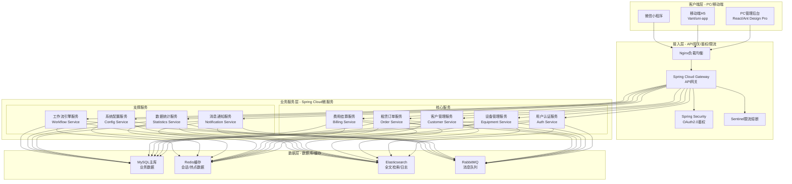
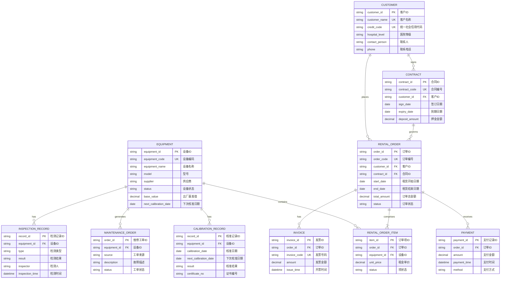
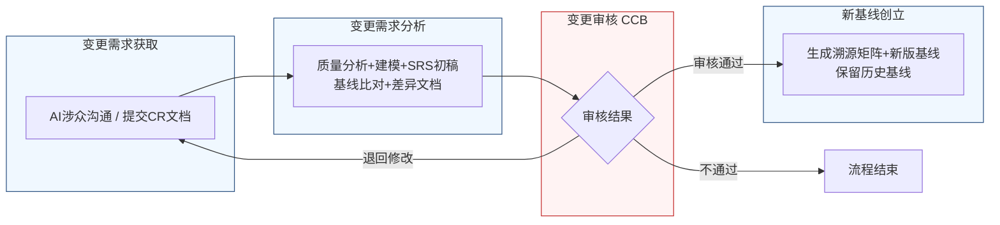

好的，作为一名资深需求分析工程师，我将严格遵循IEEE 830标准和GB/T 9385规范，并采用“精确优先于流畅”的原则，为您生成这份完整的软件需求规格说明书（SRS）。

---

# 文档头部信息

| 项目项 | 内容 |
| ---- | ---- |
| 文档名称 | 软件需求规格说明书（SRS）|
| 项目名称 | 医疗器械租赁管理系统 |
| 项目编号 | MED-RENTAL-2026 |
| 文档版本 | V1.0.0 |
| 基线版本 | BL-20260626-01 |
| 编制人 | AI基线智能体（A6） |
| 编制日期 | 2026-06-26 |
| 审核人 | CCB变更控制委员会 |
| 批准人 | CCB变更控制委员会 |
| 密级 | 内部 |

## 修订历史记录
| 版本号 | 修订日期 | 修订类型 | 修订内容简述 |
| :--- | :--- | :--- | :--- |
| V1.0.0 | 2026-06-26 | 新建 | 文档初稿，确立初始需求基线 |

# 1 引言

## 1.1 编制目的
本软件需求规格说明书（SRS）旨在全面、精确地定义“医疗器械租赁管理系统”的功能、性能、外部接口及非功能性需求。本文档的编制目的是：
1.  **建立共识**：在客户、最终用户、项目管理者、开发团队和测试团队之间建立一个对系统应交付内容的共同、无歧义的理解。
2.  **指导设计**：为后续的系统设计、架构设计、数据库设计提供精确的输入和约束。
3.  **作为验收依据**：为系统最终验收测试提供可量化、可追溯的验收标准。
4.  **管理变更**：作为需求基线，为后续的需求变更管理提供基准和追溯依据。

## 1.2 文档范围（包含/排除）
**包含范围：**
本SRS覆盖“医疗器械租赁管理系统”的以下核心业务模块：
1.  **用户认证与权限管理**：包括用户登录、角色定义、权限分配。
2.  **设备管理**：覆盖设备全生命周期，包括设备档案、入库、出库、归还、校准、维修、报废等流程。
3.  **客户管理**：包括客户信息、联系人、合同、信用评级等。
4.  **租赁订单管理**：包括订单创建、审核、执行、变更、终止等。
5.  **费用结算**：包括租金计算、押金管理、扣款、发票、对账等。
6.  **数据统计**：提供设备、客户、订单、财务等多维度的统计报表。
7.  **系统配置**：包括字典管理、流程配置、预警规则配置等。

**排除范围：**
本SRS不包含以下内容：
1.  与医院HIS（医院信息系统）、ERP（企业资源计划）等外部系统的具体接口开发细节，仅定义接口需求。
2.  硬件设备（如扫码枪、RFID读写器）的选型与采购。
3.  系统的部署、运维和灾备方案。
4.  用户界面（UI）的详细视觉设计（如颜色、字体、图标），仅定义交互逻辑和布局约束。

## 1.3 引用文件
1.  GB/T 9385-2008《计算机软件需求规格说明规范》
2.  IEEE Std 830-1998《IEEE Recommended Practice for Software Requirements Specifications》
3.  《高级软件设计实践》教材书稿
4.  医疗器械租赁管理系统涉众需求调研记录（raw/notes/）
5.  医疗器械租赁管理系统UML建模产物
6.  医疗器械租赁管理系统结构化需求清单

## 1.4 术语与缩略语
| 术语/缩略语 | 定义 |
| :--- | :--- |
| SRS | 软件需求规格说明书（Software Requirements Specification） |
| CCB | 变更控制委员会（Change Control Board） |
| CR | 变更请求（Change Request） |
| FR | 功能需求（Functional Requirement） |
| NFR | 非功能需求（Non-Functional Requirement） |
| IFR | 外部接口需求（Interface Requirement） |
| P0/P1/P2 | 需求优先级：P0（必须实现）、P1（重要）、P2（次要） |
| 校准 | 指对医疗设备进行计量检定或校准，以确保其测量值的准确性和可靠性。 |
| 锁库 | 指系统强制禁止某设备进行出库操作的状态。 |
| 梯次预警 | 指在事件发生前，按照多个时间节点（如30天、15天、7天）发送不同级别的预警通知。 |
| 出厂基准值 | 指设备出厂时，由制造商设定的各项关键性能指标的标称值或标准值。 |
| 关键项/非关键项 | 指在设备检测清单中，根据对设备性能和患者安全影响程度划分的检测项目。关键项必须全检，非关键项可抽检。 |

## 1.5 业务背景概述
**现状痛点：**
当前医疗器械租赁业务主要依赖线下Excel和纸质单据管理，存在以下痛点：
1.  **设备校准管理混乱**：无法实时监控所有设备（特别是已出租设备）的校准状态，导致校准过期设备被误用，存在合规风险。
2.  **出/入库流程不规范**：设备归还检测标准不一，缺乏与出厂基准值的自动比对，问题设备可能重新入库。出库检测抽检比例固定，缺乏灵活性。
3.  **紧急出库流程风险高**：校准过期设备的紧急出库缺乏受控的审批流程，责任划分不清，存在“带病出库”风险。
4.  **信息孤岛**：业务、库房、运维、财务等各部门信息不透明，协同效率低。

**建设目标：**
建设一套统一的医疗器械租赁管理系统，实现设备全生命周期的数字化、流程化、合规化管理。

**量化业务目标：**
1.  **校准预警覆盖率**：系统上线后，对所有在库、在途、已出租设备的校准预警覆盖率达到100%。
2.  **校准过期设备出库率**：因校准过期导致的设备出库事件降低90%以上。
3.  **归还检测标准化率**：100%的归还检测使用与入库检测一致的标准化模板。
4.  **紧急出库审批线上化率**：100%的紧急出库申请通过系统线上审批流程完成。
5.  **数据统计效率**：生成月度设备利用率、订单完成率等核心报表的时间从2天缩短至1小时内。

# 2 总体描述

## 2.1 产品概述（系统定位、核心价值）
**系统定位：**
本系统是一套面向医疗器械租赁公司的企业级业务管理平台，旨在通过信息化手段，对设备从采购入库到报废处置的全生命周期进行精细化、合规化管理。

**核心价值：**
1.  **合规风控**：通过强制的校准预警、锁库和受控的紧急出库流程，有效降低合规风险。
2.  **流程闭环**：打通业务、库房、运维、财务等环节，实现从订单到结算的端到端流程闭环。
3.  **数据驱动**：提供多维度的数据统计与分析，为管理决策提供数据支持。
4.  **效率提升**：通过标准化流程、自动预警和移动化操作，提升各岗位工作效率。

### 系统架构图（Mermaid代码）

## 2.2 运行环境要求
| 环境类别 | 具体要求 |
| :--- | :--- |
| **服务器硬件** | CPU: 8核及以上；内存: 32GB及以上；硬盘: SSD 500GB及以上；网络: 千兆以太网。 |
| **服务器软件** | 操作系统: CentOS 7.9 或 Ubuntu 20.04 LTS；应用服务器: JDK 11；数据库: MySQL 8.0；缓存: Redis 6.x；搜索引擎: Elasticsearch 7.x；消息队列: RabbitMQ 3.x。 |
| **客户端硬件** | PC: CPU i5及以上，内存8GB及以上；移动端: 支持iOS 13+ / Android 10+。 |
| **浏览器兼容性** | PC端: Chrome 90+，Firefox 90+，Edge 90+；移动端: 微信内置浏览器（最新版），手机自带浏览器（最新版）。 |

## 2.3 用户角色与特征
| 角色 | 职责描述 | 核心权限 | 使用频次 | 技能特征 |
| :--- | :--- | :--- | :--- | :--- |
| **招商业务员** | 负责客户开发、合同签订、订单跟进、设备归还初检。 | 创建/查看订单、发起归还初检、查看设备状态、发起紧急出库申请。 | 每日多次 | 熟悉业务流程，具备基本电脑操作能力。 |
| **库房人员** | 负责设备入库、出库、盘点、校准管理、库房复核。 | 执行入库/出库检测、执行库房复核、管理库位、查看校准预警。 | 每日多次 | 熟悉库房作业流程，具备基本电脑操作能力。 |
| **运维工程师** | 负责设备维修、保养、校准记录管理、设备状态监控。 | 查看/编辑设备档案、管理校准记录、处理维修工单、配置检测模板。 | 每日多次 | 具备设备运维专业知识，熟悉系统操作。 |
| **质控部门** | 负责设备质量检查、校准合规审核、紧急出库质量审批。 | 审批紧急出库申请、审核校准记录、查看设备质量报告。 | 每日数次 | 具备质量管理专业知识。 |
| **科室主任** | 负责临床需求确认、紧急出库最终审批。 | 审批紧急出库申请。 | 每日数次 | 具备临床管理经验。 |
| **财务审核员** | 负责高价值设备紧急出库的财务审批、费用结算审核。 | 审批特定条件下的紧急出库申请、审核费用结算。 | 每日数次 | 具备财务专业知识。 |
| **系统管理员** | 负责系统配置、用户管理、权限分配、数据维护。 | 所有系统配置权限、用户管理权限、数据字典维护。 | 每周数次 | 具备IT系统管理经验。 |

## 2.4 系统运行模式
| 运行模式 | 描述 | 触发条件 |
| :--- | :--- | :--- |
| **正常模式** | 系统所有功能正常运行，所有用户可正常访问和操作。 | 默认状态。 |
| **异常模式** | 系统部分功能受限或不可用，如数据库连接失败、第三方服务超时。系统应降级处理，保证核心业务（如设备出库）的可用性。 | 检测到关键服务（如数据库、核心微服务）故障。 |
| **维护模式** | 系统计划内停机维护，所有用户无法访问。系统应提前通知用户。 | 系统管理员发起计划内维护。 |

## 2.5 设计与实现约束
1.  **技术约束**：系统必须采用微服务架构（Spring Cloud），前后端分离。前端使用React或Vue框架，后端使用Java语言。
2.  **合规约束**：系统必须符合《医疗器械监督管理条例》等相关法规对设备追溯、校准管理的要求。所有操作日志必须保留至少3年。
3.  **接口约束**：系统所有对外接口必须采用RESTful API设计规范，数据交换格式为JSON。
4.  **工期约束**：系统核心功能（设备管理、租赁订单、费用结算）必须在合同签订后6个月内完成开发并上线试运行。

## 2.6 假设与依赖
1.  **假设**：假设所有用户均具备基本的电脑和移动设备操作能力。
2.  **依赖**：本系统的正常运行依赖于稳定的网络环境、服务器硬件和基础软件（数据库、缓存等）的可用性。设备出厂基准值数据由供应商提供，系统负责导入和管理。

# 3 具体需求

## 3.1 功能需求（FR）
按7个模块分节：用户认证、设备管理、客户管理、租赁订单、费用结算、数据统计、系统配置。

### 3.1.1 用户认证模块

**FR-AUTH-001**：用户登录
- **优先级**：P0
- **参与角色**：所有角色
- **前置条件**：用户已注册并激活账号。
- **触发方式**：用户在登录页面输入用户名、密码和验证码，点击“登录”按钮。
- **业务流程**：
    1.  系统接收用户输入的用户名、密码和验证码。
    2.  系统校验验证码是否正确。
    3.  系统校验用户名和密码是否匹配。
    4.  校验通过后，系统生成JWT Token并返回给客户端。
    5.  客户端将Token存储在本地（如localStorage）。
- **业务规则**：
    1.  密码输入错误连续5次，账号将被锁定30分钟。
    2.  Token有效期为8小时，过期后需重新登录。
    3.  同一账号不允许同时在5个以上设备登录。
- **后置状态**：用户成功登录系统，进入首页。
- **验收标准**：
    1.  输入正确的用户名、密码和验证码，点击登录，1秒内成功跳转到首页。
    2.  输入错误的密码4次，第5次输入正确密码，登录失败，提示“账号已被锁定，请30分钟后重试”。
    3.  输入错误的验证码，登录失败，提示“验证码错误”。
- **关联需求条目**：无。

### 3.1.2 设备管理模块

**FR-EQP-001**：设备校准预警
- **优先级**：P0
- **参与角色**：招商业务员、库房人员、运维工程师
- **前置条件**：设备档案中已录入校准有效期。
- **触发方式**：系统定时任务（每日凌晨02:00）自动扫描所有设备校准状态。
- **业务流程**：
    1.  系统扫描所有状态为“在库”、“出库在途”、“待验收”、“已出租”的设备。
    2.  对于校准到期前30天的设备，系统向相关角色（设备管理员、库房主管）发送“30天预警”通知。
    3.  对于校准到期前15天的设备，系统向相关角色发送“15天预警”通知。
    4.  对于校准到期前7天的设备，系统向相关角色发送“7天预警”通知，并自动将设备状态标记为“禁止出库”。
    5.  对于校准到期前3天的设备，系统自动将设备状态标记为“强制锁库”。
- **业务规则**：
    1.  预警通知方式包括：系统站内信、邮件、企业微信/钉钉消息。
    2.  “禁止出库”状态：设备无法被选择用于新的出库单，但已出库设备不受影响。
    3.  “强制锁库”状态：设备无法进行任何出库操作，包括紧急出库（需先走紧急审批流程）。
    4.  预警覆盖的设备状态包括：“在库”、“出库在途”、“待验收”、“已出租”。
- **后置状态**：系统根据设备校准到期时间，更新设备状态（正常/禁止出库/强制锁库），并发送相应预警通知。
- **验收标准**：
    1.  创建一个校准有效期为2026-06-26的设备。在2026-06-26（到期前30天）凌晨02:00后，相关角色应收到“30天预警”通知。
    2.  在2026-06-26（到期前7天）凌晨02:00后，该设备状态应变为“禁止出库”。
    3.  在2026-06-26（到期前3天）凌晨02:00后，该设备状态应变为“强制锁库”。
- **关联需求条目**：BR-EQP-001, BR-EQP-003, BR-EQP-006

**FR-EQP-002**：紧急出库审批
- **优先级**：P0
- **参与角色**：招商业务员、库房主管、质控部门、科室主任、财务审核员
- **前置条件**：设备处于“强制锁库”状态。
- **触发方式**：招商业务员在设备详情页点击“发起紧急出库申请”按钮。
- **业务流程**：
    1.  招商业务员填写紧急出库申请单，说明紧急原因、临床需求、预计归还时间等。
    2.  系统判断设备价值。若设备价值 > 高价值阈值（系统配置项，默认值为50万元），则触发财务审核节点。
    3.  **审批流程（固定顺序）**：
        a.  **库房主管审批**：确认库存信息，判断是否可出库。
        b.  **质控部门审批**：评估设备质量风险，判断是否可出库。
        c.  **科室主任审批**：确认临床需求的紧急性和必要性。
        d.  **（条件性）财务审核员审批**：仅当设备价值 > 高价值阈值时触发，评估财务风险。
    4.  任一环节审批不通过，流程终止，设备保持“强制锁库”状态。
    5.  所有环节审批通过后，系统自动解除该设备的“强制锁库”状态，允许出库。
- **业务规则**：
    1.  审批顺序固定为：库房主管 → 质控部门 → 科室主任 → （条件性）财务审核员。
    2.  每个审批环节需在24小时内完成，超时自动流转至下一环节（或通知上级）。
    3.  紧急出库的设备，归还时必须进行强制检测。
- **后置状态**：设备状态由“强制锁库”变为“可出库”，或申请被拒绝，设备保持“强制锁库”。
- **验收标准**：
    1.  对一个价值60万元（>50万阈值）的锁库设备发起紧急出库申请。审批流程应依次为：库房主管 → 质控部门 → 科室主任 → 财务审核员。
    2.  对一个价值30万元（<=50万阈值）的锁库设备发起紧急出库申请。审批流程应依次为：库房主管 → 质控部门 → 科室主任。
    3.  库房主管拒绝申请后，流程终止，设备状态不变。
- **关联需求条目**：BR-EQP-002, BR-EQP-007, BR-EQP-012, BR-EQP-013, BR-EQP-014

**FR-EQP-003**：设备归还检测
- **优先级**：P0
- **参与角色**：招商业务员、库房人员、运维工程师
- **前置条件**：设备已从客户处收回，状态为“待归还检测”。
- **触发方式**：招商业务员在设备归还页面点击“开始初检”按钮。
- **业务流程**：
    1.  **业务员初检**：
        a.  系统加载与入库检测完全一致的标准化检查清单和模板。
        b.  业务员逐项检查设备，并录入检测结果。
        c.  系统自动将关键指标（如传感器灵敏度）与设备档案中的出厂基准值进行比对。
        d.  若指标偏差超出预设阈值（系统配置项，默认值为5%），系统自动生成维修工单，并触发分级预警（通知业务员和运维工程师）。
        e.  业务员提交初检结果。
    2.  **系统校验**：
        a.  系统检查初检结果是否完整（所有必填项已填写）。
        b.  若结果不完整，退回给业务员补充。
    3.  **库房复核**：
        a.  初检结果完整后，系统开放库房复核界面。
        b.  库房人员执行复核，再次检查设备。
        c.  若复核结果与初检结果一致，且设备状态正常，执行入库操作。
        d.  若复核结果与初检结果不一致，标记为“复核异常”，通知业务员和运维工程师。
        e.  若设备状态异常（如需要维修），标记为“待维修”。
- **业务规则**：
    1.  归还检测清单必须与入库检测清单使用同一标准模板。
    2.  业务员初检是库房复核的前置条件，库房人员无法跳过初检直接复核。
    3.  关键指标偏差阈值可在系统配置中调整。
- **后置状态**：设备状态更新为“在库”、“待维修”或“复核异常”。
- **验收标准**：
    1.  业务员对一台设备进行归还初检，未填写“传感器灵敏度”必填项，点击提交，系统提示“请填写所有必填项”，无法提交。
    2.  业务员初检时，录入的传感器灵敏度为98%，出厂基准值为100%，偏差为2%（小于5%阈值），系统不触发预警。
    3.  业务员初检时，录入的传感器灵敏度为94%，出厂基准值为100%，偏差为6%（大于5%阈值），系统自动生成维修工单，并通知业务员和运维工程师。
- **关联需求条目**：BR-EQP-004, BR-EQP-005, BR-EQP-008, BR-EQP-009, BR-EQP-010

**FR-EQP-004**：设备出库检测
- **优先级**：P1
- **参与角色**：库房人员
- **前置条件**：设备状态为“在库”，且已分配到出库单。
- **触发方式**：库房人员在出库单详情页点击“开始出库检测”按钮。
- **业务流程**：
    1.  系统获取出库设备信息，并根据设备类型和供应商质量等级，确定抽检比例。
    2.  若抽检比例 > 0%，系统随机选择待检设备。
    3.  库房人员执行出库检测。
        a.  对于检测项中的“关键项”，必须全检。
        b.  对于“非关键项”，按系统确定的抽检比例执行。
    4.  库房人员录入检测结果。
    5.  系统判断所有检测项是否通过。
        a.  若全部通过，标记设备为“可出库”。
        b.  若有失败项：
            i.  若失败项为关键项，标记设备为“不可出库”，并生成维修工单。
            ii. 若失败项为非关键项，标记设备为“待评估”，并通知运维工程师。
- **业务规则**：
    1.  非关键项默认抽检比例为50%。
    2.  系统管理员可根据设备类型、供应商质量等级等条件动态调整抽检比例。
- **后置状态**：设备状态更新为“可出库”、“不可出库”或“待评估”。
- **验收标准**：
    1.  对一台设备进行出库检测，检测清单包含5个关键项和10个非关键项。系统应强制要求检查所有5个关键项，并随机抽取5个（50%）非关键项进行检查。
    2.  若一个关键项检测失败，系统应标记设备为“不可出库”，并生成维修工单。
- **关联需求条目**：BR-EQP-011

**FR-EQP-005**：设备入库检测
- **优先级**：P1
- **参与角色**：库房人员
- **前置条件**：新采购设备到货或设备归还后状态为“待入库”。
- **触发方式**：库房人员在设备入库页面点击“开始入库检测”按钮。
- **业务流程**：
    1.  系统加载标准化检查清单和模板。
    2.  库房人员逐项检查设备，并录入检测结果。
    3.  系统自动将关键指标与出厂基准值进行比对。
    4.  若指标偏差超出预设阈值，系统生成预警。
    5.  库房人员提交检测结果。
    6.  系统校验结果完整性。
    7.  校验通过后，设备入库。
- **业务规则**：
    1.  入库检测模板是出库检测和归还检测模板的基础（include关系）。
    2.  入库检测必须全检所有项目。
- **后置状态**：设备状态更新为“在库”。
- **验收标准**：
    1.  对一台新设备进行入库检测，所有检测项均需填写，无法跳过。
- **关联需求条目**：BR-EQP-004, BR-EQP-009

**FR-EQP-006**：设备档案管理
- **优先级**：P0
- **参与角色**：运维工程师、系统管理员
- **前置条件**：用户具有设备档案管理权限。
- **触发方式**：用户在设备管理模块点击“新增设备”或“编辑设备”。
- **业务流程**：
    1.  用户填写设备基本信息（设备编码、名称、型号、供应商、出厂编号、出厂日期等）。
    2.  用户录入设备技术参数（关键指标、出厂基准值等）。
    3.  用户上传设备相关附件（说明书、合格证、校准证书等）。
    4.  用户保存设备档案。
- **业务规则**：
    1.  设备编码为系统自动生成，规则为“EQP”+年月日+4位流水号（如EQP202606260001）。
    2.  出厂基准值一旦录入，修改需审批。
- **后置状态**：设备档案创建或更新成功。
- **验收标准**：
    1.  新增设备时，不填写“设备名称”，点击保存，系统提示“设备名称不能为空”。
    2.  设备编码由系统自动生成，格式正确。
- **关联需求条目**：BR-EQP-009

### 系统用例图（PlantUML代码）

```plantuml
@startuml
' Actor定义
actor "招商业务员" as biz
actor "库房人员" as store
actor "运维工程师" as ops
actor "质控部门" as qc
actor "科室主任" as dept_head
actor "财务审核员" as finance
actor "系统管理员" as admin

' 用例定义
usecase (UC1: 设备校准预警) as UC1
usecase (UC2: 紧急出库审批) as UC2
usecase (UC3: 设备归还检测) as UC3
usecase (UC4: 设备出库检测) as UC4
usecase (UC5: 设备入库检测) as UC5
usecase (UC6: 校准到期锁库) as UC6
usecase (UC7: 设备状态监控) as UC7
usecase (UC8: 设备校准记录管理) as UC8
usecase (UC9: 设备档案管理) as UC9
usecase (UC10: 用户登录) as UC10
usecase (UC11: 客户信息管理) as UC11
usecase (UC12: 租赁订单管理) as UC12
usecase (UC13: 费用结算管理) as UC13
usecase (UC14: 数据统计分析) as UC14
usecase (UC15: 系统配置管理) as UC15

' Actor与用例关联
biz --> UC1
biz --> UC2
biz --> UC3
biz --> UC7
biz --> UC10
biz --> UC11
biz --> UC12

store --> UC1
store --> UC3
store --> UC4
store --> UC5
store --> UC6
store --> UC7
store --> UC10

ops --> UC1
ops --> UC3
ops --> UC4
ops --> UC5
ops --> UC6
ops --> UC7
ops --> UC8
ops --> UC9
ops --> UC10

qc --> UC2
qc --> UC3
qc --> UC6
qc --> UC10

dept_head --> UC2
dept_head --> UC10

finance --> UC2 : 高价值设备场景
finance --> UC10
finance --> UC13

admin --> UC9
admin --> UC10
admin --> UC15

' Include关系
UC3 ..> UC5 : <<include>>\n复用入库检测模板
UC4 ..> UC5 : <<include>>\n复用入库检测模板

' Extend关系
UC2 ..> UC6 : <<extend>>\n校准到期触发
UC3 ..> UC1 : <<extend>>\n检测异常触发预警

' 注解
note right of UC1
  合并自BR-EQP-001/003/006
  覆盖全状态设备校准预警
end note

note right of UC2
  合并自BR-EQP-002/007/012/013/014
  三级审批流程：库房主管→质控部门→科室主任
  条件性触发财务审核
end note

note right of UC3
  合并自BR-EQP-004/005/008/009/010
  强制业务员初检→库房复核流程
  自动比对出厂基准值
end note

note right of UC4
  合并自BR-EQP-011
  非关键项默认50%抽检
  支持动态调整
end note

note right of UC5
  标准化检测模板
  作为UC3和UC4的include基础
end note

note right of UC6
  实现7天禁止出库/3天强制锁库
  作为UC2的extend触发条件
end note

note right of UC7
  实时监控设备状态
  覆盖在库/出库在途/待验收/已出租状态
end note

note right of UC8
  校准记录管理
  支持梯次预警配置
end note

note right of UC9
  设备全生命周期档案
  包含校准状态信息
end note

@enduml
```

### 3.1.3 客户管理模块

**FR-CUST-001**：客户信息管理
- **优先级**：P0
- **参与角色**：招商业务员
- **前置条件**：用户具有客户管理权限。
- **触发方式**：用户在客户管理模块点击“新增客户”或“编辑客户”。
- **业务流程**：
    1.  用户填写客户基本信息（客户名称、统一社会信用代码、医院等级、科室、联系人、联系方式等）。
    2.  用户上传客户相关附件（营业执照、合作协议等）。
    3.  用户保存客户信息。
- **业务规则**：
    1.  统一社会信用代码为必填项，且需校验格式。
    2.  同一客户名称不允许重复。
- **后置状态**：客户信息创建或更新成功。
- **验收标准**：
    1.  新增客户时，输入已存在的客户名称，点击保存，系统提示“客户名称已存在”。
- **关联需求条目**：无。

### 3.1.4 租赁订单模块

**FR-ORDER-001**：租赁订单创建
- **优先级**：P0
- **参与角色**：招商业务员
- **前置条件**：客户信息已存在，设备状态为“在库”。
- **触发方式**：用户在订单管理模块点击“新建订单”。
- **业务流程**：
    1.  用户选择客户。
    2.  用户选择租赁设备（支持多选，但设备状态必须为“在库”且未被锁定）。
    3.  用户填写租赁信息（租赁开始日期、租赁结束日期、租赁数量、租金单价等）。
    4.  系统自动计算订单总金额。
    5.  用户提交订单。
- **业务规则**：
    1.  租赁开始日期不能早于当前日期。
    2.  租赁结束日期必须晚于租赁开始日期。
    3.  选择的设备数量不能超过可用库存。
- **后置状态**：订单状态为“待审核”。
- **验收标准**：
    1.  选择一台状态为“强制锁库”的设备，点击提交，系统提示“设备【设备编码】当前状态不可出库”。
- **关联需求条目**：BR-EQP-006

### 3.1.5 费用结算模块

**FR-BILL-001**：租金计算
- **优先级**：P0
- **参与角色**：系统（自动）
- **前置条件**：订单状态为“已出库”。
- **触发方式**：系统定时任务（每日凌晨03:00）自动执行。
- **业务流程**：
    1.  系统扫描所有状态为“已出库”且未结束的订单。
    2.  根据订单的租金单价和租赁周期，计算每日应计租金。
    3.  将每日租金记录到费用明细表中。
- **业务规则**：
    1.  租金计算周期为自然日。
    2.  若设备提前归还，租金计算至归还日。
- **后置状态**：费用明细表更新。
- **验收标准**：
    1.  创建一个订单，租金单价为100元/天，租赁周期为2026-06-26至2026-06-26。系统应在每日凌晨03:00自动生成100元的租金记录。
- **关联需求条目**：无。

### 3.1.6 数据统计模块

**FR-STAT-001**：设备利用率统计
- **优先级**：P1
- **参与角色**：所有角色
- **前置条件**：无。
- **触发方式**：用户在统计报表页面选择“设备利用率”报表。
- **业务流程**：
    1.  用户选择统计时间范围（如本月、本季度、自定义）。
    2.  系统根据设备出库记录和租赁周期，计算指定时间范围内设备的利用率。
    3.  系统以图表和表格形式展示统计结果。
- **业务规则**：
    1.  设备利用率 = （设备在租总天数 / 统计周期总天数）* 100%。
- **后置状态**：展示统计报表。
- **验收标准**：
    1.  选择统计周期为2026年7月，系统应正确计算并展示该月所有设备的利用率。
- **关联需求条目**：无。

### 3.1.7 系统配置模块

**FR-CONFIG-001**：预警规则配置
- **优先级**：P1
- **参与角色**：系统管理员
- **前置条件**：用户具有系统配置权限。
- **触发方式**：用户在系统配置页面选择“预警规则配置”。
- **业务流程**：
    1.  用户可配置校准预警的各个时间节点（如30天、15天、7天、3天）。
    2.  用户可配置预警通知方式（站内信、邮件、企业微信）。
    3.  用户保存配置。
- **业务规则**：
    1.  时间节点必须为正整数，单位为天。
- **后置状态**：预警规则更新成功。
- **验收标准**：
    1.  将“7天预警”时间节点修改为“10天”，保存后，设备校准到期前10天应触发“禁止出库”状态。
- **关联需求条目**：BR-EQP-003, BR-EQP-006

## 3.2 外部接口需求（IFR）

**IFR-001**：短信/邮件通知接口
- **接口描述**：系统需调用第三方短信和邮件服务，向用户发送预警和通知。
- **协议**：HTTP/HTTPS
- **数据格式**：JSON
- **接口规范**：由第三方服务商提供。

**IFR-002**：企业微信/钉钉消息接口
- **接口描述**：系统需调用企业微信或钉钉的API，向用户发送工作通知。
- **协议**：HTTP/HTTPS
- **数据格式**：JSON
- **接口规范**：由企业微信/钉钉官方提供。

### E-R图（Mermaid erDiagram）

### 数据字典（表格）
| 表名 | 字段名 | 类型 | 主键 | 外键 | 默认值 | 说明 |
| :--- | :--- | :--- | :--- | :--- | :--- | :--- |
| EQUIPMENT | equipment_id | VARCHAR(32) | Y | N | 无 | 设备ID，UUID |
| EQUIPMENT | equipment_code | VARCHAR(32) | N | N | 无 | 设备编码，唯一索引 |
| EQUIPMENT | equipment_name | VARCHAR(100) | N | N | 无 | 设备名称 |
| EQUIPMENT | status | VARCHAR(20) | N | N | '在库' | 设备状态：在库/出库在途/待验收/已出租/待维修/强制锁库等 |
| EQUIPMENT | next_calibration_date | DATE | N | N | 无 | 下次校准日期 |
| CUSTOMER | customer_id | VARCHAR(32) | Y | N | 无 | 客户ID，UUID |
| CUSTOMER | customer_name | VARCHAR(100) | N | N | 无 | 客户名称，唯一索引 |
| RENTAL_ORDER | order_id | VARCHAR(32) | Y | N | 无 | 订单ID，UUID |
| RENTAL_ORDER | customer_id | VARCHAR(32) | N | Y | 无 | 外键，关联CUSTOMER表 |
| RENTAL_ORDER | total_amount | DECIMAL(12,2) | N | N | 0.00 | 订单总金额 |
| RENTAL_ORDER_ITEM | item_id | VARCHAR(32) | Y | N | 无 | 订单项ID，UUID |
| RENTAL_ORDER_ITEM | order_id | VARCHAR(32) | N | Y | 无 | 外键，关联RENTAL_ORDER表 |
| RENTAL_ORDER_ITEM | equipment_id | VARCHAR(32) | N | Y | 无 | 外键，关联EQUIPMENT表 |
| CONTRACT | contract_id | VARCHAR(32) | Y | N | 无 | 合同ID，UUID |
| CONTRACT | customer_id | VARCHAR(32) | N | Y | 无 | 外键，关联CUSTOMER表 |
| CONTRACT | deposit_amount | DECIMAL(12,2) | N | N | 0.00 | 押金金额 |

## 3.3 非功能需求（NFR）

### 3.3.1 性能需求
| 需求编号 | 需求描述 | 验收标准 |
| :--- | :--- | :--- |
| NFR-NFR-PERF-001 | 页面加载时间：在标准网络环境下（带宽10Mbps），所有页面首次加载时间不超过3秒。 | 使用性能测试工具（如JMeter）模拟10个并发用户，测试所有核心页面，平均加载时间 <= 3秒。 |
| NFR-NFR-PERF-002 | 接口响应时间：90%的API接口响应时间不超过500毫秒。 | 使用性能测试工具，对核心API（如设备查询、订单创建）进行压力测试，90%的请求响应时间 <= 500ms。 |
| NFR-NFR-PERF-003 | 并发用户数：系统应支持至少200个用户同时在线操作。 | 使用性能测试工具，模拟200个并发用户执行核心业务操作（如查询、创建订单），系统无崩溃，响应时间满足NFR-NFR-PERF-002要求。 |
| NFR-NFR-PERF-004 | 定时任务执行时间：每日凌晨的校准预警扫描任务，应在10分钟内完成对10万台设备的扫描和状态更新。 | 在测试环境中，模拟10万台设备数据，执行定时任务，记录完成时间 <= 10分钟。 |

### 3.3.2 可靠性需求
| 需求编号 | 需求描述 | 验收标准 |
| :--- | :--- | :--- |
| NFR-NFR-REL-001 | 系统可用率：系统在7x24小时运行期间，年度可用率不低于99.9%。 | 全年计划外停机时间累计不超过8.76小时。 |
| NFR-NFR-REL-002 | 连续运行：系统应能连续运行7天无需重启。 | 系统连续运行7天后，各项功能正常，无内存泄漏、无性能衰减。 |
| NFR-NFR-REL-003 | 故障恢复：当系统发生故障时，应在30分钟内恢复服务。 | 模拟数据库宕机，从故障发生到系统恢复服务，时间 <= 30分钟。 |

### 3.3.3 安全性需求
| 需求编号 | 需求描述 | 验收标准 |
| :--- | :--- | :--- |
| NFR-NFR-SEC-001 | 用户认证：所有用户必须通过用户名/密码+验证码的方式登录系统。 | 未登录用户无法访问任何需要认证的页面或API。 |
| NFR-NFR-SEC-002 | 权限控制：系统必须实现基于角色的访问控制（RBAC），不同角色只能访问其权限范围内的功能和数据。 | 库房人员无法访问财务结算模块。 |
| NFR-NFR-SEC-003 | 数据加密：所有用户的密码在数据库中必须使用bcrypt或SHA-256加盐哈希存储。 | 数据库中密码字段存储的是密文，而非明文。 |
| NFR-NFR-SEC-004 | 传输加密：所有客户端与服务器之间的通信必须使用HTTPS协议。 | 使用Wireshark抓包，无法解析HTTP明文内容。 |
| NFR-NFR-SEC-005 | 操作审计：所有关键操作（如登录、创建订单、修改设备状态、审批）必须记录操作日志，日志保留至少3年。 | 执行一次设备出库操作，在审计日志中能查到该操作的详细记录（操作人、时间、IP、操作内容）。 |

### 3.3.4 可维护性需求
| 需求编号 | 需求描述 | 验收标准 |
| :--- | :--- | :--- |
| NFR-NFR-MAINT-001 | 日志系统：系统应提供统一的日志收集和分析接口（如集成ELK）。 | 系统日志能通过Kibana进行集中查询和分析。 |
| NFR-NFR-MAINT-002 | 模块化设计：系统应采用微服务架构，各服务可独立部署、升级和回滚。 | 升级设备管理服务时，不影响用户认证服务和租赁订单服务的正常运行。 |

### 3.3.5 可扩展性需求
| 需求编号 | 需求描述 | 验收标准 |
| :--- | :--- | :--- |
| NFR-EXT-001 | 水平扩展：核心业务服务（如设备管理、订单服务）应支持水平扩展，通过增加实例数量来提升系统处理能力。 | 将设备管理服务的实例从2个扩展到4个，系统处理能力（TPS）应线性增长。 |
| NFR-EXT-002 | 业务扩展：系统应支持通过配置或插件方式，在不修改核心代码的情况下，增加新的设备类型或检测模板。 | 系统管理员可通过后台配置，新增一个“呼吸机”设备类型及其对应的检测模板，无需开发人员介入。 |

### 3.3.6 易用性需求
| 需求编号 | 需求描述 | 验收标准 |
| :--- | :--- | :--- |
| NFR-UX-001 | 操作反馈：用户进行任何操作（如点击按钮、提交表单）后，系统应在1秒内给出明确的操作结果反馈（成功/失败/处理中）。 | 点击“保存”按钮，按钮变为“保存中...”状态，并在1秒内显示“保存成功”或“保存失败”的提示。 |
| NFR-UX-002 | 错误提示：系统所有错误提示应使用用户能理解的语言，明确指出错误原因和修正方法。 | 当用户输入错误的日期格式时，提示“日期格式错误，请输入YYYY-MM-DD格式的日期”，而非“系统错误”。 |

## 3.4 数据需求

### 数据字典（完整表格）
（已在3.2节中提供核心实体的数据字典示例，此处不再重复。完整数据字典应包含所有表的所有字段，作为独立文档附录。）

### 数据管理策略
| 策略项 | 描述 |
| :--- | :--- |
| **备份策略** | 每日凌晨进行全量数据库备份，保留最近7天的备份。每周进行一次全量备份，保留最近4周的备份。每月进行一次全量备份，保留最近12个月的备份。 |
| **归档策略** | 超过3年的操作日志和超过5年的历史订单数据，将从主数据库中归档到冷存储（如低成本云存储或磁带库）。 |
| **数据留存** | 核心业务数据（设备、客户、合同）永久保留。操作日志保留至少3年。费用明细保留至少10年。 |

# 4 需求基线与变更管理

## 4.1 需求基线定义
1.  **基线版本格式**：`BL-YYYYMMDD-NN`（YYYYMMDD=日期，NN=当日流水号）。
2.  **初始基线**：本SRS文档（V1.0.0）经CCB审批通过后，即成为初始基线，基线编号为`BL-20260626-01`。
3.  **基线冻结**：基线发布后，禁止任何个人或团队无流程私自修改需求。所有变更必须遵循4.2节定义的变更流程。

## 4.2 需求变更整体流程

## 4.3 变更详细流程（四阶段）
### 4.3.1 阶段一：变更需求获取
两种途径：涉众AI智能体沟通 / 需求提出方提交正式CR变更需求文档。

### 4.3.2 阶段二：变更需求分析（4个子阶段）
1.  **需求质量分析**：校验变更需求合理性、完整性、无歧义。
2.  **项目建模**：更新UML用例图、活动图。
3.  **SRS初稿生成**：整合输出变更版SRS初稿。
4.  **基线比对**：读取历史基线，生成需求差异文档。

### 4.3.3 阶段三：变更审核（CCB评审）
1.  审核不通过 → 流程终止。
2.  审核退回修改 → 返回变更需求获取阶段。
3.  审核通过 → 进入新基线创立环节。

### 4.3.4 阶段四：新基线创立
1.  生成需求溯源矩阵（RTM），建立变更前后条目映射。
2.  将审核通过的SRS定为新版正式基线。
3.  沿用版本规则生成新基线编号。
4.  历史基线文档完整归档、不覆盖、不删除。

## 4.4 变更记录台账
| 变更编号 | 变更日期 | 申请人 | 变更来源(AI/CR) | 变更简述 | 影响模块 | CCB结论 | 新版基线号 |
| :--- | :--- | :--- | :--- | :--- | :--- | :--- | :--- |
| — | — | — | 初始基线 | 初始基线，无历史变更 | — | 通过 | BL-20260626-01 |

# 5 附录

## 附录A 全量图表汇总
- **系统架构图**：见 §2.1
- **系统用例图**：见 §3.1
- **E-R图**：见 §3.2
- **变更流程图**：见 §4.2

## 附录B 验收标准总表
| 需求编号 | 需求名称 | 验收标准 | 优先级 |
| :--- | :--- | :--- | :--- |
| FR-EQP-001 | 设备校准预警 | 1. 校准到期前30天，相关角色收到“30天预警”通知。2. 校准到期前7天，设备状态变为“禁止出库”。3. 校准到期前3天，设备状态变为“强制锁库”。 | P0 |
| FR-EQP-002 | 紧急出库审批 | 1. 对价值>50万的锁库设备发起申请，审批流程为：库房主管→质控部门→科室主任→财务审核员。2. 任一环节拒绝，流程终止。3. 全部通过后，设备解除锁库。 | P0 |
| FR-EQP-003 | 设备归还检测 | 1. 业务员初检未填写必填项，无法提交。2. 关键指标偏差>5%，自动生成维修工单。3. 初检完成后，库房人员才能进行复核。 | P0 |
| NFR-NFR-PERF-001 | 页面加载时间 | 核心页面首次加载时间不超过3秒。 | P0 |
| NFR-NFR-SEC-001 | 用户认证 | 未登录用户无法访问任何需要认证的资源。 | P0 |

## 附录C 参考资料与外部文档链接
1.  GB/T 9385-2008 计算机软件需求规格说明规范
2.  IEEE 830 软件需求规格说明书标准
3.  《高级软件设计实践》教材书稿
4.  医疗器械租赁管理系统涉众需求调研记录（raw/notes/）
5.  医疗器械租赁管理系统UML建模产物
6.  医疗器械租赁管理系统结构化需求清单