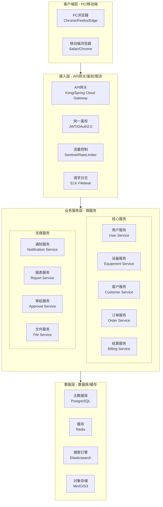
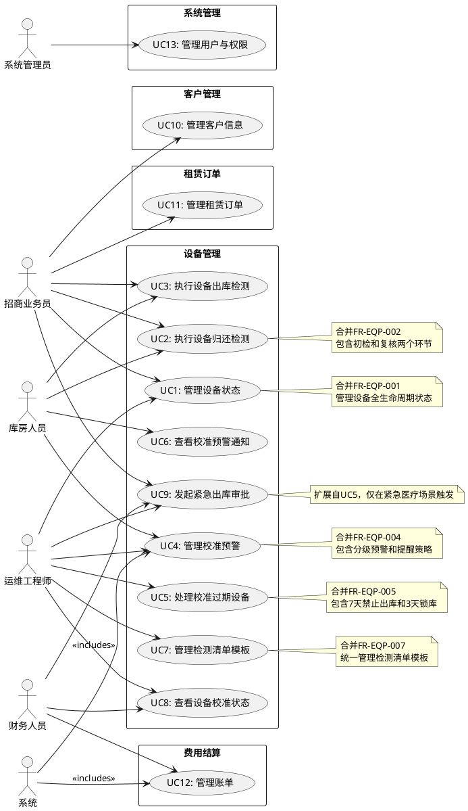
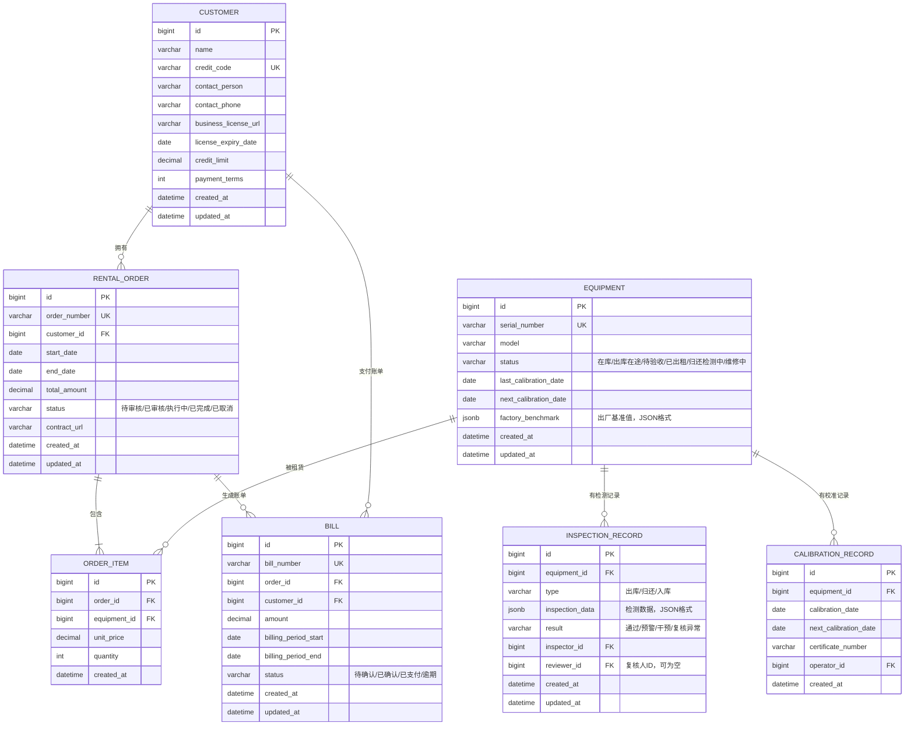
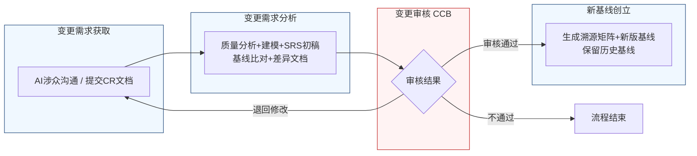

好的，作为一名资深需求分析工程师，我将严格遵循您的指示，采用两阶段法，并恪守“精确优先于流畅”的铁律，生成这份完整的软件需求规格说明书（SRS）。

---

# 软件需求规格说明书（SRS）

| 项目项 | 内容 |
| ---- | ---- |
| 文档名称 | 软件需求规格说明书（SRS）|
| 项目名称 | 医疗器械租赁管理系统 |
| 项目编号 | MED-RENTAL-2026 |
| 文档版本 | V1.0.0 |
| 基线版本 | BL-20260626-01 |
| 编制人 | AI基线智能体（A6） |
| 编制日期 | 2026-06-26 |
| 审核人 | CCB变更控制委员会 |
| 批准人 | CCB变更控制委员会 |
| 密级 | 内部 |

## 修订历史记录
| 版本号 | 修订日期 | 修订类型 | 修订内容简述 |
| V1.0.0 | 2026-06-26 | 新建 | 文档初稿，确立初始需求基线 |

# 1 引言

## 1.1 编制目的
本软件需求规格说明书（SRS）旨在为“医疗器械租赁管理系统”（项目编号：MED-RENTAL-2026）的开发、测试、验收及后续维护提供一份完整、精确、无歧义的需求基线。本文档详细定义了系统的功能需求、非功能需求、外部接口需求及数据需求，是项目团队（包括产品经理、架构师、开发工程师、测试工程师、运维工程师）以及所有相关涉众（包括招商业务员、库房人员、运维工程师、财务人员）之间达成共识的唯一依据。本文档的最终目标是确保系统能够满足业务需求，提升设备管理效率，降低运营风险。

## 1.2 文档范围
**包含：**
*   设备全生命周期管理（状态定义、校准预警、归还/出库检测）。
*   租赁订单管理（订单创建、执行、变更、关闭）。
*   客户管理（客户信息、合同、信用）。
*   费用结算（租金计算、账单生成、支付、发票）。
*   用户认证与权限管理。
*   数据统计与报表。
*   系统配置与管理。

**排除：**
*   硬件设备的物理维修操作流程（系统仅记录维修状态和结果，不控制维修过程）。
*   与第三方财务系统（如金蝶、用友）的深度集成（仅提供标准数据导出接口）。
*   移动端APP的原生开发（本版本仅支持响应式Web界面）。
*   与GPS或物联网设备（IoT）的直接硬件通信协议（系统通过API接收第三方平台推送的设备状态数据）。

## 1.3 引用文件
1.  **GB/T 9385-2008**：计算机软件需求规格说明规范。
2.  **IEEE Std 830-1998**：IEEE Recommended Practice for Software Requirements Specifications。
3.  **《高级软件设计实践》教材**：作为需求分析和建模的方法论指导。
4.  **医疗器械租赁管理系统涉众需求调研记录**：`raw/notes/招商业务员-20260626-1613-需求记录.md`， `raw/notes/库房人员-20260626-1613-需求记录.md`， `raw/notes/运维工程师-20260626-1613-需求记录.md`。
5.  **医疗器械租赁管理系统UML建模产物**：包含用例图、活动图、状态图。
6.  **医疗器械租赁管理系统结构化需求清单**：包含所有BR-EQP-XXX条目。

## 1.4 术语与缩略语
| 术语/缩略语 | 定义 |
| ---- | ---- |
| **SRS** | 软件需求规格说明书 |
| **CCB** | 变更控制委员会，负责审批需求变更 |
| **CR** | 变更请求 |
| **FR** | 功能需求 |
| **NFR** | 非功能需求 |
| **BR** | 业务需求 |
| **UR** | 用户需求 |
| **P0** | 最高优先级，必须实现，否则系统无法上线 |
| **P1** | 重要优先级，核心功能，必须在本版本实现 |
| **P2** | 次要优先级，可在后续版本实现 |
| **RTM** | 需求追溯矩阵 |
| **API** | 应用程序编程接口 |
| **RESTful** | 一种软件架构风格，用于设计网络应用程序 |
| **JWT** | JSON Web Token，用于身份认证 |
| **RBAC** | 基于角色的访问控制 |
| **SLA** | 服务等级协议 |
| **QPS** | 每秒查询数 |
| **TPS** | 每秒事务数 |

## 1.5 业务背景概述
**现状痛点：**
当前医疗器械租赁业务依赖线下表格和人工经验管理，存在以下核心痛点：
1.  **设备校准状态失控**：设备在“出库在途”和“待验收”等中间状态时，其校准状态无法被系统有效监控，存在校准过期风险，可能导致客户现场设备无法使用或产生合规问题。
2.  **归还检测流程不规范**：设备归还检测缺乏标准化流程和清单，依赖个人经验，检测结果主观性强，易引发与客户的责任纠纷。检测数据无法与出厂基准值自动比对，难以快速识别性能偏差。
3.  **预警机制不完善**：校准预警机制单一，要么信息过载（每天提醒），要么提醒不及时（仅到期前提醒），无法满足不同角色（如库房人员按周规划、业务员按关键节点处理）的工作习惯。
4.  **紧急情况处理僵化**：对校准过期设备实施“一刀切”的锁库策略，缺乏针对紧急医疗场景的受控审批通道，可能影响紧急订单的交付。

**建设目标：**
建设一套覆盖设备全生命周期的、流程驱动的医疗器械租赁管理系统，实现以下量化业务目标：
*   **设备校准过期率降低90%**：通过全状态覆盖和分级预警，将因管理疏忽导致的校准过期事件降至最低。
*   **归还检测效率提升50%**：通过标准化模板和自动比对，将单台设备的归还检测时间从平均30分钟缩短至15分钟。
*   **责任纠纷减少80%**：通过双人复核和与出厂基准值的自动比对，为设备状态提供客观、可追溯的证据链。
*   **紧急订单响应时间缩短至2小时内**：通过受控的紧急出库审批流程，确保在合规前提下快速响应紧急医疗需求。

# 2 总体描述

## 2.1 产品概述
**系统定位：** 本系统是一套面向医疗器械租赁企业的业务运营管理平台，旨在通过数字化手段，实现设备从采购入库、租赁出库、客户使用、归还检测到报废处置的全生命周期闭环管理。

**核心价值：**
1.  **风险前置管控**：通过将校准预警覆盖到“出库在途”和“待验收”状态，实现风险前置管理，避免设备带病出库。
2.  **流程标准化与自动化**：通过标准化的检测清单、自动化的数据比对和分级预警，提升业务效率和准确性。
3.  **数据驱动决策**：通过设备状态、校准记录、检测数据的集中管理，为设备运维、采购和租赁策略提供数据支持。
4.  **合规与安全**：通过强制性的双人复核、锁库机制和受控的紧急审批通道，确保业务操作符合医疗器械管理规范。

### 系统架构图（Mermaid代码）

## 2.2 运行环境要求
| 环境类别 | 具体要求 |
| ---- | ---- |
| **硬件** | **服务器**：最低配置 8核CPU，32GB RAM，500GB SSD。推荐配置 16核CPU，64GB RAM，1TB SSD。 |
| | **客户端**：CPU i5或同等性能以上，8GB RAM。 |
| **软件** | **操作系统**：服务器端 CentOS 7.9+ / Ubuntu 20.04+；客户端 Windows 10+ / macOS 11+。 |
| | **数据库**：PostgreSQL 14.0+。 |
| | **缓存**：Redis 6.0+。 |
| | **应用服务器**：JDK 11+ / Node.js 16+。 |
| **浏览器兼容** | **必须支持**：Google Chrome 90+，Mozilla Firefox 90+，Microsoft Edge 90+。 |
| | **建议支持**：Apple Safari 14+。 |
| | **不保证支持**：Internet Explorer 11及以下版本。 |

## 2.3 用户角色与特征
| 角色 | 职责 | 核心权限 | 使用频次 | 技能要求 |
| ---- | ---- | ---- | ---- | ---- |
| **招商业务员** | 负责设备租赁业务的拓展、合同签订、设备出库/归还的初检、客户关系维护。 | 创建/编辑订单、发起设备出库/归还检测（初检）、查看设备状态、发起紧急出库审批。 | 每日多次 | 熟悉租赁业务流程，具备基础计算机操作能力。 |
| **库房人员** | 负责设备的入库、存储、盘点、出库/归还的复核检测、校准预警处理。 | 执行设备入库/出库/归还复核、管理库存、查看/处理校准预警、管理检测模板。 | 每日多次 | 熟悉库房管理流程，具备设备检测技能。 |
| **运维工程师** | 负责设备的技术状态评估、维修、校准计划制定、检测标准制定。 | 管理设备技术参数（如出厂基准值）、定义检测模板、配置校准预警规则、处理锁库设备、审批紧急出库。 | 每日一次 | 具备医疗器械技术知识，熟悉设备运维流程。 |
| **财务人员** | 负责租金计算、账单生成、收款核销、发票管理、成本核算。 | 查看/生成账单、核销付款、开具发票、查看财务报表、发起紧急出库审批（财务相关）。 | 每日一次 | 熟悉财务流程，具备财务软件操作经验。 |
| **系统管理员** | 负责系统配置、用户管理、权限分配、日志审计。 | 所有系统管理功能，包括用户、角色、权限、配置项管理。 | 按需 | 具备系统管理经验，熟悉RBAC模型。 |

## 2.4 系统运行模式
| 运行模式 | 描述 | 触发条件 |
| ---- | ---- | ---- |
| **正常模式** | 系统所有功能正常运行，所有用户可按照权限执行操作。 | 系统启动后，无异常事件发生。 |
| **异常模式** | 系统部分功能受限或不可用，例如数据库连接失败、第三方服务不可用。系统应降级运行，保证核心功能（如设备查询、订单查看）可用。 | 检测到关键依赖服务（如数据库、缓存）响应超时或返回错误。 |
| **维护模式** | 系统计划内停机，进行版本升级、数据库迁移等操作。所有用户无法访问系统，前端显示维护公告页面。 | 管理员手动开启，并设置预计维护时长。 |

## 2.5 设计与实现约束
| 约束类型 | 具体内容 |
| ---- | ---- |
| **技术约束** | 1. 后端必须采用微服务架构，使用Java (Spring Boot) 或 Go语言开发。 2. 前端必须采用前后端分离的单页应用（SPA）架构，使用Vue.js或React框架。 3. 所有API必须遵循RESTful设计规范。 4. 数据库必须使用PostgreSQL，缓存必须使用Redis。 |
| **合规约束** | 1. 系统必须符合《医疗器械监督管理条例》及相关法规对设备追溯和状态管理的要求。 2. 用户密码必须加密存储（如bcrypt），敏感数据（如客户联系方式）在传输和存储时必须加密（如AES-256）。 3. 系统必须提供完整的操作审计日志，记录所有关键数据的增、删、改操作，日志保留时间不少于180天。 |
| **接口约束** | 1. 与外部系统（如短信网关、邮件服务器）的集成必须通过标准API，并具备熔断和重试机制。 2. 系统必须提供标准的数据导出接口（如CSV、Excel），供第三方系统（如财务系统）使用。 |
| **工期约束** | 1. 核心功能（设备管理、订单管理、校准预警）必须在项目启动后3个月内完成开发和内部测试。 2. 系统整体上线时间不得晚于项目启动后6个月。 |

## 2.6 假设与依赖
1.  **假设**：所有涉众（招商业务员、库房人员、运维工程师）均具备基础的计算机操作能力，并愿意接受新系统的培训。
2.  **假设**：设备出厂基准值数据可由供应商提供，或由运维工程师在系统上线初期手动录入。
3.  **依赖**：系统依赖于稳定可靠的网络环境、服务器硬件和数据库服务。
4.  **依赖**：短信和邮件通知服务的可用性依赖于第三方服务提供商（如阿里云短信、SendGrid）的SLA。

# 3 具体需求

## 3.1 功能需求（FR）

### 3.1.1 用户认证模块

**FR-AUTH-001：用户登录**
- **优先级**：P0
- **参与角色**：所有用户
- **前置条件**：用户账号已在系统中创建并激活。
- **触发方式**：用户在登录页面输入用户名和密码，点击“登录”按钮。
- **业务流程**：
    1.  系统接收用户名和密码。
    2.  系统校验用户名是否存在。
    3.  系统校验密码是否正确（使用bcrypt算法比对哈希值）。
    4.  校验通过后，系统生成一个JWT Token，有效期为8小时。
    5.  系统将Token返回给前端，前端存储在localStorage或cookie中。
    6.  系统记录登录日志（用户名、IP地址、登录时间）。
- **业务规则**：
    1.  密码输入错误连续5次，该账号将被锁定30分钟。
    2.  Token过期后，用户需重新登录。
    3.  同一账号不允许同时在超过2个设备上登录。
- **后置状态**：用户进入系统首页，获得其角色对应的菜单和功能权限。
- **验收标准**：
    1.  使用正确的用户名和密码登录，系统应在2秒内返回成功响应并跳转至首页。
    2.  使用错误的密码登录，系统应提示“用户名或密码错误”。
    3.  连续输入5次错误密码，系统应提示“账号已被锁定，请30分钟后重试”。
    4.  Token过期后，访问任何需要认证的API，系统应返回401状态码。
- **关联需求条目**：无

**FR-AUTH-002：用户登出**
- **优先级**：P0
- **参与角色**：所有用户
- **前置条件**：用户已登录。
- **触发方式**：用户点击系统界面上的“登出”按钮。
- **业务流程**：
    1.  前端清除本地存储的JWT Token。
    2.  前端重定向至登录页面。
    3.  （可选）前端调用后端API，将当前Token加入黑名单，使其立即失效。
- **业务规则**：无
- **后置状态**：用户返回登录页面，无法访问任何需要认证的资源。
- **验收标准**：
    1.  点击“登出”后，页面立即跳转至登录页。
    2.  使用已登出的Token访问API，系统应返回401状态码。
- **关联需求条目**：无

### 3.1.2 设备管理模块

**FR-EQP-001：管理设备状态**
- **优先级**：P0
- **参与角色**：招商业务员， 运维工程师
- **前置条件**：设备信息已录入系统。
- **触发方式**：系统根据设备流转事件（如出库、送达、验收、归还）自动触发状态变更。
- **业务流程**：
    1.  设备出库时，系统将设备状态从“在库”更新为“出库在途”。
    2.  设备送达客户并完成安装验收确认后，系统将设备状态从“出库在途”更新为“已出租”。
    3.  设备归还时，系统将设备状态从“已出租”更新为“归还检测中”。
    4.  归还检测通过后，系统将设备状态从“归还检测中”更新为“待入库”。
    5.  库房人员确认入库后，系统将设备状态从“待入库”更新为“在库”。
- **业务规则**：
    1.  设备状态流转必须遵循预定义的状态机，不允许跳跃或逆向操作（除特殊审批外）。
    2.  “出库在途”和“待验收”是独立且必须的状态，不能与“已出租”状态混淆。
    3.  系统必须记录每一次状态变更的时间、操作人和变更原因。
- **后置状态**：设备状态更新，触发相应的后续流程（如校准预警计时启动/停止）。
- **验收标准**：
    1.  设备出库后，在设备详情页查看其状态，应显示为“出库在途”。
    2.  客户验收确认后，设备状态应自动变为“已出租”。
    3.  系统状态变更日志中，应能查到每一次状态变更的详细记录。
- **关联需求条目**：BR-EQP-001， BR-EQP-008， BR-EQP-015

**FR-EQP-002：执行设备归还检测**
- **优先级**：P0
- **参与角色**：招商业务员， 库房人员
- **前置条件**：设备状态为“已出租”，且已发起归还流程。
- **触发方式**：招商业务员在系统上为指定设备发起“归还检测”。
- **业务流程**：
    1.  **初检（业务员）**：
        a. 系统加载该设备对应的“归还检测”标准化检查清单模板。
        b. 业务员逐项填写检测结果（数值或选项）。
        c. 业务员提交初检结果。
    2.  **系统自动比对**：
        a. 系统将业务员录入的检测数据与设备出厂基准值进行自动比对。
        b. 若偏差超过“干预阈值”，系统强制锁定设备，不允许入库，并自动跳转至维修流程。流程终止。
        c. 若偏差超过“预警阈值”但未超过“干预阈值”，系统生成一条观察记录，允许入库。
        d. 若偏差未超过任何阈值，流程继续。
    3.  **复核（库房人员）**：
        a. 系统在业务员提交初检结果后，开启库房人员的复核界面。
        b. 库房人员执行复核检测，并录入结果。
        c. 系统比对初检和复核结果。
        d. 若结果一致，系统记录最终检测结果，更新设备状态为“待入库”。
        e. 若结果不一致，系统标记为“复核异常”，并通知业务代表和运维工程师。
- **业务规则**：
    1.  归还检测必须使用与入库检测完全一致的标准化检查清单模板。
    2.  初检和复核必须由不同角色（业务员和库房人员）完成，形成双人复核机制。
    3.  库房人员的复核界面仅在业务员提交初检结果后才可开启。
    4.  “预警阈值”和“干预阈值”由运维工程师在系统配置中定义，可针对不同设备型号设置不同阈值。
- **后置状态**：设备状态变为“待入库”或“维修中”（若触发干预阈值），或“复核异常”。
- **验收标准**：
    1.  业务员发起归还检测，系统能正确加载对应的检查清单。
    2.  业务员提交初检后，库房人员能看到复核入口。
    3.  若初检数据偏差超过干预阈值，系统应弹窗提示“设备性能严重偏差，已锁定并转入维修流程”，且设备状态变为“维修中”。
    4.  若初检与复核结果不一致，系统应生成一条“复核异常”记录，并通知相关人员。
- **关联需求条目**：BR-EQP-002， BR-EQP-004， BR-EQP-005， BR-EQP-009， BR-EQP-011， BR-EQP-016， BR-EQP-019

**FR-EQP-003：执行设备出库检测**
- **优先级**：P0
- **参与角色**：招商业务员， 库房人员
- **前置条件**：设备状态为“在库”，且已关联一个待执行的租赁订单。
- **触发方式**：招商业务员在订单详情页为指定设备发起“出库检测”。
- **业务流程**：
    1.  系统加载该设备对应的“出库检测”标准化检查清单模板。
    2.  库房人员执行检测并录入结果。
    3.  系统自动比对检测数据与设备出厂基准值。
    4.  若所有检测项均符合标准，系统允许设备出库。
    5.  若存在偏差，系统根据偏差等级（预警/干预）进行提示或阻止出库。
- **业务规则**：
    1.  出库检测清单与归还检测清单不同，由运维工程师分别配置。
    2.  出库检测只需库房人员一人完成，无需双人复核。
    3.  若设备校准状态为“禁止出库”或“锁库”，则无法发起出库检测。
- **后置状态**：设备状态变为“出库在途”。
- **验收标准**：
    1.  为待出库设备发起出库检测，系统能正确加载“出库检测”清单。
    2.  所有检测项通过后，系统允许出库，设备状态变更为“出库在途”。
    3.  若设备处于“禁止出库”状态，系统应提示“该设备校准即将过期，已被禁止出库”。
- **关联需求条目**：BR-EQP-003， BR-EQP-011

**FR-EQP-004：管理校准预警**
- **优先级**：P0
- **参与角色**：库房人员， 运维工程师
- **前置条件**：设备已录入系统，并设置了校准有效期。
- **触发方式**：系统每日凌晨2:00自动执行一次全量设备校准状态检查。
- **业务流程**：
    1.  系统遍历所有设备（包括“在库”、“出库在途”、“待验收”、“已出租”状态）。
    2.  对于“出库在途”和“待验收”状态的设备，系统仅发送非强制性提醒通知。
    3.  对于其他状态设备，系统根据距离校准到期日的天数，执行以下操作：
        a.  **到期前30天**：系统向相关责任人（库房人员、运维工程师）发送“到期前30天提醒”通知。
        b.  **到期前15天**：系统向相关责任人发送“到期前15天提醒”通知。
        c.  **到期前7天**：系统向相关责任人发送“到期前7天提醒”通知，并**禁止该设备出库**。
        d.  **到期前3天**：系统向相关责任人发送“到期前3天锁库提醒”通知，并**强制锁库**，冻结设备库存。
    4.  系统每周一上午9:00向库房人员和运维工程师推送一份“临期设备清单”，包含未来30天内所有校准到期的设备。
- **业务规则**：
    1.  “禁止出库”和“锁库”是两级管控，分别对应到期前7天和3天。
    2.  “锁库”后，设备无法被任何订单关联或出库，除非通过“紧急出库审批”流程。
    3.  非强制性提醒仅作为信息告知，不触发任何业务限制。
    4.  通知方式包括系统内消息、邮件和短信（短信仅用于关键节点如锁库）。
- **后置状态**：系统生成预警记录，更新设备状态（如适用），发送通知。
- **验收标准**：
    1.  创建一个校准日期为30天后的设备，系统应在第二天发送“到期前30天提醒”。
    2.  当设备距离校准到期日≤7天时，尝试为该设备创建出库单，系统应提示“该设备已被禁止出库”。
    3.  当设备距离校准到期日≤3天时，该设备在库存列表中应显示为“已锁库”状态，无法被选择。
    4.  每周一上午9:00，相关用户应收到一份包含未来30天到期设备的清单通知。
- **关联需求条目**：BR-EQP-001， BR-EQP-003， BR-EQP-006， BR-EQP-008， BR-EQP-012， BR-EQP-014， BR-EQP-017， BR-EQP-021

**FR-EQP-005：处理校准过期设备**
- **优先级**：P0
- **参与角色**：运维工程师
- **前置条件**：设备已因校准到期而被“锁库”。
- **触发方式**：运维工程师在设备管理界面查看并处理锁库设备。
- **业务流程**：
    1.  运维工程师查看锁库设备列表。
    2.  运维工程师安排设备校准。
    3.  校准完成后，运维工程师在系统中更新设备的校准有效期。
    4.  系统自动解除设备的“锁库”状态，恢复为“在库”。
- **业务规则**：
    1.  只有运维工程师有权更新设备的校准有效期。
    2.  更新校准有效期后，系统必须记录新的有效期和操作人。
- **后置状态**：设备“锁库”状态解除，恢复正常可用。
- **验收标准**：
    1.  运维工程师更新校准有效期后，该设备在库存列表中不再显示为“已锁库”。
    2.  系统日志中记录了本次校准有效期更新操作。
- **关联需求条目**：BR-EQP-003， BR-EQP-010

**FR-EQP-006：查看校准预警通知**
- **优先级**：P1
- **参与角色**：库房人员
- **前置条件**：系统已生成校准预警通知。
- **触发方式**：用户登录系统后，在通知中心查看。
- **业务流程**：
    1.  用户点击系统界面上的“通知”图标。
    2.  系统展示所有未读和已读的通知列表。
    3.  用户可点击单条通知查看详情。
    4.  用户可标记通知为“已读”。
- **业务规则**：
    1.  通知按时间倒序排列。
    2.  未读通知有醒目标记（如红点）。
- **后置状态**：用户查看并处理了通知。
- **验收标准**：
    1.  用户登录后，能看到未读通知的红点标记。
    2.  点击通知列表中的一条，能跳转到对应的设备详情或预警处理页面。
- **关联需求条目**：BR-EQP-006

**FR-EQP-007：管理检测清单模板**
- **优先级**：P1
- **参与角色**：运维工程师
- **前置条件**：用户具有“检测模板管理”权限。
- **触发方式**：运维工程师进入“系统配置-检测模板”菜单。
- **业务流程**：
    1.  运维工程师可以创建、编辑、删除检测清单模板。
    2.  创建模板时，需指定模板名称、适用设备型号、检测类型（出库/归还/入库）。
    3.  为模板添加检测项，每个检测项需定义：检测项名称、数据类型（数值/布尔/选项）、单位、预警阈值、干预阈值、是否必填。
    4.  保存模板后，系统将其与指定设备型号关联。
- **业务规则**：
    1.  一个设备型号可以有多个不同类型的检测模板（出库、归还、入库）。
    2.  删除模板时，需确认是否有历史检测记录关联，若有则禁止删除，仅可标记为“停用”。
- **后置状态**：检测模板被创建、更新或停用。
- **验收标准**：
    1.  运维工程师可以成功创建一个包含多个检测项的“归还检测”模板。
    2.  将该模板关联到某个设备型号后，对该型号设备发起归还检测，系统能正确加载该模板。
- **关联需求条目**：BR-EQP-011， BR-EQP-016， BR-EQP-018， BR-EQP-019

**FR-EQP-008：查看设备校准状态**
- **优先级**：P1
- **参与角色**：运维工程师， 财务人员
- **前置条件**：设备信息已录入系统。
- **触发方式**：用户在设备列表或详情页查看。
- **业务流程**：
    1.  用户在设备列表页，可以看到每台设备的校准状态（正常/即将到期/已过期/已锁库）。
    2.  用户点击设备，进入详情页，可以查看详细的校准历史记录，包括每次校准的日期、有效期、操作人。
- **业务规则**：
    1.  设备列表页的校准状态应通过颜色或图标进行可视化区分（如绿色=正常，黄色=即将到期，红色=已过期）。
- **后置状态**：用户获取了设备校准状态信息。
- **验收标准**：
    1.  在设备列表页，每台设备旁都有清晰的校准状态标识。
    2.  点击设备，在详情页能看到完整的校准历史时间线。
- **关联需求条目**：BR-EQP-001

**FR-EQP-009：发起紧急出库审批**
- **优先级**：P1
- **参与角色**：招商业务员， 财务人员
- **前置条件**：设备因校准过期或其他原因处于“锁库”状态。
- **触发方式**：招商业务员在订单出库环节，选择被锁库的设备时，系统提示“该设备已锁库，是否发起紧急出库审批？”。
- **业务流程**：
    1.  业务员点击“发起紧急出库审批”。
    2.  系统要求业务员填写紧急出库原因（必须选择“紧急医疗场景”或其他，并填写详细说明）。
    3.  系统要求业务员强制承诺“已知晓设备校准已过期，并承诺在客户现场使用期间承担相应风险”。
    4.  系统发起双重审批流程：
        a.  第一重审批：运维工程师审批，确认设备技术风险可控。
        b.  第二重审批：财务人员审批，确认相关费用和风险已评估。
    5.  若双重审批均通过，系统允许该设备临时出库，并记录审批信息。
    6.  若任一审批不通过，系统拒绝出库请求。
- **业务规则**：
    1.  紧急出库审批仅适用于“锁库”状态的设备。
    2.  审批流程必须包含“强制承诺”环节，且承诺内容需用户手动勾选确认。
    3.  每次紧急出库都必须记录，包括申请人、审批人、原因、承诺内容、出库时间。
- **后置状态**：设备被允许临时出库，或请求被拒绝。
- **验收标准**：
    1.  为锁库设备发起紧急出库，系统能正确引导用户填写原因和进行强制承诺。
    2.  双重审批通过后，该设备可以被正常出库。
    3.  审批不通过时，系统提示“紧急出库审批未通过”。
- **关联需求条目**：BR-EQP-010

### 3.1.3 客户管理模块

**FR-CUST-001：创建客户信息**
- **优先级**：P0
- **参与角色**：招商业务员
- **前置条件**：用户具有“客户管理”权限。
- **触发方式**：用户在客户管理页面点击“新增客户”按钮。
- **业务流程**：
    1.  用户填写客户基本信息（名称、统一社会信用代码、联系人、联系电话、地址等）。
    2.  用户填写客户资质信息（如医疗器械经营许可证号及有效期）。
    3.  用户填写客户信用信息（如信用额度、账期）。
    4.  用户点击“保存”。
- **业务规则**：
    1.  统一社会信用代码必须唯一，系统需校验其格式。
    2.  客户资质信息中的许可证有效期，系统应提供预警功能（到期前30天提醒）。
- **后置状态**：系统中新增一个客户记录。
- **验收标准**：
    1.  填写完整信息并保存后，在客户列表中可以查到该客户。
    2.  尝试创建一个已存在的统一社会信用代码的客户，系统应提示“该客户已存在”。
- **关联需求条目**：无

### 3.1.4 租赁订单模块

**FR-ORD-001：创建租赁订单**
- **优先级**：P0
- **参与角色**：招商业务员
- **前置条件**：客户信息已存在。
- **触发方式**：用户在订单管理页面点击“新建订单”按钮。
- **业务流程**：
    1.  用户选择客户。
    2.  用户选择租赁设备（可从库存中选择未被锁库且校准状态正常的设备）。
    3.  用户填写租赁期限（起止日期）、租金单价、数量。
    4.  系统自动计算订单总金额。
    5.  用户上传合同附件。
    6.  用户点击“提交”。
- **业务规则**：
    1.  选择的设备必须在租赁期内可用，不能与其他订单冲突。
    2.  订单提交后，状态为“待审核”。
- **后置状态**：生成一个状态为“待审核”的租赁订单。
- **验收标准**：
    1.  成功创建一个包含设备和租赁期限的订单。
    2.  订单详情页显示正确的总金额。
- **关联需求条目**：无

### 3.1.5 费用结算模块

**FR-BILL-001：生成租金账单**
- **优先级**：P0
- **参与角色**：系统
- **前置条件**：订单状态为“执行中”。
- **触发方式**：系统每月1日凌晨3:00自动执行。
- **业务流程**：
    1.  系统遍历所有“执行中”的订单。
    2.  根据订单的租金单价和租赁天数，计算当月应计租金。
    3.  为每个订单生成一条月度账单记录。
    4.  账单状态为“待确认”。
- **业务规则**：
    1.  若订单在月中开始或结束，租金按实际天数计算（日租金 = 月租金 / 当月天数）。
- **后置状态**：生成月度租金账单。
- **验收标准**：
    1.  每月1日，所有执行中的订单都生成了对应的月度账单。
    2.  账单金额计算正确。
- **关联需求条目**：无

### 3.1.6 数据统计模块

**FR-STAT-001：查看设备利用率报表**
- **优先级**：P2
- **参与角色**：招商业务员， 运维工程师
- **前置条件**：系统中有设备租赁数据。
- **触发方式**：用户进入“数据统计-设备利用率”页面。
- **业务流程**：
    1.  用户选择统计时间范围（如本月、本季度、自定义）。
    2.  系统展示设备利用率图表（如柱状图、折线图）。
    3.  图表展示总设备数、在租设备数、空闲设备数及利用率百分比。
- **业务规则**：
    1.  利用率 = 在租设备数 / 总设备数 * 100%。
- **后置状态**：用户获取设备利用率统计信息。
- **验收标准**：
    1.  选择时间范围后，图表能正确展示设备利用率数据。
- **关联需求条目**：无

### 3.1.7 系统配置模块

**FR-CFG-001：用户与权限管理**
- **优先级**：P0
- **参与角色**：系统管理员
- **前置条件**：用户已登录且具有管理员权限。
- **触发方式**：管理员进入“系统管理-用户管理”菜单。
- **业务流程**：
    1.  管理员可以创建、编辑、启用/禁用用户账号。
    2.  管理员可以为用户分配角色（如招商业务员、库房人员）。
    3.  管理员可以创建、编辑角色，并为角色分配具体的功能权限（如“设备管理-查看”、“订单管理-创建”）。
- **业务规则**：
    1.  权限控制基于RBAC模型，粒度到按钮级别。
- **后置状态**：用户账号和权限配置被更新。
- **验收标准**：
    1.  创建一个新用户并分配“库房人员”角色，该用户登录后只能看到库房相关的菜单和功能。
    2.  修改角色的权限后，属于该角色的所有用户的权限立即生效。
- **关联需求条目**：无

### 系统用例图（PlantUML代码）

## 3.2 外部接口需求（IFR）

**IFR-001：短信通知接口**
- **描述**：系统需调用第三方短信网关（如阿里云短信）发送关键通知（如锁库提醒）。
- **输入**：接收方手机号、短信模板ID、模板参数（如设备编号、到期日期）。
- **输出**：短信发送结果（成功/失败）。
- **协议**：HTTPS， RESTful API。
- **频率**：每日发送量不超过1000条。

**IFR-002：邮件通知接口**
- **描述**：系统需调用邮件服务器（如SMTP服务）发送非关键通知（如周报、到期提醒）。
- **输入**：接收方邮箱地址、邮件主题、邮件正文（HTML格式）。
- **输出**：邮件发送结果（成功/失败）。
- **协议**：SMTP协议。
- **频率**：每日发送量不超过5000封。

**IFR-003：数据导出接口**
- **描述**：系统需提供标准接口，供第三方系统（如财务系统）拉取账单、订单等数据。
- **输入**：查询参数（如时间范围、数据类型）。
- **输出**：CSV或Excel格式的文件流。
- **协议**：HTTPS， RESTful API。
- **认证**：API Key或JWT Token。

## 3.3 非功能需求（NFR）

### 3.3.1 性能需求
| 需求项 | 指标 | 测量方法 |
| ---- | ---- | ---- |
| **页面加载时间** | 90%的页面加载时间不超过2秒。 | 使用Lighthouse或WebPageTest工具，模拟100Mbps带宽。 |
| **接口响应时间** | 90%的API接口响应时间不超过500毫秒。 | 使用JMeter或Postman，模拟100并发用户。 |
| **并发用户数** | 系统应支持至少200个用户同时在线操作。 | 使用JMeter进行压力测试，持续运行30分钟。 |
| **吞吐量** | 核心业务接口（如创建设备、提交检测）的TPS不低于50。 | 使用JMeter进行压力测试。 |
| **报表生成时间** | 90%的月度报表生成时间不超过30秒。 | 模拟生成包含1000条订单数据的报表。 |

### 3.3.2 可靠性需求
| 需求项 | 指标 |
| ---- | ---- |
| **系统可用率** | 系统在正常工作时间（7x24小时）内的可用率不低于99.9%（每月停机时间不超过43分钟）。 |
| **连续运行时间** | 系统应能连续运行7天无需重启。 |
| **故障恢复时间** | 发生非硬件故障时，系统应在30分钟内恢复服务。 |
| **数据备份** | 数据库每日全量备份，每4小时增量备份。 |

### 3.3.3 安全性需求
| 需求项 | 要求 |
| ---- | ---- |
| **用户认证** | 必须使用JWT Token进行无状态认证，Token有效期8小时。 |
| **权限控制** | 必须实现基于RBAC的细粒度权限控制，确保用户只能访问其授权资源。 |
| **数据加密** | 用户密码使用bcrypt加密存储；敏感数据（如客户联系方式）在数据库中加密存储（AES-256）；所有数据传输使用HTTPS。 |
| **攻击防护** | 系统应具备防SQL注入、XSS、CSRF攻击的能力。 |
| **操作审计** | 所有关键数据的增、删、改操作必须记录审计日志，日志保留180天。 |

### 3.3.4 可维护性需求
1.  系统日志必须分级（DEBUG， INFO， WARN， ERROR），并支持通过日志中心（如ELK）进行集中管理和检索。
2.  系统配置（如预警阈值、检测模板）应支持在线修改，无需重启服务即可生效。
3.  代码应遵循统一的编码规范，并提供详细的API文档（如Swagger）。

### 3.3.5 可扩展性需求
1.  业务服务层采用微服务架构，支持对核心服务（如设备服务、订单服务）进行独立水平扩展。
2.  数据库应支持读写分离，以应对未来数据量的增长。

### 3.3.6 易用性需求
1.  所有操作界面应提供清晰的操作指引和错误提示。
2.  关键操作（如提交检测、发起审批）应有二次确认弹窗。
3.  系统界面应支持响应式布局，在PC和移动端浏览器上均有良好显示效果。

## 3.4 数据需求

### E-R图（Mermaid erDiagram）

### 数据字典（核心表）
| 表名 | 字段名 | 类型 | 主键 | 外键 | 默认值 | 说明 |
| ---- | ---- | ---- | ---- | ---- | ---- | ---- |
| **equipment** | id | BIGINT | Y | N | 自增 | 设备唯一标识 |
| | serial_number | VARCHAR(100) | N | N | N/A | 设备序列号，唯一索引 |
| | model | VARCHAR(100) | N | N | N/A | 设备型号 |
| | status | VARCHAR(20) | N | N | '在库' | 设备当前状态 |
| | next_calibration_date | DATE | N | N | N/A | 下次校准日期 |
| **inspection_record** | id | BIGINT | Y | N | 自增 | 检测记录唯一标识 |
| | equipment_id | BIGINT | N | Y | N/A | 关联设备ID |
| | type | VARCHAR(10) | N | N | N/A | 检测类型 |
| | result | VARCHAR(10) | N | N | N/A | 检测结果 |
| **rental_order** | id | BIGINT | Y | N | 自增 | 订单唯一标识 |
| | customer_id | BIGINT | N | Y | N/A | 关联客户ID |
| | status | VARCHAR(20) | N | N | '待审核' | 订单状态 |

### 数据管理策略
| 策略项 | 内容 |
| ---- | ---- |
| **备份策略** | 数据库每日凌晨2:00进行全量备份，每4小时进行一次增量备份。备份文件保留30天。 |
| **归档策略** | 超过3年的历史订单和账单数据，从主数据库迁移至归档数据库或冷存储。 |
| **数据留存** | 操作审计日志保留180天。设备检测记录和校准记录永久保留。 |

# 4 需求基线与变更管理

## 4.1 需求基线定义
1.  **基线版本格式**：`BL-YYYYMMDD-NN`（YYYYMMDD=日期，NN=当日流水号）。
2.  **初始基线**：本SRS文档（V1.0.0）经CCB审批通过后，即成为项目的初始需求基线，版本号为`BL-20260626-01`。
3.  **基线冻结**：基线发布后，任何对需求的修改都必须遵循本章定义的变更流程，禁止无流程私自修改。

## 4.2 需求变更整体流程

## 4.3 变更详细流程（四阶段）
### 4.3.1 阶段一：变更需求获取
**途径：**
1.  **AI涉众沟通**：AI基线智能体（A6）定期与涉众沟通，识别新的需求或变更点，并生成结构化的需求描述。
2.  **提交CR文档**：任何涉众均可通过正式渠道提交《变更需求文档》（CR），详细描述变更内容、原因和预期影响。

### 4.3.2 阶段二：变更需求分析（4个子阶段）
1.  **需求质量分析**：由A6对变更需求进行校验，确保其合理性、完整性、无歧义，并符合项目目标。
2.  **项目建模**：根据变更需求，更新UML用例图、活动图、状态图等模型。
3.  **SRS初稿生成**：A6整合变更内容，生成变更后的SRS初稿。
4.  **基线比对**：A6读取当前生效的需求基线，生成《需求差异文档》，清晰展示变更前后条目的增、删、改情况。

### 4.3.3 阶段三：变更审核（CCB评审）
CCB对《变更需求文档》、《SRS初稿》和《需求差异文档》进行评审。
1.  **审核不通过**：流程终止，维持原基线。
2.  **审核退回修改**：将评审意见反馈给变更需求获取阶段，要求修改后重新提交。
3.  **审核通过**：进入新基线创立环节。

### 4.3.4 阶段四：新基线创立
1.  **生成需求溯源矩阵（RTM）**：建立变更前后需求条目的映射关系，确保可追溯。
2.  **发布新基线**：将审核通过的SRS定为新的正式基线，生成新的基线版本号（如`BL-20260701-01`）。
3.  **历史基线归档**：旧版基线文档完整归档，不覆盖、不删除，以备查阅。

## 4.4 变更记录台账
| 变更编号 | 变更日期 | 申请人 | 变更来源(AI/CR) | 变更简述 | 影响模块 | CCB结论 | 新版基线号 |
| ---- | ---- | ---- | ---- | ---- | ---- | ---- | ---- |
| — | — | — | 初始基线 | 初始基线，无历史变更 | — | 通过 | BL-20260626-01 |

# 5 附录

## 附录A 全量图表汇总
集中存放本SRS中的架构图、用例图、E-R图、流程图（Mermaid代码）：
- **系统架构图**：见 §2.1
- **系统用例图**：见 §3.1
- **E-R图**：见 §3.4
- **变更流程图**：见 §4.2

## 附录B 验收标准总表
| 需求编号 | 需求名称 | 验收标准 | 优先级 |
| ---- | ---- | ---- | ---- |
| FR-EQP-002 | 执行设备归还检测 | 1. 业务员发起归还检测，系统能正确加载对应的检查清单。 2. 业务员提交初检后，库房人员能看到复核入口。 3. 若初检数据偏差超过干预阈值，系统应弹窗提示“设备性能严重偏差，已锁定并转入维修流程”，且设备状态变为“维修中”。 4. 若初检与复核结果不一致，系统应生成一条“复核异常”记录，并通知相关人员。 | P0 |
| FR-EQP-004 | 管理校准预警 | 1. 创建一个校准日期为30天后的设备，系统应在第二天发送“到期前30天提醒”。 2. 当设备距离校准到期日≤7天时，尝试为该设备创建出库单，系统应提示“该设备已被禁止出库”。 3. 当设备距离校准到期日≤3天时，该设备在库存列表中应显示为“已锁库”状态，无法被选择。 4. 每周一上午9:00，相关用户应收到一份包含未来30天到期设备的清单通知。 | P0 |
| FR-EQP-009 | 发起紧急出库审批 | 1. 为锁库设备发起紧急出库，系统能正确引导用户填写原因和进行强制承诺。 2. 双重审批通过后，该设备可以被正常出库。 3. 审批不通过时，系统提示“紧急出库审批未通过”。 | P1 |

## 附录C 参考资料与外部文档链接
1.  GB/T 9385-2008 计算机软件需求规格说明规范
2.  IEEE 830 软件需求规格说明书标准
3.  《高级软件设计实践》教材书稿
4.  医疗器械租赁管理系统涉众需求调研记录（raw/notes/）
5.  医疗器械租赁管理系统UML建模产物
6.  医疗器械租赁管理系统结构化需求清单