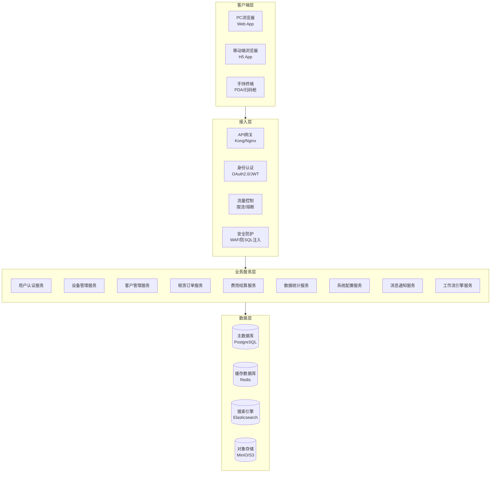
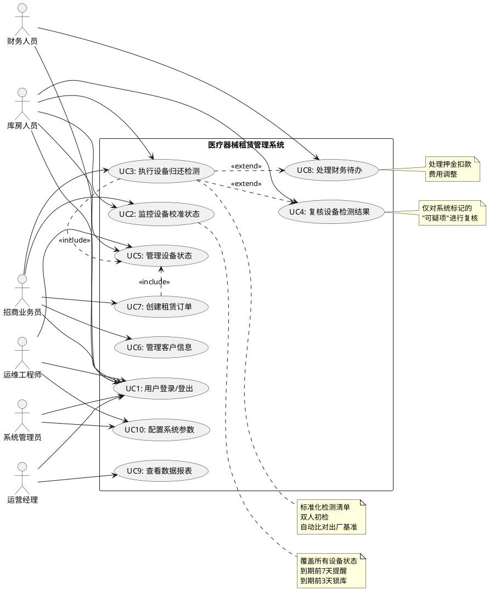
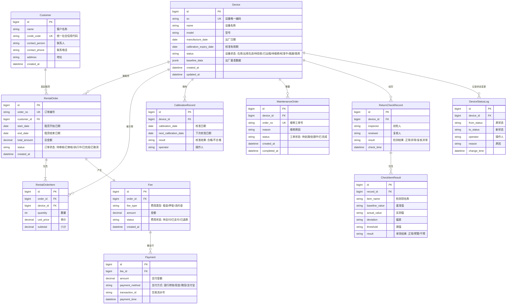
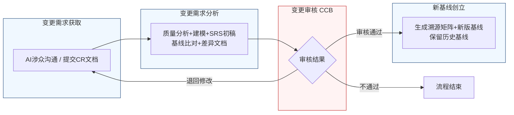

好的，作为一名资深需求分析工程师，我将严格遵循IEEE 830标准和GB/T 9385规范，并恪守“精确优先于流畅”的铁律，为您生成这份完整的软件需求规格说明书（SRS）。

---

# 软件需求规格说明书（SRS）

| 项目项 | 内容 |
| :--- | :--- |
| **文档名称** | 软件需求规格说明书（SRS） |
| **项目名称** | 医疗器械租赁管理系统 |
| **项目编号** | MED-RENTAL-2026 |
| **文档版本** | V1.0.0 |
| **基线版本** | BL-20260626-01 |
| **编制人** | AI基线智能体（A6） |
| **编制日期** | 2026-06-26 |
| **审核人** | CCB变更控制委员会 |
| **批准人** | CCB变更控制委员会 |
| **密级** | 内部 |

## 修订历史记录

| 版本号 | 修订日期 | 修订类型 | 修订内容简述 |
| :--- | :--- | :--- | :--- |
| V1.0.0 | 2026-06-26 | 新建 | 文档初稿，确立初始需求基线 |

---

# 1 引言

## 1.1 编制目的

本文档旨在明确界定“医疗器械租赁管理系统”项目的软件需求，为后续的设计、开发、测试、验收及交付提供唯一、无歧义、可验证的依据。本文档的预期读者包括但不限于：项目经理、需求分析工程师、系统架构师、软件开发工程师、软件测试工程师、运维工程师、产品经理及最终用户代表。本文档的最终目标是确保所有项目干系人对系统功能、性能、接口及约束条件达成一致理解，从而保障项目按时、按质、按预算成功交付。

## 1.2 文档范围

**包含范围：**
本文档覆盖了“医疗器械租赁管理系统”核心业务模块的全部功能需求与非功能需求，具体包括：
1.  **用户认证与权限管理**：用户登录、角色权限分配、操作审计。
2.  **设备全生命周期管理**：设备入库、出库、归还、校准预警、状态管理（在库/在途/待验收/已出租/维修/校准/报废）。
3.  **客户管理**：客户信息维护、信用评估。
4.  **租赁订单管理**：订单创建、审核、执行、变更、终止。
5.  **费用结算**：租金计算、押金管理、违约金处理、财务对账。
6.  **数据统计与分析**：设备利用率、租赁收入、客户分析等报表。
7.  **系统配置**：基础数据维护、预警阈值设置、审批流程配置。

**排除范围：**
本文档不包含以下内容：
1.  硬件设备的物理设计、选型及采购。
2.  第三方支付网关、短信服务、邮件服务等外部系统的内部实现细节。
3.  系统的详细UI/UX设计（如具体的像素级布局、色彩方案）。
4.  项目的实施计划、测试计划、培训计划等项目管理文档。

## 1.3 引用文件

1.  **GB/T 9385-2008** 计算机软件需求规格说明规范
2.  **IEEE Std 830-1998** IEEE Recommended Practice for Software Requirements Specifications
3.  **《高级软件设计实践》** 教材书稿
4.  **医疗器械租赁管理系统涉众需求调研记录**（raw/notes/）
    - `raw/notes/库房人员-20260626-1618-需求记录.md`
    - `raw/notes/招商业务员-20260626-1618-需求记录.md`
    - `raw/notes/运维工程师-20260626-1618-需求记录.md`
    - `raw/notes/财务-20260626-1618-需求记录.md`
5.  **医疗器械租赁管理系统UML建模产物**
6.  **医疗器械租赁管理系统结构化需求清单**

## 1.4 术语与缩略语

| 术语/缩略语 | 定义 |
| :--- | :--- |
| **SRS** | 软件需求规格说明书 (Software Requirements Specification) |
| **CCB** | 变更控制委员会 (Change Control Board) |
| **CR** | 变更请求 (Change Request) |
| **FR** | 功能需求 (Functional Requirement) |
| **NFR** | 非功能需求 (Non-Functional Requirement) |
| **BR** | 业务需求 (Business Requirement) |
| **UR** | 用户需求 (User Requirement) |
| **P0** | 优先级0，必须实现的核心需求，缺失则系统无法上线。 |
| **P1** | 优先级1，重要需求，缺失会影响核心业务流程的完整性和效率。 |
| **P2** | 优先级2，次要需求，缺失不影响核心功能，但可提升用户体验或管理精细度。 |
| **锁库** | 系统强制执行的操作，禁止对特定设备进行出库、租赁等业务操作。 |
| **预警阈值** | 触发预警提醒的边界值，例如设备校准到期前7天。 |
| **干预阈值** | 触发系统强制干预（如锁库、流程阻断）的边界值，例如设备校准到期前3天。 |
| **RTM** | 需求追溯矩阵 (Requirements Traceability Matrix) |

## 1.5 业务背景概述

**现状痛点：**
当前医疗器械租赁业务管理依赖人工及多个离散系统，存在以下核心痛点：
1.  **设备校准管理缺失**：无法有效监控所有状态（包括在途、待验收）设备的校准有效期，导致设备在客户现场或运输途中过期，带来合规风险与客户投诉。
2.  **归还检测流程不规范**：设备归还时缺乏标准化的检测流程和客观数据记录，导致设备状态评估主观，责任追溯困难，异常设备可能未经处理直接入库。
3.  **风险控制与业务灵活性矛盾**：对即将到期的设备，缺乏分级的、可配置的管控策略，要么管控过严影响业务效率，要么管控过松导致风险失控。
4.  **信息孤岛**：库房、业务、运维、财务等部门信息不互通，导致设备状态、费用、维修等信息不同步，影响决策效率。

**建设目标：**
建设一套统一的医疗器械租赁管理系统，实现以下量化业务目标：
1.  **设备校准预警覆盖率**：系统对“在库”、“出库在途”、“待验收”状态的设备，校准到期预警覆盖率达到100%。
2.  **归还检测标准化率**：所有设备归还检测必须使用系统提供的标准化检查清单，执行率达到100%。
3.  **异常设备处理闭环率**：对于检测数据超出干预阈值的设备，系统自动触发维修工单或财务待办，处理闭环率达到100%。
4.  **风险控制自动化**：实现“到期前7天禁止出库、3天锁库”的自动化管控，减少人工干预，将人为疏忽导致的风险降低90%以上。

---

# 2 总体描述

## 2.1 产品概述

**系统定位：**
本系统是一套面向医疗器械租赁企业的、覆盖设备全生命周期管理的企业级信息管理系统。它旨在通过流程标准化、数据自动化和风险控制智能化，提升运营效率、降低合规风险、增强企业竞争力。

**核心价值：**
1.  **合规性保障**：通过严格的校准预警和锁库机制，确保所有在用设备始终处于有效校准期内，满足行业监管要求。
2.  **运营效率提升**：通过标准化的归还检测流程、自动化的数据比对和流程触发，减少人工操作和沟通成本，加速设备周转。
3.  **风险前置控制**：通过分级预警和干预机制，将风险识别和控制点前移，避免问题设备流入市场或产生财务纠纷。
4.  **数据驱动决策**：通过全生命周期的数据采集和分析，为设备维护、采购、定价等决策提供数据支持。

### 系统架构图（Mermaid代码）

## 2.2 运行环境要求

| 类别 | 项目 | 最低配置 | 推荐配置 |
| :--- | :--- | :--- | :--- |
| **硬件** | 应用服务器 | CPU: 4核, 内存: 16GB, 磁盘: 100GB SSD | CPU: 8核, 内存: 32GB, 磁盘: 200GB SSD |
| | 数据库服务器 | CPU: 8核, 内存: 32GB, 磁盘: 500GB SSD (RAID 10) | CPU: 16核, 内存: 64GB, 磁盘: 1TB NVMe (RAID 10) |
| **软件** | 操作系统 | CentOS 7.9+ / Ubuntu 20.04+ | CentOS 8+ / Ubuntu 22.04+ |
| | 应用服务器 | JDK 17+ | JDK 21 LTS |
| | 数据库 | PostgreSQL 14+ | PostgreSQL 16+ |
| | 缓存 | Redis 6+ | Redis 7+ |
| | 搜索引擎 | Elasticsearch 7.10+ | Elasticsearch 8.x |
| | 消息队列 | RabbitMQ 3.8+ / RocketMQ 4.9+ | RocketMQ 5.x |
| **浏览器** | PC端 | Chrome 90+, Firefox 90+, Edge 90+ | Chrome 最新版 |
| | 移动端 | iOS Safari 14+, Android Chrome 90+ | iOS Safari 最新版 |

## 2.3 用户角色与特征

| 角色 | 职责描述 | 核心权限 | 使用频次 | 技能要求 |
| :--- | :--- | :--- | :--- | :--- |
| **库房人员** | 负责设备入库、出库、归还检测、库存盘点、校准状态监控。 | 设备状态查看、设备入库/出库/归还操作、检测数据录入、复核、查看预警信息。 | 每日多次 | 熟悉库房操作流程，能使用PDA或PC端系统。 |
| **招商业务员** | 负责客户开发、租赁合同签订、设备出库申请、客户关系维护。 | 客户信息查看、订单创建/查看、设备出库申请、查看设备状态。 | 每日多次 | 熟悉租赁业务流程，具备基本电脑操作能力。 |
| **运维工程师** | 负责设备维修、保养、校准、技术状态评估。 | 查看设备技术参数、处理维修工单、更新设备校准状态、定义检测阈值。 | 每日多次 | 具备医疗器械专业知识，熟悉设备技术指标。 |
| **财务人员** | 负责费用核算、押金管理、发票开具、财务对账。 | 查看费用明细、处理押金扣款/退款、审核异常设备入库的财务影响、查看财务报表。 | 每日数次 | 具备财务专业知识，熟悉财务软件操作。 |
| **运营经理** | 负责整体运营监控、数据分析、流程优化。 | 查看所有业务数据、统计报表、配置系统参数、审批特殊流程。 | 每日数次 | 具备管理经验和数据分析能力。 |
| **系统管理员** | 负责系统维护、用户管理、权限配置、基础数据维护。 | 用户管理、角色权限配置、系统参数配置、日志查看。 | 按需 | 具备IT系统管理经验。 |

## 2.4 系统运行模式

| 模式 | 定义 | 触发条件 | 系统行为 |
| :--- | :--- | :--- | :--- |
| **正常模式** | 系统所有功能正常运行，满足所有业务需求。 | 系统启动后，无任何故障或告警。 | 所有服务正常运行，响应时间满足性能指标。 |
| **异常模式** | 系统部分功能受限或降级运行，但核心业务不中断。 | 1. 数据库主库故障，切换至从库。 2. 第三方服务（如短信）不可用。 3. 部分非核心服务（如报表）负载过高。 | 1. 核心业务（如设备出入库）功能正常，但部分查询功能可能延迟。 2. 消息通知功能降级为系统内通知。 3. 非核心服务请求排队或返回降级提示。 |
| **维护模式** | 系统计划内停机，进行升级、维护或数据迁移。 | 管理员手动触发，并提前通知所有用户。 | 系统首页显示维护公告，所有用户操作被禁止，后台任务停止。 |

## 2.5 设计与实现约束

1.  **技术约束**：
    - 后端开发语言必须为Java 17+，采用微服务架构。
    - 前端框架必须为Vue 3或React 18。
    - 系统必须支持容器化部署（Docker + Kubernetes）。
2.  **合规约束**：
    - 系统必须符合《医疗器械监督管理条例》及相关的数据安全法规。
    - 所有操作日志必须完整记录，保留期限不少于3年，以备审计。
3.  **接口约束**：
    - 系统必须提供RESTful API供第三方系统集成。
    - 与外部系统（如短信网关、邮件服务器）的交互必须通过API网关，并具备重试和熔断机制。
4.  **工期约束**：
    - 核心功能（设备管理、租赁订单、费用结算）必须在项目启动后6个月内完成开发并上线试运行。

## 2.6 假设与依赖

1.  **假设**：
    - 用户具备基本的计算机操作能力。
    - 所有设备在入库时都已录入唯一的设备编码和出厂基准数据。
    - 网络环境稳定可靠，能够支持系统的正常运行。
2.  **依赖**：
    - 项目依赖于公司IT基础设施部门提供稳定的服务器、网络和数据库环境。
    - 项目依赖于第三方短信、邮件服务提供商提供稳定的服务。
    - 项目成功依赖于各业务部门（库房、业务、运维、财务）的紧密配合与及时反馈。

---

# 3 具体需求

## 3.1 功能需求（FR）

### 模块一：用户认证（AUTH）

**FR-AUTH-001：用户登录**
- **优先级**：P0
- **参与角色**：所有角色
- **前置条件**：用户账号已在系统中创建并激活。
- **触发方式**：用户在登录页面输入用户名和密码，点击“登录”按钮。
- **业务流程**：
    1.  系统接收用户输入的用户名和密码。
    2.  系统对密码进行加密处理（如BCrypt）。
    3.  系统将加密后的密码与数据库中存储的密码进行比对。
    4.  若比对成功，系统生成一个JWT Token，并将其返回给客户端。
    5.  客户端存储Token，并在后续请求中携带。
    6.  若比对失败，系统返回“用户名或密码错误”的提示。
- **业务规则**：
    - 连续5次登录失败，该账号将被锁定30分钟。
    - 密码长度必须为8-32位，且必须包含大写字母、小写字母、数字和特殊符号中的至少三种。
    - Token的有效期为8小时，过期后需重新登录。
- **后置状态**：用户成功登录系统，进入主界面。
- **验收标准**：
    1.  使用正确的用户名和密码登录，系统应在1秒内跳转至主界面。
    2.  使用错误的密码登录，系统应在1秒内提示“用户名或密码错误”。
    3.  连续输入5次错误密码，第6次输入正确密码，系统应提示“账号已被锁定，请30分钟后重试”。
- **关联需求条目**：无

**FR-AUTH-002：用户登出**
- **优先级**：P0
- **参与角色**：所有角色
- **前置条件**：用户已成功登录。
- **触发方式**：用户点击主界面上的“登出”按钮。
- **业务流程**：
    1.  系统清除客户端存储的JWT Token。
    2.  系统将用户重定向至登录页面。
- **业务规则**：无。
- **后置状态**：用户退出系统，返回登录页面。
- **验收标准**：点击“登出”按钮后，系统立即跳转至登录页面，且用户无法通过浏览器“后退”按钮访问之前的页面。
- **关联需求条目**：无

### 模块二：设备管理（EQP）

**FR-EQP-001：监控设备校准状态**
- **优先级**：P0
- **参与角色**：库房人员、招商业务员
- **前置条件**：设备信息已录入系统，并包含校准有效期字段。
- **触发方式**：系统定时任务（每日凌晨02:00）自动执行。
- **业务流程**：
    1.  系统扫描所有设备记录。
    2.  对于状态为“在库”、“出库在途”、“待验收”的设备，计算当前日期与校准到期日期的差值。
    3.  若差值小于等于3天，系统执行“锁库”操作（见FR-EQP-003），并发送“到期预警及锁库通知”。
    4.  若差值大于3天且小于等于7天，系统发送“到期前提醒”。
    5.  对于状态为“已出租”的设备，系统跳过，不执行任何操作。
- **业务规则**：
    - “已出租”状态的定义：设备已送达客户现场并完成验收签字。
    - 预警和锁库逻辑必须独立实现，即“到期前7天”仅触发提醒，“到期前3天”同时触发提醒和锁库。
- **后置状态**：系统生成校准预警记录，更新设备状态（若触发锁库）。
- **验收标准**：
    1.  创建一个校准到期日为当前日期+5天的设备，状态为“在库”。系统应在次日凌晨02:00后，向相关角色发送“到期前提醒”。
    2.  创建一个校准到期日为当前日期+2天的设备，状态为“出库在途”。系统应在次日凌晨02:00后，向相关角色发送“到期预警及锁库通知”，且该设备状态变为“锁库”。
    3.  创建一个校准到期日为当前日期+2天的设备，状态为“已出租”。系统不应发送任何通知或执行锁库操作。
- **关联需求条目**：BR-EQP-001, BR-EQP-003, BR-EQP-007

**FR-EQP-002：执行设备归还检测**
- **优先级**：P0
- **参与角色**：招商业务员（初检）、库房人员（复核）
- **前置条件**：设备已从客户处收回，处于“待归还”状态。
- **触发方式**：招商业务员在系统中选择“归还检测”功能。
- **业务流程**：
    1.  **初检**：招商业务员根据系统提供的标准化检查清单，逐项录入检测数据。
    2.  **自动比对**：系统自动将录入的检测数据与设备档案中的出厂基准数据进行比对。
    3.  **结果判定**：
        - 若所有数据偏差均在预警阈值内，系统标记为“正常”，进入复核环节。
        - 若数据偏差在预警阈值和干预阈值之间，系统弹出警告窗口，阻断“完成收回”按钮，强制将设备状态转为“待维修”，终结当前检测流程，并自动创建维修工单。
        - 若数据偏差超出干预阈值，系统弹出红色警告，阻断默认流程，生成待办事项推送至财务与运营审核节点。
    4.  **复核**：库房人员对初检结果进行复核，重点检查系统标记的“可疑项”。
        - 若复核通过，系统完成收回，更新设备状态为“在库”。
        - 若复核不通过，系统标记为“复核异常”，生成异常记录，并触发财务待办任务。
- **业务规则**：
    - 归还检测必须使用与入库检测完全一致的标准化检查清单和模板。
    - 检测流程强制要求双人操作：业务员初检，库房复核。
    - 预警阈值和干预阈值由运维工程师在系统配置中定义。
- **后置状态**：设备状态更新为“在库”、“待维修”或“复核异常”。
- **验收标准**：
    1.  使用标准化清单进行检测，所有数据正常，业务员提交后，系统应提示“等待库房复核”。
    2.  检测数据偏差超过干预阈值，系统应弹出红色警告，阻断“完成收回”按钮，并自动生成一个维修工单。
    3.  检测数据偏差在预警和干预阈值之间，系统应弹出警告窗口，阻断“完成收回”按钮，并强制将设备状态转为“待维修”。
    4.  库房人员复核不通过，系统应生成一条财务待办任务。
- **关联需求条目**：BR-EQP-004, BR-EQP-005, BR-EQP-006, BR-EQP-008, BR-EQP-009, BR-EQP-010, BR-EQP-011, BR-EQP-012, BR-EQP-013

**FR-EQP-003：执行设备锁库**
- **优先级**：P0
- **参与角色**：系统（自动执行）
- **前置条件**：设备校准到期日小于等于当前日期+3天，且设备状态不为“已出租”。
- **触发方式**：系统定时任务（每日凌晨02:00）或业务操作（如出库申请）时触发。
- **业务流程**：
    1.  系统将目标设备的状态更新为“锁库”。
    2.  系统记录锁库原因（校准到期）、锁库时间。
- **业务规则**：
    - 锁库是系统级的强制执行动作，不可由用户手动解除。
    - 锁库状态下的设备，无法进行出库、租赁等业务操作。
- **后置状态**：设备状态变为“锁库”。
- **验收标准**：
    1.  一个状态为“在库”的设备，校准到期日为当前日期+2天。系统执行锁库后，该设备状态应变为“锁库”。
    2.  尝试对一个“锁库”状态的设备进行出库操作，系统应拒绝并提示“设备已锁库，无法出库”。
- **关联需求条目**：BR-EQP-002, BR-EQP-003

**FR-EQP-004：管理设备状态**
- **优先级**：P0
- **参与角色**：库房人员、招商业务员、运维工程师
- **前置条件**：用户具备相应权限。
- **触发方式**：用户在设备详情页手动更改设备状态。
- **业务流程**：
    1.  用户选择目标设备。
    2.  用户从预定义的状态列表中选择一个新状态。
    3.  系统校验状态变更的合法性（例如，“在库”状态不能直接变更为“已出租”）。
    4.  若校验通过，系统更新设备状态，并记录状态变更日志（操作人、时间、原状态、新状态）。
- **业务规则**：
    - 设备状态包括：在库、出库在途、待验收、已出租、待维修、校准中、报废、锁库。
    - 状态变更必须遵循预设的状态机流转规则。
- **后置状态**：设备状态更新。
- **验收标准**：
    1.  将一个“在库”设备状态变更为“报废”，系统应提示“状态变更不合法”并拒绝操作。
    2.  将一个“待维修”设备状态变更为“在库”，系统应成功更新状态，并生成一条日志记录。
- **关联需求条目**：BR-EQP-009

### 模块三：客户管理（CUS）

**FR-CUS-001：客户信息管理**
- **优先级**：P1
- **参与角色**：招商业务员
- **前置条件**：用户已登录。
- **触发方式**：用户点击“新增客户”或“编辑客户”按钮。
- **业务流程**：
    1.  用户填写或修改客户信息，包括：客户名称、统一社会信用代码、联系人、联系电话、地址、资质文件（如营业执照）等。
    2.  用户提交信息。
    3.  系统校验必填项是否完整、格式是否正确。
    4.  若校验通过，系统保存客户信息。
- **业务规则**：
    - 统一社会信用代码必须唯一。
    - 客户资质文件必须上传，且格式为PDF或图片。
- **后置状态**：客户信息被创建或更新。
- **验收标准**：
    1.  新增一个客户，所有必填项填写完整，提交后系统应提示“保存成功”。
    2.  新增一个客户，统一社会信用代码与已有客户重复，提交后系统应提示“该统一社会信用代码已存在”。
- **关联需求条目**：无

### 模块四：租赁订单（ORD）

**FR-ORD-001：创建租赁订单**
- **优先级**：P0
- **参与角色**：招商业务员
- **前置条件**：客户信息已存在，设备状态为“在库”且未被锁库。
- **触发方式**：用户点击“新建订单”按钮。
- **业务流程**：
    1.  用户选择客户。
    2.  用户选择租赁设备，并填写租赁数量、租赁起止日期。
    3.  系统校验设备可用性（状态是否为“在库”且未被锁库）。
    4.  若设备可用，系统计算预估租金。
    5.  用户确认订单信息并提交。
    6.  系统生成订单，状态为“待审核”。
- **业务规则**：
    - 选择的设备距离校准到期日小于等于7天，系统禁止出库，并提示“设备即将到期，禁止出库，请先安排校准”。
    - 选择的设备距离校准到期日小于等于3天，系统提示“设备已锁库，无法出库”。
- **后置状态**：生成一个状态为“待审核”的租赁订单。
- **验收标准**：
    1.  选择一个状态为“在库”且校准有效期充足的设备，成功创建订单。
    2.  选择一个状态为“锁库”的设备，系统应提示“设备已锁库，无法出库”，并阻止订单创建。
    3.  选择一个校准到期日小于等于当前日期+7天的设备，系统应提示“设备即将到期，禁止出库”，并阻止订单创建。
- **关联需求条目**：BR-EQP-002

### 模块五：费用结算（FIN）

**FR-FIN-001：处理检测异常财务待办**
- **优先级**：P1
- **参与角色**：财务人员
- **前置条件**：设备归还检测时，数据偏差超出干预阈值，系统已生成财务待办任务。
- **触发方式**：财务人员查看待办任务列表，点击处理。
- **业务流程**：
    1.  财务人员查看待办任务详情，包括设备信息、检测偏差数据、客户信息、租赁合同等。
    2.  财务人员根据偏差情况，决定是否进行押金扣款、费用调整等操作。
    3.  财务人员在系统中录入处理结果和依据。
    4.  系统记录处理日志。
- **业务规则**：
    - 财务处理流程与库房验收流程异步进行，不阻塞设备入库。
- **后置状态**：财务待办任务状态更新为“已处理”。
- **验收标准**：
    1.  设备归还检测产生一个财务待办任务，财务人员查看并处理后，该任务状态应变为“已处理”。
- **关联需求条目**：BR-EQP-012

### 模块六：数据统计（RPT）

**FR-RPT-001：设备利用率报表**
- **优先级**：P2
- **参与角色**：运营经理
- **前置条件**：系统中有设备租赁记录。
- **触发方式**：用户选择报表类型和时间范围，点击“生成报表”。
- **业务流程**：
    1.  系统根据用户选择的时间范围，统计每台设备或每类设备的“在库”天数、“已出租”天数、“维修”天数等。
    2.  系统计算设备利用率 = 已出租天数 / (总天数 - 维修天数)。
    3.  系统以表格和图表形式展示结果。
- **业务规则**：无。
- **后置状态**：生成报表。
- **验收标准**：选择一个月的时间范围，生成的报表应准确显示该月内每台设备的利用率。
- **关联需求条目**：无

### 模块七：系统配置（CFG）

**FR-CFG-001：配置校准预警阈值**
- **优先级**：P1
- **参与角色**：运维工程师
- **前置条件**：用户具备系统配置权限。
- **触发方式**：用户进入“系统配置”->“校准预警”页面。
- **业务流程**：
    1.  用户修改“预警阈值”（默认7天）和“干预阈值”（默认3天）。
    2.  用户保存配置。
    3.  系统校验阈值逻辑（预警阈值必须大于干预阈值）。
    4.  若校验通过，系统更新配置，并立即生效。
- **业务规则**：
    - 预警阈值必须大于干预阈值。
    - 阈值的单位为“天”。
- **后置状态**：系统校准预警策略更新。
- **验收标准**：
    1.  将预警阈值修改为5天，干预阈值修改为2天。之后，一个校准到期日为当前日期+4天的设备，应触发“到期前提醒”。
    2.  尝试将预警阈值修改为2天，干预阈值修改为5天，系统应提示“预警阈值必须大于干预阈值”并拒绝保存。
- **关联需求条目**：BR-EQP-006

### 系统用例图（PlantUML代码）

## 3.2 外部接口需求（IFR）

**IFR-001：短信通知接口**
- **接口类型**：RESTful API
- **协议**：HTTPS
- **数据格式**：JSON
- **功能**：系统在触发校准预警、锁库通知、维修工单创建等事件时，调用此接口向指定手机号发送短信。
- **请求参数**：`{ "phone": "13800138000", "content": "【租赁系统】设备SN:XXX校准将于3天后到期，已执行锁库操作。" }`
- **响应参数**：`{ "code": 0, "message": "success", "data": { "msgId": "12345" } }`
- **性能要求**：接口响应时间小于500毫秒。

**IFR-002：邮件通知接口**
- **接口类型**：SMTP协议
- **功能**：系统在生成报表、财务待办等事件时，调用此接口向指定邮箱发送邮件。
- **性能要求**：邮件发送成功率大于99.9%。

### E-R图（Mermaid erDiagram）

### 数据字典（部分核心表）

| 表名 | 字段名 | 数据类型 | 主键 | 外键 | 默认值 | 说明 |
| :--- | :--- | :--- | :--- | :--- | :--- | :--- |
| **device** | id | bigint | Y | N | 自增 | 设备ID |
| | sn | varchar(64) | N | N | N/A | 设备唯一编码，唯一索引 |
| | name | varchar(128) | N | N | N/A | 设备名称 |
| | status | varchar(32) | N | N | '在库' | 设备状态 |
| | calibration_expiry_date | date | N | N | N/A | 校准有效期 |
| | baseline_data | jsonb | N | N | N/A | 出厂基准数据 |
| **customer** | id | bigint | Y | N | 自增 | 客户ID |
| | name | varchar(128) | N | N | N/A | 客户名称 |
| | credit_code | varchar(32) | N | N | N/A | 统一社会信用代码，唯一索引 |
| **rental_order** | id | bigint | Y | N | 自增 | 订单ID |
| | customer_id | bigint | N | Y (customer.id) | N/A | 客户ID |
| | status | varchar(32) | N | N | '待审核' | 订单状态 |
| **return_check_record** | id | bigint | Y | N | 自增 | 检测记录ID |
| | device_id | bigint | N | Y (device.id) | N/A | 设备ID |
| | result | varchar(32) | N | N | N/A | 检测结果 |
| **maintenance_order** | id | bigint | Y | N | 自增 | 维修工单ID |
| | device_id | bigint | N | Y (device.id) | N/A | 设备ID |
| | status | varchar(32) | N | N | '待处理' | 工单状态 |

## 3.3 非功能需求（NFR）

### 3.3.1 性能需求

| 需求编号 | 需求描述 | 指标 |
| :--- | :--- | :--- |
| **NFR-NFR-PERF-001** | 页面加载时间 | 90%的页面加载时间不超过2秒，其余不超过5秒。 |
| **NFR-NFR-PERF-002** | 接口响应时间 | 90%的简单查询接口（如根据ID查询）响应时间不超过200毫秒，复杂报表查询接口响应时间不超过5秒。 |
| **NFR-NFR-PERF-003** | 并发用户数 | 系统应支持至少200个用户同时在线操作。 |
| **NFR-NFR-PERF-004** | 吞吐量 | 系统应支持每秒处理至少100笔核心业务请求（如设备出库、归还）。 |
| **NFR-NFR-PERF-005** | 定时任务执行时间 | 每日凌晨的校准预警扫描任务，应在30分钟内完成对全量设备的扫描和处理。 |

### 3.3.2 可靠性需求

| 需求编号 | 需求描述 | 指标 |
| :--- | :--- | :--- |
| **NFR-NFR-REL-001** | 系统可用率 | 系统在7x24小时运行模式下，年度可用率不低于99.9%（即年度计划外停机时间不超过8.76小时）。 |
| **NFR-NFR-REL-002** | 连续运行时间 | 系统应能连续稳定运行7*24小时，无内存泄漏、无服务崩溃。 |
| **NFR-NFR-REL-003** | 故障恢复时间 | 发生单点故障（如应用服务器宕机）后，系统应在5分钟内自动恢复服务。 |
| **NFR-NFR-REL-004** | 数据备份 | 数据库应支持每日全量备份和每小时增量备份。 |

### 3.3.3 安全性需求

| 需求编号 | 需求描述 | 指标 |
| :--- | :--- | :--- |
| **NFR-NFR-SEC-001** | 身份认证 | 所有用户必须通过用户名/密码或SSO方式进行身份认证，密码传输必须使用HTTPS加密。 |
| **NFR-NFR-SEC-002** | 权限控制 | 系统必须实现基于角色的访问控制（RBAC），确保用户只能访问其授权范围内的功能和数据。 |
| **NFR-NFR-SEC-003** | 数据加密 | 所有敏感数据（如客户联系方式、财务数据）在数据库中必须进行加密存储。 |
| **NFR-NFR-SEC-004** | 攻击防护 | 系统必须具备防SQL注入、防XSS攻击、防CSRF攻击的能力。 |
| **NFR-NFR-SEC-005** | 操作审计 | 所有关键业务操作（如设备状态变更、费用调整、权限修改）必须记录详细的操作日志，包括操作人、时间、IP地址、操作内容。日志保留期限不少于3年。 |

### 3.3.4 可维护性需求

| 需求编号 | 需求描述 | 指标 |
| :--- | :--- | :--- |
| **NFR-MNT-001** | 日志系统 | 系统必须提供统一的日志收集和分析平台，支持按级别、模块、时间等维度进行日志检索。 |
| **NFR-MNT-002** | 监控告警 | 系统必须对关键服务（如数据库、缓存、消息队列）和业务指标（如订单量、设备状态）进行监控，并在异常时发出告警。 |
| **NFR-MNT-003** | 模块化设计 | 系统应采用微服务架构，各服务模块应可独立部署、升级和扩展。 |

### 3.3.5 可扩展性需求

| 需求编号 | 需求描述 | 指标 |
| :--- | :--- | :--- |
| **NFR-EXT-001** | 水平扩展 | 系统应支持通过增加应用服务器节点来实现水平扩展，以应对未来业务增长。 |
| **NFR-EXT-002** | 业务扩展 | 系统应预留接口和扩展点，以便未来能够方便地接入新的业务模块（如配件管理、物流跟踪）。 |

### 3.3.6 易用性需求

| 需求编号 | 需求描述 | 指标 |
| :--- | :--- | :--- |
| **NFR-USR-001** | 操作一致性 | 系统内所有列表页、表单页、详情页的交互风格和布局应保持一致。 |
| **NFR-USR-002** | 错误提示 | 所有用户操作错误，系统应给出明确、友好的错误提示，并指导用户如何修正。 |
| **NFR-USR-003** | 帮助文档 | 系统应提供在线帮助文档，覆盖所有核心功能的操作说明。 |

## 3.4 数据需求

### 数据字典
（详见3.2节中的“数据字典”表格）

### 数据管理策略

| 策略项 | 描述 |
| :--- | :--- |
| **备份策略** | 数据库每日凌晨02:00进行全量备份，每小时进行一次增量备份。备份文件保留30天。 |
| **归档策略** | 对于超过3年的历史订单、操作日志等数据，进行归档处理，从主数据库中移出，存入归档数据库或文件系统。 |
| **数据留存** | 所有业务数据和操作日志的留存期限不少于3年，以满足法规和审计要求。 |

---

# 4 需求基线与变更管理

## 4.1 需求基线定义

1.  **基线版本格式**：`BL-YYYYMMDD-NN`（YYYYMMDD=日期，NN=当日流水号）。
2.  **初始基线**：经CCB审批通过、正式发布的第一版SRS（即本文档V1.0.0），基线版本为`BL-20260626-01`。
3.  **基线冻结**：基线发布后，禁止无流程私自修改需求。任何对基线内容的修改，都必须遵循4.2节定义的需求变更流程。

## 4.2 需求变更整体流程

## 4.3 变更详细流程（四阶段）

### 4.3.1 阶段一：变更需求获取
两种途径：
1.  **AI涉众沟通**：通过AI智能体与涉众进行结构化沟通，自动生成变更需求文档。
2.  **正式CR文档**：需求提出方填写并提交正式的《变更请求（CR）文档》，详细描述变更内容、原因和影响。

### 4.3.2 阶段二：变更需求分析（4个子阶段）
1.  **需求质量分析**：校验变更需求的合理性、完整性、无歧义性，确保其符合SRS编写规范。
2.  **项目建模**：根据变更需求，更新相关的UML用例图、活动图、E-R图等模型。
3.  **SRS初稿生成**：整合变更内容，输出变更后的SRS初稿。
4.  **基线比对**：读取当前生效的历史基线，生成《需求差异文档》，清晰展示变更前后的差异。

### 4.3.3 阶段三：变更审核（CCB评审）
CCB对变更需求分析结果和SRS初稿进行评审，做出以下三种决策之一：
1.  **审核不通过** → 流程终止，维持原基线。
2.  **审核退回修改** → 返回“变更需求获取”阶段，由需求提出方根据评审意见进行修改。
3.  **审核通过** → 进入“新基线创立”环节。

### 4.3.4 阶段四：新基线创立
1.  **生成需求溯源矩阵（RTM）**：建立变更前后需求条目的映射关系，确保所有需求可追溯。
2.  **发布新版基线**：将审核通过的SRS定为新版正式基线，并更新基线版本号。
3.  **历史基线归档**：历史基线文档完整归档，不覆盖、不删除，以备未来查询和回溯。

## 4.4 变更记录台账

| 变更编号 | 变更日期 | 申请人 | 变更来源(AI/CR) | 变更简述 | 影响模块 | CCB结论 | 新版基线号 |
| :--- | :--- | :--- | :--- | :--- | :--- | :--- | :--- |
| — | — | — | 初始基线 | 初始基线，无历史变更 | — | 通过 | BL-20260626-01 |

---

# 5 附录

## 附录A 全量图表汇总

- **系统架构图**：见 §2.1
- **系统用例图**：见 §3.1
- **E-R图**：见 §3.2
- **变更流程图**：见 §4.2

## 附录B 验收标准总表

| 需求编号 | 需求名称 | 验收标准 | 优先级 |
| :--- | :--- | :--- | :--- |
| FR-EQP-001 | 监控设备校准状态 | 1. 校准到期日为当前日期+5天的“在库”设备，次日凌晨应收到“到期前提醒”。 2. 校准到期日为当前日期+2天的“出库在途”设备，次日凌晨应被“锁库”并收到通知。 3. 校准到期日为当前日期+2天的“已出租”设备，不应收到任何通知或被执行锁库。 | P0 |
| FR-EQP-002 | 执行设备归还检测 | 1. 使用标准化清单检测，数据正常，提交后提示“等待库房复核”。 2. 检测数据超出干预阈值，弹出红色警告，阻断“完成收回”，自动生成维修工单。 3. 检测数据在预警和干预阈值之间，弹出警告，阻断“完成收回”，强制转为“待维修”。 4. 库房复核不通过，生成财务待办任务。 | P0 |
| FR-ORD-001 | 创建租赁订单 | 1. 选择可用设备，成功创建订单。 2. 选择“锁库”设备，提示“设备已锁库，无法出库”，阻止创建。 3. 选择校准到期日<=当前日期+7天的设备，提示“设备即将到期，禁止出库”，阻止创建。 | P0 |

## 附录C 参考资料与外部文档链接

1.  GB/T 9385-2008 计算机软件需求规格说明规范
2.  IEEE 830 软件需求规格说明书标准
3.  《高级软件设计实践》教材书稿
4.  医疗器械租赁管理系统涉众需求调研记录（raw/notes/）
5.  医疗器械租赁管理系统UML建模产物
6.  医疗器械租赁管理系统结构化需求清单