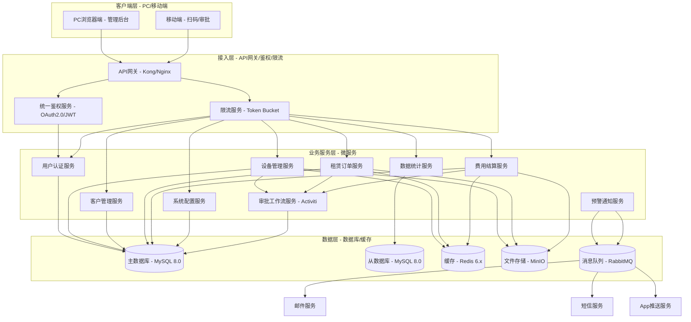
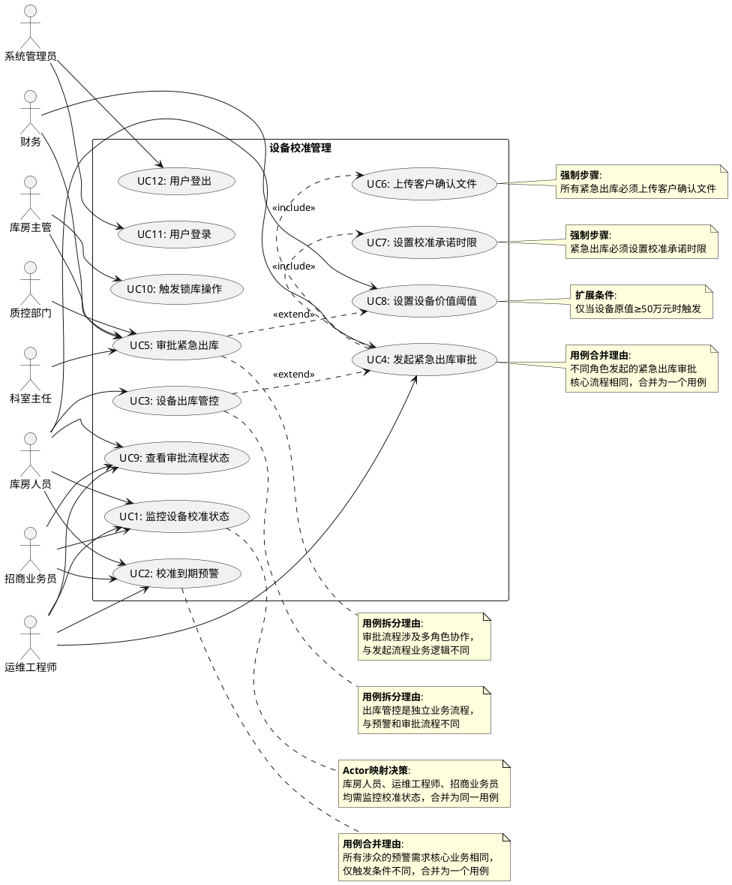
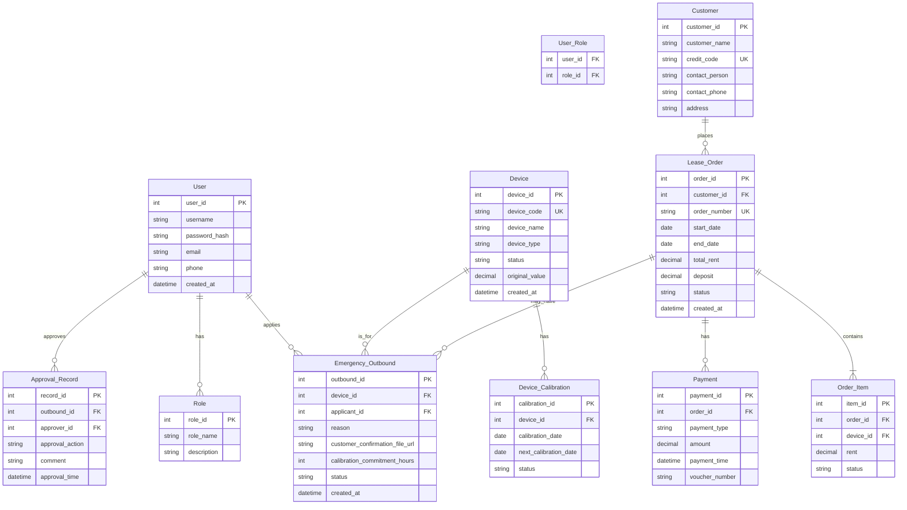
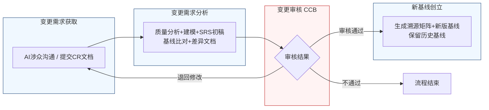

好的，作为一名资深需求分析工程师，我将严格遵循IEEE 830标准和GB/T 9385规范，并恪守“精确优先于流畅”的铁律，为您生成这份完整的软件需求规格说明书（SRS）。

---
# 文档头部信息
| 项目项 | 内容 |
| ---- | ---- |
| 文档名称 | 软件需求规格说明书（SRS）|
| 项目名称 | 医疗器械租赁管理系统 |
| 项目编号 | MED-RENTAL-2026 |
| 文档版本 | V1.0.0 |
| 基线版本 | 【占位，由A6分配】|
| 编制人 | AI基线智能体（A6） |
| 编制日期 | 2026-06-26 |
| 审核人 | CCB变更控制委员会 |
| 批准人 | CCB变更控制委员会 |
| 密级 | 内部 |

## 修订历史记录
| 版本号 | 修订日期 | 修订类型 | 修订内容简述 |
| V1.0.0 | 2026-06-26 | 新建 | 文档初稿，确立初始需求基线 |

# 1 引言
## 1.1 编制目的
本文档旨在明确界定医疗器械租赁管理系统（以下简称“本系统”）的功能需求、非功能需求、外部接口需求及数据需求。本文档的编制目的是：
1.  **建立共识**：为项目团队（包括需求分析人员、设计人员、开发人员、测试人员）与项目干系人（包括库房人员、运维工程师、招商业务员、财务人员、质控部门、科室主任等）提供一个统一的、无歧义的需求理解基础。
2.  **指导设计与开发**：作为后续系统设计、编码实现、单元测试和集成测试的权威依据。
3.  **作为验收基准**：为系统最终验收提供可量化、可测试的验收标准，确保交付的系统满足所有已确认的业务目标。
4.  **管理变更**：作为需求基线管理的核心文档，为后续的需求变更提供追溯和评估的基础。

## 1.2 文档范围（包含/排除）
**包含范围**：
本文档覆盖医疗器械租赁管理系统的核心业务模块，具体包括：
- **设备管理**：设备全生命周期状态管理，特别是校准状态的监控、预警与管控。
- **用户认证与权限管理**：系统用户的身份认证、角色定义及功能权限分配。
- **客户管理**：客户信息、资质、合同及信用管理。
- **租赁订单管理**：订单创建、审批、执行、变更及关闭的全流程管理。
- **费用结算管理**：租金、押金、违约金等费用的计算、收取、退还及财务对账。
- **数据统计与分析**：提供多维度、可配置的业务数据报表。
- **系统配置管理**：系统参数、流程模板、字典数据等的配置。

**排除范围**：
本文档不包含以下内容：
- **硬件设备选型**：不涉及服务器、网络设备等硬件品牌和型号的推荐。
- **第三方系统集成细节**：不涉及与外部财务系统、ERP系统、WMS系统的具体接口开发协议，仅定义本系统需提供的接口能力。
- **用户界面（UI）详细设计**：不包含具体的页面布局、色彩、字体、图标等视觉设计细节，仅定义交互逻辑和功能布局。
- **系统部署与运维方案**：不包含具体的服务器集群部署、容灾备份、监控告警等运维方案。
- **培训与推广计划**：不包含系统上线后的用户培训、推广策略和计划。

## 1.3 引用文件
1.  GB/T 9385-2008《计算机软件需求规格说明规范》
2.  IEEE Std 830-1998《IEEE Recommended Practice for Software Requirements Specifications》
3.  《高级软件设计实践》教材书稿
4.  医疗器械租赁管理系统涉众需求调研记录（raw/notes/）
5.  医疗器械租赁管理系统UML建模产物
6.  医疗器械租赁管理系统结构化需求清单

## 1.4 术语与缩略语
| 术语/缩略语 | 全称/定义 |
| ---- | ---- |
| SRS | Software Requirements Specification，软件需求规格说明书。 |
| CCB | Change Control Board，变更控制委员会，负责审批需求变更。 |
| CR | Change Request，变更请求，用于正式提出需求变更的文档。 |
| FR | Functional Requirement，功能需求。 |
| NFR | Non-Functional Requirement，非功能需求。 |
| IFR | Interface Requirement，接口需求。 |
| BR | Business Requirement，业务需求。 |
| UR | User Requirement，用户需求。 |
| RTM | Requirements Traceability Matrix，需求追溯矩阵。 |
| SLA | Service Level Agreement，服务水平协议。 |
| 锁库 | 系统级强制操作，禁止对指定设备进行任何出库操作。 |
| 禁止出库 | 系统级管控操作，禁止对指定设备进行正常出库操作。 |
| 紧急出库审批 | 一种人工干预的例外流程，用于在设备被“锁库”后，通过特批流程临时解锁设备。 |
| 校准承诺时限 | 在紧急出库流程中，操作人员承诺完成设备校准的最长时间。 |
| 高价值设备 | 单台设备原值大于等于50万元（含）的设备。 |
| 在途设备 | 已出库但尚未被客户签收确认的设备。 |
| 待验收设备 | 已送达客户现场，但尚未完成验收流程的设备。 |

## 1.5 业务背景概述
**现状痛点**：
当前，医疗器械租赁业务中，设备校准状态的管理存在以下痛点：
1.  **覆盖不全**：现有系统或流程仅管理“在库”设备的校准状态，忽略了“出库在途”和“待验收”状态的设备，导致设备在客户现场或验收时出现校准过期问题，引发客户投诉和合规风险。
2.  **管控粗放**：对校准过期设备缺乏精细化的分级管控机制，要么无限制出库，存在安全风险；要么一刀切锁死，影响紧急业务响应。
3.  **应急流程缺失**：在设备因校准过期被锁库后，缺乏标准化的、可控的紧急出库通道，导致在临床急需等特殊场景下，无法快速响应。
4.  **财务风险**：紧急出库缺乏必要的财务管控环节，如客户确认文件、押金校验等，存在资产流失和财务核算风险。

**建设目标**：
通过本系统的建设，实现以下量化业务目标：
1.  **100%覆盖**：系统对所有状态的设备（在库、出库在途、待验收）进行校准到期预警，覆盖率达到100%。
2.  **分级管控**：建立“7天禁止出库、3天锁库”的两级管控机制，实现设备校准过期的自动化、分级管控。
3.  **应急通道**：建立标准化的“紧急出库审批”流程，确保在紧急情况下，可在24小时内完成审批并出库。
4.  **风险可控**：紧急出库流程强制要求上传客户签字确认文件，并对高价值设备（原值≥50万元）进行押金前置校验，将财务风险降至最低。

# 2 总体描述
## 2.1 产品概述（系统定位、核心价值）
**系统定位**：本系统是一套面向医疗器械租赁企业的、覆盖设备全生命周期管理的企业级业务管理系统。其核心价值在于通过精细化的状态管理和智能化的流程控制，在保障设备合规性与资产安全的前提下，最大化提升业务响应速度和运营效率。

### 系统架构图（Mermaid代码）

## 2.2 运行环境要求
| 环境类别 | 具体要求 |
| ---- | ---- |
| **硬件环境** | |
| 应用服务器 | CPU: 8核及以上，内存: 32GB及以上，磁盘: 500GB SSD |
| 数据库服务器 | CPU: 16核及以上，内存: 64GB及以上，磁盘: 1TB SSD |
| 缓存服务器 | CPU: 4核及以上，内存: 16GB及以上 |
| **软件环境** | |
| 操作系统 | CentOS 7.9 或 Ubuntu 20.04 LTS |
| 应用服务器 | JDK 11，Tomcat 9.0 |
| 数据库 | MySQL 8.0.28 或以上版本 |
| 缓存 | Redis 6.2.6 或以上版本 |
| 消息队列 | RabbitMQ 3.9.13 或以上版本 |
| 文件存储 | MinIO RELEASE.2026-06-26T19-55-32Z |
| **浏览器兼容性** | |
| 桌面端 | Chrome 100+，Firefox 100+，Edge 100+，Safari 15+ |
| 移动端 | 微信内置浏览器，Chrome for Android，Safari for iOS |

## 2.3 用户角色与特征
| 角色 | 职责 | 核心权限 | 使用频次 | 技能要求 |
| ---- | ---- | ---- | ---- | ---- |
| 库房人员 | 设备入库、出库、盘点、状态维护、发起紧急出库 | 设备管理、预警查看、紧急出库发起 | 每日多次 | 熟悉设备操作流程 |
| 运维工程师 | 设备维修、校准、巡检、发起紧急出库 | 设备维修、校准管理、紧急出库发起 | 每日多次 | 具备设备维修技能 |
| 招商业务员 | 客户开发、合同签订、订单跟进、设备在途监控 | 客户管理、订单管理、预警查看 | 每日多次 | 熟悉销售业务流程 |
| 财务 | 费用核算、押金管理、发票管理、对账 | 费用结算、报表查看、审批高价值设备 | 每日多次 | 具备财务专业知识 |
| 质控部门 | 设备质量审核、校准状态审核 | 审批紧急出库、查看质量报告 | 每日数次 | 熟悉质量管理体系 |
| 科室主任 | 确认紧急出库需求的真实性 | 审批紧急出库 | 按需 | 熟悉临床需求 |
| 库房主管 | 确认设备状态与库存、执行锁库操作 | 审批紧急出库、执行锁库 | 每日数次 | 熟悉库房管理流程 |
| 系统管理员 | 系统配置、用户管理、权限分配、日志审计 | 系统配置、用户管理、日志查看 | 按需 | 具备IT系统管理能力 |

## 2.4 系统运行模式
1.  **正常模式**：系统所有功能正常运行，用户可执行所有授权操作。定时任务（如校准到期扫描）按预设周期执行。审批流程按预设路径流转。
2.  **异常模式**：
    *   **网络故障**：系统应具备断网重连机制，关键操作（如扫码出库）应支持离线缓存，待网络恢复后自动同步。系统应提示用户网络异常。
    *   **服务不可用**：当某个微服务（如预警通知服务）不可用时，不应影响其他核心服务（如设备出库）的正常运行。系统应记录错误日志并告警。
    *   **数据库故障**：系统应自动切换到从数据库进行读操作，并尝试重连主数据库。写操作应被阻塞并提示用户稍后重试。
3.  **维护模式**：系统管理员可手动将系统切换至维护模式。在此模式下，所有用户界面将显示“系统维护中”提示，禁止所有业务操作。系统管理员可进行数据备份、版本更新等操作。维护完成后，系统应平滑切换回正常模式。

## 2.5 设计与实现约束
1.  **技术约束**：
    *   后端必须采用微服务架构，使用Java语言和Spring Cloud框架。
    *   前端必须采用前后端分离架构，使用Vue.js或React框架。
    *   所有服务间通信必须通过API网关，并使用JWT进行身份验证。
    *   数据库必须采用MySQL 8.0，并支持读写分离。
2.  **合规约束**：
    *   系统必须符合《医疗器械监督管理条例》等相关法规对设备校准、追溯的要求。
    *   系统必须满足GB/T 9385和IEEE 830标准对SRS文档的要求。
    *   所有涉及客户信息的操作必须符合《个人信息保护法》的要求。
3.  **接口约束**：
    *   所有对外提供的API必须遵循RESTful设计规范。
    *   所有API响应必须包含标准的状态码和错误信息。
    *   与第三方系统（如财务系统）的集成，必须通过消息队列进行异步解耦。
4.  **工期约束**：
    *   系统核心功能（设备管理、预警、紧急出库）必须在项目启动后的3个月内完成开发并上线试运行。

## 2.6 假设与依赖
1.  **假设**：
    *   所有设备在入库时，其校准日期信息已被准确录入系统。
    *   用户具备基本的计算机操作能力，能够熟练使用浏览器和移动设备。
    *   网络基础设施（局域网、互联网）稳定可靠，能够支持系统的正常运行。
2.  **依赖**：
    *   本系统的开发依赖于《高级软件设计实践》教材中提供的UML建模方法和理论指导。
    *   本系统的部署依赖于项目组提供的符合运行环境要求的服务器和网络资源。
    *   本系统的成功上线依赖于所有干系人（特别是库房人员、运维工程师、财务）的积极参与和配合。

# 3 具体需求
## 3.1 功能需求（FR）
### 3.1.1 用户认证模块
**FR-AUTH-001：用户登录**
- **优先级**：P0
- **参与角色**：所有系统用户
- **前置条件**：用户已拥有有效的系统账号。
- **触发方式**：用户在登录页面输入用户名和密码，点击“登录”按钮。
- **业务流程**：
    1.  系统接收用户输入的用户名和密码。
    2.  系统对密码进行加密处理（如BCrypt加密）。
    3.  系统将加密后的密码与数据库中存储的密码进行比对。
    4.  若比对成功，系统生成一个JWT Token，并返回给客户端。
    5.  若比对失败，系统返回错误提示“用户名或密码错误”。
- **业务规则**：
    *   密码输入错误次数在5分钟内累计达到5次，该账号将被锁定30分钟。
    *   JWT Token的有效期为8小时。
- **后置状态**：用户成功登录系统，进入主界面。
- **验收标准**：
    1.  使用正确的用户名和密码登录，系统应在1秒内返回成功响应并跳转至主界面。
    2.  使用错误的密码登录，系统应在1秒内返回“用户名或密码错误”提示。
    3.  连续输入5次错误密码后，账号被锁定，并提示“账号已被锁定，请30分钟后重试”。
- **关联需求条目**：无

**FR-AUTH-002：用户登出**
- **优先级**：P0
- **参与角色**：所有已登录的系统用户
- **前置条件**：用户已成功登录系统。
- **触发方式**：用户点击主界面上的“退出”按钮。
- **业务流程**：
    1.  系统接收用户的登出请求。
    2.  系统使当前JWT Token失效。
    3.  系统清除客户端存储的Token信息。
    4.  系统跳转至登录页面。
- **业务规则**：无
- **后置状态**：用户退出系统，返回登录页面。
- **验收标准**：用户点击“退出”后，系统应在0.5秒内跳转至登录页面，且用户无法再通过之前的Token访问任何需要认证的接口。
- **关联需求条目**：无

### 3.1.2 设备管理模块
**FR-EQP-001：监控设备校准状态**
- **优先级**：P0
- **参与角色**：库房人员、运维工程师、招商业务员
- **前置条件**：设备信息已录入系统，且包含校准日期字段。
- **触发方式**：用户进入“设备管理”页面，系统自动加载并展示所有设备列表。
- **业务流程**：
    1.  用户进入“设备管理”页面。
    2.  系统从数据库查询所有设备信息。
    3.  系统根据设备当前状态（在库、出库在途、待验收）和校准日期，计算距离校准到期的天数。
    4.  系统在设备列表中以不同颜色或图标标识设备的校准状态（正常、即将到期、已过期）。
    5.  用户可通过筛选条件（如设备状态、校准到期时间范围）查看特定设备。
- **业务规则**：
    *   设备校准状态分为三种：正常（距离到期>7天）、预警（距离到期<=7天且>3天）、过期（距离到期<=3天）。
    *   预警状态设备，在列表中显示为黄色。
    *   过期状态设备，在列表中显示为红色。
- **后置状态**：用户可清晰查看所有设备的校准状态。
- **验收标准**：
    1.  进入设备管理页面，系统应在3秒内加载并展示所有设备列表。
    2.  设备列表应正确显示每个设备的校准状态，颜色标识与规则一致。
    3.  用户可按设备状态、校准到期时间范围进行筛选，筛选结果应在2秒内返回。
- **关联需求条目**：BR-EQP-001

**FR-EQP-002：校准到期预警**
- **优先级**：P0
- **参与角色**：库房人员、运维工程师、招商业务员
- **前置条件**：系统定时任务（每日凌晨02:00）启动。
- **触发方式**：系统定时任务自动触发。
- **业务流程**：
    1.  系统定时任务扫描所有设备。
    2.  对于状态为“在库”的设备：
        *   若距离校准到期 <= 7天，系统触发“禁止出库”操作，并发送预警通知给库房人员。
        *   若距离校准到期 <= 3天，系统触发“锁库”操作，并发送锁库通知给库房主管。
    3.  对于状态为“出库在途”的设备：
        *   若距离校准到期 <= 7天，系统发送“在途设备预警”通知给招商业务员。
    4.  对于状态为“待验收”的设备：
        *   若距离校准到期 <= 7天，系统发送“待验收设备预警”通知给库房人员。
- **业务规则**：
    *   预警通知方式包括：系统内消息、邮件、短信。
    *   通知内容必须包含：设备编号、设备名称、当前状态、校准到期日期、距离到期天数。
- **后置状态**：相关角色收到预警通知，设备状态被自动更新。
- **验收标准**：
    1.  系统每日凌晨02:00准时执行扫描任务。
    2.  对于距离校准到期<=7天的在库设备，系统自动将其状态更新为“禁止出库”，并向库房人员发送通知。
    3.  对于距离校准到期<=3天的在库设备，系统自动将其状态更新为“已锁库”，并向库房主管发送通知。
    4.  对于距离校准到期<=7天的在途设备，系统向招商业务员发送通知。
    5.  对于距离校准到期<=7天的待验收设备，系统向库房人员发送通知。
- **关联需求条目**：BR-EQP-001, BR-EQP-002

**FR-EQP-003：设备出库管控**
- **优先级**：P0
- **参与角色**：库房人员
- **前置条件**：用户尝试对一台设备执行出库操作。
- **触发方式**：用户在设备管理页面或出库单页面，点击“出库”按钮。
- **业务流程**：
    1.  用户选择一台设备，点击“出库”。
    2.  系统校验该设备的当前状态。
    3.  若设备状态为“正常”，系统允许执行出库操作。
    4.  若设备状态为“禁止出库”，系统弹出提示：“该设备校准即将过期，已被禁止出库。如需紧急使用，请发起‘紧急出库审批’流程。”，并阻止出库。
    5.  若设备状态为“已锁库”，系统弹出提示：“该设备校准已过期，已被系统锁库。如需紧急使用，请发起‘紧急出库审批’流程。”，并阻止出库。
- **业务规则**：
    *   “禁止出库”和“已锁库”状态不可通过正常出库流程绕过。
- **后置状态**：设备出库操作被允许或阻止。
- **验收标准**：
    1.  对状态为“正常”的设备执行出库，系统应允许操作。
    2.  对状态为“禁止出库”的设备执行出库，系统应弹出提示并阻止操作。
    3.  对状态为“已锁库”的设备执行出库，系统应弹出提示并阻止操作。
- **关联需求条目**：BR-EQP-002

**FR-EQP-004：发起紧急出库审批**
- **优先级**：P0
- **参与角色**：库房人员、运维工程师
- **前置条件**：设备状态为“禁止出库”或“已锁库”。
- **触发方式**：用户在设备详情页或出库失败提示页，点击“发起紧急出库审批”按钮。
- **业务流程**：
    1.  用户点击“发起紧急出库审批”。
    2.  系统弹出“紧急出库申请”表单。
    3.  用户填写申请信息，包括：紧急原因、客户名称、使用地点、预计使用时长。
    4.  系统强制要求用户上传客户签字或盖章的书面文件（图片格式，大小不超过10MB）。
    5.  用户设置“校准承诺时限”。
    6.  系统校验文件是否已上传。若未上传，系统拒绝提交，并提示“必须上传客户签字文件”。
    7.  系统校验“校准承诺时限”是否在允许范围内（默认24小时，最长不超过7天）。若超出范围，系统拒绝提交，并提示“校准承诺时限超出允许范围”。
    8.  系统生成紧急出库单，并根据设备类型和发起人角色，确定审批流程。
    9.  系统弹出“风险自担”确认窗口，要求操作人员勾选“已向客户说明并确认校准过期风险”。
    10. 操作人员勾选确认后，系统提交审批流程。
- **业务规则**：
    *   对于一般设备，默认校准承诺时限为24小时。
    *   对于大型精密设备，默认校准承诺时限为72小时，但需特殊审批。
    *   审批流程的确定规则见FR-EQP-005。
- **后置状态**：生成一个待审批的紧急出库单，并进入审批流程。
- **验收标准**：
    1.  用户可对“禁止出库”或“已锁库”状态的设备发起紧急出库审批。
    2.  未上传客户签字文件时，系统应拒绝提交并给出明确提示。
    3.  校准承诺时限超出范围时，系统应拒绝提交并给出明确提示。
    4.  未勾选风险确认时，系统应拒绝提交。
    5.  所有必填项填写完整并校验通过后，系统应成功提交审批。
- **关联需求条目**：BR-EQP-003, BR-EQP-004, BR-EQP-005, BR-EQP-006, BR-EQP-007, BR-EQP-008, BR-EQP-009, BR-EQP-010

**FR-EQP-005：审批紧急出库**
- **优先级**：P0
- **参与角色**：库房主管、质控部门、科室主任、财务
- **前置条件**：存在一个待审批的紧急出库单。
- **触发方式**：审批人登录系统，进入“待办任务”列表，点击对应的审批任务。
- **业务流程**：
    1.  审批人查看紧急出库单详情，包括设备信息、申请原因、客户文件、校准承诺时限等。
    2.  审批人根据自身职责进行审批：
        *   **库房主管**：确认设备状态与库存。若设备在库且状态正常（除校准过期外），则审批通过；否则驳回。
        *   **质控部门**：审核设备校准过期风险是否可控。若风险可控，则审批通过；否则驳回。
        *   **科室主任**：确认是否为紧急需求。若确为紧急需求，则审批通过；否则驳回。
        *   **财务**：仅当设备为高价值设备（原值≥50万元）时，触发财务审批节点。财务需校验客户押金是否充足。若押金充足，则审批通过；否则，生成押金补缴单，流程挂起，等待客户补缴押金。
    3.  所有审批节点均通过后，流程结束。
- **业务规则**：
    *   默认审批流程顺序为：科室主任 → 库房主管 → 质控部门。
    *   系统支持“应急越签”模式，在紧急情况下，可跳过部分节点，但必须由发起人申请并说明理由。
    *   高价值设备（原值≥50万元）的紧急出库，必须经过财务审批节点。
    *   财务审批节点不参与现场审批，通过前置校验（押金校验）和事后审核进行管控。
- **后置状态**：紧急出库单状态更新为“审批通过”或“审批驳回”。
- **验收标准**：
    1.  审批人可查看完整的申请信息。
    2.  审批人可选择“通过”或“驳回”，并填写审批意见。
    3.  审批流程按预设顺序流转。
    4.  对于高价值设备，流程中自动增加财务审批节点。
    5.  财务审批节点校验押金，押金不足时流程挂起。
- **关联需求条目**：BR-EQP-011, BR-EQP-012, BR-EQP-013, BR-EQP-014, BR-EQP-015, BR-EQP-016, BR-EQP-017

**FR-EQP-006：执行紧急出库**
- **优先级**：P0
- **参与角色**：库房人员
- **前置条件**：紧急出库审批流程已通过。
- **触发方式**：库房人员在“待办任务”或“已审批通过”列表中，找到对应的紧急出库单，点击“执行出库”。
- **业务流程**：
    1.  库房人员点击“执行出库”。
    2.  系统再次弹出“风险自担”确认窗口，要求操作人员勾选“已向客户说明并确认”。
    3.  系统记录操作人员、操作时间、校准承诺时限。
    4.  系统更新设备状态为“紧急出库”。
    5.  系统生成出库记录。
- **业务规则**：
    *   设备状态从“已锁库”或“禁止出库”更新为“紧急出库”。
    *   系统开始计时，监控校准承诺时限。
- **后置状态**：设备状态更新为“紧急出库”，生成出库记录。
- **验收标准**：
    1.  审批通过后，库房人员可执行出库操作。
    2.  执行出库时，系统再次要求确认风险。
    3.  执行出库后，设备状态正确更新。
- **关联需求条目**：BR-EQP-007

### 系统用例图（PlantUML代码）

### 3.1.3 客户管理模块
**FR-CUS-001：客户信息管理**
- **优先级**：P1
- **参与角色**：招商业务员
- **前置条件**：用户已登录系统。
- **触发方式**：用户进入“客户管理”页面。
- **业务流程**：
    1.  用户可查看、新增、编辑、查询客户信息。
    2.  客户信息包括：客户名称、统一社会信用代码、联系人、联系电话、地址、资质文件（如营业执照、医疗器械经营许可证）。
    3.  新增客户时，系统校验统一社会信用代码的唯一性。
- **业务规则**：
    *   客户资质文件需在到期前30天进行预警。
- **后置状态**：客户信息被成功创建或更新。
- **验收标准**：
    1.  用户可成功新增一个客户，并上传资质文件。
    2.  系统对重复的统一社会信用代码进行拦截。
    3.  客户资质到期前30天，系统向招商业务员发送预警。
- **关联需求条目**：无

### 3.1.4 租赁订单模块
**FR-ORD-001：创建租赁订单**
- **优先级**：P1
- **参与角色**：招商业务员
- **前置条件**：客户信息已存在，设备库存充足。
- **触发方式**：用户在“订单管理”页面点击“新建订单”。
- **业务流程**：
    1.  用户选择客户。
    2.  用户选择租赁设备（可多选）。
    3.  系统自动校验所选设备的可用状态（非“禁止出库”或“已锁库”）。
    4.  用户填写租赁起止日期、租金、押金等信息。
    5.  用户提交订单。
- **业务规则**：
    *   订单提交后，状态为“待审核”。
- **后置状态**：生成一个状态为“待审核”的租赁订单。
- **验收标准**：
    1.  用户可成功创建一个包含多台设备的租赁订单。
    2.  系统自动校验设备可用性，不可用设备无法被选择。
- **关联需求条目**：无

### 3.1.5 费用结算模块
**FR-BIL-001：押金管理**
- **优先级**：P1
- **参与角色**：财务
- **前置条件**：租赁订单已生成。
- **触发方式**：财务进入“费用结算”模块。
- **业务流程**：
    1.  财务可查看所有订单的押金收取、退还记录。
    2.  系统根据订单信息自动计算应收押金。
    3.  财务可录入客户实际支付的押金金额。
    4.  订单结束时，财务可发起押金退还流程。
- **业务规则**：
    *   押金退还时，需扣除设备损坏、校准过期等产生的违约金。
- **后置状态**：押金记录被更新。
- **验收标准**：
    1.  财务可查看押金流水。
    2.  财务可录入押金收取记录。
    3.  财务可发起押金退还，系统自动计算应退金额。
- **关联需求条目**：BR-EQP-006, BR-EQP-011

### 3.1.6 数据统计模块
**FR-REP-001：设备校准状态报表**
- **优先级**：P2
- **参与角色**：库房人员、运维工程师、招商业务员、财务
- **前置条件**：设备数据存在。
- **触发方式**：用户进入“数据统计”页面，选择“设备校准状态报表”。
- **业务流程**：
    1.  用户选择统计维度（如设备类型、设备状态、校准状态）。
    2.  系统根据选择生成图表和表格。
    3.  报表内容包括：各校准状态设备数量、即将到期设备列表、已过期设备列表。
- **业务规则**：
    *   报表数据支持导出为Excel格式。
- **后置状态**：用户获得可视化的报表。
- **验收标准**：
    1.  用户可按不同维度生成报表。
    2.  报表数据准确无误。
    3.  报表可成功导出为Excel。
- **关联需求条目**：BR-EQP-001

### 3.1.7 系统配置模块
**FR-CFG-001：预警参数配置**
- **优先级**：P2
- **参与角色**：系统管理员
- **前置条件**：用户已登录系统。
- **触发方式**：用户进入“系统配置”页面，选择“预警参数配置”。
- **业务流程**：
    1.  用户可配置“禁止出库”的预警天数（默认7天）。
    2.  用户可配置“锁库”的预警天数（默认3天）。
    3.  用户可配置预警通知方式（系统内消息、邮件、短信）。
- **业务规则**：
    *   预警天数必须为正整数。
    *   “锁库”预警天数必须小于“禁止出库”预警天数。
- **后置状态**：预警参数被更新。
- **验收标准**：
    1.  系统管理员可成功修改预警天数。
    2.  修改后的参数立即生效。
    3.  系统对不合法的参数配置进行拦截。
- **关联需求条目**：BR-EQP-002

**FR-CFG-002：审批流程配置**
- **优先级**：P2
- **参与角色**：系统管理员
- **前置条件**：用户已登录系统。
- **触发方式**：用户进入“系统配置”页面，选择“审批流程配置”。
- **业务流程**：
    1.  用户可配置紧急出库审批的默认流程顺序。
    2.  用户可配置高价值设备的阈值（默认50万元）。
    3.  用户可配置不同设备类型的默认校准承诺时限。
- **业务规则**：
    *   审批流程节点必须从已定义的角色中选择。
- **后置状态**：审批流程配置被更新。
- **验收标准**：
    1.  系统管理员可成功修改审批流程顺序。
    2.  修改后的流程立即生效。
- **关联需求条目**：BR-EQP-010, BR-EQP-011, BR-EQP-015, BR-EQP-016, BR-EQP-017

## 3.2 外部接口需求（IFR）
**IFR-001：与第三方财务系统接口**
- **接口方向**：本系统 → 第三方财务系统
- **接口协议**：RESTful API over HTTPS
- **数据格式**：JSON
- **触发条件**：每日凌晨03:00，系统自动推送前一天的财务数据。
- **接口功能**：推送租赁订单的应收、实收、押金变动等数据。
- **数据内容**：订单号、客户ID、费用类型、金额、发生时间、凭证号等。

**IFR-002：与短信/邮件服务接口**
- **接口方向**：本系统 → 第三方短信/邮件服务
- **接口协议**：RESTful API over HTTPS
- **数据格式**：JSON
- **触发条件**：系统触发预警通知时。
- **接口功能**：发送预警通知短信或邮件。
- **数据内容**：接收人手机号/邮箱、通知标题、通知正文。

### E-R图（Mermaid erDiagram）

### 数据字典（表格）
| 表名 | 字段名 | 类型 | 主键 | 外键 | 默认值 | 说明 |
| ---- | ---- | ---- | ---- | ---- | ---- | ---- |
| Device | device_id | INT | Y | | AUTO_INCREMENT | 设备唯一标识 |
| Device | device_code | VARCHAR(50) | | | | 设备编码，唯一 |
| Device | device_name | VARCHAR(100) | | | | 设备名称 |
| Device | device_type | VARCHAR(50) | | | | 设备类型（一般/大型精密） |
| Device | status | VARCHAR(20) | | | '在库' | 设备状态（在库/出库在途/待验收/已锁库/禁止出库/紧急出库） |
| Device | original_value | DECIMAL(10,2) | | | 0.00 | 设备原值 |
| Device_Calibration | calibration_id | INT | Y | | AUTO_INCREMENT | 校准记录ID |
| Device_Calibration | device_id | INT | | Y | | 关联设备ID |
| Device_Calibration | next_calibration_date | DATE | | | | 下次校准日期 |
| Emergency_Outbound | outbound_id | INT | Y | | AUTO_INCREMENT | 紧急出库单ID |
| Emergency_Outbound | calibration_commitment_hours | INT | | | 24 | 校准承诺时限（小时） |
| Emergency_Outbound | status | VARCHAR(20) | | | '待审批' | 审批状态（待审批/审批通过/审批驳回/已出库） |

## 3.3 非功能需求（NFR）
### 3.3.1 性能需求
1.  **页面加载时间**：所有核心业务页面（如设备管理、订单管理）在95%的情况下，首次加载时间不超过3秒。
2.  **接口响应时间**：95%的API接口响应时间不超过500毫秒。复杂报表查询接口响应时间不超过5秒。
3.  **并发用户数**：系统应支持至少200个用户同时在线操作。
4.  **吞吐量**：系统应支持至少每秒处理100个核心业务请求（如设备出库、订单创建）。
5.  **定时任务执行时间**：每日凌晨的校准到期扫描任务，应在30分钟内完成对10万台设备的扫描和处理。

### 3.3.2 可靠性需求
1.  **系统可用率**：系统在7x24小时运行周期内，可用率不低于99.9%（即全年停机时间不超过8.76小时）。
2.  **连续运行**：系统应能连续运行7天而无需重启。
3.  **故障恢复**：当发生单点故障（如一个应用服务实例宕机）时，系统应在1分钟内自动恢复服务。数据库主从切换应在30秒内完成。

### 3.3.3 安全性需求
1.  **用户认证**：所有用户必须通过用户名/密码或集成认证（如LDAP）进行身份认证。密码必须符合复杂度要求（至少8位，包含大小写字母、数字和特殊字符）。
2.  **权限控制**：系统必须实现基于角色的访问控制（RBAC），确保用户只能访问其授权范围内的功能和数据。
3.  **数据加密**：所有用户敏感数据（如密码、客户联系方式）在数据库中必须加密存储。所有网络传输必须使用HTTPS协议。
4.  **攻击防护**：系统应具备基本的防SQL注入、防XSS攻击、防CSRF攻击能力。
5.  **审计日志**：所有关键操作（如用户登录、设备出库、审批操作、配置修改）必须记录详细的审计日志，包括操作人、操作时间、操作内容、操作结果。

### 3.3.4 可维护性需求
1.  **日志记录**：系统必须提供统一的日志记录框架，支持不同级别的日志（DEBUG, INFO, WARN, ERROR），并支持日志的集中收集和查询。
2.  **配置管理**：系统关键参数（如预警天数、审批流程）应支持通过管理界面进行动态配置，无需修改代码或重启服务。
3.  **模块化设计**：系统采用微服务架构，每个服务应独立部署、独立升级，服务间的变更应互不影响。

### 3.3.5 可扩展性需求
1.  **水平扩展**：系统应支持通过增加应用服务实例的方式进行水平扩展，以应对未来业务增长带来的性能压力。
2.  **功能扩展**：系统应预留接口和扩展点，支持未来新增业务模块（如维修管理、配件管理）的无缝集成。

### 3.3.6 易用性需求
1.  **操作一致性**：系统内所有列表页、表单页、详情页的交互风格应保持一致。
2.  **错误提示**：所有操作失败时，系统必须提供清晰、具体、可理解的错误提示信息，指导用户如何修正。
3.  **帮助文档**：系统应提供在线帮助文档，对核心功能和操作流程进行说明。

## 3.4 数据需求
### 数据字典（完整表格）
（此处仅列出核心表，完整数据字典见设计文档）
| 表名 | 字段名 | 类型 | 主键 | 外键 | 默认值 | 说明 |
| ---- | ---- | ---- | ---- | ---- | ---- | ---- |
| User | user_id | INT | Y | | AUTO_INCREMENT | 用户ID |
| User | username | VARCHAR(50) | | | | 用户名，唯一 |
| User | password_hash | VARCHAR(255) | | | | 密码哈希值 |
| User | email | VARCHAR(100) | | | | 邮箱 |
| User | phone | VARCHAR(20) | | | | 手机号 |
| User | created_at | DATETIME | | | CURRENT_TIMESTAMP | 创建时间 |
| Role | role_id | INT | Y | | AUTO_INCREMENT | 角色ID |
| Role | role_name | VARCHAR(50) | | | | 角色名称 |
| Role | description | VARCHAR(255) | | | | 角色描述 |
| User_Role | user_id | INT | Y | Y | | 用户ID |
| User_Role | role_id | INT | Y | Y | | 角色ID |
| Device | device_id | INT | Y | | AUTO_INCREMENT | 设备ID |
| Device | device_code | VARCHAR(50) | | | | 设备编码，唯一 |
| Device | device_name | VARCHAR(100) | | | | 设备名称 |
| Device | device_type | VARCHAR(50) | | | | 设备类型 |
| Device | status | VARCHAR(20) | | | '在库' | 设备状态 |
| Device | original_value | DECIMAL(10,2) | | | 0.00 | 设备原值 |
| Device | created_at | DATETIME | | | CURRENT_TIMESTAMP | 创建时间 |
| Device_Calibration | calibration_id | INT | Y | | AUTO_INCREMENT | 校准记录ID |
| Device_Calibration | device_id | INT | | Y | | 设备ID |
| Device_Calibration | calibration_date | DATE | | | | 校准日期 |
| Device_Calibration | next_calibration_date | DATE | | | | 下次校准日期 |
| Device_Calibration | status | VARCHAR(20) | | | '正常' | 校准状态 |
| Customer | customer_id | INT | Y | | AUTO_INCREMENT | 客户ID |
| Customer | customer_name | VARCHAR(100) | | | | 客户名称 |
| Customer | credit_code | VARCHAR(18) | | | | 统一社会信用代码，唯一 |
| Customer | contact_person | VARCHAR(50) | | | | 联系人 |
| Customer | contact_phone | VARCHAR(20) | | | | 联系电话 |
| Customer | address | VARCHAR(255) | | | | 地址 |
| Lease_Order | order_id | INT | Y | | AUTO_INCREMENT | 订单ID |
| Lease_Order | customer_id | INT | | Y | | 客户ID |
| Lease_Order | order_number | VARCHAR(50) | | | | 订单编号，唯一 |
| Lease_Order | start_date | DATE | | | | 租赁开始日期 |
| Lease_Order | end_date | DATE | | | | 租赁结束日期 |
| Lease_Order | total_rent | DECIMAL(10,2) | | | 0.00 | 总租金 |
| Lease_Order | deposit | DECIMAL(10,2) | | | 0.00 | 押金 |
| Lease_Order | status | VARCHAR(20) | | | '待审核' | 订单状态 |
| Lease_Order | created_at | DATETIME | | | CURRENT_TIMESTAMP | 创建时间 |
| Order_Item | item_id | INT | Y | | AUTO_INCREMENT | 订单项ID |
| Order_Item | order_id | INT | | Y | | 订单ID |
| Order_Item | device_id | INT | | Y | | 设备ID |
| Order_Item | rent | DECIMAL(10,2) | | | 0.00 | 单项租金 |
| Order_Item | status | VARCHAR(20) | | | '待出库' | 订单项状态 |
| Payment | payment_id | INT | Y | | AUTO_INCREMENT | 支付记录ID |
| Payment | order_id | INT | | Y | | 订单ID |
| Payment | payment_type | VARCHAR(20) | | | | 支付类型（租金/押金/退款） |
| Payment | amount | DECIMAL(10,2) | | | 0.00 | 金额 |
| Payment | payment_time | DATETIME | | | CURRENT_TIMESTAMP | 支付时间 |
| Payment | voucher_number | VARCHAR(50) | | | | 凭证号 |
| Emergency_Outbound | outbound_id | INT | Y | | AUTO_INCREMENT | 紧急出库单ID |
| Emergency_Outbound | device_id | INT | | Y | | 设备ID |
| Emergency_Outbound | applicant_id | INT | | Y | | 申请人ID |
| Emergency_Outbound | reason | TEXT | | | | 紧急原因 |
| Emergency_Outbound | customer_confirmation_file_url | VARCHAR(255) | | | | 客户确认文件URL |
| Emergency_Outbound | calibration_commitment_hours | INT | | | 24 | 校准承诺时限（小时） |
| Emergency_Outbound | status | VARCHAR(20) | | | '待审批' | 审批状态 |
| Emergency_Outbound | created_at | DATETIME | | | CURRENT_TIMESTAMP | 创建时间 |
| Approval_Record | record_id | INT | Y | | AUTO_INCREMENT | 审批记录ID |
| Approval_Record | outbound_id | INT | | Y | | 紧急出库单ID |
| Approval_Record | approver_id | INT | | Y | | 审批人ID |
| Approval_Record | approval_action | VARCHAR(10) | | | | 审批动作（通过/驳回） |
| Approval_Record | comment | TEXT | | | | 审批意见 |
| Approval_Record | approval_time | DATETIME | | | CURRENT_TIMESTAMP | 审批时间 |

### 数据管理策略
1.  **备份策略**：
    *   每日凌晨04:00进行全量数据库备份。
    *   每4小时进行一次增量备份。
    *   备份文件保留30天。
2.  **归档策略**：
    *   对于状态为“已完成”且结束日期超过1年的租赁订单，其相关数据（订单、订单项、支付记录）将被归档至历史数据库。
    *   归档操作每月执行一次。
3.  **数据留存**：
    *   审计日志数据至少保留3年。
    *   设备校准记录永久保留。

# 4 需求基线与变更管理
## 4.1 需求基线定义
1.  基线版本格式：`BL-YYYYMMDD-NN`（YYYYMMDD=日期，NN=当日流水号）；
2.  初始基线：经CCB审批通过、正式发布的第一版SRS；
3.  基线冻结：基线发布后，禁止无流程私自修改需求。

## 4.2 需求变更整体流程

## 4.3 变更详细流程（四阶段）
### 4.3.1 阶段一：变更需求获取
两种途径：涉众AI智能体沟通 / 需求提出方提交正式CR变更需求文档

### 4.3.2 阶段二：变更需求分析（4个子阶段）
1.  需求质量分析：校验变更需求合理性、完整性、无歧义
2.  项目建模：更新UML用例图、活动图
3.  SRS初稿生成：整合输出变更版SRS初稿
4.  基线比对：读取历史基线，生成需求差异文档

### 4.3.3 阶段三：变更审核（CCB评审）
1.  审核不通过 → 流程终止
2.  审核退回修改 → 返回变更需求获取阶段
3.  审核通过 → 进入新基线创立环节

### 4.3.4 阶段四：新基线创立
1.  生成需求溯源矩阵（RTM），建立变更前后条目映射
2.  将审核通过的SRS定为新版正式基线
3.  沿用版本规则生成新基线编号
4.  历史基线文档完整归档、不覆盖、不删除

## 4.4 变更记录台账
| 变更编号 | 变更日期 | 申请人 | 变更来源(AI/CR) | 变更简述 | 影响模块 | CCB结论 | 新版基线号 |
| ---- | ---- | ---- | ---- | ---- | ---- | ---- | ---- |
| — | — | — | 初始基线 | 初始基线，无历史变更 | — | 通过 | 【占位】 |

# 5 附录
## 附录A 全量图表汇总
- 系统架构图：见 §2.1
- 系统用例图：见 §3.1
- E-R图：见 §3.4
- 变更流程图：见 §4.2

## 附录B 验收标准总表
| 需求编号 | 需求名称 | 验收标准 | 优先级 |
| ---- | ---- | ---- | ---- |
| FR-EQP-001 | 监控设备校准状态 | 1. 进入设备管理页面，系统应在3秒内加载并展示所有设备列表。2. 设备列表应正确显示每个设备的校准状态，颜色标识与规则一致。3. 用户可按设备状态、校准到期时间范围进行筛选，筛选结果应在2秒内返回。 | P0 |
| FR-EQP-002 | 校准到期预警 | 1. 系统每日凌晨02:00准时执行扫描任务。2. 对于距离校准到期<=7天的在库设备，系统自动将其状态更新为“禁止出库”，并向库房人员发送通知。3. 对于距离校准到期<=3天的在库设备，系统自动将其状态更新为“已锁库”，并向库房主管发送通知。4. 对于距离校准到期<=7天的在途设备，系统向招商业务员发送通知。5. 对于距离校准到期<=7天的待验收设备，系统向库房人员发送通知。 | P0 |
| FR-EQP-004 | 发起紧急出库审批 | 1. 用户可对“禁止出库”或“已锁库”状态的设备发起紧急出库审批。2. 未上传客户签字文件时，系统应拒绝提交并给出明确提示。3. 校准承诺时限超出范围时，系统应拒绝提交并给出明确提示。4. 未勾选风险确认时，系统应拒绝提交。5. 所有必填项填写完整并校验通过后，系统应成功提交审批。 | P0 |

## 附录C 参考资料与外部文档链接
1.  GB/T 9385-2008 计算机软件需求规格说明规范
2.  IEEE 830 软件需求规格说明书标准
3.  《高级软件设计实践》教材书稿
4.  医疗器械租赁管理系统涉众需求调研记录（raw/notes/）
5.  医疗器械租赁管理系统UML建模产物
6.  医疗器械租赁管理系统结构化需求清单