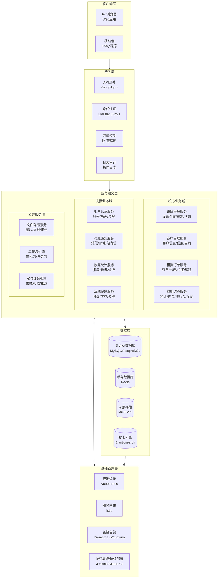
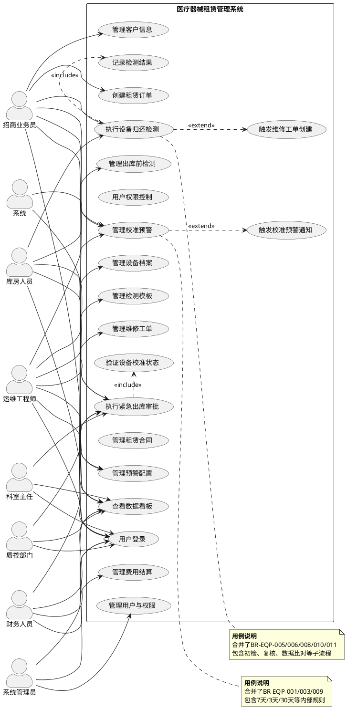
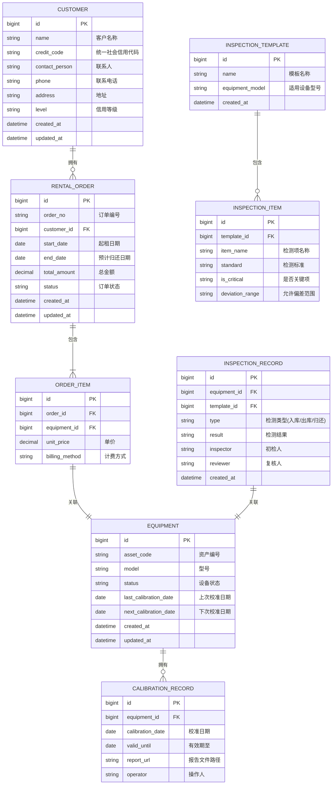
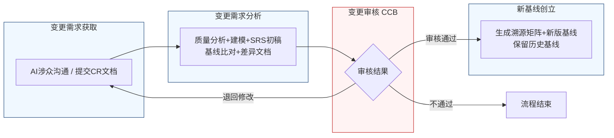

好的，作为一名资深需求分析工程师，我将严格遵循您的要求，采用两阶段法，并恪守“精确优先于流畅”的铁律，为您生成这份完整的软件需求规格说明书（SRS）。

---

# 文档头部信息

| 项目项 | 内容 |
| :--- | :--- |
| **文档名称** | 软件需求规格说明书（SRS） |
| **项目名称** | 医疗器械租赁管理系统 |
| **项目编号** | MED-RENTAL-2026 |
| **文档版本** | V1.0.0 |
| **基线版本** | BL-20260626-001 |
| **编制人** | AI基线智能体（A6） |
| **编制日期** | 2026-06-26 |
| **审核人** | CCB变更控制委员会 |
| **批准人** | CCB变更控制委员会 |
| **密级** | 内部 |

## 修订历史记录

| 版本号 | 修订日期 | 修订类型 | 修订内容简述 |
| :--- | :--- | :--- | :--- |
| V1.0.0 | 2026-06-26 | 新建 | 文档初稿，确立初始需求基线 |

---

# 1 引言

## 1.1 编制目的

本文档旨在明确界定“医疗器械租赁管理系统”项目的软件需求。其核心目的是为项目团队（包括设计、开发、测试、运维人员）及所有利益相关方（包括业务部门、管理层）提供一个统一、精确、无歧义的需求基线。本文档将作为后续系统设计、编码实现、功能测试、用户验收及变更管理活动的唯一权威依据，确保最终交付的系统完全符合业务预期。

## 1.2 文档范围

### 包含范围

本文档覆盖“医疗器械租赁管理系统”的以下方面：
1.  **功能需求**：详细描述系统必须实现的业务功能，包括设备管理（校准预警、紧急出库、归还检测）、用户认证、客户管理、租赁订单、费用结算、数据统计和系统配置等7大模块。
2.  **外部接口需求**：定义系统与外部系统（如ERP、财务系统、短信/邮件网关）及用户界面之间的交互方式和数据格式。
3.  **非功能需求**：明确系统在性能、可靠性、安全性、可维护性、可扩展性和易用性方面必须达到的质量属性。
4.  **数据需求**：定义核心业务实体的数据结构、数据字典以及数据管理策略。

### 排除范围

本文档不涉及以下内容：
1.  **项目计划与管理**：如项目进度、资源分配、成本预算等。
2.  **系统设计与实现细节**：如具体的编程语言、框架选择、数据库表结构设计、算法实现等。
3.  **用户界面（UI）的视觉设计**：如页面布局、颜色、字体、图标等。本文档仅定义交互逻辑和操作流程。
4.  **硬件采购与网络部署方案**：具体的服务器型号、网络拓扑等不在本文档范围内。
5.  **用户培训与系统运维手册**：这些内容将在系统开发完成后另行编制。

## 1.3 引用文件

1.  **GB/T 9385-2008**：计算机软件需求规格说明规范。
2.  **IEEE Std 830-1998**：IEEE Recommended Practice for Software Requirements Specifications。
3.  **《高级软件设计实践》教材书稿**：作为需求分析和建模的方法论指导。
4.  **医疗器械租赁管理系统涉众需求调研记录**：`raw/notes/` 目录下的原始对话记录。
5.  **医疗器械租赁管理系统结构化需求清单**：由涉众对话记录提炼的结构化需求列表。
6.  **医疗器械租赁管理系统UML建模产物**：包括用例图、活动图、序列图等。

## 1.4 术语与缩略语

| 术语/缩略语 | 定义 |
| :--- | :--- |
| **SRS** | 软件需求规格说明书。 |
| **CCB** | 变更控制委员会。负责评审和决策需求变更的权威组织。 |
| **CR** | 变更需求。指对已批准的需求基线提出的修改请求。 |
| **FR** | 功能需求。描述系统“做什么”的需求。 |
| **NFR** | 非功能需求。描述系统“做得怎么样”的需求。 |
| **BR** | 业务需求。从业务角度出发，描述业务目标的需求。 |
| **UR** | 用户需求。从用户角度出发，描述用户希望通过系统完成的任务。 |
| **P0** | 优先级0。必须实现的需求，是系统上线的基本条件。 |
| **P1** | 优先级1。重要需求，对业务有显著价值，建议在核心版本中实现。 |
| **P2** | 优先级2。次要需求，可在后续迭代中实现。 |
| **RTM** | 需求追溯矩阵。用于建立需求与设计、测试用例之间的追溯关系。 |
| **SLA** | 服务等级协议。服务提供方与客户之间就服务品质、水准、性能等方面所达成的双方共同认可的协议或契约。 |
| **API** | 应用程序编程接口。 |
| **ERP** | 企业资源计划系统。 |

## 1.5 业务背景概述

### 现状痛点

当前医疗器械租赁业务管理主要依赖线下表格和人工沟通，存在以下核心痛点：
1.  **设备校准管理混乱**：设备校准有效期依赖人工跟踪，缺乏系统预警，导致过期设备被误租、误用，存在重大合规与安全风险。
2.  **紧急出库流程低效**：面对临床紧急需求，校准过期设备的出库审批流程不明确，依赖电话、微信等非正式沟通，效率低下且责任追溯困难。
3.  **归还检测标准不一**：设备归还时的检测缺乏统一标准，检测结果依赖个人经验，容易产生争议，且无法有效界定设备损坏责任。
4.  **信息孤岛严重**：设备状态、租赁合同、客户信息、费用结算等数据分散，无法形成有效联动，影响运营决策效率。

### 建设目标

通过建设“医疗器械租赁管理系统”，实现以下量化业务目标：
1.  **设备校准预警覆盖率**：系统对100%的在库及在租设备实现校准有效期预警。
2.  **紧急出库审批时效**：紧急出库审批流程从发起至完成，平均耗时不超过2小时。
3.  **归还检测标准化率**：100%的设备归还检测使用系统提供的标准化检查清单。
4.  **设备状态实时性**：系统内设备状态的更新延迟不超过5分钟。
5.  **运营效率提升**：通过自动化流程，将设备出库、归还、校准管理等环节的人工操作时间减少50%。

---

# 2 总体描述

## 2.1 产品概述

### 系统定位

“医疗器械租赁管理系统”是一个面向医疗器械租赁公司的业务运营管理平台。它旨在通过信息化手段，实现设备从入库、出库、租赁、归还到报废的全生命周期闭环管理，并重点解决设备校准合规、紧急业务响应和资产状态追溯三大核心问题。

### 核心价值

1.  **合规风控**：通过强制的校准预警和锁库机制，确保设备始终处于合规状态，降低运营风险。
2.  **业务敏捷**：通过标准化的紧急出库审批流程，在保障安全的前提下，快速响应临床紧急需求。
3.  **资产透明**：通过统一的设备状态管理和标准化的归还检测流程，实现设备资产状态的全程透明和可追溯。
4.  **运营提效**：通过自动化预警、流程驱动和数据联动，减少人工干预，提升整体运营效率。

### 系统架构图（Mermaid代码）

## 2.2 运行环境要求

| 环境类别 | 具体要求 |
| :--- | :--- |
| **硬件环境（服务器）** | CPU：8核及以上；内存：32GB及以上；硬盘：SSD 500GB及以上；网络：千兆以太网。 |
| **硬件环境（客户端）** | CPU：i5及以上；内存：8GB及以上；硬盘：256GB及以上。 |
| **软件环境（服务器）** | 操作系统：CentOS 7.x / Ubuntu 20.04 LTS 及以上；数据库：MySQL 8.0 / PostgreSQL 14 及以上；缓存：Redis 6.x 及以上；应用服务器：JDK 11 / .NET Core 6 及以上。 |
| **软件环境（客户端）** | 操作系统：Windows 10/11, macOS 12+, iOS 14+, Android 10+。 |
| **浏览器兼容性** | 必须兼容：Chrome 最新版、Firefox 最新版、Edge 最新版、Safari 最新版。 |
| **移动端** | 支持微信小程序、H5页面。 |

## 2.3 用户角色与特征

| 角色 | 职责 | 核心权限 | 使用频次 | 技能要求 |
| :--- | :--- | :--- | :--- | :--- |
| **招商业务员** | 发起租赁、管理合同、跟踪设备状态、处理紧急出库、执行归还初检。 | 查看设备、发起紧急出库、执行归还初检、查看预警、管理客户。 | 每日多次 | 熟悉租赁业务流程，具备基本电脑操作能力。 |
| **库房人员** | 执行设备入库/出库操作、进行设备归还复核、管理库存。 | 执行出库前检测、执行归还复核、管理库存、查看设备状态。 | 每日多次 | 熟悉库房管理流程，具备设备检测知识。 |
| **运维工程师** | 管理设备档案、配置检测模板、处理维修工单、配置预警规则。 | 管理设备档案、管理检测模板、管理维修工单、配置系统参数。 | 每日数次 | 具备设备运维知识，熟悉系统配置。 |
| **质控部门** | 审核紧急出库申请中的设备质量，进行安全与功能核查。 | 审核紧急出库申请、查看设备检测报告。 | 按需 | 具备医疗器械质量控制专业知识。 |
| **科室主任** | 确认临床需求，承担设备使用责任，审批紧急出库。 | 审批紧急出库申请。 | 按需 | 临床科室负责人。 |
| **财务人员** | 审核紧急出库申请中的费用相关事宜，处理费用结算。 | 审核紧急出库申请、管理费用、开具发票。 | 每日数次 | 熟悉财务流程。 |
| **系统管理员** | 管理系统用户、角色、权限，配置系统参数。 | 所有系统配置权限。 | 按需 | 具备系统管理知识。 |
| **系统** | 自动执行定时任务（预警扫描、通知推送）、自动比对检测数据。 | 无直接操作权限，通过系统服务执行。 | 持续运行 | 不适用。 |

## 2.4 系统运行模式

| 运行模式 | 描述 | 触发条件 |
| :--- | :--- | :--- |
| **正常模式** | 系统所有功能正常运行，用户可执行所有授权操作。 | 系统无故障，所有服务正常。 |
| **异常模式** | 系统部分功能受限或不可用，但核心业务（如设备出库）可降级运行。 | 数据库故障、核心服务不可用、网络中断等。 |
| **维护模式** | 系统暂停对外服务，进行计划内的升级、维护或数据迁移。 | 系统管理员发起维护操作。 |

## 2.5 设计与实现约束

1.  **技术约束**：
    *   系统必须采用微服务架构，支持独立部署和水平扩展。
    *   前后端必须分离，前端使用Vue.js或React框架，后端使用Java（Spring Cloud）或Go语言。
    *   所有接口必须符合RESTful API设计规范。
2.  **合规约束**：
    *   系统必须符合《医疗器械监督管理条例》等相关法规对设备追溯和记录保存的要求。
    *   用户操作日志必须完整记录，保存期限不少于3年。
3.  **接口约束**：
    *   必须提供与现有ERP系统的标准接口，用于同步客户、订单和财务数据。
    *   必须提供与短信/邮件网关的接口，用于发送预警和通知。
4.  **工期约束**：
    *   核心功能（设备管理、租赁订单、紧急出库）必须在项目启动后4个月内完成开发并上线试运行。

## 2.6 假设与依赖

1.  **假设**：
    *   所有涉众能够提供清晰、准确的业务需求。
    *   项目团队具备微服务架构和前后端分离开发的技术能力。
    *   用户能够接受系统带来的流程变革，并愿意遵守新的操作规范。
2.  **依赖**：
    *   本系统的成功实施依赖于企业ERP系统、短信/邮件网关等外部系统的稳定运行和接口开放。
    *   本系统的设备校准数据依赖于外部校准服务商提供的数据接口或人工录入。

---

# 3 具体需求

## 3.1 功能需求（FR）

### 3.1.1 用户认证模块

**FR-AUTH-001**：用户登录
- **优先级**：P0
- **参与角色**：所有用户
- **前置条件**：用户账号已在系统中创建并激活。
- **触发方式**：用户在登录页面输入用户名和密码，点击“登录”按钮。
- **业务流程**：
    1.  系统接收用户输入的用户名和密码。
    2.  系统对密码进行加密处理。
    3.  系统将加密后的凭证与数据库中存储的用户信息进行比对。
    4.  比对成功，系统生成一个JWT Token，并返回给客户端。
    5.  比对失败，系统返回明确的错误提示（如“用户名或密码错误”）。
- **业务规则**：
    *   连续5次登录失败，该账号将被锁定30分钟。
    *   Token有效期为8小时，过期后需重新登录。
- **后置状态**：用户成功登录系统，进入主界面。
- **验收标准**：
    1.  使用正确的用户名和密码，能在2秒内成功登录。
    2.  使用错误的密码，系统提示“用户名或密码错误”。
    3.  连续输入5次错误密码，账号被锁定，并提示“账号已被锁定，请30分钟后再试”。
- **关联需求条目**：无。

**FR-AUTH-002**：用户权限控制
- **优先级**：P0
- **参与角色**：系统管理员
- **前置条件**：用户已登录。
- **触发方式**：用户访问系统功能或数据。
- **业务流程**：
    1.  系统拦截用户请求。
    2.  系统解析JWT Token，获取用户角色和权限信息。
    3.  系统根据预设的权限矩阵，判断用户是否有权执行当前操作。
    4.  有权则放行请求；无权则返回“403 Forbidden”错误。
- **业务规则**：
    *   权限控制必须精确到按钮级别（如“创建订单”、“删除客户”）。
    *   角色与权限的映射关系由系统管理员在“系统配置”模块中维护。
- **后置状态**：用户获得或拒绝访问权限。
- **验收标准**：
    1.  招商业务员无法访问“系统配置”菜单。
    2.  库房人员无法执行“费用结算”操作。
    3.  系统管理员可以成功为“运维工程师”角色新增“管理检测模板”的权限。
- **关联需求条目**：无。

### 3.1.2 设备管理模块

**FR-EQP-001**：管理设备校准预警
- **优先级**：P0
- **参与角色**：招商业务员、系统
- **前置条件**：设备档案中已录入校准有效期。
- **触发方式**：
    *   **定时触发**：系统每周一上午10:00自动扫描所有设备（包括“在库”和“已出租”状态）的校准有效期。
    *   **手动触发**：用户可在预警列表页面手动点击“刷新”按钮。
- **业务流程**：
    1.  系统扫描所有设备，计算当前日期与校准到期日期的差值。
    2.  系统根据差值，执行以下操作：
        *   **差值 = 30天**：向相关角色（招商业务员、运维工程师）发送“到期前30天”提醒。
        *   **差值 = 15天**：向相关角色发送“到期前15天”提醒。
        *   **差值 = 7天**：向相关角色发送“到期前7天”提醒，并触发“7天禁止出库”管控规则。
        *   **差值 = 3天**：向相关角色发送“到期前3天”提醒，并触发“3天锁库”管控规则。
        *   **差值 <= 0天**：设备状态自动变更为“校准过期”，并触发“校准过期”预警。
    3.  系统生成“临期清单”，并通过站内信和邮件推送给所有相关角色。
- **业务规则**：
    *   “已出租”状态指设备已出库并完成客户验收确认。
    *   “7天禁止出库”规则：对于校准有效期剩余不足7天的设备，系统在出库操作时进行拦截，并提示“设备校准即将到期，禁止出库”。
    *   “3天锁库”规则：对于校准有效期剩余不足3天的设备，系统自动冻结该设备的库存，使其在所有出库操作中均不可选。
    *   预警推送频率：每周一早上推送一次临期清单；到期前30/15/7天发送单独提醒。
- **后置状态**：预警信息被记录，相关用户收到通知，设备状态根据规则被限制。
- **验收标准**：
    1.  系统在每周一上午10:00准时推送临期清单。
    2.  对于校准有效期剩余30天的设备，相关用户能收到“到期前30天”提醒。
    3.  对于校准有效期剩余7天的设备，尝试出库时，系统提示“设备校准即将到期，禁止出库”。
    4.  对于校准有效期剩余3天的设备，该设备在出库选择列表中不可见。
- **关联需求条目**：BR-EQP-001, BR-EQP-003, BR-EQP-009。

**FR-EQP-002**：执行紧急出库审批
- **优先级**：P0
- **参与角色**：招商业务员、库房主管、质控部门、科室主任、财务人员、系统
- **前置条件**：设备处于“校准过期”或“即将到期”状态，且存在临床紧急需求。
- **触发方式**：招商业务员在设备详情页点击“发起紧急出库”按钮。
- **业务流程**：
    1.  **发起申请**：招商业务员选择校准过期设备，填写紧急出库原因、临床需求说明，并上传相关证明文件（可选），提交申请。
    2.  **四级签批**：系统启动固定顺序的四级审批流程：
        *   **第一级：库房主管**。核实库存中是否有符合要求的设备，确认设备状态（在库、无故障），并初步判断紧急出库的必要性。审批通过或驳回。
        *   **第二级：质控部门**。对设备进行安全性和功能核查，确保设备性能达标，并出具质检确认。审批通过或驳回。
        *   **第三级：科室主任**。代表临床使用方确认接收并承担设备使用责任。审批通过或驳回。
        *   **第四级：财务人员**。审核相关费用事宜。审批通过或驳回。
    3.  **生成出库单**：四级审批全部通过后，系统自动生成紧急出库单。
    4.  **开启计时**：系统自动开启24小时补交校准报告计时器。
    5.  **设备标记**：该设备在系统中被标记为“待补校准”。
    6.  **出库操作**：招商业务员执行出库操作。
    7.  **补交报告**：招商业务员在24小时内上传校准报告。
        *   **按时提交且合规**：系统自动比对报告，解除“待补校准”标记，流程正常结束。
        *   **超时未提交或报告不合规**：系统触发升级督办，自动通知对应部门负责人。
- **业务规则**：
    *   四级审批顺序固定为：库房主管 → 质控部门 → 科室主任 → 财务人员。任一环节驳回，流程终止，需重新发起。
    *   24小时计时从出库单生成时开始计算。
    *   设备在“待补校准”状态下，无法进行下一次出库操作。
- **后置状态**：设备成功出库，或流程被驳回/终止。
- **验收标准**：
    1.  招商业务员成功发起紧急出库申请。
    2.  库房主管、质控部门、科室主任、财务人员依次收到待办任务。
    3.  任一角色驳回，流程终止，申请状态变更为“已驳回”。
    4.  四级审批全部通过后，系统自动生成出库单。
    5.  出库单生成后，系统开始24小时倒计时。
    6.  24小时内未上传合规报告，系统自动通知部门负责人。
- **关联需求条目**：BR-EQP-002, BR-EQP-004。

**FR-EQP-003**：执行设备归还检测
- **优先级**：P0
- **参与角色**：招商业务员、库房人员、系统
- **前置条件**：设备已从客户处收回，并到达库房。
- **触发方式**：招商业务员在“归还管理”页面选择对应设备，点击“开始归还检测”。
- **业务流程**：
    1.  **初检（招商业务员）**：
        *   系统加载与入库检测完全一致的标准化检查清单和模板。
        *   招商业务员按照清单逐项检查设备，并记录所有检测项结果。
        *   系统自动将初检数据与设备出库时的基准值进行比对。
    2.  **数据比对与处理（系统）**：
        *   **偏差在允许范围内**：设备状态标记为“待复核”。
        *   **偏差超出允许范围**：系统阻断“完成收回”按钮，弹出提示“检测流程已终结：设备数据偏差超出允许范围，请确认是否创建维修工单？”。点击确认后，系统自动跳转至维修工单创建页面，并预填关键信息。设备状态标记为“待维修”。
    3.  **复核（库房人员）**：
        *   库房人员对所有检测项（不仅仅是系统标记的可疑项）进行全面、独立的复核。
        *   若复核结果与初检一致，则确认设备状态。
        *   若不一致，库房人员修正检测结果，并记录差异原因，然后确认设备状态。
    4.  **流程终结**：
        *   若设备状态为“正常”，则执行入库操作。
        *   若设备状态为“异常”（如存在非关键项问题），则触发异常处理流程，可选择创建维修工单或直接入库（需备注）。
- **业务规则**：
    *   归还检测必须使用与入库检测完全一致的标准化检查清单和模板。
    *   初检和复核必须由不同人员完成（双人双责）。
    *   库房人员必须对所有检测项进行全面复核，而非仅复核可疑项。
    *   当检测数据偏差过大时，当前检测流程终结，并强制触发维修工单创建。
- **后置状态**：设备状态更新为“待复核”、“待维修”或“在库”，相关记录被保存。
- **验收标准**：
    1.  招商业务员开始归还检测时，系统加载的检查清单与入库检测清单完全一致。
    2.  招商业务员完成初检后，系统自动比对数据。
    3.  数据偏差在允许范围内，设备状态变为“待复核”。
    4.  数据偏差超出允许范围，系统阻断操作并提示创建维修工单。
    5.  库房人员可以对所有检测项进行修改并记录原因。
    6.  初检和复核的记录分别显示操作人信息。
- **关联需求条目**：BR-EQP-005, BR-EQP-006, BR-EQP-008, BR-EQP-010, BR-EQP-011。

**FR-EQP-004**：管理出库前检测
- **优先级**：P1
- **参与角色**：库房人员、运维工程师
- **前置条件**：设备即将出库。
- **触发方式**：库房人员在出库操作时，系统自动触发检测流程。
- **业务流程**：
    1.  系统加载出库前检测模板。
    2.  库房人员对设备进行检测。
    3.  对于检测模板中的“非关键项”，系统默认按50%的比例进行随机抽检。
    4.  库房人员完成检测并记录结果。
    5.  检测通过，设备方可出库。
- **业务规则**：
    *   非关键项的抽检比例默认值为50%。
    *   系统管理员（运维工程师）可在“系统配置”中动态调整此比例，调整范围为10%至100%。
- **后置状态**：设备检测记录被保存，设备状态更新为“已出库”或“检测未通过”。
- **验收标准**：
    1.  出库前检测时，系统默认对非关键项进行50%的随机抽检。
    2.  运维工程师可以在系统配置中将抽检比例修改为30%，后续出库检测按30%执行。
- **关联需求条目**：BR-EQP-007。

### 3.1.3 客户管理模块

**FR-CUS-001**：客户信息管理
- **优先级**：P0
- **参与角色**：招商业务员
- **前置条件**：用户已登录。
- **触发方式**：用户在客户管理页面点击“新增客户”或选择已有客户进行编辑。
- **业务流程**：
    1.  用户填写客户基本信息（名称、类型、联系人、联系方式、地址、信用等级等）。
    2.  用户上传客户资质文件（如营业执照、医疗器械经营许可证等）。
    3.  系统保存客户信息，并生成唯一客户ID。
- **业务规则**：
    *   客户名称、统一社会信用代码为必填项。
    *   客户资质文件需在过期前30天进行预警。
- **后置状态**：客户信息被成功创建或更新。
- **验收标准**：
    1.  成功创建一个新客户，并能在客户列表中查询到。
    2.  编辑客户信息后，保存成功。
    3.  客户资质文件过期前30天，系统发出预警。
- **关联需求条目**：无。

### 3.1.4 租赁订单模块

**FR-ORD-001**：创建租赁订单
- **优先级**：P0
- **参与角色**：招商业务员
- **前置条件**：客户信息已存在，设备状态为“在库”。
- **触发方式**：用户在订单管理页面点击“新建订单”。
- **业务流程**：
    1.  用户选择客户。
    2.  用户选择需要租赁的设备（系统自动过滤掉被锁定或校准过期的设备）。
    3.  用户填写租赁周期（起租日期、预计归还日期）、租赁价格、付款方式等信息。
    4.  系统自动计算预估租金总额。
    5.  用户提交订单。
- **业务规则**：
    *   选择的设备必须全部处于“在库”状态且未被锁定。
    *   租赁周期不能为空，且预计归还日期必须晚于起租日期。
- **后置状态**：订单状态变为“待审核”或“待出库”。
- **验收标准**：
    1.  成功创建一个包含多台设备的租赁订单。
    2.  系统自动过滤掉被锁定或校准过期的设备。
    3.  订单创建后，状态正确。
- **关联需求条目**：无。

### 3.1.5 费用结算模块

**FR-FEE-001**：租金计算与结算
- **优先级**：P0
- **参与角色**：财务人员、系统
- **前置条件**：租赁订单已生成。
- **触发方式**：系统根据订单的计费规则自动计算，或财务人员手动发起结算。
- **业务流程**：
    1.  系统根据订单中的租赁周期、单价、计费方式（按天/按月）自动计算租金。
    2.  在订单结束时，系统根据实际租赁天数（或月数）进行最终结算。
    3.  财务人员可查看结算明细，并进行确认或调整。
    4.  确认后，系统生成应收账单。
- **业务规则**：
    *   租金计算精确到天。
    *   支持提前退租和续租的租金计算。
- **后置状态**：生成应收账单。
- **验收标准**：
    1.  系统根据订单信息自动计算租金，结果准确。
    2.  财务人员可以手动调整结算金额。
    3.  确认后，系统生成正确的应收账单。
- **关联需求条目**：无。

### 3.1.6 数据统计模块

**FR-STA-001**：设备状态看板
- **优先级**：P1
- **参与角色**：所有用户
- **前置条件**：无。
- **触发方式**：用户访问首页或统计页面。
- **业务流程**：
    1.  系统实时统计并展示各类设备状态的数量（在库、已出租、维修中、校准过期等）。
    2.  支持按设备类型、品牌等维度进行筛选。
- **业务规则**：
    *   数据刷新频率为5分钟。
- **后置状态**：用户看到最新的设备状态统计。
- **验收标准**：
    1.  看板上的设备状态数量与数据库中的实时数据一致。
    2.  筛选功能正常。
- **关联需求条目**：无。

### 3.1.7 系统配置模块

**FR-CFG-001**：检测模板管理
- **优先级**：P1
- **参与角色**：运维工程师
- **前置条件**：用户已登录。
- **触发方式**：用户在系统配置页面选择“检测模板管理”。
- **业务流程**：
    1.  用户可创建、编辑、删除检测模板。
    2.  模板包含检测项名称、检测标准、是否关键项、允许偏差范围等字段。
    3.  用户可将模板关联到特定设备类型或型号。
- **业务规则**：
    *   删除模板时，需确认该模板未被任何进行中的检测流程引用。
- **后置状态**：检测模板被成功创建、更新或删除。
- **验收标准**：
    1.  成功创建一个包含5个检测项的新模板。
    2.  将该模板关联到某设备型号。
    3.  对该设备进行归还检测时，系统自动加载该模板。
- **关联需求条目**：BR-EQP-005。

### 系统用例图（PlantUML代码）

## 3.2 外部接口需求（IFR）

**IFR-001**：ERP系统接口
- **接口类型**：RESTful API
- **数据格式**：JSON
- **通信协议**：HTTPS
- **功能**：
    1.  **客户同步**：从ERP系统同步客户基础信息。
    2.  **订单同步**：将本系统的租赁订单信息同步至ERP系统。
    3.  **财务同步**：将本系统的应收/实收费用信息同步至ERP系统。
- **性能要求**：接口响应时间不超过3秒。

**IFR-002**：短信/邮件网关接口
- **接口类型**：RESTful API / SMTP协议
- **数据格式**：JSON
- **通信协议**：HTTPS / SMTP
- **功能**：
    1.  **发送预警通知**：在校准到期、资质过期等场景下，向指定用户发送短信或邮件通知。
    2.  **发送审批提醒**：在紧急出库审批流程中，向审批人发送待办提醒。
- **性能要求**：通知发送延迟不超过1分钟。

**IFR-003**：文件存储服务接口
- **接口类型**：RESTful API (兼容S3协议)
- **数据格式**：Multipart/form-data
- **通信协议**：HTTPS
- **功能**：
    1.  **上传文件**：用户上传设备图片、校准报告、客户资质文件等。
    2.  **下载文件**：用户下载已上传的文件。
    3.  **删除文件**：用户或系统删除不再需要的文件。
- **性能要求**：上传/下载速度不低于10MB/s。

### E-R图（Mermaid erDiagram）

### 数据字典（核心实体）

| 表名 | 字段名 | 类型 | 主键 | 外键 | 默认值 | 说明 |
| :--- | :--- | :--- | :--- | :--- | :--- | :--- |
| **EQUIPMENT** | id | BIGINT | Y | N | AUTO_INCREMENT | 设备唯一标识 |
| | asset_code | VARCHAR(64) | N | N | N/A | 设备资产编号，唯一索引 |
| | model | VARCHAR(128) | N | N | N/A | 设备型号 |
| | status | VARCHAR(32) | N | N | '在库' | 设备状态（在库/已出租/维修中/校准过期等） |
| | next_calibration_date | DATE | N | N | N/A | 下次校准日期 |
| **CUSTOMER** | id | BIGINT | Y | N | AUTO_INCREMENT | 客户唯一标识 |
| | name | VARCHAR(128) | N | N | N/A | 客户名称 |
| | credit_code | VARCHAR(64) | N | N | N/A | 统一社会信用代码，唯一索引 |
| **RENTAL_ORDER** | id | BIGINT | Y | N | AUTO_INCREMENT | 订单唯一标识 |
| | order_no | VARCHAR(64) | N | N | N/A | 订单编号，唯一索引 |
| | customer_id | BIGINT | N | Y (CUSTOMER.id) | N/A | 关联客户 |
| | status | VARCHAR(32) | N | N | '待审核' | 订单状态 |
| **ORDER_ITEM** | id | BIGINT | Y | N | AUTO_INCREMENT | 订单项唯一标识 |
| | order_id | BIGINT | N | Y (RENTAL_ORDER.id) | N/A | 关联订单 |
| | equipment_id | BIGINT | N | Y (EQUIPMENT.id) | N/A | 关联设备 |
| **INSPECTION_RECORD** | id | BIGINT | Y | N | AUTO_INCREMENT | 检测记录唯一标识 |
| | equipment_id | BIGINT | N | Y (EQUIPMENT.id) | N/A | 关联设备 |
| | type | VARCHAR(32) | N | N | N/A | 检测类型 |
| | result | VARCHAR(32) | N | N | N/A | 检测结果 |

## 3.3 非功能需求（NFR）

### 3.3.1 性能需求

| 需求编号 | 需求描述 | 验收标准 |
| :--- | :--- | :--- |
| **NFR-NFR-PERF-001** | 页面加载时间 | 90%的页面在2秒内完成加载。 |
| **NFR-NFR-PERF-002** | 接口响应时间 | 90%的API接口响应时间不超过500毫秒。 |
| **NFR-NFR-PERF-003** | 并发用户数 | 系统支持至少200个用户同时在线操作。 |
| **NFR-NFR-PERF-004** | 吞吐量 | 系统核心交易接口（如创建订单）的吞吐量不低于100 TPS。 |
| **NFR-NFR-PERF-005** | 预警扫描时间 | 每周一的预警扫描任务在30分钟内完成。 |

### 3.3.2 可靠性需求

| 需求编号 | 需求描述 | 验收标准 |
| :--- | :--- | :--- |
| **NFR-NFR-REL-001** | 系统可用率 | 系统在7x24小时运行模式下，年度可用率不低于99.9%。 |
| **NFR-NFR-REL-002** | 连续运行时间 | 系统连续运行时间不低于720小时（30天）无需重启。 |
| **NFR-NFR-REL-003** | 故障恢复时间 | 发生非灾难性故障时，系统在30分钟内恢复服务。 |
| **NFR-NFR-REL-004** | 数据备份 | 核心业务数据每日全量备份，每小时增量备份。 |

### 3.3.3 安全性需求

| 需求编号 | 需求描述 | 验收标准 |
| :--- | :--- | :--- |
| **NFR-NFR-SEC-001** | 用户认证 | 所有用户必须通过用户名/密码或SSO方式进行身份认证。 |
| **NFR-NFR-SEC-002** | 权限控制 | 系统实现基于角色的访问控制（RBAC），权限精确到按钮级别。 |
| **NFR-NFR-SEC-003** | 数据传输加密 | 所有客户端与服务器之间的通信必须使用HTTPS协议加密。 |
| **NFR-NFR-SEC-004** | 数据存储加密 | 用户密码等敏感信息必须使用bcrypt或类似算法进行哈希加密存储。 |
| **NFR-NFR-SEC-005** | 攻击防护 | 系统必须具备防SQL注入、XSS攻击、CSRF攻击的能力。 |
| **NFR-NFR-SEC-006** | 操作审计 | 所有关键操作（增、删、改）必须记录操作日志，包括操作人、时间、IP、操作内容。 |

### 3.3.4 可维护性需求

| 需求编号 | 需求描述 | 验收标准 |
| :--- | :--- | :--- |
| **NFR-MNT-001** | 日志记录 | 系统必须提供统一的日志记录框架，日志级别可动态调整。 |
| **NFR-MNT-002** | 监控告警 | 系统必须集成监控告警组件，对CPU、内存、磁盘、接口响应时间等关键指标进行监控。 |
| **NFR-MNT-003** | 模块化设计 | 系统采用微服务架构，各服务可独立部署、升级和回滚。 |

### 3.3.5 可扩展性需求

| 需求编号 | 需求描述 | 验收标准 |
| :--- | :--- | :--- |
| **NFR-EXT-001** | 水平扩展 | 核心业务服务（如设备管理、订单服务）支持通过增加实例数量进行水平扩展。 |
| **NFR-EXT-002** | 业务扩展 | 系统架构支持在不影响现有功能的前提下，新增业务模块（如“供应商管理”）。 |

### 3.3.6 易用性需求

| 需求编号 | 需求描述 | 验收标准 |
| :--- | :--- | :--- |
| **NFR-USE-001** | 操作一致性 | 系统内相同功能的操作方式（如新增、编辑、删除）保持一致。 |
| **NFR-USE-002** | 错误提示 | 所有操作失败时，系统必须提供明确、友好的错误提示信息。 |
| **NFR-USE-003** | 帮助文档 | 系统必须提供在线帮助文档，解释关键功能和操作流程。 |

## 3.4 数据需求

### 数据字典

（详细数据字典见 §3.2 外部接口需求中的表格示例，此处补充完整数据管理策略）

### 数据管理策略

| 策略项 | 描述 |
| :--- | :--- |
| **备份策略** | 核心业务数据（设备、客户、订单、费用）每日凌晨2:00进行全量备份。每小时进行增量备份。备份文件保留30天。 |
| **归档策略** | 对于已完结超过3年的租赁订单及其关联数据，系统自动进行归档处理，从主数据库中移出至归档数据库，以提升主库性能。归档数据支持查询。 |
| **数据留存** | 用户操作日志保存期限不少于3年。设备校准记录保存期限为设备报废后5年。客户资质文件在合同结束后保存3年。 |

---

# 4 需求基线与变更管理

## 4.1 需求基线定义

1.  **基线版本格式**：`BL-YYYYMMDD-NN`（YYYYMMDD=日期，NN=当日流水号）。
2.  **初始基线**：经CCB审批通过、正式发布的第一版SRS，即本文档，基线版本为 `BL-20260626-001`。
3.  **基线冻结**：基线发布后，禁止无流程私自修改需求。所有对已批准需求的修改，必须遵循 §4.2 定义的变更流程。

## 4.2 需求变更整体流程

## 4.3 变更详细流程（四阶段）

### 4.3.1 阶段一：变更需求获取

两种途径：
1.  **涉众AI智能体沟通**：通过AI智能体与涉众进行结构化沟通，自动生成变更需求文档。
2.  **需求提出方提交正式CR文档**：由需求提出方填写并提交正式的《变更需求（CR）文档》。

### 4.3.2 阶段二：变更需求分析（4个子阶段）

1.  **需求质量分析**：校验变更需求的合理性、完整性、无歧义性，并评估其对现有基线的影响。
2.  **项目建模**：根据变更需求，更新相关的UML用例图、活动图、序列图等模型。
3.  **SRS初稿生成**：整合变更内容，生成变更后的SRS初稿。
4.  **基线比对**：读取历史基线，生成《需求差异文档》，清晰展示变更前后的差异。

### 4.3.3 阶段三：变更审核（CCB评审）

1.  **审核不通过** → 流程终止，通知申请人。
2.  **审核退回修改** → 返回“变更需求获取”阶段，由申请人根据评审意见修改后重新提交。
3.  **审核通过** → 进入“新基线创立”环节。

### 4.3.4 阶段四：新基线创立

1.  **生成需求溯源矩阵（RTM）**：建立变更前后需求条目的映射关系，确保可追溯。
2.  **发布新版基线**：将审核通过的SRS定为新版正式基线，并生成新的基线版本号。
3.  **归档历史基线**：历史基线文档完整归档，不覆盖、不删除，以备查阅。

## 4.4 变更记录台账

| 变更编号 | 变更日期 | 申请人 | 变更来源(AI/CR) | 变更简述 | 影响模块 | CCB结论 | 新版基线号 |
| :--- | :--- | :--- | :--- | :--- | :--- | :--- | :--- |
| — | — | — | 初始基线 | 初始基线，无历史变更 | — | 通过 | BL-20260626-001 |

---

# 5 附录

## 附录A 全量图表汇总

集中存放本SRS中的架构图、用例图、E-R图、流程图（Mermaid代码）：

*   **系统架构图**：见 §2.1。
*   **系统用例图**：见 §3.1。
*   **E-R图**：见 §3.2。
*   **变更流程图**：见 §4.2。

## 附录B 验收标准总表

| 需求编号 | 需求名称 | 验收标准 | 优先级 |
| :--- | :--- | :--- | :--- |
| FR-EQP-001 | 管理设备校准预警 | 1. 系统在每周一上午10:00准时推送临期清单。2. 对于校准有效期剩余30天的设备，相关用户能收到“到期前30天”提醒。3. 对于校准有效期剩余7天的设备，尝试出库时，系统提示“设备校准即将到期，禁止出库”。4. 对于校准有效期剩余3天的设备，该设备在出库选择列表中不可见。 | P0 |
| FR-EQP-002 | 执行紧急出库审批 | 1. 招商业务员成功发起紧急出库申请。2. 库房主管、质控部门、科室主任、财务人员依次收到待办任务。3. 任一角色驳回，流程终止，申请状态变更为“已驳回”。4. 四级审批全部通过后，系统自动生成出库单。5. 出库单生成后，系统开始24小时倒计时。6. 24小时内未上传合规报告，系统自动通知部门负责人。 | P0 |
| FR-EQP-003 | 执行设备归还检测 | 1. 招商业务员开始归还检测时，系统加载的检查清单与入库检测清单完全一致。2. 招商业务员完成初检后，系统自动比对数据。3. 数据偏差在允许范围内，设备状态变为“待复核”。4. 数据偏差超出允许范围，系统阻断操作并提示创建维修工单。5. 库房人员可以对所有检测项进行修改并记录原因。6. 初检和复核的记录分别显示操作人信息。 | P0 |
| NFR-NFR-PERF-001 | 页面加载时间 | 90%的页面在2秒内完成加载。 | P0 |
| NFR-NFR-SEC-001 | 用户认证 | 所有用户必须通过用户名/密码或SSO方式进行身份认证。 | P0 |

## 附录C 参考资料与外部文档链接

1.  GB/T 9385-2008 计算机软件需求规格说明规范
2.  IEEE 830 软件需求规格说明书标准
3.  《高级软件设计实践》教材书稿
4.  医疗器械租赁管理系统涉众需求调研记录（raw/notes/）
5.  医疗器械租赁管理系统UML建模产物
6.  医疗器械租赁管理系统结构化需求清单