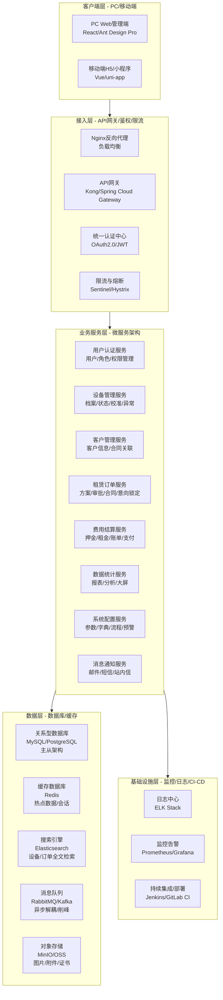
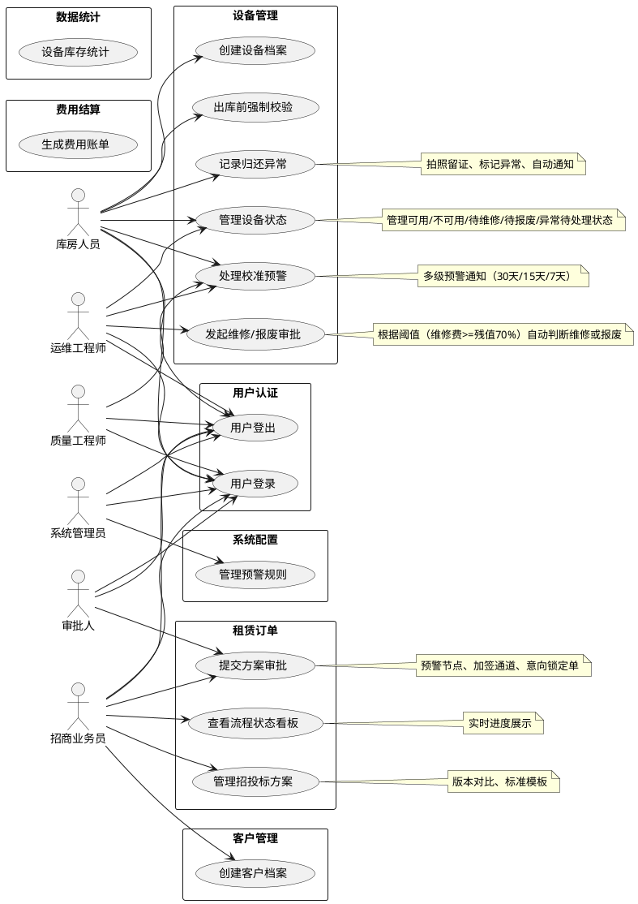
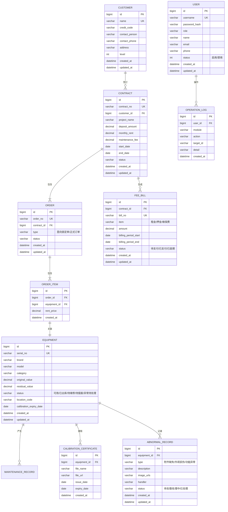
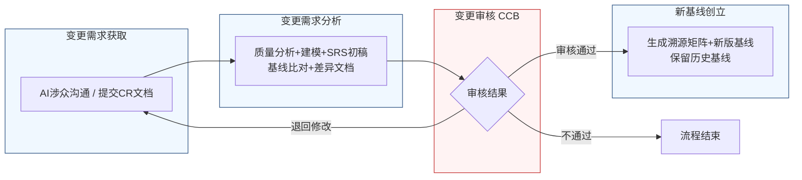

好的，作为一名资深需求分析工程师，我将严格遵循IEEE 830标准和GB/T 9385规范，并恪守“精确优先于流畅”的铁律，为您生成这份完整的软件需求规格说明书。

---
# 文档头部信息
| 项目项 | 内容 |
| ---- | ---- |
| 文档名称 | 软件需求规格说明书（SRS）|
| 项目名称 | 医疗器械租赁管理系统 |
| 项目编号 | MED-RENTAL-2026 |
| 文档版本 | V1.0.0 |
| 基线版本 | 【占位，由A6分配】|
| 编制人 | AI基线智能体（A6） |
| 编制日期 | 2026-06-26 |
| 审核人 | CCB变更控制委员会 |
| 批准人 | CCB变更控制委员会 |
| 密级 | 内部 |

## 修订历史记录
| 版本号 | 修订日期 | 修订类型 | 修订内容简述 |
| V1.0.0 | 2026-06-26 | 新建 | 文档初稿，确立初始需求基线 |

# 1 引言
## 1.1 编制目的
本软件需求规格说明书（SRS）旨在为“医疗器械租赁管理系统”（项目编号：MED-RENTAL-2026）的开发、测试、验收及后续维护提供一份完整、精确、无歧义的需求基线。本文档详细定义了系统的功能需求、非功能需求、外部接口需求及数据需求，确保项目干系人（包括但不限于产品经理、开发工程师、测试工程师、运维工程师及最终用户）对系统应具备的能力和行为达成一致的理解。本文档是项目团队进行设计、编码、测试和验收活动的唯一权威依据。

## 1.2 文档范围（包含/排除）
**包含范围：**
本SRS覆盖了“医疗器械租赁管理系统”的核心业务模块，具体包括：
1.  **用户认证与权限管理**：系统用户的登录、角色分配、权限控制。
2.  **设备管理**：设备全生命周期管理，包括档案创建、库位绑定、状态流转（可用、不可用、待维修、待报废、已出库、异常待处理）、校准预警、归还验收及异常处理。
3.  **客户管理**：客户信息管理、合同关联、历史租赁记录查询。
4.  **租赁订单管理**：从招投标方案管理、方案审批、意向锁定到正式合同生成的全流程管理，包括紧急合同处理。
5.  **费用结算**：押金、租金、维保费用、维修费用的计算、账单生成与支付管理。
6.  **数据统计**：设备库存、租赁订单、客户、费用等核心业务数据的统计与分析报表。
7.  **系统配置**：系统参数、字典、流程模板、预警规则等配置管理。

**排除范围：**
本SRS不包含以下内容：
1.  与第三方财务系统（如金蝶、用友）的直接接口设计，仅定义本系统应提供的接口数据格式。
2.  与硬件设备（如RFID读写器、条码打印机）的底层驱动开发。
3.  移动端（APP/小程序）的详细UI设计，仅定义其应提供的功能接口。
4.  系统的物理部署架构设计及网络拓扑规划。
5.  项目开发计划、测试计划及用户培训计划。

## 1.3 引用文件
1.  **GB/T 9385-2008**：计算机软件需求规格说明规范。
2.  **IEEE Std 830-1998**：IEEE Recommended Practice for Software Requirements Specifications。
3.  **《高级软件设计实践》**：教材书稿，作为需求分析与建模的方法论指导。
4.  **医疗器械租赁管理系统涉众需求调研记录**：raw/notes/ 目录下的原始访谈记录。
5.  **医疗器械租赁管理系统结构化需求清单**：由资深需求分析工程师整理的需求清单。
6.  **医疗器械租赁管理系统UML建模产物**：用例图、活动图等。

## 1.4 术语与缩略语
| 术语/缩略语 | 定义 |
| ---- | ---- |
| **SRS** | 软件需求规格说明书 |
| **CCB** | 变更控制委员会，负责审批需求变更的权威组织 |
| **CR** | 变更需求，正式提交的需求变更文档 |
| **FR** | 功能需求，描述系统应具备的功能行为 |
| **NFR** | 非功能需求，描述系统在性能、安全、可靠性等方面的属性 |
| **BR** | 业务需求，描述业务目标 |
| **UR** | 原始需求，从涉众处直接获取的未经提炼的需求 |
| **RTM** | 需求追溯矩阵，用于建立需求条目之间的关联关系 |
| **P0** | 最高优先级需求，必须实现，否则系统无法上线 |
| **P1** | 重要优先级需求，必须实现，否则核心业务无法闭环 |
| **P2** | 次要优先级需求，实现后可提升用户体验或运营效率 |
| **残值** | 设备当前账面价值，通常为原值减去累计折旧 |
| **意向锁定单** | 在方案审批阶段，为预留库存而创建的临时订单，非正式合同 |
| **加签通道** | 为紧急合同提供的快速审批路径，可并行或加速审批流程 |
| **限时标识** | 为紧急合同设置的审批时限标识，要求审批人在规定时间内反馈 |

## 1.5 业务背景概述
**现状痛点：**
当前医疗器械租赁业务依赖线下表格和人工沟通，存在以下核心痛点：
1.  **设备信息不透明**：设备档案、校准状态、附件信息分散，导致交付延迟或客户纠纷。
2.  **流程效率低下**：方案审批、设备归还验收、维修/报废判定等流程依赖人工协调，周期长、易出错。
3.  **风险控制薄弱**：校准过期、证书缺失、设备异常等问题无法被系统自动拦截，存在合规与安全风险。
4.  **库存管理混乱**：设备状态更新不及时，导致“有单无货”或“有货无单”，影响交付承诺。

**建设目标：**
建设一套统一的医疗器械租赁管理系统，实现设备全生命周期、租赁订单全流程的数字化管理。

**量化业务目标：**
1.  **设备信息准确率**：设备档案信息完整率提升至100%，库位绑定准确率提升至100%。
2.  **流程效率提升**：方案审批周期从平均5个工作日压缩至2个工作日以内；设备归还验收流程从平均2小时缩短至30分钟。
3.  **风险事件降低**：因校准过期或证书缺失导致的出库拦截事件降低90%；因设备异常导致的客户纠纷降低80%。
4.  **库存周转率提升**：设备平均闲置时间降低20%，库存数据实时准确率提升至99.9%。

# 2 总体描述
## 2.1 产品概述（系统定位、核心价值）
**系统定位：**
本系统是一套面向医疗器械租赁企业的业务管理平台，旨在通过信息化手段，整合设备、订单、客户、费用等核心业务数据，实现业务流程的标准化、自动化和智能化。

**核心价值：**
1.  **全生命周期追溯**：从设备入库到报废，从订单创建到完结，所有操作均有记录，实现端到端的透明化管理。
2.  **流程自动化驱动**：通过规则引擎和预警机制，自动触发校准提醒、异常通知、审批流程，减少人工干预。
3.  **风险智能拦截**：在关键业务节点（如出库）进行强制校验，自动识别并阻止不合规操作，保障业务安全。
4.  **决策数据支撑**：提供多维度的数据统计与分析报表，为管理层决策提供实时、准确的数据支持。

### 系统架构图（Mermaid代码）

## 2.2 运行环境要求
| 类别 | 项目 | 最低配置 | 推荐配置 |
| ---- | ---- | ---- | ---- |
| **硬件** | 应用服务器 | CPU: 4核, 内存: 16GB, 磁盘: 200GB SSD | CPU: 8核, 内存: 32GB, 磁盘: 500GB SSD |
| | 数据库服务器 | CPU: 8核, 内存: 32GB, 磁盘: 500GB SSD | CPU: 16核, 内存: 64GB, 磁盘: 1TB NVMe SSD |
| | 文件存储服务器 | CPU: 2核, 内存: 4GB, 磁盘: 2TB HDD | CPU: 4核, 内存: 8GB, 磁盘: 5TB HDD |
| **软件** | 操作系统 | CentOS 7.9+ / Ubuntu 20.04+ | CentOS 7.9+ / Ubuntu 20.04+ |
| | 应用服务器 | JDK 1.8+ (推荐JDK 11) | JDK 11+ |
| | 数据库 | MySQL 5.7+ / PostgreSQL 12+ | MySQL 8.0+ / PostgreSQL 14+ |
| | 缓存 | Redis 5.0+ | Redis 6.0+ |
| | 消息队列 | RabbitMQ 3.8+ / Kafka 2.8+ | RabbitMQ 3.10+ / Kafka 3.0+ |
| **浏览器** | PC端 | Chrome 90+, Firefox 90+, Edge 90+ | Chrome 最新版 |
| | 移动端 | 微信小程序基础库 2.20.0+ | 微信小程序基础库 最新版 |

## 2.3 用户角色与特征
| 角色 | 职责 | 核心权限 | 使用频次 | 技能要求 |
| ---- | ---- | ---- | ---- | ---- |
| **库房人员** | 设备入库、出库、归还验收、库位管理、校准管理 | 设备档案CRUD、库位绑定、状态变更、异常记录、校准预警查看 | 每日多次 | 熟悉设备型号、基本办公软件操作 |
| **运维工程师** | 设备维修、报废判定、校准管理、技术方案支持 | 设备状态变更（待维修/待报废）、维修单处理、校准记录更新 | 每日多次 | 具备设备维修、校准专业知识 |
| **招商业务员** | 客户开发、方案制定、合同签订、订单跟进 | 招投标方案CRUD、方案提交审批、意向锁定单创建、合同查看 | 每日多次 | 熟悉租赁业务流程、商务谈判能力 |
| **审批人** | 方案审批、合同审批、费用审批 | 查看待审批任务、通过/驳回/加签操作 | 每日数次 | 具备业务决策能力 |
| **质量工程师** | 设备校准、质量检查、证书管理 | 校准记录管理、证书上传、质量报告查看 | 每周数次 | 具备质量管理知识 |
| **系统管理员** | 系统配置、用户管理、权限分配、流程管理 | 系统参数配置、用户CRUD、角色权限分配、流程模板管理 | 按需 | 具备系统运维管理能力 |

## 2.4 系统运行模式
1.  **正常模式**：系统所有功能模块正常运行，所有用户可正常访问和操作系统，业务数据实时流转。
2.  **异常模式**：
    *   **部分服务不可用**：当某个微服务（如消息通知服务）发生故障时，核心业务服务（如设备管理、订单管理）应能降级运行，不影响核心业务流程的完整性。故障服务恢复后，系统应能自动重连并处理积压任务。
    *   **数据库主库故障**：系统应能自动切换至从库，提供只读服务，确保核心数据查询可用。待主库恢复后，自动切回。
    *   **网络中断**：系统应具备离线缓存能力（如移动端），在网络恢复后自动同步数据。
3.  **维护模式**：系统管理员可手动开启维护模式。在维护模式下，所有用户将被重定向至维护页面，无法进行任何业务操作。系统管理员完成维护后，关闭维护模式，系统恢复正常运行。

## 2.5 设计与实现约束
1.  **技术约束**：
    *   后端必须采用微服务架构，使用Java语言和Spring Cloud框架。
    *   前端PC端必须使用React或Vue框架，移动端必须使用uni-app或原生小程序开发。
    *   数据库必须使用MySQL或PostgreSQL，缓存必须使用Redis。
    *   所有服务间通信必须采用RESTful API或gRPC。
2.  **合规约束**：
    *   系统必须符合《医疗器械监督管理条例》等相关法规要求。
    *   系统必须满足GB/T 9385和IEEE 830标准对SRS文档的要求。
    *   所有用户操作日志必须完整记录，保留时间不少于180天。
3.  **接口约束**：
    *   所有对外API必须遵循统一的接口规范，包括请求/响应格式、错误码定义、签名机制。
    *   与第三方系统（如财务系统）的接口必须采用标准数据格式（如JSON、XML）。
4.  **工期约束**：
    *   核心功能（设备管理、租赁订单管理）必须在项目启动后3个月内完成开发并上线试运行。
    *   全部功能必须在项目启动后6个月内完成开发、测试并正式上线。

## 2.6 假设与依赖
1.  **假设**：
    *   用户具备基本的计算机操作能力，能够熟练使用浏览器或移动设备。
    *   项目所需的硬件、网络及基础软件环境能够按时到位。
    *   所有涉众能够积极配合需求调研、系统测试及上线推广工作。
2.  **依赖**：
    *   本系统的正常运行依赖于公司内部网络的稳定性和可用性。
    *   本系统的部分功能（如短信通知）依赖于第三方服务提供商的稳定性和可用性。
    *   本系统的设备数据准确性依赖于库房人员、运维工程师等一线操作人员的规范录入。

# 3 具体需求
## 3.1 功能需求（FR）
### 3.1.1 用户认证（AUTH）
**FR-AUTH-001：用户登录**
- **优先级**：P0
- **参与角色**：所有系统用户
- **前置条件**：用户已通过系统管理员创建账号。
- **触发方式**：用户在登录页面输入用户名和密码，点击“登录”按钮。
- **业务流程**：
    1.  系统接收用户输入的用户名和密码。
    2.  系统对密码进行加密处理（如BCrypt）。
    3.  系统将加密后的密码与数据库中存储的密码进行比对。
    4.  若比对成功，系统生成一个JWT Token，并将其返回给客户端。
    5.  客户端将Token存储在本地（如localStorage），并在后续请求中携带。
    6.  若比对失败，系统返回“用户名或密码错误”的提示信息。
- **业务规则**：
    *   用户名长度限制为6-20个字符，只能包含字母、数字和下划线。
    *   密码长度限制为8-32个字符，必须包含大写字母、小写字母、数字和特殊符号中的至少三种。
    *   连续5次登录失败，该账号将被锁定30分钟。
    *   Token的有效期为24小时，过期后需重新登录。
- **后置状态**：用户登录成功，系统跳转至首页；登录失败，停留在登录页面并显示错误信息。
- **验收标准**：
    1.  输入正确的用户名和密码，系统在2秒内完成验证并跳转至首页。
    2.  输入错误的用户名或密码，系统在1秒内返回“用户名或密码错误”提示。
    3.  连续5次输入错误密码，账号被锁定，并提示“账号已被锁定，请30分钟后重试”。
    4.  Token过期后，访问任何需要认证的接口，系统返回401状态码。
- **关联需求条目**：无

**FR-AUTH-002：用户登出**
- **优先级**：P0
- **参与角色**：所有已登录用户
- **前置条件**：用户已成功登录系统。
- **触发方式**：用户点击页面上的“退出登录”按钮。
- **业务流程**：
    1.  系统清除客户端存储的JWT Token。
    2.  系统将用户登出事件记录到操作日志。
    3.  系统跳转至登录页面。
- **业务规则**：无
- **后置状态**：用户退出系统，返回登录页面。
- **验收标准**：点击“退出登录”后，客户端Token被清除，访问任何需要认证的接口，系统返回401状态码。
- **关联需求条目**：无

### 3.1.2 设备管理（EQP）
**FR-EQP-001：创建设备档案**
- **优先级**：P0
- **参与角色**：库房人员
- **前置条件**：库房人员已收到新设备，并完成初步外观检查。
- **触发方式**：库房人员在设备管理模块点击“新增设备”按钮。
- **业务流程**：
    1.  系统显示设备档案创建表单。
    2.  库房人员录入设备关键信息，包括但不限于：品牌、型号、序列号、出厂编号、设备类别、设备原值、入库日期。
    3.  库房人员上传设备照片、校准证书/检测报告（作为必备附件）。
    4.  库房人员选择或扫描库位编码（如货架编号、区域码），完成库位绑定。
    5.  库房人员点击“保存”按钮。
    6.  系统校验必填项是否已填写，附件是否已上传。
    7.  校验通过后，系统生成唯一的设备档案ID，并将设备状态初始化为“可用”。
    8.  系统将设备档案信息、库位绑定信息、附件信息持久化到数据库。
- **业务规则**：
    *   设备序列号在系统中必须唯一。
    *   库位编码必须已存在于库位字典中。
    *   校准证书/检测报告为必填附件，文件格式支持PDF、JPG、PNG，单个文件大小不超过10MB。
- **后置状态**：系统新增一条设备档案，设备状态为“可用”，并与指定库位绑定。
- **验收标准**：
    1.  录入所有必填项并上传附件后，点击“保存”，系统在3秒内成功创建档案并显示成功提示。
    2.  未填写序列号或未上传附件时，点击“保存”，系统提示“序列号不能为空”或“请上传校准证书”。
    3.  尝试创建序列号已存在的设备，系统提示“该序列号已存在”。
- **关联需求条目**：BR-EQP-001, UR-EQP-001

**FR-EQP-002：管理设备状态**
- **优先级**：P0
- **参与角色**：库房人员， 运维工程师
- **前置条件**：设备档案已创建。
- **触发方式**：系统自动触发或用户手动操作。
- **业务流程**：
    1.  **自动状态变更**：
        *   设备出库时，系统自动将状态从“可用”变更为“已出库”。
        *   设备归还验收通过时，系统自动将状态从“已出库”变更为“可用”。
        *   设备进入归还异常流程时，系统自动将状态置为“异常待处理”。
        *   设备校准过期时，系统自动将状态置为“不可用”。
    2.  **手动状态变更**：
        *   库房人员或运维工程师在设备详情页，点击“变更状态”按钮。
        *   系统显示可选的目标状态列表（如“待维修”、“待报废”）。
        *   用户选择目标状态并填写变更原因。
        *   系统校验用户权限（如只有运维工程师才能将设备置为“待报废”）。
        *   校验通过后，系统更新设备状态并记录操作日志。
- **业务规则**：
    *   设备状态流转必须遵循预定义的状态机规则。例如，“可用”状态不能直接变更为“待报废”，必须先经过“异常待处理”或“待维修”状态。
    *   “待维修”和“待报废”为独立状态，不能统一归在“归还异常”下。
    *   处于“异常待处理”、“待维修”、“待报废”状态的设备，不能被意向订单锁定。
- **后置状态**：设备状态根据规则更新为新的状态。
- **验收标准**：
    1.  设备出库后，其状态在1秒内自动更新为“已出库”。
    2.  将“可用”设备手动变更为“待维修”，系统提示“状态变更不允许”。
    3.  运维工程师将“异常待处理”设备变更为“待维修”，系统成功更新状态。
    4.  处于“待维修”状态的设备，在创建意向订单时，系统不显示该设备。
- **关联需求条目**：BR-EQP-005, BR-EQP-008, BR-EQP-009, UR-EQP-005, UR-EQP-008, UR-EQP-009

**FR-EQP-003：处理校准预警**
- **优先级**：P0
- **参与角色**：库房人员， 运维工程师， 质量工程师
- **前置条件**：设备档案已创建，且已录入校准有效期。
- **触发方式**：系统定时任务自动触发。
- **业务流程**：
    1.  系统每日凌晨00:00执行定时任务，扫描所有设备档案中的校准有效期。
    2.  系统计算当前日期与校准有效期的差值。
    3.  **一级预警（到期前30天）**：若差值 <= 30天，系统向库房人员、质量工程师发送预警通知。
    4.  **二级预警（到期前15天）**：若差值 <= 15天，系统向库房人员、质量工程师、运维工程师及相关部门负责人发送预警通知。
    5.  **三级预警（到期前7天）**：若差值 <= 7天，系统向所有相关角色（库房、质量、运维、销售、客服）发送预警通知。
    6.  预警通知方式包括：系统站内信、邮件、短信（可选）。
- **业务规则**：
    *   预警通知每天只发送一次，避免重复打扰。
    *   若设备已完成校准并更新了有效期，则自动取消所有未触发的预警。
    *   预警通知内容必须包含：设备编号、设备型号、当前校准有效期、距离到期天数。
- **后置状态**：相关用户收到预警通知。
- **验收标准**：
    1.  创建一个校准有效期为30天后的设备，次日用户应收到一级预警通知。
    2.  创建一个校准有效期为15天后的设备，次日用户应收到二级预警通知。
    3.  创建一个校准有效期为7天后的设备，次日用户应收到三级预警通知。
    4.  更新设备校准有效期后，不再收到该设备的预警通知。
- **关联需求条目**：BR-EQP-002, BR-EQP-010, UR-EQP-002, UR-EQP-010

**FR-EQP-004：记录归还异常**
- **优先级**：P0
- **参与角色**：库房人员
- **前置条件**：设备已从客户处归还，库房人员正在进行验收。
- **触发方式**：库房人员在验收过程中发现设备存在异常（如附件缺失、外观损伤、功能异常）。
- **业务流程**：
    1.  库房人员当场对异常部位进行拍照，照片需自动叠加水印（包含操作人、操作时间、设备编号）。
    2.  库房人员在系统中选择异常类型（如“附件缺失”、“外观损伤”、“功能异常”）。
    3.  库房人员在系统中录入详细的“验收异常记录”，并上传带水印的照片。
    4.  系统将异常记录关联到该设备档案。
    5.  系统自动将设备状态标记为“异常待处理”。
    6.  系统根据异常类型自动触发后续流程：
        *   **功能性问题**：自动生成“维修单”，并通知运维工程师。
        *   **配件缺失或外观轻微损伤**：标记设备为“可预锁定”（允许被意向订单锁定，但需备注异常信息），并通知销售/客服团队。
        *   **严重物理损伤**：标记设备为“不可用”，并通知销售/客服团队。
- **业务规则**：
    *   从发现损伤到完成拍照录入，必须在5分钟内完成。
    *   水印信息必须包含：操作人姓名、操作时间（精确到秒）、设备编号。
    *   异常类型为“功能性问题”时，必须填写故障描述。
- **后置状态**：设备状态变为“异常待处理”，并生成关联的异常记录和处理任务。
- **验收标准**：
    1.  上传照片后，系统在2秒内自动生成带水印的图片。
    2.  选择“功能性问题”并保存后，系统在1秒内生成“维修单”并通知运维工程师。
    3.  选择“配件缺失”并保存后，设备状态变为“异常待处理”，但仍可被意向订单锁定。
- **关联需求条目**：BR-EQP-003, BR-EQP-004, UR-EQP-003, UR-EQP-004

**FR-EQP-005：发起维修/报废审批**
- **优先级**：P1
- **参与角色**：运维工程师
- **前置条件**：设备处于“异常待处理”或“待维修”状态。
- **触发方式**：运维工程师在设备详情页点击“发起维修/报废审批”按钮。
- **业务流程**：
    1.  运维工程师对设备进行详细检查，评估维修方案和费用。
    2.  运维工程师在系统中录入预估维修费用（含配件、人工、校准）。
    3.  系统自动读取该设备的当前账面残值。
    4.  系统自动计算维修费用与残值的比例。
    5.  **自动判断规则**：
        *   若维修费用 >= 残值的70%，系统自动转向“报废审批”流程。
        *   若维修费用 < 残值的70%，系统自动转向“维修审批”流程。
    6.  系统生成审批单，并提交给指定的审批人。
- **业务规则**：
    *   设备残值由财务模块定期更新，系统自动读取最新值。
    *   维修费用必须为正数，单位为元，精确到小数点后两位。
    *   审批流程需配置审批节点和审批人。
- **后置状态**：系统生成维修或报废审批单，并进入审批流程。
- **验收标准**：
    1.  录入维修费用为残值的70%时，系统自动生成“报废审批单”。
    2.  录入维修费用为残值的69.99%时，系统自动生成“维修审批单”。
    3.  审批单生成后，指定的审批人能在待办任务中看到该任务。
- **关联需求条目**：BR-EQP-007, BR-EQP-009, UR-EQP-007, UR-EQP-009

**FR-EQP-006：出库前强制校验**
- **优先级**：P0
- **参与角色**：库房人员
- **前置条件**：库房人员发起设备出库操作。
- **触发方式**：库房人员在出库单中选择设备，点击“确认出库”。
- **业务流程**：
    1.  系统接收出库请求，获取待出库设备列表。
    2.  系统对列表中的每一台设备进行强制校验：
        *   **状态校验**：设备状态是否为“可用”。
        *   **校准校验**：设备校准证书附件是否存在且在校准有效期内。
    3.  若所有设备均通过校验，系统允许出库操作，更新设备状态为“已出库”，并生成出库记录。
    4.  若存在未通过校验的设备，系统阻止出库操作，并返回详细的失败原因列表（如“设备A：状态为待维修”；“设备B：校准证书缺失”；“设备C：校准已过期”）。
- **业务规则**：
    *   只要有一台设备未通过校验，整个出库操作即被阻止。
    *   失败原因列表必须清晰指出每台设备的具体问题。
- **后置状态**：校验通过，设备出库成功；校验失败，出库操作被阻止。
- **验收标准**：
    1.  选择一台状态为“可用”且校准证书有效的设备出库，操作成功。
    2.  选择一台状态为“待维修”的设备出库，操作被阻止，并提示“设备A：状态为待维修”。
    3.  选择一台校准证书已过期的设备出库，操作被阻止，并提示“设备B：校准已过期”。
- **关联需求条目**：BR-EQP-006, UR-EQP-006

### 3.1.3 客户管理（CUS）
**FR-CUS-001：创建客户档案**
- **优先级**：P0
- **参与角色**：招商业务员
- **前置条件**：无
- **触发方式**：招商业务员在客户管理模块点击“新增客户”按钮。
- **业务流程**：
    1.  系统显示客户档案创建表单。
    2.  招商业务员录入客户基本信息，包括但不限于：客户名称、统一社会信用代码、联系人、联系电话、联系地址、客户等级。
    3.  招商业务员点击“保存”按钮。
    4.  系统校验必填项是否已填写。
    5.  校验通过后，系统生成唯一的客户ID。
- **业务规则**：
    *   客户名称在系统中必须唯一。
    *   统一社会信用代码必须符合国家标准格式。
- **后置状态**：系统新增一条客户档案。
- **验收标准**：
    1.  录入所有必填项后，点击“保存”，系统在2秒内成功创建客户档案。
    2.  尝试创建名称已存在的客户，系统提示“该客户名称已存在”。
- **关联需求条目**：无

### 3.1.4 租赁订单（ORD）
**FR-ORD-001：管理招投标方案**
- **优先级**：P0
- **参与角色**：招商业务员
- **前置条件**：客户档案已创建。
- **触发方式**：招商业务员在招投标模块点击“新建方案”按钮。
- **业务流程**：
    1.  系统显示方案创建表单。
    2.  招商业务员选择关联客户，录入项目名称、需求描述、设备清单、押金比例、维保方案、租金方案等信息。
    3.  系统提供“版本对比”功能，允许业务员在修改方案时，与历史版本进行差异对比。
    4.  系统提供“标准模板”功能，业务员可选择“分期押金+维保锁定”等预设模板，快速填充方案内容。
    5.  招商业务员点击“保存”按钮，方案状态为“草稿”。
- **业务规则**：
    *   每次修改方案并保存，系统自动生成一个新版本号（如V1.0, V1.1, V2.0）。
    *   版本对比功能应能高亮显示两个版本之间的差异内容。
- **后置状态**：系统新增或更新一个招投标方案。
- **验收标准**：
    1.  修改方案后保存，系统自动生成新版本号。
    2.  点击“版本对比”，系统能清晰展示两个版本之间的差异。
    3.  选择“分期押金+维保锁定”模板，系统自动填充押金比例和维保方案字段。
- **关联需求条目**：BR-ORD-001, BR-ORD-002, UR-ORD-001, UR-ORD-002

**FR-ORD-002：提交方案审批**
- **优先级**：P0
- **参与角色**：招商业务员
- **前置条件**：招投标方案状态为“草稿”。
- **触发方式**：招商业务员在方案详情页点击“提交审批”按钮。
- **业务流程**：
    1.  系统显示审批流程选择界面。
    2.  招商业务员选择审批流程（标准流程或紧急流程）。
    3.  **标准流程**：
        *   系统在押金比例和维保成本两个关键环节设置预警节点。
        *   若押金比例或维保成本超出预设阈值，系统在提交前向业务员发出预警提示。
    4.  **紧急流程**：
        *   业务员勾选“加签通道”。
        *   系统为合同打上“限时标识”，要求审批人在48小时内反馈意见。
        *   系统同步向仓库系统提交一份“意向锁定单”，为方案中的设备预留库存。
    5.  业务员点击“确认提交”，方案进入审批流程。
- **业务规则**：
    *   押金比例预警阈值：低于20%或高于50%。
    *   维保成本预警阈值：超过设备月租金的30%。
    *   “意向锁定单”不是强占库存，而是标记设备为“优先考虑”，不影响其他订单的查看，但会提示其他操作员。
    *   审批人超时未反馈（超过48小时），系统自动升级通知到上级审批人。
- **后置状态**：方案进入审批流程，状态变为“审批中”。
- **验收标准**：
    1.  提交押金比例为15%的方案，系统弹出预警提示“押金比例低于20%，请确认”。
    2.  提交紧急方案并勾选“加签通道”，审批人收到任务并看到“限时标识”。
    3.  提交紧急方案后，仓库系统收到“意向锁定单”。
    4.  审批人超过48小时未处理，上级审批人收到升级通知。
- **关联需求条目**：BR-ORD-003, BR-ORD-004, BR-ORD-005, UR-ORD-003, UR-ORD-004, UR-ORD-005

**FR-ORD-003：查看流程状态看板**
- **优先级**：P1
- **参与角色**：招商业务员
- **前置条件**：方案已提交审批。
- **触发方式**：招商业务员在订单管理模块点击“流程状态看板”。
- **业务流程**：
    1.  系统以看板形式展示所有进行中的审批流程。
    2.  看板按流程阶段（如“待部门审批”、“待财务审批”、“待总经理审批”）分组展示。
    3.  每个卡片显示方案名称、客户名称、当前审批人、已耗时、是否超时等信息。
    4.  业务员可点击卡片查看审批详情和流转记录。
- **业务规则**：
    *   看板数据实时更新，刷新频率不超过30秒。
- **后置状态**：业务员可实时了解所有审批流程的进度。
- **验收标准**：
    1.  看板能正确显示所有进行中的审批流程。
    2.  审批人完成审批后，看板在30秒内更新状态。
- **关联需求条目**：BR-ORD-008

### 3.1.5 费用结算（FEE）
**FR-FEE-001：生成费用账单**
- **优先级**：P1
- **参与角色**：系统
- **前置条件**：租赁合同已生效。
- **触发方式**：系统定时任务自动触发（每月1日凌晨00:00）。
- **业务流程**：
    1.  系统扫描所有生效中的租赁合同。
    2.  对于每个合同，系统根据合同中的租金方案、押金方案、维保方案计算当月应缴费用。
    3.  系统生成费用账单，包含：合同编号、客户名称、费用项目（租金、押金、维保费）、金额、计费周期。
    4.  系统将账单状态置为“待支付”。
    5.  系统向客户联系人发送账单通知。
- **业务规则**：
    *   租金按日计算，按月结算。月租金 = 日租金 * 当月实际天数。
    *   押金在合同签订时一次性收取。
    *   维保费按月收取。
- **后置状态**：系统生成新的费用账单。
- **验收标准**：
    1.  每月1日，系统自动为所有生效合同生成当月账单。
    2.  账单金额计算准确，与合同方案一致。
- **关联需求条目**：无

### 3.1.6 数据统计（STA）
**FR-STA-001：设备库存统计**
- **优先级**：P1
- **参与角色**：所有用户（按权限查看）
- **前置条件**：无
- **触发方式**：用户点击“数据统计”菜单下的“设备库存统计”。
- **业务流程**：
    1.  系统以图表形式展示当前设备库存概况。
    2.  统计维度包括：按设备状态（可用、已出库、待维修等）、按设备类别、按库位区域。
    3.  用户可筛选时间范围、设备类别等条件。
    4.  系统支持导出统计报表为Excel格式。
- **业务规则**：
    *   统计数据实时刷新，延迟不超过5分钟。
- **后置状态**：用户查看设备库存统计报表。
- **验收标准**：
    1.  页面加载后，在3秒内显示所有图表。
    2.  筛选条件变更后，图表在2秒内更新。
    3.  点击“导出”，系统在5秒内生成并下载Excel文件。
- **关联需求条目**：无

### 3.1.7 系统配置（CFG）
**FR-CFG-001：管理预警规则**
- **优先级**：P2
- **参与角色**：系统管理员
- **前置条件**：无
- **触发方式**：系统管理员在系统配置模块点击“预警规则管理”。
- **业务流程**：
    1.  系统显示预警规则列表。
    2.  系统管理员可新增、编辑、启用/禁用预警规则。
    3.  每条规则包含：规则名称、触发条件（如“校准有效期到期前30天”）、通知对象、通知方式。
    4.  系统管理员保存配置后，规则立即生效。
- **业务规则**：
    *   规则修改后，系统需记录操作日志。
- **后置状态**：预警规则更新。
- **验收标准**：
    1.  新增一条规则，保存后，系统按新规则触发预警。
    2.  禁用一条规则后，系统不再按该规则触发预警。
- **关联需求条目**：无

### 系统用例图（PlantUML代码）

## 3.2 外部接口需求（IFR）
**IFR-001：短信通知接口**
- **接口描述**：系统通过调用第三方短信服务商的API，向用户发送预警、通知等信息。
- **输入**：接收手机号、短信内容。
- **输出**：发送成功/失败状态。
- **协议**：HTTPS， RESTful API。
- **数据格式**：JSON。
- **性能要求**：单次请求响应时间不超过2秒。

**IFR-002：邮件通知接口**
- **接口描述**：系统通过SMTP协议或第三方邮件服务商的API，向用户发送邮件通知。
- **输入**：接收邮箱地址、邮件主题、邮件正文（支持HTML）。
- **输出**：发送成功/失败状态。
- **协议**：SMTP / HTTPS。
- **数据格式**：MIME / JSON。
- **性能要求**：单次请求响应时间不超过5秒。

**IFR-003：文件存储接口**
- **接口描述**：系统通过调用对象存储服务（如MinIO、OSS）的API，上传和下载设备照片、证书等附件。
- **输入**：文件二进制流、文件路径。
- **输出**：文件访问URL。
- **协议**：HTTPS， RESTful API。
- **数据格式**：Multipart/form-data。
- **性能要求**：上传10MB文件，响应时间不超过10秒。

### E-R图（Mermaid erDiagram）

### 数据字典（表格）
| 表名 | 字段名 | 类型 | 主键 | 外键 | 默认值 | 说明 |
| ---- | ---- | ---- | ---- | ---- | ---- | ---- |
| EQUIPMENT | id | bigint | Y | N | AUTO_INCREMENT | 设备ID |
| EQUIPMENT | serial_no | varchar(100) | N | N | N/A | 设备序列号，唯一 |
| EQUIPMENT | brand | varchar(50) | N | N | N/A | 品牌 |
| EQUIPMENT | model | varchar(100) | N | N | N/A | 型号 |
| EQUIPMENT | status | varchar(20) | N | N | '可用' | 设备状态 |
| EQUIPMENT | calibration_expiry_date | date | N | N | N/A | 校准有效期 |
| CONTRACT | id | bigint | Y | N | AUTO_INCREMENT | 合同ID |
| CONTRACT | contract_no | varchar(50) | N | N | N/A | 合同编号，唯一 |
| CONTRACT | customer_id | bigint | N | Y (CUSTOMER.id) | N/A | 客户ID |
| ORDER | id | bigint | Y | N | AUTO_INCREMENT | 订单ID |
| ORDER | contract_id | bigint | N | Y (CONTRACT.id) | N/A | 合同ID |
| ORDER_ITEM | id | bigint | Y | N | AUTO_INCREMENT | 订单项ID |
| ORDER_ITEM | order_id | bigint | N | Y (ORDER.id) | N/A | 订单ID |
| ORDER_ITEM | equipment_id | bigint | N | Y (EQUIPMENT.id) | N/A | 设备ID |
| FEE_BILL | id | bigint | Y | N | AUTO_INCREMENT | 账单ID |
| FEE_BILL | contract_id | bigint | N | Y (CONTRACT.id) | N/A | 合同ID |
| FEE_BILL | amount | decimal(10,2) | N | N | 0.00 | 金额 |

## 3.3 非功能需求（NFR）
### 3.3.1 性能需求
1.  **页面加载时间**：在主流浏览器（Chrome 最新版）和4Mbps网络环境下，所有核心业务页面（如设备列表、订单列表）的首次加载时间不超过3秒。
2.  **接口响应时间**：
    *   90%的简单查询接口（如根据ID查询设备详情）响应时间不超过200毫秒。
    *   90%的复杂查询接口（如带多条件筛选的设备列表查询）响应时间不超过1秒。
    *   90%的写入接口（如创建设备档案）响应时间不超过2秒。
3.  **并发用户数**：系统应支持至少200个用户同时在线操作。
4.  **吞吐量**：系统应能支持每秒处理至少100个核心业务请求（如查询、创建订单）。
5.  **定时任务执行时间**：所有定时任务（如校准预警、账单生成）必须在30分钟内执行完毕。

### 3.3.2 可靠性需求
1.  **系统可用率**：系统在7x24小时运行模式下，年度可用率不低于99.9%（即年度计划外停机时间不超过8.76小时）。
2.  **连续运行时间**：系统在正常负载下，应能连续运行90天无需重启。
3.  **故障恢复时间**：当发生单点故障（如一个应用服务器宕机）时，系统应在5分钟内自动恢复服务。当发生数据库主库故障时，系统应在1分钟内完成主从切换。
4.  **数据备份**：数据库应每天进行全量备份，每4小时进行增量备份。备份数据应保留至少30天。

### 3.3.3 安全性需求
1.  **用户认证**：所有用户必须通过用户名/密码或OAuth2.0方式进行认证。密码必须加密存储。
2.  **权限控制**：系统必须实现基于角色的访问控制（RBAC），确保用户只能访问其权限范围内的功能和数据。
3.  **数据加密**：所有用户敏感数据（如密码、客户联系方式）在传输和存储时必须加密。所有API通信必须使用HTTPS协议。
4.  **攻击防护**：系统应具备基本的Web攻击防护能力，如SQL注入、XSS、CSRF攻击防护。
5.  **审计日志**：所有用户的关键操作（如登录、创建/修改/删除数据、审批）必须记录详细的审计日志，包括操作人、操作时间、操作IP、操作内容。日志保留时间不少于180天。

### 3.3.4 可维护性需求
1.  **日志记录**：系统必须提供统一的日志记录框架，记录所有服务的运行日志、错误日志和业务日志。日志应支持按级别、模块、时间等维度进行检索。
2.  **监控告警**：系统必须集成监控告警组件（如Prometheus + Grafana），对CPU、内存、磁盘、数据库连接池、接口响应时间等关键指标进行实时监控，并在指标异常时触发告警。
3.  **配置管理**：系统所有可配置项（如数据库连接、预警规则、流程模板）必须外部化，支持通过管理界面或配置文件进行修改，无需重启服务。
4.  **代码规范**：所有代码必须遵循统一的编码规范，并包含必要的注释。

### 3.3.5 可扩展性需求
1.  **水平扩展**：业务服务层必须支持水平扩展，通过增加服务器实例来提升系统处理能力。
2.  **模块化设计**：系统必须采用模块化设计，各业务模块（如设备管理、订单管理）之间低耦合，便于独立开发、测试和部署。
3.  **插件化机制**：对于可能变化的业务规则（如费用计算规则），应设计插件化机制，支持在不修改核心代码的情况下扩展新规则。

### 3.3.6 易用性需求
1.  **界面一致性**：系统所有页面的布局、操作方式、提示信息风格必须保持一致。
2.  **操作反馈**：用户进行任何操作（如点击按钮、提交表单）后，系统必须在2秒内给出明确的成功或失败反馈。
3.  **错误提示**：系统报错时，必须提供清晰、友好的错误提示信息，帮助用户理解问题所在，而不是显示技术堆栈。
4.  **帮助文档**：系统应提供在线帮助文档，对核心功能和操作流程进行说明。

## 3.4 数据需求
### 数据字典（完整表格）
| 表名 | 字段名 | 类型 | 主键 | 外键 | 默认值 | 说明 |
| ---- | ---- | ---- | ---- | ---- | ---- | ---- |
| USER | id | bigint | Y | N | AUTO_INCREMENT | 用户ID |
| USER | username | varchar(50) | N | N | N/A | 用户名，唯一 |
| USER | password_hash | varchar(255) | N | N | N/A | 密码哈希值 |
| USER | role | varchar(20) | N | N | N/A | 角色 |
| USER | name | varchar(50) | N | N | N/A | 姓名 |
| USER | email | varchar(100) | N | N | N/A | 邮箱 |
| USER | phone | varchar(20) | N | N | N/A | 手机号 |
| USER | status | int | N | N | 1 | 状态：1启用，0禁用 |
| USER | created_at | datetime | N | N | CURRENT_TIMESTAMP | 创建时间 |
| USER | updated_at | datetime | N | N | CURRENT_TIMESTAMP ON UPDATE | 更新时间 |
| CUSTOMER | id | bigint | Y | N | AUTO_INCREMENT | 客户ID |
| CUSTOMER | name | varchar(100) | N | N | N/A | 客户名称，唯一 |
| CUSTOMER | credit_code | varchar(18) | N | N | N/A | 统一社会信用代码 |
| CUSTOMER | contact_person | varchar(50) | N | N | N/A | 联系人 |
| CUSTOMER | contact_phone | varchar(20) | N | N | N/A | 联系电话 |
| CUSTOMER | address | varchar(255) | N | N | N/A | 联系地址 |
| CUSTOMER | level | int | N | N | 0 | 客户等级 |
| CUSTOMER | created_at | datetime | N | N | CURRENT_TIMESTAMP | 创建时间 |
| CUSTOMER | updated_at | datetime | N | N | CURRENT_TIMESTAMP ON UPDATE | 更新时间 |
| EQUIPMENT | id | bigint | Y | N | AUTO_INCREMENT | 设备ID |
| EQUIPMENT | serial_no | varchar(100) | N | N | N/A | 设备序列号，唯一 |
| EQUIPMENT | brand | varchar(50) | N | N | N/A | 品牌 |
| EQUIPMENT | model | varchar(100) | N | N | N/A | 型号 |
| EQUIPMENT | category | varchar(50) | N | N | N/A | 设备类别 |
| EQUIPMENT | original_value | decimal(10,2) | N | N | 0.00 | 设备原值 |
| EQUIPMENT | residual_value | decimal(10,2) | N | N | 0.00 | 设备残值 |
| EQUIPMENT | status | varchar(20) | N | N | '可用' | 设备状态 |
| EQUIPMENT | location_code | varchar(50) | N | N | N/A | 库位编码 |
| EQUIPMENT | calibration_expiry_date | date | N | N | N/A | 校准有效期 |
| EQUIPMENT | created_at | datetime | N | N | CURRENT_TIMESTAMP | 创建时间 |
| EQUIPMENT | updated_at | datetime | N | N | CURRENT_TIMESTAMP ON UPDATE | 更新时间 |
| CALIBRATION_CERTIFICATE | id | bigint | Y | N | AUTO_INCREMENT | 证书ID |
| CALIBRATION_CERTIFICATE | equipment_id | bigint | N | Y (EQUIPMENT.id) | N/A | 设备ID |
| CALIBRATION_CERTIFICATE | file_name | varchar(255) | N | N | N/A | 文件名 |
| CALIBRATION_CERTIFICATE | file_url | varchar(500) | N | N | N/A | 文件URL |
| CALIBRATION_CERTIFICATE | issue_date | date | N | N | N/A | 签发日期 |
| CALIBRATION_CERTIFICATE | expiry_date | date | N | N | N/A | 有效期至 |
| CALIBRATION_CERTIFICATE | created_at | datetime | N | N | CURRENT_TIMESTAMP | 创建时间 |
| ABNORMAL_RECORD | id | bigint | Y | N | AUTO_INCREMENT | 异常记录ID |
| ABNORMAL_RECORD | equipment_id | bigint | N | Y (EQUIPMENT.id) | N/A | 设备ID |
| ABNORMAL_RECORD | type | varchar(20) | N | N | N/A | 异常类型 |
| ABNORMAL_RECORD | description | text | N | N | N/A | 异常描述 |
| ABNORMAL_RECORD | image_urls | text | N | N | N/A | 图片URL列表，JSON格式 |
| ABNORMAL_RECORD | handler | varchar(50) | N | N | N/A | 处理人 |
| ABNORMAL_RECORD | status | varchar(20) | N | N | '待处理' | 处理状态 |
| ABNORMAL_RECORD | created_at | datetime | N | N | CURRENT_TIMESTAMP | 创建时间 |
| ABNORMAL_RECORD | updated_at | datetime | N | N | CURRENT_TIMESTAMP ON UPDATE | 更新时间 |
| CONTRACT | id | bigint | Y | N | AUTO_INCREMENT | 合同ID |
| CONTRACT | contract_no | varchar(50) | N | N | N/A | 合同编号，唯一 |
| CONTRACT | customer_id | bigint | N | Y (CUSTOMER.id) | N/A | 客户ID |
| CONTRACT | project_name | varchar(200) | N | N | N/A | 项目名称 |
| CONTRACT | deposit_amount | decimal(10,2) | N | N | 0.00 | 押金金额 |
| CONTRACT | monthly_rent | decimal(10,2) | N | N | 0.00 | 月租金 |
| CONTRACT | maintenance_fee | decimal(10,2) | N | N | 0.00 | 维保费 |
| CONTRACT | start_date | date | N | N | N/A | 合同开始日期 |
| CONTRACT | end_date | date | N | N | N/A | 合同结束日期 |
| CONTRACT | status | varchar(20) | N | N | '草稿' | 合同状态 |
| CONTRACT | created_at | datetime | N | N | CURRENT_TIMESTAMP | 创建时间 |
| CONTRACT | updated_at | datetime | N | N | CURRENT_TIMESTAMP ON UPDATE | 更新时间 |
| ORDER | id | bigint | Y | N | AUTO_INCREMENT | 订单ID |
| ORDER | order_no | varchar(50) | N | N | N/A | 订单编号，唯一 |
| ORDER | contract_id | bigint | N | Y (CONTRACT.id) | N/A | 合同ID |
| ORDER | type | varchar(20) | N | N | '正式订单' | 订单类型 |
| ORDER | status | varchar(20) | N | N | '待处理' | 订单状态 |
| ORDER | created_at | datetime | N | N | CURRENT_TIMESTAMP | 创建时间 |
| ORDER | updated_at | datetime | N | N | CURRENT_TIMESTAMP ON UPDATE | 更新时间 |
| ORDER_ITEM | id | bigint | Y | N | AUTO_INCREMENT | 订单项ID |
| ORDER_ITEM | order_id | bigint | N | Y (ORDER.id) | N/A | 订单ID |
| ORDER_ITEM | equipment_id | bigint | N | Y (EQUIPMENT.id) | N/A | 设备ID |
| ORDER_ITEM | rent_price | decimal(10,2) | N | N | 0.00 | 租赁单价 |
| ORDER_ITEM | created_at | datetime | N | N | CURRENT_TIMESTAMP | 创建时间 |
| FEE_BILL | id | bigint | Y | N | AUTO_INCREMENT | 账单ID |
| FEE_BILL | contract_id | bigint | N | Y (CONTRACT.id) | N/A | 合同ID |
| FEE_BILL | bill_no | varchar(50) | N | N | N/A | 账单编号，唯一 |
| FEE_BILL | item | varchar(20) | N | N | N/A | 费用项目 |
| FEE_BILL | amount | decimal(10,2) | N | N | 0.00 | 金额 |
| FEE_BILL | billing_period_start | date | N | N | N/A | 计费周期开始 |
| FEE_BILL | billing_period_end | date | N | N | N/A | 计费周期结束 |
| FEE_BILL | status | varchar(20) | N | N | '待支付' | 账单状态 |
| FEE_BILL | created_at | datetime | N | N | CURRENT_TIMESTAMP | 创建时间 |
| FEE_BILL | updated_at | datetime | N | N | CURRENT_TIMESTAMP ON UPDATE | 更新时间 |
| OPERATION_LOG | id | bigint | Y | N | AUTO_INCREMENT | 日志ID |
| OPERATION_LOG | user_id | bigint | N | Y (USER.id) | N/A | 用户ID |
| OPERATION_LOG | module | varchar(50) | N | N | N/A | 操作模块 |
| OPERATION_LOG | action | varchar(50) | N | N | N/A | 操作动作 |
| OPERATION_LOG | target_id | varchar(50) | N | N | N/A | 操作目标ID |
| OPERATION_LOG | detail | text | N | N | N/A | 操作详情 |
| OPERATION_LOG | created_at | datetime | N | N | CURRENT_TIMESTAMP | 创建时间 |

### 数据管理策略
1.  **备份策略**：
    *   **全量备份**：每日凌晨02:00对数据库进行全量备份，备份文件保留30天。
    *   **增量备份**：每4小时进行一次增量备份，备份文件保留7天。
    *   **异地备份**：每周将全量备份文件同步至异地存储服务器，保留3个月。
2.  **归档策略**：
    *   对于超过3年的历史合同、订单、账单数据，系统自动将其从主数据库迁移至归档数据库。
    *   归档操作每月执行一次。
3.  **数据留存**：
    *   操作日志保留时间不少于180天。
    *   设备档案、客户档案、合同档案永久保留。

# 4 需求基线与变更管理
## 4.1 需求基线定义
1.  **基线版本格式**：`BL-YYYYMMDD-NN`（YYYYMMDD=日期，NN=当日流水号）；
2.  **初始基线**：经CCB审批通过、正式发布的第一版SRS；
3.  **基线冻结**：基线发布后，禁止无流程私自修改需求。

## 4.2 需求变更整体流程

## 4.3 变更详细流程（四阶段）
### 4.3.1 阶段一：变更需求获取
两种途径：涉众AI智能体沟通 / 需求提出方提交正式CR变更需求文档

### 4.3.2 阶段二：变更需求分析（4个子阶段）
1.  **需求质量分析**：校验变更需求合理性、完整性、无歧义。
2.  **项目建模**：更新UML用例图、活动图。
3.  **SRS初稿生成**：整合输出变更版SRS初稿。
4.  **基线比对**：读取历史基线，生成需求差异文档。

### 4.3.3 阶段三：变更审核（CCB评审）
1.  审核不通过 → 流程终止。
2.  审核退回修改 → 返回变更需求获取阶段。
3.  审核通过 → 进入新基线创立环节。

### 4.3.4 阶段四：新基线创立
1.  生成需求溯源矩阵（RTM），建立变更前后条目映射。
2.  将审核通过的SRS定为新版正式基线。
3.  沿用版本规则生成新基线编号。
4.  历史基线文档完整归档、不覆盖、不删除。

## 4.4 变更记录台账
| 变更编号 | 变更日期 | 申请人 | 变更来源(AI/CR) | 变更简述 | 影响模块 | CCB结论 | 新版基线号 |
| ---- | ---- | ---- | ---- | ---- | ---- | ---- | ---- |
| — | — | — | 初始基线 | 初始基线，无历史变更 | — | 通过 | 【占位】 |

# 5 附录
## 附录A 全量图表汇总
集中存放本SRS中的架构图、用例图、E-R图、流程图（Mermaid代码）：
- **系统架构图**：见 §2.1
- **系统用例图**：见 §3.1
- **E-R图**：见 §3.2
- **变更流程图**：见 §4.2

## 附录B 验收标准总表
| 需求编号 | 需求名称 | 验收标准 | 优先级 |
| ---- | ---- | ---- | ---- |
| FR-EQP-001 | 创建设备档案 | 1. 录入所有必填项并上传附件后，点击“保存”，系统在3秒内成功创建档案。2. 未填写序列号或未上传附件时，系统提示错误。3. 尝试创建序列号已存在的设备，系统提示“该序列号已存在”。 | P0 |
| FR-EQP-003 | 处理校准预警 | 1. 创建校准有效期为30天后的设备，次日用户收到一级预警。2. 创建校准有效期为15天后的设备，次日用户收到二级预警。3. 创建校准有效期为7天后的设备，次日用户收到三级预警。4. 更新设备校准有效期后，不再收到预警。 | P0 |
| FR-ORD-002 | 提交方案审批 | 1. 提交押金比例为15%的方案，系统弹出预警提示。2. 提交紧急方案并勾选“加签通道”，审批人收到任务并看到“限时标识”。3. 提交紧急方案后，仓库系统收到“意向锁定单”。4. 审批人超过48小时未处理，上级审批人收到升级通知。 | P0 |

## 附录C 参考资料与外部文档链接
1.  GB/T 9385-2008 计算机软件需求规格说明规范
2.  IEEE 830 软件需求规格说明书标准
3.  《高级软件设计实践》教材书稿
4.  医疗器械租赁管理系统涉众需求调研记录（raw/notes/）
5.  医疗器械租赁管理系统UML建模产物
6.  医疗器械租赁管理系统结构化需求清单