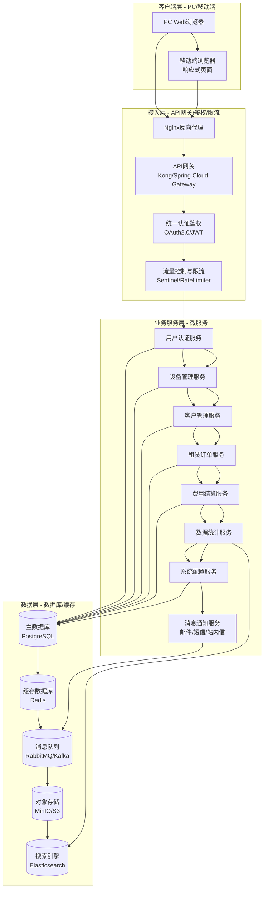
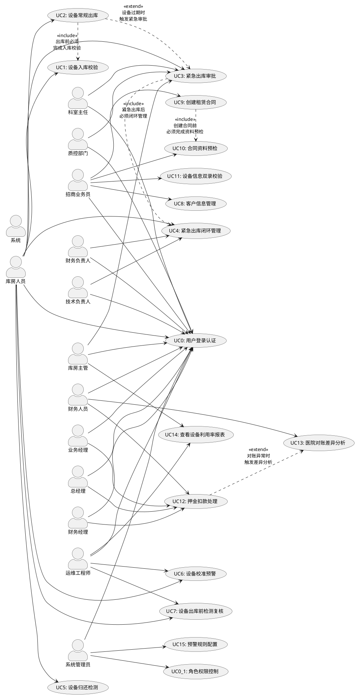
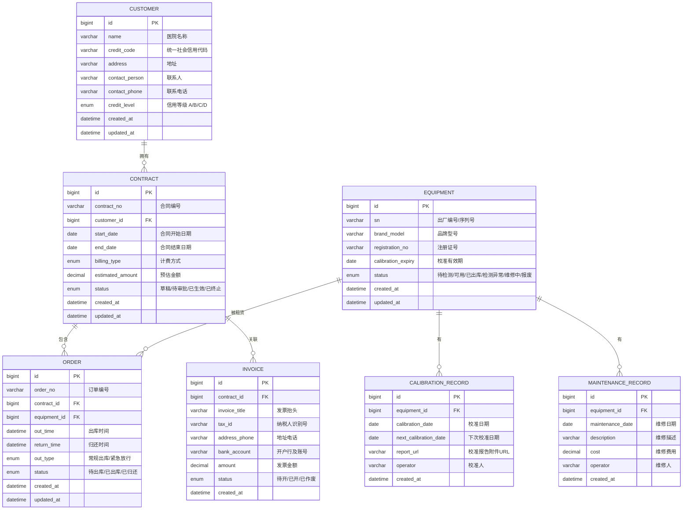
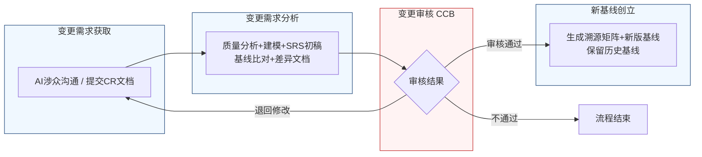

好的，遵照您的指示，我将严格遵循IEEE 830标准和GB/T 9385规范，采用两阶段法生成这份完整的软件需求规格说明书。我将恪守“精确优先于流畅”的铁律，保留所有数字、边界条件和约束参数。

---
# 文档头部信息
| 项目项 | 内容 |
| ---- | ---- |
| 文档名称 | 软件需求规格说明书（SRS）|
| 项目名称 | 医疗器械租赁管理系统 |
| 项目编号 | MED-RENTAL-2026 |
| 文档版本 | V1.0.0 |
| 基线版本 | 【占位，由A6分配】|
| 编制人 | AI基线智能体（A6） |
| 编制日期 | 2026-06-26 |
| 审核人 | CCB变更控制委员会 |
| 批准人 | CCB变更控制委员会 |
| 密级 | 内部 |

## 修订历史记录
| 版本号 | 修订日期 | 修订类型 | 修订内容简述 |
| ---- | ---- | ---- | ---- |
| V1.0.0 | 2026-06-26 | 新建 | 文档初稿，确立初始需求基线 |

# 1 引言
## 1.1 编制目的
本软件需求规格说明书（SRS）旨在为“医疗器械租赁管理系统”项目（项目编号：MED-RENTAL-2026）的开发、测试、验收及后续维护提供一份完整、精确、无歧义的需求基线。本文档是项目团队（包括产品经理、需求分析师、架构师、开发工程师、测试工程师、运维工程师及项目管理人员）之间沟通与协作的核心依据，也是最终验收测试（UAT）的基准文档。本文档严格遵循IEEE 830-1998《软件需求规格说明书推荐实践》和GB/T 9385-2008《计算机软件需求规格说明规范》的要求编制。

## 1.2 文档范围（包含/排除）
**包含范围：**
本文档覆盖“医疗器械租赁管理系统”V1.0.0版本的全部需求，具体包括以下七个核心业务模块：
1.  **用户认证与权限管理**：定义系统用户身份验证、角色分配及功能权限控制。
2.  **设备管理**：覆盖设备从入库、出库、归还、校准预警到报废的全生命周期管理。
3.  **客户管理**：管理客户（医院）基本信息、信用等级、合同历史等。
4.  **租赁订单管理**：覆盖租赁合同的创建、审批、执行、变更及终止的全过程。
5.  **费用结算管理**：处理押金、租金、罚款、对账等财务相关流程。
6.  **数据统计与分析**：提供业务报表、设备利用率、财务分析等数据支持。
7.  **系统配置与管理**：管理基础数据、流程模板、预警规则、日志审计等。

**排除范围：**
本文档不包含以下内容：
1.  硬件设备的物理设计、采购、安装及维护方案。
2.  与第三方财务软件（如金蝶、用友）的深度集成接口设计（仅定义本系统需提供的标准数据导出格式）。
3.  移动端APP的原生开发需求（本系统V1.0.0仅支持响应式Web页面，适配主流移动浏览器）。
4.  具体的用户界面（UI）视觉设计稿（UI设计将基于本SRS中的功能需求另行输出）。
5.  系统部署的详细硬件配置清单和网络拓扑设计。

## 1.3 引用文件
1.  GB/T 9385-2008 计算机软件需求规格说明规范
2.  IEEE Std 830-1998 IEEE Recommended Practice for Software Requirements Specifications
3.  《高级软件设计实践》教材书稿（内部资料）
4.  医疗器械租赁管理系统涉众需求调研记录（raw/notes/库房人员-20260626-1439-需求记录.md）
5.  医疗器械租赁管理系统涉众需求调研记录（raw/notes/运维工程师-20260626-1439-需求记录.md）
6.  医疗器械租赁管理系统涉众需求调研记录（raw/notes/招商业务员-20260626-1439-需求记录.md）
7.  医疗器械租赁管理系统结构化需求清单（V1.0）

## 1.4 术语与缩略语
| 术语/缩略语 | 全称 | 定义 |
| ---- | ---- | ---- |
| SRS | Software Requirements Specification | 软件需求规格说明书 |
| CCB | Change Control Board | 变更控制委员会，负责审批需求变更 |
| CR | Change Request | 变更需求文档 |
| FR | Functional Requirement | 功能需求 |
| NFR | Non-Functional Requirement | 非功能需求 |
| IFR | Interface Requirement | 接口需求 |
| RTM | Requirements Traceability Matrix | 需求追溯矩阵 |
| UAT | User Acceptance Testing | 用户验收测试 |
| P0 | Priority 0 | 最高优先级，必须实现的核心功能 |
| P1 | Priority 1 | 重要功能，建议实现 |
| P2 | Priority 2 | 次要功能，条件允许时实现 |
| SN | Serial Number | 序列号，用于唯一标识设备 |
| 三方会签 | - | 指科室主任、库房主管、质控部门三方共同签字确认的流程 |
| 紧急放行 | - | 对校准过期设备，在特定紧急情况下，经特殊审批后允许出库的标识 |
| 待补校准报告 | - | 紧急出库后，系统自动生成的、要求在规定时限内补交有效校准报告的任务 |

## 1.5 业务背景概述
**现状痛点：**
当前医疗器械租赁业务主要依赖线下纸质单据和人工经验管理，存在以下核心痛点：
1.  **设备校准管理失控**：设备校准过期后仍可能被人工出库，存在巨大的安全与合规风险。预警机制缺失或无效，导致设备因未及时校准而停用，影响业务。
2.  **紧急出库流程不规范**：紧急情况下，对过期设备的出库缺乏标准化的审批和事后追溯流程，风险敞口大。
3.  **设备归还检测标准不一**：归还检测依赖个人经验，缺乏统一标准，导致设备状态不可靠，影响下次出库。
4.  **合同与订单管理效率低**：合同录入时发票信息、客户资料等校验滞后，导致审批环节频繁返工。计费方式单一，无法满足客户多样化需求。
5.  **费用结算对账困难**：押金扣款流程不透明，缺乏分级审批。与医院的对账依赖人工，效率低且易出错。

**建设目标：**
建设一套覆盖设备全生命周期、租赁业务全流程、财务结算全链条的数字化管理系统，实现：
1.  **合规性提升100%**：杜绝校准过期设备未经特殊审批而出库的情况。
2.  **流程效率提升50%**：将合同平均审批周期从3天缩短至1.5天。
3.  **数据准确性提升至99.9%**：通过自动校验和标准化流程，减少人为录入错误。
4.  **风险可控**：建立受控的紧急出库和押金扣款流程，实现全程可追溯。

**量化业务目标：**
| 业务目标ID | 业务目标描述 | 量化指标 | 关联需求 |
| ---- | ---- | ---- | ---- |
| BR-EQP-001 | 确保设备校准状态合规，杜绝过期设备出库 | 校准过期设备常规出库率为0% | UR-EQP-001 |
| BR-EQP-002 | 为紧急医疗场景提供受控的例外出库通道 | 紧急出库流程平均完成时间 < 30分钟 | UR-EQP-002 |
| BR-EQP-003 | 建立标准化的设备归还检测流程 | 归还检测模板使用率100% | UR-EQP-003 |
| BR-EQP-004 | 建立设备校准有效期预警机制 | 设备过期前7天预警到达率100% | UR-EQP-004 |
| BR-ORD-001 | 支持灵活的计费方式 | 系统支持的计费方式种类 >= 5种 | UR-ORD-001 |
| BR-ORD-002 | 在合同录入阶段自动校验发票信息 | 因发票信息错误导致的审批退回率降低80% | UR-ORD-002 |

# 2 总体描述
## 2.1 产品概述（系统定位、核心价值）
**系统定位：**
“医疗器械租赁管理系统”是一套面向医疗器械租赁公司的企业级业务管理平台，旨在通过信息化手段，实现设备资产、租赁合同、客户关系及财务结算的数字化、标准化和智能化管理。

**核心价值：**
1.  **合规风控**：通过强制规则和受控流程，确保业务操作符合医疗器械监管法规，降低运营风险。
2.  **降本增效**：自动化流程、智能校验和标准化模板，显著减少人工操作和重复劳动，提升整体运营效率。
3.  **数据驱动**：提供多维度、实时的业务数据报表和分析，支持管理层进行精准决策。
4.  **客户体验**：灵活的计费方式、便捷的资料提交和透明的流程跟踪，提升客户满意度。

### 系统架构图（Mermaid代码）

## 2.2 运行环境要求（硬件/软件/浏览器兼容表）
| 类别 | 项目 | 最低配置 | 推荐配置 |
| ---- | ---- | ---- | ---- |
| **服务器（生产环境）** | CPU | 8核，2.0GHz+ | 16核，2.5GHz+ |
| | 内存 | 32GB | 64GB |
| | 硬盘 | 500GB SSD | 1TB NVMe SSD |
| | 操作系统 | CentOS 7.9+ / Ubuntu 20.04+ | CentOS 7.9+ / Ubuntu 22.04+ |
| **服务器（测试/开发环境）** | CPU | 4核，2.0GHz+ | 8核，2.0GHz+ |
| | 内存 | 16GB | 32GB |
| | 硬盘 | 200GB SSD | 500GB SSD |
| **客户端（PC）** | 操作系统 | Windows 10 / macOS 11+ | Windows 11 / macOS 14+ |
| | 浏览器 | Chrome 90+ / Firefox 90+ / Edge 90+ | Chrome 最新版 |
| | 分辨率 | 1366x768 | 1920x1080 |
| **客户端（移动端）** | 操作系统 | iOS 13+ / Android 10+ | iOS 16+ / Android 13+ |
| | 浏览器 | Safari / Chrome 最新版 | Safari / Chrome 最新版 |
| **软件依赖** | JDK | OpenJDK 17 | OpenJDK 21 |
| | 数据库 | PostgreSQL 14 | PostgreSQL 16 |
| | 缓存 | Redis 6.x | Redis 7.x |
| | 消息队列 | RabbitMQ 3.9+ | RabbitMQ 3.13+ |

## 2.3 用户角色与特征（角色/职责/权限/频次/技能 矩阵表）
| 角色 | 职责描述 | 核心功能权限 | 使用频次 | 计算机技能水平 |
| ---- | ---- | ---- | ---- | ---- |
| 库房人员 | 负责设备入库、出库、归还检测、盘点等日常操作 | 设备管理（入库、出库、归还、盘点）、校准预警查看、紧急出库申请 | 每日多次 | 中等 |
| 招商业务员 | 负责客户开发、合同洽谈与签订、资料收集 | 客户管理、租赁订单（创建、编辑、提交审批）、资料预检 | 每日多次 | 中等 |
| 财务人员 | 负责押金管理、租金结算、发票处理、对账、成本核算 | 费用结算（押金扣款、租金计算、发票校验）、数据统计、设备状态确认 | 每日多次 | 中等 |
| 运维工程师 | 负责设备技术状态检测、校准管理、系统运维 | 设备管理（检测、校准记录）、校准预警配置、系统日志查看 | 每日一次 | 高 |
| 科室主任 | 负责审核本科室发起的紧急出库申请 | 紧急出库审批 | 按需，低频 | 低 |
| 库房主管 | 负责审核紧急出库申请、监督库房日常工作 | 紧急出库审批、库房运营报表查看 | 每日一次 | 中等 |
| 质控部门 | 负责评估紧急出库的合规风险 | 紧急出库审批 | 按需，低频 | 中等 |
| 财务负责人 | 负责事后补签紧急出库的财务手续 | 紧急出库事后补签 | 按需，低频 | 中等 |
| 技术负责人 | 负责事后补签紧急出库的技术手续 | 紧急出库事后补签 | 按需，低频 | 中等 |
| 业务经理 | 负责审核中额押金扣款 | 押金扣款初审 | 每日数次 | 中等 |
| 财务经理 | 负责复审大额押金扣款 | 押金扣款复审 | 每日数次 | 高 |
| 总经理 | 负责终审超限额押金扣款 | 押金扣款终审 | 按需，低频 | 中等 |
| 系统管理员 | 负责系统配置、用户管理、权限分配、日志审计 | 系统配置（所有模块）、用户管理、角色管理、审计日志 | 按需，低频 | 高 |

## 2.4 系统运行模式（正常/异常/维护三种模式）
| 运行模式 | 描述 | 触发条件 | 系统行为 |
| ---- | ---- | ---- | ---- |
| **正常模式** | 系统在日常业务运行下的默认状态。所有功能模块可用，性能指标达标。 | 系统启动后，无任何故障或维护任务。 | 所有服务正常运行，接受用户请求，处理业务逻辑，返回响应。 |
| **异常模式** | 系统在部分组件或服务发生故障时的降级运行状态。 | 1. 数据库连接失败。 2. 核心微服务（如设备管理服务）不可用。 3. 第三方接口（如短信网关）超时。 | 1. 非核心功能（如数据统计报表）降级或不可用。 2. 核心功能（如设备出库）尝试重试或切换到备用服务。 3. 向用户显示友好的错误提示，并记录详细错误日志。 4. 触发告警通知运维人员。 |
| **维护模式** | 系统因计划内升级、数据迁移或故障修复而暂停服务的状态。 | 1. 系统管理员手动开启维护模式。 2. 检测到严重安全漏洞需要紧急修复。 | 1. 所有用户请求被重定向到一个静态维护页面，页面显示预计恢复时间。 2. 后台定时任务暂停执行。 3. 消息队列中的消息被持久化，待恢复后继续处理。 |

## 2.5 设计与实现约束
1.  **技术约束**：
    *   后端必须采用Java语言，基于Spring Boot 3.x和Spring Cloud 2023.x微服务架构。
    *   前端必须采用Vue 3.x框架，并使用TypeScript。
    *   数据库必须使用PostgreSQL 14及以上版本。
    *   所有服务间通信必须采用RESTful API或gRPC。
    *   系统必须支持Docker容器化部署。
2.  **合规约束**：
    *   系统必须符合《医疗器械使用质量监督管理办法》等相关法规要求。
    *   所有涉及设备校准、出库、归还的操作记录必须保存至少5年，不可删除或篡改。
    *   用户密码必须采用加盐哈希（如bcrypt）存储，不得明文存储。
    *   系统必须提供完整的操作审计日志。
3.  **接口约束**：
    *   所有对外提供的API必须遵循RESTful设计规范，并使用JSON作为数据交换格式。
    *   与外部系统（如短信网关、邮件服务器）的集成必须通过标准协议（如SMTP、HTTP）。
4.  **工期约束**：
    *   项目V1.0.0版本必须在合同签订后的6个月内完成开发、测试并上线。

## 2.6 假设与依赖
1.  **假设**：
    *   所有用户均已通过公司内部网络或VPN访问系统，网络环境稳定可靠。
    *   客户（医院）能够提供符合要求的电子版资料（如营业执照、设备铭牌照片等）。
    *   所有设备均具有唯一的序列号（SN）或出厂编号，可作为唯一标识。
2.  **依赖**：
    *   本系统的正常运行依赖于公司IT基础设施（服务器、网络、存储）的稳定运行。
    *   短信和邮件通知功能依赖于第三方服务提供商的可用性。
    *   设备校准数据的准确性依赖于校准组人员及时、准确地在系统中录入校准报告。

# 3 具体需求
## 3.1 功能需求（FR）
### 3.1.1 用户认证与权限管理
**FR-AUTH-001**：用户登录认证
- **优先级**：P0
- **参与角色**：所有用户
- **前置条件**：用户账号已在系统中创建并激活。
- **触发方式**：用户在登录页面输入用户名和密码，点击“登录”按钮。
- **业务流程**：
    1.  系统接收用户输入的用户名和密码。
    2.  系统对密码进行加盐哈希处理。
    3.  系统查询用户表，比对用户名和哈希后的密码。
    4.  若比对成功，系统生成一个JWT Token，Token有效期默认为8小时。
    5.  系统将Token返回给客户端，并重定向至系统首页。
    6.  若比对失败，系统返回“用户名或密码错误”的提示，并记录登录失败日志。
- **业务规则**：
    *   连续5次登录失败，该账号将被锁定30分钟。
    *   Token过期后，用户需重新登录。
- **后置状态**：用户成功登录系统，获得其角色对应的功能权限。
- **验收标准**：
    1.  使用正确的用户名和密码，能在2秒内成功登录系统。
    2.  使用错误的密码登录，系统在1秒内返回错误提示。
    3.  连续输入5次错误密码后，账号被锁定，第6次尝试登录时提示“账号已被锁定”。
    4.  锁定30分钟后，使用正确密码可成功登录。
- **关联需求条目**：无

**FR-AUTH-002**：角色权限控制
- **优先级**：P0
- **参与角色**：系统管理员
- **前置条件**：系统管理员已登录。
- **触发方式**：系统管理员进入“角色管理”页面。
- **业务流程**：
    1.  系统管理员可以创建、编辑、删除角色。
    2.  系统管理员可以为每个角色分配一个或多个功能权限（如“设备入库”、“合同审批”）。
    3.  系统管理员可以为每个用户分配一个或多个角色。
    4.  用户登录后，系统根据其拥有的角色，动态加载其可访问的菜单和功能按钮。
- **业务规则**：
    *   一个用户可以拥有多个角色。
    *   用户的实际权限是其所有角色权限的并集。
    *   系统预置“系统管理员”角色，该角色拥有所有权限，且不可删除。
- **后置状态**：用户权限配置更新，下次登录或刷新Token后生效。
- **验收标准**：
    1.  系统管理员可以成功创建一个新角色，并为其勾选“设备管理”和“合同查看”权限。
    2.  将一个用户分配到这个新角色后，该用户登录系统只能看到“设备管理”和“合同查看”相关菜单和按钮。
    3.  系统管理员无法删除“系统管理员”角色。
- **关联需求条目**：无

### 3.1.2 设备管理
**FR-EQP-001**：设备入库校验
- **优先级**：P0
- **参与角色**：库房人员
- **前置条件**：采购订单已录入系统。
- **触发方式**：库房人员扫描或手动输入设备信息（品牌型号、出厂编号、注册证号），发起入库操作。
- **业务流程**：
    1.  系统读取对应的采购订单信息。
    2.  系统将扫描/输入的实物信息与采购订单信息进行比对。
    3.  若所有信息一致，系统生成“入库单”，设备状态设为“待检测”。
    4.  若任一信息不一致，系统自动生成一个“异常标记”，并暂停入库操作。
    5.  系统同时向采购部门和质检部门推送通知，告知异常详情。
    6.  库房人员等待异常处理结果。若异常可现场解决，则修正信息后重新发起比对；否则，设备退回供应商或转入异常处理流程。
- **业务规则**：
    *   比对字段包括：品牌型号、出厂编号、注册证号。这三个字段必须完全匹配。
    *   入库单生成后，设备状态必须为“待检测”，不可直接变为“可用”。
- **后置状态**：设备状态变为“待检测”或入库操作被暂停并生成异常标记。
- **验收标准**：
    1.  扫描一个与采购订单信息完全一致的设备，系统在2秒内生成入库单，设备状态变为“待检测”。
    2.  扫描一个出厂编号与采购订单不符的设备，系统在1秒内弹出“信息不一致”警告，并生成异常标记。
    3.  采购部门和质检部门的系统通知栏中能收到该异常通知。
- **关联需求条目**：BR-EQP-006 / UR-EQP-006

**FR-EQP-002**：设备常规出库管理
- **优先级**：P0
- **参与角色**：库房人员
- **前置条件**：设备状态为“可用”。
- **触发方式**：库房人员选择设备，发起常规出库操作。
- **业务流程**：
    1.  系统检查设备状态。若状态非“可用”，则拒绝出库并提示原因。
    2.  系统检查设备校准有效期。若校准已过期，则拒绝出库，并提示“设备校准已过期，无法常规出库”。
    3.  若设备状态和校准均正常，系统允许出库，并生成出库单。
    4.  出库单生成后，设备状态变更为“已出库”。
- **业务规则**：
    *   设备状态必须为“可用”。
    *   设备校准有效期必须大于当前日期。
    *   此流程为常规出库，不涉及任何特殊审批。
- **后置状态**：设备状态变为“已出库”，生成出库单。
- **验收标准**：
    1.  选择一个状态为“可用”且校准有效期正常的设备，点击出库，系统在2秒内生成出库单，设备状态变为“已出库”。
    2.  选择一个校准已过期的设备，点击出库，系统在1秒内弹出“设备校准已过期，无法常规出库”的提示，操作被拒绝。
- **关联需求条目**：BR-EQP-001 / UR-EQP-001

**FR-EQP-003**：紧急出库审批流程
- **优先级**：P0
- **参与角色**：库房人员、科室主任、库房主管、质控部门、财务负责人、技术负责人
- **前置条件**：设备校准已过期，且无其他可用替代设备。
- **触发方式**：库房人员在出库界面，针对过期设备选择“紧急出库”选项。
- **业务流程**：
    1.  库房人员填写紧急出库原因及设备信息，提交申请。
    2.  系统将申请推送至科室主任进行必要性审核。
    3.  科室主任审核通过后，系统将申请推送至库房主管进行库存及替代方案审核。
    4.  库房主管审核通过后，系统将申请推送至质控部门进行合规风险及财务影响评估。
    5.  质控部门审核通过后，系统自动执行出库操作，并在设备标签上生成“紧急放行”标识。
    6.  系统同时生成两个后台任务：
        a. 生成“待补校准报告”任务，要求72小时内补交有效校准报告。
        b. 触发“事后补签”待办给财务负责人和技术负责人。
    7.  设备出库。
- **业务规则**：
    *   三方会签顺序固定：科室主任 -> 库房主管 -> 质控部门。
    *   任何一方驳回，流程即终止，设备不可出库。
    *   紧急出库的设备，其系统状态仍为“已出库”，但关联一个“紧急放行”标记。
    *   “待补校准报告”的补交时限默认为72小时，该时限可在系统配置中调整。
- **后置状态**：设备以“紧急放行”状态出库，生成待办任务。
- **验收标准**：
    1.  库房人员能对过期设备发起紧急出库申请。
    2.  科室主任、库房主管、质控部门能依次在待办列表中看到并处理该申请。
    3.  三方全部同意后，系统自动执行出库，设备标签上显示“紧急放行”。
    4.  系统自动为财务负责人和技术负责人生成“事后补签”待办。
    5.  系统自动生成一个“待补校准报告”任务，截止时间为当前时间+72小时。
- **关联需求条目**：BR-EQP-002, BR-EQP-007 / UR-EQP-002, UR-EQP-007

**FR-EQP-004**：紧急出库闭环管理
- **优先级**：P1
- **参与角色**：库房人员、财务人员
- **前置条件**：存在“紧急放行”出库的设备。
- **触发方式**：系统定时任务或用户手动操作。
- **业务流程**：
    1.  系统持续监控“待补校准报告”任务。
    2.  若在72小时内补交了有效的校准报告，系统校验报告通过后，通知财务人员。
    3.  财务人员人工确认设备状态及账务后，设备状态恢复为“可用”。
    4.  若72小时内未补交有效校准报告，系统自动将该出库记录标记为“违规操作”。
    5.  系统自动触发设备召回流程，生成召回任务通知库房人员。
- **业务规则**：
    *   补交时限为72小时，从紧急出库操作完成时开始计时。
    *   补交的校准报告必须经过系统校验（格式、内容完整性）。
    *   设备状态从“紧急放行”恢复到“可用”，必须经过财务人员的人工确认。
- **后置状态**：设备状态恢复为“可用”或出库记录被标记为“违规操作”并触发召回。
- **验收标准**：
    1.  在72小时内上传一份有效的校准报告，财务人员收到待办，确认后设备状态变为“可用”。
    2.  超过72小时未上传报告，该出库记录被自动标记为“违规操作”，并生成一个设备召回任务。
- **关联需求条目**：BR-EQP-008 / UR-EQP-008

**FR-EQP-005**：设备归还检测
- **优先级**：P0
- **参与角色**：库房人员
- **前置条件**：设备已归还至库房。
- **触发方式**：库房人员选择归还的设备，发起归还检测操作。
- **业务流程**：
    1.  系统加载与入库检测相同的标准化检查清单和模板。
    2.  库房人员按照清单逐项检查，并记录结果。
    3.  对于关键功能项（如传感器灵敏度、电池容量），系统提供专用测试工装的数据录入接口，并支持与出厂参数进行自动比对。
    4.  所有检查项完成后，库房人员提交检测结果。
    5.  若所有项均通过，设备状态变更为“可用”。
    6.  若有任何项不通过，设备状态变更为“检测异常”，并进入维修或报废流程。
- **业务规则**：
    *   归还检测模板必须与入库检测模板完全一致。
    *   传感器灵敏度测试结果与出厂参数的偏差超过5%时，系统应给出“警告”提示。
    *   电池容量低于出厂参数的80%时，系统应给出“不合格”提示。
- **后置状态**：设备状态变为“可用”或“检测异常”。
- **验收标准**：
    1.  发起归还检测，系统展示的检查清单与入库检测时完全一致。
    2.  录入传感器灵敏度数据，当偏差超过5%时，系统显示警告。
    3.  录入电池容量数据，当低于出厂参数的80%时，系统判定该项不合格。
    4.  所有项通过后，设备状态变为“可用”。
- **关联需求条目**：BR-EQP-003, BR-EQP-009 / UR-EQP-003, UR-EQP-009

**FR-EQP-006**：设备校准有效期预警
- **优先级**：P1
- **参与角色**：库房人员、运维工程师
- **前置条件**：系统中存在设备校准有效期数据。
- **触发方式**：系统定时任务（每周一上午9:00）和用户手动查询。
- **业务流程**：
    1.  **定时推送**：每周一上午9:00，系统自动扫描所有状态（包括“已出库”）的设备，生成一份“临期设备清单”。
    2.  清单内容包括：设备编号、设备名称、当前状态、校准有效期、剩余天数。
    3.  系统将该清单通过站内信和邮件同时推送给库房、校准组和业务部门的相关人员。
    4.  **单独提醒**：对于校准有效期即将在30天、15天、7天内到期的设备，系统在到期日当天上午9:00向相关责任人发送单独的提醒通知。
    5.  **实时查询**：系统提供一个“临期设备清单”页面，用户可按设备状态、校准有效期范围等条件进行筛选查询。
- **业务规则**：
    *   预警范围覆盖所有状态的设备，包括“已出库”。
    *   定时推送频率为每周一次（周一）。
    *   单独提醒的时间节点为到期前30天、15天、7天。
    *   实时查询页面数据为实时数据。
- **后置状态**：用户收到预警通知，或通过查询页面获取临期设备列表。
- **验收标准**：
    1.  每周一上午9:00，相关用户能收到包含临期设备清单的站内信和邮件。
    2.  当一个设备距离校准有效期还有30天时，相关用户在当天上午9:00收到单独的提醒通知。
    3.  用户可以在“临期设备清单”页面，通过筛选条件查询到所有临期设备。
- **关联需求条目**：BR-EQP-004, BR-EQP-005, BR-EQP-010 / UR-EQP-004, UR-EQP-005, UR-EQP-010

**FR-EQP-007**：设备出库前检测复核
- **优先级**：P2
- **参与角色**：库房人员、运维工程师
- **前置条件**：设备出库前检测流程已启动。
- **触发方式**：系统根据检测项类型自动触发。
- **业务流程**：
    1.  系统在出库前检测清单中，将“电气安全”等涉及人身安全的项目标记为“关键项”。
    2.  对于“关键项”，系统强制要求进行双人复核。
    3.  第一位检测人员完成检测并记录结果后，系统锁定该检测记录。
    4.  第二位复核人员需重新进行检测并录入结果。
    5.  系统自动比对两次检测结果。若一致，则该项通过；若不一致，系统标记为“复核异常”，并通知运维工程师介入处理。
- **业务规则**：
    *   “关键项”的复核比例为100%。
    *   非关键项的复核比例可在系统配置中设置，默认为30%。
- **后置状态**：关键项检测通过或标记为“复核异常”。
- **验收标准**：
    1.  在出库检测清单中，“电气安全”项被明确标记为“关键项”。
    2.  第一位检测人员录入结果后，系统提示“需要第二人复核”。
    3.  第二位复核人员录入结果后，若与第一次一致，该项显示“通过”；若不一致，显示“复核异常”。
- **关联需求条目**：BR-EQP-011 / UR-EQP-011

### 3.1.3 客户管理
**FR-CUST-001**：客户信息管理
- **优先级**：P0
- **参与角色**：招商业务员
- **前置条件**：用户已登录。
- **触发方式**：招商业务员进入“客户管理”模块。
- **业务流程**：
    1.  招商业务员可以创建、编辑、查询客户（医院）信息。
    2.  客户信息包括：医院名称、统一社会信用代码、地址、联系人、联系电话、信用等级等。
    3.  系统支持上传客户资质文件（如营业执照、医疗机构执业许可证）。
- **业务规则**：
    *   医院名称和统一社会信用代码为必填项，且需校验唯一性。
    *   信用等级由系统根据历史交易记录自动计算，分为A、B、C、D四级，财务人员可手动调整。
- **后置状态**：客户信息被成功创建或更新。
- **验收标准**：
    1.  能成功创建一个新的客户，并保存所有信息。
    2.  尝试创建一个已存在的医院名称，系统提示“医院名称已存在”。
    3.  能成功上传并查看客户的资质文件。
- **关联需求条目**：无

### 3.1.4 租赁订单管理
**FR-ORD-001**：创建租赁合同
- **优先级**：P0
- **参与角色**：招商业务员
- **前置条件**：客户信息已存在。
- **触发方式**：招商业务员进入“合同管理”模块，点击“新建合同”。
- **业务流程**：
    1.  招商业务员选择客户，填写合同基本信息（合同周期、租赁设备、计费方式等）。
    2.  系统支持的计费方式包括：
        a. 按使用时长：按小时、按天、按周、按月。
        b. 按使用量：按里程、疗程、检测次数。
        c. 混合计费：固定周期费用 + 按量费用。
        d. 按收入分成：按客户使用设备产生的收入比例计费。
        e. 固定周期 + 浮动阶梯：基础费用 + 超出阶梯后的额外费用。
    3.  招商业务员选择计费方式并设置具体参数。
    4.  系统根据选择的计费方式和参数，自动计算并展示预估租金。
    5.  招商业务员保存合同草稿或提交审批。
- **业务规则**：
    *   合同必须关联一个已存在的客户。
    *   合同必须至少选择一种计费方式。
    *   预估租金为系统计算值，最终租金以审批通过的合同为准。
- **后置状态**：合同状态变为“草稿”或“待审批”。
- **验收标准**：
    1.  能成功创建一个新合同，并选择“按天”计费，设置每天租金为100元。
    2.  能成功创建一个新合同，并选择“按收入分成”计费，设置分成比例为30%。
    3.  系统能根据选择的计费方式和参数，正确计算并展示预估租金。
- **关联需求条目**：BR-ORD-001 / UR-ORD-001

**FR-ORD-002**：合同资料预检
- **优先级**：P1
- **参与角色**：招商业务员
- **前置条件**：合同处于“草稿”或“待提交”状态。
- **触发方式**：招商业务员在合同详情页点击“提交审批”按钮。
- **业务流程**：
    1.  系统在提交审批前，自动触发资料预检流程。
    2.  系统检查客户资料清单是否完整（如营业执照、设备铭牌照片等）。
    3.  系统自动校验发票信息的完整性和格式（发票抬头、纳税人识别号、地址电话、开户行及账号）。
    4.  若资料不完整或发票信息格式错误，系统列出所有问题项，并阻止提交审批。
    5.  招商业务员根据提示修正问题后，可再次提交。
    6.  若所有资料和格式均校验通过，系统允许提交审批。
- **业务规则**：
    *   资料清单模板由系统管理员在“系统配置”模块中维护。
    *   发票信息校验规则：纳税人识别号必须为15、18或20位数字字母组合；开户行及账号不能为空。
- **后置状态**：合同成功提交审批，或停留在“草稿”状态并显示错误列表。
- **验收标准**：
    1.  在一个资料不完整的合同上点击“提交审批”，系统弹出错误列表，指出缺少的文件，并阻止提交。
    2.  在一个发票信息格式错误的合同上点击“提交审批”，系统提示“纳税人识别号格式错误”，并阻止提交。
    3.  在所有资料完整且格式正确的合同上点击“提交审批”，系统成功提交，合同状态变为“待审批”。
- **关联需求条目**：BR-ORD-002, BR-ORD-003 / UR-ORD-002, UR-ORD-003

**FR-ORD-003**：设备信息双录校验
- **优先级**：P1
- **参与角色**：招商业务员
- **前置条件**：合同已创建，需要录入设备信息。
- **触发方式**：招商业务员在合同详情页录入设备信息。
- **业务流程**：
    1.  招商业务员录入设备信息（品牌型号、出厂编号、注册证号）。
    2.  系统要求招商业务员上传设备铭牌照片。
    3.  系统对上传的照片进行自动质检（检查照片是否清晰、铭牌信息是否可识别）。
    4.  若照片质检不合格，系统提示“照片不清晰，请重新拍摄”，并提供远程指导功能（如显示示例照片）。
    5.  若照片质检合格，系统将录入的信息与照片中的信息进行比对。
    6.  若信息不一致，系统提示“录入信息与铭牌照片不一致，请核对”。
    7.  若信息一致，系统确认设备信息录入成功。
- **业务规则**：
    *   照片质检标准：分辨率不低于1920x1080，铭牌文字清晰可辨。
    *   信息比对由系统自动完成，若无法自动识别，则标记为“待人工核验”。
- **后置状态**：设备信息被成功录入并关联到合同，或录入失败并提示错误。
- **验收标准**：
    1.  上传一张清晰、信息完整的铭牌照片，系统自动识别并比对成功，设备信息录入成功。
    2.  上传一张模糊的照片，系统提示“照片不清晰，请重新拍摄”。
    3.  上传一张信息与录入不一致的照片，系统提示“录入信息与铭牌照片不一致”。
- **关联需求条目**：BR-ORD-004 / UR-ORD-004

### 3.1.5 费用结算管理
**FR-FIN-001**：押金扣款处理
- **优先级**：P0
- **参与角色**：财务人员、业务经理、财务经理、总经理
- **前置条件**：存在需要扣款的押金记录。
- **触发方式**：财务人员发起押金扣款申请。
- **业务流程**：
    1.  财务人员输入扣款金额及原因，提交申请。
    2.  系统查询该客户（医院）的信用等级。
    3.  系统根据信用等级确定扣款阈值：
        *   A级：小额阈值5000元，中额阈值20000元。
        *   B级：小额阈值3000元，中额阈值10000元。
        *   C级：小额阈值1000元，中额阈值5000元。
        *   D级：小额阈值0元（所有扣款均需审批），中额阈值1000元。
    4.  **小额扣款（金额 <= 小额阈值）**：系统自动触发扣款，生成扣款记录。
    5.  **中额扣款（小额阈值 < 金额 <= 中额阈值）**：流转至业务经理进行初审。业务经理同意后，系统触发扣款。
    6.  **大额扣款（金额 > 中额阈值）**：流转至业务经理初审，再流转至财务经理复审，最后流转至总经理终审。全部同意后，系统触发扣款。
- **业务规则**：
    *   扣款金额必须大于0。
    *   扣款原因不能为空。
    *   任何一级审批驳回，流程即终止。
- **后置状态**：扣款成功（生成扣款记录）或申请被驳回。
- **验收标准**：
    1.  对一个A级客户发起一笔3000元的扣款，系统自动处理，无需审批。
    2.  对一个A级客户发起一笔10000元的扣款，系统生成待办给业务经理，业务经理同意后扣款成功。
    3.  对一个A级客户发起一笔30000元的扣款，系统依次生成待办给业务经理、财务经理、总经理，全部同意后扣款成功。
    4.  任何一级审批点击“驳回”，流程终止，扣款不执行。
- **关联需求条目**：BR-FIN-001 / UR-FIN-001

**FR-FIN-002**：医院对账差异分析
- **优先级**：P1
- **参与角色**：财务人员
- **前置条件**：存在与医院的对账数据。
- **触发方式**：财务人员导入医院提供的对账单，或系统自动生成我方对账单。
- **业务流程**：
    1.  财务人员上传医院对账单（Excel格式）。
    2.  系统自动解析对账单，并与系统内的租赁费用记录进行逐笔比对。
    3.  系统标记出所有差异项（金额不一致、笔数不一致等）。
    4.  系统生成对账差异报告，列出差异详情。
    5.  财务人员根据差异报告，与医院进行沟通确认。
- **业务规则**：
    *   支持的对账单格式：.xlsx, .xls。
    *   系统自动比对字段：合同号、设备编号、计费周期、应收金额。
- **后置状态**：生成对账差异报告。
- **验收标准**：
    1.  上传一份与系统数据完全一致的医院对账单，系统提示“对账一致，无差异”。
    2.  上传一份存在一条金额差异的医院对账单，系统能正确标记出该差异项，并生成差异报告。
- **关联需求条目**：BR-FIN-002 / UR-FIN-002

### 3.1.6 数据统计与分析
**FR-STAT-001**：设备利用率报表
- **优先级**：P2
- **参与角色**：库房主管、运维工程师
- **前置条件**：系统中有设备出库和归还记录。
- **触发方式**：用户进入“数据统计”模块，选择“设备利用率报表”。
- **业务流程**：
    1.  用户选择统计周期（日、周、月、年）和设备范围。
    2.  系统根据设备出库和归还记录，计算每台设备在周期内的利用率（出库天数 / 周期总天数）。
    3.  系统以图表（柱状图、折线图）和表格形式展示结果。
- **业务规则**：
    *   利用率计算公式：`(设备在周期内处于“已出库”状态的总天数 / 周期总天数) * 100%`。
- **后置状态**：展示设备利用率报表。
- **验收标准**：
    1.  选择“月”为统计周期，系统能正确计算并展示该月内所有设备的利用率。
    2.  报表支持按设备类型、品牌进行筛选。
- **关联需求条目**：无

### 3.1.7 系统配置与管理
**FR-CONF-001**：预警规则配置
- **优先级**：P1
- **参与角色**：系统管理员
- **前置条件**：用户已登录。
- **触发方式**：系统管理员进入“系统配置” -> “预警规则”页面。
- **业务流程**：
    1.  系统管理员可以查看、编辑所有预警规则。
    2.  可配置的预警规则包括：
        a. 校准有效期预警：开启/关闭、推送频率（默认每周一）、单独提醒时间点（默认30天、15天、7天）。
        b. 紧急出库补交报告时限：可配置，默认72小时。
    3.  修改后的规则即时生效。
- **业务规则**：
    *   预警规则的修改需要记录操作日志。
- **后置状态**：预警规则更新。
- **验收标准**：
    1.  将校准预警推送频率改为“每天”，保存后，次日系统按新频率推送。
    2.  将紧急出库补交报告时限改为48小时，保存后，新发起的紧急出库任务时限变为48小时。
- **关联需求条目**：BR-EQP-005, BR-EQP-008 / UR-EQP-005, UR-EQP-008

### 系统用例图（plantUML代码）

## 3.2 外部接口需求（IFR）
**IFR-001**：短信通知接口
- **接口类型**：外部接口
- **协议**：HTTP/HTTPS
- **数据格式**：JSON
- **描述**：系统通过调用第三方短信网关API，向用户发送通知短信（如预警提醒、审批待办）。
- **触发条件**：系统需要向用户发送短信通知时。
- **数据规范**：
    *   请求参数：`{ "phone": "13800138000", "content": "您的待办任务..." }`
    *   响应参数：`{ "code": 0, "message": "success", "data": { "msgId": "xxx" } }`
- **错误处理**：若接口调用失败，系统应重试3次，间隔5分钟。若仍失败，记录错误日志并通知系统管理员。

**IFR-002**：邮件通知接口
- **接口类型**：外部接口
- **协议**：SMTP
- **描述**：系统通过配置的邮件服务器，向用户发送邮件通知（如周报、预警清单）。
- **触发条件**：系统需要向用户发送邮件通知时。
- **数据规范**：使用标准MIME格式。
- **错误处理**：若邮件发送失败，系统应记录错误日志并通知系统管理员。

**IFR-003**：数据导出接口
- **接口类型**：内部接口
- **协议**：HTTP/HTTPS
- **数据格式**：Excel (.xlsx)
- **描述**：系统提供标准接口，支持将报表数据（如设备利用率、对账差异报告）导出为Excel文件。
- **触发条件**：用户在报表页面点击“导出”按钮。
- **数据规范**：导出的Excel文件应包含表头和数据行，格式清晰。

### E-R图（Mermaid erDiagram）

### 数据字典（表格）
| 表名 | 字段名 | 类型 | 主键 | 外键 | 默认值 | 说明 |
| ---- | ---- | ---- | ---- | ---- | ---- | ---- |
| customer | id | bigint | Y | N | auto_increment | 客户ID |
| customer | name | varchar(200) | N | N | N/A | 医院名称 |
| customer | credit_code | varchar(50) | N | N | N/A | 统一社会信用代码 |
| customer | credit_level | enum('A','B','C','D') | N | N | 'B' | 信用等级 |
| contract | id | bigint | Y | N | auto_increment | 合同ID |
| contract | contract_no | varchar(50) | N | N | N/A | 合同编号 |
| contract | customer_id | bigint | N | Y (customer.id) | N/A | 客户ID |
| contract | billing_type | enum('hourly','daily','weekly','monthly','usage','mixed','share','tiered') | N | N | N/A | 计费方式 |
| contract | status | enum('draft','pending','active','terminated') | N | N | 'draft' | 合同状态 |
| order | id | bigint | Y | N | auto_increment | 订单ID |
| order | contract_id | bigint | N | Y (contract.id) | N/A | 合同ID |
| order | equipment_id | bigint | N | Y (equipment.id) | N/A | 设备ID |
| order | out_type | enum('normal','emergency') | N | N | 'normal' | 出库类型 |
| order | status | enum('pending','out','returned') | N | N | 'pending' | 订单状态 |
| equipment | id | bigint | Y | N | auto_increment | 设备ID |
| equipment | sn | varchar(100) | N | N | N/A | 出厂编号/序列号 |
| equipment | calibration_expiry | date | N | N | N/A | 校准有效期 |
| equipment | status | enum('pending_check','available','out','check_fail','repair','scrap') | N | N | 'pending_check' | 设备状态 |
| calibration_record | id | bigint | Y | N | auto_increment | 校准记录ID |
| calibration_record | equipment_id | bigint | N | Y (equipment.id) | N/A | 设备ID |
| calibration_record | next_calibration_date | date | N | N | N/A | 下次校准日期 |
| invoice | id | bigint | Y | N | auto_increment | 发票ID |
| invoice | contract_id | bigint | N | Y (contract.id) | N/A | 合同ID |
| invoice | tax_id | varchar(50) | N | N | N/A | 纳税人识别号 |

## 3.3 非功能需求（NFR）
### 3.3.1 性能需求
| 需求ID | 需求描述 | 指标 |
| ---- | ---- | ---- |
| NFR-NFR-PERF-001 | 页面加载时间 | 90%的页面加载时间不超过2秒，首页加载时间不超过3秒。 |
| NFR-NFR-PERF-002 | 接口响应时间 | 90%的API接口响应时间不超过500毫秒，核心接口（如登录、出库）不超过200毫秒。 |
| NFR-NFR-PERF-003 | 并发用户数 | 系统支持至少200个并发用户同时在线操作。 |
| NFR-NFR-PERF-004 | 吞吐量 | 系统核心交易（如出库、入库）的吞吐量不低于100 TPS（Transactions Per Second）。 |
| NFR-NFR-PERF-005 | 报表生成时间 | 90%的报表生成时间不超过10秒，复杂报表（如年度分析）不超过30秒。 |

### 3.3.2 可靠性需求
| 需求ID | 需求描述 | 指标 |
| ---- | ---- | ---- |
| NFR-NFR-REL-001 | 系统可用率 | 系统在7x24小时运行模式下，年度可用率不低于99.9%（即年度计划外停机时间不超过8.76小时）。 |
| NFR-NFR-REL-002 | 连续运行 | 系统在正常负载下，能连续运行7天无需重启。 |
| NFR-NFR-REL-003 | 故障恢复 | 系统发生故障后，核心服务应在15分钟内恢复，数据应在1小时内完全恢复。 |
| NFR-NFR-REL-004 | 数据备份 | 数据库每日凌晨2:00进行全量备份，每4小时进行一次增量备份。 |

### 3.3.3 安全性需求
| 需求ID | 需求描述 | 指标 |
| ---- | ---- | ---- |
| NFR-NFR-SEC-001 | 用户认证 | 必须采用JWT Token进行无状态认证，Token有效期8小时。 |
| NFR-NFR-SEC-002 | 权限控制 | 必须实现基于角色的访问控制（RBAC），粒度到按钮级别。 |
| NFR-NFR-SEC-003 | 数据加密 | 用户密码必须使用bcrypt算法加盐哈希存储。所有敏感数据（如客户信息）在传输过程中必须使用HTTPS加密。 |
| NFR-NFR-SEC-004 | 攻击防护 | 系统必须能防御常见的Web攻击，如SQL注入、XSS、CSRF。 |
| NFR-NFR-SEC-005 | 操作审计 | 所有关键操作（如登录、出库、审批、修改配置）必须记录审计日志，日志内容包括操作人、操作时间、IP地址、操作内容。审计日志保存期限不少于5年。 |

### 3.3.4 可维护性需求
| 需求ID | 需求描述 | 指标 |
| ---- | ---- | ---- |
| NFR-MNT-001 | 日志系统 | 系统必须提供统一的日志收集和分析平台（如ELK），支持按级别、模块、时间等维度搜索日志。 |
| NFR-MNT-002 | 监控告警 | 系统必须对核心服务（CPU、内存、磁盘、数据库连接池）进行监控，并在指标超过阈值时发送告警通知。 |
| NFR-MNT-003 | 模块化设计 | 系统必须采用微服务架构，各服务之间松耦合，支持独立部署和升级。 |

### 3.3.5 可扩展性需求
| 需求ID | 需求描述 | 指标 |
| ---- | ---- | ---- |
| NFR-EXT-001 | 水平扩展 | 核心业务服务（如设备管理、订单服务）必须支持水平扩展，通过增加实例数量来提升系统处理能力。 |
| NFR-EXT-002 | 业务扩展 | 系统应支持通过配置或插件方式，在未来增加新的计费方式、新的设备类型，而无需修改核心代码。 |

### 3.3.6 易用性需求
| 需求ID | 需求描述 | 指标 |
| ---- | ---- | ---- |
| NFR-USE-001 | 操作一致性 | 系统内所有列表页、表单页、详情页的交互风格和布局保持一致。 |
| NFR-USE-002 | 错误提示 | 所有操作失败时，系统必须给出明确、友好的错误提示，并指导用户如何修正。 |
| NFR-USE-003 | 帮助文档 | 系统必须提供在线帮助文档，覆盖所有核心功能的操作说明。 |

## 3.4 数据需求
### 数据字典
（完整表格已在 §3.2 外部接口需求 中提供，此处不再重复）

### 数据管理策略
1.  **备份策略**：
    *   **全量备份**：每日凌晨2:00，对PostgreSQL数据库进行pg_dump全量备份。备份文件保留30天。
    *   **增量备份**：每4小时，对数据库的WAL日志进行归档。归档日志保留7天。
    *   **异地备份**：每日全量备份文件自动同步至异地灾备服务器。
2.  **归档策略**：
    *   对于超过3年的历史订单和合同数据，系统支持将其从主数据库迁移至归档数据库或冷存储，以提升主库性能。
    *   审计日志数据保留5年，到期后自动清理。
3.  **数据留存策略**：
    *   所有与设备校准、出库、归还相关的操作记录，必须永久保存，不可删除。
    *   客户基本信息在合同终止后，至少保留5年。

# 4 需求基线与变更管理
## 4.1 需求基线定义
1.  **基线版本格式**：`BL-YYYYMMDD-NN`（YYYYMMDD=日期，NN=当日流水号）；
2.  **初始基线**：经CCB审批通过、正式发布的第一版SRS（即本文档V1.0.0）；
3.  **基线冻结**：基线发布后，禁止无流程私自修改需求。

## 4.2 需求变更整体流程

## 4.3 变更详细流程（四阶段）
### 4.3.1 阶段一：变更需求获取
两种途径：涉众AI智能体沟通 / 需求提出方提交正式CR变更需求文档

### 4.3.2 阶段二：变更需求分析（4个子阶段）
1.  需求质量分析：校验变更需求合理性、完整性、无歧义
2.  项目建模：更新UML用例图、活动图
3.  SRS初稿生成：整合输出变更版SRS初稿
4.  基线比对：读取历史基线，生成需求差异文档

### 4.3.3 阶段三：变更审核（CCB评审）
1.  审核不通过 → 流程终止
2.  审核退回修改 → 返回变更需求获取阶段
3.  审核通过 → 进入新基线创立环节

### 4.3.4 阶段四：新基线创立
1.  生成需求溯源矩阵（RTM），建立变更前后条目映射
2.  将审核通过的SRS定为新版正式基线
3.  沿用版本规则生成新基线编号
4.  历史基线文档完整归档、不覆盖、不删除

## 4.4 变更记录台账
| 变更编号 | 变更日期 | 申请人 | 变更来源(AI/CR) | 变更简述 | 影响模块 | CCB结论 | 新版基线号 |
| ---- | ---- | ---- | ---- | ---- | ---- | ---- | ---- |
| — | — | — | 初始基线 | 初始基线，无历史变更 | — | 通过 | 【占位】 |

# 5 附录
## 附录A 全量图表汇总
- 系统架构图：见 §2.1
- 系统用例图：见 §3.1
- E-R图：见 §3.2
- 变更流程图：见 §4.2

## 附录B 验收标准总表
| 需求编号 | 需求名称 | 验收标准 | 优先级 |
| ---- | ---- | ---- | ---- |
| FR-EQP-002 | 设备常规出库管理 | 1. 选择一个状态为“可用”且校准有效期正常的设备，点击出库，系统在2秒内生成出库单，设备状态变为“已出库”。 2. 选择一个校准已过期的设备，点击出库，系统在1秒内弹出“设备校准已过期，无法常规出库”的提示，操作被拒绝。 | P0 |
| FR-EQP-003 | 紧急出库审批流程 | 1. 库房人员能对过期设备发起紧急出库申请。 2. 科室主任、库房主管、质控部门能依次在待办列表中看到并处理该申请。 3. 三方全部同意后，系统自动执行出库，设备标签上显示“紧急放行”。 4. 系统自动为财务负责人和技术负责人生成“事后补签”待办。 5. 系统自动生成一个“待补校准报告”任务，截止时间为当前时间+72小时。 | P0 |
| FR-ORD-001 | 创建租赁合同 | 1. 能成功创建一个新合同，并选择“按天”计费，设置每天租金为100元。 2. 能成功创建一个新合同，并选择“按收入分成”计费，设置分成比例为30%。 3. 系统能根据选择的计费方式和参数，正确计算并展示预估租金。 | P0 |

## 附录C 参考资料与外部文档链接
1.  GB/T 9385-2008 计算机软件需求规格说明规范
2.  IEEE 830 软件需求规格说明书标准
3.  《高级软件设计实践》教材书稿
4.  医疗器械租赁管理系统涉众需求调研记录（raw/notes/）
5.  医疗器械租赁管理系统UML建模产物
6.  医疗器械租赁管理系统结构化需求清单