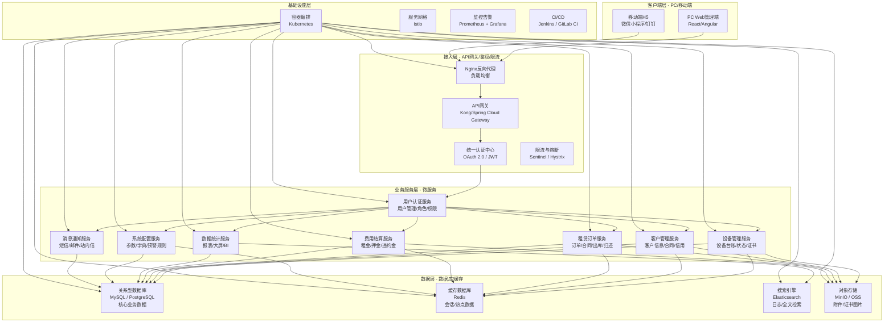
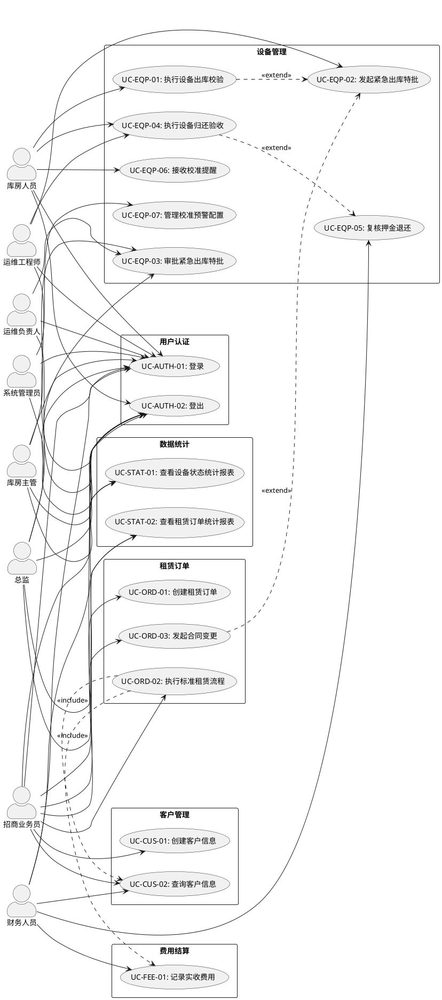
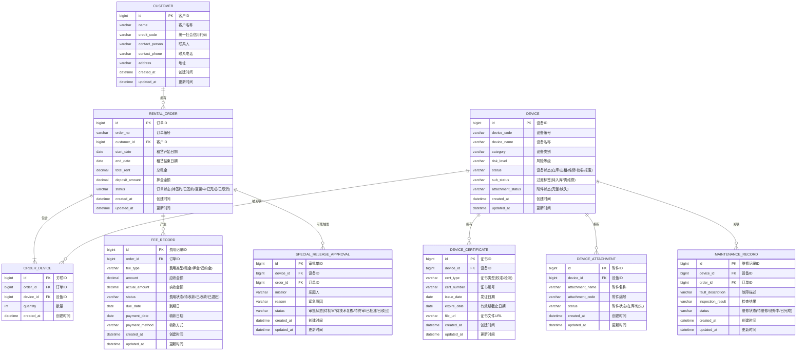
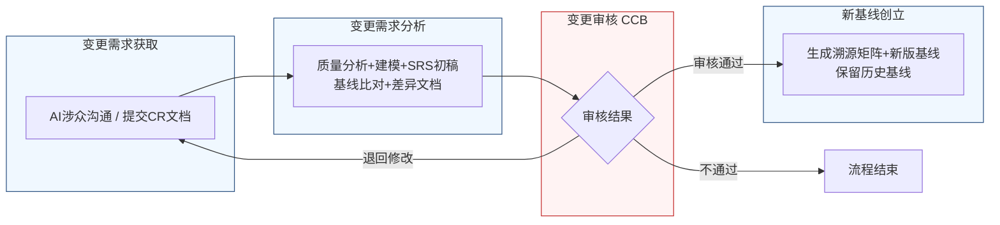

好的，作为一名资深需求分析工程师，我将严格遵循IEEE 830标准和GB/T 9385规范，并恪守“精确优先于流畅”的铁律，为您生成这份完整的软件需求规格说明书（SRS）。

---
# 文档头部信息
| 项目项 | 内容 |
| ---- | ---- |
| 文档名称 | 软件需求规格说明书（SRS）|
| 项目名称 | 医疗器械租赁管理系统 |
| 项目编号 | MED-RENTAL-2026 |
| 文档版本 | V1.0.0 |
| 基线版本 | 【占位，由A6分配】|
| 编制人 | AI基线智能体（A6） |
| 编制日期 | 2026-06-26 |
| 审核人 | CCB变更控制委员会 |
| 批准人 | CCB变更控制委员会 |
| 密级 | 内部 |

## 修订历史记录
| 版本号 | 修订日期 | 修订类型 | 修订内容简述 |
| ---- | ---- | ---- | ---- |
| V1.0.0 | 2026-06-26 | 新建 | 文档初稿，确立初始需求基线 |

# 1 引言
## 1.1 编制目的
本软件需求规格说明书（SRS）旨在为“医疗器械租赁管理系统”（项目编号：MED-RENTAL-2026）的开发、测试、验收及后续维护提供一份完整、精确、无歧义的需求基线。本文档的预期读者包括但不限于：项目经理、系统架构师、软件开发工程师、软件测试工程师、运维人员、产品经理及项目干系人。本文档将作为项目团队与客户之间达成共识的正式依据，并用于指导系统设计、编码实现、功能验证和变更控制。

## 1.2 文档范围（包含/排除）
**包含范围：**
1.  **功能需求：** 涵盖设备管理、客户管理、租赁订单、费用结算、用户认证、数据统计、系统配置七个核心业务模块的全部功能需求。
2.  **非功能需求：** 包括性能、可靠性、安全性、可维护性、可扩展性及易用性等方面的具体要求。
3.  **外部接口需求：** 定义系统与外部系统（如财务系统、短信/邮件网关）的交互方式。
4.  **数据需求：** 定义核心业务实体的数据字典及数据管理策略。
5.  **需求基线管理：** 定义需求基线的建立、变更流程及记录。

**排除范围：**
1.  本文档不包含具体的系统设计细节，如数据库物理模型、UI界面原型、代码实现算法等。
2.  本文档不包含项目计划、预算、资源分配等项目管理内容。
3.  本文档不包含第三方系统（如财务系统）的内部实现细节。
4.  本文档不包含用户培训手册、系统部署方案等实施文档。

## 1.3 引用文件
1.  **GB/T 9385-2008** 计算机软件需求规格说明规范
2.  **IEEE Std 830-1998** IEEE Recommended Practice for Software Requirements Specifications
3.  **《高级软件设计实践》** 教材书稿
4.  **医疗器械租赁管理系统涉众需求调研记录**（raw/notes/）
5.  **医疗器械租赁管理系统UML建模产物**
6.  **医疗器械租赁管理系统结构化需求清单**

## 1.4 术语与缩略语
| 术语/缩略语 | 定义 |
| ---- | ---- |
| **SRS** | 软件需求规格说明书（Software Requirements Specification） |
| **CCB** | 变更控制委员会（Change Control Board） |
| **CR** | 变更请求（Change Request） |
| **FR** | 功能需求（Functional Requirement） |
| **NFR** | 非功能需求（Non-Functional Requirement） |
| **IFR** | 接口需求（Interface Requirement） |
| **BR** | 业务需求（Business Requirement） |
| **UR** | 用户需求（User Requirement） |
| **RTM** | 需求追溯矩阵（Requirements Traceability Matrix） |
| **P0** | 最高优先级，必须实现，否则系统无法上线或核心业务无法运行。 |
| **P1** | 重要优先级，核心业务功能，必须实现，但允许在特定版本中延迟。 |
| **P2** | 次要优先级，增强性功能，可在资源允许时实现。 |
| **API** | 应用程序编程接口（Application Programming Interface） |
| **HTTPS** | 超文本传输安全协议（Hypertext Transfer Protocol Secure） |
| **JWT** | JSON Web令牌（JSON Web Token） |
| **RBAC** | 基于角色的访问控制（Role-Based Access Control） |
| **SLA** | 服务等级协议（Service Level Agreement） |
| **OAuth 2.0** | 开放授权协议（Open Authorization 2.0） |
| **ERP** | 企业资源计划系统（Enterprise Resource Planning） |

## 1.5 业务背景概述
**现状痛点：**
当前医疗器械租赁业务管理主要依赖线下表格和人工操作，存在以下核心痛点：
1.  **设备状态管理混乱：** 设备主体状态与附件状态未分离，导致账实不符。设备归还后，状态判定依赖人工经验，效率低且易出错。
2.  **合规风险高：** 设备出库时，无法自动校验校准/检测证书的有效期，存在过期设备出库的法律和安全风险。
3.  **紧急流程缺失：** 面对客户紧急需求，证书过期设备的出库缺乏标准化的特批流程，导致业务响应慢或违规操作。
4.  **信息孤岛：** 租赁合同、设备状态、费用结算、维修记录等信息分散，无法有效联动，导致数据不一致和重复工作。
5.  **流程不透明：** 合同变更、押金退还等流程缺乏系统化支持，审批效率低，追溯困难。

**建设目标：**
建设一套统一的医疗器械租赁管理系统，实现以下量化业务目标：
1.  **设备出库合规率：** 系统上线后，因证书过期导致的设备违规出库事件数量降至0。
2.  **设备状态准确率：** 系统上线后，设备主体与附件状态的账实一致率达到99.9%。
3.  **紧急出库响应时间：** 从发起紧急出库特批申请到审批完成，平均耗时不超过2小时。
4.  **合同变更效率：** 标准合同变更（非紧急）的平均处理时间从2天缩短至4小时内。
5.  **押金退还效率：** 从设备归还验收到押金退还发起，平均处理时间从3天缩短至1个工作日内。

# 2 总体描述
## 2.1 产品概述（系统定位、核心价值）
**系统定位：**
本系统是一套面向医疗器械租赁公司的企业级业务管理平台，旨在通过信息化手段，实现从设备采购入库、租赁合同签订、设备出库/归还、费用结算到设备维修/报废的全生命周期闭环管理。

**核心价值：**
1.  **合规保障：** 通过自动化的证书校验和标准化的特批流程，确保所有出库设备符合法规要求，规避法律与安全风险。
2.  **效率提升：** 通过自动化状态判定、流程驱动和数据联动，大幅减少人工操作和沟通成本，提升业务处理效率。
3.  **数据驱动：** 通过统一的数据库和报表系统，实现业务数据的实时、准确、完整，为管理决策提供数据支持。
4.  **风险可控：** 通过严格的权限控制、审批流程和审计日志，确保所有业务操作可追溯、可审计，降低运营风险。

### 系统架构图（Mermaid代码）

## 2.2 运行环境要求
| 环境类别 | 具体要求 |
| ---- | ---- |
| **服务器硬件** | CPU: 8核及以上；内存: 32GB及以上；硬盘: 500GB SSD及以上；网络: 千兆以太网。 |
| **服务器软件** | 操作系统: CentOS 7.9+ / Ubuntu 20.04+；应用服务器: JDK 11+ / Node.js 16+；数据库: MySQL 8.0+ / PostgreSQL 14+；缓存: Redis 6.0+；搜索引擎: Elasticsearch 7.0+。 |
| **客户端浏览器** | Google Chrome 90+，Mozilla Firefox 90+，Microsoft Edge 90+，Safari 14+。 |
| **移动端** | iOS 12+，Android 8.0+。 |
| **网络环境** | 支持HTTPS协议，带宽不低于10Mbps。 |

## 2.3 用户角色与特征
| 角色 | 职责 | 核心权限 | 使用频次 | 技能要求 |
| ---- | ---- | ---- | ---- | ---- |
| **库房人员** | 负责设备入库、出库、盘点、状态维护。 | 设备台账查询、设备状态变更、出库扫码、归还验收、接收提醒。 | 每日多次 | 基础电脑操作，熟悉扫码枪使用。 |
| **运维工程师** | 负责设备维修、检测、技术评估。 | 发起紧急出库特批、填写归还检查记录、查看设备维修历史。 | 每日多次 | 熟悉设备技术参数，具备故障诊断能力。 |
| **招商业务员** | 负责客户开发、合同签订、合同变更。 | 客户信息管理、合同创建/变更、订单查询。 | 每日多次 | 熟悉租赁业务流程，具备商务谈判能力。 |
| **财务人员** | 负责费用核算、押金管理、发票开具。 | 费用查询、押金退还复核、发票管理、财务报表。 | 每日数次 | 熟悉财务制度，具备财务软件操作经验。 |
| **库房主管** | 负责库房日常管理，审批紧急出库特批初审。 | 审批紧急出库特批、查看库房报表、管理库房人员。 | 每日数次 | 熟悉库房管理流程，具备管理经验。 |
| **运维负责人** | 负责技术合规复核，审批紧急出库特批。 | 审批紧急出库特批、查看设备维修报表。 | 每日数次 | 具备资深技术背景，熟悉设备合规要求。 |
| **总监** | 负责整体业务风险决策，审批紧急出库特批终审。 | 审批紧急出库特批、查看全局业务报表。 | 每周数次 | 具备高层管理视野，熟悉公司战略和风险控制。 |
| **系统管理员** | 负责系统配置、用户管理、权限分配。 | 所有系统配置、用户管理、角色管理、日志审计。 | 每周数次 | 具备IT系统管理经验，熟悉RBAC模型。 |

## 2.4 系统运行模式
1.  **正常模式：** 系统所有功能正常运行，所有用户可按照权限访问系统，所有业务流程（出库、归还、合同变更等）按标准流程执行。
2.  **异常模式：** 当系统检测到关键服务（如数据库、核心业务服务）不可用时，系统应自动切换至降级模式。在降级模式下，核心只读功能（如设备查询）应保持可用，但涉及数据写入的功能（如创建订单、出库操作）将被暂时禁用，并向用户提示“系统维护中，请稍后再试”。
3.  **维护模式：** 系统管理员可手动将系统切换至维护模式。在维护模式下，所有用户将被强制登出，并重定向至维护页面。系统管理员可在此模式下进行数据库升级、应用部署等操作。维护模式应支持设置预计恢复时间。

## 2.5 设计与实现约束
1.  **技术约束：**
    *   系统必须采用微服务架构，服务间通过RESTful API或gRPC进行通信。
    *   前端必须采用前后端分离的SPA（单页应用）架构。
    *   所有API接口必须使用HTTPS协议，并进行JWT Token鉴权。
    *   数据库设计必须满足第三范式（3NF），并考虑读写分离。
2.  **合规约束：**
    *   系统必须符合《医疗器械监督管理条例》等相关法规对设备追溯和记录保存的要求。
    *   系统必须提供完整的操作审计日志，保存期限不少于3年。
    *   用户密码必须采用加盐哈希（如bcrypt）存储，不得明文存储。
3.  **接口约束：**
    *   与外部财务系统（ERP）的接口必须遵循其规定的数据格式和协议。
    *   短信/邮件网关接口必须支持标准HTTP/SMTP协议。
4.  **工期约束：**
    *   系统核心功能（设备管理、租赁订单）必须在项目启动后6个月内完成开发并上线试运行。

## 2.6 假设与依赖
1.  **假设：**
    *   所有用户均具备基本的电脑操作能力。
    *   库房现场具备稳定的网络环境，支持扫码枪等硬件设备的连接。
    *   客户信息、设备信息等基础数据在系统上线前已由业务部门整理完毕。
2.  **依赖：**
    *   本系统的正常运行依赖于公司IT基础设施（服务器、网络、数据库）的稳定运行。
    *   本系统的部分功能（如短信通知）依赖于第三方短信/邮件网关服务的可用性。
    *   本系统与外部财务系统的数据同步依赖于该系统的接口稳定性和数据质量。

# 3 具体需求
## 3.1 功能需求（FR）
### 3.1.1 用户认证模块
**FR-AUTH-001：用户登录**
- **优先级：** P0
- **参与角色：** 所有已注册用户
- **前置条件：** 用户已拥有系统账号，且账号状态为“启用”。
- **触发方式：** 用户在登录页面输入用户名和密码，点击“登录”按钮。
- **业务流程：**
    1.  系统接收用户输入的用户名和密码。
    2.  系统校验用户名是否存在。若不存在，返回错误信息“用户名或密码错误”。
    3.  系统校验密码是否正确。若错误，返回错误信息“用户名或密码错误”。
    4.  系统校验账号状态是否为“启用”。若为“禁用”或“锁定”，返回错误信息“账号已被禁用/锁定，请联系管理员”。
    5.  校验通过后，系统生成JWT Token，并将其返回给客户端。
    6.  系统记录本次登录日志（时间、IP、用户代理）。
- **业务规则：**
    *   密码连续输入错误5次，账号将被锁定30分钟。
    *   JWT Token的有效期为8小时。
- **后置状态：** 用户登录成功，进入系统首页。
- **验收标准：**
    1.  使用正确的用户名和密码登录，能在2秒内成功登录并跳转至首页。
    2.  使用错误的用户名或密码登录，系统应在1秒内返回明确的错误提示。
    3.  连续输入错误密码5次后，账号被锁定，再次登录时提示账号已锁定。
    4.  使用被锁定账号登录，系统提示账号已锁定。
- **关联需求条目：** 无

**FR-AUTH-002：用户登出**
- **优先级：** P0
- **参与角色：** 所有已登录用户
- **前置条件：** 用户已成功登录系统。
- **触发方式：** 用户点击系统界面上的“退出”按钮。
- **业务流程：**
    1.  系统接收用户的登出请求。
    2.  系统使当前JWT Token失效。
    3.  系统清除服务器端的用户会话信息。
    4.  系统记录本次登出日志。
- **业务规则：** 无
- **后置状态：** 用户被重定向至登录页面。
- **验收标准：**
    1.  点击“退出”按钮后，用户被立即重定向至登录页面。
    2.  登出后，使用原Token访问任何需要鉴权的API，均返回401 Unauthorized错误。
- **关联需求条目：** 无

### 3.1.2 设备管理模块
**FR-EQP-001：执行设备出库校验**
- **优先级：** P0
- **参与角色：** 库房人员
- **前置条件：** 存在一个状态为“在库”的设备，且该设备关联了一个有效的租赁订单。
- **触发方式：** 库房人员在出库界面，使用扫码枪扫描设备上的唯一二维码/条形码。
- **业务流程：**
    1.  系统接收扫码信息，读取设备ID。
    2.  系统查询该设备的当前状态。
    3.  **业务规则1：** 若设备状态不为“在库”，系统立即弹出提示框：“设备状态异常，当前状态为【{设备状态}】，无法出库。”，流程终止。
    4.  系统查询该设备关联的校准/检测证书。
    5.  **业务规则2：** 若证书不存在，系统弹出提示框：“设备【{设备名称}】未关联校准/检测证书，无法出库。”，流程终止。
    6.  系统校验证书有效期。
    7.  **业务规则3：** 若证书已过期（当前日期 > 证书有效期截止日期），系统弹出提示框：“设备【{设备名称}】的【{证书类型}】证书已于【{证书有效期截止日期}】过期，无法出库。是否发起紧急出库特批？”，并提供“是”和“否”按钮。
        *   若用户点击“是”，系统自动跳转至“发起紧急出库特批”流程（FR-EQP-002）。
        *   若用户点击“否”，流程终止。
    8.  **业务规则4：** 若证书在有效期内，但距离过期日期小于等于预警天数（由系统配置决定，见FR-CFG-001），系统弹出提示框：“设备【{设备名称}】的【{证书类型}】证书将于【{证书有效期截止日期}】过期，请确认是否继续出库？”，并提供“确认出库”和“取消”按钮。
        *   若用户点击“确认出库”，流程继续。
        *   若用户点击“取消”，流程终止。
    9.  所有校验通过后，系统允许执行出库操作。
- **业务规则：**
    *   设备状态必须为“在库”。
    *   必须存在有效的校准/检测证书（未过期）。
    *   证书预警天数由系统配置决定，默认为30天。
- **后置状态：** 设备状态变更为“出租”。
- **验收标准：**
    1.  扫描状态为“在库”且证书有效的设备，系统允许出库。
    2.  扫描状态为“出租”的设备，系统提示“设备状态异常，无法出库”。
    3.  扫描证书已过期的设备，系统提示证书过期并提供发起特批的选项。
    4.  扫描证书即将过期（在预警天数内）的设备，系统弹出预警提示。
- **关联需求条目：** BR-EQP-001

**FR-EQP-002：发起紧急出库特批**
- **优先级：** P0
- **参与角色：** 运维工程师
- **前置条件：** 设备出库校验失败（证书过期），且客户确认紧急需求。
- **触发方式：** 在FR-EQP-001的证书过期提示框中，用户点击“是”按钮；或在合同变更流程（FR-ORD-003）中，因紧急出库预约触发。
- **业务流程：**
    1.  系统自动生成《特殊放行审批单》。
    2.  《特殊放行审批单》包含以下预填信息：设备ID、设备名称、设备编号、证书类型、证书过期日期、发起人（当前运维工程师）、发起时间、紧急原因（需用户填写）。
    3.  系统将审批单状态设置为“待初审”。
    4.  系统将审批待办推送至库房主管的待办列表。
- **业务规则：**
    *   发起人角色必须是“运维工程师”。
    *   一个设备在同一时间只能有一个处于“待审批”状态的《特殊放行审批单》。
- **后置状态：** 生成一个状态为“待初审”的《特殊放行审批单》。
- **验收标准：**
    1.  运维工程师在证书过期提示框中点击“是”，系统成功生成《特殊放行审批单》。
    2.  库房主管的待办列表中能查看到该审批单。
    3.  同一设备无法重复发起特批申请。
- **关联需求条目：** BR-EQP-002, BR-EQP-009

**FR-EQP-003：审批紧急出库特批**
- **优先级：** P0
- **参与角色：** 库房主管、运维负责人、总监
- **前置条件：** 存在一个状态为“待初审”的《特殊放行审批单》。
- **触发方式：** 审批人点击待办列表中的审批单。
- **业务流程：**
    1.  **库房主管（初审）：**
        *   查看审批单详情，包括设备信息、证书信息、紧急原因。
        *   选择“通过”或“驳回”。
        *   若选择“通过”，需填写审批意见。系统将审批单状态更新为“待技术复核”，并将待办推送至运维负责人。
        *   若选择“驳回”，需填写驳回原因。系统将审批单状态更新为“已驳回”，流程终止。
    2.  **运维负责人（技术合规复核）：**
        *   查看审批单详情及初审意见。
        *   选择“通过”或“驳回”。
        *   若选择“通过”，需填写技术合规复核意见。系统将审批单状态更新为“待终审”，并将待办推送至总监。
        *   若选择“驳回”，需填写驳回原因。系统将审批单状态更新为“已驳回”，流程终止。
    3.  **总监（最终决策）：**
        *   查看审批单详情、初审意见及技术复核意见。
        *   选择“批准”或“驳回”。
        *   若选择“批准”，需填写最终决策意见。系统将审批单状态更新为“已批准”。
        *   若选择“驳回”，需填写驳回原因。系统将审批单状态更新为“已驳回”，流程终止。
    4.  审批单状态变为“已批准”后，系统自动执行以下操作：
        *   将设备标记为“特殊状态出库”。
        *   在设备出库记录中增加风险警告标识。
        *   记录完整的审批日志。
        *   通知库房人员可以执行出库操作。
- **业务规则：**
    *   审批流程必须严格按照“库房主管 → 运维负责人 → 总监”的顺序进行，不可跳过。
    *   任一环节驳回，流程即终止。
    *   审批单从发起至最终批准，最长不得超过24小时。
- **后置状态：** 审批单状态更新为“已批准”或“已驳回”。
- **验收标准：**
    1.  库房主管能成功审批，并将待办流转至运维负责人。
    2.  运维负责人能成功审批，并将待办流转至总监。
    3.  总监能成功批准，系统自动更新设备状态并记录日志。
    4.  任一环节驳回，流程终止，设备状态不变。
- **关联需求条目：** BR-EQP-011

**FR-EQP-004：执行设备归还验收**
- **优先级：** P0
- **参与角色：** 运维工程师、库房人员
- **前置条件：** 设备状态为“出租”。
- **触发方式：** 运维工程师在归还界面，选择或扫描归还的设备。
- **业务流程：**
    1.  运维工程师对设备主体进行检查，并在《归还检查维修记录》中填写检测数据。
    2.  运维工程师对设备附件进行清点，并在《归还检查维修记录》中填写附件清单及状态。
    3.  运维工程师提交《归还检查维修记录》。
    4.  系统根据提交的数据，自动执行判定逻辑：
        *   **判定设备主体状态：**
            *   **业务规则1：** 若检测数据表明设备主体有故障或损坏，系统自动生成“已归还-需维修”过渡标签，并自动创建维修工单。
            *   **业务规则2：** 若检测数据表明设备主体完好，系统自动生成“已归还-待入库”过渡标签。
        *   **判定附件状态：**
            *   **业务规则3：** 若附件清单与出库记录不符（缺失），系统记录“附件缺失”独立标签。
                *   **业务规则4：** “附件缺失”标签不触发维修工单，而是触发备件补充申请或客户联系流程。
            *   **业务规则5：** 若附件完整，系统记录“附件完整”标签。
    5.  系统组合主体状态和附件状态，生成复合状态标签。例如：“已归还-待入库（附件缺失）”。
    6.  系统将自动判定的结果（包括《归还检查维修记录》）推送至财务人员的待办列表，用于押金退还复核。
- **业务规则：**
    *   设备主体故障与附件缺失必须作为两个独立事项进行判定和处理。
    *   “已归还-待入库”和“已归还-需维修”是过渡标签，核心状态机仍保持5种（在库、出租、维修、校准、报废）。
- **后置状态：** 设备状态变为“已归还-待入库”或“已归还-需维修”，并附带附件状态标签。
- **验收标准：**
    1.  提交主体故障的检查记录，系统自动生成“已归还-需维修”标签并创建维修工单。
    2.  提交主体完好的检查记录，系统自动生成“已归还-待入库”标签。
    3.  提交附件缺失的记录，系统自动记录“附件缺失”标签，并触发备件补充申请，不触发维修工单。
    4.  提交附件完整的记录，系统记录“附件完整”标签。
    5.  判定结果成功推送至财务待办列表。
- **关联需求条目：** BR-EQP-003, BR-EQP-004, BR-EQP-007, BR-EQP-008, BR-EQP-010, BR-EQP-012

**FR-EQP-005：复核押金退还**
- **优先级：** P1
- **参与角色：** 财务人员
- **前置条件：** 存在一个已完成设备归还验收，且系统自动判定了设备状态的订单。
- **触发方式：** 财务人员点击待办列表中的押金退还复核任务。
- **业务流程：**
    1.  系统展示设备归还验收的完整信息，包括《归还检查维修记录》、系统自动判定的复合状态标签、原始租赁合同信息等。
    2.  财务人员人工审核所有信息。
    3.  财务人员选择“复核通过”或“标记异常”。
        *   若选择“复核通过”，系统触发押金退还流程（调用外部财务系统接口或生成付款指令）。
        *   若选择“标记异常”，系统要求财务人员填写异常原因，并自动发起争议处理流程。
- **业务规则：**
    *   系统自动判定的结果不能直接触发押金退还，必须经过财务人员的人工复核。
- **后置状态：** 押金退还流程被触发或争议处理流程被发起。
- **验收标准：**
    1.  财务人员能查看到完整的设备归还验收信息。
    2.  财务人员点击“复核通过”，系统成功触发押金退还流程。
    3.  财务人员点击“标记异常”，系统成功发起争议处理流程。
- **关联需求条目：** BR-EQP-013

**FR-EQP-006：接收校准提醒**
- **优先级：** P1
- **参与角色：** 库房人员
- **前置条件：** 系统已配置校准预警规则（FR-CFG-001）。
- **触发方式：** 系统定时任务（每日凌晨00:00执行）。
- **业务流程：**
    1.  系统扫描所有状态不为“报废”的设备。
    2.  对于每一台设备，查询其关联的校准/检测证书。
    3.  计算当前日期与证书有效期截止日期的差值。
    4.  **业务规则1：** 若差值小于等于预警天数（如30天、15天、7天），系统生成一条校准提醒通知。
    5.  **业务规则2：** 若设备当前状态为“维修”，提醒通知中必须明确标注“【维修中】”字样，提示库房人员该设备因维修无法按期送检。
    6.  系统将提醒通知通过站内信、短信或邮件（根据系统配置）发送给相关库房人员。
- **业务规则：**
    *   即使设备处于“维修”状态，校准提醒也必须继续发送。
    *   预警天数支持按设备类别或风险等级分别配置。
- **后置状态：** 生成并发送校准提醒通知。
- **验收标准：**
    1.  对于证书即将过期（在预警天数内）的设备，库房人员能收到提醒通知。
    2.  对于处于“维修”状态的设备，提醒通知中明确包含“【维修中】”标识。
    3.  对于证书已过期的设备，不发送提醒（因为出库时会校验）。
- **关联需求条目：** BR-EQP-006

**FR-EQP-007：管理校准预警配置**
- **优先级：** P2
- **参与角色：** 系统管理员
- **前置条件：** 用户已登录，且拥有系统配置权限。
- **触发方式：** 系统管理员进入“系统配置” -> “校准预警配置”页面。
- **业务流程：**
    1.  系统展示当前所有设备类别或风险等级的预警天数配置列表。
    2.  系统管理员可以新增、编辑或删除配置项。
    3.  每个配置项包含：设备类别/风险等级、预警天数（正整数）、是否启用。
    4.  系统管理员修改配置后，点击“保存”。
    5.  系统校验输入的有效性（预警天数必须为大于0的整数）。
    6.  系统记录本次变更日志，包括：操作人、操作时间、修改前配置、修改后配置、变更原因。
- **业务规则：**
    *   预警天数配置支持按设备类别（如呼吸机、监护仪）或风险等级（高、中、低）进行设置。
    *   所有配置变更必须记录详细的变更日志。
- **后置状态：** 校准预警配置更新成功，变更日志被记录。
- **验收标准：**
    1.  系统管理员能成功新增、编辑、删除预警天数配置。
    2.  修改配置后，校准提醒功能按新配置执行。
    3.  系统能查询到所有配置变更的详细日志。
- **关联需求条目：** BR-EQP-005, BR-EQP-014, BR-EQP-015

### 3.1.3 客户管理模块
**FR-CUS-001：创建客户信息**
- **优先级：** P0
- **参与角色：** 招商业务员
- **前置条件：** 无
- **触发方式：** 招商业务员在客户管理页面点击“新增客户”按钮。
- **业务流程：**
    1.  系统展示客户信息录入表单。
    2.  必填字段包括：客户名称、统一社会信用代码、联系人、联系电话。
    3.  选填字段包括：客户地址、邮箱、开户行、银行账号、备注。
    4.  招商业务员填写信息后，点击“保存”。
    5.  系统校验必填字段是否为空，以及统一社会信用代码的格式。
    6.  校验通过后，系统保存客户信息，并生成唯一的客户ID。
- **业务规则：**
    *   统一社会信用代码必须符合国家标准格式（18位数字或字母）。
    *   客户名称不能与系统中已有客户名称重复。
- **后置状态：** 新增一个状态为“正常”的客户。
- **验收标准：**
    1.  填写所有必填项并保存，系统成功创建客户。
    2.  不填写必填项，系统提示“XX字段为必填项”。
    3.  输入重复的客户名称，系统提示“客户名称已存在”。
- **关联需求条目：** 无

**FR-CUS-002：查询客户信息**
- **优先级：** P0
- **参与角色：** 招商业务员、财务人员
- **前置条件：** 无
- **触发方式：** 用户在客户管理页面输入查询条件，点击“查询”按钮。
- **业务流程：**
    1.  系统提供多条件组合查询功能。
    2.  查询条件包括：客户名称（模糊查询）、统一社会信用代码（精确查询）、联系人（模糊查询）、联系电话（精确查询）。
    3.  用户输入查询条件后，点击“查询”。
    4.  系统根据条件进行查询，并以列表形式展示结果。
    5.  列表支持分页显示，默认每页20条。
- **业务规则：**
    *   模糊查询支持前后模糊匹配。
- **后置状态：** 展示符合条件的客户列表。
- **验收标准：**
    1.  输入客户名称关键字，能查询到所有名称包含该关键字的客户。
    2.  输入完整的统一社会信用代码，能精确查询到该客户。
    3.  不输入任何条件，点击查询，能分页展示所有客户。
- **关联需求条目：** 无

### 3.1.4 租赁订单模块
**FR-ORD-001：创建租赁订单**
- **优先级：** P0
- **参与角色：** 招商业务员
- **前置条件：** 客户信息已存在系统中。
- **触发方式：** 招商业务员在订单管理页面点击“新建订单”按钮。
- **业务流程：**
    1.  系统展示订单创建表单。
    2.  招商业务员选择客户。
    3.  招商业务员选择租赁设备（可从设备列表中勾选状态为“在库”的设备）。
    4.  填写租赁信息：租赁开始日期、租赁结束日期、租赁数量、租金单价、押金金额。
    5.  系统自动计算总租金（租金单价 * 租赁数量 * 租赁天数）。
    6.  招商业务员上传合同附件（PDF格式）。
    7.  招商业务员点击“提交”。
    8.  系统校验所有必填项。
    9.  校验通过后，系统生成一个状态为“待签约”的租赁订单。
- **业务规则：**
    *   选择的设备数量不能超过“在库”设备的总数。
    *   租赁结束日期必须晚于租赁开始日期。
- **后置状态：** 生成一个状态为“待签约”的租赁订单。
- **验收标准：**
    1.  成功创建一个状态为“待签约”的订单。
    2.  选择超过“在库”数量的设备时，系统提示“库存不足”。
    3.  租赁结束日期早于开始日期时，系统提示“结束日期必须晚于开始日期”。
- **关联需求条目：** 无

**FR-ORD-002：执行标准租赁流程**
- **优先级：** P0
- **参与角色：** 招商业务员
- **前置条件：** 存在一个状态为“待签约”的租赁订单。
- **触发方式：** 招商业务员在订单详情页点击“签约”按钮。
- **业务流程：**
    1.  系统将订单状态更新为“已签约”。
    2.  系统自动同步签约信息至设备管理模块，将订单中关联的设备状态更新为“待出库”。
    3.  系统自动同步签约信息至费用结算模块，生成待收租金和押金记录。
- **业务规则：**
    *   签约后，订单关联的设备即被锁定，不可再被其他订单选择。
- **后置状态：** 订单状态变为“已签约”，关联设备状态变为“待出库”。
- **验收标准：**
    1.  点击“签约”后，订单状态变为“已签约”。
    2.  关联的设备在设备管理模块中状态变为“待出库”。
    3.  费用结算模块生成对应的费用记录。
- **关联需求条目：** BR-ORD-002

**FR-ORD-003：发起合同变更**
- **优先级：** P1
- **参与角色：** 招商业务员
- **前置条件：** 存在一个状态为“已签约”的租赁订单。
- **触发方式：** 招商业务员在订单详情页点击“合同变更”按钮。
- **业务流程：**
    1.  系统检查该合同在最近24小时内的变更次数。
    2.  **业务规则1：** 若变更次数小于3次，系统允许发起变更。
    3.  **业务规则2：** 若变更次数大于等于3次，系统提示“变更次数超限，需上级审批”，并跳转至上级审批流程。
    4.  系统强制要求招商业务员填写变更原因。
    5.  招商业务员选择变更类型（如：延长租期、更换设备、提前归还等）。
    6.  系统根据变更类型，联动更新相关字段（如租金、维保费用、设备状态等）。
    7.  **业务规则3：** 若变更类型为“紧急出库预约”，系统不将其计入合同变更次数，并直接跳转至“发起紧急出库特批”流程（FR-EQP-002）。
    8.  招商业务员确认变更信息后，点击“提交”。
    9.  系统保存变更单，并将订单状态更新为“变更中”。
- **业务规则：**
    *   24小时内变更次数上限为3次。
    *   紧急出库预约不计入变更次数。
    *   变更原因必须填写。
- **后置状态：** 生成一个变更单，订单状态变为“变更中”。
- **验收标准：**
    1.  24小时内变更次数少于3次，能成功发起变更。
    2.  24小时内变更次数达到3次，系统提示需上级审批。
    3.  选择“紧急出库预约”，系统跳转至特批流程，且不计入变更次数。
    4.  不填写变更原因，系统提示“变更原因为必填项”。
- **关联需求条目：** BR-ORD-001

**FR-ORD-004：同步签约信息**
- **优先级：** P0
- **参与角色：** 系统（自动）
- **前置条件：** 租赁订单状态变更为“已签约”。
- **触发方式：** 由FR-ORD-002触发。
- **业务流程：**
    1.  系统读取已签约订单中的设备列表。
    2.  系统将设备管理模块中对应设备的状态从“在库”更新为“待出库”。
    3.  系统读取已签约订单中的费用信息（租金、押金）。
    4.  系统在费用结算模块中创建对应的应收费用记录，状态为“待收款”。
- **业务规则：**
    *   同步操作必须在订单签约后的5秒内完成。
- **后置状态：** 设备状态和费用记录同步更新。
- **验收标准：**
    1.  订单签约后，关联设备在设备管理模块中状态变为“待出库”。
    2.  订单签约后，费用结算模块中生成对应的待收款记录。
- **关联需求条目：** BR-ORD-004

### 3.1.5 费用结算模块
**FR-FEE-001：记录应收费用**
- **优先级：** P0
- **参与角色：** 系统（自动）
- **前置条件：** 租赁订单状态变更为“已签约”。
- **触发方式：** 由FR-ORD-002触发。
- **业务流程：**
    1.  系统读取订单中的租金和押金信息。
    2.  系统在费用结算模块中创建一条租金应收记录，金额为订单总租金，状态为“待收款”。
    3.  系统在费用结算模块中创建一条押金应收记录，金额为订单押金，状态为“待收款”。
- **业务规则：**
    *   租金和押金作为两条独立的费用记录进行管理。
- **后置状态：** 生成状态为“待收款”的租金和押金记录。
- **验收标准：**
    1.  订单签约后，费用结算模块中能查询到对应的租金和押金记录。
- **关联需求条目：** 无

**FR-FEE-002：记录实收费用**
- **优先级：** P0
- **参与角色：** 财务人员
- **前置条件：** 存在状态为“待收款”的费用记录。
- **触发方式：** 财务人员在费用管理页面点击“收款”按钮。
- **业务流程：**
    1.  系统展示待收款费用列表。
    2.  财务人员选择一条或多条费用记录。
    3.  财务人员输入实收金额、收款方式（银行转账、现金、支票等）、收款日期。
    4.  财务人员点击“确认收款”。
    5.  系统将费用记录状态更新为“已收款”。
    6.  系统记录实收金额与应收金额的差异（如有）。
- **业务规则：**
    *   实收金额可以小于应收金额（部分收款），但不能大于应收金额。
- **后置状态：** 费用记录状态变为“已收款”。
- **验收标准：**
    1.  输入正确的实收金额，费用记录状态变为“已收款”。
    2.  输入大于应收金额的实收金额，系统提示“实收金额不能大于应收金额”。
- **关联需求条目：** 无

### 3.1.6 数据统计模块
**FR-STAT-001：查看设备状态统计报表**
- **优先级：** P1
- **参与角色：** 库房主管、总监
- **前置条件：** 无
- **触发方式：** 用户进入数据统计页面，选择“设备状态统计”报表。
- **业务流程：**
    1.  系统展示一个仪表盘，以图表形式（如饼图、柱状图）展示当前所有设备的状态分布。
    2.  设备状态分类包括：在库、出租、维修、校准、报废。
    3.  用户可以选择查看特定设备类别或全部设备的状态分布。
    4.  报表数据实时更新。
- **业务规则：**
    *   报表数据来源为设备管理模块的实时数据。
- **后置状态：** 展示设备状态统计图表。
- **验收标准：**
    1.  报表能正确展示所有设备的状态分布。
    2.  选择特定设备类别后，报表数据相应变化。
- **关联需求条目：** 无

**FR-STAT-002：查看租赁订单统计报表**
- **优先级：** P1
- **参与角色：** 招商业务员、总监
- **前置条件：** 无
- **触发方式：** 用户进入数据统计页面，选择“租赁订单统计”报表。
- **业务流程：**
    1.  系统展示一个仪表盘，以图表形式展示订单的关键指标。
    2.  关键指标包括：本月新增订单数、本月完成订单数、本月合同变更次数、本月紧急出库次数。
    3.  用户可以选择查看特定时间范围（如本周、本月、本季度）的数据。
    4.  报表数据支持导出为Excel格式。
- **业务规则：**
    *   报表数据来源为租赁订单模块的历史数据。
- **后置状态：** 展示租赁订单统计图表。
- **验收标准：**
    1.  报表能正确展示所选时间范围内的订单关键指标。
    2.  报表数据能成功导出为Excel文件。
- **关联需求条目：** 无

### 3.1.7 系统配置模块
**FR-CFG-001：配置校准预警规则**
- **优先级：** P2
- **参与角色：** 系统管理员
- **前置条件：** 无
- **触发方式：** 系统管理员进入“系统配置” -> “校准预警配置”页面。
- **业务流程：**
    1.  系统展示一个配置列表，包含设备类别/风险等级、预警天数、是否启用等字段。
    2.  系统管理员可以新增、编辑、删除配置项。
    3.  每个配置项包含：设备类别/风险等级（下拉选择）、预警天数（正整数输入框）、是否启用（开关）。
    4.  系统管理员修改配置后，点击“保存”。
    5.  系统校验输入的有效性。
    6.  系统记录本次变更日志。
- **业务规则：**
    *   预警天数必须为大于0的整数。
    *   变更日志必须记录操作人、操作时间、修改前后内容。
- **后置状态：** 校准预警规则配置更新成功。
- **验收标准：**
    1.  能成功新增、编辑、删除预警规则配置。
    2.  修改配置后，校准提醒功能按新规则执行。
    3.  能查询到所有配置变更的日志。
- **关联需求条目：** BR-EQP-005, BR-EQP-014, BR-EQP-015

### 系统用例图（plantUML代码）

## 3.2 外部接口需求（IFR）
**IFR-EXT-001：与财务系统（ERP）接口**
- **接口描述：** 本系统需与公司现有的ERP系统进行数据交互，用于同步应收/实收费用信息。
- **接口协议：** RESTful API over HTTPS
- **数据格式：** JSON
- **鉴权方式：** API Key + Secret
- **接口列表：**
    1.  **同步应收费用：** 当租赁订单签约后，本系统调用ERP接口，创建一笔应收款记录。
        *   **请求参数：** `{ "customerId": "客户ID", "orderId": "订单ID", "amount": 1000.00, "dueDate": "2026-06-26", "feeType": "RENTAL" }`
        *   **响应参数：** `{ "code": 0, "message": "success", "data": { "erpFeeId": "ERP费用ID" } }`
    2.  **同步实收费用：** 当财务人员在本系统确认收款后，本系统调用ERP接口，更新应收款状态为已收款。
        *   **请求参数：** `{ "erpFeeId": "ERP费用ID", "actualAmount": 1000.00, "paymentDate": "2026-06-26", "paymentMethod": "BANK_TRANSFER" }`
        *   **响应参数：** `{ "code": 0, "message": "success" }`
- **错误处理：** 若调用ERP接口失败，本系统应进行重试（最多3次，间隔5秒）。若最终失败，需记录错误日志并通知系统管理员。

**IFR-EXT-002：与短信/邮件网关接口**
- **接口描述：** 本系统需调用短信/邮件网关服务，向用户发送校准提醒、审批通知等信息。
- **接口协议：** RESTful API over HTTPS
- **数据格式：** JSON
- **鉴权方式：** API Token
- **接口列表：**
    1.  **发送短信：**
        *   **请求参数：** `{ "phoneNumbers": ["13800138000"], "templateCode": "SMS_123456", "templateParam": { "deviceName": "呼吸机", "expireDate": "2026-06-26" } }`
        *   **响应参数：** `{ "code": 0, "message": "success", "data": { "bizId": "网关业务ID" } }`
    2.  **发送邮件：**
        *   **请求参数：** `{ "to": ["user@example.com"], "subject": "校准提醒", "content": "设备【呼吸机】的校准证书将于2026-06-26过期，请及时处理。" }`
        *   **响应参数：** `{ "code": 0, "message": "success" }`
- **错误处理：** 若调用网关接口失败，本系统应进行重试（最多3次，间隔10秒）。若最终失败，需记录错误日志。

### E-R图（Mermaid erDiagram）

### 数据字典（表格）
| 表名 | 字段名 | 类型 | 主键 | 外键 | 默认值 | 说明 |
| ---- | ---- | ---- | ---- | ---- | ---- | ---- |
| CUSTOMER | id | BIGINT | YES | NO | AUTO_INCREMENT | 客户ID |
| CUSTOMER | name | VARCHAR(200) | NO | NO | | 客户名称 |
| CUSTOMER | credit_code | VARCHAR(18) | NO | NO | | 统一社会信用代码 |
| CUSTOMER | contact_person | VARCHAR(50) | NO | NO | | 联系人 |
| CUSTOMER | contact_phone | VARCHAR(20) | NO | NO | | 联系电话 |
| CUSTOMER | address | VARCHAR(500) | NO | NO | NULL | 地址 |
| CUSTOMER | created_at | DATETIME | NO | NO | CURRENT_TIMESTAMP | 创建时间 |
| CUSTOMER | updated_at | DATETIME | NO | NO | CURRENT_TIMESTAMP ON UPDATE | 更新时间 |
| RENTAL_ORDER | id | BIGINT | YES | NO | AUTO_INCREMENT | 订单ID |
| RENTAL_ORDER | order_no | VARCHAR(32) | NO | NO | | 订单编号 |
| RENTAL_ORDER | customer_id | BIGINT | NO | YES (CUSTOMER.id) | | 客户ID |
| RENTAL_ORDER | start_date | DATE | NO | NO | | 租赁开始日期 |
| RENTAL_ORDER | end_date | DATE | NO | NO | | 租赁结束日期 |
| RENTAL_ORDER | total_rent | DECIMAL(10,2) | NO | NO | 0.00 | 总租金 |
| RENTAL_ORDER | deposit_amount | DECIMAL(10,2) | NO | NO | 0.00 | 押金金额 |
| RENTAL_ORDER | status | VARCHAR(20) | NO | NO | '待签约' | 订单状态 |
| RENTAL_ORDER | created_at | DATETIME | NO | NO | CURRENT_TIMESTAMP | 创建时间 |
| RENTAL_ORDER | updated_at | DATETIME | NO | NO | CURRENT_TIMESTAMP ON UPDATE | 更新时间 |
| DEVICE | id | BIGINT | YES | NO | AUTO_INCREMENT | 设备ID |
| DEVICE | device_code | VARCHAR(64) | NO | NO | | 设备编号 |
| DEVICE | device_name | VARCHAR(200) | NO | NO | | 设备名称 |
| DEVICE | category | VARCHAR(50) | NO | NO | | 设备类别 |
| DEVICE | risk_level | VARCHAR(10) | NO | NO | '中' | 风险等级 |
| DEVICE | status | VARCHAR(20) | NO | NO | '在库' | 设备状态 |
| DEVICE | sub_status | VARCHAR(20) | NO | NO | NULL | 过渡标签 |
| DEVICE | attachment_status | VARCHAR(10) | NO | NO | '完整' | 附件状态 |
| DEVICE | created_at | DATETIME | NO | NO | CURRENT_TIMESTAMP | 创建时间 |
| DEVICE | updated_at | DATETIME | NO | NO | CURRENT_TIMESTAMP ON UPDATE | 更新时间 |
| ORDER_DEVICE | id | BIGINT | YES | NO | AUTO_INCREMENT | 关联ID |
| ORDER_DEVICE | order_id | BIGINT | NO | YES (RENTAL_ORDER.id) | | 订单ID |
| ORDER_DEVICE | device_id | BIGINT | NO | YES (DEVICE.id) | | 设备ID |
| ORDER_DEVICE | quantity | INT | NO | NO | 1 | 数量 |
| ORDER_DEVICE | created_at | DATETIME | NO | NO | CURRENT_TIMESTAMP | 创建时间 |
| DEVICE_CERTIFICATE | id | BIGINT | YES | NO | AUTO_INCREMENT | 证书ID |
| DEVICE_CERTIFICATE | device_id | BIGINT | NO | YES (DEVICE.id) | | 设备ID |
| DEVICE_CERTIFICATE | cert_type | VARCHAR(20) | NO | NO | | 证书类型 |
| DEVICE_CERTIFICATE | cert_number | VARCHAR(64) | NO | NO | | 证书编号 |
| DEVICE_CERTIFICATE | issue_date | DATE | NO | NO | | 发证日期 |
| DEVICE_CERTIFICATE | expire_date | DATE | NO | NO | | 有效期截止日期 |
| DEVICE_CERTIFICATE | file_url | VARCHAR(500) | NO | NO | NULL | 证书文件URL |
| DEVICE_CERTIFICATE | created_at | DATETIME | NO | NO | CURRENT_TIMESTAMP | 创建时间 |
| DEVICE_CERTIFICATE | updated_at | DATETIME | NO | NO | CURRENT_TIMESTAMP ON UPDATE | 更新时间 |
| DEVICE_ATTACHMENT | id | BIGINT | YES | NO | AUTO_INCREMENT | 附件ID |
| DEVICE_ATTACHMENT | device_id | BIGINT | NO | YES (DEVICE.id) | | 设备ID |
| DEVICE_ATTACHMENT | attachment_name | VARCHAR(100) | NO | NO | | 附件名称 |
| DEVICE_ATTACHMENT | attachment_code | VARCHAR(64) | NO | NO | | 附件编号 |
| DEVICE_ATTACHMENT | status | VARCHAR(10) | NO | NO | '在库' | 附件状态 |
| DEVICE_ATTACHMENT | created_at | DATETIME | NO | NO | CURRENT_TIMESTAMP | 创建时间 |
| DEVICE_ATTACHMENT | updated_at | DATETIME | NO | NO | CURRENT_TIMESTAMP ON UPDATE | 更新时间 |
| FEE_RECORD | id | BIGINT | YES | NO | AUTO_INCREMENT | 费用记录ID |
| FEE_RECORD | order_id | BIGINT | NO | YES (RENTAL_ORDER.id) | | 订单ID |
| FEE_RECORD | fee_type | VARCHAR(20) | NO | NO | | 费用类型 |
| FEE_RECORD | amount | DECIMAL(10,2) | NO | NO | 0.00 | 应收金额 |
| FEE_RECORD | actual_amount | DECIMAL(10,2) | NO | NO | 0.00 | 实收金额 |
| FEE_RECORD | status | VARCHAR(20) | NO | NO | '待收款' | 费用状态 |
| FEE_RECORD | due_date | DATE | NO | NO | | 到期日 |
| FEE_RECORD | payment_date | DATE | NO | NO | NULL | 收款日期 |
| FEE_RECORD | payment_method | VARCHAR(20) | NO | NO | NULL | 收款方式 |
| FEE_RECORD | created_at | DATETIME | NO | NO | CURRENT_TIMESTAMP | 创建时间 |
| FEE_RECORD | updated_at | DATETIME | NO | NO | CURRENT_TIMESTAMP ON UPDATE | 更新时间 |
| MAINTENANCE_RECORD | id | BIGINT | YES | NO | AUTO_INCREMENT | 维修记录ID |
| MAINTENANCE_RECORD | device_id | BIGINT | NO | YES (DEVICE.id) | | 设备ID |
| MAINTENANCE_RECORD | order_id | BIGINT | NO | YES (RENTAL_ORDER.id) | NULL | 订单ID |
| MAINTENANCE_RECORD | fault_description | TEXT | NO | NO | | 故障描述 |
| MAINTENANCE_RECORD | inspection_result | TEXT | NO | NO | | 检查结果 |
| MAINTENANCE_RECORD | status | VARCHAR(20) | NO | NO | '待维修' | 维修状态 |
| MAINTENANCE_RECORD | created_at | DATETIME | NO | NO | CURRENT_TIMESTAMP | 创建时间 |
| MAINTENANCE_RECORD | updated_at | DATETIME | NO | NO | CURRENT_TIMESTAMP ON UPDATE | 更新时间 |
| SPECIAL_RELEASE_APPROVAL | id | BIGINT | YES | NO | AUTO_INCREMENT | 审批单ID |
| SPECIAL_RELEASE_APPROVAL | device_id | BIGINT | NO | YES (DEVICE.id) | | 设备ID |
| SPECIAL_RELEASE_APPROVAL | order_id | BIGINT | NO | YES (RENTAL_ORDER.id) | NULL | 订单ID |
| SPECIAL_RELEASE_APPROVAL | initiator | VARCHAR(50) | NO | NO | | 发起人 |
| SPECIAL_RELEASE_APPROVAL | reason | TEXT | NO | NO | | 紧急原因 |
| SPECIAL_RELEASE_APPROVAL | status | VARCHAR(20) | NO | NO | '待初审' | 审批状态 |
| SPECIAL_RELEASE_APPROVAL | created_at | DATETIME | NO | NO | CURRENT_TIMESTAMP | 创建时间 |
| SPECIAL_RELEASE_APPROVAL | updated_at | DATETIME | NO | NO | CURRENT_TIMESTAMP ON UPDATE | 更新时间 |

## 3.3 非功能需求（NFR）
### 3.3.1 性能需求
| 需求项 | 具体要求 |
| ---- | ---- |
| **页面加载时间** | 90%的页面加载时间（从用户发起请求到页面完全渲染）不超过2秒。 |
| **接口响应时间** | 90%的API接口响应时间（从服务端收到请求到返回响应）不超过500毫秒。 |
| **并发用户数** | 系统应支持至少200个并发用户同时在线操作。 |
| **吞吐量** | 系统应支持至少1000 TPS（每秒事务数）的核心业务接口（如扫码出库、创建订单）。 |
| **报表查询时间** | 90%的报表查询操作（如设备状态统计）响应时间不超过5秒。 |

### 3.3.2 可靠性需求
| 需求项 | 具体要求 |
| ---- | ---- |
| **系统可用率** | 系统在正常工作时间（7x24小时）内的可用率不低于99.9%（即每年停机时间不超过8.76小时）。 |
| **连续运行时间** | 系统应能连续运行7x24小时，无需重启。 |
| **故障恢复时间** | 发生非灾难性故障（如单个服务宕机）后，系统应在15分钟内自动恢复。 |
| **数据备份** | 核心业务数据（订单、设备、费用）应每日进行全量备份，并支持按时间点恢复。 |

### 3.3.3 安全性需求
| 需求项 | 具体要求 |
| ---- | ---- |
| **用户认证** | 必须采用JWT Token进行无状态认证，Token有效期不超过8小时。 |
| **权限控制** | 必须采用RBAC（基于角色的访问控制）模型，精确控制用户对页面和API的访问权限。 |
| **数据传输** | 所有客户端与服务器之间的通信必须使用HTTPS协议，加密传输数据。 |
| **数据存储** | 用户密码必须使用bcrypt算法进行加盐哈希后存储。 |
| **攻击防护** | 系统应具备防SQL注入、防XSS跨站脚本攻击、防CSRF跨站请求伪造的基本防护能力。 |
| **审计日志** | 所有关键业务操作（如登录、出库、审批、配置修改）必须记录完整的审计日志，包括操作人、操作时间、操作内容、操作结果。日志保存期限不少于3年。 |

### 3.3.4 可维护性需求
| 需求项 | 具体要求 |
| ---- | ---- |
| **日志系统** | 系统应提供统一的日志收集和分析平台，支持按服务、级别、关键字等条件快速检索日志。 |
| **监控告警** | 系统应提供对核心服务（CPU、内存、磁盘、接口响应时间）的实时监控，并在指标超过阈值时自动发送告警通知。 |
| **配置管理** | 系统配置（如预警天数、接口地址）应支持在线修改，无需重启服务即可生效。 |

### 3.3.5 可扩展性需求
| 需求项 | 具体要求 |
| ---- | ---- |
| **水平扩展** | 业务服务层应支持水平扩展，通过增加服务实例来提升系统处理能力，无需修改代码。 |
| **模块化设计** | 系统应采用微服务架构，各业务模块（设备、订单、费用）应独立部署、独立扩展。 |

### 3.3.6 易用性需求
| 需求项 | 具体要求 |
| ---- | ---- |
| **操作一致性** | 系统中所有列表页面的操作按钮（如新增、编辑、删除、查询）位置和样式应保持一致。 |
| **错误提示** | 所有用户操作失败时，系统必须提供明确、友好的错误提示信息，并指导用户如何修正。 |
| **输入辅助** | 对于日期、下拉选择等输入项，应提供日历控件、下拉菜单等辅助输入方式，减少用户手动输入。 |

## 3.4 数据需求
### 数据字典（完整表格）
（已在 §3.2 外部接口需求 中提供完整的数据字典表格，此处不再重复。）

### 数据管理策略
| 策略项 | 具体要求 |
| ---- | ---- |
| **备份策略** | 核心业务数据库（MySQL/PostgreSQL）每日凌晨02:00进行全量备份。备份文件保留30天。 |
| **归档策略** | 对于已完结超过3年的租赁订单及其关联数据，系统应支持将其从主数据库归档至历史数据库或冷存储，以提升主库性能。 |
| **数据留存** | 所有业务数据（包括审计日志）的在线留存时间不少于3年。超过3年的数据可按归档策略处理。 |

# 4 需求基线与变更管理
## 4.1 需求基线定义
1.  **基线版本格式：** `BL-YYYYMMDD-NN`（YYYYMMDD=日期，NN=当日流水号）；
2.  **初始基线：** 经CCB审批通过、正式发布的第一版SRS；
3.  **基线冻结：** 基线发布后，禁止无流程私自修改需求。

## 4.2 需求变更整体流程

## 4.3 变更详细流程（四阶段）
### 4.3.1 阶段一：变更需求获取
两种途径：涉众AI智能体沟通 / 需求提出方提交正式CR变更需求文档

### 4.3.2 阶段二：变更需求分析（4个子阶段）
1.  **需求质量分析：** 校验变更需求合理性、完整性、无歧义
2.  **项目建模：** 更新UML用例图、活动图
3.  **SRS初稿生成：** 整合输出变更版SRS初稿
4.  **基线比对：** 读取历史基线，生成需求差异文档

### 4.3.3 阶段三：变更审核（CCB评审）
1.  审核不通过 → 流程终止
2.  审核退回修改 → 返回变更需求获取阶段
3.  审核通过 → 进入新基线创立环节

### 4.3.4 阶段四：新基线创立
1.  生成需求溯源矩阵（RTM），建立变更前后条目映射
2.  将审核通过的SRS定为新版正式基线
3.  沿用版本规则生成新基线编号
4.  历史基线文档完整归档、不覆盖、不删除

## 4.4 变更记录台账
| 变更编号 | 变更日期 | 申请人 | 变更来源(AI/CR) | 变更简述 | 影响模块 | CCB结论 | 新版基线号 |
| ---- | ---- | ---- | ---- | ---- | ---- | ---- | ---- |
| — | — | — | 初始基线 | 初始基线，无历史变更 | — | 通过 | 【占位】 |

# 5 附录
## 附录A 全量图表汇总
集中存放本SRS中的架构图、用例图、E-R图、流程图（Mermaid代码）：
- **系统架构图：** 见 §2.1
- **系统用例图：** 见 §3.1
- **E-R图：** 见 §3.2
- **变更流程图：** 见 §4.2

## 附录B 验收标准总表
| 需求编号 | 需求名称 | 验收标准 | 优先级 |
| ---- | ---- | ---- | ---- |
| FR-EQP-001 | 执行设备出库校验 | 1. 扫描状态为“在库”且证书有效的设备，系统允许出库。2. 扫描状态为“出租”的设备，系统提示“设备状态异常，无法出库”。3. 扫描证书已过期的设备，系统提示证书过期并提供发起特批的选项。4. 扫描证书即将过期（在预警天数内）的设备，系统弹出预警提示。 | P0 |
| FR-EQP-004 | 执行设备归还验收 | 1. 提交主体故障的检查记录，系统自动生成“已归还-需维修”标签并创建维修工单。2. 提交主体完好的检查记录，系统自动生成“已归还-待入库”标签。3. 提交附件缺失的记录，系统自动记录“附件缺失”标签，并触发备件补充申请，不触发维修工单。4. 提交附件完整的记录，系统记录“附件完整”标签。5. 判定结果成功推送至财务待办列表。 | P0 |
| FR-ORD-003 | 发起合同变更 | 1. 24小时内变更次数少于3次，能成功发起变更。2. 24小时内变更次数达到3次，系统提示需上级审批。3. 选择“紧急出库预约”，系统跳转至特批流程，且不计入变更次数。4. 不填写变更原因，系统提示“变更原因为必填项”。 | P1 |

## 附录C 参考资料与外部文档链接
1.  GB/T 9385-2008 计算机软件需求规格说明规范
2.  IEEE 830 软件需求规格说明书标准
3.  《高级软件设计实践》教材书稿
4.  医疗器械租赁管理系统涉众需求调研记录（raw/notes/）
5.  医疗器械租赁管理系统UML建模产物
6.  医疗器械租赁管理系统结构化需求清单