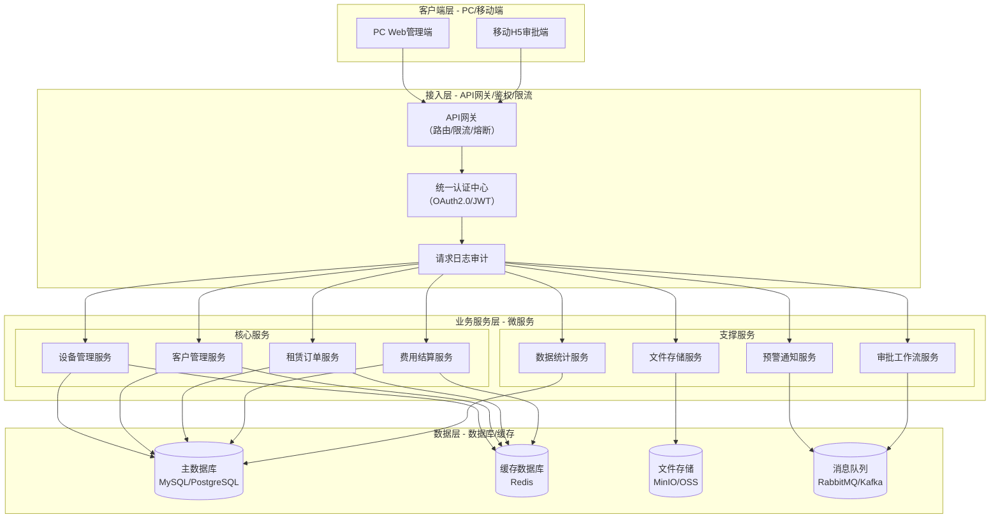
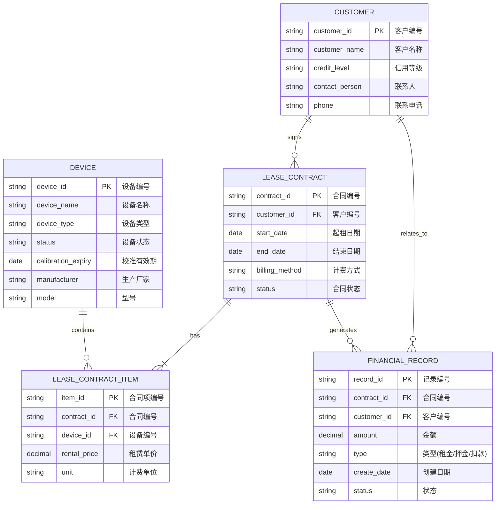
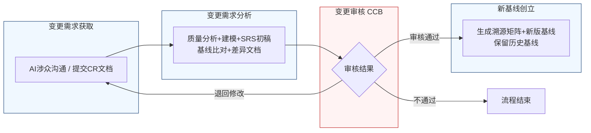

好的，作为一名资深需求分析工程师，我将严格遵循IEEE 830标准和GB/T 9385规范，采用两阶段法为您生成这份完整的软件需求规格说明书（SRS）。

---

# 软件需求规格说明书（SRS）

| 项目项 | 内容 |
| ---- | ---- |
| 文档名称 | 软件需求规格说明书（SRS） |
| 项目名称 | 医疗器械租赁管理系统 |
| 项目编号 | MED-RENTAL-2026 |
| 文档版本 | V1.0.0 |
| 基线版本 | 【占位，由A6分配】 |
| 编制人 | AI基线智能体（A6） |
| 编制日期 | 2026-06-26 |
| 审核人 | CCB变更控制委员会 |
| 批准人 | CCB变更控制委员会 |
| 密级 | 内部 |

## 修订历史记录
| 版本号 | 修订日期 | 修订类型 | 修订内容简述 |
| V1.0.0 | 2026-06-26 | 新建 | 文档初稿，确立初始需求基线 |

# 1 引言

## 1.1 编制目的
本文档旨在明确界定“医疗器械租赁管理系统”（以下简称“系统”）的功能需求、非功能需求、外部接口需求及数据需求。本文档是项目团队（包括开发、测试、运维）与业务方（包括库房、招商、运维、财务等部门）之间达成共识的正式依据，并为后续的系统设计、开发实现、测试验收及变更管理提供精确、无歧义的基线。

## 1.2 文档范围（包含/排除）

**包含范围：**
1.  **设备管理模块**：涵盖设备入库、出库、归还、校准预警、状态管理等全生命周期管理功能。
2.  **客户管理模块**：涵盖客户信息、信用等级、合同历史等管理功能。
3.  **租赁订单模块**：涵盖租赁合同的创建、审批、计费方式配置等功能。
4.  **费用结算模块**：涵盖押金管理、租金计算、发票校验、对账等功能。
5.  **数据统计模块**：涵盖设备状态、租赁业务、财务数据的统计与分析功能。
6.  **系统配置模块**：涵盖用户权限、预警策略、审批流程等配置功能。
7.  **用户认证模块**：涵盖用户登录、权限校验、会话管理等功能。

**排除范围：**
1.  本系统不直接与医院内部的HIS（医院信息系统）、LIS（实验室信息系统）或PACS（影像归档和通信系统）进行数据交互，除非在未来的接口需求中明确指定。
2.  本系统不包含对设备进行物理维修或校准的自动化控制功能。
3.  本系统不包含与第三方支付网关（如支付宝、微信支付）的直接集成，仅提供财务对账接口。
4.  本系统不包含电子签章或CA认证的集成，审批流程中的“签字”指系统内的电子确认操作。

## 1.3 引用文件
1.  GB/T 9385-2008 《计算机软件需求规格说明规范》
2.  IEEE Std 830-1998 《IEEE Recommended Practice for Software Requirements Specifications》
3.  《高级软件设计实践》教材书稿
4.  医疗器械租赁管理系统涉众需求调研记录（raw/notes/）
5.  医疗器械租赁管理系统UML建模产物
6.  医疗器械租赁管理系统结构化需求清单

## 1.4 术语与缩略语
| 术语/缩略语 | 定义 |
| :--- | :--- |
| **SRS** | 软件需求规格说明书（Software Requirements Specification） |
| **CCB** | 变更控制委员会（Change Control Board） |
| **CR** | 变更请求（Change Request） |
| **FR** | 功能需求（Functional Requirement） |
| **NFR** | 非功能需求（Non-Functional Requirement） |
| **BR** | 业务需求（Business Requirement） |
| **UR** | 用户需求（User Requirement） |
| **RTM** | 需求追溯矩阵（Requirements Traceability Matrix） |
| **P0** | 优先级0，必须实现的需求，是系统上线的最低标准。 |
| **P1** | 优先级1，重要需求，应在核心功能完成后尽快实现。 |
| **P2** | 优先级2，次要需求，可在后续迭代中实现。 |
| **三方会签** | 指需要科室主任、库房主管、质控部门三个角色依次完成电子签字确认的流程。 |
| **关键项** | 指涉及人身安全或核心性能的设备检测项目，如电气安全、传感器精度等，必须100%复核。 |
| **非关键项** | 指除关键项外的其他检测项目，可按预设比例进行抽检。 |

## 1.5 业务背景概述

**现状痛点：**
1.  **合规风险高**：设备校准过期后仍可能因流程疏忽而出库，存在法规合规风险及临床数据准确性隐患。
2.  **流程僵化**：面对临床紧急救治等特殊场景，缺乏灵活的应急出库通道，可能导致延误救治。
3.  **信息过载**：校准预警采用每日推送方式，导致库房人员产生“提醒疲劳”，容易忽略关键节点。
4.  **检测标准不一**：设备归还检测缺乏统一标准，检测结果难以追溯，设备状态判定和责任界定困难。
5.  **审批效率低**：押金扣款、合同审批等流程缺乏差异化处理，所有事项均走统一流程，影响业务效率。
6.  **对账成本高**：与医院的对账工作依赖人工，效率低下，差异定位困难。

**建设目标：**
建设一套覆盖设备全生命周期、支持灵活计费、具备强合规管控能力的医疗器械租赁管理系统，实现以下量化业务目标：
1.  **合规出库率100%**：杜绝校准过期设备未经特殊审批而出库。
2.  **紧急响应时间缩短50%**：将紧急出库审批流程从平均2小时缩短至1小时内。
3.  **预警有效触达率提升至95%**：通过优化推送策略，确保关键校准节点不被遗漏。
4.  **检测效率提升30%**：通过自动比对和标准化清单，减少人工比对和复核时间。
5.  **审批效率提升40%**：通过差异化审批流程，减少小额、常规事项的审批环节。
6.  **对账差异定位时间缩短80%**：通过系统接口自动比对，将问题定位时间从天级缩短至分钟级。

# 2 总体描述

## 2.1 产品概述（系统定位、核心价值）

**系统定位：**
本系统是面向医疗器械租赁公司的企业级业务管理系统，旨在通过信息化手段，实现设备从入库、租赁、出库、归还到报废的全生命周期闭环管理，并支持多维度、灵活的计费模式。

**核心价值：**
1.  **合规管控**：通过强制校验、预警推送、紧急放行审批等机制，确保设备使用全程符合法规要求。
2.  **业务提效**：通过自动化比对、差异化审批、标准化流程，显著提升库房、招商、财务等部门的作业效率。
3.  **决策支持**：通过多维度数据统计与分析，为管理层提供设备利用率、客户价值、财务健康度等关键决策依据。

### 系统架构图（Mermaid代码）


## 2.2 运行环境要求

| 环境类别 | 具体要求 |
| :--- | :--- |
| **硬件环境（服务器）** | CPU：8核及以上；内存：32GB及以上；硬盘：SSD 500GB及以上；网络：千兆以太网。 |
| **硬件环境（客户端）** | CPU：i5及以上；内存：8GB及以上；显示器分辨率：1920x1080及以上。 |
| **软件环境（服务器）** | 操作系统：CentOS 7.x 或 Ubuntu 20.04 LTS 及以上；应用服务器：Docker & Kubernetes；数据库：MySQL 8.0 或 PostgreSQL 14 及以上；缓存：Redis 6.x 及以上；消息队列：RabbitMQ 3.8.x 或 Kafka 2.8.x。 |
| **软件环境（客户端）** | 操作系统：Windows 10/11，macOS 12+；浏览器：Chrome 最新版，Firefox 最新版，Edge 最新版。 |
| **浏览器兼容性** | 系统应100%兼容Chrome、Firefox、Edge的最新版本及前一个主要版本。对IE浏览器不做兼容要求。 |

## 2.3 用户角色与特征

| 角色 | 职责 | 核心权限 | 使用频次 | 技能要求 |
| :--- | :--- | :--- | :--- | :--- |
| **库房人员** | 负责设备入库、出库、归还、盘点、校准管理等日常操作。 | 设备信息录入、出库/入库操作、检测数据录入、发起紧急出库申请、查看预警信息。 | 每日多次 | 熟悉设备管理流程，具备基本计算机操作能力。 |
| **招商业务员** | 负责客户开发、租赁合同签订、计费方案制定等。 | 创建/编辑租赁合同、配置计费方式、发起合同审批、查看客户信息。 | 每日多次 | 熟悉租赁业务，具备商务谈判和合同管理能力。 |
| **运维工程师** | 负责设备的技术检测、维修、保养、性能评估等。 | 录入/查看设备检测数据、查看出厂参数、标记设备异常状态、发起维修工单。 | 每日多次 | 具备医疗器械相关技术知识，熟悉设备性能参数。 |
| **财务** | 负责费用结算、押金管理、发票校验、对账等。 | 发起/审批押金扣款、查看/导出财务报表、进行对账操作、查看发票信息。 | 每日多次 | 熟悉财务流程，具备会计基础知识。 |
| **业务经理/总监** | 负责业务审批，如中额/大额押金扣款。 | 审批指定金额范围内的押金扣款申请。 | 每日数次 | 具备业务管理和风险控制能力。 |
| **财务经理/总监** | 负责财务审批，如中额/大额押金扣款。 | 审批指定金额范围内的押金扣款申请。 | 每日数次 | 具备财务管理和风险控制能力。 |
| **科室主任** | 在紧急出库流程中，审核临床需求的必要性。 | 审批紧急出库申请。 | 低频 | 具备临床科室管理经验。 |
| **质控部门** | 在紧急出库流程中，审核合规风险与财务影响。 | 审批紧急出库申请。 | 低频 | 熟悉质量控制和合规管理。 |
| **系统管理员** | 负责系统配置、用户管理、权限分配、预警策略设置等。 | 所有系统配置权限、用户管理权限、日志查看权限。 | 每日数次 | 具备系统管理和数据库知识。 |

## 2.4 系统运行模式

1.  **正常模式**：系统所有功能模块正常运行，用户可执行所有授权的业务操作，数据实时或准实时同步。
2.  **异常模式**：
    *   **部分服务不可用**：当某个微服务（如预警通知服务）发生故障时，核心业务服务（如设备出库）应能独立运行，故障服务降级为本地日志记录，待服务恢复后重试。
    *   **数据库主库故障**：系统应自动切换至只读从库，保证查询功能可用，但写入操作暂停，并提示用户系统维护中。
3.  **维护模式**：
    *   **计划内停机**：系统管理员可设置维护窗口，期间系统前端显示“系统升级中，预计X小时”的提示，禁止所有用户登录。
    *   **灰度发布**：支持对部分用户或功能模块进行灰度发布，新功能上线前可在小范围内进行验证。

## 2.5 设计与实现约束

1.  **技术约束**：
    *   系统后端必须采用微服务架构，服务间通过RESTful API或gRPC通信。
    *   系统前端必须采用前后端分离的SPA（单页应用）架构。
    *   系统必须支持容器化部署（Docker）。
2.  **合规约束**：
    *   系统必须满足《医疗器械使用质量监督管理办法》等相关法规对设备状态追溯和合规管理的要求。
    *   所有涉及用户操作的关键数据（如审批、出库、扣款）必须记录完整的操作日志，且日志不可篡改。
3.  **接口约束**：
    *   所有对外接口必须提供标准RESTful API，并附带详细的接口文档（Swagger/OpenAPI）。
    *   与医院资产管理系统的接口，需支持标准的数据格式（如JSON或XML）和加密传输（HTTPS）。
4.  **工期约束**：
    *   核心功能（设备管理、租赁订单、费用结算）必须在项目启动后6个月内完成开发并上线试运行。

## 2.6 假设与依赖

1.  **假设**：
    *   假设所有用户均具备基本的计算机操作能力。
    *   假设公司网络环境稳定，能够支持系统的正常运行。
    *   假设设备出厂测试基准数据在系统上线前已由运维部门完成录入。
2.  **依赖**：
    *   系统的正常运行依赖于公司内部IT基础设施（服务器、网络、数据库）的稳定。
    *   与医院资产管理系统的接口开发，依赖于医院方提供明确的接口规范和技术支持。
    *   系统上线前的数据迁移工作，依赖于现有业务数据的完整性和准确性。

# 3 具体需求

## 3.1 功能需求（FR）

### 3.1.1 用户认证模块

**FR-AUTH-001：用户登录**
- **优先级**：P0
- **参与角色**：所有系统用户
- **前置条件**：用户账号已在系统中创建并激活。
- **触发方式**：用户在登录页面输入用户名和密码，点击“登录”按钮。
- **业务流程**：
    1.  系统接收用户输入的用户名和密码。
    2.  系统对密码进行加密处理（如BCrypt）。
    3.  系统将加密后的凭据与数据库中存储的信息进行比对。
    4.  若比对成功，系统生成一个JWT（JSON Web Token）并返回给客户端。
    5.  若比对失败，系统返回“用户名或密码错误”的提示。
- **业务规则**：
    *   连续5次登录失败，该账号将被锁定30分钟。
    *   密码必须符合复杂度要求：长度8-20位，包含大写字母、小写字母、数字和特殊字符中的至少3种。
    *   JWT的有效期为8小时，过期后需重新登录。
- **后置状态**：用户成功登录系统，进入主界面。
- **验收标准**：
    1.  使用正确的用户名和密码登录，系统应在2秒内跳转至主界面。
    2.  使用错误的用户名或密码登录，系统应在1秒内显示错误提示。
    3.  连续5次输入错误密码后，再次尝试登录，系统应提示“账号已被锁定”。
    4.  锁定30分钟后，使用正确密码登录，应能成功。
- **关联需求条目**：BR-AUTH-001 / UR-AUTH-001

**FR-AUTH-002：用户登出**
- **优先级**：P0
- **参与角色**：所有已登录用户
- **前置条件**：用户已成功登录系统。
- **触发方式**：用户点击主界面右上角的“退出”按钮。
- **业务流程**：
    1.  系统清除客户端存储的JWT。
    2.  系统将用户重定向至登录页面。
- **业务规则**：无
- **后置状态**：用户退出系统，返回登录页面。
- **验收标准**：点击“退出”按钮后，用户应被立即重定向至登录页面，且无法通过浏览器“后退”按钮访问系统主界面。
- **关联需求条目**：BR-AUTH-002 / UR-AUTH-002

### 3.1.2 设备管理模块

**FR-EQP-001：设备出库强制校准校验**
- **优先级**：P0
- **参与角色**：库房人员
- **前置条件**：待出库设备已录入系统，且存在有效的校准有效期记录。
- **触发方式**：库房人员在出库操作界面，扫描或输入设备编号，点击“出库校验”按钮。
- **业务流程**：
    1.  系统根据设备编号查询其最新的校准有效期。
    2.  系统将当前日期与校准有效期进行比较。
    3.  **若当前日期 ≤ 校准有效期**：系统校验通过，允许执行后续出库操作。
    4.  **若当前日期 > 校准有效期**：系统校验不通过，弹出警告窗口，禁止执行出库操作。警告窗口内容为：“设备【设备编号】校准已过期，禁止出库。如需紧急出库，请发起紧急出库审批流程。”
- **业务规则**：
    *   此校验为强制校验，不可跳过。
    *   校验逻辑适用于所有状态的设备，包括“已出租”设备（在归还时触发）。
- **后置状态**：
    *   校验通过：系统进入出库信息填写页面。
    *   校验不通过：系统停留在当前页面，并显示警告信息。
- **验收标准**：
    1.  对校准有效期内的设备进行出库校验，系统应提示“校验通过”，并允许继续操作。
    2.  对校准已过期的设备进行出库校验，系统应弹出警告窗口，并禁止继续操作。
    3.  警告窗口应包含明确的“发起紧急出库审批”的链接或按钮。
- **关联需求条目**：BR-EQP-001 / UR-EQP-001

**FR-EQP-002：紧急出库审批**
- **优先级**：P0
- **参与角色**：库房人员（发起）、科室主任、库房主管、质控部门
- **前置条件**：设备出库强制校准校验不通过（校准过期）。
- **触发方式**：库房人员在FR-EQP-001的警告窗口中点击“发起紧急出库审批”链接。
- **业务流程**：
    1.  **发起**：库房人员填写紧急出库申请单，包括设备编号、紧急原因（如“临床紧急救治”、“公共卫生事件”）、使用科室、预计归还日期等。
    2.  **审批（顺序强制）**：
        a.  **库房主管审批**：系统将申请单推送至库房主管。库房主管审核设备状态与合规性，签署同意或驳回意见。
        b.  **质控部门审批**：若库房主管同意，系统将申请单推送至质控部门。质控部门审核合规风险与财务影响，签署同意或驳回意见。
        c.  **科室主任审批**：若质控部门同意，系统将申请单推送至科室主任。科室主任审核临床需求的必要性，签署同意或驳回意见。
    3.  **执行**：若三方均同意，系统允许库房人员执行出库操作。系统自动在设备电子标签上添加“紧急放行”标识，并记录完整的审批全链路日志。
- **业务规则**：
    *   审批顺序必须严格遵循：库房主管 → 质控部门 → 科室主任。任何一方驳回，流程即终止。
    *   每个审批环节，系统应设置审批时限，例如24小时。超时未审批，系统应自动发送催办通知。
    *   紧急出库的设备，其“紧急放行”标识在设备归还并完成合规校准后自动解除。
- **后置状态**：设备状态更新为“已出库（紧急放行）”，并关联完整的审批记录。
- **验收标准**：
    1.  发起紧急出库申请后，系统应能按“库房主管→质控部门→科室主任”的顺序依次推送审批任务。
    2.  任一审批人驳回，流程终止，发起人收到驳回通知。
    3.  三方均审批通过后，系统应允许执行出库操作。
    4.  出库后，设备详情页应显示“紧急放行”标识及完整的审批链路。
- **关联需求条目**：BR-EQP-002, BR-EQP-007 / UR-EQP-002, UR-EQP-007

**FR-EQP-003：校准有效期预警**
- **优先级**：P0
- **参与角色**：库房人员、系统管理员
- **前置条件**：系统中存在校准有效期在未来30天内的设备。
- **触发方式**：系统定时任务（每周一凌晨02:00）自动触发。
- **业务流程**：
    1.  系统扫描所有状态（包括“在库”、“已出租”、“维修中”等）的设备。
    2.  系统根据设备校准有效期与当前日期的差值，生成预警清单。
    3.  **推送策略**：
        a.  **每周推送**：每周一上午09:00，系统向所有库房人员推送一份“本周校准到期设备清单”。
        b.  **关键节点提醒**：对于校准有效期在30天、15天、7天内的设备，系统在对应日期的上午09:00，单独向负责该设备的库房人员发送一条提醒通知。
    4.  系统管理员可通过FR-CFG-001配置预警策略。
- **业务规则**：
    *   预警范围必须覆盖所有状态的设备。
    *   推送方式包括系统内消息和邮件通知。
    *   关键节点提醒与每周推送不冲突，即同一设备可能同时出现在两种通知中。
- **后置状态**：系统生成并推送预警通知。
- **验收标准**：
    1.  每周一上午09:00，所有库房人员应收到一份包含未来7天内到期设备的清单。
    2.  对于校准有效期恰好在30天、15天、7天后的设备，相关库房人员应在对应日期的上午09:00收到单独提醒。
    3.  预警清单应包含“已出租”状态的设备。
- **关联需求条目**：BR-EQP-003, BR-EQP-004 / UR-EQP-003, UR-EQP-004

**FR-EQP-004：设备归还检测**
- **优先级**：P1
- **参与角色**：库房人员、运维工程师
- **前置条件**：设备已从客户处归还至库房。
- **触发方式**：库房人员在系统中选择“设备归还”功能，并扫描设备编号。
- **业务流程**：
    1.  系统加载与该设备类型匹配的标准化检查清单（与入库检测清单一致）。
    2.  库房人员按照清单逐项录入检测数据。
    3.  **自动比对**：系统将录入的检测数据与设备出厂测试基准数据（如传感器灵敏度值、电池容量）进行自动偏差计算。
    4.  **异常判定**：
        a.  若偏差超出预设阈值，系统弹出醒目提醒，并自动将设备状态标注为“异常”。
        b.  若偏差在阈值内，系统将设备状态标注为“待复核”。
    5.  **关键项复核**：对于标记为“关键项”（如电气安全）的检测项目，系统强制要求库房人员进行100%复核。
    6.  **非关键项抽检**：对于标记为“非关键项”的检测项目，系统按默认50%的比例随机抽取项目，要求库房人员进行复核。
    7.  **状态更新**：
        a.  若所有关键项复核通过，且抽检的非关键项全部通过，设备状态更新为“可用”。
        b.  若任何复核不通过，设备状态更新为“异常”，并自动通知运维工程师。
- **业务规则**：
    *   标准化检查清单由系统管理员在FR-CFG-002中配置。
    *   出厂测试基准数据由运维工程师在设备入库时录入。
    *   预设阈值由系统管理员在FR-CFG-002中配置。
    *   非关键项的默认抽检比例为50%，系统管理员可根据设备类型、供应商等条件动态调整。
- **后置状态**：设备状态更新为“可用”或“异常”，并记录完整的检测数据。
- **验收标准**：
    1.  选择归还检测后，系统应加载与设备类型匹配的标准化检查清单。
    2.  录入检测数据后，系统应自动与出厂参数比对，并在偏差过大时弹出提醒。
    3.  对于关键项，系统应强制要求100%复核，否则无法提交。
    4.  对于非关键项，系统应随机抽取50%的项目要求复核。
    5.  所有复核通过后，设备状态应更新为“可用”。
- **关联需求条目**：BR-EQP-005, BR-EQP-006, BR-EQP-009, BR-EQP-010 / UR-EQP-005, UR-EQP-006, UR-EQP-009, UR-EQP-010

**FR-EQP-005：设备出库前检测**
- **优先级**：P1
- **参与角色**：库房人员、运维工程师
- **前置条件**：设备状态为“可用”，且已通过FR-EQP-001的强制校准校验。
- **触发方式**：库房人员在出库操作界面，选择“执行出库前检测”。
- **业务流程**：
    1.  系统加载与该设备类型匹配的出库前检测清单。
    2.  库房人员按照清单进行检测。
    3.  系统自动将检测数据与出厂参数进行比对（同FR-EQP-004）。
    4.  **关键项**：系统强制要求100%复核。
    5.  **非关键项**：系统按默认50%比例进行抽检复核。
    6.  所有复核通过后，系统允许执行出库操作。
- **业务规则**：
    *   出库前检测清单可与归还检测清单相同或不同，由系统管理员配置。
    *   检测不通过的设备，状态更新为“异常”，禁止出库。
- **后置状态**：设备状态更新为“待出库”或“异常”。
- **验收标准**：
    1.  出库前检测流程与FR-EQP-004的检测逻辑一致。
    2.  检测不通过的设备，无法执行出库操作。
- **关联需求条目**：BR-EQP-009, BR-EQP-010 / UR-EQP-009, UR-EQP-010

### 3.1.3 客户管理模块

**FR-CUST-001：客户信息管理**
- **优先级**：P0
- **参与角色**：招商业务员
- **前置条件**：无
- **触发方式**：招商业务员在客户管理模块点击“新增客户”或“编辑客户”。
- **业务流程**：
    1.  系统提供客户信息录入表单，字段包括：客户名称、客户类型（医院/经销商/其他）、统一社会信用代码、联系人、联系电话、地址、信用等级（A/B/C/D）等。
    2.  招商业务员填写信息并提交。
    3.  系统校验必填项是否完整，格式是否正确（如统一社会信用代码的校验）。
    4.  校验通过后，系统保存客户信息。
- **业务规则**：
    *   客户名称和统一社会信用代码必须唯一。
    *   信用等级初始默认为B级，可由财务或管理员调整。
- **后置状态**：客户信息成功创建或更新。
- **验收标准**：
    1.  可成功新增一个客户，所有必填项校验通过。
    2.  编辑客户信息后，系统应保存最新数据。
    3.  重复的客户名称或信用代码应被系统拒绝。
- **关联需求条目**：BR-CUST-001 / UR-CUST-001

### 3.1.4 租赁订单模块

**FR-ORD-001：创建租赁合同**
- **优先级**：P0
- **参与角色**：招商业务员
- **前置条件**：客户信息已存在。
- **触发方式**：招商业务员在租赁订单模块点击“新建合同”。
- **业务流程**：
    1.  招商业务员选择客户，填写合同基本信息（合同编号、起租日期、结束日期等）。
    2.  **选择计费方式**：招商业务员从系统支持的计费方式中选择一种或多种（混合计费）：
        *   按开机次数
        *   按使用时长（小时/天/周/月）
        *   按使用量（里程/疗程/检测次数）
        *   按收入分成
        *   混合计费（基础租金 + 超量按次计费）
        *   固定周期 + 浮动阶梯
    3.  **发票信息校验**：系统在录入发票信息时，自动校验发票抬头、纳税人识别号、地址电话、开户行及账号等必填项的完整性和格式正确性。
    4.  **资料预检**：系统对客户上传的资质文件（如营业执照、医疗器械经营许可证）进行自动校验，检查文件是否清晰、是否在有效期内。
    5.  招商业务员确认所有信息无误后，提交合同审批。
- **业务规则**：
    *   合同编号由系统自动生成，格式为“HT-YYYYMMDD-XXXX”。
    *   发票信息校验和资料预检为强制环节，校验不通过则无法提交审批。
- **后置状态**：合同状态更新为“待审批”。
- **验收标准**：
    1.  可成功创建包含不同计费方式的合同。
    2.  录入错误的发票信息（如纳税人识别号格式错误），系统应提示错误并禁止提交。
    3.  上传不清晰或过期的资质文件，系统应提示“资料预检不通过”。
- **关联需求条目**：BR-ORD-001, BR-ORD-002, BR-ORD-003 / UR-ORD-001, UR-ORD-002, UR-ORD-003

### 3.1.5 费用结算模块

**FR-FIN-001：押金扣款审批**
- **优先级**：P0
- **参与角色**：财务、业务经理、财务经理、业务总监、财务总监、总经理
- **前置条件**：存在可执行押金扣款的合同。
- **触发方式**：财务人员发起押金扣款申请。
- **业务流程**：
    1.  财务人员选择合同，输入扣款金额和扣款原因。
    2.  系统根据客户信用等级和扣款金额，自动匹配审批流程：
        *   **自动扣款**：若客户信用等级为A级且扣款金额 ≤ 20,000元，或信用等级为B级且扣款金额 ≤ 5,000元，或信用等级为C/D级且扣款金额 ≤ 2,000元，系统自动执行扣款，无需人工审批。
        *   **中额审批**：若扣款金额 > 自动扣款上限且 ≤ 50,000元，需经业务经理初审，财务经理复核。
        *   **大额审批**：若扣款金额 > 50,000元，需经业务总监、财务总监、总经理三级审批。
- **业务规则**：
    *   扣款金额必须为正数。
    *   审批流程中的每个环节，审批人可签署同意或驳回意见。
    *   任一环节驳回，流程终止。
- **后置状态**：扣款成功或流程终止。
- **验收标准**：
    1.  对A级客户发起一笔15,000元的扣款，系统应自动执行，无需审批。
    2.  对B级客户发起一笔30,000元的扣款，系统应推送至业务经理和财务经理审批。
    3.  对任何客户发起一笔60,000元的扣款，系统应推送至业务总监、财务总监、总经理三级审批。
- **关联需求条目**：BR-FIN-001 / UR-FIN-001

**FR-FIN-002：对账差异处理**
- **优先级**：P1
- **参与角色**：财务
- **前置条件**：系统已与医院资产管理系统建立接口。
- **触发方式**：财务人员点击“发起对账”按钮。
- **业务流程**：
    1.  系统从医院资产管理系统中获取指定时间范围内的设备租赁数据。
    2.  系统自动将获取的数据与本系统中的租赁合同数据进行比对，关键比对字段包括：设备编号、起租日期、结束日期、租金等。
    3.  系统生成对账差异报告，清晰列出所有不一致的记录。
    4.  财务人员根据差异报告进行人工核实和处理。
- **业务规则**：
    *   对账周期可按月或按季度配置。
    *   对账差异报告应支持导出为Excel格式。
- **后置状态**：生成对账差异报告。
- **验收标准**：
    1.  发起对账后，系统应在5分钟内完成数据获取和比对。
    2.  系统应能准确识别出设备编号、起租日期等关键字段的差异。
    3.  差异报告应清晰展示本系统数据和医院系统数据的对比。
- **关联需求条目**：BR-FIN-002 / UR-FIN-002

### 3.1.6 数据统计模块

**FR-STAT-001：设备状态统计**
- **优先级**：P1
- **参与角色**：所有用户（根据权限查看）
- **前置条件**：无
- **触发方式**：用户点击“数据统计”菜单下的“设备状态统计”。
- **业务流程**：
    1.  系统以图表（饼图、柱状图）和表格形式展示当前所有设备的状态分布，如：在库、已出租、维修中、异常、报废等。
    2.  用户可按设备类型、品牌、所属科室等维度进行筛选。
- **业务规则**：数据实时更新。
- **后置状态**：展示统计结果。
- **验收标准**：页面加载后，应在3秒内展示准确的设备状态分布图。
- **关联需求条目**：BR-STAT-001 / UR-STAT-001

**FR-STAT-002：租赁业务统计**
- **优先级**：P2
- **参与角色**：招商业务员、管理层
- **前置条件**：无
- **触发方式**：用户点击“数据统计”菜单下的“租赁业务统计”。
- **业务流程**：
    1.  系统以图表和表格形式展示租赁业务的关键指标，如：月度新增合同数、月度租赁收入、设备出租率、客户回款率等。
    2.  用户可按时间范围（本月、本季度、本年）进行筛选。
- **业务规则**：数据每日凌晨进行T+1汇总。
- **后置状态**：展示统计结果。
- **验收标准**：选择时间范围后，系统应在5秒内展示对应的业务统计数据。
- **关联需求条目**：BR-STAT-002 / UR-STAT-002

### 3.1.7 系统配置模块

**FR-CFG-001：配置校准预警策略**
- **优先级**：P1
- **参与角色**：系统管理员
- **前置条件**：无
- **触发方式**：系统管理员在“系统配置”菜单下选择“预警策略配置”。
- **业务流程**：
    1.  系统管理员可配置预警的推送频率（如每周、每日）、关键节点提醒时间（如30天、15天、7天）、推送方式（系统内消息、邮件）等。
    2.  系统管理员可配置预警的启用/停用状态。
- **业务规则**：配置保存后立即生效。
- **后置状态**：预警策略更新。
- **验收标准**：修改预警策略后，系统应按照新的策略执行预警推送。
- **关联需求条目**：BR-CFG-001 / UR-CFG-001

**FR-CFG-002：配置检测清单与阈值**
- **优先级**：P1
- **参与角色**：系统管理员、运维工程师
- **前置条件**：无
- **触发方式**：系统管理员在“系统配置”菜单下选择“检测清单配置”。
- **业务流程**：
    1.  系统管理员可为不同设备类型创建或编辑标准化检查清单。
    2.  系统管理员可为清单中的每个检测项设置是否为“关键项”。
    3.  系统管理员可为每个检测项设置与出厂参数的偏差阈值。
    4.  系统管理员可配置非关键项的默认抽检比例。
- **业务规则**：配置保存后，新的检测任务将使用最新配置。
- **后置状态**：检测清单与阈值更新。
- **验收标准**：为某设备类型新增一个关键项后，后续对该类型设备的检测将强制要求100%复核该项。
- **关联需求条目**：BR-CFG-002 / UR-CFG-002

### 系统用例图（PlantUML代码）
```plantuml
@startuml
left to right direction
skinparam packageStyle rectangle
skinparam actorStyle awesome

' ============================================
' 第一步：涉众 → Actor 映射
' ============================================
actor "库房人员" as WH
actor "招商业务员" as BD
actor "运维工程师" as OPS
actor "财务" as FIN
actor "系统管理员" as ADMIN

' ============================================
' 第二步：从需求中提取用例
' ============================================

' --- 设备管理 (EQP) ---
usecase (UC1) as "设备出库\n强制校准校验" ' FR-EQP-001
usecase (UC2) as "紧急出库审批" ' FR-EQP-002
usecase (UC3) as "校准有效期预警" ' FR-EQP-003
usecase (UC4) as "设备归还检测" ' FR-EQP-004
usecase (UC5) as "设备出库前检测" ' FR-EQP-005

' --- 客户管理 (CUST) ---
usecase (UC6) as "客户信息管理" ' FR-CUST-001

' --- 租赁订单 (ORD) ---
usecase (UC7) as "创建租赁合同" ' FR-ORD-001

' --- 费用结算 (FIN) ---
usecase (UC8) as "押金扣款审批" ' FR-FIN-001
usecase (UC9) as "对账差异处理" ' FR-FIN-002

' --- 数据统计 (STAT) ---
usecase (UC10) as "设备状态统计" ' FR-STAT-001
usecase (UC11) as "租赁业务统计" ' FR-STAT-002

' --- 系统配置 (CFG) ---
usecase (UC12) as "配置校准预警策略" ' FR-CFG-001
usecase (UC13) as "配置检测清单与阈值" ' FR-CFG-002

' ============================================
' 第三步：建立关系
' ============================================

' --- Actor 与 用例 关联 ---
WH --> UC1
WH --> UC2
WH --> UC3
WH --> UC4
WH --> UC5

BD --> UC6
BD --> UC7

OPS --> UC4
OPS --> UC5
OPS --> UC13

FIN --> UC8
FIN --> UC9

ADMIN --> UC12
ADMIN --> UC13

' --- <<include>> 关系 ---
' UC1 设备出库强制校准校验 包含 UC3 校准有效期预警 (因为校验需要依赖预警信息)
UC1 ..> UC3 : <<include>>

' UC7 创建租赁合同 包含 发票信息校验 和 资料预检
usecase (UC7a) as "发票信息校验"
usecase (UC7b) as "资料预检"
UC7 ..> UC7a : <<include>>
UC7 ..> UC7b : <<include>>

' --- <<extend>> 关系 ---
' UC1 设备出库强制校准校验 在特定条件下 (校准过期且紧急) 扩展出 UC2 紧急出库审批
UC1 ..> UC2 : <<extend>>\n校准过期且\n紧急需求

' UC8 押金扣款审批 在特定条件下 (客户信用等级高) 扩展出 自动扣款处理
usecase (UC8a) as "自动扣款处理"
UC8 ..> UC8a : <<extend>>\n信用等级A级\n且金额≤2万

@enduml
```

## 3.2 外部接口需求（IFR）

**IFR-001：与医院资产管理系统接口**
- **接口方向**：本系统 → 医院资产管理系统（单向获取数据）
- **接口协议**：HTTPS + RESTful API
- **数据格式**：JSON
- **接口功能**：获取指定时间范围内，医院系统中与本系统相关的设备租赁数据，用于对账。
- **请求参数**：`startDate` (string, YYYY-MM-DD), `endDate` (string, YYYY-MM-DD), `hospitalId` (string)
- **响应参数**：包含设备编号、起租日期、结束日期、租金等字段的数组。
- **安全认证**：使用API Key或OAuth 2.0 Client Credentials进行认证。
- **频率限制**：每日最多调用12次。

**IFR-002：邮件通知接口**
- **接口方向**：本系统 → 公司邮件服务器（单向发送）
- **接口协议**：SMTP
- **接口功能**：用于发送校准预警、审批催办等通知。
- **数据格式**：纯文本或HTML邮件。
- **安全认证**：使用邮件服务器账号密码进行认证。

## 3.3 非功能需求（NFR）

### 3.3.1 性能需求
| 需求项 | 指标 | 场景 |
| :--- | :--- | :--- |
| **页面加载时间** | ≤ 3秒 | 90%的用户操作，在非高峰时段（如夜间） |
| **页面加载时间** | ≤ 5秒 | 90%的用户操作，在高峰时段（如工作日上午10点） |
| **接口响应时间** | ≤ 500毫秒 | 90%的简单查询接口（如根据ID查询设备） |
| **接口响应时间** | ≤ 2秒 | 90%的复杂查询接口（如多条件筛选设备列表） |
| **接口响应时间** | ≤ 5秒 | 90%的写入接口（如创建合同、提交审批） |
| **并发用户数** | ≥ 200 | 系统应能同时支持200个活跃用户在线操作。 |
| **吞吐量** | ≥ 1000 TPS | 核心业务接口（如设备出库校验）应能支持每秒1000次的事务处理。 |

### 3.3.2 可靠性需求
| 需求项 | 指标 |
| :--- | :--- |
| **系统可用率** | ≥ 99.9%（按年计算，全年不可用时间不超过8.76小时） |
| **连续运行时间** | 系统应能7x24小时连续运行，无需计划内重启。 |
| **故障恢复时间** | 发生非灾难性故障（如单个服务宕机）后，应在15分钟内恢复服务。 |
| **数据备份** | 数据库应每日进行全量备份，每4小时进行增量备份。 |

### 3.3.3 安全性需求
| 需求项 | 要求 |
| :--- | :--- |
| **用户认证** | 必须使用OAuth 2.0或JWT进行用户认证。 |
| **权限控制** | 必须实现基于角色的访问控制（RBAC），不同角色只能访问其权限范围内的功能和数据。 |
| **数据加密** | 用户密码必须使用BCrypt等强哈希算法加密存储。所有敏感数据（如客户信息、财务数据）在传输过程中必须使用HTTPS加密。 |
| **攻击防护** | 系统应具备防SQL注入、防XSS攻击、防CSRF攻击的能力。 |
| **操作审计** | 所有关键业务操作（如出库、审批、扣款）必须记录完整的操作日志，包括操作人、操作时间、操作内容、操作结果。日志不可篡改。 |

### 3.3.4 可维护性需求
1.  系统日志应分级（DEBUG、INFO、WARN、ERROR），并支持按级别、模块、时间等维度进行检索。
2.  系统应提供健康检查接口（/health），用于监控各服务的运行状态。
3.  系统应支持配置的热加载，修改配置后无需重启服务即可生效（对于非关键配置）。

### 3.3.5 可扩展性需求
1.  业务服务层应采用微服务架构，支持对单个服务进行独立的水平扩展。
2.  系统应支持插件化或模块化设计，便于未来新增功能模块（如维修管理、供应商管理）。

### 3.3.6 易用性需求
1.  系统界面应简洁清晰，导航结构符合用户操作习惯。
2.  关键操作（如出库、审批）应提供明确的引导和提示。
3.  所有列表页应支持分页、排序和按关键字段搜索。
4.  系统应支持批量导入/导出功能（如设备信息、客户信息）。

## 3.4 数据需求

### E-R图（Mermaid erDiagram）


### 数据字典（核心实体）
| 表名 | 字段名 | 类型 | 主键 | 外键 | 默认值 | 说明 |
| :--- | :--- | :--- | :--- | :--- | :--- | :--- |
| **DEVICE** | device_id | VARCHAR(50) | Y | N | | 设备唯一编号 |
| | device_name | VARCHAR(200) | N | N | | 设备名称 |
| | device_type | VARCHAR(50) | N | N | | 设备类型，如“呼吸机” |
| | status | VARCHAR(20) | N | N | '在库' | 设备状态：在库、已出租、维修中、异常、报废 |
| | calibration_expiry | DATE | N | N | | 校准有效期 |
| | manufacturer | VARCHAR(100) | N | N | | 生产厂家 |
| | model | VARCHAR(100) | N | N | | 型号 |
| **CUSTOMER** | customer_id | VARCHAR(50) | Y | N | | 客户唯一编号 |
| | customer_name | VARCHAR(200) | N | N | | 客户名称 |
| | credit_level | CHAR(1) | N | N | 'B' | 信用等级：A、B、C、D |
| | contact_person | VARCHAR(50) | N | N | | 联系人 |
| | phone | VARCHAR(20) | N | N | | 联系电话 |
| **LEASE_CONTRACT** | contract_id | VARCHAR(50) | Y | N | | 合同编号 |
| | customer_id | VARCHAR(50) | N | Y | | 关联CUSTOMER表 |
| | start_date | DATE | N | N | | 起租日期 |
| | end_date | DATE | N | N | | 结束日期 |
| | billing_method | VARCHAR(100) | N | N | | 计费方式描述 |
| | status | VARCHAR(20) | N | N | '待审批' | 合同状态：待审批、已生效、已终止 |
| **LEASE_CONTRACT_ITEM** | item_id | VARCHAR(50) | Y | N | | 合同项唯一编号 |
| | contract_id | VARCHAR(50) | N | Y | | 关联LEASE_CONTRACT表 |
| | device_id | VARCHAR(50) | N | Y | | 关联DEVICE表 |
| | rental_price | DECIMAL(10,2) | N | N | | 租赁单价 |
| | unit | VARCHAR(20) | N | N | | 计费单位：次、小时、天、月 |
| **FINANCIAL_RECORD** | record_id | VARCHAR(50) | Y | N | | 财务记录唯一编号 |
| | contract_id | VARCHAR(50) | N | Y | | 关联LEASE_CONTRACT表 |
| | customer_id | VARCHAR(50) | N | Y | | 关联CUSTOMER表 |
| | amount | DECIMAL(10,2) | N | N | | 金额 |
| | type | VARCHAR(20) | N | N | | 类型：租金、押金、扣款 |
| | create_date | DATETIME | N | N | CURRENT_TIMESTAMP | 创建日期 |
| | status | VARCHAR(20) | N | N | '待处理' | 状态：待处理、已完成、已取消 |

### 数据管理策略
1.  **备份策略**：
    *   每日凌晨02:00进行数据库全量备份。
    *   每4小时进行一次增量备份。
    *   备份文件保留30天。
2.  **归档策略**：
    *   对于已终止超过3年的合同及其关联的财务记录，系统自动进行归档，从主数据库中移出至归档数据库。
3.  **数据留存**：
    *   所有操作日志至少保留2年。
    *   所有业务数据（设备、客户、合同）永久保留。

# 4 需求基线与变更管理

## 4.1 需求基线定义
1.  **基线版本格式**：`BL-YYYYMMDD-NN`（YYYYMMDD=日期，NN=当日流水号）；
2.  **初始基线**：经CCB审批通过、正式发布的第一版SRS；
3.  **基线冻结**：基线发布后，禁止无流程私自修改需求。

## 4.2 需求变更整体流程


## 4.3 变更详细流程（四阶段）
### 4.3.1 阶段一：变更需求获取
两种途径：涉众AI智能体沟通 / 需求提出方提交正式CR变更需求文档

### 4.3.2 阶段二：变更需求分析（4个子阶段）
1.  需求质量分析：校验变更需求合理性、完整性、无歧义
2.  项目建模：更新UML用例图、活动图
3.  SRS初稿生成：整合输出变更版SRS初稿
4.  基线比对：读取历史基线，生成需求差异文档

### 4.3.3 阶段三：变更审核（CCB评审）
1.  审核不通过 → 流程终止
2.  审核退回修改 → 返回变更需求获取阶段
3.  审核通过 → 进入新基线创立环节

### 4.3.4 阶段四：新基线创立
1.  生成需求溯源矩阵（RTM），建立变更前后条目映射
2.  将审核通过的SRS定为新版正式基线
3.  沿用版本规则生成新基线编号
4.  历史基线文档完整归档、不覆盖、不删除

## 4.4 变更记录台账
| 变更编号 | 变更日期 | 申请人 | 变更来源(AI/CR) | 变更简述 | 影响模块 | CCB结论 | 新版基线号 |
| ---- | ---- | ---- | ---- | ---- | ---- | ---- | ---- |
| — | — | — | 初始基线 | 初始基线，无历史变更 | — | 通过 | 【占位】 |

# 5 附录

## 附录A 全量图表汇总
集中存放本SRS中的架构图、用例图、E-R图、流程图（Mermaid代码）：
- 系统架构图：见 §2.1
- 系统用例图：见 §3.1
- E-R图：见 §3.4
- 变更流程图：见 §4.2

## 附录B 验收标准总表
| 需求编号 | 需求名称 | 验收标准 | 优先级 |
| :--- | :--- | :--- | :--- |
| FR-EQP-001 | 设备出库强制校准校验 | 1. 对校准有效期内的设备进行出库校验，系统应提示“校验通过”。<br>2. 对校准已过期的设备进行出库校验，系统应弹出警告窗口，并禁止继续操作。 | P0 |
| FR-EQP-002 | 紧急出库审批 | 1. 发起申请后，系统应按“库房主管→质控部门→科室主任”的顺序推送审批。<br>2. 三方均通过后，系统应允许出库，并添加“紧急放行”标识。 | P0 |
| FR-FIN-001 | 押金扣款审批 | 1. 对A级客户发起一笔15,000元的扣款，系统应自动执行。<br>2. 对任何客户发起一笔60,000元的扣款，系统应推送至三级审批。 | P0 |

## 附录C 参考资料与外部文档链接
1.  GB/T 9385-2008 计算机软件需求规格说明规范
2.  IEEE 830 软件需求规格说明书标准
3.  《高级软件设计实践》教材书稿
4.  医疗器械租赁管理系统涉众需求调研记录（raw/notes/）
5.  医疗器械租赁管理系统UML建模产物
6.  医疗器械租赁管理系统结构化需求清单