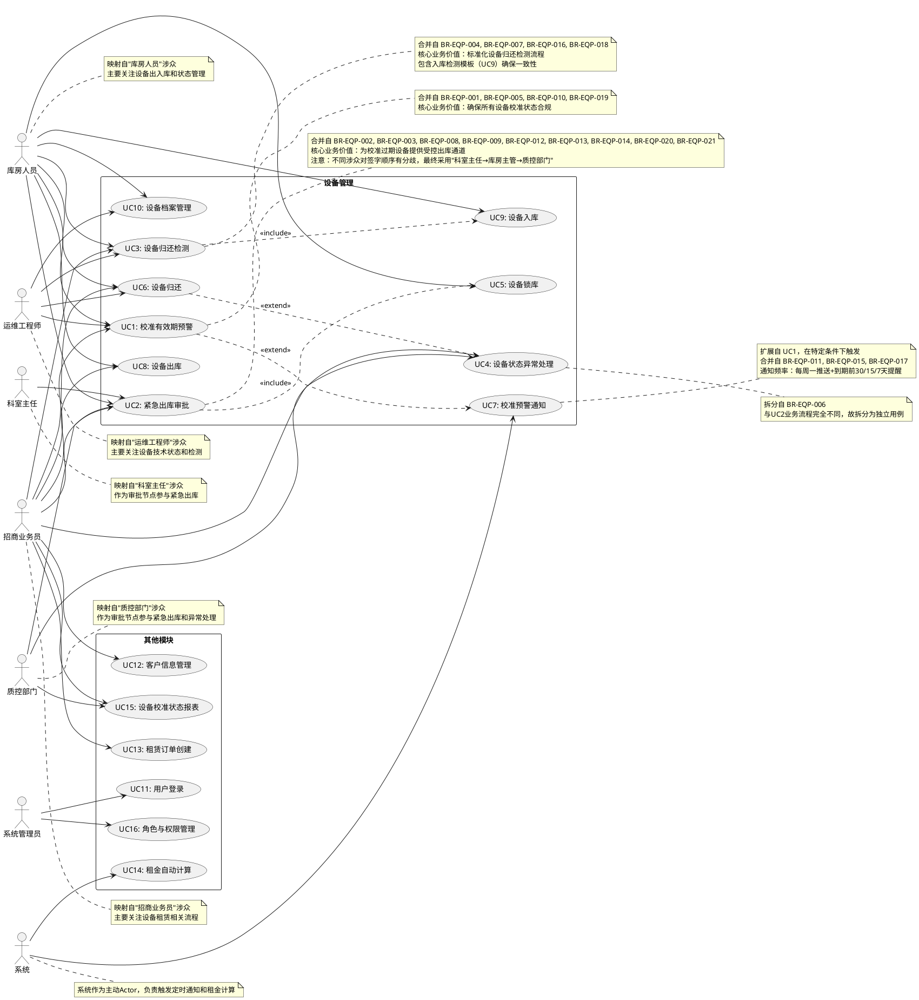
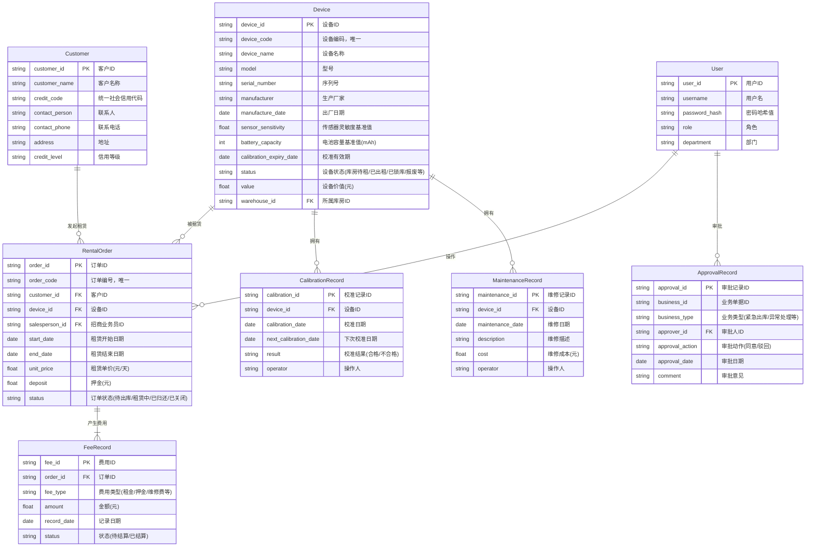
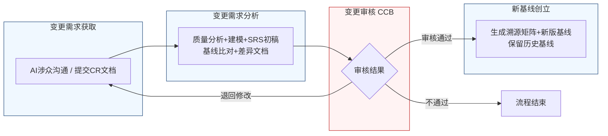

好的，作为一名资深需求分析工程师，我将严格遵循IEEE 830标准和GB/T 9385规范，并采用两阶段法生成此份软件需求规格说明书。我将恪守“精确优先于流畅”的原则，保留需求清单中的每一个数字、边界条件和约束参数。

---
# 文档头部信息
| 项目项 | 内容 |
| ---- | ---- |
| 文档名称 | 软件需求规格说明书（SRS）|
| 项目名称 | 医疗器械租赁管理系统 |
| 项目编号 | MED-RENTAL-2026 |
| 文档版本 | V1.0.0 |
| 基线版本 | BL-20260626-01 |
| 编制人 | AI基线智能体（A6） |
| 编制日期 | 2026-06-26 |
| 审核人 | CCB变更控制委员会 |
| 批准人 | CCB变更控制委员会 |
| 密级 | 内部 |

## 修订历史记录
| 版本号 | 修订日期 | 修订类型 | 修订内容简述 |
| ---- | ---- | ---- | ---- |
| V1.0.0 | 2026-06-26 | 新建 | 文档初稿，确立初始需求基线 |

# 1 引言
## 1.1 编制目的
本软件需求规格说明书（SRS）旨在为“医疗器械租赁管理系统”项目提供一份完整、精确、无歧义的需求定义。其核心目的包括：
1.  **建立共识**：在项目干系人（包括招商业务员、库房人员、运维工程师、质控部门、科室主任、开发团队、测试团队及管理层）之间，就系统应提供的功能、性能、接口及约束达成一致的理解。
2.  **指导设计与开发**：作为系统设计、编码实现和单元测试的基础文档，确保开发成果精确符合业务需求。
3.  **提供验收依据**：为系统验收测试提供可量化、可追溯的验收标准，确保交付的系统满足所有既定需求。
4.  **管理需求变更**：作为需求基线的核心组成部分，为后续的需求变更管理提供基准和追溯依据。

## 1.2 文档范围（包含/排除）
**包含范围**：
本SRS涵盖“医疗器械租赁管理系统”的核心业务模块，具体包括：
1.  用户认证与权限管理
2.  设备全生命周期管理（入库、出库、归还、校准、预警、锁库、报废）
3.  客户信息管理
4.  租赁订单管理（创建、执行、变更、终止）
5.  费用结算管理（租金计算、费用收取、发票管理）
6.  数据统计与分析报表
7.  系统配置与基础数据维护
8.  与外部系统的接口定义（如财务系统、短信/邮件网关）

**排除范围**：
本SRS不包含以下内容：
1.  硬件设备的物理设计与制造规格。
2.  具体的用户界面（UI）视觉设计稿（如颜色、字体、图标），但会定义交互逻辑和易用性要求。
3.  项目开发计划、预算、人员配置及风险管理计划。
4.  系统部署、运维及灾备的详细方案。
5.  第三方设备（如扫码枪、打印机）的驱动程序开发。

## 1.3 引用文件
1.  GB/T 9385-2008《计算机软件需求规格说明规范》
2.  IEEE Std 830-1998《IEEE Recommended Practice for Software Requirements Specifications》
3.  《高级软件设计实践》教材书稿（2026版）
4.  医疗器械租赁管理系统涉众需求调研记录（raw/notes/）
5.  医疗器械租赁管理系统UML建模产物
6.  医疗器械租赁管理系统结构化需求清单

## 1.4 术语与缩略语
| 术语/缩略语 | 定义 |
| ---- | ---- |
| SRS | 软件需求规格说明书 |
| CCB | 变更控制委员会，负责评审和批准需求变更 |
| CR | 变更请求，用于正式提出需求变更的文档 |
| FR | 功能需求，描述系统应执行的功能 |
| NFR | 非功能需求，描述系统应具备的质量属性 |
| BR | 业务需求，描述业务目标和价值 |
| UR | 用户需求，描述用户使用系统完成的任务 |
| EQP | 设备管理模块 |
| CUS | 客户管理模块 |
| ORD | 租赁订单模块 |
| BILL | 费用结算模块 |
| STAT | 数据统计模块 |
| AUTH | 用户认证模块 |
| SYS | 系统配置模块 |
| P0 | 优先级最高，必须实现的需求 |
| P1 | 优先级重要，建议实现的需求 |
| P2 | 优先级次要，可选实现的需求 |
| 校准 | 对设备进行计量检定，确保其测量或输出参数的准确性 |
| 锁库 | 因校准过期等原因，系统自动或手动将设备状态设置为不可出库 |
| 紧急出库 | 在设备锁库状态下，通过特殊审批流程进行的出库操作 |
| 设备状态异常处理单 | 用于处理设备归还时发现的校准过期、功能故障等问题的独立流程单据 |

## 1.5 业务背景概述
**现状痛点**：
当前医疗器械租赁业务中，设备管理主要依赖线下表格和人工经验，存在以下问题：
1.  **校准管理盲区**：无法实时、全面地监控所有设备（尤其是已出租设备）的校准有效期，存在设备超期使用的合规风险。
2.  **出库流程僵化**：校准过期设备被简单锁库，缺乏应对临床紧急需求的受控通道，导致业务灵活性不足。
3.  **归还检测低效**：设备归还时，检测结果依赖人工判断，缺乏与出厂参数的自动比对，容易漏检或误判，且处理流程不清晰。
4.  **信息孤岛**：库房、业务、质控、校准组之间信息不互通，协同效率低，无法形成有效的管理闭环。

**建设目标**：
通过建设本系统，实现以下量化业务目标：
1.  **校准预警覆盖率**：系统上线后6个月内，实现对100%设备（含已出租）的校准有效期自动监控与预警。
2.  **紧急出库审批效率**：紧急出库审批流程从线下平均2天缩短至线上平均4小时内完成。
3.  **归还检测准确率**：设备归还检测的异常发现率提升50%，因漏检导致的后续纠纷减少80%。
4.  **设备状态可追溯性**：所有设备的关键状态变更（校准、出库、归还、异常处理）实现100%线上记录和追溯。

# 2 总体描述
## 2.1 产品概述（系统定位、核心价值）
**系统定位**：
本系统是一套面向医疗器械租赁公司的企业级业务管理系统，旨在通过数字化手段，实现设备从入库、租赁、归还到报废的全生命周期精细化、合规化管理。

**核心价值**：
1.  **合规风控**：通过自动化的校准预警和强制性的锁库/审批流程，确保设备使用始终符合法规要求，降低运营风险。
2.  **业务提效**：标准化、线上化的流程（如紧急出库、归还检测）显著提升跨部门协同效率，缩短业务处理周期。
3.  **数据驱动**：基于设备全生命周期的数据采集与分析，为设备维保、采购决策、客户信用评估提供数据支持。
4.  **服务保障**：确保客户现场设备的合规性与可用性，提升租赁服务质量和客户满意度。

### 系统架构图（Mermaid代码）
```mermaid
flowchart TD
    subgraph 客户端层[客户端层 - PC/移动端]
        direction LR
        A1[PC Web管理端] 
        A2[移动H5审批端]
        A3[移动H5业务端]
    end

    subgraph 接入层[接入层 - API网关/鉴权/限流]
        direction LR
        B1[API网关<br/>(Kong/Nginx)]
        B2[统一认证中心<br/>(OAuth2.0/JWT)]
        B3[流量控制与防刷]
    end

    subgraph 业务服务层[业务服务层 - 微服务]
        direction LR
        C1[用户认证服务]
        C2[设备管理服务]
        C3[客户管理服务]
        C4[租赁订单服务]
        C5[费用结算服务]
        C6[数据统计服务]
        C7[系统配置服务]
        C8[消息通知服务]
    end

    subgraph 基础服务层[基础服务层]
        direction LR
        D1[工作流引擎<br/>(Activiti/Flowable)]
        D2[规则引擎<br/>(Drools)]
        D3[文件存储服务<br/>(MinIO/OSS)]
        D4[定时任务调度<br/>(XXL-Job/Quartz)]
    end

    subgraph 数据层[数据层 - 数据库/缓存]
        direction LR
        E1[(关系型数据库<br/>MySQL/PostgreSQL)]
        E2[(缓存数据库<br/>Redis)]
        E3[(搜索引擎<br/>Elasticsearch)]
        E4[(消息队列<br/>RabbitMQ/Kafka)]
    end

    客户端层 --> 接入层
    接入层 --> 业务服务层
    业务服务层 --> 基础服务层
    业务服务层 --> 数据层
    基础服务层 --> 数据层
```

## 2.2 运行环境要求
| 环境类别 | 具体要求 |
| ---- | ---- |
| **硬件环境（服务器）** | CPU: 8核及以上；内存: 32GB及以上；磁盘: 500GB SSD及以上；网络: 千兆以太网。 |
| **软件环境（服务器）** | 操作系统: CentOS 7.9+ 或 Ubuntu 20.04+；应用服务器: JDK 11+，Tomcat 9+ 或 Spring Boot 内嵌；数据库: MySQL 8.0+ 或 PostgreSQL 13+；缓存: Redis 6.x+。 |
| **客户端环境（PC）** | 操作系统: Windows 10/11, macOS 12+；浏览器: Google Chrome 最新版（推荐），Mozilla Firefox 最新版，Microsoft Edge 最新版。 |
| **客户端环境（移动端）** | 操作系统: iOS 14+, Android 10+；浏览器: 各系统自带浏览器或微信内置浏览器。 |
| **浏览器兼容性** | 系统应保证在Chrome、Firefox、Edge的最新版本及前一个主要版本上功能完整、显示正常。 |

## 2.3 用户角色与特征
| 角色 | 职责 | 核心权限 | 使用频次 | 技能特征 |
| ---- | ---- | ---- | ---- | ---- |
| **招商业务员** | 负责设备租赁业务的全流程跟进，包括客户沟通、订单签订、设备出库/归还协调。 | 发起租赁订单、申请设备出库/归还、查看设备状态、发起紧急出库申请、查看预警信息。 | 每日多次 | 熟悉业务操作流程，具备基础计算机操作能力。 |
| **库房人员** | 负责设备的实物管理，包括入库、出库、归还检测、库存盘点、校准送检。 | 执行设备入库/出库操作、执行归还检测、查看库存、管理校准预警、发起设备状态异常处理单。 | 每日多次 | 熟悉设备类型和库房管理规范，具备基础计算机操作能力。 |
| **运维工程师** | 负责设备的技术状态管理，包括维修、保养、校准执行。 | 查看设备技术档案、录入维修/保养记录、执行校准操作、查看检测数据。 | 每周数次 | 具备专业的设备技术知识，能使用系统进行数据录入和查询。 |
| **质控部门** | 负责设备质量与合规性监管，审批特殊流程。 | 审批紧急出库申请、审批设备状态异常处理单、查看全量设备合规性报表。 | 每日数次 | 熟悉医疗器械法规和公司质控标准，具备管理决策能力。 |
| **科室主任** | 作为使用方代表，审批紧急出库申请。 | 审批紧急出库申请。 | 不定期 | 具备管理决策能力，能通过移动端进行审批操作。 |
| **系统管理员** | 负责系统的日常运维、配置和权限管理。 | 管理用户、角色、权限、系统参数、数据字典、日志审计。 | 每日数次 | 具备专业的IT系统管理技能。 |

## 2.4 系统运行模式
| 运行模式 | 描述 | 触发条件 |
| ---- | ---- | ---- |
| **正常模式** | 系统所有功能正常运行，用户可按标准流程执行业务操作。 | 系统处于默认运行状态。 |
| **异常模式** | 系统部分功能受限或不可用，但核心业务（如已出库设备的租赁服务）不受影响。 | 数据库连接失败、核心服务宕机、网络分区等。 |
| **维护模式** | 系统暂停对外服务，仅系统管理员可登录进行升级、维护操作。 | 计划内停机维护、紧急安全补丁部署。 |

## 2.5 设计与实现约束
1.  **技术约束**：
    *   后端开发语言必须为Java 11+，采用微服务架构（Spring Cloud Alibaba）。
    *   前端采用Vue 3或React 18框架。
    *   所有对外接口必须采用RESTful风格，数据交换格式为JSON。
    *   数据库必须支持ACID事务。
2.  **合规约束**：
    *   系统必须满足《医疗器械监督管理条例》等相关法规对设备追溯和记录保存的要求。
    *   所有涉及用户个人信息的操作必须符合《个人信息保护法》。
3.  **接口约束**：
    *   与财务系统的接口必须采用SFTP或HTTPS协议，数据格式为固定长度的TXT文件或XML。
    *   短信/邮件通知接口必须支持高并发、异步调用。
4.  **工期约束**：
    *   核心功能（设备管理、租赁订单）必须在项目启动后6个月内完成开发并上线试运行。

## 2.6 假设与依赖
1.  **假设**：
    *   所有设备在入库时，其出厂测试基准数据（如传感器灵敏度值、电池容量等）已由供应商提供并录入系统。
    *   用户具备基本的计算机和移动设备操作能力。
    *   网络环境稳定可靠，能够支持系统的正常运行。
2.  **依赖**：
    *   本系统的正常运行依赖于公司内部IT基础设施（服务器、网络、数据库）的稳定运行。
    *   短信/邮件通知功能的实现依赖于第三方短信网关和邮件服务器的可用性。
    *   与财务系统的数据交互依赖于财务系统接口的稳定性和数据格式的一致性。

# 3 具体需求
## 3.1 功能需求（FR）
### 3.1.1 用户认证模块（AUTH）
**FR-AUTH-001**：用户登录
- **优先级**：P0
- **参与角色**：所有用户
- **前置条件**：用户账号已在系统中创建并激活。
- **触发方式**：用户在登录页面输入用户名和密码，点击“登录”按钮。
- **业务流程**：
    1.  系统接收用户输入的用户名和密码。
    2.  系统对密码进行加密处理（如BCrypt）。
    3.  系统将用户名和加密后的密码与数据库中的用户信息进行比对。
    4.  若比对成功，系统生成一个JWT Token，并将其返回给客户端。
    5.  若比对失败，系统返回明确的错误提示（如“用户名或密码错误”）。
- **业务规则**：
    1.  连续5次登录失败，该账号将被锁定30分钟。
    2.  Token的有效期为8小时，过期后需重新登录。
- **后置状态**：用户成功登录系统，进入主界面。
- **验收标准**：
    1.  使用正确的用户名和密码登录，应在1秒内成功跳转至主界面。
    2.  使用错误的密码登录，应在500毫秒内返回“用户名或密码错误”提示。
    3.  连续输入5次错误密码后，第6次输入正确密码也应提示“账号已被锁定，请30分钟后重试”。
- **关联需求条目**：无

**FR-AUTH-002**：用户登出
- **优先级**：P0
- **参与角色**：所有已登录用户
- **前置条件**：用户已成功登录系统。
- **触发方式**：用户点击主界面上的“退出登录”按钮。
- **业务流程**：
    1.  系统清除客户端存储的JWT Token。
    2.  系统将用户重定向至登录页面。
- **业务规则**：无
- **后置状态**：用户退出系统，返回登录页面。
- **验收标准**：点击“退出登录”后，用户无法再访问需要认证的页面，并立即跳转至登录页。
- **关联需求条目**：无

### 3.1.2 设备管理模块（EQP）
**FR-EQP-001**：校准有效期预警
- **优先级**：P0
- **参与角色**：招商业务员、库房人员、运维工程师
- **前置条件**：设备档案已创建，且已录入校准有效期。
- **触发方式**：系统定时任务（每日凌晨2:00）自动扫描所有设备。
- **业务流程**：
    1.  系统扫描所有状态（包括“库房待租”、“已出租-客户已验收”）的设备。
    2.  系统计算每台设备的校准到期日与当前日期的差值。
    3.  若差值小于等于30天，系统将该设备标记为“临期”，并触发预警。
    4.  若差值小于等于0天，系统将该设备标记为“过期”，并自动执行锁库操作（FR-EQP-005）。
- **业务规则**：
    1.  **预警范围**：必须涵盖所有状态的设备，包括“库房待租”和“已出租-客户已验收”的设备。设备在“出库在途”或“待验收”状态时不纳入预警范围。
    2.  **“已出租”定义**：设备状态为“已出租”是指设备已送达客户现场，并经客户签字验收后。系统需严格区分“出库在途”、“待验收”和“已出租”状态。
    3.  **预警通知**：系统需在到期前30天、15天、7天分别发送一次单独提醒。同时，每周一上午9:00推送一次“未来30天内到期设备清单”给所有相关角色。
- **后置状态**：系统生成预警记录，并触发通知。
- **验收标准**：
    1.  创建一个校准到期日为30天后的设备，状态为“库房待租”。系统应在次日凌晨2:00后，在预警列表中看到该设备。
    2.  创建一个校准到期日为15天后的设备，状态为“已出租-客户已验收”。系统应在次日凌晨2:00后，在预警列表中看到该设备。
    3.  创建一个校准到期日为7天后的设备，系统应能验证在到期前7天、15天、30天分别收到了提醒通知。
    4.  验证每周一上午9:00，相关角色能收到一份包含未来30天内所有到期设备的清单。
- **关联需求条目**：BR-EQP-001, BR-EQP-005, BR-EQP-010, BR-EQP-019

**FR-EQP-002**：紧急出库审批
- **优先级**：P0
- **参与角色**：招商业务员（发起）、科室主任（审批）、库房主管（审批）、质控部门（审批）
- **前置条件**：设备因校准过期已被系统锁库（状态为“已锁库”）。
- **触发方式**：招商业务员在设备详情页点击“申请紧急出库”按钮。
- **业务流程**：
    1.  招商业务员填写紧急出库申请单，内容包括：使用科室、预计归还时间、校准送检或替代方案说明。
    2.  系统校验设备状态是否为“已锁库”。若不是，提示“设备未锁定，请使用常规出库流程”，流程终止。
    3.  系统生成“紧急放行”审批单，并启动审批流程。
    4.  **审批流程**：系统强制按“科室主任 → 库房主管 → 质控部门”的固定顺序流转。
        *   步骤1：科室主任审批。若同意，签字确认，流程进入步骤2；若驳回，流程终止，通知发起人。
        *   步骤2：库房主管审批。若同意，签字确认，流程进入步骤3；若驳回，流程终止，通知发起人。
        *   步骤3：质控部门审批。若同意，签字确认，流程进入步骤5；若驳回，流程终止，通知发起人。
    5.  所有审批节点完成后，系统生成一个唯一的追溯编号（格式：EMR-YYYYMMDD-XXXXX）。
    6.  系统更新设备状态为“紧急出库”。
- **业务规则**：
    1.  **签字顺序强制**：系统必须强制按“科室主任 → 库房主管 → 质控部门”的顺序执行，并在流程流转时自动校验上一节点是否已完成。若上一节点未完成，系统应拒绝提交当前节点的审批。
    2.  **审批权限**：每个审批节点只能由对应角色的指定人员操作。
- **后置状态**：设备状态更新为“紧急出库”，生成审批记录和追溯编号。
- **验收标准**：
    1.  对一个已锁库的设备发起紧急出库申请，验证审批流程必须严格按照“科室主任 → 库房主管 → 质控部门”的顺序流转，无法跳过或颠倒。
    2.  验证任一节点驳回后，流程立即终止，发起人收到通知。
    3.  验证所有节点审批通过后，设备状态变为“紧急出库”，并生成一个格式为EMR-20260626-00001的追溯编号。
- **关联需求条目**：BR-EQP-002, BR-EQP-003, BR-EQP-008, BR-EQP-009, BR-EQP-012, BR-EQP-013, BR-EQP-014, BR-EQP-020, BR-EQP-021

**FR-EQP-003**：设备归还检测
- **优先级**：P0
- **参与角色**：招商业务员（发起）、库房人员（执行检测）
- **前置条件**：设备状态为“已出租-客户已验收”。
- **触发方式**：招商业务员在订单详情页点击“发起归还”按钮。
- **业务流程**：
    1.  招商业务员发起设备归还申请。
    2.  系统校验设备状态是否为“已出租-客户已验收”。若不是，提示“设备状态异常，无法执行归还流程”，流程终止。
    3.  系统加载该设备的出厂测试基准数据（如传感器灵敏度值、电池容量等）。
    4.  库房人员使用与入库检测相同的标准化检查清单和模板，对设备进行检测。
    5.  库房人员在验收界面录入实际检测数值。
    6.  系统自动将实际检测数值与出厂基准值进行偏差计算。
    7.  若偏差超出预设阈值（例如：传感器灵敏度偏差超过±5%，或电池容量衰减超过20%），系统弹出醒目提醒，将设备标记为“异常”，并阻止完成正常收回流程。
    8.  若偏差未超出阈值，系统更新设备状态为“已归还”，记录检测数据。
- **业务规则**：
    1.  **标准化模板**：归还检测必须使用与入库检测完全相同的检查清单和模板。
    2.  **自动比对**：系统必须自动比对检测结果与出厂参数，比对逻辑不可绕过。
    3.  **异常处理**：当检测结果异常时，系统必须阻止正常收回流程，并引导用户发起“设备状态异常处理单”（FR-EQP-004）。
- **后置状态**：设备状态更新为“已归还”或“异常”，生成检测记录。
- **验收标准**：
    1.  对一个“已出租”的设备发起归还，验证系统加载了该设备的出厂基准数据。
    2.  录入一个超出阈值的检测值（如灵敏度偏差6%），验证系统弹出“异常”提醒，并阻止完成归还流程。
    3.  录入一个在阈值内的检测值，验证设备状态成功更新为“已归还”。
- **关联需求条目**：BR-EQP-004, BR-EQP-007, BR-EQP-016, BR-EQP-018

**FR-EQP-004**：设备状态异常处理
- **优先级**：P0
- **参与角色**：库房人员（发起）、质控部门（审批/评估）
- **前置条件**：设备归还检测结果被系统标记为“异常”。
- **触发方式**：系统在检测异常后，引导库房人员点击“发起异常处理单”按钮。
- **业务流程**：
    1.  库房人员发起“设备状态异常处理单”。
    2.  质控部门评估异常情况，确定处理方案（维修、降级或报废）。
    3.  根据处理方案，执行后续操作：
        *   **维修**：系统生成维修工单，流转至运维工程师。
        *   **降级**：系统更新设备等级，并重新计算其租赁价格。
        *   **报废**：系统更新设备状态为“报废”，并触发报废审批流程。
- **业务规则**：
    1.  **流程独立**：此流程与紧急出库审批流程（FR-EQP-002）完全独立，不可混用。
    2.  **责任界定**：处理单需关联合同条款，明确维保责任和费用归属。
- **后置状态**：设备状态根据处理方案更新，生成异常处理记录。
- **验收标准**：
    1.  在设备归还检测异常后，验证系统能引导用户发起“设备状态异常处理单”。
    2.  验证处理单流程与紧急出库审批流程完全独立。
- **关联需求条目**：BR-EQP-006

**FR-EQP-005**：设备锁库
- **优先级**：P0
- **参与角色**：系统（自动）、库房人员（手动）
- **前置条件**：设备校准过期（到期日小于当前日期）。
- **触发方式**：系统定时任务自动触发，或库房人员手动操作。
- **业务流程**：
    1.  系统检测到设备校准过期。
    2.  系统自动将设备状态更新为“已锁库”。
    3.  系统阻止所有常规出库操作。
- **业务规则**：
    1.  **自动执行**：锁库操作由系统在每日凌晨2:00的定时任务中自动执行。
    2.  **手动补充**：库房人员也可手动对任意设备执行锁库操作。
    3.  **例外通道**：锁库后的设备，可通过紧急出库审批流程（FR-EQP-002）出库。
- **后置状态**：设备状态更新为“已锁库”。
- **验收标准**：
    1.  创建一个校准过期1天的设备，验证系统在次日凌晨2:00后，该设备状态自动变为“已锁库”。
    2.  验证一个“已锁库”的设备，无法通过常规出库流程出库。
- **关联需求条目**：BR-EQP-013

**FR-EQP-006**：设备档案管理
- **优先级**：P0
- **参与角色**：库房人员、运维工程师
- **前置条件**：用户拥有设备档案管理权限。
- **触发方式**：用户在设备管理模块点击“新增设备”或“编辑”按钮。
- **业务流程**：
    1.  用户录入或编辑设备信息，包括但不限于：设备编码、设备名称、型号、序列号、生产厂家、出厂日期、出厂测试基准数据（传感器灵敏度值、电池容量等）、校准有效期、设备价值、存放库房等。
    2.  系统保存设备信息，并生成唯一的设备档案。
- **业务规则**：
    1.  设备编码必须唯一，由系统自动生成。
    2.  出厂测试基准数据为必填项，用于后续的归还检测比对。
- **后置状态**：设备档案创建或更新成功。
- **验收标准**：成功创建一个包含所有必填项的设备档案，并能通过设备编码唯一检索到。
- **关联需求条目**：无

### 3.1.3 客户管理模块（CUS）
**FR-CUS-001**：客户信息管理
- **优先级**：P0
- **参与角色**：招商业务员
- **前置条件**：用户拥有客户管理权限。
- **触发方式**：用户在客户管理模块点击“新增客户”或“编辑”按钮。
- **业务流程**：
    1.  用户录入或编辑客户信息，包括但不限于：客户名称、统一社会信用代码、联系人、联系电话、地址、信用等级、合作历史等。
    2.  系统保存客户信息。
- **业务规则**：
    1.  客户名称和统一社会信用代码组合必须唯一。
- **后置状态**：客户信息创建或更新成功。
- **验收标准**：成功创建一个客户，并能通过客户名称或统一社会信用代码检索到。
- **关联需求条目**：无

### 3.1.4 租赁订单模块（ORD）
**FR-ORD-001**：租赁订单创建
- **优先级**：P0
- **参与角色**：招商业务员
- **前置条件**：客户和设备信息已存在系统中。
- **触发方式**：招商业务员在订单管理模块点击“新建订单”按钮。
- **业务流程**：
    1.  招商业务员选择客户、选择设备、填写租赁起止日期、租赁单价、押金等信息。
    2.  系统校验设备在租赁期间是否可用（未被其他订单占用，且状态正常）。
    3.  系统计算租赁总价和押金。
    4.  招商业务员提交订单。
    5.  系统生成唯一的订单编号。
- **业务规则**：
    1.  订单编号格式：ORD-YYYYMMDD-XXXXX。
    2.  设备在租赁期间不可被其他订单占用。
    3.  若设备状态为“已锁库”，系统应阻止订单创建，并提示“设备已锁库，无法租赁”。
- **后置状态**：订单状态为“待审核”或“待出库”。
- **验收标准**：成功创建一个包含客户、设备、租赁周期的订单，并生成唯一订单编号。
- **关联需求条目**：无

### 3.1.5 费用结算模块（BILL）
**FR-BILL-001**：租金自动计算
- **优先级**：P0
- **参与角色**：系统（自动）
- **前置条件**：租赁订单已生效，设备已出库。
- **触发方式**：系统定时任务（每日凌晨3:00）。
- **业务流程**：
    1.  系统扫描所有处于“租赁中”状态的订单。
    2.  根据订单的租赁单价和已租赁天数，自动计算当日应计租金。
    3.  系统将应计租金累加到订单的“待结算费用”中。
- **业务规则**：
    1.  租金计算以“天”为单位，不足一天按一天计算。
    2.  租赁单价以订单签订时的价格为准。
- **后置状态**：订单的“待结算费用”更新。
- **验收标准**：创建一个租赁单价为100元/天的订单，验证系统在订单生效后的第3天，该订单的“待结算费用”为300元。
- **关联需求条目**：无

### 3.1.6 数据统计模块（STAT）
**FR-STAT-001**：设备校准状态报表
- **优先级**：P1
- **参与角色**：招商业务员、库房人员、质控部门
- **前置条件**：用户拥有报表查看权限。
- **触发方式**：用户在数据统计模块选择“设备校准状态报表”。
- **业务流程**：
    1.  用户选择报表筛选条件（如设备状态、校准到期时间范围）。
    2.  系统根据筛选条件，从数据库中查询并汇总数据。
    3.  系统以表格和图表形式展示报表，内容包括：设备总数、临期设备数、过期设备数、已锁库设备数等。
- **业务规则**：无
- **后置状态**：报表展示成功。
- **验收标准**：选择“已锁库”状态，报表应只显示所有状态为“已锁库”的设备。
- **关联需求条目**：无

### 3.1.7 系统配置模块（SYS）
**FR-SYS-001**：角色与权限管理
- **优先级**：P0
- **参与角色**：系统管理员
- **前置条件**：用户拥有系统管理权限。
- **触发方式**：用户在系统配置模块选择“角色管理”或“权限管理”。
- **业务流程**：
    1.  系统管理员创建、编辑或删除角色。
    2.  系统管理员为角色分配或回收权限（如“设备管理-查看”、“设备管理-编辑”、“订单管理-审批”等）。
    3.  系统管理员为用户分配角色。
- **业务规则**：
    1.  权限控制粒度需到按钮级别。
    2.  一个用户可以拥有多个角色。
- **后置状态**：角色和权限配置生效。
- **验收标准**：为一个用户分配“设备管理-查看”权限后，该用户只能查看设备信息，无法编辑。
- **关联需求条目**：无

### 系统用例图（PlantUML代码）


## 3.2 外部接口需求（IFR）
**IFR-001**：财务系统接口
- **接口类型**：数据交换
- **协议**：SFTP
- **数据格式**：固定长度TXT文件
- **交互方向**：本系统 -> 财务系统
- **触发方式**：每日凌晨4:00定时推送
- **数据内容**：当日所有已完成的费用结算记录，包括订单号、客户名称、费用类型、金额、结算日期等。
- **验收标准**：系统每日凌晨4:00成功生成一个TXT文件，并通过SFTP上传至指定服务器。文件格式和内容与财务系统要求完全一致。

**IFR-002**：短信/邮件通知接口
- **接口类型**：API调用
- **协议**：HTTPS
- **数据格式**：JSON
- **交互方向**：本系统 -> 短信/邮件网关
- **触发方式**：系统内部事件触发（如预警、审批通知）
- **数据内容**：接收方手机号/邮箱、通知内容。
- **验收标准**：当系统触发一个预警通知时，应在5秒内成功调用短信/邮件网关API，并返回成功状态码。

### E-R图（Mermaid erDiagram）


### 数据字典（表格）
| 表名 | 字段名 | 类型 | 主键 | 外键 | 默认值 | 说明 |
| ---- | ---- | ---- | ---- | ---- | ---- | ---- |
| Device | device_id | VARCHAR(32) | Y | N | UUID | 设备唯一标识 |
| Device | device_code | VARCHAR(64) | N | N | 自动生成 | 设备编码，唯一索引 |
| Device | device_name | VARCHAR(128) | N | N | 无 | 设备名称 |
| Device | model | VARCHAR(64) | N | N | 无 | 型号 |
| Device | serial_number | VARCHAR(128) | N | N | 无 | 序列号 |
| Device | manufacturer | VARCHAR(128) | N | N | 无 | 生产厂家 |
| Device | manufacture_date | DATE | N | N | 无 | 出厂日期 |
| Device | sensor_sensitivity | DECIMAL(10,2) | N | N | 0.00 | 传感器灵敏度基准值 |
| Device | battery_capacity | INT | N | N | 0 | 电池容量基准值(mAh) |
| Device | calibration_expiry_date | DATE | N | N | 无 | 校准有效期 |
| Device | status | VARCHAR(32) | N | N | '库房待租' | 设备状态 |
| Device | value | DECIMAL(12,2) | N | N | 0.00 | 设备价值(元) |
| Device | warehouse_id | VARCHAR(32) | N | Y | 无 | 所属库房ID |
| Customer | customer_id | VARCHAR(32) | Y | N | UUID | 客户唯一标识 |
| Customer | customer_name | VARCHAR(128) | N | N | 无 | 客户名称 |
| Customer | credit_code | VARCHAR(32) | N | N | 无 | 统一社会信用代码，唯一索引 |
| Customer | contact_person | VARCHAR(64) | N | N | 无 | 联系人 |
| Customer | contact_phone | VARCHAR(20) | N | N | 无 | 联系电话 |
| Customer | address | VARCHAR(256) | N | N | 无 | 地址 |
| Customer | credit_level | VARCHAR(16) | N | N | 'B' | 信用等级 |
| RentalOrder | order_id | VARCHAR(32) | Y | N | UUID | 订单唯一标识 |
| RentalOrder | order_code | VARCHAR(64) | N | N | 自动生成 | 订单编号，唯一索引 |
| RentalOrder | customer_id | VARCHAR(32) | N | Y | 无 | 客户ID |
| RentalOrder | device_id | VARCHAR(32) | N | Y | 无 | 设备ID |
| RentalOrder | salesperson_id | VARCHAR(32) | N | Y | 无 | 招商业务员ID |
| RentalOrder | start_date | DATE | N | N | 无 | 租赁开始日期 |
| RentalOrder | end_date | DATE | N | N | 无 | 租赁结束日期 |
| RentalOrder | unit_price | DECIMAL(10,2) | N | N | 0.00 | 租赁单价(元/天) |
| RentalOrder | deposit | DECIMAL(12,2) | N | N | 0.00 | 押金(元) |
| RentalOrder | status | VARCHAR(32) | N | N | '待出库' | 订单状态 |
| FeeRecord | fee_id | VARCHAR(32) | Y | N | UUID | 费用唯一标识 |
| FeeRecord | order_id | VARCHAR(32) | N | Y | 无 | 订单ID |
| FeeRecord | fee_type | VARCHAR(32) | N | N | 无 | 费用类型 |
| FeeRecord | amount | DECIMAL(12,2) | N | N | 0.00 | 金额(元) |
| FeeRecord | record_date | DATE | N | N | CURRENT_DATE | 记录日期 |
| FeeRecord | status | VARCHAR(16) | N | N | '待结算' | 状态 |

## 3.3 非功能需求（NFR）
### 3.3.1 性能需求
1.  **页面加载时间**：在标准网络环境下（带宽10Mbps），所有功能页面的首次加载时间不得超过3秒。
2.  **接口响应时间**：95%的API接口响应时间不得超过500毫秒。
3.  **并发用户数**：系统应支持至少200个并发用户同时在线操作。
4.  **吞吐量**：系统应能处理至少每秒1000次的事务请求（TPS）。

### 3.3.2 可靠性需求
1.  **系统可用率**：系统在7x24小时运行模式下，年度可用率不低于99.9%（即年度计划外停机时间不超过8.76小时）。
2.  **连续运行**：系统应能连续运行7天而无需重启，且性能不会出现明显下降。
3.  **故障恢复**：当系统发生故障时，应在30分钟内恢复服务。

### 3.3.3 安全性需求
1.  **用户认证**：所有用户必须通过用户名和密码进行认证，密码必须经过加密存储（如BCrypt）。
2.  **权限控制**：系统必须实现基于角色的访问控制（RBAC），确保用户只能访问其权限范围内的功能和数据。
3.  **数据加密**：所有用户敏感信息（如密码、手机号）在传输和存储时必须进行加密。
4.  **攻击防护**：系统必须能防御常见的Web攻击，如SQL注入、XSS、CSRF等。
5.  **审计日志**：所有关键操作（如登录、创建订单、审批、修改设备状态）必须记录审计日志，日志内容包括操作人、操作时间、操作IP、操作内容。

### 3.3.4 可维护性需求
1.  **日志记录**：系统必须提供完善的日志记录功能，包括应用日志、访问日志、错误日志，便于问题排查。
2.  **模块化设计**：系统应采用模块化、微服务化设计，便于单个服务的升级和维护。
3.  **配置管理**：系统参数（如预警阈值、通知频率）应支持动态配置，无需重启服务即可生效。

### 3.3.5 可扩展性需求
1.  **水平扩展**：业务服务层应支持水平扩展，通过增加服务实例来提升系统处理能力。
2.  **插件化**：外部接口（如短信、邮件）应设计为插件化，便于未来更换或增加新的服务提供商。

### 3.3.6 易用性需求
1.  **操作一致性**：系统内所有列表页面的操作按钮（如“新增”、“编辑”、“删除”）位置和样式应保持一致。
2.  **错误提示**：所有用户操作错误，系统必须给出明确、友好的中文错误提示，并指导用户如何修正。
3.  **帮助文档**：系统应提供在线帮助文档，方便用户查阅。

## 3.4 数据需求
### 数据字典（完整表格）
（由于篇幅限制，此处仅列出核心表，完整数据字典见附录或单独文档）
| 表名 | 字段名 | 类型 | 主键 | 外键 | 默认值 | 说明 |
| ---- | ---- | ---- | ---- | ---- | ---- | ---- |
| Device | device_id | VARCHAR(32) | Y | N | UUID | 设备唯一标识 |
| Device | device_code | VARCHAR(64) | N | N | 自动生成 | 设备编码，唯一索引 |
| Device | device_name | VARCHAR(128) | N | N | 无 | 设备名称 |
| Device | model | VARCHAR(64) | N | N | 无 | 型号 |
| Device | serial_number | VARCHAR(128) | N | N | 无 | 序列号 |
| Device | manufacturer | VARCHAR(128) | N | N | 无 | 生产厂家 |
| Device | manufacture_date | DATE | N | N | 无 | 出厂日期 |
| Device | sensor_sensitivity | DECIMAL(10,2) | N | N | 0.00 | 传感器灵敏度基准值 |
| Device | battery_capacity | INT | N | N | 0 | 电池容量基准值(mAh) |
| Device | calibration_expiry_date | DATE | N | N | 无 | 校准有效期 |
| Device | status | VARCHAR(32) | N | N | '库房待租' | 设备状态 |
| Device | value | DECIMAL(12,2) | N | N | 0.00 | 设备价值(元) |
| Device | warehouse_id | VARCHAR(32) | N | Y | 无 | 所属库房ID |
| Customer | customer_id | VARCHAR(32) | Y | N | UUID | 客户唯一标识 |
| Customer | customer_name | VARCHAR(128) | N | N | 无 | 客户名称 |
| Customer | credit_code | VARCHAR(32) | N | N | 无 | 统一社会信用代码，唯一索引 |
| Customer | contact_person | VARCHAR(64) | N | N | 无 | 联系人 |
| Customer | contact_phone | VARCHAR(20) | N | N | 无 | 联系电话 |
| Customer | address | VARCHAR(256) | N | N | 无 | 地址 |
| Customer | credit_level | VARCHAR(16) | N | N | 'B' | 信用等级 |
| RentalOrder | order_id | VARCHAR(32) | Y | N | UUID | 订单唯一标识 |
| RentalOrder | order_code | VARCHAR(64) | N | N | 自动生成 | 订单编号，唯一索引 |
| RentalOrder | customer_id | VARCHAR(32) | N | Y | 无 | 客户ID |
| RentalOrder | device_id | VARCHAR(32) | N | Y | 无 | 设备ID |
| RentalOrder | salesperson_id | VARCHAR(32) | N | Y | 无 | 招商业务员ID |
| RentalOrder | start_date | DATE | N | N | 无 | 租赁开始日期 |
| RentalOrder | end_date | DATE | N | N | 无 | 租赁结束日期 |
| RentalOrder | unit_price | DECIMAL(10,2) | N | N | 0.00 | 租赁单价(元/天) |
| RentalOrder | deposit | DECIMAL(12,2) | N | N | 0.00 | 押金(元) |
| RentalOrder | status | VARCHAR(32) | N | N | '待出库' | 订单状态 |
| FeeRecord | fee_id | VARCHAR(32) | Y | N | UUID | 费用唯一标识 |
| FeeRecord | order_id | VARCHAR(32) | N | Y | 无 | 订单ID |
| FeeRecord | fee_type | VARCHAR(32) | N | N | 无 | 费用类型 |
| FeeRecord | amount | DECIMAL(12,2) | N | N | 0.00 | 金额(元) |
| FeeRecord | record_date | DATE | N | N | CURRENT_DATE | 记录日期 |
| FeeRecord | status | VARCHAR(16) | N | N | '待结算' | 状态 |
| CalibrationRecord | calibration_id | VARCHAR(32) | Y | N | UUID | 校准记录唯一标识 |
| CalibrationRecord | device_id | VARCHAR(32) | N | Y | 无 | 设备ID |
| CalibrationRecord | calibration_date | DATE | N | N | 无 | 校准日期 |
| CalibrationRecord | next_calibration_date | DATE | N | N | 无 | 下次校准日期 |
| CalibrationRecord | result | VARCHAR(16) | N | N | 无 | 校准结果 |
| CalibrationRecord | operator | VARCHAR(64) | N | N | 无 | 操作人 |
| MaintenanceRecord | maintenance_id | VARCHAR(32) | Y | N | UUID | 维修记录唯一标识 |
| MaintenanceRecord | device_id | VARCHAR(32) | N | Y | 无 | 设备ID |
| MaintenanceRecord | maintenance_date | DATE | N | N | 无 | 维修日期 |
| MaintenanceRecord | description | TEXT | N | N | 无 | 维修描述 |
| MaintenanceRecord | cost | DECIMAL(12,2) | N | N | 0.00 | 维修成本(元) |
| MaintenanceRecord | operator | VARCHAR(64) | N | N | 无 | 操作人 |
| User | user_id | VARCHAR(32) | Y | N | UUID | 用户唯一标识 |
| User | username | VARCHAR(64) | N | N | 无 | 用户名，唯一索引 |
| User | password_hash | VARCHAR(256) | N | N | 无 | 密码哈希值 |
| User | role | VARCHAR(32) | N | N | 无 | 角色 |
| User | department | VARCHAR(64) | N | N | 无 | 部门 |
| ApprovalRecord | approval_id | VARCHAR(32) | Y | N | UUID | 审批记录唯一标识 |
| ApprovalRecord | business_id | VARCHAR(32) | N | N | 无 | 业务单据ID |
| ApprovalRecord | business_type | VARCHAR(32) | N | N | 无 | 业务类型 |
| ApprovalRecord | approver_id | VARCHAR(32) | N | Y | 无 | 审批人ID |
| ApprovalRecord | approval_action | VARCHAR(16) | N | N | 无 | 审批动作 |
| ApprovalRecord | approval_date | DATETIME | N | N | CURRENT_TIMESTAMP | 审批日期 |
| ApprovalRecord | comment | TEXT | N | N | 无 | 审批意见 |

### 数据管理策略
1.  **备份策略**：
    *   每日凌晨1:00进行全量数据库备份。
    *   每4小时进行一次增量备份。
    *   备份文件保留30天。
2.  **归档策略**：
    *   对于超过3年的历史订单和费用记录，系统应支持自动归档至冷存储。
3.  **数据留存**：
    *   所有业务数据（订单、费用、设备状态变更记录）应永久保存，以满足法规追溯要求。

# 4 需求基线与变更管理
## 4.1 需求基线定义
1.  **基线版本格式**：`BL-YYYYMMDD-NN`（YYYYMMDD=日期，NN=当日流水号）。
2.  **初始基线**：经CCB审批通过、正式发布的第一版SRS，版本号为`BL-20260626-01`。
3.  **基线冻结**：基线发布后，禁止无流程私自修改需求。任何对基线中需求的修改，必须遵循下述变更流程。

## 4.2 需求变更整体流程


## 4.3 变更详细流程（四阶段）
### 4.3.1 阶段一：变更需求获取
两种途径：涉众AI智能体沟通 / 需求提出方提交正式CR变更需求文档。

### 4.3.2 阶段二：变更需求分析（4个子阶段）
1.  **需求质量分析**：校验变更需求合理性、完整性、无歧义。
2.  **项目建模**：更新UML用例图、活动图。
3.  **SRS初稿生成**：整合输出变更版SRS初稿。
4.  **基线比对**：读取历史基线，生成需求差异文档。

### 4.3.3 阶段三：变更审核（CCB评审）
1.  审核不通过 → 流程终止。
2.  审核退回修改 → 返回变更需求获取阶段。
3.  审核通过 → 进入新基线创立环节。

### 4.3.4 阶段四：新基线创立
1.  生成需求溯源矩阵（RTM），建立变更前后条目映射。
2.  将审核通过的SRS定为新版正式基线。
3.  沿用版本规则生成新基线编号。
4.  历史基线文档完整归档、不覆盖、不删除。

## 4.4 变更记录台账
| 变更编号 | 变更日期 | 申请人 | 变更来源(AI/CR) | 变更简述 | 影响模块 | CCB结论 | 新版基线号 |
| ---- | ---- | ---- | ---- | ---- | ---- | ---- | ---- |
| — | — | — | 初始基线 | 初始基线，无历史变更 | — | 通过 | BL-20260626-01 |

# 5 附录
## 附录A 全量图表汇总
- 系统架构图：见 §2.1
- 系统用例图：见 §3.1
- E-R图：见 §3.2
- 变更流程图：见 §4.2

## 附录B 验收标准总表
| 需求编号 | 需求名称 | 验收标准 | 优先级 |
| ---- | ---- | ---- | ---- |
| FR-EQP-001 | 校准有效期预警 | 1. 创建一个校准到期日为30天后的设备，状态为“库房待租”。系统应在次日凌晨2:00后，在预警列表中看到该设备。<br>2. 创建一个校准到期日为15天后的设备，状态为“已出租-客户已验收”。系统应在次日凌晨2:00后，在预警列表中看到该设备。<br>3. 创建一个校准到期日为7天后的设备，系统应能验证在到期前7天、15天、30天分别收到了提醒通知。<br>4. 验证每周一上午9:00，相关角色能收到一份包含未来30天内所有到期设备的清单。 | P0 |
| FR-EQP-002 | 紧急出库审批 | 1. 对一个已锁库的设备发起紧急出库申请，验证审批流程必须严格按照“科室主任 → 库房主管 → 质控部门”的顺序流转，无法跳过或颠倒。<br>2. 验证任一节点驳回后，流程立即终止，发起人收到通知。<br>3. 验证所有节点审批通过后，设备状态变为“紧急出库”，并生成一个格式为EMR-20260626-00001的追溯编号。 | P0 |
| FR-EQP-003 | 设备归还检测 | 1. 对一个“已出租”的设备发起归还，验证系统加载了该设备的出厂基准数据。<br>2. 录入一个超出阈值的检测值（如灵敏度偏差6%），验证系统弹出“异常”提醒，并阻止完成归还流程。<br>3. 录入一个在阈值内的检测值，验证设备状态成功更新为“已归还”。 | P0 |

## 附录C 参考资料与外部文档链接
1.  GB/T 9385-2008 计算机软件需求规格说明规范
2.  IEEE 830 软件需求规格说明书标准
3.  《高级软件设计实践》教材书稿
4.  医疗器械租赁管理系统涉众需求调研记录（raw/notes/）
5.  医疗器械租赁管理系统UML建模产物
6.  医疗器械租赁管理系统结构化需求清单