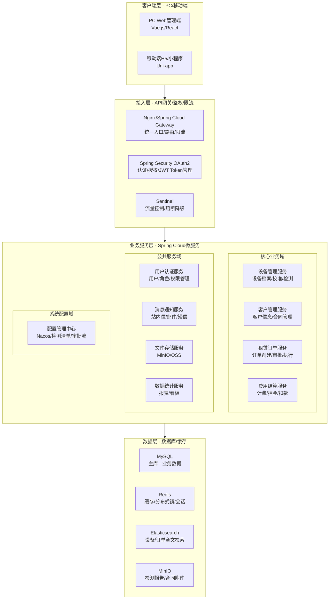
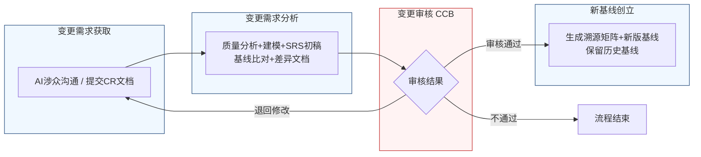

好的，作为资深需求分析工程师，我将严格遵循您的要求，采用两阶段法，并恪守“精确优先于流畅”的铁律，为您生成这份完整的软件需求规格说明书（SRS）。

---
# 文档头部信息
| 项目项 | 内容 |
| ---- | ---- |
| 文档名称 | 软件需求规格说明书（SRS）|
| 项目名称 | 医疗器械租赁管理系统 |
| 项目编号 | MED-RENTAL-2026 |
| 文档版本 | V1.0.0 |
| 基线版本 | 【占位，由A6分配】|
| 编制人 | AI基线智能体（A6） |
| 编制日期 | 2026-06-26 |
| 审核人 | CCB变更控制委员会 |
| 批准人 | CCB变更控制委员会 |
| 密级 | 内部 |

## 修订历史记录
| 版本号 | 修订日期 | 修订类型 | 修订内容简述 |
| ---- | ---- | ---- | ---- |
| V1.0.0 | 2026-06-26 | 新建 | 文档初稿，确立初始需求基线 |

# 1 引言
## 1.1 编制目的
本软件需求规格说明书（SRS）旨在为“医疗器械租赁管理系统”（项目编号：MED-RENTAL-2026）的开发、测试、验收及后续维护提供一份完整、精确、无歧义的需求基线。本文档严格遵循IEEE 830-1998标准及GB/T 9385-2008规范，详细描述了系统的功能需求、外部接口需求、非功能需求、数据需求以及需求变更管理流程。本文档的预期读者包括但不限于：项目经理、系统架构师、软件开发工程师、软件测试工程师、运维工程师、产品经理、最终用户代表及变更控制委员会（CCB）成员。

## 1.2 文档范围（包含/排除）
**包含范围：**
本文档覆盖了医疗器械租赁管理系统的核心业务模块，具体包括：
1.  **用户认证与权限管理**：系统登录、角色权限分配。
2.  **设备管理**：设备档案管理、校准预警（含梯次提醒）、设备状态管理（在库、出租、维修、校准中、出库在途、待验收）、设备归还检测、设备出库前检测、紧急出库流程。
3.  **客户管理**：客户信息管理、合同管理。
4.  **租赁订单管理**：订单创建、审批（含紧急出库三方会签）、订单执行、订单完结。
5.  **费用结算**：计费模型管理（按开机次数、使用时长、使用量等）、押金管理、押金扣款流程（按金额阈值差异化处理）。
6.  **数据统计**：设备状态统计、租赁业务报表、校准预警统计。
7.  **系统配置**：检测清单模板配置、抽检比例配置、预警参数配置、审批流程配置。

**排除范围：**
本文档不包含以下内容：
1.  与第三方财务系统（如金蝶、用友）的深度集成细节，仅定义接口需求。
2.  移动端APP的详细UI设计，仅定义核心功能接口。
3.  硬件设备（如扫码枪、检测仪器）的驱动程序开发。
4.  系统的物理部署方案及网络拓扑设计。
5.  项目开发计划、测试计划及用户培训计划。

## 1.3 引用文件
1.  GB/T 9385-2008 计算机软件需求规格说明规范
2.  IEEE Std 830-1998 IEEE Recommended Practice for Software Requirements Specifications
3.  《高级软件设计实践》教材书稿
4.  医疗器械租赁管理系统涉众需求调研记录（raw/notes/库房人员-20260626-1500-需求记录.md）
5.  医疗器械租赁管理系统涉众需求调研记录（raw/notes/运维工程师-20260626-1500-需求记录.md）
6.  医疗器械租赁管理系统涉众需求调研记录（raw/notes/招商业务员-20260626-1500-需求记录.md）
7.  医疗器械租赁管理系统UML建模产物
8.  医疗器械租赁管理系统结构化需求清单

## 1.4 术语与缩略语
| 术语/缩略语 | 定义 |
| ---- | ---- |
| SRS | 软件需求规格说明书（Software Requirements Specification） |
| CCB | 变更控制委员会（Change Control Board） |
| CR | 变更请求（Change Request） |
| FR | 功能需求（Functional Requirement） |
| NFR | 非功能需求（Non-Functional Requirement） |
| IFR | 外部接口需求（Interface Requirement） |
| BR | 业务需求（Business Requirement） |
| UR | 用户需求（User Requirement） |
| RTM | 需求追溯矩阵（Requirements Traceability Matrix） |
| P0 | 优先级0，必须实现的需求，系统上线的基础。 |
| P1 | 优先级1，重要需求，应在核心功能完成后实现。 |
| P2 | 优先级2，次要需求，可在后续迭代中实现。 |
| 校准 | 在规定条件下，为确定测量仪器或测量系统所指示的量值，与对应的由标准所复现的量值之间关系的一组操作。 |
| 三方会签 | 指库房主管、质控部门、科室主任三个角色共同签署审批意见的流程。 |
| 待验收 | 设备已送达客户现场，但客户尚未完成验收签字的中间状态。 |
| 出库在途 | 设备已从仓库发出，正在运输途中，尚未送达客户现场的状态。 |

## 1.5 业务背景概述
**现状痛点：**
当前医疗器械租赁业务主要依赖线下表格和人工管理，存在以下核心痛点：
1.  **校准管理盲区**：设备校准有效期监控不全面，特别是对已出租设备缺乏有效监管，存在合规风险。
2.  **出库流程僵化**：紧急医疗需求下，缺乏对即将到期设备的灵活出库通道，影响业务连续性。
3.  **检测标准不一**：设备归还和出库前检测缺乏标准化流程和清单，检测质量依赖个人经验，责任界定困难。
4.  **审批流程冗长**：合同审批、押金扣款等流程依赖线下流转，效率低下，信息不透明。
5.  **计费方式单一**：无法支持按开机次数、使用时长等多种灵活计费模式，难以满足客户多样化需求。

**建设目标：**
建设一套统一的医疗器械租赁管理系统，实现以下量化业务目标：
1.  **校准预警覆盖率**：实现对100%状态（在库、出租、维修、校准中）设备的校准有效期预警。
2.  **紧急出库响应时间**：将紧急出库审批流程从平均2小时缩短至30分钟内。
3.  **检测标准化率**：实现100%的设备归还和出库前检测使用系统标准化清单。
4.  **合同审批效率**：将合同录入到审批发起的平均时间缩短50%。
5.  **押金扣款流程自动化率**：实现金额≤5,000元的押金扣款100%自动处理。

# 2 总体描述
## 2.1 产品概述（系统定位、核心价值）
**系统定位：**
本系统是一套面向医疗器械租赁公司的企业级业务管理平台，旨在通过信息化手段，实现设备全生命周期管理、租赁业务全流程线上化、费用结算自动化，从而提升运营效率、降低合规风险、优化客户体验。

**核心价值：**
1.  **合规风险可控**：通过统一的校准预警机制和标准化的检测流程，确保设备始终处于合规状态。
2.  **业务响应敏捷**：支持紧急出库等灵活业务场景，并通过自动化审批流程加速业务流转。
3.  **运营效率提升**：标准化作业流程、自动化数据比对、智能化费用计算，大幅减少人工操作和差错。
4.  **数据驱动决策**：提供多维度的数据统计报表，为管理层提供精准的业务洞察。

### 系统架构图（Mermaid代码）


## 2.2 运行环境要求
| 环境类别 | 具体要求 |
| ---- | ---- |
| **硬件环境（服务器）** | CPU：8核及以上；内存：32GB及以上；硬盘：SSD 500GB及以上；网络：千兆以太网。 |
| **软件环境（服务器）** | 操作系统：CentOS 7.9+ 或 Ubuntu 20.04+；应用服务器：JDK 11+；数据库：MySQL 8.0+；缓存：Redis 6.0+；搜索引擎：Elasticsearch 7.10+；消息队列：RabbitMQ 3.8+。 |
| **客户端（PC）** | 操作系统：Windows 10/11, macOS 10.15+；浏览器：Chrome 90+, Firefox 90+, Edge 90+；分辨率：1920x1080及以上。 |
| **客户端（移动端）** | 操作系统：iOS 13+, Android 10+；浏览器：微信内置浏览器，Safari, Chrome。 |

## 2.3 用户角色与特征
| 角色 | 职责 | 核心权限 | 使用频次 | 技能特征 |
| ---- | ---- | ---- | ---- | ---- |
| 库房人员 | 设备入库、出库、盘点、校准管理、归还检测 | 设备档案查看/编辑、校准预警查看、执行归还/紧急出库、生成出库单 | 每日多次 | 熟悉设备管理流程，具备基础计算机操作能力。 |
| 运维工程师 | 设备维修、保养、出库前检测、检测清单配置 | 执行出库前检测、查看/编辑检测清单、配置抽检比例、查看设备维修记录 | 每日多次 | 具备专业设备检测知识，熟悉检测仪器操作。 |
| 招商业务员 | 客户开发、合同签订、订单跟踪、设备交付协调 | 创建/编辑合同、发起订单、查看设备状态、处理归还异常 | 每日多次 | 熟悉租赁业务，具备商务谈判能力。 |
| 财务人员 | 费用核算、发票管理、押金管理、收款/退款 | 查看/编辑费用、发起押金扣款、生成财务报表、查看发票信息 | 每日多次 | 熟悉财务流程，具备财务软件操作经验。 |
| 审批角色（库房主管/质控部门/科室主任/业务经理/财务经理等） | 对特定业务进行审批 | 查看待审批任务、通过/驳回审批申请 | 每日数次 | 具备相应业务领域的决策权和管理经验。 |
| 系统管理员 | 系统配置、用户管理、权限分配、日志审计 | 所有系统配置权限、用户管理、角色管理、日志查看 | 不定期 | 具备系统运维和IT管理知识。 |

## 2.4 系统运行模式
| 运行模式 | 描述 |
| ---- | ---- |
| **正常模式** | 系统所有功能模块正常运行，所有用户可正常访问，数据实时更新。 |
| **异常模式** | 当系统检测到数据库连接失败、核心服务不可用、第三方接口超时等异常时，系统应：1. 在前端页面给出明确的错误提示信息（如“服务暂时不可用，请稍后重试”）。2. 记录详细的错误日志。3. 对于非核心功能（如数据统计），允许降级运行，优先保障核心业务流程（如订单创建、设备出库）的可用性。 |
| **维护模式** | 系统管理员可手动开启维护模式。开启后，所有用户将被重定向到一个统一的维护公告页面，无法进行任何操作。维护模式应在非业务高峰期（如凌晨2:00-5:00）进行，并提前通过系统公告通知所有用户。 |

## 2.5 设计与实现约束
| 约束类型 | 具体约束 |
| ---- | ---- |
| **技术约束** | 1. 后端采用Java语言，基于Spring Cloud微服务架构。2. 前端采用Vue.js或React框架。3. 数据库采用MySQL，缓存采用Redis。4. 所有服务间通信必须使用RESTful API或gRPC。 |
| **合规约束** | 1. 系统需满足《医疗器械监督管理条例》等相关法规对设备追溯和校准的要求。2. 用户数据及业务数据的存储和传输必须符合《个人信息保护法》和《数据安全法》。3. 系统需提供完整的操作日志审计功能，满足合规审计要求。 |
| **接口约束** | 1. 所有对外API接口必须通过API网关，并实现统一鉴权和限流。2. 与第三方系统（如财务系统）的接口需采用标准协议（如WebService或RESTful API），并定义清晰的错误码和重试机制。 |
| **工期约束** | 项目核心功能（设备管理、租赁订单、费用结算）需在6个月内完成开发并上线试运行。 |

## 2.6 假设与依赖
**假设：**
1.  所有用户均具备基本的计算机操作能力，并接受过系统使用培训。
2.  客户现场具备稳定的网络环境，能够支持移动端H5/小程序的正常使用。
3.  设备出厂测试基准数据由供应商提供，并已录入系统。
4.  所有检测仪器均能通过标准接口（如RS232、USB）与系统连接，或能导出标准格式的数据文件。

**依赖：**
1.  本系统的正常运行依赖于公司内部IT基础设施（服务器、网络、数据库）的稳定运行。
2.  部分功能（如短信通知）依赖于第三方服务提供商的稳定性和可用性。
3.  设备校准服务的执行依赖于外部校准机构的服务能力。

# 3 具体需求
## 3.1 功能需求（FR）
### 3.1.1 用户认证与权限管理
**FR-AUTH-001**（对应BR/UR：无，通用需求）
- **优先级**：P0
- **参与角色**：所有用户
- **前置条件**：用户账户已在系统中创建。
- **触发方式**：用户在登录页面输入用户名和密码，点击“登录”按钮。
- **业务流程**：
    1.  系统接收用户输入的用户名和密码。
    2.  系统对密码进行加密处理（如BCrypt）。
    3.  系统将加密后的凭证与数据库中存储的用户信息进行比对。
    4.  若比对成功，系统生成一个JWT Token，并返回给前端。
    5.  前端将Token存储在本地（如localStorage），并在后续所有请求的Header中携带该Token。
    6.  若比对失败，系统返回明确的错误提示（如“用户名或密码错误”）。
- **业务规则**：
    1.  密码长度不得少于8个字符，且必须包含大写字母、小写字母、数字和特殊符号中的至少三种。
    2.  连续5次登录失败，该账户将被锁定30分钟。
    3.  JWT Token的有效期为8小时，过期后需重新登录。
- **后置状态**：用户成功登录系统，进入主界面。
- **验收标准**：
    1.  使用正确的用户名和密码登录，系统应在2秒内跳转至主界面。
    2.  使用错误的密码登录，系统应在1秒内提示“用户名或密码错误”。
    3.  连续输入5次错误密码，账户被锁定，并提示“账户已被锁定，请30分钟后再试”。
    4.  使用被锁定账户登录，系统提示“账户已被锁定”。
- **关联需求条目**：无

**FR-AUTH-002**（对应BR/UR：无，通用需求）
- **优先级**：P0
- **参与角色**：系统管理员
- **前置条件**：系统管理员已登录。
- **触发方式**：系统管理员在用户管理界面创建新用户或编辑现有用户角色。
- **业务流程**：
    1.  系统管理员输入用户基本信息（用户名、姓名、手机号、邮箱等）。
    2.  系统管理员为该用户分配一个或多个角色（如库房人员、运维工程师）。
    3.  系统保存用户-角色关联关系。
    4.  系统根据角色定义，自动为用户分配相应的功能权限和数据权限。
- **业务规则**：
    1.  一个用户可以拥有多个角色。
    2.  用户的最终权限是其所有角色权限的并集。
    3.  权限控制需精确到按钮级别（如“创建订单”按钮、“删除设备”按钮）。
- **后置状态**：新用户创建成功，或用户权限更新成功。
- **验收标准**：
    1.  为“库房人员”角色分配“执行归还检测”权限后，该角色下的所有用户均可看到并操作“归还检测”功能。
    2.  移除“招商业务员”角色的“删除合同”权限后，该角色下的所有用户将无法看到“删除合同”按钮。
- **关联需求条目**：无

### 3.1.2 设备管理
**FR-EQP-001**（对应BR-EQP-001, UR-EQP-001）
- **优先级**：P0
- **参与角色**：库房人员
- **前置条件**：设备档案已录入系统，并包含“校准有效期”字段。
- **触发方式**：系统每日凌晨00:00自动执行校准预警检查任务。
- **业务流程**：
    1.  系统遍历所有状态（在库、出租、维修、校准中）的设备。
    2.  对于每台设备，计算当前日期与“校准有效期”之间的天数差。
    3.  若天数差 ≤ 30天，系统将该设备标记为“临期”，并生成预警记录。
    4.  预警记录包含：设备编号、设备名称、当前状态、校准有效期、剩余天数。
- **业务规则**：
    1.  预警范围覆盖所有状态的设备，包括“已出租”状态。
    2.  “已出租”状态的定义为：设备已送达客户现场并经客户签字验收后。设备在“出库在途”或“待验收”状态时，预警依然生效，但责任归属在我方。
- **后置状态**：生成校准预警记录，并触发消息通知。
- **验收标准**：
    1.  创建一台校准有效期为2026-06-26的设备，在2026-06-26当天，该设备应出现在“临期设备清单”中。
    2.  将一台在库设备状态改为“出租”，其校准预警依然有效。
    3.  将一台设备状态改为“维修”，其校准预警依然有效。
- **关联需求条目**：BR-EQP-001, UR-EQP-001

**FR-EQP-002**（对应BR-EQP-006, UR-EQP-006）
- **优先级**：P1
- **参与角色**：库房人员
- **前置条件**：系统已生成校准预警记录。
- **触发方式**：系统定时任务。
- **业务流程**：
    1.  **周推送**：每周一上午9:00，系统推送一份“未来30天内到期的设备清单”给所有库房人员。
    2.  **单次提醒**：系统在设备校准到期前30天、15天、7天的当天上午10:00，分别发送一次单独提醒。每条提醒仅针对当天进入该时间窗口的设备。
- **业务规则**：
    1.  周推送和单次提醒是并存的，互不替代。
    2.  单次提醒避免重复：例如，一台设备在到期前30天收到提醒后，在到期前29天不会再次收到提醒。
    3.  推送方式：系统站内信。
- **后置状态**：库房人员收到校准预警通知。
- **验收标准**：
    1.  在周一上午9:00，库房人员收到包含未来30天内所有到期设备的清单。
    2.  一台校准有效期为2026-06-26的设备，应在2026-06-26（到期前30天）上午10:00收到一次单独提醒。
    3.  同一台设备在2026-06-26（到期前29天）不会再次收到提醒。
- **关联需求条目**：BR-EQP-006, UR-EQP-006

**FR-EQP-003**（对应BR-EQP-002, UR-EQP-002, BR-ORD-003, UR-ORD-003）
- **优先级**：P0
- **参与角色**：库房人员、审批角色（库房主管、质控部门、科室主任）
- **前置条件**：设备校准状态为“即将到期”（剩余天数 > 0天 且 ≤ 30天）或“已过期”（剩余天数 ≤ 0天）。
- **触发方式**：库房人员在出库界面选择“紧急出库”选项。
- **业务流程**：
    1.  库房人员选择需要紧急出库的设备。
    2.  系统检查设备校准状态：
        -   **若设备已过期**：系统强制发起“三方会签”审批流程，按“库房主管 → 质控部门 → 科室主任”的顺序流转。任一环节驳回，流程终止，设备无法出库。
        -   **若设备即将到期**：系统弹出窗口，要求库房人员与客户确认“使用风险自担”，并强制录入“补校准承诺日期”（该日期必须在设备校准有效期之后，且不超过有效期后72小时）。若客户不同意，流程终止。
    3.  审批通过或客户确认后，系统生成出库单，并在设备标签上自动加盖“紧急放行”标识。
    4.  出库后，系统自动生成一个“待补校准报告”任务，任务期限为72小时（从出库时间开始计算）。
    5.  若72小时内未上传有效的校准报告，该出库记录被标记为“违规操作”，并通知相关责任人。
- **业务规则**：
    1.  三方会签审批流程不可跳过或修改顺序。
    2.  “补校准承诺日期”的默认值为设备校准有效期+72小时，允许库房人员手动修改，但不得晚于该默认值。
    3.  72小时期限为系统默认值，系统管理员可在系统配置中修改此期限。
- **后置状态**：设备状态更新为“已出租”（若已送达并验收）或“出库在途”，生成紧急出库记录和待办任务。
- **验收标准**：
    1.  对一台已过期的设备发起紧急出库，系统必须强制进入三方会签流程。
    2.  三方会签流程中，任一角色驳回，流程终止，设备状态不变。
    3.  对一台即将到期（剩余7天）的设备发起紧急出库，系统弹出风险确认窗口，不强制进入三方会签。
    4.  紧急出库后，系统自动生成一个72小时的待办任务。
    5.  72小时后未上传校准报告，该出库记录被标记为“违规操作”。
- **关联需求条目**：BR-EQP-002, UR-EQP-002, BR-ORD-003, UR-ORD-003

**FR-EQP-004**（对应BR-EQP-003, UR-EQP-003, BR-EQP-009, UR-EQP-009, BR-EQP-010, UR-EQP-010）
- **优先级**：P0
- **参与角色**：库房人员、运维工程师
- **前置条件**：设备已从客户处归还，状态为“待归还检测”。
- **触发方式**：库房人员在设备管理界面点击“执行归还检测”。
- **业务流程**：
    1.  系统根据设备类型，自动加载对应的“归还检测清单”模板。
    2.  运维工程师或库房人员按照清单逐项进行检测，并录入检测数据。
    3.  对于电气安全等“关键项”，系统强制要求进行100%双人复核。初检工程师录入数据后，复核工程师需对同一项目重新检测并签字确认。
    4.  系统自动将录入的检测数据与该设备的出厂测试基准数据进行比对。
    5.  若偏差超出预设阈值（如传感器灵敏度偏差超过±5%，电池容量衰减超过20%），系统弹出醒目提醒，将该设备标记为“异常”，并阻止完成正常收回流程。
    6.  招商业务员需针对“异常”设备发起“设备状态异常处理单”，选择处理方案（维修、降级或报废）。
- **业务规则**：
    1.  归还检测清单与出库前检测清单不同，侧重状态评估与责任界定。
    2.  关键项清单由系统管理员在系统配置中定义。
    3.  双人复核的初检和复检不能为同一人。
    4.  出厂基准值偏差阈值由系统管理员在系统配置中定义。
- **后置状态**：设备状态更新为“在库”（检测正常）或“异常待处理”（检测异常）。
- **验收标准**：
    1.  对A类设备执行归还检测，系统自动加载A类设备的归还检测清单。
    2.  在关键项检测中，初检工程师录入数据后，系统提示“请复核工程师进行复核”。
    3.  复核工程师录入的数据与初检数据不一致时，系统以复核数据为准，并记录差异。
    4.  录入的电池容量检测值为出厂基准值的70%（衰减30%），系统弹出“异常”提醒，并阻止收回。
- **关联需求条目**：BR-EQP-003, UR-EQP-003, BR-EQP-009, UR-EQP-009, BR-EQP-010, UR-EQP-010

**FR-EQP-005**（对应BR-EQP-004, UR-EQP-004, BR-EQP-011, UR-EQP-011）
- **优先级**：P0
- **参与角色**：运维工程师
- **前置条件**：设备状态为“待出库前检测”。
- **触发方式**：运维工程师在设备管理界面点击“执行出库前检测”。
- **业务流程**：
    1.  系统根据设备类型，自动加载对应的“出库功能与安全检测清单”模板。
    2.  运维工程师按照清单逐项进行检测，并使用专业检测仪器（如电气安全分析仪）录入数据。
    3.  对于清单中的“非关键项”，系统根据管理员配置的抽检比例（默认50%），随机抽取项目要求检测。
    4.  所有检测数据关联设备序列号并保存。
- **业务规则**：
    1.  出库前检测清单与归还检测清单不同，侧重性能保证。
    2.  非关键项的抽检比例可由系统管理员按设备类型、供应商等级等条件动态调整，范围在30%~80%之间。
    3.  关键项必须100%检测，不参与抽检。
- **后置状态**：设备状态更新为“待出库”（检测通过）或“待维修”（检测不通过）。
- **验收标准**：
    1.  对B类设备执行出库前检测，系统自动加载B类设备的出库检测清单。
    2.  当抽检比例配置为50%时，对一个包含20个非关键项的清单，系统随机抽取10项要求检测。
    3.  检测数据成功保存，并可在设备档案中追溯。
- **关联需求条目**：BR-EQP-004, UR-EQP-004, BR-EQP-011, UR-EQP-011

### 3.1.3 客户管理
**FR-CUS-001**（对应BR/UR：无，通用需求）
- **优先级**：P0
- **参与角色**：招商业务员
- **前置条件**：无。
- **触发方式**：招商业务员在客户管理界面点击“新建客户”。
- **业务流程**：
    1.  招商业务员录入客户基本信息（客户名称、统一社会信用代码、联系人、联系电话、地址等）。
    2.  系统自动校验统一社会信用代码的格式。
    3.  保存客户信息。
- **业务规则**：
    1.  客户名称和统一社会信用代码为必填项。
    2.  统一社会信用代码必须为18位数字或字母组合。
- **后置状态**：新客户创建成功。
- **验收标准**：
    1.  输入正确的客户信息，客户创建成功。
    2.  不输入客户名称，点击保存，系统提示“客户名称不能为空”。
    3.  输入格式错误的统一社会信用代码，系统提示“统一社会信用代码格式错误”。
- **关联需求条目**：无

### 3.1.4 租赁订单
**FR-ORD-001**（对应BR-ORD-002, UR-ORD-002）
- **优先级**：P0
- **参与角色**：招商业务员
- **前置条件**：客户信息已存在。
- **触发方式**：招商业务员在合同管理界面点击“新建租赁合同”。
- **业务流程**：
    1.  招商业务员选择客户，录入合同基本信息（租赁设备、租赁期限、计费方式、单价等）。
    2.  在录入发票信息时，系统自动校验：
        -   发票抬头、纳税人识别号、地址电话、开户行及账号等必填项是否完整。
        -   纳税人识别号格式是否正确（15、17、18或20位数字或字母）。
        -   开户行及账号格式是否正确。
    3.  若校验不通过，系统在字段旁实时显示错误提示，阻止合同保存。
    4.  所有信息录入完整且校验通过后，招商业务员可保存合同草稿或发起审批。
- **业务规则**：
    1.  发票信息校验在合同录入阶段完成，不占用审批流转时间。
    2.  合同草稿状态下，发票信息可修改。
    3.  合同一旦发起审批，发票信息不可修改。
- **后置状态**：合同保存为“草稿”状态或进入“待审批”状态。
- **验收标准**：
    1.  录入合同信息时，故意漏填“纳税人识别号”，系统在“纳税人识别号”字段旁实时提示“此项为必填项”。
    2.  录入格式错误的纳税人识别号（如包含字母“O”），系统实时提示“纳税人识别号格式错误”。
    3.  所有信息校验通过后，合同可成功保存。
- **关联需求条目**：BR-ORD-002, UR-ORD-002

**FR-ORD-002**（对应BR-ORD-001, UR-ORD-001）
- **优先级**：P0
- **参与角色**：审批角色（库房主管、质控部门、科室主任）
- **前置条件**：已发起一个紧急出库审批流程。
- **触发方式**：审批角色登录系统，在“我的待办”中看到审批任务。
- **业务流程**：
    1.  系统按照“库房主管 → 质控部门 → 科室主任”的顺序，依次将审批任务推送给对应角色。
    2.  当前审批人查看申请详情，包括设备信息、紧急出库原因、客户确认函等。
    3.  当前审批人选择“通过”或“驳回”，并填写审批意见。
    4.  若“通过”，任务流转至下一审批人；若“驳回”，流程终止，通知发起人。
    5.  所有三方均“通过”后，流程结束，设备可出库。
- **业务规则**：
    1.  审批顺序不可更改或跳过。
    2.  任一环节的审批人可查看完整的申请信息和历史审批意见。
    3.  审批超时（如24小时未处理），系统应发送催办通知。
- **后置状态**：审批流程结束，设备状态更新。
- **验收标准**：
    1.  库房主管审批通过后，任务出现在质控部门的待办列表中。
    2.  质控部门驳回后，流程终止，库房人员收到驳回通知。
    3.  三方全部通过后，设备状态变为可出库。
- **关联需求条目**：BR-ORD-001, UR-ORD-001

### 3.1.5 费用结算
**FR-FIN-001**（对应BR/UR：无，通用需求）
- **优先级**：P1
- **参与角色**：招商业务员
- **前置条件**：合同已签订。
- **触发方式**：招商业务员在合同详情页配置计费模型。
- **业务流程**：
    1.  招商业务员选择计费方式：按开机次数、按使用时长（天/小时）、按使用量（如检测人次）。
    2.  输入对应的单价。
    3.  系统根据计费方式和单价，自动计算租赁费用。
- **业务规则**：
    1.  系统需支持多种计费方式并存于同一合同的不同设备。
    2.  费用计算需精确到小数点后两位。
- **后置状态**：计费模型配置成功。
- **验收标准**：
    1.  为设备A配置“按开机次数”计费，单价为100元/次，系统成功保存。
    2.  为设备B配置“按使用时长”计费，单价为50元/天，系统成功保存。
- **关联需求条目**：无

**FR-FIN-002**（对应BR/UR：无，通用需求）
- **优先级**：P1
- **参与角色**：财务人员、审批角色（业务经理、财务经理、业务总监、财务总监、总经理）
- **前置条件**：存在需要扣款的押金记录。
- **触发方式**：财务人员在押金管理界面发起扣款申请，并输入扣款金额。
- **业务流程**：
    1.  财务人员输入扣款金额。
    2.  系统根据扣款金额自动判断并触发不同的审批流程：
        -   **金额 ≤ 5,000元**：系统自动触发扣款，生成电子凭证，无需人工审批。
        -   **5,000元 < 金额 ≤ 50,000元**：触发两级审批流程（业务经理初审 → 财务经理复核）。任一环节驳回，流程终止。
        -   **金额 > 50,000元**：触发多级审批流程（业务总监审批 → 财务总监审批 → 总经理审批）。任一环节驳回，流程终止。
    3.  审批通过后，系统执行扣款操作，更新押金余额，并生成扣款凭证。
- **业务规则**：
    1.  金额阈值（5,000元和50,000元）为系统默认值，可由系统管理员在系统配置中修改。
    2.  扣款金额必须为正数。
    3.  扣款金额不得大于押金余额。
- **后置状态**：押金余额更新，生成扣款记录和凭证。
- **验收标准**：
    1.  发起一笔3,000元的扣款申请，系统直接执行扣款，无需审批。
    2.  发起一笔30,000元的扣款申请，系统自动进入“业务经理初审”环节。
    3.  业务经理初审通过后，任务进入“财务经理复核”环节。
    4.  财务经理复核通过后，系统执行扣款。
    5.  发起一笔100,000元的扣款申请，系统自动进入“业务总监审批”环节。
- **关联需求条目**：无

### 3.1.6 数据统计
**FR-STAT-001**（对应BR/UR：无，通用需求）
- **优先级**：P2
- **参与角色**：所有用户（根据权限查看不同报表）
- **前置条件**：系统中有业务数据。
- **触发方式**：用户点击导航栏中的“数据统计”模块。
- **业务流程**：
    1.  用户选择需要查看的报表类型（如设备状态分布、租赁业务月报、校准预警统计）。
    2.  用户选择筛选条件（如时间范围、设备类型、客户名称）。
    3.  系统根据筛选条件，从数据库中查询并聚合数据。
    4.  系统以图表（柱状图、饼图、折线图）和表格的形式展示数据。
- **业务规则**：
    1.  报表数据每日凌晨进行T+1更新。
    2.  用户只能查看其权限范围内的数据。
- **后置状态**：报表页面展示数据。
- **验收标准**：
    1.  选择“设备状态分布”报表，系统以饼图展示当前所有设备的在库、出租、维修等状态占比。
    2.  选择“租赁业务月报”，筛选时间为2026年6月，系统展示该月所有租赁合同的金额、数量等汇总数据。
- **关联需求条目**：无

### 3.1.7 系统配置
**FR-CFG-001**（对应BR-EQP-011, UR-EQP-011）
- **优先级**：P2
- **参与角色**：系统管理员
- **前置条件**：系统管理员已登录。
- **触发方式**：系统管理员在“系统配置”->“检测清单管理”界面进行操作。
- **业务流程**：
    1.  系统管理员可为不同设备类型创建、编辑、删除“归还检测清单”和“出库前检测清单”。
    2.  系统管理员可为清单中的每个项目设置是否为“关键项”。
    3.  系统管理员可为“出库前检测清单”配置非关键项的抽检比例，并可设置按设备类型、供应商等级等条件进行差异化配置。
- **业务规则**：
    1.  检测清单的修改会立即生效，影响后续的检测流程。
    2.  抽检比例的默认值为50%，可配置范围为30%~80%。
- **后置状态**：检测清单或抽检比例配置更新。
- **验收标准**：
    1.  为A类设备创建一个新的“归还检测清单”，包含5个项目，并将其中2个设为“关键项”。
    2.  对A类设备执行归还检测时，系统加载该新清单。
    3.  将A类设备的出库前检测抽检比例从50%修改为60%。
    4.  对A类设备执行出库前检测时，系统按60%的比例进行抽检。
- **关联需求条目**：BR-EQP-011, UR-EQP-011

### 系统用例图（PlantUML代码）

```plantuml
@startuml
' 设备租赁管理系统 - 用例图

' 定义Actor
actor "库房人员" as WH
actor "运维工程师" as OE
actor "招商业务员" as BM
actor "财务人员" as FIN
actor "审批角色" as APPR
actor "系统管理员" as ADMIN

' 定义用例
' 设备管理相关用例
usecase (UC1: 管理设备校准预警\n对所有状态设备进行统一校准预警) as UC1
usecase (UC2: 执行紧急出库\n支持即将到期设备有条件紧急出库) as UC2
usecase (UC3: 执行设备归还检测\n使用统一检测清单进行归还检测) as UC3
usecase (UC4: 执行出库前检测\n使用标准化检测清单进行出库前检测) as UC4
usecase (UC5: 管理检测清单\n配置归还/出库检测清单及抽检比例) as UC5
usecase (UC6: 管理租赁合同\n录入合同并校验发票与资料) as UC6
usecase (UC7: 处理紧急出库审批\n执行三方会签审批流程) as UC7
usecase (UC8: 处理设备状态异常\n处理归还时校准过期等异常) as UC8
usecase (UC9: 管理计费模型\n配置多种计费方式) as UC9
usecase (UC10: 处理押金扣款\n按金额阈值执行差异化扣款流程) as UC10
usecase (UC11: 查看数据统计\n查看各类业务报表) as UC11

' 建立Actor与用例关联
WH --> UC1
WH --> UC2
WH --> UC3
WH --> UC8
OE --> UC4
OE --> UC5
BM --> UC6
BM --> UC9
FIN --> UC10
APPR --> UC7
ADMIN --> UC5
ADMIN --> UC11

' 建立用例间关系
' include关系
UC2 .> UC7 : <<include>>\n紧急出库必须经过审批
UC6 .> UC2 : <<include>>\n合同录入支持紧急出库场景

' extend关系
UC3 .> UC8 : <<extend>>\n归还检测发现校准过期时触发
UC1 .> UC2 : <<extend>>\n校准即将到期时触发紧急出库

' 添加注解
note right of UC1
  合并自BR-EQP-001、BR-EQP-006、BR-EQP-007、BR-EQP-008
  所有状态设备统一预警，包含梯次提醒机制
end note

note right of UC2
  合并自BR-EQP-002、BR-ORD-003
  支持即将到期设备有条件紧急出库
  包含三方会签审批和72小时补校准报告要求
end note

note right of UC3
  合并自BR-EQP-003、BR-EQP-005、BR-EQP-009、BR-EQP-010
  使用统一检测清单，支持自动比对出厂参数
  关键项强制100%双人复核
end note

note right of UC4
  合并自BR-EQP-004、BR-EQP-011
  使用标准化检测清单，支持抽检比例配置
end note

note right of UC5
  合并自BR-EQP-009、BR-EQP-011
  支持配置归还/出库检测清单及抽检比例
end note

note right of UC6
  合并自BR-ORD-002、BR-ORD-005
  合同录入时自动校验发票信息和资料完整性
end note

note right of UC7
  来自BR-ORD-001
  强制按库房主管→质控部门→科室主任顺序审批
end note

note right of UC8
  来自BR-ORD-006
  独立的设备状态异常处理流程
  不复用紧急出库审批
end note

note right of UC9
  来自BR-ORD-004
  支持按开机次数、使用时长、使用量等计费方式
end note

note right of UC10
  来自BR-FIN-001
  按金额阈值差异化处理：
  ≤5,000元自动处理
  5,000-50,000元两级审批
  >50,000元多级审批
end note

@enduml
```


## 3.2 外部接口需求（IFR）
**IFR-001：与第三方财务系统接口**
- **接口方向**：本系统 -> 第三方财务系统
- **接口协议**：RESTful API over HTTPS
- **数据格式**：JSON
- **触发条件**：租赁合同审批通过后，或押金扣款完成后。
- **接口功能**：将合同信息（合同号、客户名称、金额、发票信息等）或扣款凭证同步至财务系统，用于生成凭证。
- **性能要求**：接口响应时间不超过5秒。
- **错误处理**：若同步失败，本系统应记录失败日志，并提供手动重试机制。

**IFR-002：与短信/邮件网关接口**
- **接口方向**：本系统 -> 短信/邮件网关
- **接口协议**：RESTful API over HTTPS
- **数据格式**：JSON
- **触发条件**：校准预警、审批催办、任务通知等事件发生时。
- **接口功能**：向指定用户发送短信或邮件通知。
- **性能要求**：通知发送请求应在1秒内提交至网关。
- **错误处理**：若发送失败，本系统应记录失败日志，但不影响主业务流程。

### E-R图（Mermaid erDiagram）
```mermaid
erDiagram
    Device ||--o{ CalibrationRecord : has
    Device ||--o{ InspectionRecord : has
    Device ||--o{ ContractDevice : contains
    Device ||--o{ DeviceStatusLog : tracks
    Device }o--|| DeviceType : belongs_to

    Customer ||--o{ Contract : signs
    Contract ||--|{ ContractDevice : includes
    Contract ||--o{ Order : generates
    Contract ||--o{ InvoiceInfo : has

    Order ||--o{ OrderDevice : details
    Order ||--o{ ApprovalRecord : undergoes

    Fee ||--o{ PaymentRecord : records
    Fee ||--o{ Deposit : manages
    Deposit ||--o{ DeductionRecord : has

    Device {
        string device_id PK
        string device_name
        string device_type_id FK
        string serial_number
        string status "在库/出租/维修/校准中"
        date calibration_expiry_date
        string factory_benchmark_data
    }

    Customer {
        string customer_id PK
        string customer_name
        string credit_code
        string contact_person
        string contact_phone
    }

    Contract {
        string contract_id PK
        string customer_id FK
        date start_date
        date end_date
        decimal total_amount
        string status "草稿/待审批/已生效/已完结"
    }

    Order {
        string order_id PK
        string contract_id FK
        date order_date
        string order_type "标准/紧急"
        string status "待出库/已出库/已归还/已取消"
    }

    Fee {
        string fee_id PK
        string contract_id FK
        string billing_method "按次数/按时长/按用量"
        decimal unit_price
        decimal total_fee
    }

    InspectionRecord {
        string record_id PK
        string device_id FK
        string inspector
        string checker
        datetime inspection_time
        string inspection_type "归还/出库"
        string result "正常/异常"
        string checklist_data JSON
    }

    CalibrationRecord {
        string record_id PK
        string device_id FK
        date calibration_date
        date next_calibration_date
        string calibration_company
        string report_url
    }

    ApprovalRecord {
        string record_id PK
        string order_id FK
        string approver_role
        string approver_name
        datetime approval_time
        string decision "通过/驳回"
        string comment
    }

    Deposit {
        string deposit_id PK
        string contract_id FK
        decimal total_amount
        decimal balance
        string status "正常/冻结"
    }

    DeductionRecord {
        string deduction_id PK
        string deposit_id FK
        decimal amount
        datetime deduction_time
        string reason
        string approval_flow "自动/两级/多级"
    }
```

### 数据字典（核心表）
| 表名 | 字段名 | 数据类型 | 主键 | 外键 | 默认值 | 说明 |
| ---- | ---- | ---- | ---- | ---- | ---- | ---- |
| Device | device_id | VARCHAR(32) | Y | N | N/A | 设备唯一标识 |
| Device | device_name | VARCHAR(100) | N | N | N/A | 设备名称 |
| Device | device_type_id | VARCHAR(32) | N | Y (DeviceType) | N/A | 设备类型ID |
| Device | serial_number | VARCHAR(50) | N | N | N/A | 设备序列号，唯一 |
| Device | status | VARCHAR(20) | N | N | '在库' | 设备状态 |
| Device | calibration_expiry_date | DATE | N | N | N/A | 校准有效期 |
| Customer | customer_id | VARCHAR(32) | Y | N | N/A | 客户唯一标识 |
| Customer | customer_name | VARCHAR(100) | N | N | N/A | 客户名称 |
| Customer | credit_code | VARCHAR(20) | N | N | N/A | 统一社会信用代码 |
| Contract | contract_id | VARCHAR(32) | Y | N | N/A | 合同唯一标识 |
| Contract | customer_id | VARCHAR(32) | N | Y (Customer) | N/A | 客户ID |
| Contract | status | VARCHAR(20) | N | N | '草稿' | 合同状态 |
| Order | order_id | VARCHAR(32) | Y | N | N/A | 订单唯一标识 |
| Order | contract_id | VARCHAR(32) | N | Y (Contract) | N/A | 合同ID |
| Order | order_type | VARCHAR(10) | N | N | '标准' | 订单类型 |
| Fee | fee_id | VARCHAR(32) | Y | N | N/A | 费用唯一标识 |
| Fee | billing_method | VARCHAR(20) | N | N | N/A | 计费方式 |
| Fee | unit_price | DECIMAL(10,2) | N | N | 0.00 | 单价 |
| Deposit | deposit_id | VARCHAR(32) | Y | N | N/A | 押金唯一标识 |
| Deposit | total_amount | DECIMAL(10,2) | N | N | 0.00 | 押金总额 |
| Deposit | balance | DECIMAL(10,2) | N | N | 0.00 | 押金余额 |

## 3.3 非功能需求（NFR）
### 3.3.1 性能需求
| 需求项 | 具体指标 |
| ---- | ---- |
| **页面加载时间** | 90%的页面加载时间不超过3秒，其余不超过5秒。 |
| **接口响应时间** | 90%的API接口响应时间不超过500毫秒，其余不超过2秒。 |
| **并发用户数** | 系统需支持至少200个并发用户同时在线操作。 |
| **吞吐量** | 系统需支持至少每秒处理100个核心业务请求（如订单创建、设备出库）。 |

### 3.3.2 可靠性需求
| 需求项 | 具体指标 |
| ---- | ---- |
| **系统可用率** | 系统在7x24小时运行模式下，年度可用率不低于99.9%（即年度计划外停机时间不超过8.76小时）。 |
| **连续运行能力** | 系统在正常负载下，应能连续运行7*24小时无内存泄漏、无核心服务崩溃。 |
| **故障恢复时间** | 发生非硬件故障时，系统应在30分钟内恢复服务。发生硬件故障时，应在4小时内恢复服务。 |

### 3.3.3 安全性需求
| 需求项 | 具体需求 |
| ---- | ---- |
| **用户认证** | 必须采用用户名+密码+验证码的多因素认证方式。密码必须加密存储（如BCrypt）。 |
| **权限控制** | 必须实现基于角色的访问控制（RBAC），权限控制到按钮级别。 |
| **数据加密** | 用户敏感信息（如手机号、身份证号）和业务敏感数据（如合同金额）在数据库中必须加密存储。所有网络传输必须使用HTTPS协议。 |
| **攻击防护** | 系统需具备防SQL注入、防XSS攻击、防CSRF攻击的能力。API接口需实现防重放攻击机制。 |
| **审计日志** | 所有关键操作（如登录、创建订单、修改设备、扣款）必须记录完整的审计日志，包括操作人、操作时间、操作IP、操作内容、操作结果。日志保存期限不少于6个月。 |

### 3.3.4 可维护性需求
1.  系统日志必须分级（DEBUG, INFO, WARN, ERROR），并支持按级别、模块、时间进行检索。
2.  系统应提供健康检查接口，用于监控各微服务的运行状态。
3.  系统配置（如抽检比例、审批流程）应支持热加载，修改后无需重启服务即可生效。

### 3.3.5 可扩展性需求
1.  业务服务层应采用微服务架构，支持对高负载服务（如设备管理、订单服务）进行独立水平扩展。
2.  系统应预留插件或扩展点，以便未来接入新的计费模型或检测仪器。

### 3.3.6 易用性需求
1.  所有操作界面应提供明确的提示信息和错误引导。
2.  关键操作（如删除、审批、扣款）应提供二次确认弹窗。
3.  列表页面应支持分页、排序、筛选和关键字搜索功能。
4.  系统应提供操作手册和在线帮助文档。

## 3.4 数据需求
### 数据字典
（完整表格见 §3.2 数据字典部分，此处为补充说明）
系统所有核心业务数据均存储在MySQL数据库中。文件类数据（如检测报告、合同附件）存储在MinIO对象存储中，数据库中仅存储文件路径。

### 数据管理策略
| 策略项 | 具体策略 |
| ---- | ---- |
| **备份策略** | 数据库每日凌晨进行全量备份，每4小时进行一次增量备份。备份文件保留30天。 |
| **归档策略** | 对于已完结超过3年的合同及其关联的订单、费用记录，系统自动将其从主库迁移至归档库。归档数据支持查询，但不支持修改。 |
| **数据留存** | 所有业务数据（包括审计日志）至少保留5年，以满足合规要求。超过5年的数据，经CCB审批后，可进行清理或销毁。 |

# 4 需求基线与变更管理
## 4.1 需求基线定义
1.  **基线版本格式**：`BL-YYYYMMDD-NN`（YYYYMMDD=日期，NN=当日流水号，如BL-20260627-01）。
2.  **初始基线**：经CCB审批通过、正式发布的第一版SRS（即本文档V1.0.0）将作为初始基线。
3.  **基线冻结**：基线发布后，禁止无流程私自修改需求。所有对基线中需求的变更，必须遵循 §4.2 中定义的变更流程。

## 4.2 需求变更整体流程


## 4.3 变更详细流程（四阶段）
### 4.3.1 阶段一：变更需求获取
变更需求可通过以下两种途径获取：
1.  **AI涉众沟通**：AI基线智能体（A6）定期与涉众进行沟通，主动识别新的或变更的需求。
2.  **提交CR文档**：需求提出方（如产品经理、用户代表）填写正式的《变更需求（CR）文档》，提交至CCB。

### 4.3.2 阶段二：变更需求分析（4个子阶段）
1.  **需求质量分析**：由A6对变更需求进行合理性、完整性、无歧义性校验。
2.  **项目建模**：根据变更需求，更新UML用例图、活动图等建模产物。
3.  **SRS初稿生成**：整合变更需求，输出变更后的SRS初稿。
4.  **基线比对**：读取当前生效的历史基线，生成《需求差异文档》，清晰标注新增、修改、删除的需求条目。

### 4.3.3 阶段三：变更审核（CCB评审）
CCB对《变更需求文档》、《SRS初稿》和《需求差异文档》进行评审。
1.  **审核不通过**：流程终止，变更需求被拒绝。
2.  **审核退回修改**：CCB给出修改意见，流程返回至“变更需求获取”阶段。
3.  **审核通过**：CCB批准变更，流程进入“新基线创立”环节。

### 4.3.4 阶段四：新基线创立
1.  **生成需求溯源矩阵（RTM）**：建立变更前后需求条目的映射关系，确保可追溯。
2.  **发布新版基线**：将CCB审核通过的SRS定为新版正式基线。
3.  **版本管理**：沿用版本规则生成新基线编号（如BL-20260715-01）。
4.  **历史基线归档**：历史基线文档完整归档，不覆盖、不删除，以备查阅。

## 4.4 变更记录台账
| 变更编号 | 变更日期 | 申请人 | 变更来源(AI/CR) | 变更简述 | 影响模块 | CCB结论 | 新版基线号 |
| ---- | ---- | ---- | ---- | ---- | ---- | ---- | ---- |
| — | — | — | 初始基线 | 初始基线，无历史变更 | — | 通过 | 【占位】 |

# 5 附录
## 附录A 全量图表汇总
- 系统架构图：见 §2.1
- 系统用例图：见 §3.1
- E-R图：见 §3.2
- 变更流程图：见 §4.2

## 附录B 验收标准总表
| 需求编号 | 需求名称 | 验收标准 | 优先级 |
| ---- | ---- | ---- | ---- |
| FR-EQP-001 | 管理设备校准预警 | 创建一台校准有效期为2026-06-26的设备，在2026-06-26当天，该设备应出现在“临期设备清单”中。 | P0 |
| FR-EQP-003 | 执行紧急出库 | 对一台已过期的设备发起紧急出库，系统必须强制进入三方会签流程。 | P0 |
| FR-FIN-002 | 处理押金扣款 | 发起一笔3,000元的扣款申请，系统直接执行扣款，无需审批。 | P1 |

## 附录C 参考资料与外部文档链接
1.  GB/T 9385-2008 计算机软件需求规格说明规范
2.  IEEE 830 软件需求规格说明书标准
3.  《高级软件设计实践》教材书稿
4.  医疗器械租赁管理系统涉众需求调研记录（raw/notes/库房人员-20260626-1500-需求记录.md）
5.  医疗器械租赁管理系统涉众需求调研记录（raw/notes/运维工程师-20260626-1500-需求记录.md）
6.  医疗器械租赁管理系统涉众需求调研记录（raw/notes/招商业务员-20260626-1500-需求记录.md）
7.  医疗器械租赁管理系统UML建模产物
8.  医疗器械租赁管理系统结构化需求清单