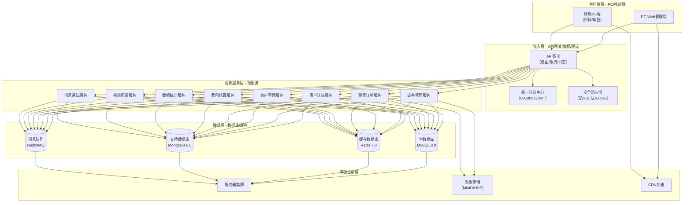
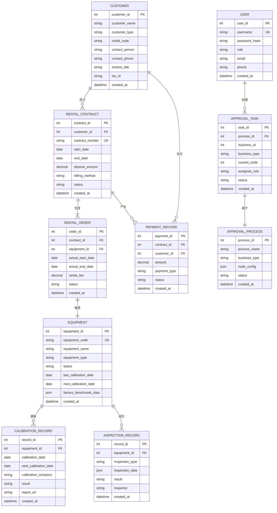
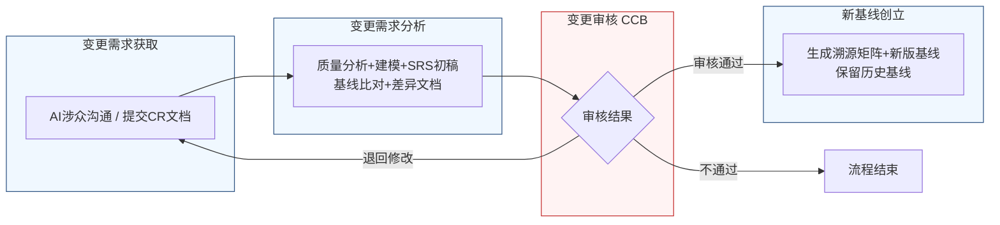

好的，作为一名资深需求分析工程师，我将严格遵循IEEE 830标准和GB/T 9385规范，采用两阶段法为您生成这份完整的软件需求规格说明书（SRS）。我将恪守“精确优先于流畅”的铁律，保留需求清单中的每一个数字、边界条件和约束参数。

---
# 文档头部信息
| 项目项 | 内容 |
| ---- | ---- |
| 文档名称 | 软件需求规格说明书（SRS）|
| 项目名称 | 医疗器械租赁管理系统 |
| 项目编号 | MED-RENTAL-2026 |
| 文档版本 | V1.0.0 |
| 基线版本 | BL-20260626-01 |
| 编制人 | AI基线智能体（A6） |
| 编制日期 | 2026-06-26 |
| 审核人 | CCB变更控制委员会 |
| 批准人 | CCB变更控制委员会 |
| 密级 | 内部 |

## 修订历史记录
| 版本号 | 修订日期 | 修订类型 | 修订内容简述 |
| ---- | ---- | ---- | ---- |
| V1.0.0 | 2026-06-26 | 新建 | 文档初稿，确立初始需求基线 |

# 1 引言
## 1.1 编制目的
本文档旨在明确界定“医疗器械租赁管理系统”项目的软件需求。其核心目的包括：
1.  **建立共识**：在项目干系人（包括库房人员、招商业务员、财务人员、运维工程师、审批管理员及开发团队）之间，就系统“做什么”达成精确、无歧义的共识。
2.  **指导设计与开发**：为后续的系统架构设计、详细设计、编码实现提供唯一、权威的输入依据。
3.  **支撑测试与验收**：为系统测试、用户验收测试提供可量化、可追溯的验收标准，确保最终交付的产品满足所有既定需求。
4.  **管理需求基线**：作为需求基线管理的核心文档，为后续的需求变更控制提供基准。

## 1.2 文档范围（包含/排除）
**包含范围**：
- 系统核心业务功能需求，涵盖设备管理、租赁订单管理、客户管理、费用结算、数据统计及系统配置。
- 系统外部接口需求，包括与第三方系统（如财务系统、短信/邮件服务）的交互。
- 系统非功能需求，包括性能、可靠性、安全性、可维护性、可扩展性和易用性。
- 系统数据需求，包括数据字典和数据管理策略。
- 需求基线与变更管理流程。

**排除范围**：
- 项目计划、预算、资源分配等项目管理内容。
- 具体的系统架构设计、技术选型、数据库物理设计等设计文档。
- 用户操作手册、培训材料等用户支持文档。
- 硬件设备的采购、部署和维护方案。
- 与医疗器械本身相关的物理、电气、生物兼容性等非软件特性。

## 1.3 引用文件
1.  GB/T 9385-2008《计算机软件需求规格说明规范》
2.  IEEE Std 830-1998《IEEE Recommended Practice for Software Requirements Specifications》
3.  《高级软件设计实践》教材书稿
4.  医疗器械租赁管理系统涉众需求调研记录（raw/notes/）
5.  医疗器械租赁管理系统UML建模产物
6.  医疗器械租赁管理系统结构化需求清单

## 1.4 术语与缩略语
| 术语/缩略语 | 定义 |
| ---- | ---- |
| SRS | 软件需求规格说明书（Software Requirements Specification） |
| CCB | 变更控制委员会（Change Control Board） |
| CR | 变更请求（Change Request） |
| FR | 功能需求（Functional Requirement） |
| NFR | 非功能需求（Non-Functional Requirement） |
| IFR | 接口需求（Interface Requirement） |
| RTM | 需求追溯矩阵（Requirements Traceability Matrix） |
| P0 | 优先级0，必须实现的需求，缺失将导致系统无法上线或核心业务无法运转。 |
| P1 | 优先级1，重要需求，缺失将严重影响用户体验或业务效率。 |
| P2 | 优先级2，次要需求，缺失不影响核心功能，但可提升系统价值或便利性。 |
| 校准有效期 | 设备上一次校准合格日期至下一次规定校准日期之间的时间段。 |
| 紧急出库 | 在设备校准过期或存在其他合规风险时，为满足紧急医疗需求，经特殊审批流程允许设备出库的操作。 |
| 非强制性提醒 | 以非阻断方式（如黄色标识、文字提示）向用户展示预警信息，不影响用户执行后续操作。 |

## 1.5 业务背景概述
**现状痛点**：
当前医疗器械租赁业务依赖线下或半信息化方式管理，存在以下核心痛点：
1.  **设备校准管理失控**：设备校准状态依赖人工记忆和纸质台账，无法对所有设备（包括在库、在途、已出租）进行有效监控，存在因校准过期导致合规风险和法律纠纷的隐患。
2.  **紧急出库流程僵化**：面对紧急医疗需求，校准过期设备的出库缺乏受控的审批通道，要么因僵化拒绝导致业务中断，要么因无流程可依而违规操作。
3.  **设备归还检测不规范**：设备归还时，检测标准不统一，缺乏与出厂参数的自动比对，难以快速识别功能隐患，导致问题设备可能再次流入市场。
4.  **租赁计费方式单一**：无法灵活支持按使用时长、使用量、混合计费等多种计费模式，难以满足客户定制化需求，制约市场竞争力。
5.  **合同与财务流程脱节**：合同录入时缺乏发票信息自动校验，导致审批环节返工；押金扣款等财务操作缺乏与业务状态的联动和分级审批。

**建设目标**：
建设一套统一的医疗器械租赁管理系统，实现以下量化业务目标：
1.  **校准预警覆盖率**：系统上线后，对所有设备（在库、在途、已出租、待验收）的校准有效期预警覆盖率达到100%。
2.  **紧急出库流程化**：建立100%线上化、受控的紧急出库审批流程，审批时间不超过30分钟（从发起申请到最终审批完成）。
3.  **归还检测标准化**：设备归还检测100%使用系统标准化模板，自动比对功能覆盖所有关键检测指标。
4.  **合同录入效率提升**：通过发票信息自动校验，将合同录入阶段的错误率降低90%，减少审批环节返工。
5.  **计费方式灵活性**：系统支持至少5种（按开机次数、按使用时长、按使用量、混合计费、按收入分成）计费方式。

# 2 总体描述
## 2.1 产品概述（系统定位、核心价值）
**系统定位**：医疗器械租赁管理系统是一个面向医疗器械租赁公司的核心业务管理平台，旨在通过信息化手段，实现设备全生命周期管理、租赁业务全流程线上化、财务结算自动化，从而提升运营效率、降低合规风险、增强市场竞争力。

**核心价值**：
1.  **合规风控**：通过自动化的校准预警和受控的紧急出库流程，确保设备使用的合规性，降低法律风险。
2.  **运营提效**：通过标准化检测流程、自动数据比对、发票信息校验等功能，减少人工操作，提升工作效率。
3.  **业务灵活**：支持多种计费方式和灵活的审批流程，满足多样化客户需求，提升业务响应速度。
4.  **数据驱动**：通过数据统计与分析，为设备采购、维修、报废决策及市场策略调整提供数据支持。

### 系统架构图（Mermaid代码）


## 2.2 运行环境要求
| 环境类别 | 具体要求 |
| ---- | ---- |
| **硬件环境（服务器）** | CPU：8核及以上；内存：32GB及以上；硬盘：SSD 500GB及以上；网络：千兆以太网。 |
| **软件环境（服务器）** | 操作系统：CentOS 7.9 或 Ubuntu 20.04 LTS；应用服务器：Docker 20.10 + Kubernetes 1.22；数据库：MySQL 8.0 + Redis 7.0 + MongoDB 6.0；消息队列：RabbitMQ 3.9。 |
| **客户端环境（PC）** | 操作系统：Windows 10/11，macOS 12+；浏览器：Chrome 100+，Firefox 100+，Edge 100+；分辨率：1920x1080及以上。 |
| **客户端环境（移动端）** | 操作系统：iOS 14+，Android 10+；浏览器：Safari，Chrome；屏幕尺寸：5.5英寸及以上。 |

## 2.3 用户角色与特征
| 角色 | 职责 | 核心权限 | 使用频次 | 技能特征 |
| ---- | ---- | ---- | ---- | ---- |
| 库房人员 | 设备入库、出库、归还检测、库存盘点、校准预警处理。 | 设备管理模块全部操作权限；归还检测数据录入；查看预警信息。 | 每日多次 | 熟悉设备操作流程，具备基础计算机操作能力。 |
| 招商业务员 | 客户开发、合同签订、订单跟踪、紧急出库申请。 | 客户管理、租赁订单模块全部操作权限；发起紧急出库申请。 | 每日多次 | 熟悉销售流程，具备良好沟通能力，熟练使用办公软件。 |
| 财务人员 | 费用结算、押金管理、发票审核、财务报表分析。 | 费用结算模块全部操作权限；查看财务相关数据统计。 | 每日多次 | 熟悉财务流程，具备财务专业知识，熟练使用财务软件。 |
| 运维工程师 | 设备检测标准配置、系统参数维护、设备维修/报废审批。 | 系统配置模块中检测标准配置权限；设备管理模块中维修/报废审批权限。 | 每周数次 | 具备设备运维专业知识，熟悉系统配置。 |
| 审批管理员 | 审批流程节点配置、审批规则设置、审批任务监控。 | 系统配置模块中审批流程配置权限；查看所有审批任务。 | 每周数次 | 熟悉公司审批制度，具备流程管理经验。 |
| 系统管理员 | 用户管理、角色权限分配、系统日志查看、系统参数配置。 | 系统配置模块全部操作权限。 | 按需 | 具备系统管理经验，熟悉IT运维。 |

## 2.4 系统运行模式
| 运行模式 | 描述 | 触发条件 |
| ---- | ---- | ---- |
| **正常模式** | 系统所有功能正常运行，所有用户可正常访问和操作。 | 系统无故障，所有依赖服务（数据库、缓存、消息队列）均正常运行。 |
| **异常模式** | 系统部分功能受限或不可用，但核心业务（如设备出库、归还）仍可降级运行。 | 数据库主库故障（切换到只读从库）、缓存服务不可用、第三方接口超时。 |
| **维护模式** | 系统暂停对外服务，进行计划内的升级、维护或数据迁移。 | 系统管理员发起维护公告，并设置系统状态为“维护中”。 |

## 2.5 设计与实现约束
1.  **技术约束**：
    - 后端必须采用微服务架构，服务间通过RESTful API或gRPC通信。
    - 前端必须采用前后端分离的单页应用（SPA）架构，使用Vue.js或React框架。
    - 数据库必须支持事务（ACID），核心业务数据（如订单、设备状态）必须使用关系型数据库（MySQL）。
    - 所有API接口必须进行身份认证和权限校验。
2.  **合规约束**：
    - 系统必须符合《医疗器械监督管理条例》等相关法规对设备追溯、校准管理的要求。
    - 用户敏感信息（如姓名、联系方式、身份证号）在存储和传输时必须进行加密。
    - 系统操作日志必须完整记录，保存期限不少于3年。
3.  **接口约束**：
    - 必须提供与公司现有财务系统对接的标准接口。
    - 必须提供与短信/邮件服务商对接的接口，用于发送预警通知。
4.  **工期约束**：
    - 核心功能（设备管理、租赁订单、费用结算）必须在项目启动后6个月内完成开发并上线试运行。

## 2.6 假设与依赖
1.  **假设**：
    - 所有涉众（库房人员、招商业务员等）均具备基本的计算机操作能力。
    - 公司内部网络环境稳定，能够支持系统的正常运行。
    - 所有设备在出厂时均能提供标准化的测试基准数据。
2.  **依赖**：
    - 系统开发依赖于公司IT基础设施（服务器、网络、存储）的到位。
    - 系统与第三方系统（财务系统、短信/邮件服务）的对接依赖于对方提供稳定、文档化的API接口。
    - 设备出厂基准数据的录入依赖于供应商的配合。

# 3 具体需求
## 3.1 功能需求（FR）

### 模块一：用户认证（AUTH）
**FR-AUTH-001**：用户登录
- **优先级**：P0
- **参与角色**：所有用户
- **前置条件**：用户账号已在系统中创建并激活。
- **触发方式**：用户在登录页面输入用户名和密码，点击“登录”按钮。
- **业务流程**：
    1.  系统接收用户输入的用户名和密码。
    2.  系统对密码进行加密处理（如SHA-256）。
    3.  系统将加密后的凭证与数据库中存储的用户信息进行比对。
    4.  若比对成功，系统生成一个JWT（JSON Web Token），并返回给客户端。
    5.  若比对失败，系统返回错误提示“用户名或密码错误”。
- **业务规则**：
    - 密码输入错误连续5次，账号将被锁定30分钟。
    - JWT的有效期为8小时，过期后用户需重新登录。
- **后置状态**：用户成功登录系统，进入主界面。
- **验收标准**：
    1.  输入正确的用户名和密码，能在2秒内成功登录。
    2.  输入错误的用户名或密码，系统在1秒内返回错误提示。
    3.  连续5次输入错误密码，账号被锁定，并提示“账号已被锁定，请30分钟后重试”。
    4.  JWT过期后，访问任何需要认证的接口均返回401状态码。
- **关联需求条目**：无

**FR-AUTH-002**：用户登出
- **优先级**：P0
- **参与角色**：所有已登录用户
- **前置条件**：用户已成功登录系统。
- **触发方式**：用户点击主界面上的“退出”按钮。
- **业务流程**：
    1.  系统清除客户端存储的JWT。
    2.  系统将用户重定向至登录页面。
- **业务规则**：无
- **后置状态**：用户退出系统，返回登录页面。
- **验收标准**：点击“退出”按钮后，用户被立即重定向至登录页面，且无法再访问需要认证的页面。
- **关联需求条目**：无

### 模块二：设备管理（EQP）
**FR-EQP-001**：管理设备校准预警
- **优先级**：P0
- **参与角色**：库房人员
- **前置条件**：设备档案已录入系统，且包含校准有效期字段。
- **触发方式**：系统定时任务（每周一上午9:00，每天上午10:00）自动触发。
- **业务流程**：
    1.  **每周一上午9:00**，系统查询所有未来30天内（含当天）校准到期的设备（包括在库、在途、已出租、待验收状态），生成“临期设备清单”，并通过消息通知服务推送给所有库房人员。
    2.  **每天上午10:00**，系统查询当天进入以下时间窗口的设备（仅针对当天首次进入该窗口的设备，避免重复提醒）：
        - 校准到期前30天
        - 校准到期前15天
        - 校准到期前7天
    3.  对于以上设备，系统根据其状态执行不同的提醒方式：
        - **在库、已出租状态**：系统弹出阻断性弹窗，提示“设备[设备编号]将于[日期]校准到期，请及时处理！”，并阻止用户执行出库、续租等操作。
        - **出库在途、待验收状态**：系统在设备列表页和详情页以黄色高亮或角标显示“校准即将到期”标识，并在相关单据（如入库单、验收单）上附加文字提示，但不弹出阻断性弹窗。
- **业务规则**：
    - 预警时间窗口定义为：到期前30天、15天、7天。
    - 推送时间：每周一上午9:00推送“临期设备清单”；每天上午10:00推送单日提醒。
    - 对于已过期的设备，系统在设备列表页和详情页以红色高亮显示“校准已过期”标识，并禁止所有出库操作（紧急出库除外）。
- **后置状态**：库房人员收到预警通知，并根据提醒采取相应措施（如安排送检、联系客户等）。
- **验收标准**：
    1.  每周一上午9:00，所有库房人员均能收到包含未来30天内到期设备的清单。
    2.  每天上午10:00，仅当天进入30天、15天、7天预警窗口的设备会触发提醒，且同一设备在同一天内不会重复提醒。
    3.  在库、已出租设备到期前7天，系统弹出阻断性弹窗，禁止出库操作。
    4.  在途、待验收设备到期前7天，系统显示黄色标识，但不阻断操作。
- **关联需求条目**：BR-EQP-001, BR-EQP-003, BR-EQP-007, BR-EQP-008

**FR-EQP-002**：执行紧急出库审批
- **优先级**：P0
- **参与角色**：库房人员、审批管理员（库房主管、质控部门、科室主任）
- **前置条件**：设备校准已过期，且存在紧急医疗需求。
- **触发方式**：库房人员在设备出库界面，针对校准过期设备，点击“紧急出库”按钮。
- **业务流程**：
    1.  库房人员发起紧急出库申请，填写紧急事由、使用科室、预计归还时间（不得超过24小时）。
    2.  系统生成紧急出库审批单，并按照固定顺序推送给审批人：
        - **第一步**：推送给**库房主管**审批。
        - **第二步**：库房主管审批通过后，推送给**质控部门**审批。
        - **第三步**：质控部门审批通过后，推送给**科室主任**审批。
    3.  任一环节审批不通过，流程终止，系统通知申请方“紧急出库申请被拒绝”。
    4.  所有环节审批通过后，系统要求招商业务员上传客户签字确认的《风险自担承诺书》。
    5.  文件上传并验证合规后，系统允许设备出库，并启动24小时倒计时，要求在此时间内补交校准合格报告。
- **业务规则**：
    - 审批顺序必须为：库房主管 → 质控部门 → 科室主任，不可跳过或并行。
    - 紧急出库的设备，其校准过期时间不得超过30天。
    - 补交校准报告的期限为设备出库后24小时内，超时未补交，系统将自动生成违规记录并通知相关管理人员。
- **后置状态**：设备状态更新为“已出库-紧急”，并关联紧急出库审批单。
- **验收标准**：
    1.  发起紧急出库申请后，审批单按“库房主管 → 质控部门 → 科室主任”顺序流转。
    2.  任一审批人拒绝，流程终止，申请方收到通知。
    3.  所有审批通过后，必须上传《风险自担承诺书》才能执行出库。
    4.  出库后，系统开始24小时倒计时，超时未补交报告，生成违规记录。
- **关联需求条目**：BR-EQP-002, BR-EQP-004, BR-ORD-003, BR-ORD-004

**FR-EQP-003**：执行设备归还检测
- **优先级**：P0
- **参与角色**：招商业务员、库房人员、财务人员
- **前置条件**：设备已从客户处收回，进入待检测状态。
- **触发方式**：招商业务员在设备归还界面，点击“开始检测”按钮。
- **业务流程**：
    1.  系统加载与入库检测相同的标准化检查清单和模板。
    2.  招商业务员按照清单逐项录入实际检测数值。
    3.  系统自动将录入的检测数值与设备档案中的出厂测试基准数据进行偏差计算。
    4.  **若所有检测项偏差均在预设阈值内**（例如，传感器灵敏度偏差≤±5%，电池容量衰减≤20%），系统允许“完成收回”操作，设备状态更新为“已收回-正常”。
    5.  **若任一关键检测项偏差超出预设阈值**：
        - 系统弹出红色警告提示，并默认禁用“完成收回”按钮。
        - 系统自动生成一条待办事项，推送至财务与运营审核节点。
        - 财务与运营人员审核检测异常报告。
        - **若审核后决定启动特殊审批**：由有相应权限的人员执行特殊审批流程。审批通过后，招商业务员可强制完成收回流程，设备状态更新为“已收回-异常”，并记录审批信息。
        - **若审核后不启动特殊审批**：招商业务员需与客户协商赔偿或维修方案，设备状态更新为“待处理”。
- **业务规则**：
    - 归还检测必须使用与入库检测相同的标准化检查清单。
    - 关键检测项的预设阈值由运维工程师在系统配置中设定（见FR-CFG-001）。
    - 特殊审批流程的审批节点和权限由系统管理员配置。
- **后置状态**：设备状态根据检测结果更新为“已收回-正常”、“已收回-异常”或“待处理”。
- **验收标准**：
    1.  归还检测界面加载的检查清单与入库检测界面完全一致。
    2.  录入检测数据后，系统自动与出厂基准值进行比对。
    3.  偏差在阈值内，可正常完成收回。
    4.  偏差超出阈值，弹出红色警告，禁用“完成收回”按钮，并生成待办事项。
    5.  特殊审批通过后，可强制完成收回，设备状态为“已收回-异常”。
- **关联需求条目**：BR-EQP-005, BR-EQP-006, BR-EQP-009

**FR-EQP-004**：配置检测标准
- **优先级**：P2
- **参与角色**：运维工程师
- **前置条件**：用户已登录并具有“检测标准配置”权限。
- **触发方式**：运维工程师在系统配置模块，点击“检测标准配置”菜单。
- **业务流程**：
    1.  运维工程师可以查看、新增、编辑、删除检测项。
    2.  对于每个检测项，可以配置其名称、数据类型（数值/布尔/文本）、单位、出厂基准值、偏差阈值（如±5%或±20%）、是否为关键项。
    3.  运维工程师可以配置非关键项的抽检比例。默认值为50%，支持按设备类型、供应商等级、季节等因素设置不同比例（范围30%~80%）。
- **业务规则**：
    - 关键项必须100%检测，不可抽检。
    - 抽检比例配置后，系统在生成检测任务时，将按比例随机选取非关键项进行检测。
- **后置状态**：检测标准配置更新，影响后续所有设备的归还检测流程。
- **验收标准**：
    1.  运维工程师可以成功新增、编辑、删除检测项。
    2.  可以为检测项配置偏差阈值，并标记为关键项。
    3.  可以配置非关键项的抽检比例，默认值为50%。
    4.  配置生效后，新的归还检测任务将按新标准执行。
- **关联需求条目**：BR-EQP-010, BR-EQP-011

### 模块三：客户管理（CUS）
**FR-CUS-001**：创建客户档案
- **优先级**：P0
- **参与角色**：招商业务员
- **前置条件**：无
- **触发方式**：招商业务员在客户管理模块，点击“新增客户”按钮。
- **业务流程**：
    1.  招商业务员录入客户基本信息，包括：客户名称、客户类型（医院/经销商/个人）、统一社会信用代码、法定代表人、联系人、联系电话、联系地址、发票信息（发票抬头、纳税人识别号、地址电话、开户行及账号）。
    2.  系统在录入发票信息时，自动校验必填项是否完整、格式是否正确（如纳税人识别号位数、电话格式等）。
    3.  校验通过后，招商业务员提交客户档案。
    4.  系统保存客户信息，并生成唯一的客户编号。
- **业务规则**：
    - 客户名称和统一社会信用代码必须唯一。
    - 发票信息中的纳税人识别号必须为15、18或20位数字或字母组合。
- **后置状态**：客户档案创建成功，状态为“正常”。
- **验收标准**：
    1.  录入完整信息后，可成功创建客户档案。
    2.  录入不完整的发票信息（如缺少纳税人识别号），系统提示“发票信息不完整，请补充”。
    3.  录入格式错误的纳税人识别号，系统提示“纳税人识别号格式错误”。
- **关联需求条目**：BR-ORD-002

### 模块四：租赁订单（ORD）
**FR-ORD-001**：创建租赁合同
- **优先级**：P0
- **参与角色**：招商业务员
- **前置条件**：客户档案已创建，设备档案已创建且校准状态正常。
- **触发方式**：招商业务员在租赁订单模块，点击“新建合同”按钮。
- **业务流程**：
    1.  招商业务员选择客户，系统自动带入客户档案中的发票信息。
    2.  招商业务员选择租赁设备，系统自动校验设备校准状态。若设备校准已过期，系统弹出提示“设备[设备编号]校准已过期，无法用于新合同”，并阻止选择。
    3.  招商业务员选择计费方式，系统支持以下选项：
        - 按开机次数
        - 按使用时长（小时/天/周/月）
        - 按使用量（里程/疗程/检测次数）
        - 混合计费（基础租金 + 超量按次计费）
        - 按收入分成
        - 固定周期 + 浮动阶梯
    4.  招商业务员填写合同起止日期、租金、押金等条款。
    5.  系统再次自动校验发票信息的完整性和格式。
    6.  校验通过后，招商业务员提交合同，进入审批流程。
- **业务规则**：
    - 合同起止日期不能早于当前日期。
    - 合同必须关联至少一个设备。
- **后置状态**：租赁合同创建成功，状态为“待审批”。
- **验收标准**：
    1.  选择客户后，发票信息自动填充。
    2.  选择校准过期的设备时，系统阻止选择并给出提示。
    3.  计费方式下拉菜单包含所有6种选项。
    4.  提交合同时，若发票信息不完整或格式错误，系统阻止提交并给出提示。
- **关联需求条目**：BR-ORD-001, BR-ORD-002

### 模块五：费用结算（FIN）
**FR-FIN-001**：处理押金扣款
- **优先级**：P1
- **参与角色**：财务人员、审批管理员（业务经理、财务经理）
- **前置条件**：租赁合同结束，设备已归还，存在需要扣款的事项（如设备损坏、超期使用）。
- **触发方式**：财务人员在费用结算模块，针对特定合同，点击“发起押金扣款”按钮。
- **业务流程**：
    1.  财务人员录入扣款金额和扣款原因。
    2.  系统根据扣款金额自动判断审批流程：
        - **扣款金额 ≤ 5000元**：自动触发扣款，生成电子凭证，流程结束。
        - **5000元 < 扣款金额 ≤ 50000元**：推送给**业务经理**进行初审。初审通过后，推送给**财务经理**进行复核。复核通过后，执行扣款。
        - **扣款金额 > 50000元**：在业务经理和财务经理审批后，还需推送给**总经理**进行终审。终审通过后，执行扣款。
    3.  任一审批环节不通过，流程终止，通知财务人员。
- **业务规则**：
    - 扣款金额必须大于0。
    - 扣款金额不能超过该合同对应的押金总额。
- **后置状态**：押金扣款成功，生成扣款记录和电子凭证。
- **验收标准**：
    1.  录入扣款金额3000元，系统自动扣款，无需审批。
    2.  录入扣款金额30000元，流程依次经过业务经理、财务经理审批。
    3.  录入扣款金额80000元，流程依次经过业务经理、财务经理、总经理审批。
    4.  任一审批人拒绝，流程终止，财务人员收到通知。
- **关联需求条目**：BR-FIN-001

### 模块六：数据统计（STA）
**FR-STA-001**：查看设备利用率报表
- **优先级**：P1
- **参与角色**：招商业务员、财务人员、系统管理员
- **前置条件**：用户已登录。
- **触发方式**：用户在数据统计模块，选择“设备利用率报表”。
- **业务流程**：
    1.  用户选择统计时间范围（如近30天、近90天、自定义时间段）。
    2.  用户可选择按设备类型、设备编号、客户等维度进行筛选。
    3.  系统以图表（如柱状图、折线图）和表格形式展示设备在选定时间内的出租天数、闲置天数、利用率（出租天数/总天数*100%）。
- **业务规则**：
    - 利用率计算基于设备在选定时间范围内的状态变化记录。
- **后置状态**：报表生成并展示。
- **验收标准**：
    1.  选择不同时间范围，报表数据相应变化。
    2.  按不同维度筛选，报表数据相应变化。
    3.  图表和表格数据与后台计算结果一致。
- **关联需求条目**：无

### 模块七：系统配置（CFG）
**FR-CFG-001**：配置审批流程
- **优先级**：P1
- **参与角色**：审批管理员
- **前置条件**：用户已登录并具有“审批流程配置”权限。
- **触发方式**：审批管理员在系统配置模块，点击“审批流程配置”菜单。
- **业务流程**：
    1.  审批管理员可以查看、新增、编辑、删除审批流程模板。
    2.  对于每个流程模板，可以配置其名称、关联的业务类型（如紧急出库、押金扣款）、审批节点（按顺序）、每个节点的审批角色。
    3.  配置完成后，保存并启用。
- **业务规则**：
    - 一个业务类型只能关联一个启用的审批流程模板。
- **后置状态**：审批流程配置更新，影响后续所有相关业务的审批流转。
- **验收标准**：
    1.  审批管理员可以成功创建名为“紧急出库审批”的流程，并配置“库房主管→质控部门→科室主任”三个节点。
    2.  配置启用后，发起紧急出库申请时，审批单按此流程流转。
- **关联需求条目**：BR-EQP-004, BR-ORD-004

### 系统用例图（PlantUML代码）
```plantuml
@startuml
left to right direction

' ============================================
' 第一步：Actor 定义
' ============================================
actor "库房人员" as WH
actor "招商业务员" as BD
actor "财务人员" as FIN
actor "运维工程师" as OPS
actor "审批管理员" as APPR

note right of WH : 映射自：库房人员\n（设备管理、归还检测）
note right of BD : 映射自：招商业务员\n（租赁订单、紧急出库）
note right of FIN : 映射自：财务人员\n（费用结算、押金扣款）
note right of OPS : 映射自：运维工程师\n（检测标准配置）
note right of APPR : 映射自：质控/科室/库房主管\n（审批节点角色）

' ============================================
' 第二步：用例定义（合并/拆分后）
' ============================================

' --- 设备管理域 ---
usecase (UC1) as "管理设备校准预警\n(含临期/过期/在途提醒)"
note right of UC1 : 合并自BR-EQP-001,003,007,008\n统一预警管理，按设备状态区分提醒方式

usecase (UC2) as "执行紧急出库审批"
note right of UC2 : 合并自BR-EQP-002,004, BR-ORD-003,004,005,007\n统一紧急出库流程，支持标准/应急模式

usecase (UC3) as "执行设备归还检测"
note right of UC3 : 合并自BR-EQP-005,006,009\n含自动比对、标准模板、异常阻断

usecase (UC4) as "配置检测标准"
note right of UC4 : 拆分自BR-EQP-010,011\n运维专属配置功能

' --- 租赁订单域 ---
usecase (UC5) as "创建租赁合同"
note right of UC5 : 合并自BR-ORD-001,002,006\n含计费方式选择、发票校验、资料预检

usecase (UC6) as "管理紧急出库审批"
note right of UC6 : 与UC2业务相同但视角不同\nBD发起，WH执行，此处保留BD视角

' --- 费用结算域 ---
usecase (UC7) as "处理押金扣款"
note right of UC7 : 合并自BR-FIN-001\n含差异化审批规则

usecase (UC8) as "上传风险确认文件"
note right of UC8 : 拆分自BR-ORD-008\n紧急出库时的客户签字文件上传

' ============================================
' 第三步：关系建立
' ============================================

' --- Actor 与用例关联 ---
WH --> UC1
WH --> UC2
WH --> UC3
WH --> UC6

BD --> UC5
BD --> UC6

FIN --> UC7
FIN --> UC8

OPS --> UC4

APPR --> UC2
APPR --> UC6
APPR --> UC7

' --- <<include>> 关系 ---
UC2 ..> UC8 : <<include>>
note right of UC2 ..> UC8 : 紧急出库必须包含\n风险文件上传

UC5 ..> UC1 : <<include>>
note right of UC5 ..> UC1 : 创建合同时需校验\n设备校准状态

' --- <<extend>> 关系 ---
UC3 ..> UC2 : <<extend>>
note right of UC3 ..> UC2 : 归还检测异常时\n可触发紧急出库审批

UC7 ..> UC6 : <<extend>>
note right of UC7 ..> UC6 : 押金扣款争议时\n可触发紧急出库审批

@enduml
```

## 3.2 外部接口需求（IFR）
**IFR-001**：财务系统接口
- **接口类型**：RESTful API
- **数据格式**：JSON
- **协议**：HTTPS
- **认证方式**：API Key + HMAC签名
- **接口列表**：
    - `POST /api/v1/finance/invoice`：向财务系统推送开票请求。
    - `POST /api/v1/finance/payment`：向财务系统推送收款/扣款记录。
    - `GET /api/v1/finance/invoice/status/{invoiceId}`：查询发票开具状态。
- **触发条件**：当租赁合同审批通过或押金扣款成功后，系统自动调用。

**IFR-002**：消息通知服务接口
- **接口类型**：RESTful API
- **数据格式**：JSON
- **协议**：HTTPS
- **认证方式**：API Key
- **接口列表**：
    - `POST /api/v1/notification/sms`：发送短信通知。
    - `POST /api/v1/notification/email`：发送邮件通知。
- **触发条件**：当系统触发校准预警、审批任务流转、审批结果通知等事件时，系统自动调用。

### E-R图（Mermaid erDiagram）


### 数据字典（表格）
| 表名 | 字段名 | 数据类型 | 主键 | 外键 | 默认值 | 说明 |
| ---- | ---- | ---- | ---- | ---- | ---- | ---- |
| CUSTOMER | customer_id | INT | YES | NO | AUTO_INCREMENT | 客户唯一标识 |
| CUSTOMER | customer_name | VARCHAR(100) | NO | NO | N/A | 客户名称 |
| CUSTOMER | credit_code | VARCHAR(20) | NO | NO | N/A | 统一社会信用代码 |
| EQUIPMENT | equipment_id | INT | YES | NO | AUTO_INCREMENT | 设备唯一标识 |
| EQUIPMENT | equipment_code | VARCHAR(50) | NO | NO | N/A | 设备编号，唯一 |
| EQUIPMENT | status | VARCHAR(20) | NO | NO | '在库' | 设备状态：在库、在途、已出租、待验收、维修中、已报废 |
| EQUIPMENT | next_calibration_date | DATE | NO | NO | N/A | 下次校准日期 |
| RENTAL_CONTRACT | contract_id | INT | YES | NO | AUTO_INCREMENT | 合同唯一标识 |
| RENTAL_CONTRACT | customer_id | INT | NO | YES (CUSTOMER) | N/A | 关联客户 |
| RENTAL_CONTRACT | status | VARCHAR(20) | NO | NO | '待审批' | 合同状态：待审批、已生效、已结束、已终止 |
| RENTAL_ORDER | order_id | INT | YES | NO | AUTO_INCREMENT | 订单唯一标识 |
| RENTAL_ORDER | contract_id | INT | NO | YES (RENTAL_CONTRACT) | N/A | 关联合同 |
| RENTAL_ORDER | equipment_id | INT | NO | YES (EQUIPMENT) | N/A | 关联设备 |
| CALIBRATION_RECORD | record_id | INT | YES | NO | AUTO_INCREMENT | 校准记录唯一标识 |
| CALIBRATION_RECORD | equipment_id | INT | NO | YES (EQUIPMENT) | N/A | 关联设备 |
| INSPECTION_RECORD | record_id | INT | YES | NO | AUTO_INCREMENT | 检测记录唯一标识 |
| INSPECTION_RECORD | equipment_id | INT | NO | YES (EQUIPMENT) | N/A | 关联设备 |
| PAYMENT_RECORD | payment_id | INT | YES | NO | AUTO_INCREMENT | 支付记录唯一标识 |
| PAYMENT_RECORD | contract_id | INT | NO | YES (RENTAL_CONTRACT) | N/A | 关联合同 |
| PAYMENT_RECORD | customer_id | INT | NO | YES (CUSTOMER) | N/A | 关联客户 |
| USER | user_id | INT | YES | NO | AUTO_INCREMENT | 用户唯一标识 |
| USER | username | VARCHAR(50) | NO | NO | N/A | 用户名，唯一 |
| USER | role | VARCHAR(20) | NO | NO | N/A | 角色：库房人员、招商业务员、财务人员等 |
| APPROVAL_PROCESS | process_id | INT | YES | NO | AUTO_INCREMENT | 审批流程唯一标识 |
| APPROVAL_PROCESS | node_config | JSON | NO | NO | N/A | 审批节点配置，如[{"order":1, "role":"库房主管"}, {"order":2, "role":"质控部门"}] |
| APPROVAL_TASK | task_id | INT | YES | NO | AUTO_INCREMENT | 审批任务唯一标识 |
| APPROVAL_TASK | process_id | INT | NO | YES (APPROVAL_PROCESS) | N/A | 关联审批流程 |
| APPROVAL_TASK | status | VARCHAR(20) | NO | NO | '待处理' | 任务状态：待处理、处理中、已通过、已拒绝 |

## 3.3 非功能需求（NFR）
### 3.3.1 性能需求
| 需求项 | 指标 |
| ---- | ---- |
| 页面加载时间 | 90%的页面加载时间不超过2秒。 |
| 接口响应时间 | 90%的API接口响应时间不超过500毫秒。 |
| 并发用户数 | 系统支持至少200个并发用户同时在线操作。 |
| 吞吐量 | 系统核心交易接口（如创建合同、出库）的吞吐量不低于100 TPS（每秒事务数）。 |

### 3.3.2 可靠性需求
| 需求项 | 指标 |
| ---- | ---- |
| 系统可用率 | 系统全年可用率不低于99.9%（每年计划外停机时间不超过8.76小时）。 |
| 连续运行时间 | 系统支持7x24小时连续运行。 |
| 故障恢复时间 | 发生单点故障后，系统应在30分钟内自动恢复服务。 |

### 3.3.3 安全性需求
| 需求项 | 指标 |
| ---- | ---- |
| 用户认证 | 必须支持基于JWT的Token认证，密码必须加密存储（SHA-256或bcrypt）。 |
| 权限控制 | 必须实现基于角色的访问控制（RBAC），不同角色只能访问授权的功能和数据。 |
| 数据加密 | 用户敏感信息（如姓名、联系方式）在传输和存储时必须使用AES-256加密。 |
| 攻击防护 | 系统必须能防御常见的Web攻击，如SQL注入、跨站脚本攻击（XSS）、跨站请求伪造（CSRF）。 |
| 审计日志 | 所有关键操作（如登录、创建合同、修改设备状态、审批操作）必须记录完整的审计日志，包括操作人、时间、IP地址、操作内容。 |

### 3.3.4 可维护性需求
- 系统日志必须分级（DEBUG, INFO, WARN, ERROR），并支持按级别、模块、时间进行检索。
- 系统必须提供健康检查接口（`/health`），用于监控各服务运行状态。
- 系统配置（如审批流程、检测标准）应支持在线修改，无需重启服务即可生效。

### 3.3.5 可扩展性需求
- 后端微服务应支持水平扩展，通过增加服务实例来提升系统处理能力。
- 核心业务模块（如设备管理、订单管理）应设计为独立的微服务，便于未来独立迭代和扩展。

### 3.3.6 易用性需求
- 所有列表页面必须支持分页、排序和按关键字段（如设备编号、客户名称）搜索。
- 所有表单页面必须提供输入校验提示，并在提交失败时明确告知错误原因。
- 关键操作（如删除、审批拒绝）必须提供二次确认弹窗。

## 3.4 数据需求
### 数据字典
（已在3.2节中提供完整表格）

### 数据管理策略
| 策略项 | 内容 |
| ---- | ---- |
| 备份策略 | 主数据库（MySQL）每天凌晨2:00进行全量备份，每4小时进行一次增量备份。备份数据保留30天。 |
| 归档策略 | 超过3年的历史合同、订单、支付记录，将从主数据库迁移至归档数据库（MongoDB），以提升主库性能。归档数据保留10年。 |
| 数据留存 | 用户操作审计日志至少保留3年。设备校准记录、检测记录永久保留。 |

# 4 需求基线与变更管理
## 4.1 需求基线定义
1.  **基线版本格式**：`BL-YYYYMMDD-NN`（YYYYMMDD=日期，NN=当日流水号）。
2.  **初始基线**：本SRS文档（V1.0.0）经CCB审批通过、正式发布后，即成为初始基线，基线编号为`BL-20260626-01`。
3.  **基线冻结**：基线发布后，禁止任何个人或团队未经CCB审批私自修改需求。

## 4.2 需求变更整体流程


## 4.3 变更详细流程（四阶段）
### 4.3.1 阶段一：变更需求获取
变更需求可通过以下两种途径获取：
1.  **AI涉众沟通**：AI基线智能体（A6）定期与涉众沟通，识别新的或变更的需求，并形成结构化的需求记录。
2.  **提交CR文档**：任何项目干系人均可向CCB提交正式的变更请求（CR）文档，详细描述变更内容、理由和预期影响。

### 4.3.2 阶段二：变更需求分析（4个子阶段）
1.  **需求质量分析**：对获取的变更需求进行质量校验，确保其合理性、完整性、无歧义。
2.  **项目建模**：根据变更需求，更新UML用例图、活动图等模型。
3.  **SRS初稿生成**：整合变更内容，生成变更后的SRS初稿。
4.  **基线比对**：读取当前生效的需求基线，生成需求差异文档，清晰展示变更前后条目的增、删、改。

### 4.3.3 阶段三：变更审核（CCB评审）
CCB对变更需求分析阶段产出的SRS初稿和差异文档进行评审。评审结论分为三种：
1.  **审核不通过**：流程终止，维持当前基线不变。
2.  **审核退回修改**：返回“变更需求获取”阶段，要求补充或修改需求。
3.  **审核通过**：进入“新基线创立”环节。

### 4.3.4 阶段四：新基线创立
1.  生成需求溯源矩阵（RTM），建立变更前后需求条目的映射关系。
2.  将CCB审核通过的SRS定为新版正式基线。
3.  沿用版本规则生成新基线编号（如`BL-20260701-01`）。
4.  历史基线文档完整归档，不覆盖、不删除，确保可追溯。

## 4.4 变更记录台账
| 变更编号 | 变更日期 | 申请人 | 变更来源(AI/CR) | 变更简述 | 影响模块 | CCB结论 | 新版基线号 |
| ---- | ---- | ---- | ---- | ---- | ---- | ---- | ---- |
| — | — | — | 初始基线 | 初始基线，无历史变更 | — | 通过 | BL-20260626-01 |

# 5 附录
## 附录A 全量图表汇总
- **系统架构图**：见 §2.1
- **系统用例图**：见 §3.1
- **E-R图**：见 §3.2
- **变更流程图**：见 §4.2

## 附录B 验收标准总表
| 需求编号 | 需求名称 | 验收标准 | 优先级 |
| ---- | ---- | ---- | ---- |
| FR-EQP-001 | 管理设备校准预警 | 1. 每周一上午9:00，所有库房人员均能收到包含未来30天内到期设备的清单。2. 每天上午10:00，仅当天进入30天、15天、7天预警窗口的设备会触发提醒，且同一设备在同一天内不会重复提醒。3. 在库、已出租设备到期前7天，系统弹出阻断性弹窗，禁止出库操作。4. 在途、待验收设备到期前7天，系统显示黄色标识，但不阻断操作。 | P0 |
| FR-EQP-002 | 执行紧急出库审批 | 1. 发起紧急出库申请后，审批单按“库房主管 → 质控部门 → 科室主任”顺序流转。2. 任一审批人拒绝，流程终止，申请方收到通知。3. 所有审批通过后，必须上传《风险自担承诺书》才能执行出库。4. 出库后，系统开始24小时倒计时，超时未补交报告，生成违规记录。 | P0 |
| FR-ORD-001 | 创建租赁合同 | 1. 选择客户后，发票信息自动填充。2. 选择校准过期的设备时，系统阻止选择并给出提示。3. 计费方式下拉菜单包含所有6种选项。4. 提交合同时，若发票信息不完整或格式错误，系统阻止提交并给出提示。 | P0 |

## 附录C 参考资料与外部文档链接
1.  GB/T 9385-2008 计算机软件需求规格说明规范
2.  IEEE 830 软件需求规格说明书标准
3.  《高级软件设计实践》教材书稿
4.  医疗器械租赁管理系统涉众需求调研记录（raw/notes/）
5.  医疗器械租赁管理系统UML建模产物
6.  医疗器械租赁管理系统结构化需求清单