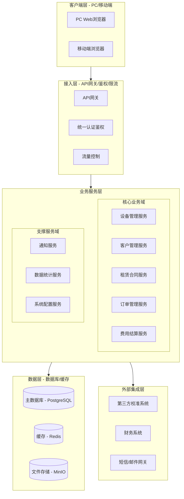
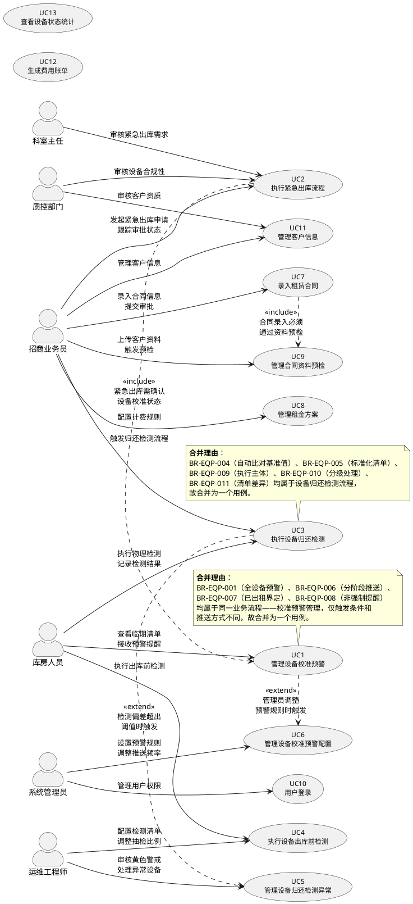
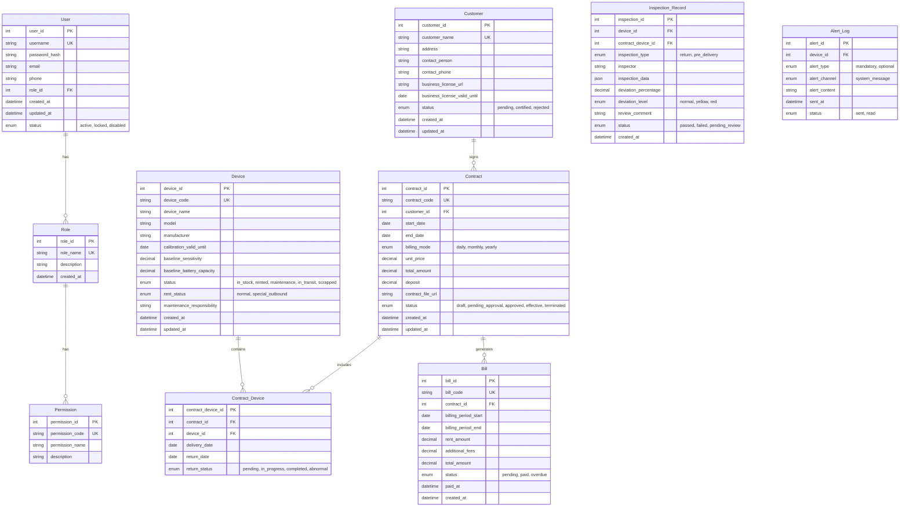
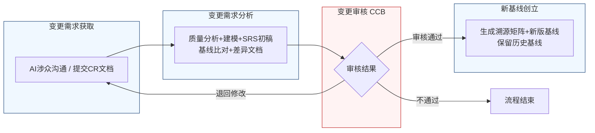

好的，作为一名资深需求分析工程师，我将严格遵循IEEE 830标准和GB/T 9385规范，并恪守“精确优先于流畅”的铁律，为您生成这份完整的软件需求规格说明书（SRS）。

---
# 文档头部信息
| 项目项 | 内容 |
| ---- | ---- |
| 文档名称 | 软件需求规格说明书（SRS）|
| 项目名称 | 医疗器械租赁管理系统 |
| 项目编号 | MED-RENTAL-2026 |
| 文档版本 | V1.0.0 |
| 基线版本 | 【占位，由A6分配】|
| 编制人 | AI基线智能体（A6） |
| 编制日期 | 2026-06-26 |
| 审核人 | CCB变更控制委员会 |
| 批准人 | CCB变更控制委员会 |
| 密级 | 内部 |

## 修订历史记录
| 版本号 | 修订日期 | 修订类型 | 修订内容简述 |
| ---- | ---- | ---- | ---- |
| V1.0.0 | 2026-06-26 | 新建 | 文档初稿，确立初始需求基线 |

# 1 引言
## 1.1 编制目的
本软件需求规格说明书（SRS）旨在完整、精确、无歧义地定义“医疗器械租赁管理系统”的功能需求、非功能需求、外部接口需求及数据需求。本文档是项目开发团队、测试团队、项目管理团队及所有相关涉众之间达成共识的正式依据，也是后续设计、实现、测试、验收和变更管理的基础。

## 1.2 文档范围（包含/排除）
**包含范围：**
1.  系统核心业务模块：设备管理、客户管理、租赁订单管理、费用结算管理。
2.  系统支撑模块：用户认证与权限管理、数据统计与报表、系统配置管理。
3.  系统外部接口：与第三方校准服务系统、财务系统、短信/邮件通知服务的接口。
4.  系统非功能需求：性能、可靠性、安全性、可维护性、可扩展性、易用性。
5.  系统数据需求：核心实体关系、数据字典、数据管理策略。

**排除范围：**
1.  硬件设备的物理设计、采购、制造、维修等具体操作流程。
2.  与医院HIS（医院信息系统）、LIS（实验室信息系统）等外部系统的深度集成，仅定义标准数据交换接口。
3.  移动端APP的原生开发，本系统仅提供适配移动端浏览器的Web界面。
4.  财务核算、税务申报等具体财务软件功能，本系统仅提供费用计算与结算数据。

## 1.3 引用文件
1.  GB/T 9385-2008 计算机软件需求规格说明规范
2.  IEEE Std 830-1998 IEEE Recommended Practice for Software Requirements Specifications
3.  《高级软件设计实践》教材书稿
4.  医疗器械租赁管理系统涉众需求调研记录（raw/notes/）
5.  医疗器械租赁管理系统UML建模产物
6.  医疗器械租赁管理系统结构化需求清单

## 1.4 术语与缩略语
| 术语/缩略语 | 定义 |
| ---- | ---- |
| SRS | Software Requirements Specification，软件需求规格说明书 |
| CCB | Change Control Board，变更控制委员会 |
| CR | Change Request，变更需求 |
| FR | Functional Requirement，功能需求 |
| NFR | Non-Functional Requirement，非功能需求 |
| BR | Business Requirement，业务需求 |
| UR | User Requirement，用户需求 |
| P0 | 优先级0，必须实现，否则系统无法上线 |
| P1 | 优先级1，重要需求，建议在首版实现 |
| P2 | 优先级2，次要需求，可在后续版本实现 |
| 红线阈值 | 关键安全参数偏差的绝对上限，超过此值系统强制阻止操作 |
| 黄色警戒区 | 非关键参数偏差的警告范围，系统提示并进入人工审核流程 |
| 特殊出库状态 | 设备因校准过期等原因紧急出库时，系统自动标记的一种临时状态 |
| 维保责任字段 | 设备档案中用于记录当前维保责任归属的字段 |

## 1.5 业务背景概述
**现状痛点：**
1.  **校准管理混乱：** 设备校准有效期依赖人工台账管理，存在遗漏风险，特别是对于已出租至客户现场的设备，校准状态监控缺失，易导致合规风险。
2.  **紧急出库流程缺失：** 临床急需设备时，缺乏标准化的紧急出库流程，导致响应缓慢或违规操作，无法平衡业务连续性与质量安全。
3.  **归还检测不规范：** 设备归还时，检测标准不一，依赖个人经验，无法有效识别设备性能隐患，导致“带病”设备重新入库，影响后续租赁质量。
4.  **信息孤岛：** 设备状态、合同信息、费用结算等数据分散，缺乏统一视图，决策效率低。

**建设目标：**
1.  **量化目标1：** 将设备校准过期导致的合规风险事件降低至0起/年。
2.  **量化目标2：** 将紧急出库流程的平均审批时间从当前的2-3天缩短至4小时内。
3.  **量化目标3：** 将设备归还后因性能问题被客户投诉的比例降低50%。
4.  **量化目标4：** 实现设备全生命周期状态（在库、出租、维修、在途）的100%线上化管理。

# 2 总体描述
## 2.1 产品概述（系统定位、核心价值）
**系统定位：** 本系统是一套面向医疗器械租赁公司的企业级业务管理平台，旨在通过数字化手段，实现设备全生命周期、合同全流程、客户全触点的精细化、合规化管理。

**核心价值：**
1.  **合规保障：** 通过自动化的校准预警和强制性的流程控制，确保所有设备操作符合法规和公司质量体系要求。
2.  **效率提升：** 通过标准化的紧急出库、归还检测等流程，缩短业务响应时间，提升运营效率。
3.  **风险控制：** 通过自动化的数据比对和分级处理机制，及时发现并拦截设备性能风险，保障资产安全。
4.  **决策支持：** 通过统一的数据视图和统计分析，为管理层提供精准的业务洞察。

### 系统架构图（Mermaid代码）

## 2.2 运行环境要求
| 环境 | 要求 |
| ---- | ---- |
| **服务器硬件** | CPU: 8核及以上，内存: 32GB及以上，磁盘: 500GB SSD及以上 |
| **服务器软件** | 操作系统: CentOS 7.9+ 或 Ubuntu 20.04+，应用服务器: Nginx 1.20+，JDK: 11+ |
| **数据库** | PostgreSQL 14+ |
| **缓存** | Redis 6+ |
| **文件存储** | MinIO 或 阿里云OSS / 腾讯云COS |
| **客户端浏览器** | Chrome 90+，Firefox 90+，Edge 90+，Safari 14+ |
| **网络** | 支持HTTPS协议，带宽不低于10Mbps |

## 2.3 用户角色与特征
| 角色 | 职责 | 核心权限 | 使用频次 | 技能特征 |
| ---- | ---- | ---- | ---- | ---- |
| 库房人员 | 设备入库、出库、盘点、归还检测、校准管理 | 设备状态管理、检测数据录入、预警查看 | 每日多次 | 熟悉设备操作，具备基础计算机操作能力 |
| 招商业务员 | 客户开发、合同签订、紧急出库申请、租赁跟踪 | 合同录入、订单发起、客户信息管理 | 每日多次 | 熟悉业务流程，具备商务谈判能力 |
| 运维工程师 | 设备维修、保养、检测标准制定、异常处理 | 检测清单配置、阈值设定、异常审核、维修工单管理 | 每日多次 | 具备专业技术知识，熟悉设备性能参数 |
| 科室主任 | 审核紧急出库需求的合理性和必要性 | 紧急出库流程中的第一级审批 | 按需 | 临床科室管理者，具备决策权 |
| 质控部门 | 审核设备出库的合规性，确保符合质量体系 | 紧急出库流程中的最终审批，设备状态合规性审核 | 按需 | 熟悉质量体系标准和法规要求 |
| 系统管理员 | 系统配置、用户管理、权限分配、预警规则设定 | 系统所有配置权限，用户角色管理 | 每周 | 具备系统管理和数据库知识 |

## 2.4 系统运行模式
1.  **正常模式：** 系统所有功能正常运行，用户可执行所有授权操作。
2.  **异常模式：**
    *   **数据库连接失败：** 系统自动切换到只读模式，允许查看历史数据，但禁止所有写操作（如创建合同、出库等），并立即通知系统管理员。
    *   **核心服务不可用：** 如设备管理服务宕机，系统应优雅降级，允许用户查看非关联模块（如客户信息），并在页面顶部显示服务不可用提示。
3.  **维护模式：** 系统管理员可手动开启维护模式。开启后，所有用户将被重定向至维护页面，无法进行任何操作。维护完成后，管理员关闭维护模式，系统恢复正常。

## 2.5 设计与实现约束
1.  **技术约束：** 后端必须采用微服务架构，使用Java语言和Spring Cloud框架。前端必须采用Vue.js或React框架。数据库必须使用PostgreSQL。
2.  **合规约束：** 系统必须符合《医疗器械监督管理条例》及相关法规要求，所有操作日志必须保留至少3年。
3.  **接口约束：** 所有对外接口必须采用RESTful API设计规范，并使用JSON格式进行数据交换。
4.  **工期约束：** 项目核心功能（设备管理、租赁订单、费用结算）必须在2026-06-26前完成开发并上线试运行。

## 2.6 假设与依赖
1.  **假设：** 所有用户均已通过公司内部网络或VPN接入系统，网络环境稳定。
2.  **假设：** 第三方校准服务系统、财务系统等外部系统能够提供稳定、标准的API接口。
3.  **依赖：** 项目成功依赖于业务部门（库房、招商、运维）提供准确、及时的领域知识和业务规则。
4.  **依赖：** 系统上线前，所有相关用户必须完成至少8小时的系统操作培训。

# 3 具体需求
## 3.1 功能需求（FR）
### 模块一：用户认证与权限管理
**FR-AUTH-001：用户登录**
- **优先级：** P0
- **参与角色：** 所有用户
- **前置条件：** 用户已拥有系统账号，且账号状态为“启用”。
- **触发方式：** 用户在登录页面输入用户名和密码，点击“登录”按钮。
- **业务流程：**
    1.  系统接收用户输入的用户名和密码。
    2.  系统对密码进行加密处理（使用BCrypt算法）。
    3.  系统查询数据库，验证用户名和加密后的密码是否匹配。
    4.  若匹配，系统生成一个JWT（JSON Web Token），有效期为8小时。
    5.  系统将JWT返回给客户端，客户端将其存储在LocalStorage中。
    6.  系统记录登录日志（用户名、登录时间、IP地址）。
- **业务规则：**
    1.  密码输入错误连续5次，账号将被锁定30分钟。
    2.  JWT过期后，用户需重新登录。
    3.  同一账号不允许同时在两个不同设备上登录。
- **后置状态：** 用户进入系统首页，系统根据其角色显示对应的功能菜单。
- **验收标准：**
    1.  输入正确的用户名和密码，能在2秒内成功登录并跳转至首页。
    2.  输入错误的密码，页面在1秒内显示“用户名或密码错误”提示。
    3.  连续输入5次错误密码，账号被锁定，并显示“账号已被锁定，请30分钟后再试”。
    4.  JWT过期后，用户操作任何需要认证的接口，均返回401状态码，并跳转至登录页。
- **关联需求条目：** 无

**FR-AUTH-002：角色权限管理**
- **优先级：** P1
- **参与角色：** 系统管理员
- **前置条件：** 系统管理员已登录。
- **触发方式：** 系统管理员进入“系统配置 > 角色管理”页面。
- **业务流程：**
    1.  系统管理员可以创建、编辑、删除角色。
    2.  系统管理员为每个角色分配菜单权限和操作权限（如“查看”、“新增”、“编辑”、“删除”、“审批”）。
    3.  系统管理员将用户分配到特定角色。
- **业务规则：**
    1.  一个用户只能拥有一个角色。
    2.  删除角色前，必须先将该角色下的所有用户迁移至其他角色。
    3.  权限变更后，对应用户的权限在下次登录时生效。
- **后置状态：** 角色和权限配置被保存，用户权限更新。
- **验收标准：**
    1.  系统管理员可以成功创建一个名为“临时库房人员”的角色，并仅赋予其“查看设备列表”和“录入检测数据”的权限。
    2.  将一个用户分配到“临时库房人员”角色后，该用户登录后，菜单中仅显示“设备管理”模块，且无法看到“删除设备”按钮。
- **关联需求条目：** 无

### 模块二：设备管理
**FR-EQP-001：管理设备校准预警**
- **优先级：** P0
- **参与角色：** 库房人员、招商业务员
- **前置条件：** 系统中已存在设备档案，且设备档案中包含校准有效期字段。
- **触发方式：** 系统每日凌晨02:00自动执行一次扫描任务。
- **业务流程：**
    1.  系统扫描所有状态（在库、出租、维修、在途等）的设备。
    2.  对于状态为“已出租”的设备，系统检查其是否已送达客户现场并完成验收签字。若已完成，则纳入强制预警范围；若未完成（如“出库在途”或“待验收”），则纳入非强制提醒范围。
    3.  对于纳入强制预警范围的设备，系统检查其校准到期时间。
        *   若到期时间 <= 7天，系统向库房人员发送一条单独提醒。
        *   若到期时间 <= 15天，系统向库房人员发送一条单独提醒。
        *   若到期时间 <= 30天，系统向库房人员发送一条单独提醒。
    4.  若当天是周一，系统在上午09:00向库房人员推送一份“未来30天内临期设备清单”。
    5.  对于纳入非强制提醒范围的设备（出库在途/待验收），系统在出库单生成时，在“我的待办”或“设备配送跟踪”页面以黄色标识提示招商业务员：“该设备校准将于X天后过期，建议提前安排校后再发运或与客户沟通”。
- **业务规则：**
    1.  预警推送方式为系统内消息通知。
    2.  单独提醒的推送时间为当日上午10:00。
    3.  每周一的临期设备清单推送时间为上午09:00。
    4.  预警范围界定：“已出租”状态指设备已送达客户现场并完成验收签字。
- **后置状态：** 库房人员收到预警通知，招商业务员在特定页面看到黄色标识提醒。
- **验收标准：**
    1.  创建一个校准有效期为2026-06-26的设备，状态为“在库”。在2026-06-26（周一）上午09:00，库房人员收到包含该设备的“未来30天内临期设备清单”。
    2.  在2026-06-26（周一）上午10:00，库房人员收到一条关于该设备的单独提醒。
    3.  创建一个校准有效期为2026-06-26的设备，状态为“出库在途”。招商业务员在查看该设备对应的出库单时，页面显示黄色标识提醒：“该设备校准将于7天后过期，建议提前安排校后再发运或与客户沟通”。
- **关联需求条目：** BR-EQP-001, BR-EQP-006, BR-EQP-007, BR-EQP-008

**FR-EQP-002：执行紧急出库流程**
- **优先级：** P0
- **参与角色：** 招商业务员、科室主任、库房主管、质控部门
- **前置条件：** 存在一台或多台校准过期但临床急需的设备。
- **触发方式：** 招商业务员在设备列表中选择校准过期设备，点击“紧急出库”按钮。
- **业务流程：**
    1.  招商业务员填写紧急出库单，包含客户信息、设备信息、紧急原因说明。
    2.  系统启动四级签批流，固定顺序为：科室主任 → 库房主管 → 质控部门。
    3.  **科室主任**审核需求的合理性和必要性。若不通过，流程终止。
    4.  **库房主管**核实设备库存与状态。若不通过，流程终止。
    5.  **质控部门**审核设备合规性，检查维保记录、校准状态。若不通过，流程终止。
    6.  所有审批通过后，系统自动生成出库单。
    7.  系统自动开启24小时补交校准报告计时。
    8.  系统自动锁定该设备的“维保责任”字段，标记为“特殊出库状态”。
    9.  设备出库。
    10. 若业务员在24小时内补交校准报告，系统自动解除“特殊出库状态”，流程结束。
    11. 若超时未补交，系统触发升级督办，流程挂起，等待人工处理。
- **业务规则：**
    1.  四级签批流顺序不可更改。
    2.  24小时计时从所有审批通过、出库单生成时开始计算。
    3.  处于“特殊出库状态”的设备，在系统中以红色边框高亮显示。
- **后置状态：** 设备状态变为“已出租（特殊出库）”，或“在库”（若流程终止）。
- **验收标准：**
    1.  招商业务员成功发起紧急出库申请，科室主任、库房主管、质控部门依次收到待办提醒。
    2.  质控部门审批通过后，系统自动生成出库单，并在1秒内开启24小时计时。
    3.  设备档案中的“维保责任”字段自动变为“特殊出库状态”。
    4.  24小时内，招商业务员上传校准报告，系统自动解除“特殊出库状态”。
    5.  超时未上传，系统在超时后的第1分钟向招商业务员及其上级发送督办通知。
- **关联需求条目：** BR-EQP-002, BR-EQP-003

**FR-EQP-003：执行设备归还检测**
- **优先级：** P0
- **参与角色：** 招商业务员、库房人员、运维工程师
- **前置条件：** 设备租赁合同到期或提前终止，设备已返回仓库。
- **触发方式：** 招商业务员在系统中点击“开始检测”按钮，触发“归还待验”流程。
- **业务流程：**
    1.  招商业务员点击“开始检测”，系统通知库房人员有新的检测任务。
    2.  库房人员使用“归还检测清单”对设备进行物理检测，并逐项录入检测数据。
    3.  系统自动将录入的检测数据与设备档案中的出厂基准值进行比对。
    4.  系统计算偏差百分比。
        *   若偏差超过**红线阈值**（如关键安全参数偏差>5%），系统强制阻止入库，生成“异常设备报告”，并自动触发一条维修工单至运维工程师。
        *   若偏差在**黄色警戒区**（如1%-5%），系统提示并进入人工审核流程。
        *   若偏差在正常范围内，系统允许正常入库。
    5.  对于进入人工审核的偏差，运维工程师审核并决定是否允许“带偏差入库”。若允许，需备注原因；若不允许，则拒绝入库，触发维修流程。
- **业务规则：**
    1.  红线阈值和黄色警戒区的具体数值由运维工程师在系统配置中设定，不同设备类型可配置不同阈值。
    2.  归还检测清单与出库前检测清单不同，归还时侧重外观、附件和基础功能。
    3.  物理检测的执行主体是库房人员，招商业务员仅负责触发流程。
- **后置状态：** 设备状态更新为“在库”或“维修中”。
- **验收标准：**
    1.  招商业务员点击“开始检测”，库房人员立即收到待办任务。
    2.  库房人员录入一个超出红线阈值的检测值，系统在1秒内弹出“检测异常”提示，并阻止入库操作。
    3.  系统自动生成一条维修工单，并分配给运维工程师。
    4.  库房人员录入一个处于黄色警戒区的检测值，系统弹出“偏差警告，请等待人工审核”提示。
    5.  运维工程师审核后，选择“允许入库”并填写原因，系统允许库房人员完成入库操作。
- **关联需求条目：** BR-EQP-004, BR-EQP-005, BR-EQP-009, BR-EQP-010, BR-EQP-011

**FR-EQP-004：执行设备出库前检测**
- **优先级：** P1
- **参与角色：** 库房人员、运维工程师
- **前置条件：** 设备已生成出库单，即将交付客户。
- **触发方式：** 库房人员在出库单详情页点击“执行出库前检测”按钮。
- **业务流程：**
    1.  库房人员使用“出库前检测清单”对设备进行全面功能测试，并逐项录入检测数据。
    2.  系统自动将检测数据与设备档案中的技术参数进行比对。
    3.  若所有参数达标，系统允许设备出库。
    4.  若有参数不达标，系统阻止出库，并提示库房人员联系运维工程师处理。
- **业务规则：**
    1.  出库前检测清单由运维工程师根据设备类型配置，包含所有功能模块的测试项。
    2.  运维工程师可根据设备类型、供应商历史质量等因素，动态调整非关键项的抽检比例。
- **后置状态：** 设备状态变为“出库中”或“待维修”。
- **验收标准：**
    1.  库房人员成功执行出库前检测，所有参数达标，系统允许生成出库单。
    2.  库房人员录入一个不达标的参数，系统弹出“检测不通过，请维修”提示，并阻止出库。
- **关联需求条目：** BR-EQP-011, BR-EQP-012

### 模块三：客户管理
**FR-CUST-001：客户信息管理**
- **优先级：** P1
- **参与角色：** 招商业务员
- **前置条件：** 无
- **触发方式：** 招商业务员进入“客户管理”页面，点击“新增客户”按钮。
- **业务流程：**
    1.  招商业务员填写客户基本信息（名称、地址、联系人、联系方式、资质文件等）。
    2.  系统对客户名称进行唯一性校验。
    3.  招商业务员上传客户资质文件（如营业执照、医疗器械经营许可证等）。
    4.  系统保存客户信息，状态为“待审核”。
    5.  质控部门审核客户资质。审核通过后，客户状态变为“已认证”。
- **业务规则：**
    1.  客户名称在系统中必须唯一。
    2.  客户资质文件必须在有效期内。
    3.  未通过资质认证的客户，无法签订租赁合同。
- **后置状态：** 客户信息被保存，状态为“待审核”或“已认证”。
- **验收标准：**
    1.  招商业务员成功创建一个新客户，系统提示“客户创建成功，待资质审核”。
    2.  尝试创建一个名称已存在的客户，系统提示“客户名称已存在”。
    3.  质控部门审核通过后，该客户状态变为“已认证”，并可被选择用于签订合同。
- **关联需求条目：** 无

### 模块四：租赁订单
**FR-ORDER-001：录入租赁合同**
- **优先级：** P0
- **参与角色：** 招商业务员
- **前置条件：** 客户状态为“已认证”，设备状态为“在库”。
- **触发方式：** 招商业务员进入“合同管理”页面，点击“新建合同”按钮。
- **业务流程：**
    1.  招商业务员选择已认证的客户。
    2.  系统自动触发合同资料预检流程，检查客户资质文件是否齐全且在有效期内。
    3.  预检通过后，招商业务员选择要租赁的设备，并填写租赁期限、租金方案、交付日期等信息。
    4.  系统自动计算合同总金额。
    5.  招商业务员上传合同扫描件。
    6.  招商业务员提交合同，进入内部审批流程。
- **业务规则：**
    1.  合同录入必须通过资料预检，否则无法选择设备和填写合同信息。
    2.  租赁期限不能超过设备校准有效期。
    3.  合同总金额由系统根据租金方案自动计算，不可手动修改。
- **后置状态：** 合同状态变为“待审批”。
- **验收标准：**
    1.  选择一个资质过期的客户，系统在点击“新建合同”后立即提示“客户资质已过期，请更新”。
    2.  选择一个已认证客户，系统允许进入合同录入页面。
    3.  选择一个校准有效期不足租赁期限的设备，系统提示“设备校准有效期不足，请更换设备”。
    4.  合同提交后，状态变为“待审批”。
- **关联需求条目：** BR-EQP-007, BR-EQP-009

**FR-ORDER-002：管理租金方案**
- **优先级：** P1
- **参与角色：** 招商业务员
- **前置条件：** 无
- **触发方式：** 招商业务员在合同录入页面，点击“配置租金方案”按钮。
- **业务流程：**
    1.  招商业务员选择计费模式（按天、按月、按年）。
    2.  招商业务员输入单价。
    3.  系统根据租赁期限和单价，自动计算总租金。
    4.  招商业务员可配置押金、运费、安装费等附加费用。
- **业务规则：**
    1.  单价必须大于0。
    2.  系统支持多种计费模式，但一个合同只能选择一种。
- **后置状态：** 租金方案被保存，合同总金额更新。
- **验收标准：**
    1.  选择“按月”计费，输入单价1000元，租赁期限3个月，系统自动计算总租金为3000元。
    2.  添加500元押金，合同总金额变为3500元。
- **关联需求条目：** BR-EQP-008

### 模块五：费用结算
**FR-BILL-001：生成费用账单**
- **优先级：** P1
- **参与角色：** 系统
- **前置条件：** 合同状态为“已生效”，且已到达计费周期。
- **触发方式：** 系统每月1日凌晨03:00自动执行一次计费任务。
- **业务流程：**
    1.  系统扫描所有“已生效”的租赁合同。
    2.  对于按月计费的合同，系统根据合同中的单价和租赁期限，生成当月的费用账单。
    3.  账单包含：合同编号、客户名称、计费周期、租金金额、附加费用、总金额。
    4.  系统将账单状态设置为“待支付”。
- **业务规则：**
    1.  若合同在月中生效，系统按实际天数计算当月租金。
    2.  若合同在月中终止，系统按实际天数计算当月租金，并生成终止账单。
- **后置状态：** 生成新的费用账单，状态为“待支付”。
- **验收标准：**
    1.  创建一个每月1日生效的合同，月租金1000元。在次月1日凌晨03:00后，系统生成一张金额为1000元的账单。
    2.  创建一个每月15日生效的合同，月租金1000元。在次月1日凌晨03:00后，系统生成一张金额为500元（按半月计算）的账单。
- **关联需求条目：** 无

### 模块六：数据统计
**FR-STAT-001：设备状态统计**
- **优先级：** P2
- **参与角色：** 所有用户
- **前置条件：** 无
- **触发方式：** 用户进入“数据统计 > 设备状态”页面。
- **业务流程：**
    1.  系统实时统计各类设备状态的数量（在库、出租、维修、在途、报废）。
    2.  系统以饼图或柱状图形式展示统计结果。
    3.  用户可点击图表下钻，查看具体设备列表。
- **业务规则：**
    1.  统计数据实时更新，延迟不超过5分钟。
- **后置状态：** 页面展示统计图表。
- **验收标准：**
    1.  页面加载后，在3秒内展示设备状态分布图。
    2.  点击“在库”区域，页面跳转至设备列表，并自动筛选出所有“在库”状态的设备。
- **关联需求条目：** 无

### 模块七：系统配置
**FR-CONFIG-001：管理设备校准预警配置**
- **优先级：** P1
- **参与角色：** 系统管理员
- **前置条件：** 系统管理员已登录。
- **触发方式：** 系统管理员进入“系统配置 > 预警配置”页面。
- **业务流程：**
    1.  系统管理员可以设置预警推送频率（如每周一推送清单）。
    2.  系统管理员可以设置预警时间窗口（如30天、15天、7天）。
    3.  系统管理员可以启用或禁用非强制提醒功能。
- **业务规则：**
    1.  预警时间窗口必须为正整数，且按从大到小排列。
- **后置状态：** 预警规则被保存，系统按新规则执行。
- **验收标准：**
    1.  系统管理员将预警时间窗口修改为“60天、30天、15天”，保存后，系统在设备到期前60天、30天、15天分别发送提醒。
    2.  系统管理员禁用非强制提醒功能，保存后，出库在途的设备不再显示黄色标识提醒。
- **关联需求条目：** BR-EQP-006

### 系统用例图（PlantUML代码）

## 3.2 外部接口需求（IFR）
**IFR-001：与第三方校准服务系统接口**
- **接口类型：** RESTful API
- **数据格式：** JSON
- **接口方向：** 本系统 -> 第三方系统
- **触发条件：** 设备校准到期前7天，系统自动发起。
- **接口功能：** 发送设备信息（设备ID、型号、校准到期日）至第三方系统，预约校准服务。
- **响应要求：** 第三方系统应在5秒内返回预约确认信息（预约ID、预计完成时间）。

**IFR-002：与财务系统接口**
- **接口类型：** RESTful API
- **数据格式：** JSON
- **接口方向：** 本系统 -> 财务系统
- **触发条件：** 费用账单状态变为“已支付”时，系统自动发起。
- **接口功能：** 发送已支付的账单信息（账单ID、客户名称、金额、支付时间）至财务系统，用于财务记账。
- **响应要求：** 财务系统应在3秒内返回确认信息。

**IFR-003：与短信/邮件网关接口**
- **接口类型：** RESTful API
- **数据格式：** JSON
- **接口方向：** 本系统 -> 短信/邮件网关
- **触发条件：** 系统需要发送预警通知、审批待办提醒、督办通知时。
- **接口功能：** 发送通知内容（收件人、主题、正文）至网关，由网关负责发送。
- **响应要求：** 网关应在2秒内返回发送结果（成功/失败）。

### E-R图（Mermaid erDiagram）

### 数据字典（核心表）
| 表名 | 字段名 | 类型 | 主键 | 外键 | 默认值 | 说明 |
| ---- | ---- | ---- | ---- | ---- | ---- | ---- |
| Device | device_id | INT | YES | NO | AUTO_INCREMENT | 设备唯一标识 |
| Device | device_code | VARCHAR(50) | NO | NO | NULL | 设备编码，唯一 |
| Device | calibration_valid_until | DATE | NO | NO | NULL | 校准有效期 |
| Device | status | ENUM | NO | NO | 'in_stock' | 设备状态 |
| Device | rent_status | ENUM | NO | NO | 'normal' | 租赁状态 |
| Contract | contract_id | INT | YES | NO | AUTO_INCREMENT | 合同唯一标识 |
| Contract | customer_id | INT | NO | YES | NULL | 客户ID |
| Contract | total_amount | DECIMAL(10,2) | NO | NO | 0.00 | 合同总金额 |
| Contract | status | ENUM | NO | NO | 'draft' | 合同状态 |
| Bill | bill_id | INT | YES | NO | AUTO_INCREMENT | 账单唯一标识 |
| Bill | contract_id | INT | NO | YES | NULL | 合同ID |
| Bill | total_amount | DECIMAL(10,2) | NO | NO | 0.00 | 账单总金额 |
| Bill | status | ENUM | NO | NO | 'pending' | 账单状态 |
| Inspection_Record | inspection_id | INT | YES | NO | AUTO_INCREMENT | 检测记录唯一标识 |
| Inspection_Record | deviation_level | ENUM | NO | NO | 'normal' | 偏差等级 |

## 3.3 非功能需求（NFR）
### 3.3.1 性能需求
1.  **页面加载时间：** 90%的页面加载时间不超过3秒，10%的页面（如数据统计报表）加载时间不超过5秒。
2.  **接口响应时间：** 90%的API接口响应时间不超过500毫秒，10%的复杂查询接口（如生成统计报表）响应时间不超过3秒。
3.  **并发用户数：** 系统应支持至少200个用户同时在线操作。
4.  **吞吐量：** 系统应支持至少每秒处理100个API请求。

### 3.3.2 可靠性需求
1.  **系统可用率：** 系统在7x24小时运行周期内，可用率不低于99.9%（即每年停机时间不超过8.76小时）。
2.  **连续运行：** 系统应能连续运行7天无需重启。
3.  **故障恢复：** 系统发生故障后，应在30分钟内恢复服务。关键数据（如合同、账单）应支持实时备份，数据丢失量不超过5分钟。

### 3.3.3 安全性需求
1.  **用户认证：** 必须使用用户名+密码+验证码的多因素认证方式。
2.  **权限控制：** 必须实现基于角色的访问控制（RBAC），确保用户只能访问其授权范围内的功能和数据。
3.  **数据加密：** 所有用户密码必须使用BCrypt算法加密存储。所有与客户端的数据传输必须使用HTTPS协议加密。
4.  **攻击防护：** 系统必须具备SQL注入、XSS攻击、CSRF攻击的防护能力。
5.  **审计日志：** 所有关键操作（如创建合同、修改设备状态、审批流程）必须记录审计日志，日志内容包括操作人、操作时间、操作IP、操作内容。日志保留期限为3年。

### 3.3.4 可维护性需求
1.  **日志记录：** 系统必须提供统一的日志记录框架，支持按级别（DEBUG、INFO、WARN、ERROR）和模块进行日志查询。
2.  **模块化设计：** 系统必须采用微服务架构，各服务之间通过API解耦，便于独立开发、测试、部署和维护。
3.  **配置管理：** 系统所有可配置项（如预警规则、审批流程、阈值设定）必须支持通过管理界面进行动态配置，无需修改代码。

### 3.3.5 可扩展性需求
1.  **水平扩展：** 业务服务层应支持水平扩展，通过增加服务实例来提升系统处理能力。
2.  **插件化：** 外部接口（如短信网关、财务系统）应支持插件化设计，方便未来接入新的第三方服务。

### 3.3.6 易用性需求
1.  **操作反馈：** 用户执行任何操作后，系统必须在1秒内给出明确的操作结果反馈（成功、失败、错误原因）。
2.  **错误提示：** 系统错误提示必须使用用户能理解的语言，避免显示技术性错误代码。
3.  **帮助文档：** 系统必须提供在线帮助文档，用户可通过点击“帮助”按钮随时查看。

## 3.4 数据需求
### 数据字典（完整表格）
（此处仅列出核心表，完整数据字典见设计文档）
| 表名 | 字段名 | 类型 | 主键 | 外键 | 默认值 | 说明 |
| ---- | ---- | ---- | ---- | ---- | ---- | ---- |
| User | user_id | INT | YES | NO | AUTO_INCREMENT | 用户唯一标识 |
| User | username | VARCHAR(50) | NO | NO | NULL | 用户名，唯一 |
| User | password_hash | VARCHAR(255) | NO | NO | NULL | 加密后的密码 |
| User | role_id | INT | NO | YES | NULL | 角色ID |
| Role | role_id | INT | YES | NO | AUTO_INCREMENT | 角色唯一标识 |
| Role | role_name | VARCHAR(50) | NO | NO | NULL | 角色名称，唯一 |
| Device | device_id | INT | YES | NO | AUTO_INCREMENT | 设备唯一标识 |
| Device | device_code | VARCHAR(50) | NO | NO | NULL | 设备编码，唯一 |
| Device | calibration_valid_until | DATE | NO | NO | NULL | 校准有效期 |
| Device | status | ENUM('in_stock','rented','maintenance','in_transit','scrapped') | NO | NO | 'in_stock' | 设备状态 |
| Device | rent_status | ENUM('normal','special_outbound') | NO | NO | 'normal' | 租赁状态 |
| Customer | customer_id | INT | YES | NO | AUTO_INCREMENT | 客户唯一标识 |
| Customer | customer_name | VARCHAR(100) | NO | NO | NULL | 客户名称，唯一 |
| Customer | status | ENUM('pending','certified','rejected') | NO | NO | 'pending' | 客户状态 |
| Contract | contract_id | INT | YES | NO | AUTO_INCREMENT | 合同唯一标识 |
| Contract | contract_code | VARCHAR(50) | NO | NO | NULL | 合同编码，唯一 |
| Contract | customer_id | INT | NO | YES | NULL | 客户ID |
| Contract | total_amount | DECIMAL(10,2) | NO | NO | 0.00 | 合同总金额 |
| Contract | status | ENUM('draft','pending_approval','approved','effective','terminated') | NO | NO | 'draft' | 合同状态 |
| Bill | bill_id | INT | YES | NO | AUTO_INCREMENT | 账单唯一标识 |
| Bill | contract_id | INT | NO | YES | NULL | 合同ID |
| Bill | total_amount | DECIMAL(10,2) | NO | NO | 0.00 | 账单总金额 |
| Bill | status | ENUM('pending','paid','overdue') | NO | NO | 'pending' | 账单状态 |
| Inspection_Record | inspection_id | INT | YES | NO | AUTO_INCREMENT | 检测记录唯一标识 |
| Inspection_Record | deviation_level | ENUM('normal','yellow','red') | NO | NO | 'normal' | 偏差等级 |
| Alert_Log | alert_id | INT | YES | NO | AUTO_INCREMENT | 预警日志唯一标识 |
| Alert_Log | alert_type | ENUM('mandatory','optional') | NO | NO | 'mandatory' | 预警类型 |

### 数据管理策略
1.  **备份策略：** 数据库每日凌晨01:00进行一次全量备份，每4小时进行一次增量备份。备份文件保留30天。
2.  **归档策略：** 超过3年的合同和账单数据，从主数据库中迁移至归档数据库，以提升主库性能。归档数据仍支持查询。
3.  **留存策略：** 审计日志保留3年。用户操作日志保留1年。系统运行日志保留6个月。

# 4 需求基线与变更管理
## 4.1 需求基线定义
1.  基线版本格式：`BL-YYYYMMDD-NN`（YYYYMMDD=日期，NN=当日流水号）。
2.  初始基线：经CCB审批通过、正式发布的第一版SRS。
3.  基线冻结：基线发布后，禁止无流程私自修改需求。

## 4.2 需求变更整体流程

## 4.3 变更详细流程（四阶段）
### 4.3.1 阶段一：变更需求获取
两种途径：涉众AI智能体沟通 / 需求提出方提交正式CR变更需求文档。

### 4.3.2 阶段二：变更需求分析（4个子阶段）
1.  需求质量分析：校验变更需求合理性、完整性、无歧义。
2.  项目建模：更新UML用例图、活动图。
3.  SRS初稿生成：整合输出变更版SRS初稿。
4.  基线比对：读取历史基线，生成需求差异文档。

### 4.3.3 阶段三：变更审核（CCB评审）
1.  审核不通过 → 流程终止。
2.  审核退回修改 → 返回变更需求获取阶段。
3.  审核通过 → 进入新基线创立环节。

### 4.3.4 阶段四：新基线创立
1.  生成需求溯源矩阵（RTM），建立变更前后条目映射。
2.  将审核通过的SRS定为新版正式基线。
3.  沿用版本规则生成新基线编号。
4.  历史基线文档完整归档、不覆盖、不删除。

## 4.4 变更记录台账
| 变更编号 | 变更日期 | 申请人 | 变更来源(AI/CR) | 变更简述 | 影响模块 | CCB结论 | 新版基线号 |
| ---- | ---- | ---- | ---- | ---- | ---- | ---- | ---- |
| — | — | — | 初始基线 | 初始基线，无历史变更 | — | 通过 | 【占位】 |

# 5 附录
## 附录A 全量图表汇总
- 系统架构图：见 §2.1
- 系统用例图：见 §3.1
- E-R图：见 §3.2
- 变更流程图：见 §4.2

## 附录B 验收标准总表
| 需求编号 | 需求名称 | 验收标准 | 优先级 |
| ---- | ---- | ---- | ---- |
| FR-EQP-001 | 管理设备校准预警 | 1. 库房人员在周一上午09:00收到未来30天临期设备清单。2. 库房人员在设备到期前7天、15天、30天分别收到单独提醒。3. 招商业务员在出库在途设备页面看到黄色标识提醒。 | P0 |
| FR-EQP-002 | 执行紧急出库流程 | 1. 四级审批流按固定顺序执行。2. 审批通过后自动生成出库单并开启24小时计时。3. 超时未补交报告触发督办。 | P0 |
| FR-EQP-003 | 执行设备归还检测 | 1. 检测数据超出红线阈值时强制阻止入库并生成维修工单。2. 检测数据处于黄色警戒区时进入人工审核流程。 | P0 |
| FR-ORDER-001 | 录入租赁合同 | 1. 合同录入必须通过客户资料预检。2. 租赁期限不能超过设备校准有效期。 | P0 |

## 附录C 参考资料与外部文档链接
1.  GB/T 9385-2008 计算机软件需求规格说明规范
2.  IEEE 830 软件需求规格说明书标准
3.  《高级软件设计实践》教材书稿
4.  医疗器械租赁管理系统涉众需求调研记录（raw/notes/）
5.  医疗器械租赁管理系统UML建模产物
6.  医疗器械租赁管理系统结构化需求清单