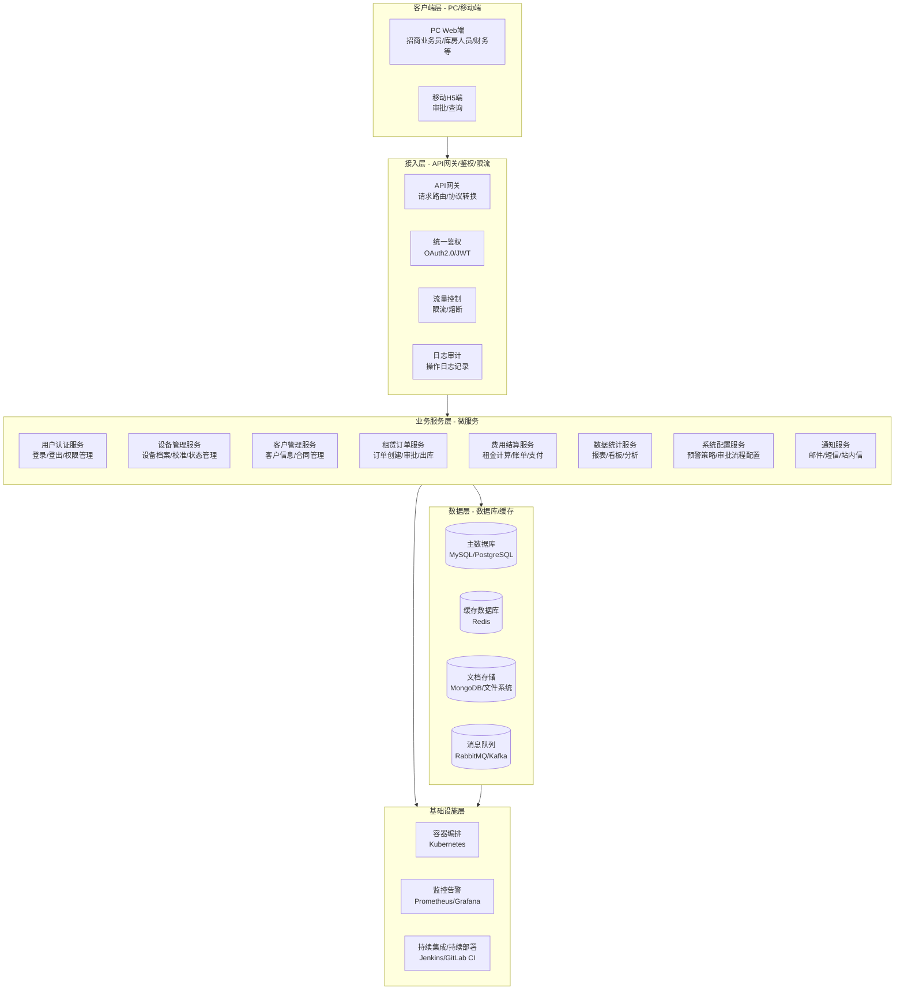
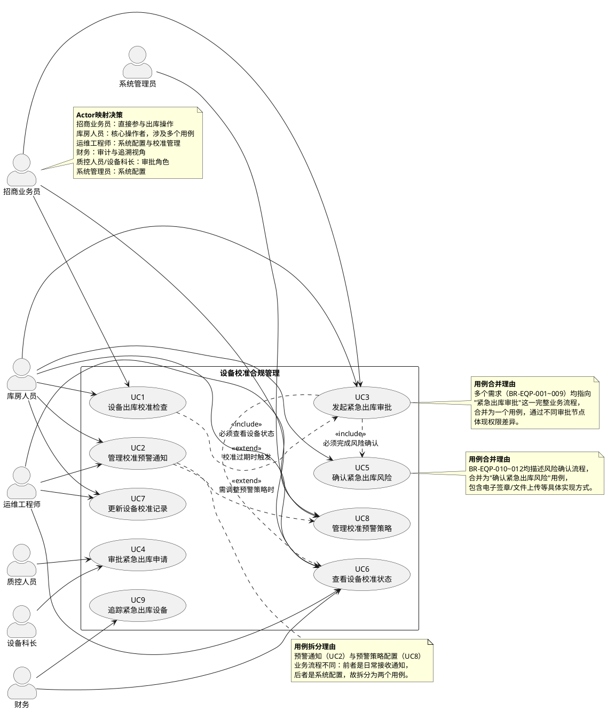
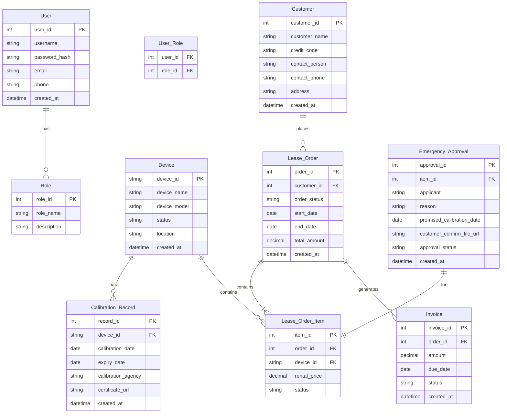
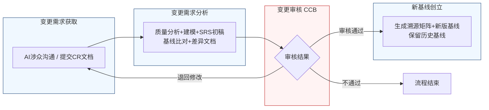

好的，作为资深需求分析工程师，我将严格遵循您的指示，采用两阶段法，精确优先，生成一份完整的、符合IEEE 830标准和GB/T 9385规范的软件需求规格说明书（SRS）。

---
# 文档头部信息
| 项目项 | 内容 |
| ---- | ---- |
| 文档名称 | 软件需求规格说明书（SRS）|
| 项目名称 | 医疗器械租赁管理系统 |
| 项目编号 | MED-RENTAL-2026 |
| 文档版本 | V1.0.0 |
| 基线版本 | 【占位，由A6分配】|
| 编制人 | AI基线智能体（A6） |
| 编制日期 | 2026-06-26 |
| 审核人 | CCB变更控制委员会 |
| 批准人 | CCB变更控制委员会 |
| 密级 | 内部 |

## 修订历史记录
| 版本号 | 修订日期 | 修订类型 | 修订内容简述 |
| V1.0.0 | 2026-06-26 | 新建 | 文档初稿，确立初始需求基线 |

# 1 引言
## 1.1 编制目的
本软件需求规格说明书（SRS）旨在为“医疗器械租赁管理系统”（项目编号：MED-RENTAL-2026）的开发、测试、验收及后续维护提供一份完整、精确、无歧义的需求基线。本文档的编制目的是：
1.  **建立共识**：在项目涉众（包括但不限于招商业务员、库房人员、运维工程师、财务人员、质控人员、设备科长及开发团队）之间，就系统的功能、性能、外部接口及约束达成一致的理解。
2.  **指导设计**：为系统架构师和开发工程师提供详细、可验证的需求描述，作为系统设计、编码和单元测试的依据。
3.  **支撑测试**：为测试团队提供明确的验收标准，确保最终交付的系统满足所有已确认的需求。
4.  **管理变更**：作为需求基线管理的起点，为后续的需求变更评估、影响分析和版本控制提供基准。

## 1.2 文档范围（包含/排除）
**包含范围：**
本文档详细描述了“医疗器械租赁管理系统”第一阶段的全部需求，涵盖以下7个核心功能模块：
1.  用户认证
2.  设备管理
3.  客户管理
4.  租赁订单
5.  费用结算
6.  数据统计
7.  系统配置

本文档特别聚焦于“设备管理”模块中的“设备校准合规管理”子模块，该子模块的需求来源于涉众对话记录，并已结构化处理为业务需求（BR-EQP-001至BR-EQP-014）。本文档将对这些需求进行精确的规格化描述。

**排除范围：**
本文档不包含以下内容：
1.  **系统架构设计**：如具体的微服务划分、数据库选型、缓存策略等。
2.  **用户界面（UI）原型设计**：具体的界面布局、颜色、字体、图标等视觉设计。
3.  **详细测试用例**：具体的测试步骤、测试数据和预期结果。
4.  **项目计划**：如开发周期、人员分配、里程碑节点等。
5.  **硬件采购清单**：具体的服务器型号、网络设备等。
6.  **第三方系统集成细节**：与外部系统（如ERP、财务系统）的接口协议细节，仅在本SRS中定义接口需求，具体实现由后续设计文档完成。

## 1.3 引用文件
1.  **GB/T 9385-2008**：计算机软件需求规格说明规范。
2.  **IEEE Std 830-1998**：IEEE Recommended Practice for Software Requirements Specifications。
3.  **《高级软件设计实践》教材书稿**：作为需求分析和建模的方法论参考。
4.  **医疗器械租赁管理系统涉众需求调研记录**：
    *   `raw/notes/招商业务员-20260626-1515-需求记录.md`
    *   `raw/notes/库房人员-20260626-1515-需求记录.md`
    *   `raw/notes/运维工程师-20260626-1515-需求记录.md`
    *   `raw/notes/财务-20260626-1515-需求记录.md`
5.  **医疗器械租赁管理系统UML建模产物**：包含用例图、活动图、序列图等。
6.  **医疗器械租赁管理系统结构化需求清单**：包含BR-EQP-001至BR-EQP-014等业务需求条目。

## 1.4 术语与缩略语
| 术语/缩略语 | 定义 |
| :--- | :--- |
| **SRS** | 软件需求规格说明书（Software Requirements Specification） |
| **CCB** | 变更控制委员会（Change Control Board），负责审批需求变更 |
| **CR** | 变更请求（Change Request），正式的需求变更文档 |
| **FR** | 功能需求（Functional Requirement） |
| **NFR** | 非功能需求（Non-Functional Requirement） |
| **BR** | 业务需求（Business Requirement），来源于涉众对话 |
| **UR** | 原始需求（Original Requirement），来源于涉众原始陈述 |
| **RTM** | 需求追溯矩阵（Requirements Traceability Matrix） |
| **P0** | 优先级0，必须实现，否则系统无法上线或核心业务无法运转 |
| **P1** | 优先级1，重要需求，影响核心业务流程的效率和体验 |
| **P2** | 优先级2，次要需求，属于优化或增强功能 |
| **校准** | 指对医疗设备进行计量检定，确保其测量或治疗参数的准确性 |
| **校准有效期** | 设备校准证书上注明的有效日期，超过此日期设备视为“校准过期” |
| **锁库** | 系统自动将设备库位标记为锁定状态，禁止任何出库操作 |
| **紧急放行** | 针对锁库设备，通过特殊审批流程允许其出库的例外操作 |
| **三方会签** | 指需要三个不同角色的负责人共同签字确认的审批流程 |

## 1.5 业务背景概述
**现状痛点：**
当前，医疗器械租赁业务中，设备校准状态的管理主要依赖人工台账和线下流程，存在以下痛点：
1.  **合规风险高**：校准过期设备可能因疏忽而出库，导致医疗事故和法律责任。
2.  **流程效率低**：紧急情况下，为过期设备申请出库的审批流程不明确，沟通成本高，响应慢。
3.  **信息不透明**：库房、业务、财务、运维等角色无法实时、准确地获取设备校准状态，导致决策滞后。
4.  **追溯困难**：紧急出库的审批记录、客户确认文件等缺乏系统化管理，审计追溯困难。

**建设目标：**
建设一套统一的医疗器械租赁管理系统，实现设备全生命周期的数字化管理。核心目标是：
1.  **守住合规底线**：通过系统强制规则，杜绝校准过期设备未经审批而出库。
2.  **提升应急响应**：为紧急临床需求提供受控、高效的在线审批通道。
3.  **实现信息共享**：所有涉众角色均可实时查看设备校准状态及审批流程进展。
4.  **确保全程追溯**：所有操作、审批、确认文件均系统留痕，满足审计要求。

**量化业务目标：**
1.  将因校准过期导致的设备违规出库事件降低至0。
2.  将紧急出库审批的平均处理时间从当前线下流程的2小时缩短至30分钟内。
3.  实现100%的紧急出库审批流程系统化、可追溯。

# 2 总体描述
## 2.1 产品概述
**系统定位：**
“医疗器械租赁管理系统”是一个面向医疗设备租赁业务的企业级信息管理系统。它旨在通过自动化、智能化的流程，管理设备从入库、校准、租赁、出库、归还到报废的全生命周期，特别强化了对设备校准合规性的管控。

**核心价值：**
1.  **风险控制**：通过系统强制规则（如锁库）和受控的例外流程（如紧急审批），有效管理设备合规风险。
2.  **运营效率**：自动化预警、在线审批、数据统计等功能，显著提升跨部门协作效率。
3.  **决策支持**：提供实时、准确的数据看板和分析报告，辅助管理层进行业务决策。
4.  **合规审计**：完整的操作日志和审批记录，满足内外部审计要求。

### 系统架构图（Mermaid代码）

## 2.2 运行环境要求
| 环境类型 | 支持规格 | 备注 |
| :--- | :--- | :--- |
| **服务器硬件** | CPU: 8核及以上，内存: 32GB及以上，硬盘: 500GB SSD及以上 | 生产环境建议集群部署 |
| **服务器操作系统** | CentOS 7.x / Ubuntu 20.04 LTS / Windows Server 2019 | 推荐Linux |
| **数据库** | MySQL 8.0 / PostgreSQL 14 | 主数据库 |
| **缓存** | Redis 6.x | 用于会话管理和数据缓存 |
| **消息队列** | RabbitMQ 3.9 / Kafka 3.0 | 用于异步任务和解耦 |
| **客户端浏览器** | Chrome 90+ / Firefox 90+ / Edge 90+ | 推荐Chrome |
| **客户端操作系统** | Windows 10+ / macOS 11+ / iOS 14+ / Android 10+ | 移动端适配H5 |
| **网络带宽** | 客户端到服务器：≥ 10Mbps | 确保页面加载和文件上传速度 |

## 2.3 用户角色与特征
| 角色 | 职责描述 | 核心权限 | 使用频次 | 技能要求 |
| :--- | :--- | :--- | :--- | :--- |
| **招商业务员** | 负责设备租赁业务的洽谈、合同签订、出库申请等 | 发起出库、查看设备状态、发起紧急审批 | 每日多次 | 熟悉业务流程，基本电脑操作 |
| **库房人员** | 负责设备入库、出库、盘点、校准状态更新等 | 执行出库、更新校准状态、接收预警、发起紧急审批 | 每日多次 | 熟悉库房管理流程，基本电脑操作 |
| **运维工程师** | 负责设备校准、维修、系统配置等 | 配置预警策略、更新校准记录、审批紧急出库 | 每日数次 | 熟悉设备技术参数，系统配置能力 |
| **财务** | 负责费用核算、账单管理、审计追溯等 | 查看费用数据、查看审批记录、追溯设备流向 | 每日数次 | 熟悉财务流程，数据分析能力 |
| **质控人员** | 负责设备质量审核，审批紧急出库申请 | 审批紧急出库申请 | 按需 | 熟悉质量标准和法规 |
| **设备科长** | 负责设备科整体管理，审批紧急出库申请 | 审批紧急出库申请 | 按需 | 熟悉科室管理，决策能力 |
| **系统管理员** | 负责系统配置、用户管理、权限分配等 | 所有系统配置权限 | 按需 | 系统管理技能 |

## 2.4 系统运行模式
| 运行模式 | 描述 | 触发条件 | 关键行为 |
| :--- | :--- | :--- | :--- |
| **正常模式** | 系统在标准环境下运行，所有功能可用，性能满足指标。 | 系统启动后，无异常事件发生。 | 所有业务流程按规则执行。 |
| **异常模式** | 系统在部分组件故障或外部环境异常时运行，核心功能降级或受限。 | 数据库连接失败、第三方服务不可用、网络中断等。 | 1. 核心出库功能降级为只读模式，无法发起新出库。2. 紧急审批流程转为线下应急流程。3. 系统记录详细错误日志并告警。 |
| **维护模式** | 系统计划内停机进行升级、维护或数据迁移。 | 管理员手动触发。 | 1. 所有用户会话被强制登出。2. 系统显示“系统维护中”页面。3. 禁止新的业务操作。 |

## 2.5 设计与实现约束
1.  **技术约束**：
    *   后端必须采用微服务架构，使用Java或Go语言开发。
    *   前端必须采用前后端分离架构，使用Vue.js或React框架。
    *   所有API必须遵循RESTful设计规范。
    *   系统必须支持容器化部署（Docker + Kubernetes）。
2.  **合规约束**：
    *   系统必须符合《医疗器械监督管理条例》等相关法规对设备追溯和校准管理的要求。
    *   所有涉及客户信息的操作必须符合《个人信息保护法》。
    *   系统必须提供完整的操作日志，满足审计要求，日志保留时间不少于3年。
3.  **接口约束**：
    *   系统必须提供标准API接口，用于未来与ERP、财务系统等第三方系统集成。
    *   所有接口必须进行身份认证和权限校验。
4.  **工期约束**：
    *   第一阶段（包含本SRS所有需求）必须在2026-06-26前完成开发、测试并上线。

## 2.6 假设与依赖
1.  **假设**：
    *   所有涉众能够提供清晰、无歧义的需求。
    *   项目团队具备所需的技术能力和资源。
    *   用户能够接受并适应新的系统操作流程。
2.  **依赖**：
    *   本系统的开发依赖于项目发起方提供稳定的网络环境和服务器资源。
    *   本系统的正常运行依赖于第三方短信/邮件服务提供商的稳定服务。
    *   本系统的数据准确性依赖于库房人员、运维工程师等角色及时、准确地录入和维护数据。

# 3 具体需求
## 3.1 功能需求（FR）
### 3.1.1 用户认证模块
**FR-AUTH-001：用户登录**
- **优先级**：P0
- **参与角色**：所有系统用户
- **前置条件**：用户账号已在系统中创建并激活。
- **触发方式**：用户在登录页面输入用户名和密码，点击“登录”按钮。
- **业务流程**：
    1.  系统接收用户输入的用户名和密码。
    2.  系统对密码进行加密处理。
    3.  系统将加密后的凭证与数据库中存储的用户信息进行比对。
    4.  若比对成功，系统生成一个JWT令牌，并返回给客户端。
    5.  若比对失败，系统返回错误提示信息（“用户名或密码错误”）。
- **业务规则**：
    1.  连续5次登录失败，该账号将被锁定30分钟。
    2.  JWT令牌有效期为8小时，过期后需重新登录。
- **后置状态**：用户成功登录系统，进入主界面。
- **验收标准**：
    1.  使用正确的用户名和密码，能在2秒内成功登录。
    2.  使用错误的密码，系统提示“用户名或密码错误”。
    3.  连续输入5次错误密码，账号被锁定，并提示“账号已被锁定，请30分钟后重试”。
- **关联需求条目**：无

**FR-AUTH-002：用户登出**
- **优先级**：P0
- **参与角色**：所有已登录用户
- **前置条件**：用户已成功登录系统。
- **触发方式**：用户点击界面上的“退出”按钮。
- **业务流程**：
    1.  系统清除客户端的JWT令牌。
    2.  系统将用户会话标记为已登出。
    3.  系统跳转至登录页面。
- **业务规则**：无
- **后置状态**：用户退出系统，返回登录页面。
- **验收标准**：点击“退出”按钮后，页面立即跳转至登录页面，且无法通过浏览器回退功能访问系统主界面。
- **关联需求条目**：无

### 3.1.2 设备管理模块
**FR-EQP-001：设备出库校准检查**
- **优先级**：P0
- **参与角色**：招商业务员、库房人员
- **前置条件**：用户已登录，并拥有出库操作权限。设备已入库且状态正常。
- **触发方式**：用户在出库界面选择设备，点击“申请出库”按钮。
- **业务流程**：
    1.  系统接收出库请求，包含设备ID。
    2.  系统调用“校准服务”，查询该设备的最新校准有效期。
    3.  系统根据校准有效期执行以下逻辑：
        a.  **若设备校准已过期**：系统弹出阻断性弹窗，内容为：“【禁止出库】设备[设备编号]校准有效期已过，禁止出库。如有紧急临床需求，请点击下方‘发起紧急审批’按钮。”
        b.  **若距离校准到期 <= 3天**：系统自动锁定该设备库位，并弹出阻断性弹窗，内容为：“【设备已锁库】设备[设备编号]距离校准到期不足3天，已自动锁定。禁止出库。如有紧急临床需求，请点击下方‘发起紧急审批’按钮。”
        c.  **若距离校准到期 > 3天且 <= 7天**：系统弹出非阻断性预警提醒，内容为：“【预警提醒】设备[设备编号]距离校准到期还有X天，请尽快安排校准。”
        d.  **若距离校准到期 > 7天**：系统允许正常出库流程。
- **业务规则**：
    1.  校准有效期以系统记录的“校准证书”上的“有效日期”为准。
    2.  “距离校准到期”的计算方式为：`校准有效日期 - 当前系统日期`。
    3.  阻断性弹窗必须包含“发起紧急审批”按钮，作为紧急出库申请流程的入口。
- **后置状态**：
    -   若出库被阻止，系统停留在出库界面，显示阻断弹窗。
    -   若出库被允许，系统进入后续的出库确认流程。
- **验收标准**：
    1.  对校准过期设备发起出库，系统弹出阻断弹窗，内容与需求一致。
    2.  对距离校准到期2天的设备发起出库，系统弹出锁库阻断弹窗，内容与需求一致。
    3.  对距离校准到期5天的设备发起出库，系统弹出非阻断预警提醒。
    4.  对距离校准到期30天的设备发起出库，系统直接进入正常出库流程。
- **关联需求条目**：BR-EQP-003, BR-EQP-004, BR-EQP-005, BR-EQP-006

**FR-EQP-002：管理校准预警通知**
- **优先级**：P1
- **参与角色**：库房人员、运维工程师
- **前置条件**：系统已配置预警策略。
- **触发方式**：系统定时任务触发。
- **业务流程**：
    1.  系统每日凌晨02:00扫描所有设备校准有效期。
    2.  系统根据预警策略生成待办提醒任务。
    3.  系统通过站内信和邮件方式，向指定的库房人员和运维工程师推送提醒。
    4.  提醒内容包含：设备编号、设备名称、当前校准有效期、距离到期天数。
- **业务规则**：
    1.  预警策略可配置，默认策略为：
        a.  每周一09:30推送一份“本周校准到期设备清单”。
        b.  在设备校准到期前30天、15天、7天，分别推送一次单独提醒。
    2.  提醒发送后，系统记录发送日志。
- **后置状态**：相关用户收到预警通知。
- **验收标准**：
    1.  系统在每周一09:30准时推送“本周校准到期设备清单”。
    2.  对于距离校准到期30天的设备，系统在当天09:30推送一次提醒。
    3.  用户能在站内信和注册邮箱中收到提醒。
- **关联需求条目**：BR-EQP-014

**FR-EQP-003：发起紧急出库审批**
- **优先级**：P0
- **参与角色**：招商业务员、库房人员
- **前置条件**：设备因校准过期或锁库而被系统阻止出库，且阻断弹窗已弹出。
- **触发方式**：用户在阻断弹窗上点击“发起紧急审批”按钮。
- **业务流程**：
    1.  系统跳转至“紧急出库申请”页面。
    2.  系统自动填充设备ID、设备名称、当前校准状态等信息。
    3.  申请人填写以下必填项：
        a.  **紧急原因**：文本框，不少于20字。
        b.  **承诺完成校准日期**：系统默认提供72小时后的日期，允许手动修改，但不得超过7天。
        c.  **客户确认文件**：必须上传客户签字或盖章的纸质文件照片或扫描件（支持jpg, png, pdf格式，文件大小不超过10MB）。
    4.  申请人勾选风险自担条款：“本人已向客户说明设备校准状态及潜在风险，客户已书面确认风险自担。”
    5.  申请人点击“提交申请”按钮。
- **业务规则**：
    1.  紧急出库申请必须附带客户签字确认的书面文件，否则无法提交。
    2.  承诺完成校准日期不得超过申请提交之日起7个自然日。
    3.  风险自担条款必须通过勾选确认，系统记录勾选时间及操作人。
- **后置状态**：申请提交成功，系统生成一个紧急出库审批单，并自动流转至审批流程。
- **验收标准**：
    1.  在阻断弹窗上点击“发起紧急审批”，能正确跳转至申请页面。
    2.  不填写紧急原因，无法提交。
    3.  不上传客户确认文件，无法提交。
    4.  不勾选风险自担条款，无法提交。
    5.  提交成功后，系统提示“申请已提交，请等待审批”。
- **关联需求条目**：BR-EQP-001, BR-EQP-002, BR-EQP-006, BR-EQP-007, BR-EQP-008, BR-EQP-009, BR-EQP-010, BR-EQP-011, BR-EQP-012, BR-EQP-013

**FR-EQP-004：审批紧急出库申请**
- **优先级**：P0
- **参与角色**：设备科长、质控人员
- **前置条件**：有新的紧急出库申请提交。
- **触发方式**：审批人登录系统，在待办任务列表中看到该申请。
- **业务流程**：
    1.  审批人点击待办任务，查看申请详情，包括设备信息、紧急原因、客户确认文件、承诺校准日期等。
    2.  审批人做出审批决定：
        a.  **同意**：审批人点击“同意”按钮，并填写审批意见（可选）。
        b.  **拒绝**：审批人点击“拒绝”按钮，并填写拒绝理由（必填）。
    3.  审批流程为串行审批：首先由设备科长审批，设备科长同意后，流转至质控人员审批。
- **业务规则**：
    1.  任一审批节点拒绝，整个流程终止，申请单状态变为“已拒绝”。
    2.  审批人必须在收到申请后的24小时内完成审批，否则系统将自动升级提醒。
    3.  审批通过后，系统自动为该设备生成“紧急放行”标识，并记录审批日志。
- **后置状态**：
    -   审批通过：设备状态变为“紧急放行”，允许出库。
    -   审批拒绝：设备状态不变，仍为锁定状态。
- **验收标准**：
    1.  设备科长和质控人员能在待办任务中看到待审批的申请。
    2.  设备科长审批同意后，申请流转至质控人员。
    3.  质控人员审批同意后，设备状态变为“紧急放行”。
    4.  任一节点拒绝，申请单状态变为“已拒绝”，设备状态不变。
- **关联需求条目**：BR-EQP-002, BR-EQP-007, BR-EQP-008

**FR-EQP-005：确认紧急出库风险**
- **优先级**：P0
- **参与角色**：库房人员
- **前置条件**：紧急出库审批已通过，设备状态为“紧急放行”。
- **触发方式**：库房人员在出库界面扫描或选择该设备，进行出库操作。
- **业务流程**：
    1.  系统检测到设备为“紧急放行”状态。
    2.  系统弹出风险确认弹窗，内容为：“【风险确认】该设备[设备编号]为紧急放行设备，校准状态异常。请再次确认已向客户说明风险，并已获取客户书面确认文件。”
    3.  库房人员必须再次勾选“已确认”复选框。
    4.  库房人员点击“确认出库”按钮。
- **业务规则**：
    1.  此风险确认是出库前的最后一道关卡，必须完成。
    2.  系统记录本次确认的操作人、操作时间。
- **后置状态**：设备成功出库，系统生成出库记录，并关联紧急审批单。
- **验收标准**：
    1.  对“紧急放行”设备进行出库，系统弹出风险确认弹窗。
    2.  不勾选“已确认”复选框，无法点击“确认出库”按钮。
    3.  确认后，设备成功出库。
- **关联需求条目**：BR-EQP-010, BR-EQP-011, BR-EQP-012

**FR-EQP-006：查看设备校准状态**
- **优先级**：P1
- **参与角色**：所有系统用户
- **前置条件**：用户已登录。
- **触发方式**：用户在设备列表或详情页面查看设备信息。
- **业务流程**：
    1.  系统在设备列表和详情页，以醒目的颜色或标签展示设备校准状态。
    2.  校准状态分为：`正常`、`即将到期`（距离到期<=7天）、`已锁库`（距离到期<=3天）、`已过期`、`紧急放行`。
    3.  用户可点击状态标签查看详情，包括：最近校准日期、校准有效期、校准机构等。
- **业务规则**：状态标签颜色规则：`正常`（绿色）、`即将到期`（黄色）、`已锁库`（橙色）、`已过期`（红色）、`紧急放行`（蓝色）。
- **后置状态**：用户获取设备校准状态信息。
- **验收标准**：
    1.  在设备列表页，每台设备旁都有清晰的状态标签。
    2.  状态标签颜色与规则一致。
    3.  点击状态标签，能弹出详情信息。
- **关联需求条目**：无

**FR-EQP-007：更新设备校准记录**
- **优先级**：P0
- **参与角色**：运维工程师、库房人员
- **前置条件**：设备已完成校准，并获得新的校准证书。
- **触发方式**：用户在设备详情页点击“更新校准记录”按钮。
- **业务流程**：
    1.  用户输入新的校准日期、校准有效期、校准机构、上传校准证书文件。
    2.  用户点击“保存”按钮。
    3.  系统更新设备校准信息，并自动解除设备锁定状态（如果之前被锁定）。
- **业务规则**：
    1.  新的校准有效期必须晚于当前系统日期。
    2.  必须上传校准证书文件。
- **后置状态**：设备校准信息更新，设备状态恢复正常。
- **验收标准**：
    1.  输入正确的校准信息并保存，设备校准状态更新。
    2.  输入一个过去的日期作为有效期，系统提示“有效期必须晚于今天”。
    3.  更新后，之前被锁定的设备自动解锁。
- **关联需求条目**：无

**FR-EQP-008：管理校准预警策略**
- **优先级**：P2
- **参与角色**：运维工程师
- **前置条件**：用户拥有系统配置权限。
- **触发方式**：用户在系统配置菜单中进入“预警策略配置”页面。
- **业务流程**：
    1.  用户可配置预警的触发时间点（如：到期前X天）。
    2.  用户可配置预警的接收人（按角色或具体用户）。
    3.  用户可配置预警的推送方式（站内信、邮件）。
    4.  用户点击“保存”按钮，新策略立即生效。
- **业务规则**：预警策略的修改需记录操作日志。
- **后置状态**：系统按照新的预警策略执行。
- **验收标准**：
    1.  修改预警触发时间从7天改为10天，保存后，系统对到期前10天的设备发送预警。
    2.  修改接收人，保存后，新接收人能收到预警。
- **关联需求条目**：无

**FR-EQP-009：追踪紧急出库设备**
- **优先级**：P1
- **参与角色**：财务、运维工程师
- **前置条件**：设备已通过紧急审批出库。
- **触发方式**：用户在设备追踪页面或报表中查询。
- **业务流程**：
    1.  系统提供一个专门的“紧急出库设备追踪”列表。
    2.  列表展示所有通过紧急审批出库的设备，包括：设备ID、出库日期、承诺校准日期、实际校准日期、当前状态。
    3.  对于超过承诺校准日期仍未完成校准的设备，系统用红色高亮标记，并自动生成催办任务。
- **业务规则**：无
- **后置状态**：用户获取紧急出库设备的追踪信息。
- **验收标准**：
    1.  在追踪列表中能看到所有紧急出库设备。
    2.  对于超期未校准的设备，列表中有红色高亮标记。
- **关联需求条目**：BR-EQP-009

### 系统用例图（PlantUML代码）

### 3.1.3 客户管理模块
**FR-CUS-001：客户信息管理**
- **优先级**：P0
- **参与角色**：招商业务员
- **前置条件**：用户已登录。
- **触发方式**：用户在客户管理页面点击“新增客户”或“编辑”按钮。
- **业务流程**：
    1.  用户输入客户基本信息，包括：客户名称、统一社会信用代码、联系人、联系电话、地址等。
    2.  用户点击“保存”按钮。
    3.  系统校验数据完整性，并保存至数据库。
- **业务规则**：客户名称和统一社会信用代码必须唯一。
- **后置状态**：客户信息成功创建或更新。
- **验收标准**：输入完整信息并保存，客户列表中出现新客户。
- **关联需求条目**：无

### 3.1.4 租赁订单模块
**FR-ORD-001：创建租赁订单**
- **优先级**：P0
- **参与角色**：招商业务员
- **前置条件**：客户信息已存在。
- **触发方式**：用户在订单管理页面点击“新建订单”按钮。
- **业务流程**：
    1.  用户选择客户。
    2.  用户选择要租赁的设备。
    3.  系统自动检查设备可用性（状态、校准等）。
    4.  用户输入租赁起止日期、租金等。
    5.  用户点击“提交”按钮。
- **业务规则**：租赁设备必须为“可用”状态。
- **后置状态**：订单创建成功，状态为“待审批”。
- **验收标准**：选择可用设备和客户，输入信息后提交，订单创建成功。
- **关联需求条目**：无

### 3.1.5 费用结算模块
**FR-BIL-001：生成租金账单**
- **优先级**：P0
- **参与角色**：系统
- **前置条件**：租赁订单已生效。
- **触发方式**：系统定时任务（每月1日00:00）。
- **业务流程**：
    1.  系统扫描所有生效中的租赁订单。
    2.  根据订单的租金计算规则，生成当月账单。
    3.  账单包含：订单号、客户名称、设备、租赁期间、应付金额等。
- **业务规则**：租金计算规则按订单约定执行。
- **后置状态**：账单生成，状态为“待支付”。
- **验收标准**：每月1日，系统自动为生效中的订单生成账单。
- **关联需求条目**：无

### 3.1.6 数据统计模块
**FR-STA-001：设备校准状态看板**
- **优先级**：P1
- **参与角色**：所有用户
- **前置条件**：用户已登录。
- **触发方式**：用户进入数据统计页面。
- **业务流程**：
    1.  系统以图表形式展示设备校准状态的分布情况。
    2.  图表包括：正常、即将到期、已锁库、已过期、紧急放行等状态的数量和占比。
    3.  用户可点击图表下钻查看具体设备列表。
- **业务规则**：数据实时更新。
- **后置状态**：用户获取设备校准状态统计信息。
- **验收标准**：看板能正确显示各状态设备的数量和占比。
- **关联需求条目**：无

### 3.1.7 系统配置模块
**FR-CFG-001：审批流程配置**
- **优先级**：P2
- **参与角色**：系统管理员
- **前置条件**：用户拥有系统配置权限。
- **触发方式**：用户在系统配置菜单中进入“审批流程配置”页面。
- **业务流程**：
    1.  用户可为不同类型的审批（如紧急出库审批）配置审批节点和审批人。
    2.  用户可配置审批流程为串行或并行。
    3.  用户点击“保存”按钮。
- **业务规则**：审批流程的修改需记录操作日志。
- **后置状态**：系统按照新的审批流程执行。
- **验收标准**：修改紧急出库审批流程，增加一个审批节点，保存后，新的申请需经过三个节点审批。
- **关联需求条目**：无

## 3.2 外部接口需求（IFR）
**IFR-EXT-001：短信/邮件通知接口**
- **接口描述**：系统需调用第三方短信和邮件服务，向用户发送预警通知、审批提醒等。
- **输入**：接收方地址、消息内容。
- **输出**：发送成功/失败状态。
- **协议**：HTTP/HTTPS，RESTful API。
- **数据格式**：JSON。
- **性能要求**：单次发送请求响应时间不超过2秒。

**IFR-EXT-002：文件存储接口**
- **接口描述**：系统需调用文件存储服务（如阿里云OSS、MinIO），用于存储校准证书、客户确认文件等。
- **输入**：文件二进制流、文件路径。
- **输出**：文件访问URL。
- **协议**：HTTP/HTTPS，支持分片上传。
- **数据格式**：二进制流。
- **性能要求**：支持并发上传，单个10MB文件上传时间不超过30秒。

### E-R图（Mermaid erDiagram）

### 数据字典（表格）
| 表名 | 字段名 | 类型 | 主键 | 外键 | 默认值 | 说明 |
| :--- | :--- | :--- | :--- | :--- | :--- | :--- |
| **Device** | device_id | VARCHAR(50) | Y | N | N/A | 设备唯一编号 |
| Device | device_name | VARCHAR(100) | N | N | N/A | 设备名称 |
| Device | status | VARCHAR(20) | N | N | 'available' | 设备状态：available, locked, emergency_release, scrapped |
| **Calibration_Record** | record_id | INT | Y | N | N/A | 自增主键 |
| Calibration_Record | device_id | VARCHAR(50) | N | Y | N/A | 外键，关联Device表 |
| Calibration_Record | expiry_date | DATE | N | N | N/A | 校准有效期 |
| **Lease_Order** | order_id | INT | Y | N | N/A | 自增主键 |
| Lease_Order | customer_id | INT | N | Y | N/A | 外键，关联Customer表 |
| Lease_Order | order_status | VARCHAR(20) | N | N | 'pending' | 订单状态：pending, active, completed, cancelled |
| **Emergency_Approval** | approval_id | INT | Y | N | N/A | 自增主键 |
| Emergency_Approval | item_id | INT | N | Y | N/A | 外键，关联Lease_Order_Item表 |
| Emergency_Approval | approval_status | VARCHAR(20) | N | N | 'pending' | 审批状态：pending, approved, rejected |

## 3.3 非功能需求（NFR）
### 3.3.1 性能需求
1.  **页面加载**：所有核心业务页面（如设备列表、订单列表）在2G/3G/4G网络下，首次加载时间不得超过3秒。
2.  **接口响应**：95%的API接口响应时间不得超过500毫秒，99%的接口响应时间不得超过1秒。
3.  **并发用户**：系统需支持至少200个用户同时在线操作。
4.  **吞吐量**：系统需支持每秒处理至少100个核心业务请求（如出库、审批）。
5.  **文件上传**：单个10MB文件上传时间不得超过30秒。

### 3.3.2 可靠性需求
1.  **可用率**：系统在正常工作时间（7x24小时）内的可用率不得低于99.9%。
2.  **连续运行**：系统应能连续运行7x24小时，无需重启。
3.  **故障恢复**：当系统发生故障时，应在30分钟内恢复服务。数据丢失不得超过5分钟。

### 3.3.3 安全性需求
1.  **认证**：所有用户必须通过用户名/密码或SSO方式进行身份认证。
2.  **权限**：系统必须实现基于角色的访问控制（RBAC），确保用户只能访问其权限范围内的功能和数据。
3.  **数据加密**：用户密码等敏感信息在传输和存储时必须进行加密处理（如使用bcrypt或SHA-256）。
4.  **攻击防护**：系统必须能防御常见的Web攻击，如SQL注入、XSS、CSRF等。
5.  **审计**：所有关键操作（如登录、出库、审批、配置修改）必须记录详细的操作日志，包括操作人、操作时间、操作内容、IP地址等。

### 3.3.4 可维护性需求
1.  **日志记录**：系统必须提供统一的日志记录框架，支持按级别（DEBUG, INFO, WARN, ERROR）和模块进行日志查询。
2.  **监控告警**：系统必须提供运行状态监控接口，支持与Prometheus/Grafana等监控系统集成。
3.  **配置管理**：系统配置（如预警策略、审批流程）应支持在线修改，无需重启服务。

### 3.3.5 可扩展性需求
1.  **水平扩展**：业务服务层必须支持无状态水平扩展，通过增加实例数量来提升系统处理能力。
2.  **模块化**：系统架构必须采用微服务设计，各服务之间低耦合，便于独立开发、部署和扩展。

### 3.3.6 易用性需求
1.  **操作一致性**：系统内所有列表页的操作按钮（如新增、编辑、删除）位置和风格应保持一致。
2.  **错误提示**：所有操作失败时，系统必须给出明确、友好的错误提示信息，并指导用户如何修正。
3.  **帮助文档**：系统应提供在线帮助文档，解释核心功能和操作流程。

## 3.4 数据需求
### 数据字典（完整表格）
（此处仅列出核心实体，完整数据字典见设计文档）
| 表名 | 字段名 | 类型 | 主键 | 外键 | 默认值 | 说明 |
| :--- | :--- | :--- | :--- | :--- | :--- | :--- |
| **User** | user_id | INT | Y | N | N/A | 用户ID |
| User | username | VARCHAR(50) | N | N | N/A | 用户名，唯一 |
| User | password_hash | VARCHAR(255) | N | N | N/A | 密码哈希值 |
| User | email | VARCHAR(100) | N | N | N/A | 邮箱 |
| User | phone | VARCHAR(20) | N | N | N/A | 手机号 |
| User | created_at | DATETIME | N | N | CURRENT_TIMESTAMP | 创建时间 |
| **Role** | role_id | INT | Y | N | N/A | 角色ID |
| Role | role_name | VARCHAR(50) | N | N | N/A | 角色名称 |
| Role | description | VARCHAR(255) | N | N | N/A | 角色描述 |
| **Device** | device_id | VARCHAR(50) | Y | N | N/A | 设备唯一编号 |
| Device | device_name | VARCHAR(100) | N | N | N/A | 设备名称 |
| Device | device_model | VARCHAR(100) | N | N | N/A | 设备型号 |
| Device | status | VARCHAR(20) | N | N | 'available' | 设备状态 |
| Device | location | VARCHAR(100) | N | N | N/A | 库位 |
| Device | created_at | DATETIME | N | N | CURRENT_TIMESTAMP | 创建时间 |
| **Calibration_Record** | record_id | INT | Y | N | N/A | 记录ID |
| Calibration_Record | device_id | VARCHAR(50) | N | Y | N/A | 设备ID |
| Calibration_Record | calibration_date | DATE | N | N | N/A | 校准日期 |
| Calibration_Record | expiry_date | DATE | N | N | N/A | 有效期 |
| Calibration_Record | calibration_agency | VARCHAR(100) | N | N | N/A | 校准机构 |
| Calibration_Record | certificate_url | VARCHAR(255) | N | N | N/A | 证书文件URL |
| Calibration_Record | created_at | DATETIME | N | N | CURRENT_TIMESTAMP | 创建时间 |
| **Customer** | customer_id | INT | Y | N | N/A | 客户ID |
| Customer | customer_name | VARCHAR(100) | N | N | N/A | 客户名称 |
| Customer | credit_code | VARCHAR(50) | N | N | N/A | 统一社会信用代码 |
| Customer | contact_person | VARCHAR(50) | N | N | N/A | 联系人 |
| Customer | contact_phone | VARCHAR(20) | N | N | N/A | 联系电话 |
| Customer | address | VARCHAR(255) | N | N | N/A | 地址 |
| Customer | created_at | DATETIME | N | N | CURRENT_TIMESTAMP | 创建时间 |
| **Lease_Order** | order_id | INT | Y | N | N/A | 订单ID |
| Lease_Order | customer_id | INT | N | Y | N/A | 客户ID |
| Lease_Order | order_status | VARCHAR(20) | N | N | 'pending' | 订单状态 |
| Lease_Order | start_date | DATE | N | N | N/A | 开始日期 |
| Lease_Order | end_date | DATE | N | N | N/A | 结束日期 |
| Lease_Order | total_amount | DECIMAL(10,2) | N | N | 0.00 | 总金额 |
| Lease_Order | created_at | DATETIME | N | N | CURRENT_TIMESTAMP | 创建时间 |
| **Lease_Order_Item** | item_id | INT | Y | N | N/A | 订单项ID |
| Lease_Order_Item | order_id | INT | N | Y | N/A | 订单ID |
| Lease_Order_Item | device_id | VARCHAR(50) | N | Y | N/A | 设备ID |
| Lease_Order_Item | rental_price | DECIMAL(10,2) | N | N | N/A | 租金单价 |
| Lease_Order_Item | status | VARCHAR(20) | N | N | 'pending' | 项状态 |
| **Invoice** | invoice_id | INT | Y | N | N/A | 账单ID |
| Invoice | order_id | INT | N | Y | N/A | 订单ID |
| Invoice | amount | DECIMAL(10,2) | N | N | N/A | 金额 |
| Invoice | due_date | DATE | N | N | N/A | 到期日 |
| Invoice | status | VARCHAR(20) | N | N | 'unpaid' | 账单状态 |
| Invoice | created_at | DATETIME | N | N | CURRENT_TIMESTAMP | 创建时间 |
| **Emergency_Approval** | approval_id | INT | Y | N | N/A | 审批ID |
| Emergency_Approval | item_id | INT | N | Y | N/A | 订单项ID |
| Emergency_Approval | applicant | VARCHAR(50) | N | N | N/A | 申请人 |
| Emergency_Approval | reason | TEXT | N | N | N/A | 紧急原因 |
| Emergency_Approval | promised_calibration_date | DATE | N | N | N/A | 承诺校准日期 |
| Emergency_Approval | customer_confirm_file_url | VARCHAR(255) | N | N | N/A | 客户确认文件URL |
| Emergency_Approval | approval_status | VARCHAR(20) | N | N | 'pending' | 审批状态 |
| Emergency_Approval | created_at | DATETIME | N | N | CURRENT_TIMESTAMP | 创建时间 |

### 数据管理策略
1.  **备份策略**：
    *   每日凌晨03:00进行全量数据库备份。
    *   每4小时进行一次增量备份。
    *   备份文件保留30天。
2.  **归档策略**：
    *   对于超过3年的历史订单和账单数据，进行归档处理，移出主数据库，存入归档存储。
3.  **数据留存**：
    *   操作日志保留3年。
    *   设备校准记录永久保留。
    *   客户信息在合同终止后保留5年。

# 4 需求基线与变更管理
## 4.1 需求基线定义
1.  **基线版本格式**：`BL-YYYYMMDD-NN`（YYYYMMDD=日期，NN=当日流水号）。
2.  **初始基线**：经CCB审批通过、正式发布的第一版SRS（即本文档V1.0.0）。
3.  **基线冻结**：基线发布后，禁止无流程私自修改需求。

## 4.2 需求变更整体流程

## 4.3 变更详细流程（四阶段）
### 4.3.1 阶段一：变更需求获取
两种途径：涉众AI智能体沟通 / 需求提出方提交正式CR变更需求文档。

### 4.3.2 阶段二：变更需求分析（4个子阶段）
1.  **需求质量分析**：校验变更需求合理性、完整性、无歧义。
2.  **项目建模**：更新UML用例图、活动图。
3.  **SRS初稿生成**：整合输出变更版SRS初稿。
4.  **基线比对**：读取历史基线，生成需求差异文档。

### 4.3.3 阶段三：变更审核（CCB评审）
1.  审核不通过 → 流程终止。
2.  审核退回修改 → 返回变更需求获取阶段。
3.  审核通过 → 进入新基线创立环节。

### 4.3.4 阶段四：新基线创立
1.  生成需求溯源矩阵（RTM），建立变更前后条目映射。
2.  将审核通过的SRS定为新版正式基线。
3.  沿用版本规则生成新基线编号。
4.  历史基线文档完整归档、不覆盖、不删除。

## 4.4 变更记录台账
| 变更编号 | 变更日期 | 申请人 | 变更来源(AI/CR) | 变更简述 | 影响模块 | CCB结论 | 新版基线号 |
| ---- | ---- | ---- | ---- | ---- | ---- | ---- | ---- |
| — | — | — | 初始基线 | 初始基线，无历史变更 | — | 通过 | 【占位】 |

# 5 附录
## 附录A 全量图表汇总
集中存放本SRS中的架构图、用例图、E-R图、流程图（Mermaid代码）：
- **系统架构图**：见 §2.1
- **系统用例图**：见 §3.1
- **E-R图**：见 §3.2
- **变更流程图**：见 §4.2

## 附录B 验收标准总表
| 需求编号 | 需求名称 | 验收标准 | 优先级 |
| ---- | ---- | ---- | ---- |
| FR-EQP-001 | 设备出库校准检查 | 1. 对校准过期设备发起出库，系统弹出阻断弹窗。2. 对距离校准到期2天的设备发起出库，系统弹出锁库阻断弹窗。3. 对距离校准到期5天的设备发起出库，系统弹出非阻断预警提醒。4. 对距离校准到期30天的设备发起出库，系统直接进入正常出库流程。 | P0 |
| FR-EQP-003 | 发起紧急出库审批 | 1. 在阻断弹窗上点击“发起紧急审批”，能正确跳转至申请页面。2. 不填写紧急原因，无法提交。3. 不上传客户确认文件，无法提交。4. 不勾选风险自担条款，无法提交。5. 提交成功后，系统提示“申请已提交，请等待审批”。 | P0 |
| FR-EQP-004 | 审批紧急出库申请 | 1. 设备科长和质控人员能在待办任务中看到待审批的申请。2. 设备科长审批同意后，申请流转至质控人员。3. 质控人员审批同意后，设备状态变为“紧急放行”。4. 任一节点拒绝，申请单状态变为“已拒绝”，设备状态不变。 | P0 |

## 附录C 参考资料与外部文档链接
1.  GB/T 9385-2008 计算机软件需求规格说明规范
2.  IEEE 830 软件需求规格说明书标准
3.  《高级软件设计实践》教材书稿
4.  医疗器械租赁管理系统涉众需求调研记录（raw/notes/）
5.  医疗器械租赁管理系统UML建模产物
6.  医疗器械租赁管理系统结构化需求清单