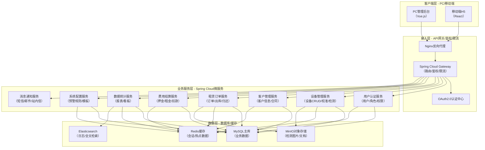
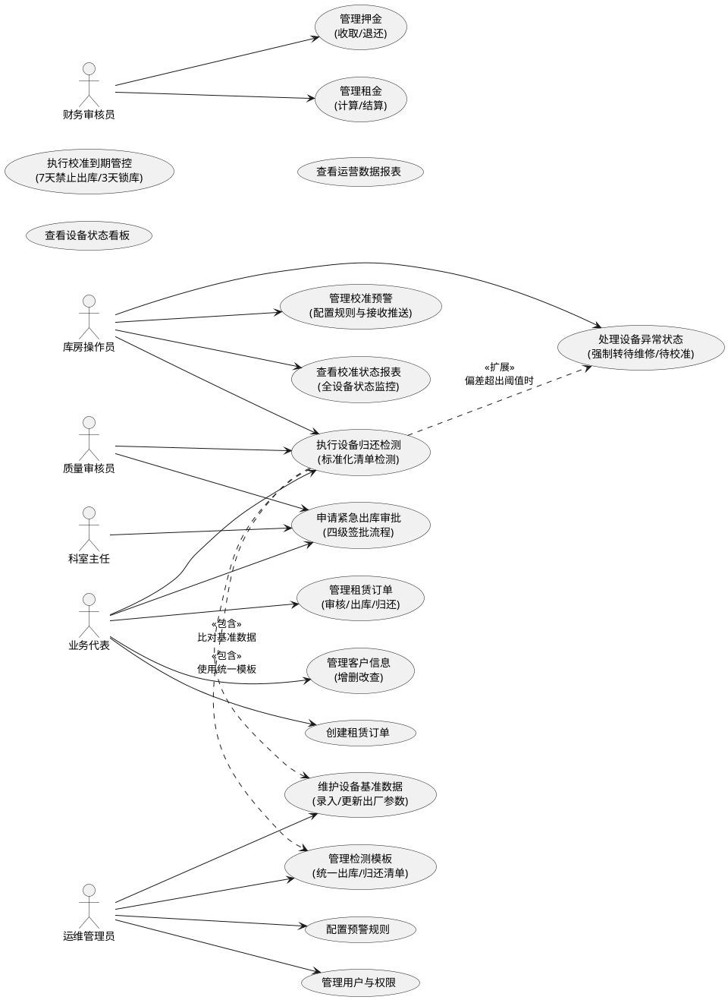
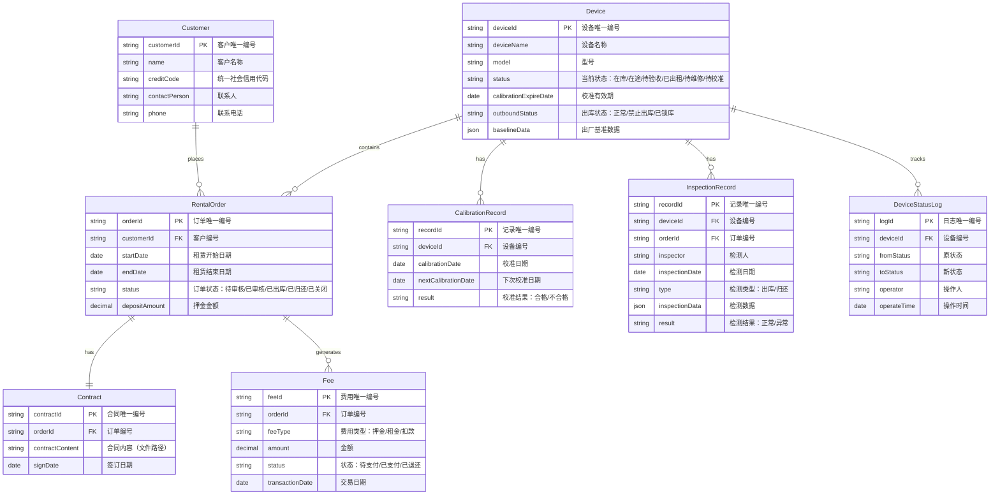
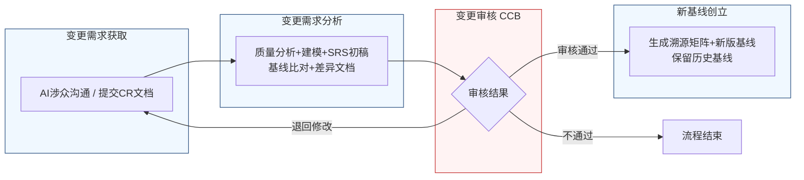

好的，作为一名资深需求分析工程师，我将严格遵循IEEE 830标准和GB/T 9385规范，采用两阶段法为您生成这份完整的软件需求规格说明书（SRS）。我将恪守“精确优先于流畅”的铁律，保留需求清单中的每一个数字、边界条件和约束参数。

---
# 文档头部信息
| 项目项 | 内容 |
| ---- | ---- |
| 文档名称 | 软件需求规格说明书（SRS）|
| 项目名称 | 医疗器械租赁管理系统 |
| 项目编号 | MED-RENTAL-2026 |
| 文档版本 | V1.0.0 |
| 基线版本 | BL-20260626-01 |
| 编制人 | AI基线智能体（A6） |
| 编制日期 | 2026-06-26 |
| 审核人 | CCB变更控制委员会 |
| 批准人 | CCB变更控制委员会 |
| 密级 | 内部 |

## 修订历史记录
| 版本号 | 修订日期 | 修订类型 | 修订内容简述 |
| V1.0.0 | 2026-06-26 | 新建 | 文档初稿，确立初始需求基线 |

# 1 引言
## 1.1 编制目的
本文档旨在明确界定医疗器械租赁管理系统（MED-RENTAL-2026）的功能需求、非功能需求、外部接口需求及数据需求。本文档是项目开发、测试、验收及后续变更管理的核心依据，确保所有干系人对系统应达成的目标有统一、无歧义的理解。本文档的最终目标是指导开发团队构建一个符合业务规范、满足合规要求、具备高可用性和可扩展性的医疗器械租赁管理平台。

## 1.2 文档范围（包含/排除）
**包含范围：**
1.  **功能需求：** 涵盖用户认证、设备管理、客户管理、租赁订单、费用结算、数据统计、系统配置七大模块的详细功能定义。
2.  **非功能需求：** 包括性能、可靠性、安全性、可维护性、可扩展性及易用性等方面的具体要求。
3.  **外部接口需求：** 定义系统与外部系统（如财务系统、短信/邮件网关）的数据交换格式与协议。
4.  **数据需求：** 定义核心数据实体（设备、客户、合同、订单、费用）及其关系，以及数据管理策略。

**排除范围：**
1.  本SRS不包含具体的用户界面（UI）设计细节或原型图。
2.  本SRS不包含详细的测试用例，但会提供可量化的验收标准。
3.  本SRS不包含硬件采购、网络部署等基础设施层面的详细方案。
4.  本SRS不包含与第三方硬件（如RFID读写器）的底层驱动开发细节。

## 1.3 引用文件
1.  GB/T 9385-2008 计算机软件需求规格说明规范
2.  IEEE Std 830-1998 IEEE Recommended Practice for Software Requirements Specifications
3.  《高级软件设计实践》教材书稿
4.  医疗器械租赁管理系统涉众需求调研记录（raw/notes/）
5.  医疗器械租赁管理系统UML建模产物
6.  医疗器械租赁管理系统结构化需求清单

## 1.4 术语与缩略语
| 术语/缩略语 | 定义 |
| :--- | :--- |
| SRS | 软件需求规格说明书 |
| CCB | 变更控制委员会，负责审批需求变更 |
| CR | 变更需求，正式提交的需求变更文档 |
| FR | 功能需求 |
| NFR | 非功能需求 |
| IFR | 外部接口需求 |
| BR | 业务需求 |
| UR | 用户需求 |
| P0 | 优先级0，必须实现的核心功能 |
| P1 | 优先级1，重要功能 |
| P2 | 优先级2，次要功能 |
| 校准 | 对设备进行计量检定，确保其测量或输出值符合标准 |
| 锁库 | 系统自动将设备状态设置为不可出库，阻止任何出库操作 |
| 基准数据 | 设备出厂时测定的各项性能指标，作为后续检测的参照标准 |
| 阈值 | 预设的偏差允许范围，超出此范围则判定为异常 |
| 四级签批 | 由库房主管、质量、销售和财务四个角色依次进行的审批流程 |

## 1.5 业务背景概述
**现状痛点：**
1.  **校准管理失控：** 设备校准状态依赖人工记忆和纸质记录，经常出现校准过期设备被误出库的情况，导致客户拒收和合规风险。
2.  **归还检测不规范：** 设备归还时缺乏标准化流程和客观数据比对，性能衰减或损坏难以被及时发现，责任界定困难，导致维保成本上升。
3.  **紧急出库无通道：** 在客户急需设备的紧急情况下，缺乏一个受控的、可追溯的审批通道来释放校准过期设备，导致业务机会流失。
4.  **信息孤岛：** 设备状态（在库、在途、待验收、已出租）不透明，各角色无法实时掌握全局信息，影响决策效率。

**建设目标：**
1.  **量化目标1：** 将因校准过期导致的设备出库合规风险事件降低至0。
2.  **量化目标2：** 将设备归还检测的标准化率提升至100%，确保每次归还都有完整的检测记录。
3.  **量化目标3：** 建立一套完整的紧急出库审批流程，将紧急情况下的平均响应时间缩短至2小时内。
4.  **量化目标4：** 实现设备全生命周期状态的可视化，使各角色能实时查询任意设备的当前状态。

# 2 总体描述
## 2.1 产品概述（系统定位、核心价值）
**系统定位：** 本系统是一套面向医疗器械租赁企业的全流程、数字化管理平台，旨在通过信息化手段，实现对设备从入库、出库、租赁、归还到报废的全生命周期精细化管理。

**核心价值：**
1.  **合规性保障：** 通过自动化的校准预警、到期锁库和受控的紧急出库流程，确保所有出库设备均符合质量与合规要求。
2.  **运营效率提升：** 通过标准化的归还检测流程、自动化的数据比对和预警推送，减少人工操作和沟通成本，提升整体运营效率。
3.  **风险控制：** 通过强制拦截问题设备、清晰的责任链条和完整的审计日志，有效控制资产损失和业务风险。
4.  **数据驱动决策：** 通过全设备状态监控和数据分析报表，为管理层提供准确、及时的决策依据。

### 系统架构图（Mermaid代码）


## 2.2 运行环境要求
| 环境 | 要求 |
| :--- | :--- |
| **服务器硬件** | CPU：8核及以上；内存：32GB及以上；硬盘：SSD 500GB及以上 |
| **服务器软件** | 操作系统：CentOS 7.9+ / Ubuntu 20.04+；JDK：1.8+；数据库：MySQL 8.0+；缓存：Redis 6.0+；消息队列：RabbitMQ 3.8+ |
| **客户端浏览器** | Chrome 90+、Firefox 88+、Edge 90+、Safari 14+ |
| **移动端** | iOS 13+、Android 10+ |
| **网络** | 服务器带宽：10Mbps+；客户端网络：稳定连接 |

## 2.3 用户角色与特征
| 角色 | 职责 | 核心权限 | 使用频次 | 技能要求 |
| :--- | :--- | :--- | :--- | :--- |
| 库房操作员 | 设备入库、出库、盘点、归还检测、校准预警处理 | 设备状态管理、检测数据录入、预警查看 | 每日多次 | 熟悉设备型号、基本计算机操作 |
| 业务代表 | 客户需求对接、租赁订单创建、紧急出库申请、归还流程触发 | 订单管理、紧急出库申请、归还流程发起 | 每日多次 | 熟悉业务流程、客户沟通技巧 |
| 运维管理员 | 设备基准数据维护、检测模板管理、系统参数配置 | 数据维护、模板管理、系统配置 | 每周数次 | 熟悉设备技术参数、系统管理知识 |
| 质量审核员 | 校准合规审核、紧急出库最终审批、监督检测流程 | 审批、监督、查看报表 | 每日数次 | 熟悉质量体系、合规要求 |
| 财务审核员 | 押金核算、设备残值评估、费用审核 | 查看费用数据、参与审批 | 每日数次 | 熟悉财务制度、成本核算 |
| 系统管理员 | 用户管理、角色权限分配、系统日志审计 | 系统所有管理权限 | 按需 | 高级系统管理技能 |

## 2.4 系统运行模式
1.  **正常模式：** 系统所有功能正常运行，所有用户可正常访问和操作。系统按照预设规则自动执行校准预警、到期锁库、数据比对等任务。
2.  **异常模式：** 当系统检测到关键服务（如数据库、核心微服务）故障时，系统将自动降级或熔断。例如，当消息通知服务不可用时，校准预警将转为站内信提醒；当核心数据库不可用时，系统将展示维护页面，阻止所有写操作。
3.  **维护模式：** 管理员可手动将系统切换至维护模式。在此模式下，所有用户无法登录，系统仅对管理员开放，用于进行数据迁移、版本升级等操作。系统需在维护开始前30分钟向所有在线用户推送维护通知。

## 2.5 设计与实现约束
1.  **技术约束：** 后端必须采用Java语言及Spring Cloud微服务架构；前端必须采用Vue.js或React框架；数据库必须采用MySQL关系型数据库。
2.  **合规约束：** 系统必须满足医疗器械经营质量管理规范（GSP）中对设备追溯、校准管理的相关要求。所有操作日志必须保存至少3年。
3.  **接口约束：** 所有对外接口必须采用RESTful API设计风格，数据交换格式为JSON。接口文档必须使用Swagger/OpenAPI规范。
4.  **工期约束：** 系统核心功能（设备管理、租赁订单、校准预警）必须在项目启动后3个月内完成开发并上线试运行。

## 2.6 假设与依赖
1.  **假设：** 所有设备在入库时，其出厂基准数据已由运维管理员录入系统。
2.  **假设：** 所有用户均已通过公司内部统一身份认证系统（如LDAP）进行身份验证。
3.  **依赖：** 短信/邮件网关服务的可用性，用于发送校准预警和审批通知。
4.  **依赖：** 财务系统提供标准的接口，用于同步押金扣款和租金结算数据。

# 3 具体需求
## 3.1 功能需求（FR）
### 3.1.1 用户认证模块
**FR-AUTH-001：用户登录**
- **优先级：** P0
- **参与角色：** 所有用户
- **前置条件：** 用户账号已在系统中创建并激活。
- **触发方式：** 用户在登录页面输入用户名和密码，点击“登录”按钮。
- **业务流程：**
    1.  系统接收用户输入的用户名和密码。
    2.  系统对密码进行加密处理（如BCrypt）。
    3.  系统将加密后的凭证与数据库中存储的信息进行比对。
    4.  若比对成功，系统生成一个有效期为30分钟的JWT Token，并返回给客户端。
    5.  若比对失败，系统返回错误提示信息。
- **业务规则：**
    1.  连续5次登录失败，该账号将被锁定15分钟。
    2.  密码长度不得少于8位，且必须包含大写字母、小写字母和数字。
- **后置状态：** 用户成功登录系统，获得操作权限。
- **验收标准：** 输入正确的用户名和密码，点击登录后，页面应在2秒内跳转至系统首页。输入错误的密码，系统应在1秒内提示“用户名或密码错误”。
- **关联需求条目：** 无

### 3.1.2 设备管理模块
**FR-EQP-001：管理校准预警**
- **优先级：** P0
- **参与角色：** 库房操作员、运维管理员
- **前置条件：** 设备已入库，且其校准有效期已设定。
- **触发方式：** 系统定时任务（每周一上午9:00）自动触发，或用户手动查看预警列表。
- **业务流程：**
    1.  **系统推送：** 每周一上午9:00，系统自动查询所有在未来30天内校准到期的设备。
    2.  **生成清单：** 系统生成一份“临期设备清单”，包含设备编号、型号、当前状态、校准到期日等信息。
    3.  **推送通知：** 系统通过站内信、短信或邮件，将清单推送给所有库房操作员。
    4.  **单独提醒：** 系统在设备校准到期前30天、15天、7天的当天上午9:00，分别发送一次单独的提醒通知给负责该设备的库房操作员。
    5.  **每日重复：** 在每个提醒时间窗口（30天、15天、7天）内，如果设备状态未更新为“已校准”，系统将在每天上午9:00重复发送提醒，直至设备完成校准。
- **业务规则：**
    1.  预警覆盖的设备状态包括：在库、在途、待验收、已出租。
    2.  提醒方式优先级：站内信 > 短信 > 邮件。系统默认使用站内信，若用户配置了手机号或邮箱，则同时发送短信或邮件。
- **后置状态：** 库房操作员收到预警通知，并安排校准工作。
- **验收标准：**
    1.  每周一上午9:00，系统能准确生成未来30天内到期的设备清单，并推送给所有库房操作员。
    2.  对于校准到期日为2026-06-26的设备，系统应在2026-06-26、7月11日、7月19日的上午9:00各发送一次单独提醒。
    3.  若设备在7月11日仍未校准，系统应在7月12日、7月13日...每天上午9:00重复发送提醒。
- **关联需求条目：** BR-EQP-001, BR-EQP-008, BR-EQP-010

**FR-EQP-002：执行校准到期管控**
- **优先级：** P0
- **参与角色：** 系统（自动执行）、运维管理员（配置参数）
- **前置条件：** 设备已入库，且其校准有效期已设定。
- **触发方式：** 系统定时任务（每日凌晨0:00）自动触发。
- **业务流程：**
    1.  **7天禁止出库：** 系统每日检查所有设备，若发现某设备距离其校准到期日 <= 7天，系统自动将该设备的出库状态设置为“禁止出库”。
    2.  **3天强制锁库：** 若发现某设备距离其校准到期日 <= 3天，系统自动将该设备的出库状态设置为“已锁库”。
    3.  **状态更新：** 系统更新设备状态，并在设备详情页和出库操作界面进行醒目提示。
- **业务规则：**
    1.  “禁止出库”状态下的设备，任何出库操作（包括正常出库和紧急出库申请）均被阻止。
    2.  “已锁库”状态下的设备，正常出库操作被阻止，但可通过“紧急出库审批”流程（FR-EQP-003）申请解锁。
    3.  若设备完成校准并更新了校准有效期，系统自动解除其“禁止出库”或“已锁库”状态。
- **后置状态：** 设备状态被自动更新为“禁止出库”或“已锁库”。
- **验收标准：**
    1.  对于校准到期日为2026-06-26的设备，系统应在2026-06-260:00将其状态自动更新为“禁止出库”。
    2.  对于校准到期日为2026-06-26的设备，系统应在2026-06-260:00将其状态自动更新为“已锁库”。
- **关联需求条目：** BR-EQP-003

**FR-EQP-003：申请紧急出库审批**
- **优先级：** P0
- **参与角色：** 业务代表（发起）、库房主管（审核）、质量审核员（审核）、财务审核员（审核）
- **前置条件：** 设备处于“已锁库”状态。
- **触发方式：** 业务代表在设备详情页或出库申请页，点击“申请紧急出库”按钮。
- **业务流程：**
    1.  **发起申请：** 业务代表填写紧急出库理由、客户信息、所需设备等，提交申请。
    2.  **四级签批：** 系统按照固定顺序将申请依次推送给以下角色进行审批：
        - **第一步：库房主管**。审核设备状态与库存，确认无误后签字。
        - **第二步：质量审核员**。进行安全与合规核查，确认风险可控后签字。
        - **第三步：财务审核员**。评估财务风险，确认押金或费用安排后签字。
        - **第四步：业务代表的上级科室主任**。最终确认业务需求，批准出库。
    3.  **审批结果：**
        - 若任一环节审批不通过，流程终止，系统通知业务代表。
        - 若所有环节均审批通过，系统自动解锁该设备，允许其出库。
    4.  **日志记录：** 系统记录完整的审批日志，包括审批人、审批时间、审批意见。
- **业务规则：**
    1.  审批顺序固定为：库房主管 → 质量审核员 → 财务审核员 → 科室主任。不可随意调换。
    2.  库房主管的签字是必须且不可替代的环节，设备科长不能代替库房主管的意见。
    3.  系统支持“加急”模式，允许审批人在移动端快速处理，但不可跳过任何环节。
- **后置状态：** 设备被解锁，允许出库；或申请被拒绝，设备保持“已锁库”状态。
- **验收标准：**
    1.  业务代表提交申请后，系统应在1分钟内将审批任务推送给库房主管。
    2.  所有四级审批全部通过后，系统应在10秒内自动解锁设备。
    3.  任一环节审批不通过，系统应立即终止流程并通知业务代表。
- **关联需求条目：** BR-EQP-002, BR-EQP-006, BR-EQP-013, BR-EQP-015, BR-EQP-016

**FR-EQP-004：执行设备归还检测**
- **优先级：** P0
- **参与角色：** 业务代表（触发流程）、库房操作员（执行检测）
- **前置条件：** 租赁订单状态为“已出库”，且设备已归还至库房。
- **触发方式：** 业务代表在系统中点击“开始检测”按钮。
- **业务流程：**
    1.  **触发流程：** 业务代表点击“开始检测”，系统创建一个归还检测任务。
    2.  **执行检测：** 库房操作员接收任务，使用与出库检测完全一致的标准化清单进行物理检测（外观、功能、配件等）。
    3.  **录入数据：** 库房操作员在系统中录入各项检测数据。
    4.  **自动比对：** 系统自动获取该设备的出厂基准数据，并计算检测数据与基准数据的偏差。
    5.  **结果判定：**
        - **偏差在阈值内：** 系统允许库房操作员点击“完成收回”，设备状态更新为“在库”。
        - **偏差超出阈值：** 系统弹出警告窗口，显示偏差项目及具体数值，并阻止“完成收回”操作。系统强制要求库房操作员将设备状态转为“待维修”或“待校准”。
- **业务规则：**
    1.  归还检测清单必须与出库检测清单使用同一标准模板，由运维管理员统一维护。
    2.  出厂基准数据由运维管理员预先录入。
    3.  偏差阈值由运维管理员在系统配置中设定，不同检测项可设置不同阈值。
    4.  物理检测由库房操作员执行，业务代表负责流程触发和后续验收确认。
- **后置状态：** 设备状态更新为“在库”、“待维修”或“待校准”。
- **验收标准：**
    1.  业务代表点击“开始检测”后，库房操作员应在1分钟内收到检测任务。
    2.  库房操作员录入检测数据后，系统应在500毫秒内完成与基准数据的比对并返回结果。
    3.  当检测数据偏差超出预设阈值时，系统必须阻止“完成收回”按钮的点击，并弹出警告窗口。
- **关联需求条目：** BR-EQP-004, BR-EQP-005, BR-EQP-007, BR-EQP-009, BR-EQP-011, BR-EQP-012, BR-EQP-014

**FR-EQP-005：维护设备基准数据**
- **优先级：** P1
- **参与角色：** 运维管理员
- **前置条件：** 设备已入库。
- **触发方式：** 运维管理员在设备管理模块中，选择“维护基准数据”。
- **业务流程：**
    1.  运维管理员选择一台设备。
    2.  系统展示该设备当前的基准数据（如传感器灵敏度值、电池容量等）。
    3.  运维管理员可以修改或补充各项基准数据。
    4.  提交后，系统更新该设备的基准数据，并记录操作日志。
- **业务规则：**
    1.  基准数据的修改必须经过二次确认。
    2.  每次修改都会生成一条历史记录，便于追溯。
- **后置状态：** 设备的基准数据被更新。
- **验收标准：** 运维管理员修改基准数据并提交后，系统应在1秒内更新成功，并在设备详情页显示最新数据。
- **关联需求条目：** BR-EQP-004

### 3.1.3 客户管理模块
**FR-CUST-001：客户信息管理**
- **优先级：** P0
- **参与角色：** 业务代表
- **前置条件：** 无
- **触发方式：** 用户在客户管理模块点击“新增客户”或“编辑”。
- **业务流程：**
    1.  用户填写客户基本信息（名称、联系人、联系方式、地址、资质文件等）。
    2.  系统对必填项进行校验。
    3.  提交后，系统保存客户信息，并生成唯一的客户编号。
- **业务规则：**
    1.  客户名称、统一社会信用代码为唯一索引，不可重复。
    2.  客户资质文件（如营业执照）需上传PDF或图片格式，单个文件大小不超过10MB。
- **后置状态：** 客户信息被成功创建或更新。
- **验收标准：** 用户填写完所有必填项并提交后，系统应在2秒内保存成功并返回客户列表页。
- **关联需求条目：** 无

### 3.1.4 租赁订单模块
**FR-ORDER-001：创建租赁订单**
- **优先级：** P0
- **参与角色：** 业务代表
- **前置条件：** 客户信息已存在。
- **触发方式：** 用户在订单管理模块点击“新建订单”。
- **业务流程：**
    1.  业务代表选择客户，填写租赁设备、租赁期限、租金、押金等信息。
    2.  系统校验所选设备的状态是否为“在库”且未被锁定。
    3.  提交后，系统生成一个状态为“待审核”的租赁订单。
- **业务规则：**
    1.  一个订单可以包含多个设备。
    2.  租赁期限不能为过去的时间。
- **后置状态：** 生成一个“待审核”的租赁订单。
- **验收标准：** 用户选择设备并提交后，系统应在2秒内生成订单并跳转至订单详情页。
- **关联需求条目：** 无

### 3.1.5 费用结算模块
**FR-FEE-001：押金管理**
- **优先级：** P1
- **参与角色：** 财务审核员
- **前置条件：** 租赁订单已生成。
- **触发方式：** 用户在订单详情页点击“收取押金”。
- **业务流程：**
    1.  系统展示订单的押金金额。
    2.  财务审核员确认收款方式（银行转账、现金等）并录入收款凭证。
    3.  提交后，系统更新订单的押金状态为“已收取”。
- **业务规则：**
    1.  押金金额必须与订单中的约定一致。
- **后置状态：** 订单押金状态更新为“已收取”。
- **验收标准：** 财务审核员录入收款信息并提交后，系统应在1秒内更新押金状态。
- **关联需求条目：** BR-EQP-014

### 3.1.6 数据统计模块
**FR-STAT-001：设备状态看板**
- **优先级：** P1
- **参与角色：** 所有用户
- **前置条件：** 无
- **触发方式：** 用户登录系统后，默认进入看板页面。
- **业务流程：**
    1.  系统实时统计各类设备状态的数量（在库、在途、待验收、已出租、待维修、待校准）。
    2.  以图表形式展示，并支持按设备类型、品牌等维度进行筛选。
- **业务规则：**
    1.  数据每5分钟刷新一次。
- **后置状态：** 用户看到最新的设备状态统计。
- **验收标准：** 用户登录后，看板页面应在3秒内加载完成，并显示正确的统计数据。
- **关联需求条目：** BR-EQP-001

### 3.1.7 系统配置模块
**FR-CONF-001：预警规则配置**
- **优先级：** P1
- **参与角色：** 运维管理员
- **前置条件：** 无
- **触发方式：** 用户在系统配置模块选择“预警规则配置”。
- **业务流程：**
    1.  运维管理员可以配置校准预警的各个时间节点（如30天、15天、7天）和提醒方式。
    2.  可以配置“禁止出库”和“锁库”的提前天数。
    3.  提交后，系统应用新的配置。
- **业务规则：**
    1.  修改预警规则后，新的规则将在下一个定时任务周期生效。
- **后置状态：** 系统的预警规则被更新。
- **验收标准：** 运维管理员修改预警规则并提交后，系统应在1秒内保存成功。
- **关联需求条目：** BR-EQP-003, BR-EQP-008

### 系统用例图（PlantUML代码）


## 3.2 外部接口需求（IFR）
**IFR-001：短信/邮件网关接口**
- **接口方向：** 系统 -> 外部网关
- **协议：** HTTP/HTTPS
- **数据格式：** JSON
- **接口定义：**
    - `POST /api/v1/send/sms`：发送短信
    - `POST /api/v1/send/email`：发送邮件
- **请求参数示例（短信）：**
  ```json
  {
    "phoneNumbers": ["13800138000"],
    "templateCode": "SMS_123456",
    "templateParam": {"deviceCode": "DEV-001", "expireDate": "2026-06-26"}
  }
  ```
- **响应示例：**
  ```json
  {
    "code": "OK",
    "message": "发送成功",
    "requestId": "12345"
  }
  ```
- **业务规则：**
    1.  短信发送频率限制：同一手机号每分钟不超过1条，每小时不超过5条。
    2.  邮件发送频率限制：同一邮箱每分钟不超过2封，每小时不超过10封。

**IFR-002：财务系统接口**
- **接口方向：** 系统 <-> 财务系统
- **协议：** HTTP/HTTPS
- **数据格式：** JSON
- **接口定义：**
    - `POST /api/v1/finance/deposit`：同步押金收取/退还信息
    - `POST /api/v1/finance/rental`：同步租金结算信息
- **请求参数示例（押金）：**
  ```json
  {
    "orderId": "ORD-20260626-001",
    "customerId": "CUST-001",
    "amount": 10000.00,
    "type": "COLLECT",
    "transactionTime": "2026-06-26 10:00:00"
  }
  ```
- **业务规则：**
    1.  接口调用失败时，系统需进行重试，最多重试3次，间隔5分钟。
    2.  若最终失败，系统需生成告警通知管理员。

## 3.3 非功能需求（NFR）
### 3.3.1 性能需求
1.  **页面加载时间：** 在标准网络环境下（10Mbps带宽），所有核心页面（如设备列表、订单详情）的首次加载时间不得超过3秒。
2.  **接口响应时间：**
    - 简单查询接口（如根据ID查询设备）：95%的请求响应时间不得超过200毫秒。
    - 复杂查询接口（如多条件分页查询订单）：95%的请求响应时间不得超过1秒。
    - 写操作接口（如创建订单、录入检测数据）：95%的请求响应时间不得超过2秒。
3.  **并发能力：** 系统需支持至少200个用户同时在线操作，且核心接口的响应时间不因此显著下降（下降幅度不超过20%）。
4.  **吞吐量：** 系统需支持至少每秒处理100个核心业务请求（TPS）。

### 3.3.2 可靠性需求
1.  **可用率：** 系统在7x24小时运行模式下，年度可用率不低于99.9%（即全年停机时间不超过8.76小时）。
2.  **连续运行：** 系统应能连续运行7*24小时无故障。
3.  **故障恢复：** 当系统发生故障时，核心服务（如设备管理、订单服务）的恢复时间目标（RTO）不得超过30分钟，数据恢复点目标（RPO）不得超过5分钟。

### 3.3.3 安全性需求
1.  **认证与授权：** 所有用户必须通过用户名/密码或OAuth2.0方式进行身份认证。系统采用基于角色的访问控制（RBAC）模型，确保用户只能访问其权限范围内的功能和数据。
2.  **数据加密：** 用户密码等敏感信息在传输和存储时必须进行加密（如BCrypt）。所有与外部系统的接口通信必须使用HTTPS协议。
3.  **攻击防护：** 系统需具备基本的防SQL注入、防XSS跨站脚本攻击、防CSRF跨站请求伪造的能力。
4.  **审计日志：** 所有关键操作（如登录、创建/修改/删除数据、审批、出库、归还）必须记录完整的审计日志，包括操作人、操作时间、操作IP、操作内容。日志保存期限不少于3年。

### 3.3.4 可维护性需求
1.  **日志系统：** 系统需采用统一的日志框架（如Logback），日志级别可动态调整。关键业务操作需有独立的业务日志。
2.  **监控告警：** 系统需集成应用性能监控（APM）工具，对核心服务的CPU、内存、响应时间等指标进行监控，并在指标异常时触发告警。
3.  **配置管理：** 系统配置（如数据库连接、预警规则）应支持外部化配置，并支持在不重启服务的情况下动态刷新。

### 3.3.5 可扩展性需求
1.  **水平扩展：** 业务服务层（微服务）应支持无状态水平扩展。当业务量增长时，可通过增加服务实例来提升系统处理能力。
2.  **模块化设计：** 系统应采用模块化设计，各模块之间低耦合。新增业务功能时，应能通过增加新的微服务或扩展现有服务来实现，而不影响其他模块。

### 3.3.6 易用性需求
1.  **操作一致性：** 系统中相似的操作（如新增、编辑、删除）应保持一致的交互方式和界面布局。
2.  **错误提示：** 当用户操作失败时，系统应提供清晰、具体的错误提示信息，并指导用户如何修正。
3.  **帮助文档：** 系统应提供在线帮助文档，对核心功能和操作流程进行说明。

## 3.4 数据需求
### E-R图（Mermaid erDiagram）


### 数据字典（完整表格）
| 表名 | 字段名 | 类型 | 主键 | 外键 | 默认值 | 说明 |
| :--- | :--- | :--- | :--- | :--- | :--- | :--- |
| Device | deviceId | VARCHAR(50) | Y | N | | 设备唯一编号 |
| Device | deviceName | VARCHAR(100) | N | N | | 设备名称 |
| Device | model | VARCHAR(50) | N | N | | 型号 |
| Device | status | VARCHAR(20) | N | N | '在库' | 当前状态 |
| Device | calibrationExpireDate | DATE | N | N | | 校准有效期 |
| Device | outboundStatus | VARCHAR(20) | N | N | '正常' | 出库状态 |
| Device | baselineData | JSON | N | N | | 出厂基准数据 |
| Customer | customerId | VARCHAR(50) | Y | N | | 客户唯一编号 |
| Customer | name | VARCHAR(100) | N | N | | 客户名称 |
| Customer | creditCode | VARCHAR(18) | N | N | | 统一社会信用代码 |
| Customer | contactPerson | VARCHAR(50) | N | N | | 联系人 |
| Customer | phone | VARCHAR(20) | N | N | | 联系电话 |
| RentalOrder | orderId | VARCHAR(50) | Y | N | | 订单唯一编号 |
| RentalOrder | customerId | VARCHAR(50) | N | Y | | 客户编号 |
| RentalOrder | startDate | DATE | N | N | | 租赁开始日期 |
| RentalOrder | endDate | DATE | N | N | | 租赁结束日期 |
| RentalOrder | status | VARCHAR(20) | N | N | '待审核' | 订单状态 |
| RentalOrder | depositAmount | DECIMAL(10,2) | N | N | 0.00 | 押金金额 |
| Contract | contractId | VARCHAR(50) | Y | N | | 合同唯一编号 |
| Contract | orderId | VARCHAR(50) | N | Y | | 订单编号 |
| Contract | contractContent | TEXT | N | N | | 合同内容（文件路径） |
| Contract | signDate | DATE | N | N | | 签订日期 |
| Fee | feeId | VARCHAR(50) | Y | N | | 费用唯一编号 |
| Fee | orderId | VARCHAR(50) | N | Y | | 订单编号 |
| Fee | feeType | VARCHAR(20) | N | N | | 费用类型 |
| Fee | amount | DECIMAL(10,2) | N | N | 0.00 | 金额 |
| Fee | status | VARCHAR(20) | N | N | '待支付' | 状态 |
| Fee | transactionDate | DATETIME | N | N | | 交易日期 |
| CalibrationRecord | recordId | VARCHAR(50) | Y | N | | 记录唯一编号 |
| CalibrationRecord | deviceId | VARCHAR(50) | N | Y | | 设备编号 |
| CalibrationRecord | calibrationDate | DATE | N | N | | 校准日期 |
| CalibrationRecord | nextCalibrationDate | DATE | N | N | | 下次校准日期 |
| CalibrationRecord | result | VARCHAR(10) | N | N | | 校准结果 |
| InspectionRecord | recordId | VARCHAR(50) | Y | N | | 记录唯一编号 |
| InspectionRecord | deviceId | VARCHAR(50) | N | Y | | 设备编号 |
| InspectionRecord | orderId | VARCHAR(50) | N | Y | | 订单编号 |
| InspectionRecord | inspector | VARCHAR(50) | N | N | | 检测人 |
| InspectionRecord | inspectionDate | DATETIME | N | N | | 检测日期 |
| InspectionRecord | type | VARCHAR(10) | N | N | | 检测类型 |
| InspectionRecord | inspectionData | JSON | N | N | | 检测数据 |
| InspectionRecord | result | VARCHAR(10) | N | N | | 检测结果 |
| DeviceStatusLog | logId | VARCHAR(50) | Y | N | | 日志唯一编号 |
| DeviceStatusLog | deviceId | VARCHAR(50) | N | Y | | 设备编号 |
| DeviceStatusLog | fromStatus | VARCHAR(20) | N | N | | 原状态 |
| DeviceStatusLog | toStatus | VARCHAR(20) | N | N | | 新状态 |
| DeviceStatusLog | operator | VARCHAR(50) | N | N | | 操作人 |
| DeviceStatusLog | operateTime | DATETIME | N | N | CURRENT_TIMESTAMP | 操作时间 |

### 数据管理策略
1.  **备份策略：**
    - 每日凌晨2:00进行全量数据库备份。
    - 每4小时进行一次增量备份。
    - 备份文件保留30天。
2.  **归档策略：**
    - 对于超过3年的历史订单和审计日志，系统自动将其从主库迁移至归档库。
    - 归档操作每月执行一次。
3.  **数据留存：**
    - 核心业务数据（设备、客户、订单）永久保存。
    - 审计日志至少保存3年。
    - 操作日志至少保存1年。

# 4 需求基线与变更管理
## 4.1 需求基线定义
1.  **基线版本格式：** `BL-YYYYMMDD-NN`（YYYYMMDD=日期，NN=当日流水号）。
2.  **初始基线：** 经CCB审批通过、正式发布的第一版SRS，即本文档，基线号为 `BL-20260626-01`。
3.  **基线冻结：** 基线发布后，禁止无流程私自修改需求。任何对基线中需求的修改、新增或删除，都必须遵循本章节定义的变更流程。

## 4.2 需求变更整体流程


## 4.3 变更详细流程（四阶段）
### 4.3.1 阶段一：变更需求获取
**途径一：AI涉众沟通。** AI基线智能体（A6）定期与涉众进行结构化沟通，识别新的需求或对现有需求的修改意见，并自动生成变更需求草稿。
**途径二：正式CR文档。** 任何干系人可填写正式的变更需求文档（CR），详细描述变更内容、理由、影响范围及预期收益，并提交至CCB。

### 4.3.2 阶段二：变更需求分析（4个子阶段）
1.  **需求质量分析：** 由A6对变更需求进行校验，检查其合理性、完整性、无歧义性，并与现有需求基线进行冲突检测。
2.  **项目建模：** 根据变更需求，更新相关的UML用例图、活动图、E-R图等模型。
3.  **SRS初稿生成：** A6基于分析结果，整合生成一份包含变更内容的SRS初稿。
4.  **基线比对：** A6自动读取当前生效的需求基线，生成一份需求差异文档，清晰标注新增、修改、删除的需求条目。

### 4.3.3 阶段三：变更审核（CCB评审）
CCB召开评审会议，对变更需求、分析结果、SRS初稿及差异文档进行审议。
1.  **审核不通过：** 流程终止，变更需求被驳回，并记录驳回理由。
2.  **审核退回修改：** 变更需求被打回至阶段一，要求补充或修改内容。
3.  **审核通过：** 进入新基线创立环节。

### 4.3.4 阶段四：新基线创立
1.  **生成需求溯源矩阵（RTM）：** A6自动生成RTM，建立变更前后需求条目的映射关系，确保所有需求均可追溯。
2.  **发布新基线：** 将审核通过的SRS定为新的正式基线，并按照版本规则生成新的基线编号（如 `BL-20260701-01`）。
3.  **历史基线归档：** 旧版基线文档完整归档，不覆盖、不删除，以备后续查阅。

## 4.4 变更记录台账
| 变更编号 | 变更日期 | 申请人 | 变更来源(AI/CR) | 变更简述 | 影响模块 | CCB结论 | 新版基线号 |
| :--- | :--- | :--- | :--- | :--- | :--- | :--- | :--- |
| — | — | — | 初始基线 | 初始基线，无历史变更 | — | 通过 | BL-20260626-01 |

# 5 附录
## 附录A 全量图表汇总
- **系统架构图：** 见 §2.1
- **系统用例图：** 见 §3.1
- **E-R图：** 见 §3.4
- **变更流程图：** 见 §4.2

## 附录B 验收标准总表
| 需求编号 | 需求名称 | 验收标准 | 优先级 |
| :--- | :--- | :--- | :--- |
| FR-EQP-001 | 管理校准预警 | 1. 每周一上午9:00，系统能准确生成未来30天内到期的设备清单，并推送给所有库房操作员。2. 对于校准到期日为2026-06-26的设备，系统应在2026-06-26、7月11日、7月19日的上午9:00各发送一次单独提醒。3. 若设备在7月11日仍未校准，系统应在7月12日、7月13日...每天上午9:00重复发送提醒。 | P0 |
| FR-EQP-002 | 执行校准到期管控 | 1. 对于校准到期日为2026-06-26的设备，系统应在2026-06-260:00将其状态自动更新为“禁止出库”。2. 对于校准到期日为2026-06-26的设备，系统应在2026-06-260:00将其状态自动更新为“已锁库”。 | P0 |
| FR-EQP-003 | 申请紧急出库审批 | 1. 业务代表提交申请后，系统应在1分钟内将审批任务推送给库房主管。2. 所有四级审批全部通过后，系统应在10秒内自动解锁设备。3. 任一环节审批不通过，系统应立即终止流程并通知业务代表。 | P0 |
| FR-EQP-004 | 执行设备归还检测 | 1. 业务代表点击“开始检测”后，库房操作员应在1分钟内收到检测任务。2. 库房操作员录入检测数据后，系统应在500毫秒内完成与基准数据的比对并返回结果。3. 当检测数据偏差超出预设阈值时，系统必须阻止“完成收回”按钮的点击，并弹出警告窗口。 | P0 |

## 附录C 参考资料与外部文档链接
1.  GB/T 9385-2008 计算机软件需求规格说明规范
2.  IEEE 830 软件需求规格说明书标准
3.  《高级软件设计实践》教材书稿
4.  医疗器械租赁管理系统涉众需求调研记录（raw/notes/）
5.  医疗器械租赁管理系统UML建模产物
6.  医疗器械租赁管理系统结构化需求清单